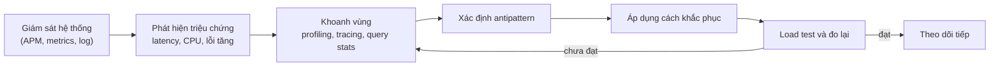
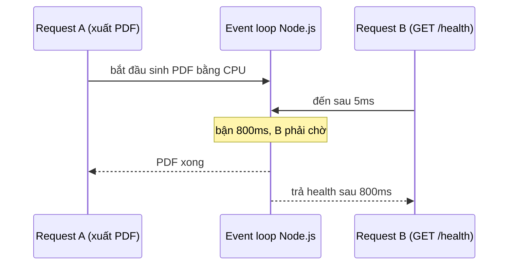
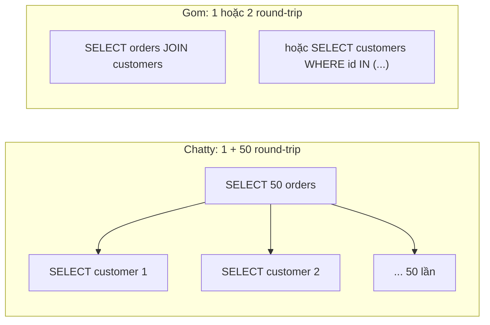

# Performance Antipatterns (phần 1)

**Performance antipattern** (phản mẫu hiệu năng) là những cách thiết kế hoặc viết code **nhìn qua thì hợp lý, chạy tốt khi ít tải**, nhưng khi hệ thống lớn lên lại trở thành nguyên nhân gây chậm, tốn tài nguyên hoặc sập. Roadmap system design lấy danh sách này từ bộ tài liệu **Performance antipatterns for cloud applications** của **Microsoft Azure Architecture Center**. Phần 1 đi qua năm antipattern: **Busy Database**, **Busy Front End**, **Chatty I/O**, **Extraneous Fetching** và **Improper Instantiation**.

**Tương tự đơn giản:** Một nhà hàng vận hành ổn với 10 bàn, nhưng khi lên 100 bàn thì lộ hết thói quen xấu: bếp trưởng vừa nấu vừa tự rửa bát (**Busy Database** -- bắt thành phần đắt nhất làm việc lặt vặt), phục vụ đứng chờ món trong bếp thay vì đi nhận order (**Busy Front End**), mỗi lần lấy một cái thìa từ kho (**Chatty I/O**), bưng cả nồi lẩu ra trong khi khách chỉ gọi một bát (**Extraneous Fetching**), và mỗi order lại mua một cái bếp ga mới (**Improper Instantiation**).

---

:::note[Ghi nhớ nhanh]

- ⭐ **Antipattern thường "vô hại" khi ít tải** — chỉ lộ ra dưới tải thật; phải **đo** (APM, profiling, load test) chứ không đoán.
- ⭐ **Chatty I/O và Extraneous Fetching là cặp đôi hay gặp nhất** — quá nhiều lời gọi nhỏ (N+1) hoặc lấy quá nhiều dữ liệu (`SELECT *`, không phân trang).
- **Busy Database:** đẩy logic xử lý/định dạng nặng vào DB (stored procedure, XML/JSON formatting) làm DB -- thành phần khó scale nhất -- thành nút cổ chai.
- **Busy Front End:** chạy tác vụ nặng trên thread/tiến trình phục vụ request; với Node.js là chặn event loop.
- **Improper Instantiation:** tạo mới mỗi lần những object được thiết kế để dùng chung (HTTP client, DB pool, SDK client) → cạn socket, cạn kết nối.
- Quy trình chung: **phát hiện bằng số liệu → tìm nguyên nhân → sửa → đo lại để xác nhận**.

:::

---

## Mục lục

- [Vì sao cần biết Performance Antipatterns?](#vì-sao-cần-biết-performance-antipatterns)
- [1. Performance Antipatterns là gì?](#1-performance-antipatterns-là-gì)
- [2. Busy Database](#2-busy-database)
- [3. Busy Front End](#3-busy-front-end)
- [4. Chatty I/O](#4-chatty-io)
- [5. Extraneous Fetching](#5-extraneous-fetching)
- [6. Improper Instantiation](#6-improper-instantiation)
- [7. Tổng kết phần 1](#7-tổng-kết-phần-1)
- [Khi nào dùng?](#khi-nào-dùng)
- [Lỗi thường gặp](#lỗi-thường-gặp)
- [Câu hỏi phỏng vấn](#câu-hỏi-phỏng-vấn)

---

## Vì sao cần biết Performance Antipatterns?

**Vấn đề:** Phần lớn sự cố hiệu năng không đến từ thuật toán phức tạp mà đến từ những thói quen nhỏ lặp lại hàng triệu lần: một vòng lặp gọi DB, một `SELECT *`, một `new HttpClient()` trong mỗi request. Khi traffic thấp, chúng ẩn mình. Khi traffic tăng 10 lần, latency tăng 100 lần, DB CPU 100%, và đội ngũ chỉ biết "thêm máy" -- tốn tiền mà không hết.

**Giải pháp:** Học thuộc **danh mục antipattern** đã được ghi nhận, biết **dấu hiệu nhận biết** qua metrics và **cách khắc phục** chuẩn. Trong phỏng vấn system design, chỉ ra được antipattern trong thiết kế của chính mình (và cách tránh) là điểm cộng lớn.

:::tip[Dùng thực tế]

- **N+1 query trong ORM** (Hibernate, Sequelize, Prisma, ActiveRecord) là nguyên nhân chậm số 1 của nhiều web app; công cụ như Bullet (Rails) sinh ra chỉ để bắt nó.
- **Socket exhaustion vì tạo HttpClient mỗi request** là sự cố kinh điển của .NET, đến mức Microsoft bổ sung `IHttpClientFactory`.
- **Chặn event loop Node.js** bằng `JSON.parse` payload lớn, `bcrypt` đồng bộ, regex thảm hoạ (ReDoS) -- từng gây sự cố ở nhiều dịch vụ lớn.
- **Busy Database:** các hệ thống ERP/legacy dồn nghiệp vụ vào stored procedure, khi cần scale chỉ còn cách mua máy DB to hơn.

:::

---

## 1. Performance Antipatterns là gì?

Azure Architecture Center liệt kê **10 antipattern** thường gặp ở ứng dụng cloud. Bài này (phần 1) và phần 2 sẽ đi qua toàn bộ:

| Antipattern | Một câu mô tả | Bài |
| --- | --- | --- |
| Busy Database | Đẩy quá nhiều xử lý vào database | Phần 1 |
| Busy Front End | Tác vụ nặng chạy trên thread phục vụ request | Phần 1 |
| Chatty I/O | Quá nhiều request I/O nhỏ | Phần 1 |
| Extraneous Fetching | Lấy nhiều dữ liệu hơn cần | Phần 1 |
| Improper Instantiation | Tạo mới liên tục object nên dùng chung | Phần 1 |
| Monolithic Persistence | Mọi loại dữ liệu dồn vào một kho | Phần 2 |
| No Caching | Không cache dữ liệu đọc nhiều, ít đổi | Phần 2 |
| Noisy Neighbor | Một tenant chiếm hết tài nguyên dùng chung | Phần 2 |
| Retry Storm | Retry dồn dập làm sập service đang yếu | Phần 2 |
| Synchronous I/O | Chặn thread chờ I/O | Phần 2 |

Quy trình xử lý chung mà Azure đề xuất cho mỗi antipattern:



Công cụ phát hiện hay dùng: **APM** (Datadog, New Relic, Azure Application Insights, Elastic APM), **distributed tracing** (OpenTelemetry + Jaeger/Tempo), **thống kê query** (`pg_stat_statements`, MySQL slow query log), **profiler** (clinic.js / `--cpu-prof` cho Node, async-profiler cho JVM), và **load test** (k6, Gatling, JMeter).

---

## 2. Busy Database

### Mô tả

Database có thể chạy code: stored procedure, trigger, function, định dạng JSON/XML, xử lý chuỗi, tính toán phức tạp. Đẩy logic xuống DB nghe có vẻ hiệu quả ("gần dữ liệu, đỡ truyền mạng"), nhưng DB là thành phần **dùng chung** và **khó scale ngang nhất** của hệ thống. Khi nó vừa lưu trữ vừa làm "application server", mọi request đều tranh nhau CPU của DB.

Ví dụ Azure đưa ra: một stored procedure tạo báo cáo đơn hàng dạng **XML** ngay trong SQL -- truy vấn dữ liệu, rồi định dạng, nối chuỗi, chuyển đổi tiền tệ trong DB.

### Dấu hiệu nhận biết

- CPU/IO của DB cao bất thường trong khi app server nhàn rỗi.
- Query chậm thường là stored procedure dài, có nhiều xử lý chuỗi, `FOR XML`/`json_agg` lớn, cursor, vòng lặp.
- Throughput giảm khi tăng tải dù đã scale app server.
- Trên cloud DB (Azure SQL, RDS): chạm giới hạn DTU/vCPU, bị throttle.

### Cách khắc phục

- **Chuyển xử lý sang tầng ứng dụng:** DB chỉ trả dữ liệu thô đã lọc; app định dạng, tính toán, render (app server scale ngang dễ dàng).
- Giữ ở DB những việc DB làm tốt: **lọc, join, aggregate có index** -- không phải mọi thứ đều nên rút ra.
- Cân nhắc **tính toán trước** (materialized view, bảng tổng hợp cập nhật theo lịch) cho báo cáo nặng.
- Đẩy báo cáo sang **read replica** hoặc kho dữ liệu riêng (data warehouse).

### Code sai / đúng

```sql
-- SAI: DB vừa truy vấn vừa định dạng, nối chuỗi, đổi tiền tệ cho từng dòng
CREATE OR REPLACE FUNCTION order_report_html(p_customer BIGINT) RETURNS TEXT AS $$
DECLARE
  html TEXT := '<table>';
  r RECORD;
BEGIN
  FOR r IN SELECT o.id, o.total, o.currency, o.created_at FROM orders o WHERE o.customer_id = p_customer LOOP
    html := html || '<tr><td>' || r.id || '</td><td>'
         || to_char(convert_currency(r.total, r.currency, 'VND'), 'FM999,999,999') || '</td><td>'
         || to_char(r.created_at, 'DD/MM/YYYY') || '</td></tr>';
  END LOOP;
  RETURN html || '</table>';
END;
$$ LANGUAGE plpgsql;
```

```ts
// ĐÚNG: DB chỉ lọc + trả cột cần thiết; định dạng ở app (scale ngang được)
const { rows } = await db.query(
  'SELECT id, total, currency, created_at FROM orders WHERE customer_id = $1 ORDER BY created_at DESC LIMIT 100',
  [customerId],
);

const rates = await fxRateCache.get(); // tỉ giá cache trong bộ nhớ/Redis
const vnd = new Intl.NumberFormat('vi-VN');
const report = rows.map((r) => ({
  id: r.id,
  totalVnd: vnd.format(Math.round(r.total * rates[r.currency])),
  date: new Date(r.created_at).toLocaleDateString('vi-VN'),
}));
```

---

## 3. Busy Front End

### Mô tả

**Front end** ở đây là tầng tiếp nhận request (web/API server), không phải UI. Antipattern xảy ra khi tác vụ **tốn CPU hoặc tốn thời gian** (resize ảnh, sinh PDF, mã hoá, nén, tính toán lớn) chạy **ngay trên thread/tiến trình phục vụ request**. Thread bị chiếm lâu → các request khác phải xếp hàng → latency của **mọi** endpoint tăng, kể cả endpoint nhẹ.

Với Node.js, vấn đề còn nặng hơn: chỉ có **một event loop**; một tác vụ CPU 200ms là **200ms toàn bộ server không phản hồi** bất kỳ request nào.



### Dấu hiệu nhận biết

- Latency tăng đồng loạt ở mọi endpoint khi một vài endpoint nặng được gọi nhiều.
- CPU app server cao, **event loop lag** (Node) hoặc thread pool cạn (Java, .NET).
- Health check timeout dù service "vẫn sống" → orchestrator restart pod oan.
- Profiler chỉ ra hàm CPU-bound (hash, nén, regex, serialize) trong handler.

### Cách khắc phục

- **Đẩy tác vụ nặng ra background:** API nhận yêu cầu, đưa vào **queue**, trả `202 Accepted`; **worker** riêng (tiến trình, máy, hoặc serverless function) xử lý (xem bài Asynchronism).
- Trong Node.js, việc CPU ngắn nhưng cần kết quả ngay: dùng **worker_threads** (pool như Piscina) để không chặn event loop.
- Tách **front end và back end** thành deployment riêng để scale độc lập.
- Dùng phiên bản **async** của API (ví dụ `bcrypt.hash` thay vì `hashSync`, `zlib.gzip` thay vì `gzipSync`).

### Code sai / đúng

```ts
// SAI: sinh PDF + resize ảnh ngay trong handler, chặn event loop
app.post('/invoices/:id/pdf', async (req, res) => {
  const invoice = await invoiceRepo.get(req.params.id);
  const pdf = renderPdfSync(invoice);          // CPU nặng, đồng bộ
  const thumb = resizeImageSync(pdf.preview);  // CPU nặng, đồng bộ
  res.type('application/pdf').send(pdf.buffer);
});
```

```ts
// ĐÚNG (cách 1): tác vụ dài -> queue + worker riêng, trả 202
app.post('/invoices/:id/pdf', async (req, res) => {
  const job = await pdfQueue.add('render', { invoiceId: req.params.id }, { jobId: `pdf:${req.params.id}` });
  res.status(202).location(`/jobs/${job.id}`).json({ jobId: job.id });
});

// ĐÚNG (cách 2): tác vụ CPU ngắn cần kết quả ngay -> worker thread pool
import Piscina from 'piscina';
const pool = new Piscina({ filename: new URL('./hash-worker.js', import.meta.url).href, maxThreads: 4 });

app.post('/checksum', async (req, res) => {
  const digest = await pool.run({ data: req.body.data }); // chạy trên thread khác, event loop rảnh
  res.json({ digest });
});
```

---

## 4. Chatty I/O

### Mô tả

**Chatty I/O** ("I/O lắm lời"): ứng dụng thực hiện **rất nhiều request I/O nhỏ** (gọi DB, gọi API, đọc file) thay vì ít request lớn hơn. Mỗi lời gọi đều có **chi phí cố định**: round-trip mạng (0,5--1ms trong cùng datacenter, hàng chục--trăm ms qua Internet), serialize, xác thực, mở/đóng. Nhân với hàng trăm lời gọi mỗi request là latency bùng nổ.

Ba dạng hay gặp:

1. **N+1 query:** đọc danh sách N bản ghi rồi lặp để đọc dữ liệu liên quan từng bản ghi.
2. **API "mịn" quá mức:** `GET /users/1/name`, `GET /users/1/email`... mỗi thuộc tính một lời gọi.
3. **Ghi/đọc file từng chút:** ghi log từng dòng nhỏ bằng nhiều lệnh I/O đồng bộ, đọc file từng byte.



Ước lượng: 50 round-trip x 1ms = 50ms chỉ cho mạng, chưa tính thời gian DB. Nếu DB ở region khác (RTT 30ms) thì thành 1,5 giây.

### Dấu hiệu nhận biết

- Trace cho thấy một request sinh **hàng chục--hàng trăm span DB/HTTP** giống nhau.
- `pg_stat_statements` có câu query đơn giản (`SELECT ... WHERE id = $1`) với số lần gọi khổng lồ.
- Latency tăng tuyến tính theo kích thước danh sách trả về.
- Bật log SQL của ORM thấy cùng câu lặp lại liên tục.

### Cách khắc phục

- **Gom request:** `JOIN`, `WHERE id IN (...)`/`= ANY($1)`, eager loading của ORM (`include`, `JOIN FETCH`, `select_related`).
- **API batch / coarse-grained:** `GET /users?ids=1,2,3`, endpoint trả đủ dữ liệu cho một màn hình (BFF), GraphQL + DataLoader.
- **Ghi theo lô:** bulk insert, buffer log rồi flush, pipeline Redis (`MULTI`/pipeline).
- Nhưng đừng gom quá mức thành **Extraneous Fetching** -- cân bằng giữa số lời gọi và lượng dữ liệu.

### Code sai / đúng

```ts
// SAI: N+1 -- 1 query lấy đơn, rồi mỗi đơn 1 query lấy khách hàng
const orders = await db.query('SELECT id, customer_id, total FROM orders WHERE status = $1 LIMIT 50', ['paid']);
for (const o of orders.rows) {
  const c = await db.query('SELECT name FROM customers WHERE id = $1', [o.customer_id]);
  o.customerName = c.rows[0].name; // vừa N+1, vừa mutate object
}
```

```ts
// ĐÚNG (cách 1): một câu JOIN
const { rows } = await db.query(
  `SELECT o.id, o.total, c.name AS customer_name
   FROM orders o JOIN customers c ON c.id = o.customer_id
   WHERE o.status = $1
   LIMIT 50`,
  ['paid'],
);

// ĐÚNG (cách 2): 2 query, gom id rồi tra theo lô
const orders = (await db.query('SELECT id, customer_id, total FROM orders WHERE status = $1 LIMIT 50', ['paid'])).rows;
const ids = [...new Set(orders.map((o) => o.customer_id))];
const customers = (await db.query('SELECT id, name FROM customers WHERE id = ANY($1)', [ids])).rows;
const nameById = new Map(customers.map((c) => [c.id, c.name]));
const result = orders.map((o) => ({ ...o, customerName: nameById.get(o.customer_id) }));
```

Với ORM (Prisma) -- eager loading:

```ts
const orders = await prisma.order.findMany({
  where: { status: 'paid' },
  take: 50,
  select: { id: true, total: true, customer: { select: { name: true } } }, // 1 lần gom
});
```

---

## 5. Extraneous Fetching

### Mô tả

**Extraneous Fetching** (lấy dữ liệu thừa): ứng dụng lấy **nhiều dữ liệu hơn cần** cho thao tác hiện tại -- thừa **cột** (`SELECT *` có cột `TEXT`/`BLOB` lớn), thừa **dòng** (tải cả bảng rồi lọc/đếm trong code), hoặc tải trước dữ liệu "có thể sẽ cần". Hậu quả: tốn I/O của DB, băng thông mạng, bộ nhớ và CPU deserialize ở app, đặc biệt nặng khi dữ liệu lớn dần theo thời gian.

Dạng phổ biến:

- `SELECT *` khi chỉ cần 3 cột.
- Tải toàn bộ danh sách để **đếm**, **tính tổng**, **lọc**, **sắp xếp** trong code thay vì trong DB.
- Không phân trang: `GET /products` trả 50.000 sản phẩm.
- ORM lazy/eager loading sai: tải kèm cả quan hệ không dùng tới.
- API REST trả object "béo" cho mọi client (over-fetching).

### Dấu hiệu nhận biết

- Response size lớn bất thường; mobile tải chậm trên mạng yếu.
- App server tốn nhiều bộ nhớ, GC thường xuyên khi xử lý một số endpoint.
- Query trả về số dòng lớn (`rows returned` cao) trong khi UI chỉ hiển thị vài dòng.
- Latency tăng dần theo thời gian khi bảng lớn lên, dù traffic không đổi.

### Cách khắc phục

- **Chỉ chọn cột cần** (`SELECT id, name, price`), dùng projection của ORM.
- **Đẩy lọc, đếm, tổng, sắp xếp, phân trang xuống DB** (có index) -- DB làm việc này hiệu quả hơn nhiều so với tải về rồi xử lý. (Lưu ý ranh giới với Busy Database: lọc/aggregate có index là việc của DB; định dạng, xử lý nghiệp vụ nặng thì không.)
- **Phân trang bắt buộc** với giới hạn tối đa (`limit` không quá 100), ưu tiên cursor pagination.
- Cho client chọn field (sparse fieldsets `?fields=id,name`, GraphQL).
- Nén response (`gzip`, `br`).

### Code sai / đúng

```ts
// SAI: tải mọi sản phẩm (kể cả cột description, images JSON lớn) để đếm và lấy top 10
const all = await db.query('SELECT * FROM products');
const inStock = all.rows.filter((p) => p.stock > 0);
const total = inStock.length;
const top10 = inStock.sort((a, b) => b.sold - a.sold).slice(0, 10);
```

```ts
// ĐÚNG: DB lọc, đếm, sắp xếp, giới hạn; chỉ trả cột cần
const [{ rows: countRows }, { rows: top10 }] = await Promise.all([
  db.query('SELECT count(*)::int AS total FROM products WHERE stock > 0'),
  db.query('SELECT id, name, price FROM products WHERE stock > 0 ORDER BY sold DESC LIMIT 10'),
]);
const total = countRows[0].total;
```

```sql
-- Index hỗ trợ truy vấn top bán chạy còn hàng
CREATE INDEX idx_products_instock_sold ON products (sold DESC) WHERE stock > 0;
```

---

## 6. Improper Instantiation

### Mô tả

Một số object được thiết kế để **khởi tạo một lần và dùng chung** suốt vòng đời ứng dụng: HTTP client có connection pool, DB connection pool, client của Redis/Kafka/S3/Service Bus, logger, compiled regex/template. Khởi tạo chúng tốn kém (mở kết nối TCP + TLS, xác thực, cấp phát buffer). **Improper Instantiation** là việc **tạo mới chúng cho mỗi request** (rồi huỷ), dẫn tới:

- Lặp lại chi phí bắt tay TCP/TLS cho mỗi request.
- **Cạn socket/port** (socket ở TIME_WAIT sau khi đóng), cạn kết nối DB (`too many connections`).
- Tốn CPU và bộ nhớ cho khởi tạo + GC.

Ví dụ kinh điển Azure nêu: tạo `HttpClient` mới cho mỗi request trong .NET; tạo client Azure Service Bus/Redis mỗi lần gọi.

### Dấu hiệu nhận biết

- Lỗi `EADDRNOTAVAIL`, `ECONNRESET`, `too many connections`, `SocketException` khi tải tăng.
- Số kết nối TCP mở tới DB/Redis/upstream tăng theo số request thay vì ổn định.
- `netstat`/`ss` thấy hàng nghìn socket TIME_WAIT.
- Profiler cho thấy nhiều thời gian trong constructor/connect/TLS handshake.

### Cách khắc phục

- **Singleton / dùng chung theo tiến trình:** khởi tạo một lần lúc start, inject vào nơi dùng.
- **Pool có giới hạn:** cấu hình kích thước pool hợp lý (DB pool thường vài chục kết nối mỗi instance; tổng kết nối mọi instance không vượt `max_connections` của DB -- dùng PgBouncer nếu cần).
- Chỉ tạo mới object **không thread-safe** hoặc có trạng thái riêng cho mỗi request (ví dụ DataLoader, transaction).
- Trong serverless (Lambda), khởi tạo client **ngoài handler** để tái sử dụng giữa các lần gọi "ấm".

### Code sai / đúng

```ts
// SAI: mỗi request tạo pool DB + client Redis mới rồi đóng
import { Pool } from 'pg';
import { createClient } from 'redis';

app.get('/products/:id', async (req, res) => {
  const pool = new Pool({ connectionString: process.env.DATABASE_URL }); // mở kết nối mới
  const redis = createClient({ url: process.env.REDIS_URL });
  await redis.connect();
  const { rows } = await pool.query('SELECT id, name, price FROM products WHERE id = $1', [req.params.id]);
  await redis.quit();
  await pool.end();
  res.json(rows[0]);
});
```

```ts
// ĐÚNG: khởi tạo MỘT lần khi start, dùng chung cho mọi request
// infra/clients.ts
import { Pool } from 'pg';
import { createClient } from 'redis';

export const pool = new Pool({
  connectionString: process.env.DATABASE_URL,
  max: 20, // giới hạn kết nối mỗi instance
  idleTimeoutMillis: 30_000,
  connectionTimeoutMillis: 2_000,
});

export const redis = createClient({ url: process.env.REDIS_URL });

export async function initClients() {
  await redis.connect();
}

// routes/products.ts
import { pool } from '../infra/clients';

app.get('/products/:id', async (req, res) => {
  const { rows } = await pool.query('SELECT id, name, price FROM products WHERE id = $1', [req.params.id]);
  if (rows.length === 0) return res.status(404).end();
  return res.json(rows[0]);
});
```

```ts
// Serverless: khởi tạo ngoài handler để các lần gọi "ấm" dùng lại
import { S3Client, GetObjectCommand } from '@aws-sdk/client-s3';
const s3 = new S3Client({}); // chạy một lần cho mỗi execution environment

export const handler = async (event: { key: string }) => {
  return s3.send(new GetObjectCommand({ Bucket: process.env.BUCKET, Key: event.key }));
};
```

---

## 7. Tổng kết phần 1

| Antipattern | Dấu hiệu chính | Khắc phục chính |
| --- | --- | --- |
| Busy Database | CPU DB cao, app server rảnh | Chuyển xử lý/định dạng lên app; DB chỉ lọc, join, aggregate |
| Busy Front End | Latency mọi endpoint tăng cùng lúc, event loop lag | Queue + worker, worker_threads, tách deployment |
| Chatty I/O | Trace có hàng trăm span DB giống nhau | JOIN, batch `IN`, eager loading, API coarse-grained |
| Extraneous Fetching | Response lớn, nhiều dòng trả về, bộ nhớ cao | Chọn cột, lọc/phân trang trong DB, sparse fieldsets |
| Improper Instantiation | Cạn socket/kết nối, TIME_WAIT nhiều | Singleton, pool có giới hạn, init ngoài handler |

---

## Khi nào dùng?

Kiến thức antipattern dùng trong ba thời điểm:

| Thời điểm | Cách áp dụng |
| --- | --- |
| **Thiết kế** (và phỏng vấn system design) | Chủ động nói: "API này trả danh sách có phân trang cursor, gom dữ liệu bằng batch để tránh N+1, tác vụ xuất báo cáo đẩy vào queue" |
| **Code review** | Checklist: có query trong vòng lặp không? có `SELECT *` không? có `new Client()` trong handler không? có hàm `*Sync` trong handler không? |
| **Xử lý sự cố** | Đọc metrics/trace, đối chiếu dấu hiệu với bảng tổng kết để khoanh vùng nhanh |

Không nên "tối ưu sớm" mọi thứ: một trang admin gọi 5 query tuần tự cho 10 người dùng nội bộ không cần đại tu. Ưu tiên đường đi nóng (hot path) có lưu lượng lớn, và luôn **đo trước và sau**.

---

## Lỗi thường gặp

### Lỗi 1: Sửa Chatty I/O thành Extraneous Fetching

Gom hết thành một query JOIN 8 bảng trả mọi cột cho mọi màn hình. **Sửa:** gom theo nhu cầu của từng use case, chọn cột cần, cân bằng số lời gọi và kích thước dữ liệu.

### Lỗi 2: Rút mọi logic khỏi DB một cách cực đoan

Hiểu sai Busy Database thành "đừng bắt DB làm gì", rồi tải hàng triệu dòng về app để lọc -- lại rơi vào Extraneous Fetching. **Sửa:** DB làm lọc, join, aggregate có index; app làm định dạng, nghiệp vụ phức tạp.

### Lỗi 3: Dùng chung object không thread-safe

Sửa Improper Instantiation bằng cách share cả những thứ có trạng thái theo request (transaction, DataLoader, object chứa user context). **Sửa:** đọc tài liệu thư viện -- chỉ share thứ được thiết kế để share.

### Lỗi 4: Pool quá lớn

Đặt `max: 200` cho mỗi instance x 50 instance = 10.000 kết nối, DB PostgreSQL sập vì mỗi kết nối là một process. **Sửa:** tính tổng kết nối toàn hệ thống, dùng PgBouncer/RDS Proxy.

### Lỗi 5: Tối ưu dựa trên phỏng đoán

Viết lại code "cho nhanh" mà không đo, trong khi nút cổ chai thật nằm chỗ khác. **Sửa:** APM + tracing + load test trước, sửa đúng chỗ, đo lại.

---

## Câu hỏi phỏng vấn

**1. N+1 query là gì? Phát hiện và sửa thế nào?**

<details className="qa">
<summary>Xem đáp án</summary>

Lấy N bản ghi bằng 1 query rồi lặp, mỗi bản ghi chạy thêm 1 query lấy dữ liệu liên quan -- đây là dạng phổ biến nhất của Chatty I/O. Phát hiện: trace có nhiều span DB giống nhau, log SQL lặp, `pg_stat_statements` có số lần gọi lớn, latency tăng theo kích thước danh sách. Sửa: JOIN, `WHERE id IN (...)`, eager loading của ORM, DataLoader cho GraphQL.

</details>

**2. Vì sao không nên đặt nhiều logic xử lý trong stored procedure?**

<details className="qa">
<summary>Xem đáp án</summary>

DB là tài nguyên dùng chung, khó scale ngang và đắt; xử lý nặng (định dạng, nối chuỗi, tính toán) trong DB tranh CPU với mọi truy vấn khác và biến DB thành nút cổ chai (Busy Database). App server scale ngang dễ và rẻ hơn. Ngoài ra logic trong DB khó test, khó version, khó deploy. Ngoại lệ: lọc, join, aggregate có index thì DB làm tốt nhất.

</details>

**3. Trong Node.js, endpoint xuất PDF làm chậm toàn bộ API. Vì sao và xử lý thế nào?**

<details className="qa">
<summary>Xem đáp án</summary>

Node có một event loop; tác vụ CPU-bound đồng bộ chặn event loop, mọi request khác phải chờ (Busy Front End). Xử lý: đẩy sinh PDF vào queue và worker riêng, trả 202 + URL theo dõi; hoặc dùng worker_threads pool cho tác vụ CPU ngắn; dùng API async; theo dõi event loop lag; tách deployment cho tác vụ nặng.

</details>

**4. Tạo HTTP client hoặc DB pool mới cho mỗi request gây ra vấn đề gì?**

<details className="qa">
<summary>Xem đáp án</summary>

Improper Instantiation: lặp chi phí bắt tay TCP/TLS và xác thực, tạo nhiều socket TIME_WAIT dẫn tới cạn port, vượt `max_connections` của DB, tốn CPU/GC. Sửa: khởi tạo một lần (singleton) với pool có giới hạn, inject dùng chung; trong serverless khởi tạo ngoài handler.

</details>

**5. Làm sao phát hiện Extraneous Fetching?**

<details className="qa">
<summary>Xem đáp án</summary>

Theo dõi kích thước response, số dòng trả về mỗi query so với số dòng hiển thị, bộ nhớ và GC của app, latency tăng dần khi dữ liệu lớn lên. Review code tìm `SELECT *`, endpoint không phân trang, lọc/đếm/sắp xếp trong code. Sửa: chọn cột, đẩy lọc và phân trang xuống DB, giới hạn `limit`, cho client chọn field.

</details>

**6. Busy Database và Extraneous Fetching dường như mâu thuẫn. Cân bằng thế nào?**

<details className="qa">
<summary>Xem đáp án</summary>

Không mâu thuẫn nếu phân vai đúng: DB làm những gì gần dữ liệu và có index hỗ trợ -- lọc, join, aggregate, sắp xếp, phân trang -- để giảm dữ liệu truyền đi. App làm định dạng, tính toán nghiệp vụ phức tạp, render, gọi dịch vụ ngoài. Đo cả CPU DB lẫn lượng dữ liệu truyền để quyết định.

</details>
