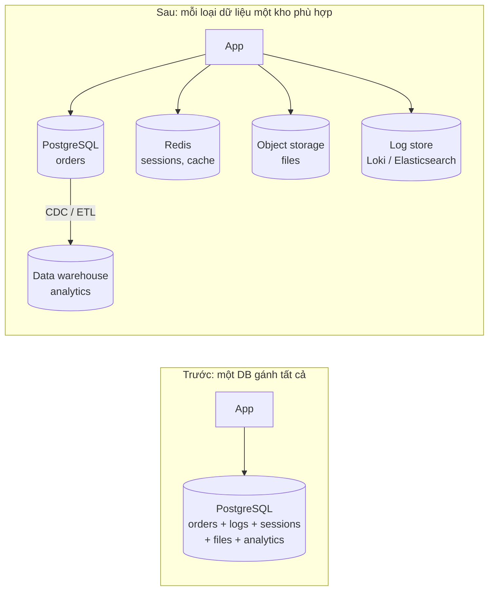
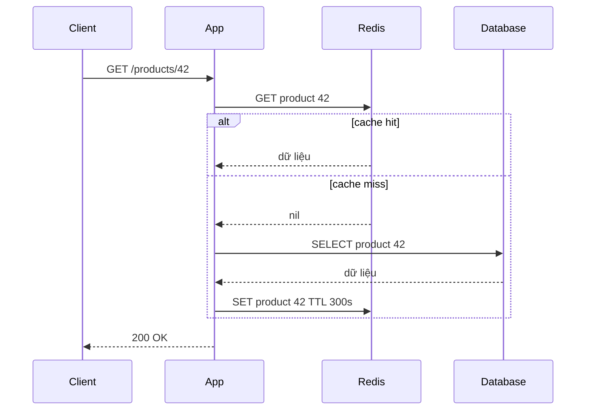
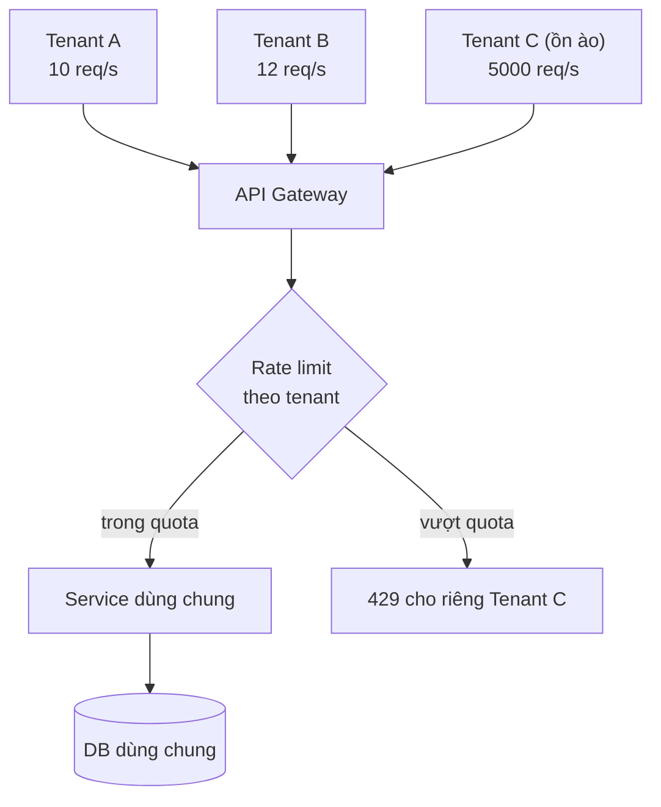
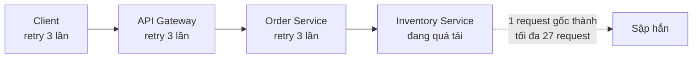
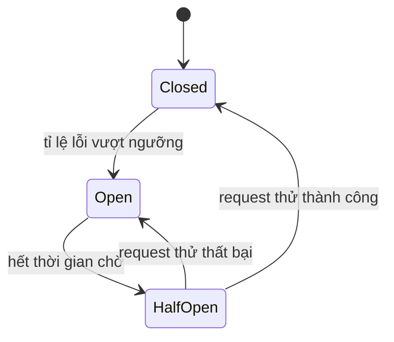
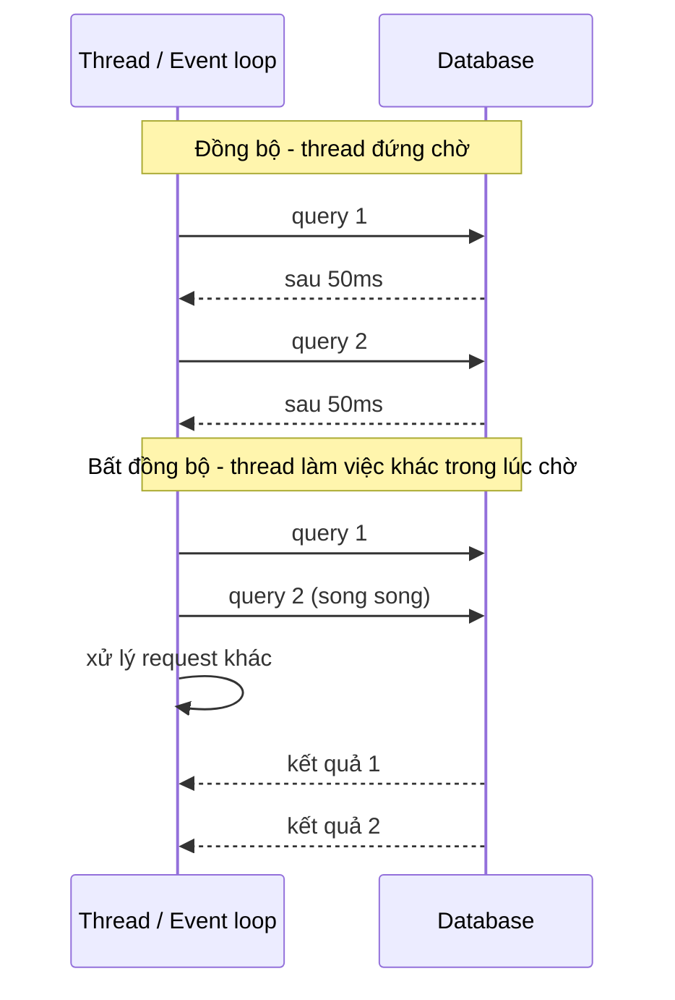
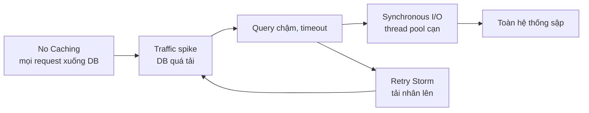

# Performance Antipatterns (phần 2)

Phần 2 tiếp tục danh mục **Performance antipatterns for cloud applications** của Azure Architecture Center với năm antipattern còn lại: **Monolithic Persistence** (dồn mọi loại dữ liệu vào một kho), **No Caching** (không cache dữ liệu đọc nhiều), **Noisy Neighbor** (một tenant chiếm tài nguyên của người khác), **Retry Storm** (retry dồn dập làm sập service đang yếu) và **Synchronous I/O** (chặn thread chờ I/O). Khác với phần 1 (chủ yếu ở mức code và query), nhóm này nghiêng về **kiến trúc và vận hành** -- những thứ thường được hỏi trực tiếp trong phỏng vấn system design.

**Tương tự đơn giản:** Một toà chung cư: chứa mọi thứ -- đồ ăn, quần áo, xe máy, giấy tờ -- trong **một** căn kho (**Monolithic Persistence**); mỗi lần cần muối lại chạy ra siêu thị thay vì để sẵn một lọ trong bếp (**No Caching**); một hộ mở karaoke cả đêm khiến cả tầng không ngủ được (**Noisy Neighbor**); thang máy hỏng, 100 người cùng bấm nút liên tục khiến bảng điều khiển treo hẳn (**Retry Storm**); và nhân viên lễ tân đứng chờ bưu tá trước cửa thay vì tiếp khách khác (**Synchronous I/O**).

---

:::note[Ghi nhớ nhanh]

- ⭐ **Retry Storm** — retry không giới hạn, không backoff, retry ở nhiều tầng nhân lên theo cấp số nhân; chặn bằng **giới hạn số lần, exponential backoff + jitter, circuit breaker, retry budget**, chỉ retry ở một tầng.
- ⭐ **Synchronous I/O chặn thread** — thread ngồi chờ DB/mạng không làm gì; dùng **async I/O** để một thread phục vụ nhiều request; Node.js đặc biệt cấm hàm `*Sync` trong request.
- **Monolithic Persistence:** dữ liệu giao dịch, log, session, file, analytics chung một DB → tranh chấp tài nguyên; tách theo đặc tính truy cập (**polyglot persistence**).
- **No Caching:** đọc lại dữ liệu ít đổi từ DB/API mỗi request; áp dụng cache-aside với TTL, cache cả "không tìm thấy".
- **Noisy Neighbor:** hệ multi-tenant cần **giới hạn theo tenant** (rate limit, quota), cô lập tài nguyên, và giám sát theo tenant.
- Các antipattern liên kết với nhau: No Caching + traffic spike → DB quá tải → timeout → Retry Storm.

:::

---

## Mục lục

- [Vì sao cần biết các antipattern này?](#vì-sao-cần-biết-các-antipattern-này)
- [1. Monolithic Persistence](#1-monolithic-persistence)
- [2. No Caching](#2-no-caching)
- [3. Noisy Neighbor](#3-noisy-neighbor)
- [4. Retry Storm](#4-retry-storm)
- [5. Synchronous I/O](#5-synchronous-io)
- [6. Tổng kết 10 antipattern](#6-tổng-kết-10-antipattern)
- [Khi nào dùng?](#khi-nào-dùng)
- [Lỗi thường gặp](#lỗi-thường-gặp)
- [Câu hỏi phỏng vấn](#câu-hỏi-phỏng-vấn)

---

## Vì sao cần biết các antipattern này?

**Vấn đề:** Hệ thống lớn hiếm khi chết vì một dòng code chậm; chúng chết vì **hiệu ứng dây chuyền**: một bảng log khổng lồ làm chậm DB giao dịch, cache không có nên DB nhận toàn bộ traffic, một khách hàng lớn chạy import làm chậm mọi khách hàng khác, DB chậm khiến client retry gấp ba lần tải, và thread của mọi service đều kẹt chờ I/O. Những vấn đề này xuất hiện ở tầng **kiến trúc**, không sửa được bằng tối ưu một hàm.

**Giải pháp:** Thiết kế từ đầu với các nguyên tắc: **tách kho dữ liệu theo nhu cầu**, **cache có chủ đích**, **cô lập và giới hạn theo tenant**, **retry có kỷ luật**, **I/O bất đồng bộ**. Và giám sát để phát hiện sớm khi hệ thống trượt vào antipattern.

:::tip[Dùng thực tế]

- **Polyglot persistence:** các hệ thống lớn thường kết hợp DB quan hệ cho giao dịch, Redis cho session/cache, Elasticsearch cho tìm kiếm, object storage (S3) cho file, data warehouse cho analytics.
- **Retry storm:** AWS mô tả trong Builders' Library ("Timeouts, retries, and backoff with jitter") cách retry ở nhiều tầng nhân tải lên; khuyến nghị chỉ retry ở một tầng và dùng token bucket cho retry.
- **Noisy neighbor:** các nền tảng SaaS multi-tenant như Slack, Shopify, Salesforce đều áp giới hạn tốc độ và quota theo tenant/app; Salesforce có "governor limits" nổi tiếng.
- **Async I/O:** Node.js, Nginx, Netty, Go runtime, Java virtual threads (Project Loom) đều được xây để không chặn thread khi chờ I/O.

:::

---

## 1. Monolithic Persistence

### Mô tả

**Monolithic Persistence**: dùng **một kho dữ liệu duy nhất** (thường là một database quan hệ) cho **mọi loại dữ liệu** có đặc tính truy cập rất khác nhau -- dữ liệu giao dịch (đơn hàng), log và audit trail (ghi liên tục, ít đọc), session (đọc ghi cực nhiều, sống ngắn), file/ảnh (blob lớn), dữ liệu analytics (truy vấn quét lớn), hàng đợi công việc (bảng `jobs`). Các workload này **tranh nhau** CPU, IO, lock, connection, buffer cache của cùng một DB.

Ví dụ Azure: ứng dụng ghi **log nghiệp vụ** vào cùng database với dữ liệu **đơn hàng**; khi lượng log tăng, các giao dịch đặt hàng bị chậm theo.



### Dấu hiệu nhận biết

- DB chính chậm/throttle dù lưu lượng giao dịch không đổi; nguyên nhân là workload phụ (log, báo cáo).
- Bảng log/audit/event chiếm phần lớn dung lượng và IO ghi.
- Lock contention, deadlock giữa job nền và request người dùng.
- Backup/restore lâu vì DB phình to bởi dữ liệu không quan trọng.
- Truy vấn báo cáo quét bảng lớn làm tụt hiệu năng giờ cao điểm.

### Cách khắc phục

- **Tách theo đặc tính truy cập (polyglot persistence):** giao dịch → RDBMS; session/cache → Redis; file → object storage; log → hệ thống log chuyên dụng; tìm kiếm → Elasticsearch/OpenSearch; analytics → warehouse (BigQuery, Redshift, ClickHouse).
- **Read replica** cho truy vấn đọc/báo cáo.
- **Tách DB theo bounded context** khi lên microservices (database per service).
- Đánh đổi: nhiều kho hơn = nhiều thứ phải vận hành, mất transaction xuyên kho (cần outbox, eventual consistency). Chỉ tách khi có số liệu chứng minh tranh chấp.

### Code sai / đúng

```ts
// SAI: ghi log nghiệp vụ chi tiết vào cùng DB và cùng transaction với đơn hàng
await db.query('BEGIN');
await db.query('INSERT INTO orders (id, customer_id, total) VALUES ($1, $2, $3)', [id, customerId, total]);
await db.query('INSERT INTO app_logs (level, message, payload) VALUES ($1, $2, $3)', ['info', 'order created', JSON.stringify(req.body)]);
await db.query('INSERT INTO sessions_activity (session_id, path, at) VALUES ($1, $2, now())', [sessionId, req.path]);
await db.query('COMMIT');
```

```ts
// ĐÚNG: DB giao dịch chỉ giữ dữ liệu giao dịch; log và session đi kho chuyên dụng
await db.query('INSERT INTO orders (id, customer_id, total) VALUES ($1, $2, $3)', [id, customerId, total]);

logger.info({ orderId: id, customerId }, 'order created'); // pino -> stdout -> Loki/Elasticsearch
await redis.hSet(`session:${sessionId}`, { lastPath: req.path, lastSeen: Date.now() }); // session ở Redis
await redis.expire(`session:${sessionId}`, 1800);
```

---

## 2. No Caching

### Mô tả

**No Caching**: ứng dụng **lấy lại cùng một dữ liệu** từ nguồn gốc (DB, API ngoài, tính toán đắt) cho **mỗi request**, dù dữ liệu đó **đọc nhiều, ít thay đổi** -- danh mục sản phẩm, cấu hình, tỉ giá, thông tin hồ sơ, kết quả tìm kiếm phổ biến. Nguồn gốc phải gánh toàn bộ tải, latency cao, chi phí (đặc biệt API tính phí theo lời gọi) tăng, và khi traffic spike thì nguồn gốc sập.

### Dấu hiệu nhận biết

- Cùng một câu query/lời gọi API xuất hiện với tần suất rất cao trong thống kê.
- Tỉ lệ đọc/ghi rất cao (ví dụ 100:1) nhưng không có tầng cache.
- DB/API ngoài là nút cổ chai chính; latency endpoint đọc cao dù dữ liệu không đổi.
- Bị throttle bởi API bên thứ ba (429) vì gọi lặp.

### Cách khắc phục

- **Cache-aside** (phổ biến nhất): đọc cache, miss thì đọc nguồn rồi ghi cache với **TTL**.
- Chọn **tầng cache phù hợp:** HTTP cache/CDN cho nội dung công khai, cache in-memory trong process cho dữ liệu nhỏ, nóng (cấu hình), cache phân tán (Redis) dùng chung giữa các instance.
- **Cache cả kết quả rỗng** (negative caching) với TTL ngắn để chống truy vấn lặp với key không tồn tại.
- **Invalidation** khi ghi: xoá key sau khi cập nhật DB.
- **Chống stampede:** single-flight/lock, TTL jitter, stale-while-revalidate.
- Ứng dụng phải **chạy được khi cache sập** (fallback về nguồn, có rate limit bảo vệ nguồn).



### Code sai / đúng

```ts
// SAI: mỗi request đều hỏi DB cấu hình và danh mục -- dữ liệu cả ngày không đổi
app.get('/categories', async (_req, res) => {
  const { rows } = await db.query('SELECT id, name, parent_id FROM categories ORDER BY name');
  res.json(rows);
});
```

```ts
// ĐÚNG: cache-aside với Redis, TTL có jitter, single-flight trong process, fallback khi Redis lỗi
const TTL_SECONDS = 300;
const inflight = new Map<string, Promise<unknown>>();

async function cached<T>(key: string, load: () => Promise<T>): Promise<T> {
  try {
    const hit = await redis.get(key);
    if (hit !== null) return JSON.parse(hit) as T;
  } catch (err) {
    logger.warn({ err, key }, 'Redis lỗi, đọc thẳng nguồn');
    return load();
  }

  const pending = inflight.get(key);
  if (pending) return pending as Promise<T>; // gom các miss đồng thời thành 1 lần nạp

  const promise = load()
    .then(async (value) => {
      const ttl = TTL_SECONDS + Math.floor(Math.random() * 60); // jitter tránh hết hạn đồng loạt
      await redis.set(key, JSON.stringify(value), { EX: ttl }).catch(() => undefined);
      return value;
    })
    .finally(() => inflight.delete(key));
  inflight.set(key, promise);
  return promise;
}

app.get('/categories', async (_req, res) => {
  const categories = await cached('categories:v1', async () => {
    const { rows } = await db.query('SELECT id, name, parent_id FROM categories ORDER BY name');
    return rows;
  });
  res.set('Cache-Control', 'public, max-age=60').json(categories); // cho cả CDN/browser cache
});
```

---

## 3. Noisy Neighbor

### Mô tả

Trong hệ thống **multi-tenant** (nhiều khách hàng dùng chung hạ tầng: chung DB, chung queue, chung cluster), **Noisy Neighbor** xảy ra khi **một tenant** dùng lượng tài nguyên bất thường (import hàng triệu bản ghi, chạy báo cáo khổng lồ, bị tấn công, script lỗi gọi API liên tục) và **làm suy giảm hiệu năng của mọi tenant khác**. Hiện tượng này cũng xảy ra ở tầng hạ tầng: VM/container chung host tranh CPU, IO đĩa, băng thông.



### Dấu hiệu nhận biết

- Latency của mọi tenant tăng cùng lúc, trùng thời điểm một tenant cụ thể có lưu lượng đột biến.
- Metrics **theo tenant** (request, CPU time, query time, dung lượng queue) cho thấy một tenant chiếm tỉ lệ áp đảo.
- Queue dùng chung bị một tenant lấp đầy, job của tenant khác chờ lâu.
- Trên cloud: "CPU steal time" cao trên VM chung host.

### Cách khắc phục

- **Rate limit và quota theo tenant** (token bucket theo `tenantId`) ở API gateway và ở các tài nguyên đắt.
- **Fair queuing:** queue riêng theo tenant hoặc lập lịch công bằng (round-robin giữa tenant) thay vì FIFO chung.
- **Cô lập theo mức:** tenant lớn/premium được tách sang **cell/shard/stamp riêng** (Deployment Stamps pattern), DB riêng; tenant nhỏ dùng chung.
- **Bulkhead:** pool kết nối, thread pool riêng theo nhóm tenant để một nhóm không làm cạn tài nguyên của nhóm khác.
- **Giám sát theo tenant** để phát hiện và tính phí đúng.
- Với hạ tầng: đặt **resource requests/limits** cho container, chọn instance dedicated cho workload nhạy cảm.

### Code sai / đúng

```ts
// SAI: rate limit toàn cục -- tenant ồn ào dùng hết quota chung, mọi tenant khác bị 429
app.use(rateLimit({ windowMs: 1_000, max: 2_000 }));
```

```ts
// ĐÚNG: token bucket theo tenant trên Redis (script Lua để atomic)
const TOKEN_BUCKET_LUA = `
local key = KEYS[1]
local capacity = tonumber(ARGV[1])
local refill_per_sec = tonumber(ARGV[2])
local now_ms = tonumber(ARGV[3])
local data = redis.call('HMGET', key, 'tokens', 'ts')
local tokens = tonumber(data[1]) or capacity
local ts = tonumber(data[2]) or now_ms
tokens = math.min(capacity, tokens + (now_ms - ts) / 1000 * refill_per_sec)
local allowed = 0
if tokens >= 1 then tokens = tokens - 1; allowed = 1 end
redis.call('HSET', key, 'tokens', tokens, 'ts', now_ms)
redis.call('PEXPIRE', key, 60000)
return allowed
`;

const PLAN_LIMITS = { free: { capacity: 20, refill: 10 }, pro: { capacity: 200, refill: 100 } } as const;

export async function perTenantLimit(req: Request, res: Response, next: NextFunction) {
  const { tenantId, plan } = req.tenant; // đã xác thực ở middleware trước
  const limit = PLAN_LIMITS[plan];
  const allowed = await redis.eval(TOKEN_BUCKET_LUA, {
    keys: [`rl:${tenantId}`],
    arguments: [String(limit.capacity), String(limit.refill), String(Date.now())],
  });
  if (allowed === 1) return next();
  res.setHeader('Retry-After', '1');
  return res.status(429).json({ error: 'Vượt giới hạn tốc độ của gói hiện tại' });
}
```

---

## 4. Retry Storm

### Mô tả

Retry là cách xử lý lỗi tạm thời đúng đắn -- nhưng khi service phía sau **đang quá tải**, retry **không kiểm soát** lại **nhân thêm tải** đúng lúc nó yếu nhất. **Retry Storm** xảy ra khi: client retry ngay lập tức, retry không giới hạn số lần, nhiều client retry đồng loạt, và đặc biệt khi **retry ở nhiều tầng** -- mỗi tầng retry 3 lần thì qua 3 tầng là 3 x 3 x 3 = **27 lần** tải lên service cuối. Service đang hồi phục bị dội trở lại và không bao giờ đứng dậy được.



### Dấu hiệu nhận biết

- Lưu lượng tới service bị lỗi **tăng vọt** đúng lúc nó bắt đầu lỗi (request rate tăng nhưng request gốc từ user không tăng).
- Log thấy cùng request id/trace bị gọi nhiều lần liên tiếp cách nhau vài ms.
- Service không tự hồi phục sau sự cố ban đầu dù nguyên nhân đã hết.
- Tỉ lệ timeout cao; lỗi lan dần lên các tầng phía trên.

### Cách khắc phục

- **Giới hạn số lần retry** (2--3) và **tổng thời gian** (deadline).
- **Exponential backoff + jitter**, tôn trọng `Retry-After`.
- **Chỉ retry ở một tầng** (thường là tầng gần lỗi nhất hoặc client ngoài cùng), các tầng giữa fail-fast.
- **Circuit breaker:** khi tỉ lệ lỗi vượt ngưỡng, ngắt mạch -- trả lỗi ngay không gọi xuống trong một khoảng, sau đó cho vài request thử (half-open).
- **Retry budget / token bucket cho retry:** retry tối đa ví dụ 10% số request thành công gần đây (cách của gRPC retry throttling, Finagle, AWS SDK).
- Chỉ retry lỗi **tạm thời** (503, 504, timeout, lỗi kết nối) và thao tác **idempotent**.
- Phía server: **load shedding** và trả `503 + Retry-After` sớm thay vì để request treo.



### Code sai / đúng

```ts
// SAI: retry vô hạn, không chờ, retry mọi loại lỗi
async function getStock(productId: string): Promise<number> {
  while (true) {
    try {
      return await inventoryClient.getStock(productId);
    } catch {
      // thử lại ngay lập tức...
    }
  }
}
```

```ts
// ĐÚNG: giới hạn lần thử + backoff có jitter + chỉ lỗi tạm thời + circuit breaker (opossum)
import CircuitBreaker from 'opossum';

const MAX_ATTEMPTS = 3;
const BASE_MS = 100;
const sleep = (ms: number) => new Promise((r) => setTimeout(r, ms));
const isTransient = (err: { status?: number; code?: string }) =>
  err.code === 'ETIMEDOUT' || err.code === 'ECONNRESET' || [502, 503, 504].includes(err.status ?? 0);

async function getStockWithRetry(productId: string): Promise<number> {
  for (let attempt = 1; ; attempt += 1) {
    try {
      return await inventoryClient.getStock(productId, { timeoutMs: 500 });
    } catch (err) {
      const e = err as { status?: number; code?: string };
      if (!isTransient(e) || attempt >= MAX_ATTEMPTS) throw err;
      await sleep(Math.random() * BASE_MS * 2 ** attempt); // full jitter
    }
  }
}

const breaker = new CircuitBreaker(getStockWithRetry, {
  timeout: 2_000, // tổng thời gian cho cả chuỗi retry
  errorThresholdPercentage: 50, // >= 50% lỗi thì mở mạch
  resetTimeout: 10_000, // sau 10s thử lại (half-open)
  volumeThreshold: 20, // cần tối thiểu 20 request mới đánh giá
});
breaker.fallback(() => null); // mạch mở: trả "không rõ tồn kho" thay vì gọi xuống

export const getStock = (productId: string) => breaker.fire(productId);
```

---

## 5. Synchronous I/O

### Mô tả

**Synchronous I/O**: thread gọi một thao tác I/O (DB, HTTP, đọc file) và **bị chặn** (block) cho tới khi có kết quả -- trong suốt thời gian đó thread không làm gì nhưng vẫn chiếm bộ nhớ (stack khoảng 1MB mặc định với thread JVM) và một chỗ trong thread pool. Với mô hình thread-per-request, số request đồng thời bị giới hạn bởi số thread; khi I/O chậm, thread pool cạn và request mới phải xếp hàng hoặc bị từ chối, dù CPU gần như rảnh.

Ở **Node.js**, hậu quả nặng hơn: chỉ có một event loop, nên **một** lời gọi `fs.readFileSync`, `execSync`, `crypto.pbkdf2Sync` trong handler sẽ **chặn toàn bộ server**.



### Dấu hiệu nhận biết

- Throughput thấp, latency cao trong khi **CPU thấp** -- tài nguyên bị giữ bởi việc chờ.
- Thread pool cạn (thread dump thấy phần lớn thread ở trạng thái WAITING/BLOCKED trên socket read).
- Node.js: event loop lag cao, profiler thấy hàm `*Sync`.
- Gọi nhiều I/O độc lập **tuần tự** (await lần lượt) thay vì song song.

### Cách khắc phục

- Dùng **API bất đồng bộ** (async/await, non-blocking driver, reactive, Java virtual threads).
- Trong Node.js: **không** dùng hàm `*Sync` trong đường đi của request (chỉ chấp nhận lúc khởi động).
- **Chạy song song** các I/O độc lập (`Promise.all`), có giới hạn concurrency.
- Tác vụ I/O dài không cần kết quả ngay: đẩy vào queue (Asynchronism).
- Cẩn thận "async giả": bọc lời gọi đồng bộ trong `Task.Run`/Promise không làm nó non-blocking, chỉ chuyển việc chặn sang thread khác.

### Code sai / đúng

```ts
// SAI: đọc file đồng bộ trong handler + 3 lời gọi độc lập chạy tuần tự
import fs from 'node:fs';

app.get('/dashboard', async (req, res) => {
  const template = fs.readFileSync('./templates/dashboard.html', 'utf8'); // chặn event loop
  const user = await userApi.get(req.user.id);       // 80ms
  const orders = await orderApi.recent(req.user.id); // 120ms
  const notices = await noticeApi.list();            // 60ms  -> tổng khoảng 260ms
  res.send(render(template, { user, orders, notices }));
});
```

```ts
// ĐÚNG: template nạp một lần lúc khởi động; I/O bất đồng bộ và song song
import { readFile } from 'node:fs/promises';

const template = await readFile('./templates/dashboard.html', 'utf8'); // lúc boot (ESM top-level await)

app.get('/dashboard', async (req, res) => {
  const [user, orders, notices] = await Promise.all([
    userApi.get(req.user.id),
    orderApi.recent(req.user.id),
    noticeApi.list(),
  ]); // tổng khoảng 120ms = lời gọi chậm nhất
  res.send(render(template, { user, orders, notices }));
});
```

So sánh mô hình xử lý:

| Mô hình | Cách chờ I/O | Giới hạn đồng thời | Ví dụ |
| --- | --- | --- | --- |
| Thread-per-request, blocking I/O | Thread bị chặn | Số thread (vài trăm) | Servlet cổ điển, Flask đồng bộ |
| Event loop, non-blocking I/O | Đăng ký callback, thread tiếp tục | Hàng chục nghìn kết nối | Node.js, Nginx, Netty |
| Virtual thread / goroutine | Runtime "đỗ" thread nhẹ khi chờ | Hàng trăm nghìn+ | Go, Java 21 virtual threads |

---

## 6. Tổng kết 10 antipattern

| Antipattern | Dấu hiệu chính | Khắc phục chính |
| --- | --- | --- |
| Busy Database | CPU DB cao, app rảnh | Chuyển xử lý lên app |
| Busy Front End | Mọi endpoint chậm khi vài endpoint nặng chạy | Queue + worker, worker thread |
| Chatty I/O | Nhiều lời gọi nhỏ, N+1 | Batch, JOIN, API coarse-grained |
| Extraneous Fetching | Dữ liệu thừa, response lớn | Chọn cột, lọc và phân trang ở DB |
| Improper Instantiation | Cạn socket/kết nối | Singleton, pool |
| **Monolithic Persistence** | Workload phụ làm chậm DB giao dịch | Polyglot persistence, read replica |
| **No Caching** | Query lặp lại, tỉ lệ đọc/ghi cao | Cache-aside, TTL, CDN |
| **Noisy Neighbor** | Một tenant làm chậm tất cả | Rate limit/quota theo tenant, cô lập |
| **Retry Storm** | Tải tăng vọt khi đang lỗi, không tự hồi phục | Backoff + jitter, circuit breaker, retry 1 tầng |
| **Synchronous I/O** | CPU thấp nhưng throughput thấp | Async I/O, song song hoá |

Một chuỗi sự cố điển hình nối nhiều antipattern:



---

## Khi nào dùng?

| Tình huống thiết kế | Antipattern cần đề phòng | Gợi ý |
| --- | --- | --- |
| Hệ thống đọc nhiều (catalog, profile, feed) | No Caching | Cache-aside + CDN ngay từ đầu |
| Gọi service khác qua mạng | Retry Storm, Synchronous I/O | Timeout, retry có backoff ở một tầng, circuit breaker, async |
| SaaS nhiều khách hàng | Noisy Neighbor | Rate limit theo tenant, fair queue, cell cho tenant lớn |
| Ghi log, event, file nhiều | Monolithic Persistence | Kho chuyên dụng, không ghi chung DB giao dịch |
| Báo cáo, analytics | Monolithic Persistence | Read replica, warehouse qua CDC/ETL |
| Hệ thống nhỏ, ít tải | -- | Đừng tách kho, đừng thêm cache khi chưa cần; đo rồi mới tối ưu |

---

## Lỗi thường gặp

### Lỗi 1: Thêm cache nhưng không nghĩ tới invalidation

Cache TTL 24 giờ cho giá sản phẩm -- khách thấy giá cũ, thanh toán giá mới. **Sửa:** xoá cache khi ghi, TTL phù hợp mức chấp nhận dữ liệu cũ, versioned key.

### Lỗi 2: Retry ở mọi tầng "cho chắc"

Gateway, service, SDK, client đều retry mặc định. **Sửa:** rà soát cấu hình retry của mọi thư viện (nhiều SDK retry sẵn), quyết định một tầng duy nhất, các tầng khác fail-fast.

### Lỗi 3: Tách kho dữ liệu quá sớm

Một ứng dụng nhỏ dùng 6 loại DB, đội 3 người phải vận hành tất cả. **Sửa:** bắt đầu với một DB tốt (PostgreSQL làm được rất nhiều việc), tách khi số liệu cho thấy tranh chấp thật.

### Lỗi 4: Rate limit theo IP trong hệ multi-tenant

Tenant lớn có nhiều IP vẫn chiếm tài nguyên; người dùng sau NAT công ty bị chặn oan. **Sửa:** rate limit theo danh tính tenant/API key, kết hợp IP chỉ cho endpoint chưa xác thực.

### Lỗi 5: Async nhưng vẫn tuần tự

Đổi sang async/await nhưng `await` từng lời gọi độc lập lần lượt -- không chặn thread nhưng latency vẫn là tổng. **Sửa:** `Promise.all` cho các I/O độc lập, có giới hạn concurrency (p-limit) để không dội tải xuống service sau.

---

## Câu hỏi phỏng vấn

**1. Retry storm là gì? Thiết kế retry thế nào cho an toàn?**

<details className="qa">
<summary>Xem đáp án</summary>

Retry không kiểm soát khi service phía sau đang yếu làm nhân tải lên (đặc biệt retry ở nhiều tầng: 3 tầng x 3 lần = 27 lần), khiến service không thể hồi phục. An toàn: giới hạn số lần và tổng deadline; exponential backoff + jitter; tôn trọng Retry-After; chỉ retry lỗi tạm thời và thao tác idempotent; retry ở một tầng; circuit breaker; retry budget (retry không vượt một tỉ lệ request); server load shedding trả 503 sớm.

</details>

**2. Circuit breaker hoạt động thế nào?**

<details className="qa">
<summary>Xem đáp án</summary>

Ba trạng thái: Closed (gọi bình thường, đếm lỗi); Open (khi tỉ lệ lỗi vượt ngưỡng trong cửa sổ đủ lớn -- trả lỗi/fallback ngay, không gọi xuống, cho service phía sau thời gian hồi phục); Half-open (sau thời gian chờ, cho vài request thử -- thành công thì về Closed, thất bại thì về Open). Kết hợp fallback (giá trị mặc định, dữ liệu cache cũ).

</details>

**3. Noisy neighbor trong SaaS multi-tenant xử lý thế nào?**

<details className="qa">
<summary>Xem đáp án</summary>

Đo tài nguyên theo tenant; rate limit và quota theo tenant/gói (token bucket theo tenantId); fair queuing thay vì FIFO chung; bulkhead (pool riêng theo nhóm); tách tenant lớn sang cell/shard/stamp riêng hoặc DB riêng; giới hạn kích thước job/import; với hạ tầng đặt resource limits cho container. Đánh đổi giữa chi phí chia sẻ và mức cô lập.

</details>

**4. Synchronous I/O ảnh hưởng thế nào tới khả năng chịu tải?**

<details className="qa">
<summary>Xem đáp án</summary>

Thread bị chặn khi chờ I/O nhưng vẫn chiếm bộ nhớ và slot trong pool; số request đồng thời bị giới hạn bởi số thread, khi I/O chậm thì pool cạn dù CPU rảnh. Với Node.js, hàm Sync chặn cả event loop. Giải pháp: non-blocking I/O (event loop, async/await), virtual threads/goroutine, song song hoá I/O độc lập, đẩy việc dài vào queue.

</details>

**5. Khi nào nên tách một database thành nhiều kho (polyglot persistence)?**

<details className="qa">
<summary>Xem đáp án</summary>

Khi có số liệu cho thấy các workload khác đặc tính tranh chấp nhau: log/event ghi liên tục làm chậm giao dịch, báo cáo quét bảng làm tụt hiệu năng giờ cao điểm, session đọc ghi dày đặc, file/blob làm DB phình. Tách sang kho phù hợp (Redis, object storage, log store, warehouse, search engine). Đánh đổi: thêm chi phí vận hành, mất transaction xuyên kho, cần đồng bộ (CDC, outbox).

</details>

**6. Hệ thống không có cache, traffic tăng gấp 10 lần. Bạn làm gì?**

<details className="qa">
<summary>Xem đáp án</summary>

Xác định dữ liệu đọc nhiều ít đổi qua thống kê query; thêm cache-aside (Redis) với TTL + jitter, single-flight chống stampede, negative caching; nội dung công khai thì CDN/HTTP cache; invalidation khi ghi. Song song: read replica, rate limit/load shedding bảo vệ DB, đảm bảo client retry có backoff để không tạo retry storm khi DB chậm.

</details>
