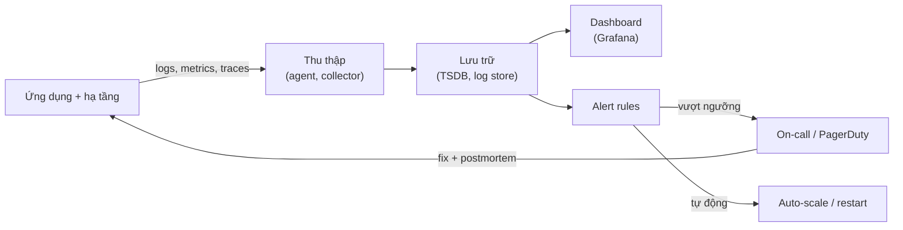
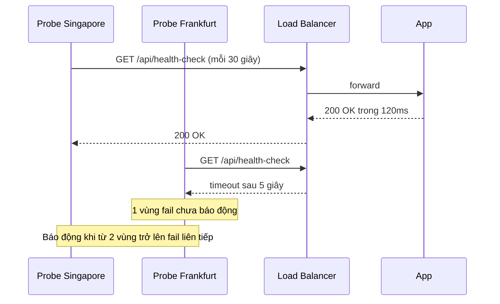
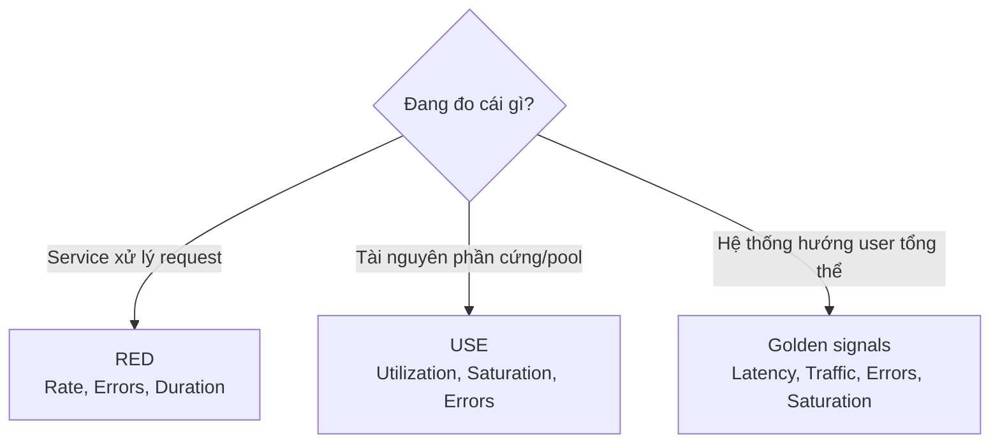

# Monitoring: các loại giám sát

**Monitoring** (giám sát) là việc liên tục thu thập, tổng hợp và phân tích dữ liệu về hệ thống đang chạy -- CPU, latency, tỉ lệ lỗi, số user đăng nhập, số lần đăng nhập sai... -- để trả lời hai câu hỏi: **hệ thống có đang khoẻ không?** và **nếu không, hỏng ở đâu?** Theo Azure Architecture Center (nguồn roadmap.sh dựa vào), monitoring được chia thành nhiều loại theo mục tiêu: **Health**, **Availability**, **Performance**, **Security** và **Usage** monitoring.

**Tương tự đơn giản:** Monitoring giống bảng đồng hồ trên xe ô tô. Đèn báo động cơ (health) cho biết xe còn chạy được không; đồng hồ tốc độ và vòng tua (performance) cho biết xe chạy nhanh hay đang gồng; đèn báo cửa mở hay báo động chống trộm (security) cho biết có ai xâm nhập; còn đồng hồ quãng đường (usage) cho biết xe được dùng nhiều đến đâu. Không có bảng đồng hồ, bạn chỉ biết xe hỏng khi nó đã dừng giữa đường.

---

:::note[Ghi nhớ nhanh]

- ⭐ **Monitoring trả lời "hệ thống có ổn không", observability trả lời "vì sao không ổn"** — monitoring dựa trên các câu hỏi biết trước; observability cho phép đặt câu hỏi mới từ logs, metrics, traces.
- ⭐ **Bốn golden signals (Google SRE): latency, traffic, errors, saturation** — nếu chỉ đo được 4 thứ cho một service hướng user, hãy đo 4 thứ này.
- **RED cho service, USE cho tài nguyên** — RED = Rate, Errors, Duration; USE = Utilization, Saturation, Errors.
- **SLI là con số đo, SLO là mục tiêu nội bộ, SLA là cam kết có hậu quả pháp lý/tiền** — SLA luôn lỏng hơn SLO.
- **Availability đo từ góc nhìn user** — server "up" nhưng trả 500 thì với user vẫn là "down"; dùng synthetic check từ nhiều vùng.
- **Đo percentile (p95, p99), không đo trung bình** — trung bình che giấu những request chậm nhất mà user cảm nhận rõ nhất.

:::

---

## Mục lục

- [Vì sao cần monitoring?](#vì-sao-cần-monitoring)
- [1. Monitoring là gì?](#1-monitoring-là-gì)
- [2. Health Monitoring](#2-health-monitoring)
- [3. Availability Monitoring](#3-availability-monitoring)
- [4. Performance Monitoring](#4-performance-monitoring)
- [5. Security Monitoring](#5-security-monitoring)
- [6. Usage Monitoring](#6-usage-monitoring)
- [7. Golden signals, RED và USE](#7-golden-signals-red-và-use)
- [8. SLI, SLO, SLA và error budget](#8-sli-slo-sla-và-error-budget)
- [9. So sánh các loại monitoring](#9-so-sánh-các-loại-monitoring)
- [Khi nào dùng?](#khi-nào-dùng)
- [Lỗi thường gặp](#lỗi-thường-gặp)
- [Câu hỏi phỏng vấn](#câu-hỏi-phỏng-vấn)

---

## Vì sao cần monitoring?

**Vấn đề:** Hệ thống phân tán có hàng chục service, hàng trăm instance, nhiều database, queue, cache, CDN. Bất kỳ mắt xích nào cũng có thể chậm đi hoặc hỏng -- và thường hỏng **một phần** (partial failure) chứ không sập toàn bộ. Nếu không giám sát, bạn chỉ biết có sự cố khi user phàn nàn trên mạng xã hội, khi đó thiệt hại đã xảy ra và bạn không có dữ liệu để điều tra nguyên nhân.

**Giải pháp:** Thiết lập monitoring nhiều tầng: kiểm tra sức khoẻ từng thành phần (health), đo khả năng truy cập từ góc nhìn user (availability), đo tốc độ và tài nguyên (performance), phát hiện hành vi bất thường (security), và hiểu user dùng sản phẩm thế nào (usage). Dữ liệu này nuôi dashboard, cảnh báo (alert) và quyết định kinh doanh.

:::tip[Dùng thực tế]

- **Google SRE** định nghĩa bốn golden signals và cách vận hành bằng SLO/error budget -- trở thành chuẩn chung của ngành (sách "Site Reliability Engineering", 2016).
- **Kubernetes** dùng liveness probe và readiness probe -- chính là health monitoring tự động để restart pod hỏng và rút pod chưa sẵn sàng khỏi load balancer.
- **AWS CloudWatch, Azure Monitor, Datadog, New Relic** cung cấp sẵn metrics hạ tầng, synthetic check, APM (Application Performance Monitoring).
- **Cloudflare, Stripe, GitHub** công khai trang status (status page) dựa trên availability monitoring từ nhiều vùng.

:::

---

## 1. Monitoring là gì?

Monitoring là một vòng lặp gồm 4 bước:

1. **Instrumentation** -- gắn "cảm biến" vào code và hạ tầng để phát ra dữ liệu (logs, metrics, traces).
2. **Collection** -- thu thập và lưu dữ liệu (Prometheus, Elasticsearch, Loki, Tempo...).
3. **Analysis và Visualization** -- tổng hợp, vẽ dashboard, tính toán SLO.
4. **Alerting và Action** -- báo động khi vượt ngưỡng, kích hoạt on-call hoặc tự động khắc phục (auto-scaling, restart).



### Monitoring vs Observability

| Tiêu chí          | Monitoring                                   | Observability                                       |
| ----------------- | -------------------------------------------- | --------------------------------------------------- |
| Câu hỏi           | "Có lỗi không?" (known unknowns)             | "Vì sao lỗi?" (unknown unknowns)                    |
| Dữ liệu chính     | Metrics + ngưỡng định sẵn                    | Logs + metrics + traces có ngữ cảnh phong phú       |
| Cách dùng         | Dashboard, alert                             | Truy vấn tự do, lần theo một request cụ thể         |
| Ví dụ             | CPU trên 90% thì báo                         | Vì sao request của user X ở region Y chậm 3 giây?   |

Hai khái niệm bổ sung cho nhau: monitoring là **tập con** của observability. Bài sau sẽ nói về instrumentation -- nền tảng để có observability.

---

## 2. Health Monitoring

**Health monitoring** trả lời câu hỏi: **thành phần này có đang chạy bình thường không?** Ở mức đơn giản nhất là "còn sống hay đã chết", nhưng tốt hơn là kiểm tra cả các phụ thuộc (database, cache, queue) mà nó cần để làm việc.

### Cơ chế: health endpoint

Mỗi service phơi ra một endpoint (thường là `/health`, `/healthz`, `/ready`) mà load balancer, orchestrator hoặc hệ thống giám sát gọi định kỳ.

| Loại check     | Câu hỏi                                   | Hành động khi fail                          |
| -------------- | ----------------------------------------- | ------------------------------------------- |
| **Liveness**   | Process còn sống, không bị treo (deadlock)? | Restart container                           |
| **Readiness**  | Đã sẵn sàng nhận traffic chưa?            | Rút khỏi load balancer, không restart       |
| **Startup**    | Đã khởi động xong chưa (app khởi động chậm)? | Chờ, chưa chạy liveness                     |
| **Deep check** | Các phụ thuộc (DB, cache) có OK?          | Đánh dấu degraded, báo động                 |

```ts
import express from 'express';
import { Pool } from 'pg';
import { createClient } from 'redis';

const app = express();
const db = new Pool({ connectionString: process.env.DATABASE_URL });
const redis = createClient({ url: process.env.REDIS_URL });

// Liveness: chỉ kiểm tra process còn phản hồi -- KHÔNG gọi DB
app.get('/healthz', (_req, res) => {
  res.status(200).json({ status: 'ok' });
});

// Readiness: kiểm tra các phụ thuộc bắt buộc, có timeout
async function withTimeout<T>(p: Promise<T>, ms: number): Promise<T> {
  return Promise.race([
    p,
    new Promise<T>((_, reject) => setTimeout(() => reject(new Error('timeout')), ms)),
  ]);
}

app.get('/ready', async (_req, res) => {
  const checks = await Promise.allSettled([
    withTimeout(db.query('SELECT 1'), 500),
    withTimeout(redis.ping(), 300),
  ]);
  const [dbCheck, cacheCheck] = checks.map((c) => c.status === 'fulfilled');
  const healthy = dbCheck && cacheCheck;
  res.status(healthy ? 200 : 503).json({
    status: healthy ? 'ready' : 'degraded',
    checks: { database: dbCheck, cache: cacheCheck },
  });
});
```

```yaml
# Kubernetes: cấu hình probe cho container
livenessProbe:
  httpGet: { path: /healthz, port: 3000 }
  periodSeconds: 10
  failureThreshold: 3      # fail 3 lần liên tiếp mới restart
readinessProbe:
  httpGet: { path: /ready, port: 3000 }
  periodSeconds: 5
  failureThreshold: 2
```

### Metric quan trọng của health monitoring

- Trạng thái up/down của từng instance (`up` trong Prometheus).
- Số lần restart container, số pod không ready.
- Trạng thái các phụ thuộc: DB connection pool, replication lag, độ dài queue.
- Tình trạng **degraded** (vẫn chạy nhưng thiếu một tính năng phụ) -- nên phân biệt với **unhealthy**.

:::warning[Cẩn thận]

Đừng để **liveness probe** gọi database. Khi DB chậm, mọi pod đều fail liveness, Kubernetes restart toàn bộ cùng lúc, và sự cố nhỏ ở DB biến thành sập toàn hệ thống (cascading failure).

:::

---

## 3. Availability Monitoring

**Availability monitoring** đo **tỉ lệ thời gian (hoặc tỉ lệ request) mà hệ thống phục vụ được user**. Khác với health monitoring nhìn từ bên trong, availability monitoring nhìn **từ góc độ người dùng**: một server có thể "healthy" nhưng DNS hỏng, chứng chỉ TLS hết hạn, CDN lỗi -- user vẫn không vào được.

### Hai cách tính availability

| Cách tính        | Công thức                                                    | Ưu / nhược                                          |
| ---------------- | ------------------------------------------------------------ | --------------------------------------------------- |
| **Theo thời gian** | thời gian hoạt động / tổng thời gian                        | Dễ hiểu; nhưng "down 1 phút lúc 3h sáng" bằng "down 1 phút giờ cao điểm" |
| **Theo request**   | số request thành công / tổng số request                     | Phản ánh đúng trải nghiệm user hơn; Google SRE khuyên dùng |

Bảng "số 9" quen thuộc (tính trên một năm):

| Availability | Downtime/năm   | Downtime/tháng (30 ngày) |
| ------------ | -------------- | ------------------------ |
| 99%          | ~3,65 ngày     | ~7,2 giờ                 |
| 99,9%        | ~8,76 giờ      | ~43,2 phút               |
| 99,95%       | ~4,38 giờ      | ~21,6 phút               |
| 99,99%       | ~52,6 phút     | ~4,3 phút                |
| 99,999%      | ~5,26 phút     | ~26 giây                 |

### Kỹ thuật

- **Synthetic monitoring (probe chủ động):** robot gọi endpoint quan trọng định kỳ (mỗi 30–60 giây) từ nhiều vùng địa lý -- ví dụ Prometheus Blackbox Exporter, Pingdom, UptimeRobot, Datadog Synthetics, CloudWatch Synthetics.
- **Real User Monitoring (RUM):** đo từ trình duyệt/app của user thật -- phát hiện vấn đề ở vùng mạng cụ thể.
- **Tính toán từ log/metrics ở load balancer:** tỉ lệ 5xx trên tổng request.
- **Kiểm tra cả các thành phần "ngoài code":** DNS resolve, ngày hết hạn chứng chỉ TLS, redirect HTTP→HTTPS.



### Metric quan trọng

- Uptime % theo thời gian hoặc theo request (tính trên cửa sổ 28/30 ngày).
- Tỉ lệ request thành công (non-5xx) tại edge/load balancer.
- **MTTD** (Mean Time To Detect -- thời gian trung bình để phát hiện sự cố), **MTTR** (Mean Time To Recover -- thời gian trung bình để khôi phục), **MTBF** (Mean Time Between Failures -- thời gian trung bình giữa hai lần hỏng).
- Số ngày còn lại trước khi chứng chỉ TLS hết hạn.

---

## 4. Performance Monitoring

**Performance monitoring** đo **hệ thống chạy nhanh và hiệu quả đến đâu** -- cả từ góc nhìn user (latency, throughput) lẫn tài nguyên (CPU, RAM, I/O). Mục tiêu: phát hiện chậm dần trước khi thành sự cố, tìm nút thắt cổ chai, và có dữ liệu cho capacity planning (lập kế hoạch dung lượng).

### Vì sao phải dùng percentile?

Giả sử 100 request: 95 cái mất 50ms, 5 cái mất 3000ms. Trung bình = (95 x 50 + 5 x 3000) / 100 = **197,5ms** -- trông "ổn". Nhưng p99 = **3000ms**: cứ 100 request lại có vài user chờ 3 giây. Với một trang gọi 20 API, xác suất ít nhất một API rơi vào nhóm chậm nhất 1% là 1 - 0,99^20 ≈ **18%** -- tail latency (độ trễ đuôi) ảnh hưởng rất nhiều user.

| Chỉ số   | Ý nghĩa                                       |
| -------- | --------------------------------------------- |
| **p50**  | Trung vị -- trải nghiệm "điển hình"           |
| **p95**  | 5% request chậm hơn mức này                   |
| **p99**  | 1% request chậm hơn -- thường là user quan trọng nhất (nhiều dữ liệu nhất) |
| **max**  | Dễ nhiễu, ít dùng để alert                    |

### Metric quan trọng

- **Phía user:** latency p50/p95/p99 theo endpoint, throughput (request/giây), tỉ lệ lỗi, Core Web Vitals ở frontend (LCP, INP, CLS).
- **Phía ứng dụng:** thời gian query DB, số query mỗi request, tỉ lệ cache hit, độ dài queue, GC pause (Java/Node), event loop lag (Node.js).
- **Phía tài nguyên:** CPU utilization, memory, disk I/O, network, connection pool đang dùng/tối đa.

### Công cụ

- **APM (Application Performance Monitoring):** Datadog APM, New Relic, Dynatrace, Elastic APM -- tự động đo thời gian từng hàm, từng query.
- **Distributed tracing:** Jaeger, Zipkin, Grafana Tempo -- lần theo một request qua nhiều service.
- **Profiling liên tục:** Pyroscope, Parca -- biết dòng code nào ngốn CPU.

---

## 5. Security Monitoring

**Security monitoring** phát hiện **hành vi bất thường hoặc tấn công**: đăng nhập sai liên tục, truy cập trái phép, lưu lượng bất thường, thay đổi cấu hình nhạy cảm. Mục tiêu là phát hiện sớm và có dấu vết (audit trail) để điều tra.

### Dấu hiệu cần theo dõi

| Dấu hiệu                                   | Có thể là                                    |
| ------------------------------------------ | -------------------------------------------- |
| Nhiều lần đăng nhập thất bại từ một IP     | Brute force, credential stuffing             |
| Đăng nhập thành công từ quốc gia lạ         | Tài khoản bị chiếm                           |
| Tăng đột biến request 4xx vào nhiều URL lạ | Quét lỗ hổng (scanner)                       |
| Lưu lượng tăng đột biến không rõ nguồn     | DDoS                                         |
| Truy vấn trả về số bản ghi bất thường       | Lộ dữ liệu, SQL injection                    |
| Thay đổi IAM role, security group, secret   | Leo thang đặc quyền                          |

### Kỹ thuật và công cụ

- **Audit log** bất biến (append-only): ai làm gì, lúc nào, từ đâu -- AWS CloudTrail, Azure Activity Log, GCP Cloud Audit Logs.
- **SIEM** (Security Information and Event Management -- hệ thống gom và phân tích sự kiện bảo mật): Splunk, Elastic Security, Microsoft Sentinel.
- **WAF** (Web Application Firewall) và log của nó: Cloudflare, AWS WAF.
- **IDS/IPS** (Intrusion Detection/Prevention System), phát hiện bất thường (anomaly detection) bằng thống kê hoặc ML.

```ts
// Ghi security event có cấu trúc -- KHÔNG log mật khẩu, token
logger.warn({
  event: 'auth.login_failed',
  userId: attempt.userId ?? null,
  ip: req.ip,
  userAgent: req.get('user-agent'),
  reason: 'invalid_password',
  attemptsInWindow: failedCount,
});
```

:::warning[Cẩn thận]

Log bảo mật là dữ liệu nhạy cảm: không ghi mật khẩu, token, số thẻ, PII (thông tin định danh cá nhân) dạng thô. Phải che (mask) hoặc băm (hash), và giới hạn quyền đọc log.

:::

---

## 6. Usage Monitoring

**Usage monitoring** theo dõi **user dùng hệ thống như thế nào**: tính năng nào được dùng nhiều, bao nhiêu user hoạt động, tenant nào tiêu tốn nhiều tài nguyên. Dữ liệu này phục vụ cả kỹ thuật (capacity planning, tối ưu đúng chỗ) lẫn kinh doanh (tính tiền theo mức dùng, ra quyết định sản phẩm).

### Metric quan trọng

- **DAU/MAU** (Daily/Monthly Active Users -- user hoạt động theo ngày/tháng), số phiên đồng thời.
- Số lần gọi từng tính năng/endpoint; tỉ lệ chuyển đổi trong funnel (đăng ký → kích hoạt → trả tiền).
- **Mức dùng theo tenant/khách hàng** -- số API call, dung lượng lưu trữ -- để tính tiền (metering) và áp quota.
- Xu hướng theo giờ/ngày/mùa -- dự báo tải cho dịp cao điểm (Black Friday, Tết).

### Công cụ

- Product analytics: Google Analytics, Mixpanel, Amplitude, PostHog.
- Metering: Stripe Billing (usage-based), OpenMeter, hoặc tự tính từ event stream (Kafka → data warehouse).

:::tip[Ví dụ thực tế]

AWS, OpenAI, Twilio đều tính tiền theo mức dùng (số request, số token, số tin nhắn). Phía sau là một hệ thống usage monitoring chính xác -- đếm sai là mất tiền hoặc tính nhầm tiền của khách.

:::

---

## 7. Golden signals, RED và USE

Ba "khung" giúp chọn metric nào cần đo -- tránh tình trạng có 5000 metric nhưng không biết nhìn cái nào.

### Bốn golden signals (Google SRE)

| Signal         | Ý nghĩa                                         | Ví dụ metric                                       |
| -------------- | ----------------------------------------------- | -------------------------------------------------- |
| **Latency**    | Thời gian phục vụ request (tách riêng request lỗi) | p99 của `http_request_duration_seconds`          |
| **Traffic**    | Lượng nhu cầu lên hệ thống                      | request/giây, tin nhắn/giây                        |
| **Errors**     | Tỉ lệ request thất bại (tường minh hoặc ngầm)   | tỉ lệ 5xx, response sai nội dung                    |
| **Saturation** | Hệ thống "đầy" đến đâu                          | CPU, memory, độ dài queue, connection pool đã dùng |

Lưu ý: request lỗi thường **rất nhanh** (fail ngay) -- nếu gộp chung vào latency sẽ làm latency trông tốt giả tạo.

### RED method (Tom Wilkie) -- cho service

- **R**ate -- số request mỗi giây.
- **E**rrors -- số request lỗi mỗi giây.
- **D**uration -- phân phối thời gian xử lý (histogram).

Phù hợp cho mọi service xử lý request (API, microservice).

### USE method (Brendan Gregg) -- cho tài nguyên

- **U**tilization -- phần trăm thời gian tài nguyên bận.
- **S**aturation -- lượng việc phải chờ (hàng đợi, run queue).
- **E**rrors -- số sự kiện lỗi (lỗi disk, packet drop).

Áp dụng cho CPU, memory, disk, network, connection pool.



---

## 8. SLI, SLO, SLA và error budget

| Khái niệm | Là gì                                                      | Ví dụ                                                  | Ai quan tâm         |
| --------- | ---------------------------------------------------------- | ------------------------------------------------------ | ------------------- |
| **SLI** (Service Level Indicator) | Con số đo được về chất lượng dịch vụ | Tỉ lệ request trả về dưới 300ms và không 5xx | Kỹ sư              |
| **SLO** (Service Level Objective) | Mục tiêu nội bộ cho SLI trong một cửa sổ thời gian | 99,9% request trong 30 ngày đạt SLI trên | Kỹ sư + product   |
| **SLA** (Service Level Agreement) | Hợp đồng với khách hàng, có bồi thường nếu vi phạm | 99,5% uptime/tháng, vi phạm thì hoàn 10% phí | Khách hàng, pháp lý |

**Quy tắc:** SLA **lỏng hơn** SLO. Ví dụ SLO nội bộ 99,9% nhưng SLA ký với khách 99,5% -- có vùng đệm để phát hiện và sửa trước khi phải bồi thường.

### Error budget

**Error budget** (ngân sách lỗi) = 100% - SLO. Với SLO 99,9% trong 30 ngày và 10 triệu request, bạn được phép có 10.000 request lỗi (hoặc ~43 phút downtime).

- Còn budget → được phép deploy nhanh, thử nghiệm tính năng mới.
- Cạn budget → đóng băng release tính năng, dồn sức vào độ ổn định.

Error budget biến cuộc tranh cãi "dev muốn ship nhanh vs ops muốn ổn định" thành một con số khách quan.

```yaml
# Ví dụ định nghĩa SLO theo chuẩn OpenSLO (rút gọn)
apiVersion: openslo/v1
kind: SLO
metadata:
  name: checkout-availability
spec:
  service: checkout-api
  budgetingMethod: Occurrences
  timeWindow:
    - duration: 30d
      isRolling: true
  objectives:
    - displayName: "Checkout thành công"
      target: 0.999
```

### Burn rate

**Burn rate** = tốc độ tiêu error budget so với mức "đều đặn". Burn rate 1 nghĩa là tiêu vừa hết budget đúng cuối cửa sổ 30 ngày; burn rate 14,4 nghĩa là với tốc độ này, 2% budget bị đốt trong 1 giờ (sách SRE Workbook đề xuất ngưỡng này để page ngay). Alert theo burn rate tốt hơn alert theo ngưỡng tĩnh -- sẽ bàn ở bài sau.

---

## 9. So sánh các loại monitoring

| Loại             | Câu hỏi chính                        | Metric tiêu biểu                               | Công cụ tiêu biểu                         |
| ---------------- | ------------------------------------ | ---------------------------------------------- | ----------------------------------------- |
| **Health**       | Thành phần có đang chạy đúng?        | up/down, probe fail, restart count             | K8s probes, Consul health check           |
| **Availability** | User có truy cập được không?         | uptime %, tỉ lệ request thành công, MTTR       | Blackbox Exporter, Pingdom, status page   |
| **Performance**  | Nhanh và hiệu quả đến đâu?           | latency p95/p99, throughput, CPU, saturation   | Prometheus, APM, tracing                  |
| **Security**     | Có ai tấn công/truy cập trái phép?   | login fail, 4xx bất thường, thay đổi IAM       | SIEM, WAF, CloudTrail                     |
| **Usage**        | User dùng hệ thống thế nào?          | DAU/MAU, call theo tính năng, mức dùng/tenant  | Mixpanel, PostHog, metering pipeline      |

---

## Khi nào dùng?

| Tình huống                                                  | Nên ưu tiên                                         |
| ----------------------------------------------------------- | --------------------------------------------------- |
| Dự án mới, team nhỏ                                         | Health check + RED cho API + synthetic check trang chủ |
| Có cam kết với khách hàng                                   | Định nghĩa SLI/SLO, đo availability theo request    |
| Hệ thống chậm dần không rõ lý do                            | Performance monitoring: percentile, tracing, profiling |
| Có dữ liệu nhạy cảm, tài chính, y tế                         | Security monitoring + audit log bất biến            |
| Sản phẩm SaaS tính tiền theo mức dùng                        | Usage monitoring + metering chính xác               |

**Không nên:**

- Đo mọi thứ "phòng khi cần" mà không có ai xem -- tốn chi phí lưu trữ (đặc biệt metric có cardinality cao).
- Đặt SLO 100% -- không thể đạt, và khiến team không bao giờ dám thay đổi.
- Dùng monitoring thay cho test -- monitoring phát hiện lỗi **sau khi** lên production.

---

## Lỗi thường gặp

### Lỗi 1: Chỉ đo trung bình

Latency trung bình 100ms nhưng p99 là 5 giây. Luôn dùng histogram và xem p95/p99.

### Lỗi 2: Health check quá nông hoặc quá sâu

Quá nông (`return 200` vô điều kiện) → instance mất kết nối DB vẫn nhận traffic. Quá sâu (liveness gọi DB, gọi service khác) → một phụ thuộc chậm làm toàn bộ cluster bị restart dây chuyền. Tách liveness (nông) và readiness (kiểm tra phụ thuộc bắt buộc).

### Lỗi 3: Chỉ giám sát từ bên trong

Mọi dashboard nội bộ xanh, nhưng DNS hoặc chứng chỉ TLS hỏng, user không vào được. Cần synthetic check từ bên ngoài, từ nhiều vùng.

### Lỗi 4: Đo tài nguyên nhưng không đo trải nghiệm user

CPU 30%, RAM 50% -- trông ổn -- nhưng API trả lỗi 20% do một phụ thuộc bên ngoài. Ưu tiên metric hướng user (golden signals) trước metric tài nguyên.

### Lỗi 5: SLA chặt hơn hoặc bằng SLO

Không còn vùng đệm: mỗi lần vi phạm SLO là đã vi phạm hợp đồng. SLO phải chặt hơn SLA.

---

## Câu hỏi phỏng vấn

**1. Bốn golden signals là gì? Vì sao nên tách latency của request lỗi?**

<details className="qa">
<summary>Xem đáp án</summary>

Latency, Traffic, Errors, Saturation (Google SRE). Request lỗi thường trả về rất nhanh (ví dụ fail ngay vì mất kết nối DB), nếu gộp vào sẽ kéo latency xuống, che giấu sự cố. Ngược lại một request lỗi chậm (timeout) còn tệ hơn lỗi nhanh, nên cần đo riêng.

</details>

**2. Phân biệt SLI, SLO, SLA. Error budget dùng để làm gì?**

<details className="qa">
<summary>Xem đáp án</summary>

- **SLI**: con số đo (tỉ lệ request thành công dưới 300ms).
- **SLO**: mục tiêu nội bộ cho SLI (99,9% trong 30 ngày).
- **SLA**: hợp đồng với khách, có bồi thường; lỏng hơn SLO.

Error budget = 100% - SLO, là lượng "lỗi được phép". Còn budget thì được release nhanh; cạn budget thì đóng băng tính năng, tập trung vào độ ổn định. Nó biến xung đột dev/ops thành quyết định dựa trên số liệu.

</details>

**3. RED và USE khác nhau thế nào? Khi nào dùng cái nào?**

<details className="qa">
<summary>Xem đáp án</summary>

- **RED** (Rate, Errors, Duration) dành cho **service xử lý request** -- nhìn từ góc độ khách gọi.
- **USE** (Utilization, Saturation, Errors) dành cho **tài nguyên** -- CPU, disk, network, connection pool.

Thường dùng cả hai: RED để phát hiện user bị ảnh hưởng, USE để tìm tài nguyên nào là nút thắt.

</details>

**4. Liveness probe và readiness probe khác nhau thế nào? Có nên kiểm tra DB trong liveness?**

<details className="qa">
<summary>Xem đáp án</summary>

Liveness fail → restart container; readiness fail → rút khỏi load balancer nhưng không restart. Không nên kiểm tra DB trong liveness: khi DB chậm, mọi pod cùng fail và bị restart đồng loạt, gây cascading failure; trong khi restart không sửa được DB. Kiểm tra DB đặt ở readiness (có timeout ngắn).

</details>

**5. Vì sao đo p99 thay vì trung bình?**

<details className="qa">
<summary>Xem đáp án</summary>

Trung bình che giấu phân phối đuôi dài. Một trang gọi nhiều API song song phải chờ API chậm nhất, nên tail latency ảnh hưởng tới phần lớn user: với 20 lời gọi, khoảng 18% lượt tải trang dính ít nhất một request thuộc nhóm 1% chậm nhất. User chậm nhất thường cũng là user có nhiều dữ liệu nhất -- khách hàng quan trọng.

</details>

**6. Hệ thống có 99,9% uptime theo health check nhưng user vẫn phàn nàn không vào được. Nguyên nhân có thể là gì?**

<details className="qa">
<summary>Xem đáp án</summary>

Health check đo từ bên trong, không phản ánh đường đi của user: DNS, CDN, chứng chỉ TLS, firewall, một region cụ thể, hoặc server trả 200 cho `/health` nhưng endpoint thật lỗi. Cách khắc phục: đo availability theo request tại edge, synthetic check từ nhiều vùng vào luồng nghiệp vụ thật (đăng nhập, checkout), và RUM từ client.

</details>
