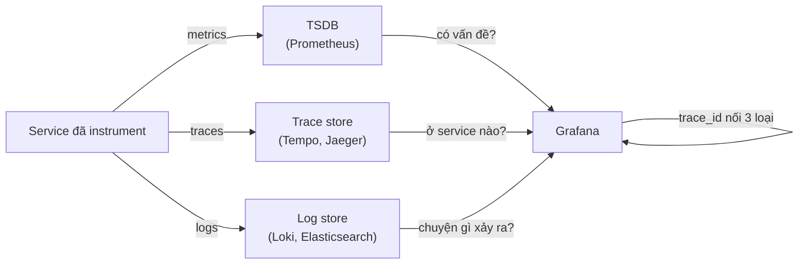
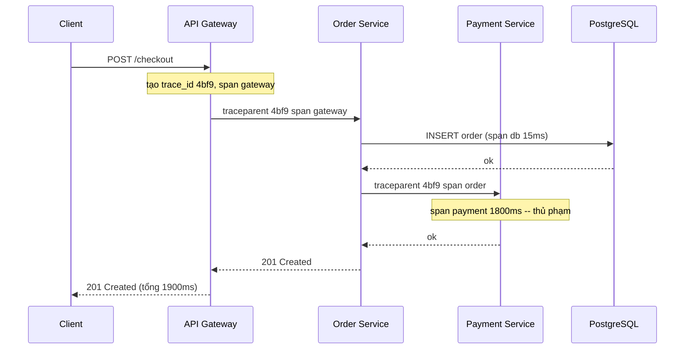
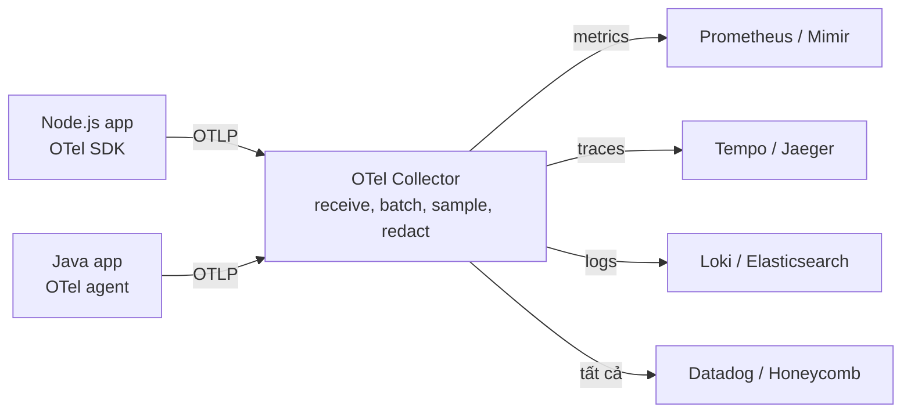
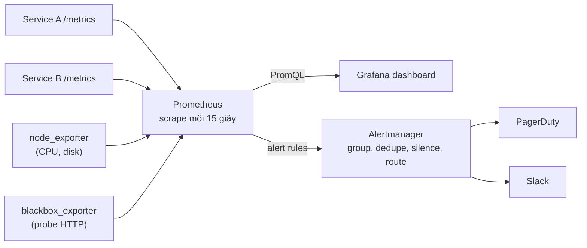
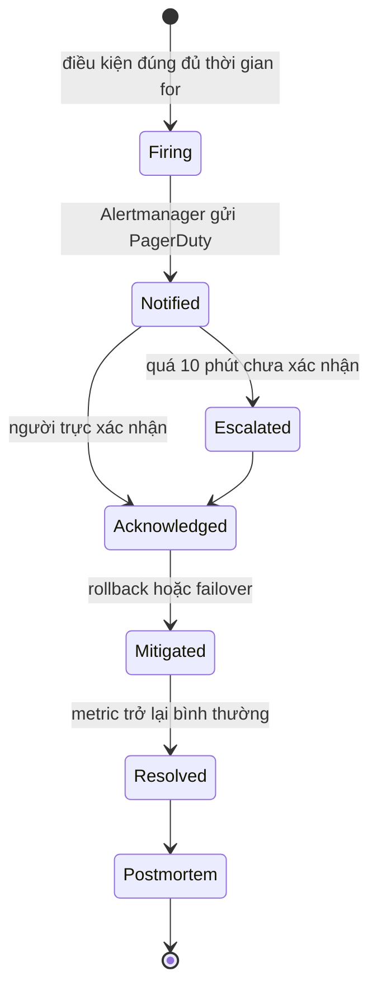

# Instrumentation, Visualization & Alerts

**Instrumentation** (gắn đo đạc) là việc thêm code hoặc agent vào ứng dụng để nó **tự phát ra dữ liệu về chính nó**: log mỗi sự kiện, metric đếm request, trace lần theo một request qua nhiều service. Có dữ liệu rồi, **Visualization** (trực quan hoá) biến nó thành dashboard để con người hiểu, còn **Alerts** (cảnh báo) tự động gọi người trực khi có gì đó không ổn.

**Tương tự đơn giản:** Instrumentation giống lắp cảm biến nhiệt, cảm biến khói và camera trong toà nhà. Visualization là màn hình tổng ở phòng bảo vệ hiển thị mọi cảm biến. Alerts là chuông báo cháy -- chỉ nên reo khi có cháy thật; nếu reo mỗi lần ai đó nướng bánh, mọi người sẽ học cách lờ nó đi.

---

:::note[Ghi nhớ nhanh]

- ⭐ **Ba trụ cột telemetry: logs, metrics, traces** — metrics cho biết "có vấn đề", traces chỉ ra "ở service nào", logs giải thích "chính xác chuyện gì".
- ⭐ **Alert theo triệu chứng user thấy, không theo nguyên nhân** — page khi tỉ lệ lỗi/latency vi phạm SLO, không page vì CPU 80%.
- **OpenTelemetry là chuẩn mở, trung lập vendor** — instrument một lần, gửi tới Prometheus, Jaeger, Datadog... tuỳ chọn.
- **Structured logging (JSON) + trace_id** — log máy đọc được, nối được với trace.
- **Cẩn thận cardinality** — không đưa `user_id`, `request_id` vào label của metric; mỗi tổ hợp label là một time series riêng.
- **Mỗi alert phải actionable và có runbook** — alert không cần hành động là nguồn gốc của alert fatigue.

:::

---

## Mục lục

- [Vì sao cần instrumentation và alert?](#vì-sao-cần-instrumentation-và-alert)
- [1. Instrumentation là gì?](#1-instrumentation-là-gì)
- [2. Logs và structured logging](#2-logs-và-structured-logging)
- [3. Metrics](#3-metrics)
- [4. Traces](#4-traces)
- [5. OpenTelemetry](#5-opentelemetry)
- [6. Visualization với Prometheus và Grafana](#6-visualization-với-prometheus-và-grafana)
- [7. Alerts](#7-alerts)
- [8. Alert fatigue và on-call](#8-alert-fatigue-và-on-call)
- [Khi nào dùng?](#khi-nào-dùng)
- [Lỗi thường gặp](#lỗi-thường-gặp)
- [Câu hỏi phỏng vấn](#câu-hỏi-phỏng-vấn)

---

## Vì sao cần instrumentation và alert?

**Vấn đề:** Một request checkout đi qua API gateway, order service, payment service, inventory service, Kafka, PostgreSQL. Khi user báo "thanh toán chậm", bạn không biết chậm ở đâu: mỗi service có log riêng, định dạng khác nhau, không có cách nối các dòng log thuộc cùng một request. Còn nếu không có alert, ai đó phải ngồi nhìn dashboard 24/7.

**Giải pháp:** Instrument mọi service theo một chuẩn chung (OpenTelemetry): log có cấu trúc kèm `trace_id`, metric theo RED, trace phân tán. Gom về một nơi, vẽ dashboard theo service, và đặt alert dựa trên SLO để chỉ gọi người khi user thật sự bị ảnh hưởng.

:::tip[Dùng thực tế]

- **Prometheus + Grafana** là bộ đôi mã nguồn mở phổ biến nhất cho metrics và dashboard (Prometheus là dự án CNCF thứ hai "graduated", sau Kubernetes).
- **OpenTelemetry** (hợp nhất OpenTracing và OpenCensus năm 2019) được hầu hết vendor hỗ trợ: Datadog, New Relic, Honeycomb, Grafana, AWS X-Ray.
- **PagerDuty, Opsgenie, Grafana OnCall** quản lý lịch trực và leo thang (escalation) khi alert không được xác nhận.
- **ELK/EFK stack** (Elasticsearch + Logstash/Fluentd + Kibana) và **Grafana Loki** dùng để gom và tìm kiếm log.

:::

---

## 1. Instrumentation là gì?

Có hai cách instrument:

| Cách                         | Mô tả                                                         | Ưu điểm                         | Nhược điểm                          |
| ---------------------------- | ------------------------------------------------------------- | ------------------------------- | ----------------------------------- |
| **Auto-instrumentation**     | Agent/thư viện tự hook vào HTTP server, DB driver, Kafka client | Nhanh, không sửa code, phủ rộng | Chỉ thấy tầng kỹ thuật, không hiểu nghiệp vụ |
| **Manual instrumentation**   | Dev tự thêm span, metric, log tại điểm quan trọng             | Có ngữ cảnh nghiệp vụ (order_id, loại thanh toán) | Tốn công, dễ thiếu sót |

Thực tế dùng **cả hai**: auto-instrumentation làm nền, manual cho các luồng nghiệp vụ quan trọng.

### Ba trụ cột telemetry



| Trụ cột     | Dạng dữ liệu                                | Chi phí lưu trữ | Trả lời câu hỏi                           |
| ----------- | ------------------------------------------- | --------------- | ----------------------------------------- |
| **Metrics** | Số theo thời gian, đã tổng hợp              | Thấp            | Tỉ lệ lỗi đang là bao nhiêu? Có xu hướng tăng? |
| **Logs**    | Sự kiện rời rạc, chi tiết                   | Cao             | Request này lỗi vì sao, thông báo lỗi là gì? |
| **Traces**  | Cây span của một request qua nhiều service  | Trung bình–cao (thường lấy mẫu) | Request chậm ở service/hàm nào?     |

---

## 2. Logs và structured logging

**Structured logging** nghĩa là ghi log thành **dữ liệu có cấu trúc** (thường là JSON) thay vì chuỗi văn bản tự do. Máy lọc, đếm, tìm kiếm được theo trường.

```text
# Không cấu trúc -- khó tìm kiếm, khó parse
2026-10-01 10:15:02 ERROR Payment failed for order 8812 user 77 amount 49.99

# Có cấu trúc -- lọc được theo bất kỳ trường nào
{"time":"2026-10-01T10:15:02Z","level":"error","msg":"payment failed","orderId":8812,"userId":77,"amount":49.99,"provider":"stripe","traceId":"4bf92f3577b34da6a3ce929d0e0e4736"}
```

```ts
import pino from 'pino';
import { trace } from '@opentelemetry/api';

// Logger JSON, có sẵn thông tin service
const baseLogger = pino({
  level: process.env.LOG_LEVEL ?? 'info',
  base: { service: 'checkout-api', env: process.env.NODE_ENV },
  redact: ['req.headers.authorization', 'card.number', 'password'], // che dữ liệu nhạy cảm
});

// Gắn trace_id hiện tại vào mọi log để nối log với trace
export function getLogger() {
  const span = trace.getActiveSpan();
  const ctx = span?.spanContext();
  return ctx
    ? baseLogger.child({ traceId: ctx.traceId, spanId: ctx.spanId })
    : baseLogger;
}

// Dùng
getLogger().error({ orderId: 8812, provider: 'stripe', err }, 'payment failed');
```

### Quy tắc log tốt

- **Log level** rõ ràng: `debug` (chỉ bật khi điều tra), `info` (sự kiện nghiệp vụ), `warn` (bất thường nhưng tự xử lý được), `error` (cần chú ý).
- **Luôn kèm correlation ID / trace_id** để nối log giữa các service.
- **Không log dữ liệu nhạy cảm**: mật khẩu, token, số thẻ, PII.
- **Log sự kiện, không log từng dòng code**: log quá nhiều tốn tiền (log store tính phí theo GB) và chìm thông tin quan trọng.
- Ghi ra **stdout**, để hạ tầng (Fluent Bit, Vector, Promtail) gom về -- theo nguyên tắc "Twelve-Factor App".

---

## 3. Metrics

**Metric** là một con số đo theo thời gian, kèm **label** (nhãn) để phân loại. Ví dụ: `http_requests_total{method="POST", route="/orders", status="500"}`.

### Bốn loại metric trong Prometheus

| Loại          | Đặc điểm                                     | Ví dụ                                    |
| ------------- | -------------------------------------------- | ---------------------------------------- |
| **Counter**   | Chỉ tăng (reset khi restart)                 | Tổng số request, tổng số lỗi             |
| **Gauge**     | Tăng giảm tuỳ ý                              | Số kết nối đang mở, độ dài queue, RAM    |
| **Histogram** | Đếm giá trị vào các bucket, tính percentile ở server | Thời gian xử lý request          |
| **Summary**   | Tính percentile ngay ở client                | Ít dùng hơn (không gộp được giữa nhiều instance) |

```ts
import express from 'express';
import client from 'prom-client';

const app = express();
client.collectDefaultMetrics(); // CPU, memory, event loop lag của Node.js

const httpDuration = new client.Histogram({
  name: 'http_request_duration_seconds',
  help: 'Thời gian xử lý HTTP request',
  labelNames: ['method', 'route', 'status'] as const,
  buckets: [0.01, 0.05, 0.1, 0.25, 0.5, 1, 2.5, 5],
});

// Middleware đo RED cho mọi route
app.use((req, res, next) => {
  const end = httpDuration.startTimer();
  res.on('finish', () => {
    end({
      method: req.method,
      route: req.route?.path ?? 'unknown', // dùng route mẫu, KHÔNG dùng URL thật
      status: String(res.statusCode),
    });
  });
  next();
});

// Prometheus sẽ scrape endpoint này
app.get('/metrics', async (_req, res) => {
  res.set('Content-Type', client.register.contentType);
  res.send(await client.register.metrics());
});
```

### Cardinality -- bẫy chi phí số một

Mỗi tổ hợp giá trị label là **một time series riêng**. 5 method x 50 route x 10 status = 2.500 series -- ổn. Nhưng nếu thêm label `user_id` với 1 triệu user → 2,5 tỉ series, Prometheus sẽ hết RAM. Quy tắc: label chỉ chứa giá trị có **tập hữu hạn, nhỏ** (method, route mẫu, status code, region). ID cụ thể để trong log hoặc trace.

### Pull vs Push

- **Pull** (Prometheus): server định kỳ scrape `/metrics` của từng target -- dễ biết target nào chết (scrape fail).
- **Push** (StatsD, OTLP push, CloudWatch): ứng dụng đẩy metric đi -- hợp với job ngắn hạn, serverless (Prometheus dùng Pushgateway cho trường hợp này).

---

## 4. Traces

**Distributed tracing** lần theo một request qua nhiều service. Mỗi đơn vị công việc là một **span** (có tên, thời gian bắt đầu/kết thúc, thuộc tính); các span cùng một request chia sẻ **trace_id** và tạo thành cây cha–con.



Ngữ cảnh trace được truyền qua header chuẩn **W3C Trace Context** (`traceparent`), nên service viết bằng Go, Java, Node đều nối được vào cùng một trace.

### Sampling (lấy mẫu)

Lưu trace cho 100% request rất tốn kém ở quy mô lớn, nên thường lấy mẫu:

- **Head-based sampling**: quyết định giữ hay bỏ ngay khi request bắt đầu (ví dụ giữ 5%) -- rẻ, nhưng có thể bỏ sót trace lỗi.
- **Tail-based sampling**: quyết định sau khi trace kết thúc (giữ 100% trace lỗi hoặc chậm, 1% trace bình thường) -- giá trị cao hơn nhưng collector phải đệm toàn bộ span.

---

## 5. OpenTelemetry

**OpenTelemetry (OTel)** là dự án CNCF cung cấp **API, SDK và giao thức (OTLP)** thống nhất cho logs, metrics, traces. Bạn instrument một lần theo chuẩn OTel, rồi cấu hình gửi tới backend nào cũng được -- không bị khoá vào vendor.



```ts
// tracing.ts -- import file này TRƯỚC mọi module khác (node -r ./tracing.js app.js)
import { NodeSDK } from '@opentelemetry/sdk-node';
import { getNodeAutoInstrumentations } from '@opentelemetry/auto-instrumentations-node';
import { OTLPTraceExporter } from '@opentelemetry/exporter-trace-otlp-http';

const sdk = new NodeSDK({
  serviceName: 'checkout-api',
  traceExporter: new OTLPTraceExporter({
    url: process.env.OTEL_EXPORTER_OTLP_ENDPOINT, // ví dụ http://otel-collector:4318/v1/traces
  }),
  // Tự động tạo span cho http, express, pg, redis, kafkajs...
  instrumentations: [getNodeAutoInstrumentations()],
});

sdk.start();
process.on('SIGTERM', () => {
  sdk.shutdown().finally(() => process.exit(0));
});
```

```ts
// Manual span cho bước nghiệp vụ quan trọng
import { trace, SpanStatusCode } from '@opentelemetry/api';

const tracer = trace.getTracer('checkout');

export async function chargeOrder(orderId: string, amount: number) {
  return tracer.startActiveSpan('payment.charge', async (span) => {
    span.setAttributes({ 'order.id': orderId, 'payment.amount': amount });
    try {
      const result = await paymentGateway.charge(orderId, amount);
      span.setAttribute('payment.provider_ref', result.ref);
      return result;
    } catch (err) {
      span.recordException(err as Error);
      span.setStatus({ code: SpanStatusCode.ERROR });
      throw err;
    } finally {
      span.end();
    }
  });
}
```

**OTel Collector** là tiến trình trung gian: nhận dữ liệu, gom batch, lấy mẫu (tail sampling), xoá trường nhạy cảm, rồi xuất tới nhiều backend. Đặt Collector giữa app và backend giúp đổi backend mà không cần deploy lại app.

---

## 6. Visualization với Prometheus và Grafana

**Prometheus** thu thập metric (pull), lưu vào time-series database (TSDB), cho phép truy vấn bằng **PromQL** và đánh giá alert rule. **Grafana** kết nối tới Prometheus (và Loki, Tempo, Elasticsearch, CloudWatch...) để vẽ dashboard.



### PromQL mẫu cho dashboard RED

```text
# Rate: số request mỗi giây theo route (trung bình trượt 5 phút)
sum by (route) (rate(http_request_duration_seconds_count[5m]))

# Errors: tỉ lệ lỗi 5xx
sum(rate(http_request_duration_seconds_count{status=~"5.."}[5m]))
  / sum(rate(http_request_duration_seconds_count[5m]))

# Duration: p99 latency theo route
histogram_quantile(0.99,
  sum by (le, route) (rate(http_request_duration_seconds_bucket[5m])))
```

### Nguyên tắc dashboard tốt

- **Một dashboard tổng quan** cho mỗi service: 4 golden signals ở hàng đầu, tài nguyên (USE) ở dưới.
- **Từ tổng quan đi vào chi tiết** (drill-down): click vào panel lỗi → xem log/trace tương ứng.
- **Đánh dấu sự kiện deploy** (annotation) lên đồ thị -- phần lớn sự cố xảy ra ngay sau deploy.
- **Dashboard as code** (Grafana JSON trong git, Terraform, Grafonnet) để review và tái tạo được.
- Tránh dashboard 60 panel không ai hiểu; mỗi panel phải trả lời một câu hỏi.

---

## 7. Alerts

Alert là quy tắc tự động: **khi điều kiện X đúng trong Y phút → gửi thông báo tới Z**. Hai mức nghiêm trọng điển hình:

| Mức        | Kênh                         | Ví dụ                                              |
| ---------- | ---------------------------- | -------------------------------------------------- |
| **Page**   | Gọi điện/push cho người trực, cần xử lý ngay | Tỉ lệ checkout lỗi vượt ngưỡng, đốt error budget nhanh |
| **Ticket** | Tạo ticket/Slack, xử lý giờ hành chính | Disk sẽ đầy trong 3 ngày, chứng chỉ hết hạn trong 14 ngày |

### Alert theo triệu chứng, không theo nguyên nhân

- **Triệu chứng** (symptom): user thấy lỗi, latency cao -- **page**.
- **Nguyên nhân** (cause): CPU cao, một pod restart -- chỉ là thông tin chẩn đoán, thường **không page**. CPU 90% mà user không bị ảnh hưởng thì không cần đánh thức ai lúc 3 giờ sáng.

### Alert rule mẫu (Prometheus)

```yaml
groups:
  - name: checkout-api-slo
    rules:
      # Tỉ lệ lỗi cao kéo dài -- page
      - alert: CheckoutHighErrorRate
        expr: |
          sum(rate(http_request_duration_seconds_count{service="checkout-api",status=~"5.."}[5m]))
            / sum(rate(http_request_duration_seconds_count{service="checkout-api"}[5m]))
            > 0.02
        for: 5m            # phải đúng liên tục 5 phút, tránh báo nhầm do nhiễu
        labels:
          severity: page
          team: payments
        annotations:
          summary: "Checkout lỗi trên 2% trong 5 phút"
          description: "Tỉ lệ 5xx hiện tại: {{ $value | humanizePercentage }}"
          runbook_url: "https://runbooks.example.com/checkout/high-error-rate"
          dashboard: "https://grafana.example.com/d/checkout"

      # Burn rate nhanh (SLO 99.9%): đốt 2% budget trong 1 giờ
      - alert: CheckoutErrorBudgetFastBurn
        expr: |
          (job:slo_errors_per_request:ratio_rate1h{service="checkout-api"} > (14.4 * 0.001))
          and
          (job:slo_errors_per_request:ratio_rate5m{service="checkout-api"} > (14.4 * 0.001))
        labels:
          severity: page
        annotations:
          summary: "Checkout đang đốt error budget nhanh gấp 14.4 lần"

      # Dự báo disk đầy -- ticket, không page
      - alert: DiskWillFillIn3Days
        expr: predict_linear(node_filesystem_avail_bytes{mountpoint="/"}[6h], 3 * 86400) < 0
        for: 30m
        labels:
          severity: ticket
        annotations:
          summary: "Disk {{ $labels.instance }} dự kiến đầy trong 3 ngày"
```

Burn-rate alert kết hợp **cửa sổ dài** (1 giờ -- đảm bảo vấn đề đủ lớn) và **cửa sổ ngắn** (5 phút -- đảm bảo vấn đề vẫn đang diễn ra, alert tự hết nhanh khi đã sửa). Đây là kỹ thuật "multiwindow, multi-burn-rate" trong sách The Site Reliability Workbook.

### Alertmanager

Prometheus đánh giá rule, còn **Alertmanager** xử lý phần "gửi":

- **Grouping**: 50 pod cùng lỗi → gộp thành 1 thông báo thay vì 50.
- **Deduplication**: nhiều Prometheus (HA) cùng bắn một alert → chỉ gửi một lần.
- **Inhibition**: khi cả cluster down, chặn các alert con (từng service down).
- **Silence**: tắt tạm alert trong lúc bảo trì có kế hoạch.
- **Routing**: `team: payments` → PagerDuty của team payments; `severity: ticket` → Slack.

---

## 8. Alert fatigue và on-call

**Alert fatigue** (mệt mỏi vì cảnh báo) xảy ra khi có quá nhiều alert, phần lớn không cần hành động. Người trực bắt đầu lờ đi, tắt tiếng, hoặc bấm "acknowledge" theo phản xạ -- và bỏ lỡ alert thật. Trong y tế, hiện tượng tương tự (alarm fatigue) được ghi nhận là nguyên nhân gây sự cố với bệnh nhân.

### Dấu hiệu

- Alert tự hết (auto-resolve) trước khi ai kịp xem -- "flapping".
- Phản ứng phổ biến nhất với một alert là "kệ nó".
- Mỗi ca trực bị page hàng chục lần, nhiều lần ban đêm.

### Cách chống

| Biện pháp                               | Chi tiết                                                         |
| --------------------------------------- | ---------------------------------------------------------------- |
| **Mỗi alert phải actionable**           | Nếu nhận alert mà không cần làm gì → xoá hoặc hạ thành ticket     |
| **Alert theo SLO/triệu chứng**          | Bỏ alert theo CPU, RAM, pod restart đơn lẻ                       |
| **Dùng `for:` và burn rate**            | Tránh báo vì một đỉnh nhọn ngắn                                  |
| **Grouping, inhibition**                | Một sự cố = một thông báo                                        |
| **Runbook cho mọi alert page**          | Link tới tài liệu: kiểm tra gì, lệnh nào, liên hệ ai            |
| **Review định kỳ**                      | Hàng tuần xem alert nào bắn nhiều nhất, alert nào bị bỏ qua      |

### On-call (trực sự cố)

- **Lịch xoay vòng** (rotation) theo tuần, có **primary** và **secondary**; ngoài giờ có thể **follow-the-sun** (chuyển ca theo múi giờ giữa các văn phòng).
- **Escalation policy**: primary không acknowledge trong 5–15 phút → gọi secondary → gọi trưởng nhóm.
- **Quy trình sự cố**: phát hiện → acknowledge → giảm thiểu (rollback, failover, tắt feature flag) **trước**, tìm nguyên nhân gốc **sau**.
- **Postmortem không đổ lỗi** (blameless postmortem): ghi lại timeline, nguyên nhân gốc, hành động phòng ngừa; tập trung vào hệ thống chứ không vào cá nhân.
- Google SRE gợi ý giới hạn số sự cố mỗi ca trực (khoảng tối đa 2 sự cố mỗi ca 12 giờ) để người trực có thời gian xử lý và viết postmortem đúng cách.



---

## Khi nào dùng?

| Tình huống                                                | Gợi ý                                                       |
| --------------------------------------------------------- | ----------------------------------------------------------- |
| Monolith nhỏ, một server                                  | Structured log + metrics RED + vài alert SLO là đủ; trace chưa cần thiết |
| Microservices, nhiều team                                 | OpenTelemetry + Collector + tracing là bắt buộc             |
| Ngân sách hạn chế                                         | Prometheus + Grafana + Loki + Tempo (mã nguồn mở, tự host)  |
| Team nhỏ không muốn vận hành hạ tầng giám sát             | SaaS: Datadog, New Relic, Grafana Cloud, Honeycomb          |
| Job batch ngắn hạn, serverless                            | Push metrics (OTLP, Pushgateway) thay vì pull               |

**Không nên:**

- Đặt alert cho mọi metric "cho chắc" -- dẫn tới alert fatigue.
- Đưa ID có cardinality cao vào label metric.
- Lưu 100% trace và log debug vĩnh viễn ở quy mô lớn -- chi phí giám sát có thể vượt chi phí hạ tầng chính.

---

## Lỗi thường gặp

### Lỗi 1: Dùng URL thật làm label

`route="/users/12345"` thay vì `route="/users/:id"` → mỗi user một series, bùng nổ cardinality. Luôn dùng route mẫu.

### Lỗi 2: Log không có trace_id

Tìm thấy trace chậm nhưng không biết log nào thuộc request đó. Gắn `traceId` vào mọi log (logger child như ví dụ ở trên).

### Lỗi 3: Alert không có runbook

Người trực mới nhận alert lúc 3 giờ sáng và không biết làm gì. Mỗi alert page phải có `runbook_url` và link dashboard.

### Lỗi 4: Alert không có `for:`

Một đỉnh 10 giây cũng page người trực. Thêm `for: 5m` hoặc dùng burn rate đa cửa sổ.

### Lỗi 5: Hệ thống giám sát chung số phận với hệ thống bị giám sát

Prometheus chạy trong cùng cluster bị sập → không ai nhận alert. Cần "giám sát người giám sát": dead man's switch (một alert luôn bắn; nếu ngừng nhận được nghĩa là pipeline alert hỏng), hoặc probe từ bên ngoài.

---

## Câu hỏi phỏng vấn

**1. Logs, metrics, traces khác nhau thế nào? Khi điều tra sự cố bạn dùng theo thứ tự nào?**

<details className="qa">
<summary>Xem đáp án</summary>

- **Metrics**: số tổng hợp, rẻ, phát hiện "có vấn đề" và xu hướng.
- **Traces**: đường đi của một request qua các service, chỉ ra "chậm/lỗi ở đâu".
- **Logs**: chi tiết sự kiện, giải thích "chính xác chuyện gì".

Thứ tự điển hình: alert từ metric → dashboard xác định service/thời điểm → mở trace mẫu của request lỗi → từ trace_id tìm log chi tiết.

</details>

**2. High cardinality là gì và vì sao nguy hiểm với Prometheus?**

<details className="qa">
<summary>Xem đáp án</summary>

Mỗi tổ hợp giá trị label là một time series riêng, Prometheus giữ index các series active trong RAM. Label có nhiều giá trị (user_id, request_id, URL thật, email) làm số series bùng nổ → tốn RAM, truy vấn chậm, có thể OOM. Giữ label có tập giá trị nhỏ, đưa ID cụ thể vào log hoặc trace attribute.

</details>

**3. Vì sao nên alert theo triệu chứng thay vì nguyên nhân?**

<details className="qa">
<summary>Xem đáp án</summary>

Nguyên nhân có vô số (CPU, RAM, disk, GC, DB lock...) và nhiều khi không ảnh hưởng user -- page vì chúng gây alert fatigue. Triệu chứng (lỗi, latency vi phạm SLO) ít, ổn định, và luôn đáng hành động. Metric nguyên nhân vẫn được thu thập để chẩn đoán trên dashboard, chỉ là không page.

</details>

**4. OpenTelemetry giải quyết vấn đề gì? OTel Collector để làm gì?**

<details className="qa">
<summary>Xem đáp án</summary>

OTel là chuẩn mở cho API/SDK/giao thức (OTLP) của logs, metrics, traces -- instrument một lần, gửi tới bất kỳ backend nào, tránh vendor lock-in, và có chuẩn truyền ngữ cảnh (W3C traceparent) giữa nhiều ngôn ngữ. Collector là lớp trung gian: nhận, batch, lấy mẫu (kể cả tail-based), lọc dữ liệu nhạy cảm, xuất tới nhiều backend -- đổi backend không cần deploy lại app.

</details>

**5. Head-based và tail-based sampling khác nhau thế nào?**

<details className="qa">
<summary>Xem đáp án</summary>

Head-based quyết định ngay đầu request (ví dụ giữ 5%), rẻ và đơn giản nhưng có thể bỏ sót trace lỗi/chậm hiếm gặp. Tail-based quyết định sau khi trace hoàn tất, nên giữ được 100% trace lỗi hoặc chậm; đổi lại collector phải đệm toàn bộ span của trace và định tuyến span cùng trace về cùng một collector instance.

</details>

**6. Làm sao giảm alert fatigue cho team on-call?**

<details className="qa">
<summary>Xem đáp án</summary>

Chỉ page cho alert actionable, theo SLO/triệu chứng; dùng `for:` và burn rate đa cửa sổ để lọc nhiễu; grouping/inhibition để một sự cố là một thông báo; hạ các cảnh báo không gấp xuống ticket; mỗi alert có runbook; review hàng tuần các alert ồn nhất và xoá/sửa; theo dõi số page mỗi ca trực như một metric sức khoẻ của team.

</details>
