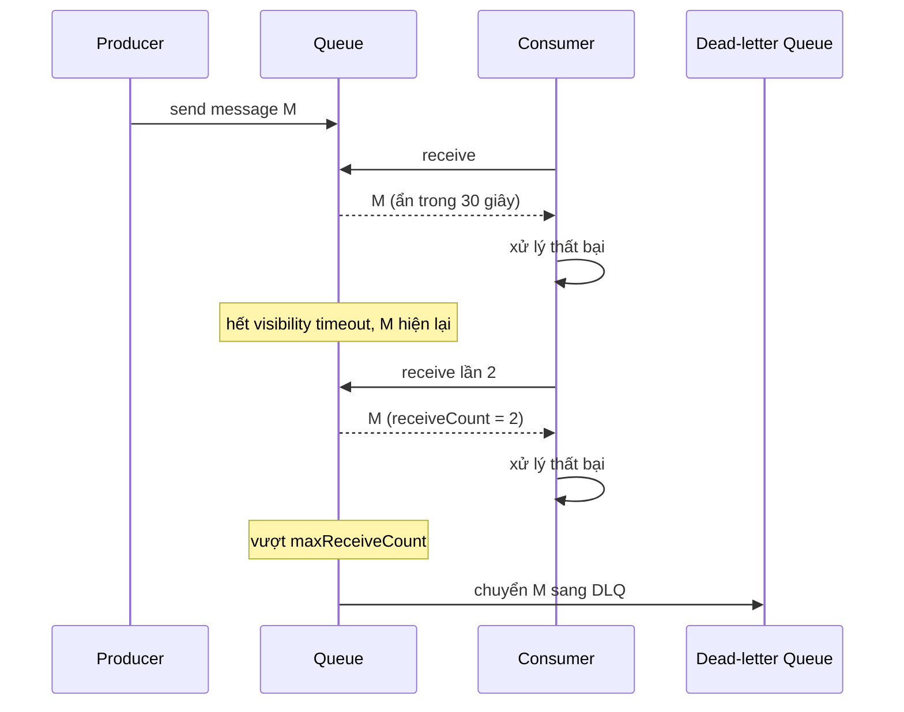
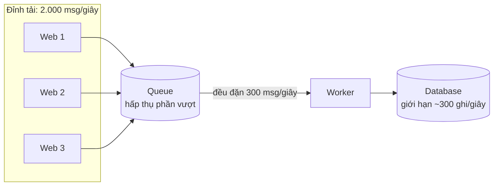
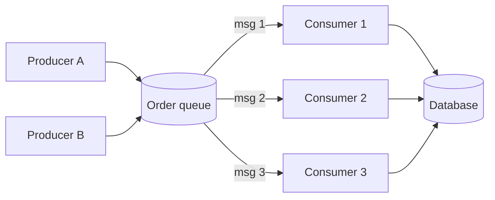
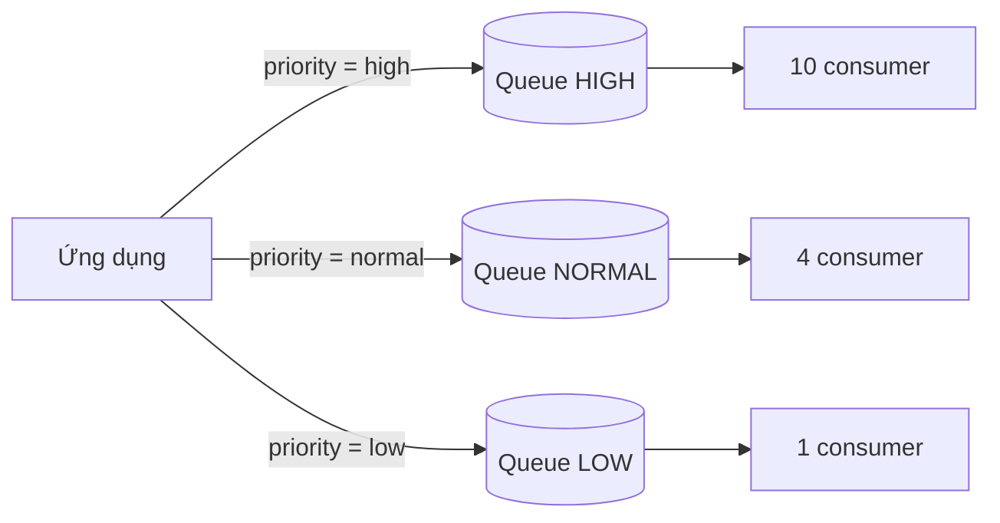
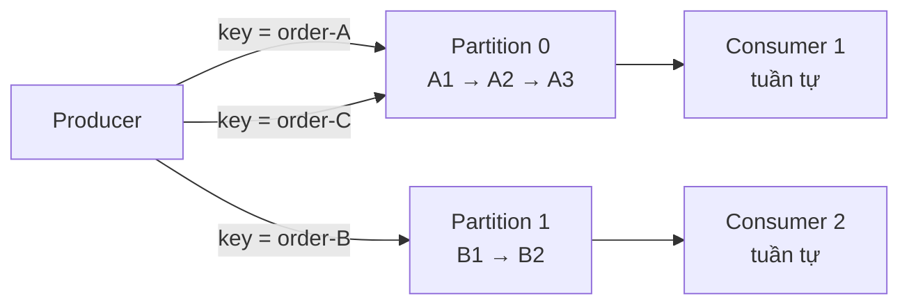

# Messaging Patterns: Queue

**Cloud Design Patterns** là bộ mẫu thiết kế do **Microsoft Azure Architecture Center** tổng hợp để giải các bài toán lặp đi lặp lại khi xây hệ thống phân tán trên cloud: độ tin cậy, khả năng mở rộng, quản lý dữ liệu, giao tiếp giữa các thành phần. Dù mang tên Azure, các pattern này **không phụ thuộc nhà cung cấp** -- áp dụng y hệt trên AWS, GCP hay hạ tầng tự dựng. Bài này mở đầu nhóm **Messaging** với bốn pattern xoay quanh **hàng đợi (queue)**: Queue-Based Load Leveling, Competing Consumers, Priority Queue và Sequential Convoy.

**Tương tự đơn giản:** Một bếp nhà hàng đông khách. Phiếu order được ghim lên thanh treo (queue) thay vì bồi bàn đứng chờ đầu bếp nấu xong (**load leveling**). Nhiều đầu bếp cùng lấy phiếu từ thanh treo (**competing consumers**). Phiếu của khách VIP được treo ở thanh riêng, nấu trước (**priority queue**). Còn các món của **cùng một bàn** phải ra theo đúng thứ tự khai vị → món chính → tráng miệng, dù các bàn khác nhau được nấu song song (**sequential convoy**).

---

:::note[Ghi nhớ nhanh]

- ⭐ **Queue tách producer khỏi consumer về thời gian và tốc độ** — producer ghi nhanh rồi đi, consumer xử lý theo nhịp của mình; đỉnh tải được "san phẳng".
- ⭐ **Competing consumers đòi hỏi message xử lý idempotent** — hầu hết queue là at-least-once, một message có thể đến hai lần.
- **Queue-based load leveling bảo vệ downstream yếu** — DB, API bên thứ ba có giới hạn throughput; queue hấp thụ phần vượt.
- **Priority queue: nhiều queue riêng tốt hơn một queue có trường priority** — đơn giản, cấp riêng số consumer cho từng mức.
- **Sequential convoy: thứ tự trong nhóm, song song giữa các nhóm** — dùng session/partition key (Kafka partition, SQS FIFO MessageGroupId, Service Bus sessions).
- **Luôn có dead-letter queue** — message lỗi lặp lại không được chặn cả hàng.

:::

---

## Mục lục

- [Vì sao cần messaging patterns?](#vì-sao-cần-messaging-patterns)
- [1. Cloud Design Patterns là gì?](#1-cloud-design-patterns-là-gì)
- [2. Messaging](#2-messaging)
- [3. Queue-Based Load Leveling](#3-queue-based-load-leveling)
- [4. Competing Consumers](#4-competing-consumers)
- [5. Priority Queue](#5-priority-queue)
- [6. Sequential Convoy](#6-sequential-convoy)
- [7. So sánh bốn pattern](#7-so-sánh-bốn-pattern)
- [Khi nào dùng?](#khi-nào-dùng)
- [Lỗi thường gặp](#lỗi-thường-gặp)
- [Câu hỏi phỏng vấn](#câu-hỏi-phỏng-vấn)

---

## Vì sao cần messaging patterns?

**Vấn đề:** Khi service A gọi đồng bộ service B (HTTP), A phụ thuộc chặt vào B: B chậm thì A chậm, B sập thì A lỗi, B chỉ chịu được 200 request/giây thì đỉnh 2.000 request/giây của A sẽ đánh sập B. Trong hệ thống có hàng chục service, chuỗi phụ thuộc đồng bộ khiến một sự cố nhỏ lan ra toàn hệ thống.

**Giải pháp:** Đặt một **message broker** (hàng đợi) ở giữa. A gửi message rồi tiếp tục công việc; B lấy message theo khả năng của mình. Các pattern trong bài trả lời những câu hỏi tiếp theo: làm sao san tải, làm sao xử lý song song, làm sao ưu tiên việc gấp, làm sao giữ thứ tự khi cần.

:::tip[Dùng thực tế]

- **Amazon SQS** (ra mắt 2004 -- một trong những dịch vụ AWS đầu tiên) là hàng đợi đứng sau rất nhiều hệ thống xử lý đơn hàng, ảnh, video.
- **RabbitMQ**, **Azure Service Bus**, **Google Cloud Pub/Sub**, **Apache Kafka** -- các broker phổ biến; Kafka dùng partition để vừa song song vừa giữ thứ tự.
- **Sidekiq (Ruby), Celery (Python), BullMQ (Node.js)** -- thư viện background job dựa trên Redis/RabbitMQ, áp dụng sẵn competing consumers và retry.
- **Uber, LinkedIn** dùng Kafka làm xương sống sự kiện; LinkedIn là nơi Kafka ra đời (2011).

:::

---

## 1. Cloud Design Patterns là gì?

Azure Architecture Center liệt kê khoảng 40+ pattern, mỗi pattern có cấu trúc: **Context and problem → Solution → Issues and considerations → When to use → Example**. Bài viết trong topic này theo đúng khuôn đó. roadmap.sh chia chúng thành các nhóm:

| Nhóm                          | Mục tiêu                                     | Ví dụ pattern                                               |
| ----------------------------- | -------------------------------------------- | ----------------------------------------------------------- |
| **Messaging**                 | Giao tiếp bất đồng bộ, tách rời thành phần   | Queue-Based Load Leveling, Competing Consumers, Pub/Sub, Claim Check, Async Request-Reply |
| **Data Management**           | Quản lý, đồng bộ, phân vùng dữ liệu          | Cache-Aside, CQRS, Event Sourcing, Sharding, Materialized View |
| **Design and Implementation** | Cấu trúc, triển khai, tái sử dụng            | Ambassador, Sidecar, Strangler Fig, Gateway Aggregation, BFF |
| **Reliability**               | Sẵn sàng, phục hồi, bảo mật                  | Circuit Breaker, Retry, Bulkhead, Health Endpoint Monitoring, Throttling |

Nhóm Messaging trên roadmap gồm: Queue-Based Load Leveling, Competing Consumers, Priority Queue, Sequential Convoy (bài này); Publisher/Subscriber, Choreography, Pipes and Filters, Claim Check (bài sau); Async Request-Reply, Scheduler Agent Supervisor (bài tiếp theo).

---

## 2. Messaging

**Messaging** là cách các thành phần giao tiếp bằng cách **gửi message qua một kênh trung gian (broker)** thay vì gọi trực tiếp.

### Hai mô hình cơ bản

| Mô hình                    | Cách hoạt động                                          | Ví dụ                                       |
| -------------------------- | ------------------------------------------------------- | ------------------------------------------- |
| **Point-to-point (queue)** | Mỗi message được **một** consumer xử lý                 | SQS, RabbitMQ queue, Service Bus queue      |
| **Publish/Subscribe**      | Mỗi message được gửi tới **mọi** subscriber             | SNS, Google Pub/Sub, Kafka (nhiều consumer group) |

### Command vs Event

- **Command** (lệnh): "hãy làm X" -- gửi tới đúng một nơi xử lý, ví dụ `ChargePayment`.
- **Event** (sự kiện): "X đã xảy ra" -- phát cho ai quan tâm, ví dụ `OrderPlaced`.

### Đảm bảo giao nhận (delivery guarantees)

| Đảm bảo              | Ý nghĩa                                           | Hệ quả                                     |
| -------------------- | ------------------------------------------------- | ------------------------------------------ |
| **At-most-once**     | Tối đa một lần, có thể mất                        | Chỉ dùng cho dữ liệu không quan trọng (metric) |
| **At-least-once**    | Ít nhất một lần, có thể trùng                     | Mặc định của hầu hết broker → consumer phải **idempotent** |
| **Exactly-once**     | Đúng một lần                                      | Chỉ đạt được trong phạm vi hẹp (Kafka transactions); thực tế là at-least-once + dedupe |

### Cơ chế chung của queue

- **Visibility timeout / ack**: consumer nhận message, message bị "ẩn" tạm thời; xử lý xong thì **ack** (xoá); nếu consumer chết hoặc quá hạn, message hiện lại cho consumer khác.
- **Dead-letter queue (DLQ)**: message thất bại quá N lần được chuyển sang queue riêng để điều tra, không chặn hàng chính.
- **Retention**: thời gian giữ message (SQS mặc định 4 ngày, tối đa 14 ngày).



---

## 3. Queue-Based Load Leveling

### Bối cảnh và vấn đề

Nhiều tác vụ gọi chung một service có giới hạn công suất (database, API bên thứ ba có rate limit, service legacy). Tải đến **không đều**: đỉnh lúc flash sale, gần như không có gì lúc 3 giờ sáng. Nếu gọi trực tiếp, đỉnh tải làm service quá tải → timeout, lỗi, có thể sập dây chuyền.

### Giải pháp

Đặt **queue** giữa tác vụ và service. Tác vụ ghi message vào queue (rất nhanh, broker chịu được throughput cao); service lấy message ra **với tốc độ ổn định** mà nó chịu được. Queue đóng vai trò **bộ đệm** -- như hồ chứa nước điều tiết lũ.



**Ước lượng:** đỉnh 2.000 msg/giây kéo dài 60 giây, worker xử lý 300 msg/giây → backlog tối đa ≈ (2.000 - 300) x 60 = **102.000 message**, cần thêm ≈ 102.000 / 300 ≈ **340 giây** (gần 6 phút) để xả hết sau khi đỉnh qua (giả sử không có tải mới). Đây là độ trễ bạn đánh đổi để DB không sập.

### Khi nào dùng

- Downstream có giới hạn throughput cứng (DB, API bên thứ ba có rate limit, hệ thống legacy).
- Tải có đỉnh nhọn, không dự đoán được.
- Tác vụ không cần kết quả tức thì (gửi email, xử lý ảnh, đồng bộ dữ liệu, tính điểm thưởng).

### Khi nào không dùng

- Caller cần phản hồi ngay trong cùng request với độ trễ thấp (ví dụ kiểm tra số dư trước khi cho phép giao dịch).
- Tải luôn đều và downstream dư sức -- queue chỉ thêm độ phức tạp và độ trễ.

### Cân nhắc

- **Queue không phải vô hạn**: đặt giới hạn độ dài/retention và **giám sát độ dài queue** (queue depth) và **tuổi message cũ nhất** -- metric quan trọng nhất của pattern này.
- **Kết hợp autoscaling**: scale số worker theo độ dài queue (KEDA trên Kubernetes, SQS-based scaling trên AWS) -- nhưng không scale vượt giới hạn của downstream.
- **Phản hồi cho user**: vì xử lý bất đồng bộ, cần cơ chế báo kết quả (polling, webhook, push) -- xem Async Request-Reply.
- **Backpressure**: khi queue quá dài, có thể từ chối bớt ở đầu vào (HTTP 429) thay vì tích luỹ vô hạn.

---

## 4. Competing Consumers

### Bối cảnh và vấn đề

Một queue nhận rất nhiều message, một consumer duy nhất xử lý không kịp; đồng thời consumer đó là **điểm hỏng đơn** (single point of failure). Khối lượng message thay đổi theo thời gian, cần mở rộng/thu hẹp linh hoạt.

### Giải pháp

Cho **nhiều consumer cùng đọc một queue**. Mỗi message chỉ được giao cho **một** consumer (chúng "cạnh tranh" nhau). Broker tự cân bằng tải; consumer chết thì message của nó (chưa ack) được giao lại cho consumer khác.



### Ví dụ code: consumer SQS idempotent

```ts
import {
  SQSClient, ReceiveMessageCommand, DeleteMessageCommand,
} from '@aws-sdk/client-sqs';
import { Pool } from 'pg';

const sqs = new SQSClient({});
const db = new Pool({ connectionString: process.env.DATABASE_URL });
const QUEUE_URL = process.env.ORDER_QUEUE_URL as string;

// Idempotent: dùng bảng processed_messages với khoá duy nhất
async function handle(messageId: string, body: { orderId: string }) {
  const client = await db.connect();
  try {
    await client.query('BEGIN');
    const inserted = await client.query(
      'INSERT INTO processed_messages(message_id) VALUES ($1) ON CONFLICT DO NOTHING',
      [messageId],
    );
    if (inserted.rowCount === 0) {
      await client.query('ROLLBACK'); // đã xử lý rồi -- bỏ qua message trùng
      return;
    }
    await client.query('UPDATE orders SET status = $1 WHERE id = $2', ['CONFIRMED', body.orderId]);
    await client.query('COMMIT');
  } catch (err) {
    await client.query('ROLLBACK');
    throw err;
  } finally {
    client.release();
  }
}

// Chạy N bản của vòng lặp này (N pod) -- chúng cạnh tranh nhau
export async function pollLoop() {
  for (;;) {
    const { Messages = [] } = await sqs.send(new ReceiveMessageCommand({
      QueueUrl: QUEUE_URL,
      MaxNumberOfMessages: 10,
      WaitTimeSeconds: 20,      // long polling, giảm request rỗng
      VisibilityTimeout: 60,    // phải lớn hơn thời gian xử lý tối đa
    }));
    for (const m of Messages) {
      try {
        await handle(m.MessageId!, JSON.parse(m.Body!));
        await sqs.send(new DeleteMessageCommand({ QueueUrl: QUEUE_URL, ReceiptHandle: m.ReceiptHandle! }));
      } catch (err) {
        // không xoá -- message sẽ hiện lại, sau maxReceiveCount thì vào DLQ
        console.error('xử lý thất bại', m.MessageId, err);
      }
    }
  }
}
```

### Khi nào dùng

- Khối lượng việc lớn, chia được thành các đơn vị **độc lập** xử lý song song.
- Cần khả năng chịu lỗi: một worker chết không làm mất việc.
- Khối lượng biến động -- scale worker lên xuống.

### Khi nào không dùng

- Các message **phụ thuộc thứ tự** với nhau (xem Sequential Convoy).
- Các bước của một tác vụ phải chạy tuần tự trên cùng trạng thái mà không thể chia nhỏ.

### Cân nhắc

- **Thứ tự không được đảm bảo**: msg 2 có thể xong trước msg 1.
- **Idempotency bắt buộc**: at-least-once + nhiều consumer = trùng lặp là chuyện bình thường (consumer xử lý xong nhưng chết trước khi ack).
- **Poison message** (message độc -- luôn làm consumer lỗi): phải có DLQ, nếu không nó sẽ bị retry mãi.
- **Visibility timeout** phải lớn hơn thời gian xử lý; tác vụ dài thì gia hạn (heartbeat/`ChangeMessageVisibility`).
- **Downstream là giới hạn thật**: 50 consumer cùng ghi một DB có thể làm DB quá tải -- giới hạn concurrency.
- **Kafka**: song song tối đa bằng **số partition** trong một consumer group; consumer thừa sẽ ngồi không.

---

## 5. Priority Queue

### Bối cảnh và vấn đề

Không phải mọi việc đều quan trọng như nhau: đơn hàng của khách premium, giao dịch thanh toán, email đặt lại mật khẩu cần xử lý trước báo cáo hàng tháng hay email marketing. Queue FIFO thường xử lý theo thứ tự đến, nên việc gấp phải chờ sau hàng nghìn việc không gấp.

### Giải pháp

Hai cách triển khai:

1. **Một queue hỗ trợ priority**: broker sắp xếp message theo mức ưu tiên (RabbitMQ priority queue với `x-max-priority`, Redis sorted set, ActiveMQ). Đơn giản nhưng không phải broker nào cũng hỗ trợ (SQS, Kafka không có).
2. **Nhiều queue, mỗi queue một mức ưu tiên** (khuyến nghị bởi Azure): producer gửi vào queue tương ứng; cấp **nhiều consumer hơn** (hoặc consumer mạnh hơn) cho queue ưu tiên cao, hoặc một pool consumer luôn đọc queue cao trước.



```ts
// Một pool consumer: luôn ưu tiên queue cao, nhưng chống "chết đói" cho queue thấp
const QUEUES = [
  { url: HIGH_URL, weight: 6 },
  { url: NORMAL_URL, weight: 3 },
  { url: LOW_URL, weight: 1 },
] as const;

// Weighted round-robin: trong mỗi chu kỳ 10 lượt, HIGH được 6, NORMAL 3, LOW 1
function buildSchedule(): string[] {
  return QUEUES.flatMap((q) => Array.from({ length: q.weight }, () => q.url));
}
```

### Khi nào dùng

- Có các loại việc với SLA khác nhau (thanh toán vs báo cáo).
- Phân tầng khách hàng (gói trả phí được xử lý nhanh hơn gói miễn phí).
- Cần đảm bảo việc khẩn cấp không bị chặn bởi việc hàng loạt (batch).

### Khi nào không dùng

- Mọi việc có cùng mức quan trọng -- thêm queue chỉ thêm phức tạp.
- Cần thứ tự tuyệt đối giữa các việc (priority làm đảo thứ tự).

### Cân nhắc

- **Starvation** (chết đói): nếu queue cao luôn có việc, queue thấp không bao giờ được xử lý. Dùng trọng số (weighted), consumer riêng cho từng mức, hoặc **aging** (nâng dần ưu tiên theo thời gian chờ).
- **Đừng tạo quá nhiều mức**: 2–3 mức thường đủ.
- **Chi phí**: nhiều queue × nhiều pool consumer = tốn tài nguyên khi tải thấp; có thể autoscale từng pool.
- **Ai được đặt priority?** Nếu client tự chọn, ai cũng sẽ chọn "high". Priority nên do server quyết định theo quy tắc nghiệp vụ.

---

## 6. Sequential Convoy

### Bối cảnh và vấn đề

Nhiều hệ thống cần xử lý message **theo đúng thứ tự** -- nhưng chỉ **trong một nhóm**. Ví dụ các sự kiện của **cùng một đơn hàng**: `OrderCreated` → `OrderPaid` → `OrderShipped`. Nếu `OrderShipped` được xử lý trước `OrderCreated` thì lỗi. Tuy nhiên đơn hàng A và đơn hàng B hoàn toàn độc lập. Nếu dùng một queue FIFO với một consumer duy nhất thì đúng thứ tự nhưng **không mở rộng được**; nếu dùng competing consumers thì mở rộng được nhưng **mất thứ tự**.

### Giải pháp

Nhóm các message liên quan theo một **khoá** (session ID, partition key, message group ID -- ví dụ `orderId`). Broker đảm bảo:

- Message cùng khoá đi vào cùng một "làn" (partition/session) và được **một consumer** xử lý **tuần tự**.
- Các làn khác nhau được xử lý **song song** bởi các consumer khác nhau.

"Convoy" (đoàn xe) ám chỉ mỗi nhóm message đi thành đoàn, giữ nguyên thứ tự.



### Triển khai trên các broker

| Broker                 | Cơ chế                                                                  |
| ---------------------- | ----------------------------------------------------------------------- |
| **Apache Kafka**       | Message cùng key → cùng partition (hash key); mỗi partition chỉ một consumer trong group |
| **Amazon SQS FIFO**    | `MessageGroupId`: thứ tự đảm bảo trong group, nhiều group xử lý song song |
| **Azure Service Bus**  | Sessions (`SessionId`): một receiver khoá một session tại một thời điểm |
| **RabbitMQ**           | Consistent hash exchange hoặc Single Active Consumer cho từng queue     |

```ts
import { Kafka } from 'kafkajs';

const kafka = new Kafka({ clientId: 'order-svc', brokers: [process.env.KAFKA_BROKER as string] });
const producer = kafka.producer({ idempotent: true }); // tránh trùng/đảo khi retry

export async function publishOrderEvent(orderId: string, type: string, payload: object) {
  await producer.send({
    topic: 'order-events',
    messages: [{
      key: orderId,                         // cùng orderId -> cùng partition -> đúng thứ tự
      value: JSON.stringify({ type, orderId, payload, at: new Date().toISOString() }),
    }],
  });
}
```

```ts
// SQS FIFO: tương đương
await sqs.send(new SendMessageCommand({
  QueueUrl: ORDER_FIFO_URL,                // tên queue phải kết thúc bằng .fifo
  MessageBody: JSON.stringify(event),
  MessageGroupId: event.orderId,           // thứ tự trong cùng đơn hàng
  MessageDeduplicationId: event.eventId,   // dedupe trong cửa sổ 5 phút
}));
```

### Khi nào dùng

- Sự kiện phải áp dụng theo thứ tự trên cùng một thực thể (đơn hàng, tài khoản ngân hàng, giỏ hàng, chat room).
- Change Data Capture (CDC): thay đổi của cùng một bản ghi phải áp dụng đúng thứ tự.
- Vẫn cần throughput cao nhờ song song giữa các thực thể.

### Khi nào không dùng

- Message độc lập, không cần thứ tự -- dùng competing consumers thuần sẽ đơn giản và nhanh hơn.
- Cần thứ tự **toàn cục** trên mọi message -- khi đó chỉ có một làn, không mở rộng được (cân nhắc lại thiết kế).

### Cân nhắc

- **Head-of-line blocking**: một message lỗi trong nhóm chặn cả nhóm phía sau. Phải quyết định: retry đến khi thành công (chặn nhóm), hay đẩy vào DLQ và chấp nhận phá thứ tự (cần cơ chế bù).
- **Hot key / hot partition**: một khách hàng lớn sinh 50% sự kiện → một partition quá tải trong khi các partition khác rảnh. Chọn khoá có phân phối đều.
- **Số partition giới hạn song song**: Kafka có 12 partition → tối đa 12 consumer hoạt động; tăng partition về sau làm thay đổi ánh xạ key → partition, có thể phá thứ tự tạm thời.
- **Rebalance**: khi consumer join/leave, partition chuyển chủ -- cần commit offset đúng lúc để tránh xử lý lại hoặc bỏ sót.
- **Consumer xử lý tuần tự trong một làn**: đừng dùng `Promise.all` cho các message cùng làn -- sẽ phá thứ tự.

---

## 7. So sánh bốn pattern

| Pattern                       | Vấn đề giải quyết                          | Cơ chế chính                          | Đánh đổi chính                        |
| ----------------------------- | ------------------------------------------ | ------------------------------------- | ------------------------------------- |
| **Queue-Based Load Leveling** | Đỉnh tải làm sập downstream                | Queue làm bộ đệm                      | Thêm độ trễ, cần báo kết quả bất đồng bộ |
| **Competing Consumers**       | Một consumer không đủ nhanh, là điểm hỏng đơn | Nhiều consumer đọc chung một queue  | Mất thứ tự, phải idempotent           |
| **Priority Queue**            | Việc gấp bị kẹt sau việc không gấp         | Queue riêng theo mức + phân bổ consumer | Starvation, chi phí tài nguyên       |
| **Sequential Convoy**         | Cần thứ tự nhưng vẫn muốn song song        | Partition/session theo khoá           | Head-of-line blocking, hot partition  |

Các pattern này thường **kết hợp**: một hệ thống xử lý đơn hàng dùng queue để san tải, nhiều consumer theo partition (convoy) để vừa song song vừa đúng thứ tự từng đơn, và queue riêng cho đơn ưu tiên.

---

## Khi nào dùng?

| Nên dùng messaging/queue khi                                  | Không nên khi                                            |
| ------------------------------------------------------------- | -------------------------------------------------------- |
| Tác vụ không cần kết quả ngay (email, ảnh, báo cáo)            | Cần phản hồi đồng bộ, độ trễ thấp trong cùng request     |
| Downstream có giới hạn throughput, tải có đỉnh                 | Hệ thống nhỏ, tải đều, một service -- thêm broker là thừa |
| Cần tách rời các team/service, giảm phụ thuộc trực tiếp        | Team chưa có năng lực vận hành broker và giám sát queue  |
| Cần chịu lỗi: consumer chết không làm mất việc                | Luồng nghiệp vụ cần transaction đồng bộ giữa nhiều bước  |

---

## Lỗi thường gặp

### Lỗi 1: Consumer không idempotent

Giả định "mỗi message chỉ đến một lần" → trừ tiền hai lần, gửi hai email. Luôn thiết kế xử lý idempotent: bảng dedupe theo message ID, upsert, hoặc kiểm tra trạng thái trước khi chuyển.

### Lỗi 2: Không có dead-letter queue

Một message JSON hỏng làm consumer crash, được giao lại vô hạn, chiếm tài nguyên mãi mãi (và chặn cả nhóm nếu là FIFO). Cấu hình DLQ với `maxReceiveCount` (ví dụ 5) và alert khi DLQ có message.

### Lỗi 3: Visibility timeout ngắn hơn thời gian xử lý

Tác vụ mất 90 giây, visibility 30 giây → message hiện lại và được consumer khác xử lý song song → trùng lặp. Đặt timeout lớn hơn p99 thời gian xử lý hoặc gia hạn định kỳ.

### Lỗi 4: Không giám sát độ dài và tuổi queue

Consumer bị lỗi âm thầm, queue tăng tới hàng triệu message trong nhiều giờ mà không ai biết. Alert theo `ApproximateAgeOfOldestMessage` (SQS) hoặc consumer lag (Kafka).

### Lỗi 5: Dùng competing consumers cho dữ liệu cần thứ tự

Sự kiện "cập nhật số dư" của cùng một tài khoản bị xử lý đảo thứ tự → số dư sai. Dùng partition key/message group theo ID tài khoản.

---

## Câu hỏi phỏng vấn

**1. Queue-Based Load Leveling giải quyết vấn đề gì? Metric nào quan trọng nhất khi vận hành?**

<details className="qa">
<summary>Xem đáp án</summary>

San phẳng đỉnh tải để bảo vệ downstream có giới hạn throughput: producer ghi vào queue nhanh, consumer xử lý đều đặn theo khả năng của downstream. Metric quan trọng: độ dài queue (backlog) và tuổi của message cũ nhất -- cho biết độ trễ thực tế user phải chịu; consumer lag với Kafka. Kết hợp autoscaling theo backlog nhưng không vượt giới hạn downstream.

</details>

**2. Với competing consumers, vì sao phải idempotent? Làm idempotent thế nào?**

<details className="qa">
<summary>Xem đáp án</summary>

Hầu hết queue giao at-least-once: consumer xử lý xong nhưng chết trước khi ack, hoặc visibility timeout hết, message sẽ được giao lại cho consumer khác. Cách làm: lưu message ID (hoặc idempotency key nghiệp vụ) vào bảng có ràng buộc unique trong cùng transaction với thay đổi nghiệp vụ; dùng upsert; hoặc kiểm tra trạng thái (chỉ chuyển PENDING → PAID nếu đang PENDING).

</details>

**3. Làm sao vừa xử lý song song vừa đảm bảo thứ tự sự kiện của từng đơn hàng?**

<details className="qa">
<summary>Xem đáp án</summary>

Sequential Convoy: dùng khoá nhóm là `orderId` -- Kafka partition key, SQS FIFO `MessageGroupId`, Service Bus `SessionId`. Message cùng khoá vào cùng làn và được một consumer xử lý tuần tự; các làn khác nhau chạy song song. Lưu ý head-of-line blocking khi một message lỗi, và hot partition nếu phân phối khoá lệch.

</details>

**4. Triển khai priority queue trên SQS (không hỗ trợ priority) thế nào? Tránh starvation ra sao?**

<details className="qa">
<summary>Xem đáp án</summary>

Tạo nhiều queue theo mức (high/normal/low). Hoặc cấp pool consumer riêng với số lượng khác nhau cho mỗi queue, hoặc một pool đọc theo trọng số (weighted round-robin). Tránh starvation bằng trọng số tối thiểu cho queue thấp, consumer chuyên trách cho queue thấp, hoặc aging -- chuyển message chờ quá lâu lên queue cao hơn. Mức ưu tiên do server quyết định, không để client tự đặt.

</details>

**5. Kafka topic có 6 partition, bạn chạy 10 consumer trong cùng consumer group. Chuyện gì xảy ra?**

<details className="qa">
<summary>Xem đáp án</summary>

Mỗi partition chỉ được gán cho tối đa một consumer trong group, nên chỉ 6 consumer hoạt động, 4 consumer ngồi không (có thể đóng vai dự phòng khi rebalance). Muốn tăng song song phải tăng số partition -- nhưng việc này thay đổi ánh xạ key → partition, cần cân nhắc với các luồng phụ thuộc thứ tự.

</details>

**6. Poison message là gì và xử lý thế nào?**

<details className="qa">
<summary>Xem đáp án</summary>

Message luôn làm consumer lỗi (dữ liệu hỏng, schema sai, bug) -- nếu không xử lý, nó được retry vô hạn, tốn tài nguyên và chặn cả nhóm trong FIFO. Xử lý: giới hạn số lần retry (maxReceiveCount), chuyển sang dead-letter queue, alert khi DLQ có message, có công cụ xem và redrive (đẩy lại) sau khi sửa bug.

</details>
