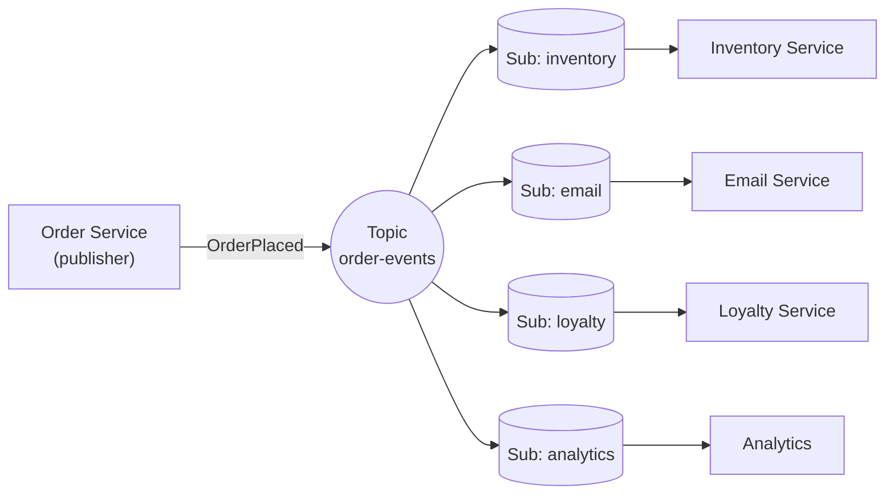
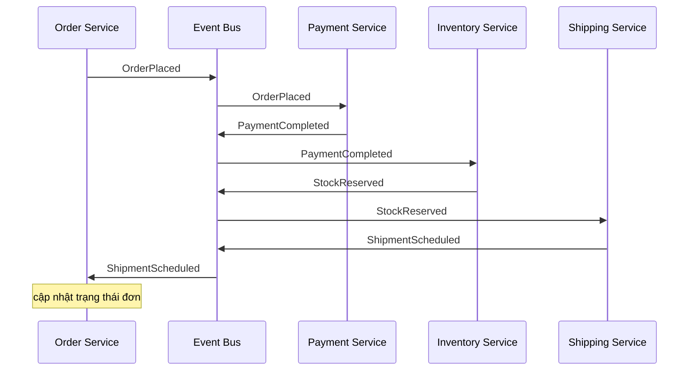
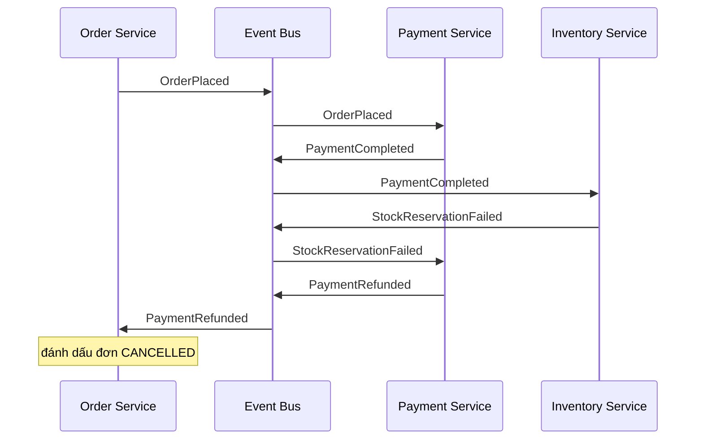
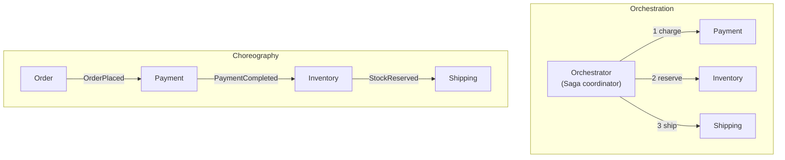
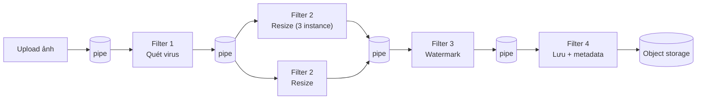
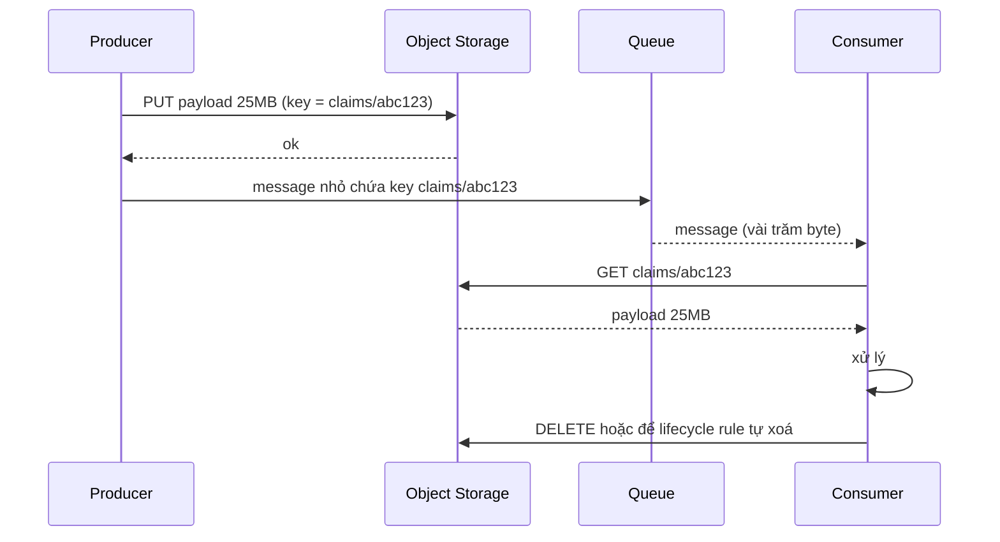

# Messaging Patterns: Pub/Sub, Choreography, Pipes & Filters, Claim Check

Bài trước tập trung vào **queue** -- mỗi message được một consumer xử lý. Bài này đi tiếp với bốn pattern messaging của Azure Cloud Design Patterns: **Publisher/Subscriber** (một sự kiện, nhiều bên nhận), **Choreography** (các service tự phối hợp qua sự kiện, không cần "nhạc trưởng"), **Pipes and Filters** (chia xử lý phức tạp thành chuỗi bước độc lập) và **Claim Check** (gửi "phiếu gửi đồ" thay cho payload lớn).

**Tương tự đơn giản:** **Pub/Sub** giống kênh YouTube -- tác giả đăng video một lần, mọi người đăng ký đều nhận thông báo, tác giả không cần biết ai đăng ký. **Choreography** giống nhóm nhảy đã thuộc bài: mỗi người nghe nhạc và tự biết lượt mình, không ai chỉ huy. **Pipes and Filters** giống dây chuyền rửa xe: xịt nước → xà phòng → chà → sấy, mỗi trạm làm một việc. **Claim Check** giống gửi vali ở sân bay: bạn mang theo tấm thẻ nhỏ, vali nặng đi đường riêng, đến nơi đưa thẻ để nhận lại.

---

:::note[Ghi nhớ nhanh]

- ⭐ **Pub/Sub: publisher không biết subscriber** — thêm subscriber mới không cần sửa publisher; mỗi subscriber có hàng đợi/subscription riêng.
- ⭐ **Choreography vs Orchestration** — choreography: service phản ứng với event, ghép lỏng nhưng khó theo dõi luồng tổng; orchestration: một orchestrator ra lệnh, dễ quan sát nhưng tập trung logic.
- **Pipes and Filters: mỗi filter làm một việc, giao tiếp qua pipe** — scale, thay thế, tái sử dụng từng bước độc lập.
- **Claim Check: lưu payload lớn ở blob storage, gửi tham chiếu qua broker** — broker có giới hạn kích thước (SQS 256 KB, Service Bus Standard 256 KB).
- **Mọi pattern ở đây đều bất đồng bộ** — cần idempotency, xử lý thứ tự, DLQ và distributed tracing.

:::

---

## Mục lục

- [Vì sao cần các pattern này?](#vì-sao-cần-các-pattern-này)
- [1. Publisher-Subscriber](#1-publisher-subscriber)
- [2. Choreography](#2-choreography)
- [3. Choreography vs Orchestration](#3-choreography-vs-orchestration)
- [4. Pipes and Filters](#4-pipes-and-filters)
- [5. Claim Check](#5-claim-check)
- [6. So sánh bốn pattern](#6-so-sánh-bốn-pattern)
- [Khi nào dùng?](#khi-nào-dùng)
- [Lỗi thường gặp](#lỗi-thường-gặp)
- [Câu hỏi phỏng vấn](#câu-hỏi-phỏng-vấn)

---

## Vì sao cần các pattern này?

**Vấn đề:** Khi một đơn hàng được đặt, cần: trừ kho, gửi email xác nhận, cộng điểm thưởng, cập nhật analytics, báo cho kho vận. Nếu order service gọi trực tiếp 5 service này, nó trở thành "service biết tất cả": mỗi khi thêm một bên quan tâm phải sửa và deploy lại order service; một service chậm làm chậm cả checkout. Ngoài ra, các luồng xử lý dữ liệu (ảnh, video, tài liệu) thường là một khối code nguyên khối khó scale từng bước, và payload lớn (ảnh 10 MB) không nhét được vào message broker.

**Giải pháp:** Pub/Sub để phát sự kiện cho nhiều bên mà không ghép chặt; Choreography để các service tự phối hợp qua sự kiện; Pipes and Filters để chia xử lý thành các bước độc lập; Claim Check để tách payload lớn khỏi message.

:::tip[Dùng thực tế]

- **Amazon SNS + SQS fan-out**: một topic SNS đẩy tới nhiều queue SQS -- mỗi service có queue riêng; **Google Cloud Pub/Sub**, **Azure Event Grid**, **Kafka consumer groups** đều là Pub/Sub.
- **Netflix** mô tả trong blog kỹ thuật việc chuyển từ choreography sang orchestration cho một số luồng phức tạp và xây dựng **Conductor** (orchestration engine mã nguồn mở).
- **Unix pipeline** (`cat log | grep ERROR | sort | uniq -c`) là ví dụ kinh điển của Pipes and Filters; **AWS Step Functions**, **Apache Beam** cũng đi theo tư tưởng này.
- **Claim Check**: Amazon SQS Extended Client Library (Java) tự lưu payload lớn hơn 256 KB vào S3 và gửi con trỏ qua SQS.

:::

---

## 1. Publisher-Subscriber

### Bối cảnh và vấn đề

Một ứng dụng cần thông báo sự kiện cho **nhiều** thành phần quan tâm. Gọi trực tiếp từng bên thì ghép chặt (publisher phải biết địa chỉ từng consumer), chậm (gọi tuần tự), và kém tin cậy (một bên chết thì sao?). Dùng một queue chung thì mỗi message chỉ tới **một** consumer.

### Giải pháp

**Publisher/Subscriber (Pub/Sub)** đưa vào một kênh trung gian:

- **Publisher** gửi message (event) vào một **topic** (input channel).
- **Message broker** sao chép message tới **mỗi subscription** (output channel riêng của từng subscriber).
- **Subscriber** đọc từ subscription của mình, theo nhịp riêng.

Publisher không biết có bao nhiêu subscriber, họ là ai. Thêm subscriber mới = tạo subscription mới, publisher không đổi một dòng code.



### Ví dụ: SNS fan-out sang SQS

```ts
import { SNSClient, PublishCommand } from '@aws-sdk/client-sns';

const sns = new SNSClient({});

interface OrderPlaced {
  eventId: string;          // dùng cho idempotency ở subscriber
  orderId: string;
  customerId: string;
  total: number;
  occurredAt: string;
}

export async function publishOrderPlaced(evt: OrderPlaced) {
  await sns.send(new PublishCommand({
    TopicArn: process.env.ORDER_EVENTS_TOPIC_ARN,
    Message: JSON.stringify(evt),
    // Message attributes cho phép subscriber lọc (filter policy) mà không cần parse body
    MessageAttributes: {
      eventType: { DataType: 'String', StringValue: 'OrderPlaced' },
      totalBucket: { DataType: 'String', StringValue: evt.total > 1000 ? 'high' : 'normal' },
    },
  }));
}
```

```json
// Filter policy trên subscription của Fraud Service: chỉ nhận đơn giá trị cao
{
  "eventType": ["OrderPlaced"],
  "totalBucket": ["high"]
}
```

### Các biến thể

| Kiểu                  | Đặc điểm                                                     | Ví dụ                                  |
| --------------------- | ------------------------------------------------------------ | -------------------------------------- |
| **Push**              | Broker đẩy tới endpoint của subscriber (HTTP, Lambda)        | SNS → HTTP/Lambda, Event Grid webhook  |
| **Pull**              | Subscriber chủ động kéo                                      | Google Pub/Sub pull, Kafka             |
| **Log-based**         | Message được lưu lâu dài, subscriber đọc theo offset, đọc lại được | Kafka, Kinesis, Azure Event Hubs  |
| **Ephemeral**         | Không lưu, subscriber offline là mất                         | Redis Pub/Sub, NATS core               |

### Khi nào dùng

- Một sự kiện cần tới nhiều consumer, số lượng consumer thay đổi theo thời gian.
- Các consumer có tốc độ, độ sẵn sàng khác nhau.
- Muốn tách rời team: team khác tự subscribe event mà không làm phiền team publisher.

### Khi nào không dùng

- Chỉ có một consumer -- queue đơn giản hơn.
- Cần phản hồi đồng bộ từ consumer (Pub/Sub là "bắn và quên").
- Cần giao dịch nguyên tử giữa publisher và tất cả consumer.

### Cân nhắc

- **Thứ tự**: nhiều broker không đảm bảo thứ tự; nếu cần, dùng partition key (Kafka) hoặc ordering key (Google Pub/Sub).
- **Trùng lặp**: at-least-once → subscriber phải idempotent (dùng `eventId`).
- **Schema và versioning**: event là **hợp đồng công khai** -- dùng schema registry (Avro/Protobuf/JSON Schema), chỉ thêm trường mới, không đổi nghĩa trường cũ.
- **Dual write**: ghi DB rồi publish event -- nếu crash ở giữa thì mất event. Dùng **Transactional Outbox** (ghi event vào bảng outbox trong cùng transaction, một tiến trình relay publish sau) hoặc CDC (Debezium).
- **Poison message và DLQ** cho từng subscription.
- **Message hết hạn**: subscriber offline quá retention sẽ mất message.

---

## 2. Choreography

### Bối cảnh và vấn đề

Một nghiệp vụ (ví dụ đặt hàng) trải qua nhiều service: Order → Payment → Inventory → Shipping. Cách truyền thống là một **orchestrator** (service điều phối trung tâm) gọi lần lượt từng service. Orchestrator trở thành điểm tập trung logic, điểm nghẽn tiềm năng, và mọi thay đổi luồng phải qua team sở hữu nó.

### Giải pháp

**Choreography** (biên đạo): không có điều phối viên trung tâm. Mỗi service **lắng nghe** event nó quan tâm, làm phần việc của mình, rồi **phát** event mới. Luồng nghiệp vụ "nổi lên" từ chuỗi phản ứng.



### Xử lý lỗi: compensating event (saga choreography)

Trong hệ phân tán không có transaction ACID xuyên service, nên dùng **Saga**: mỗi bước có hành động bù (compensation). Với choreography, khi một bước thất bại, service đó phát event lỗi và các service trước tự bù:



```ts
// Payment Service -- chỉ biết event, không biết ai phát hay ai nghe tiếp
bus.subscribe('OrderPlaced', async (evt: OrderPlaced) => {
  if (await alreadyProcessed(evt.eventId)) return;   // idempotent
  const result = await charge(evt.customerId, evt.total);
  await bus.publish(result.ok
    ? { type: 'PaymentCompleted', orderId: evt.orderId, paymentId: result.id }
    : { type: 'PaymentFailed', orderId: evt.orderId, reason: result.reason });
});

// Hành động bù khi bước sau thất bại
bus.subscribe('StockReservationFailed', async (evt) => {
  const payment = await findPaymentByOrder(evt.orderId);
  if (payment && payment.status === 'CAPTURED') {
    await refund(payment.id);
    await bus.publish({ type: 'PaymentRefunded', orderId: evt.orderId });
  }
});
```

### Khi nào dùng

- Luồng đơn giản, ít bước (2–4 service), ít nhánh rẽ.
- Các service do các team độc lập sở hữu, muốn tự chủ cao.
- Cần mở rộng dễ: thêm bước phụ (gửi email, analytics) chỉ bằng cách subscribe.

### Khi nào không dùng

- Luồng phức tạp nhiều nhánh, nhiều điều kiện, timeout, cần biết "đơn hàng đang ở bước nào" -- orchestration dễ hiểu hơn.
- Cần logic bù phức tạp phụ thuộc trạng thái toàn cục.

### Cân nhắc

- **Khó quan sát luồng tổng thể**: không có nơi nào mô tả toàn bộ quy trình; cần distributed tracing và event catalog (AsyncAPI) để hiểu.
- **Phụ thuộc vòng** (cyclic dependency): service A nghe event của B, B nghe event của A -- dễ tạo vòng lặp vô hạn.
- **Xử lý lỗi phân tán**: mỗi service phải tự biết khi nào bù, khi nào retry.
- **Test end-to-end khó hơn**: phải dựng cả chuỗi service hoặc contract test cho từng event.

---

## 3. Choreography vs Orchestration



| Tiêu chí                    | Choreography                                  | Orchestration                                    |
| --------------------------- | --------------------------------------------- | ------------------------------------------------ |
| **Điều phối**               | Phân tán, mỗi service tự phản ứng             | Tập trung ở orchestrator                         |
| **Ghép nối (coupling)**     | Lỏng -- chỉ phụ thuộc vào event               | Orchestrator biết mọi service                    |
| **Quan sát luồng**          | Khó -- phải ghép từ trace/log                 | Dễ -- trạng thái nằm ở orchestrator              |
| **Thêm bước mới**           | Chỉ cần subscribe                             | Sửa định nghĩa workflow                          |
| **Xử lý lỗi, bù**           | Rải rác trong từng service                    | Tập trung, rõ ràng                               |
| **Điểm hỏng đơn**           | Không (ngoài broker)                          | Orchestrator (cần HA)                            |
| **Công cụ**                 | Kafka, SNS/SQS, EventBridge                   | Temporal, AWS Step Functions, Netflix Conductor, Camunda |
| **Phù hợp**                 | Luồng ngắn, team độc lập                      | Luồng dài, nhiều nhánh, cần audit trạng thái     |

Thực tế thường **lai**: orchestration **trong** một bounded context (luồng thanh toán phức tạp), choreography **giữa** các bounded context (phát `OrderCompleted` cho các domain khác).

---

## 4. Pipes and Filters

### Bối cảnh và vấn đề

Một ứng dụng xử lý dữ liệu qua nhiều bước: nhận ảnh upload → kiểm tra virus → resize nhiều kích thước → gắn watermark → trích metadata → lưu. Viết thành **một khối code** thì: không scale riêng bước nặng (resize) được, không tái sử dụng bước (kiểm tra virus) cho luồng khác, sửa một bước phải deploy lại toàn bộ, một bước lỗi làm hỏng cả khối.

### Giải pháp

Chia xử lý thành chuỗi **filter** (bộ lọc) -- mỗi filter làm **đúng một việc**, nhận input, trả output. Các filter nối nhau bằng **pipe** (ống -- thường là queue). Mỗi filter độc lập: scale riêng, deploy riêng, thay thế riêng, tái sử dụng trong pipeline khác.



### Ví dụ code: filter là hàm thuần, pipe là queue

```ts
// Mỗi filter: input -> output, không biết filter trước/sau là ai
type Filter<I, O> = (input: I) => Promise<O>;

interface ImageJob { jobId: string; key: string; sizes?: string[]; }

const scanVirus: Filter<ImageJob, ImageJob> = async (job) => {
  const clean = await antivirus.scan(job.key);
  if (!clean) throw new RejectError(`infected: ${job.key}`); // không retry, vào DLQ
  return job;
};

const resize: Filter<ImageJob, ImageJob> = async (job) => {
  const sizes = await Promise.all(['320', '768', '1600'].map((w) => resizer.run(job.key, Number(w))));
  return { ...job, sizes };
};

// Worker chung: đọc từ pipe vào, chạy filter, ghi sang pipe ra
export function runFilter<I, O>(inQueue: string, outQueue: string | null, filter: Filter<I, O>) {
  return queue.consume<I>(inQueue, async (msg) => {
    const out = await filter(msg);
    if (outQueue) await queue.publish(outQueue, out);
  });
}

// Mỗi dòng có thể chạy ở deployment riêng, scale riêng
runFilter('images.uploaded', 'images.scanned', scanVirus);
runFilter('images.scanned', 'images.resized', resize);
```

### Khi nào dùng

- Xử lý chia được thành các bước rời rạc, mỗi bước có yêu cầu tài nguyên khác nhau (CPU, GPU, I/O).
- Cần linh hoạt sắp xếp lại, thêm bớt bước, tái sử dụng bước.
- ETL, xử lý media (ảnh, video transcode), xử lý tài liệu (OCR → phân loại → trích xuất), pipeline log.

### Khi nào không dùng

- Các bước phụ thuộc chặt, cần chung một transaction.
- Xử lý nhỏ, nhanh -- overhead của queue giữa các bước (serialize, network) lớn hơn chính công việc.
- Cần trao đổi nhiều trạng thái giữa các bước (filter phải độc lập, không chia sẻ trạng thái).

### Cân nhắc

- **Độ trễ cộng dồn**: mỗi pipe thêm vài ms đến vài trăm ms.
- **Filter chậm nhất quyết định throughput** -- scale riêng filter đó.
- **Idempotency và retry** từng filter; message lỗi vào DLQ của filter đó.
- **Truy vết**: gắn `jobId`/trace context xuyên suốt để biết job đang ở bước nào.
- **Message lớn giữa các filter** → kết hợp Claim Check (chỉ truyền key ảnh, không truyền byte ảnh).
- Không có transaction xuyên pipeline -- cần thiết kế để một job dở dang có thể chạy lại.

---

## 5. Claim Check

### Bối cảnh và vấn đề

Message broker được tối ưu cho message **nhỏ** và có giới hạn cứng: Amazon SQS và SNS tối đa 256 KB, Azure Service Bus Standard 256 KB (Premium lớn hơn), Kafka mặc định khoảng 1 MB (`message.max.bytes`). Gửi payload lớn (ảnh, PDF, file CSV vài chục MB) qua broker sẽ bị từ chối, hoặc làm broker chậm, tốn bộ nhớ, tốn chi phí (nhiều dịch vụ tính tiền theo dung lượng message).

### Giải pháp

**Claim Check** (phiếu gửi đồ): lưu payload vào **external storage** (S3, Azure Blob, GCS), chỉ gửi qua broker một message nhỏ chứa **tham chiếu** (claim check token -- key/URL). Consumer nhận message, dùng tham chiếu để tải payload.



```ts
import { S3Client, PutObjectCommand, GetObjectCommand } from '@aws-sdk/client-s3';
import { randomUUID } from 'node:crypto';

const s3 = new S3Client({});
const BUCKET = process.env.CLAIM_BUCKET as string;
const INLINE_LIMIT = 200 * 1024; // dưới ngưỡng này gửi thẳng, trên thì dùng claim check

type Envelope =
  | { kind: 'inline'; body: string }
  | { kind: 'claim'; bucket: string; key: string; size: number };

export async function wrap(payload: string): Promise<Envelope> {
  const size = Buffer.byteLength(payload);
  if (size <= INLINE_LIMIT) return { kind: 'inline', body: payload };
  const key = `claims/${randomUUID()}`;
  await s3.send(new PutObjectCommand({ Bucket: BUCKET, Key: key, Body: payload }));
  return { kind: 'claim', bucket: BUCKET, key, size };
}

export async function unwrap(env: Envelope): Promise<string> {
  if (env.kind === 'inline') return env.body;
  const obj = await s3.send(new GetObjectCommand({ Bucket: env.bucket, Key: env.key }));
  return obj.Body!.transformToString();
}
```

### Khi nào dùng

- Payload vượt giới hạn kích thước của broker.
- Payload lớn nhưng chỉ một số consumer cần đọc nội dung (các bước khác chỉ cần metadata) -- tiết kiệm băng thông.
- Dữ liệu nhạy cảm: giữ payload trong storage có kiểm soát truy cập chặt, broker chỉ thấy tham chiếu.

### Khi nào không dùng

- Payload nhỏ -- thêm một lần ghi/đọc storage chỉ tăng độ trễ và điểm lỗi.
- Yêu cầu độ trễ cực thấp (mỗi lần lấy payload thêm một round-trip tới storage).

### Cân nhắc

- **Vòng đời payload**: ai xoá payload, khi nào? Với Pub/Sub có nhiều subscriber, consumer không nên tự xoá -- dùng **lifecycle rule** (ví dụ xoá sau 7 ngày, lớn hơn retention của queue).
- **Tính nhất quán**: ghi payload phải xong **trước** khi gửi message; nếu gửi message thất bại thì payload thành rác -- lifecycle rule dọn dẹp.
- **Bảo mật**: dùng IAM role cho consumer hoặc presigned URL có hạn; mã hoá at-rest.
- **Tự động hoá**: nhiều SDK làm sẵn (SQS Extended Client Library cho Java, Azure Service Bus có mẫu claim check với Event Grid).
- Message gốc có thể bị ghi lại ở broker lâu hơn payload → consumer phải xử lý trường hợp "không tìm thấy payload".

---

## 6. So sánh bốn pattern

| Pattern                  | Vấn đề                                          | Giải pháp cốt lõi                       | Đánh đổi chính                                |
| ------------------------ | ----------------------------------------------- | --------------------------------------- | --------------------------------------------- |
| **Publisher/Subscriber** | Một sự kiện cần tới nhiều bên, tránh ghép chặt  | Topic + subscription riêng mỗi bên      | Khó đảm bảo thứ tự, cần quản lý schema event   |
| **Choreography**         | Orchestrator tập trung, ghép chặt               | Service tự phản ứng với event           | Khó quan sát luồng, xử lý lỗi rải rác          |
| **Pipes and Filters**    | Xử lý nguyên khối khó scale và tái sử dụng      | Chuỗi filter độc lập nối bằng pipe      | Độ trễ cộng dồn, nhiều thành phần vận hành     |
| **Claim Check**          | Payload quá lớn cho broker                      | Lưu payload ngoài, gửi tham chiếu       | Thêm round-trip, quản lý vòng đời payload     |

Các pattern này thường dùng **cùng nhau**: một pipeline xử lý video (Pipes and Filters) truyền tham chiếu file thay vì bytes (Claim Check), khi xong phát event `VideoReady` (Pub/Sub) để các service khác tự phản ứng (Choreography).

---

## Khi nào dùng?

| Tình huống                                                         | Pattern gợi ý                    |
| ------------------------------------------------------------------ | -------------------------------- |
| Sự kiện "đơn hàng đã đặt" cần tới kho, email, điểm thưởng, analytics | Publisher/Subscriber             |
| Quy trình 3 bước giữa các team độc lập, ít nhánh                   | Choreography                     |
| Quy trình 10 bước, nhiều nhánh, cần biết trạng thái từng đơn       | Orchestration (không phải choreography) |
| Xử lý ảnh/video/tài liệu nhiều bước, mỗi bước tốn tài nguyên khác nhau | Pipes and Filters             |
| Gửi file 20 MB giữa các service qua queue                          | Claim Check                      |

---

## Lỗi thường gặp

### Lỗi 1: Ghi DB rồi publish event không nguyên tử

Đơn hàng đã lưu nhưng service crash trước khi publish `OrderPlaced` → kho không bao giờ biết. Dùng Transactional Outbox hoặc CDC.

### Lỗi 2: Event chứa quá ít hoặc quá nhiều

Event chỉ có `orderId` → mọi subscriber phải gọi ngược lại order service để lấy chi tiết (ghép chặt trở lại, dội tải). Event chứa toàn bộ dữ liệu nội bộ → lộ chi tiết triển khai, khó thay đổi schema. Cân bằng: đủ dữ liệu cho đa số subscriber, theo hợp đồng có version.

### Lỗi 3: Choreography cho luồng quá phức tạp

Mười service bắn event qua lại, không ai vẽ được luồng đầy đủ, debug một đơn hàng kẹt mất cả ngày. Khi luồng có nhiều nhánh và cần trạng thái tổng, chuyển sang orchestration.

### Lỗi 4: Filter chia sẻ trạng thái

Hai filter cùng đọc/ghi một bảng tạm → không còn độc lập, không scale riêng được, dễ race condition. Mọi thứ filter cần phải nằm trong message (hoặc tham chiếu qua Claim Check).

### Lỗi 5: Consumer xoá payload Claim Check khi còn subscriber khác

Subscriber đầu tiên xử lý xong xoá file S3, subscriber thứ hai nhận "NoSuchKey". Dùng lifecycle rule thay vì xoá thủ công khi có nhiều consumer.

---

## Câu hỏi phỏng vấn

**1. Queue và Pub/Sub khác nhau thế nào? Làm sao kết hợp cả hai?**

<details className="qa">
<summary>Xem đáp án</summary>

Queue (point-to-point): mỗi message được một consumer xử lý -- phân chia công việc. Pub/Sub: mỗi message tới mọi subscriber -- phát tán sự kiện. Kết hợp: fan-out SNS → nhiều SQS (mỗi service một queue, trong mỗi queue nhiều instance cạnh tranh); trong Kafka, mỗi consumer group nhận toàn bộ message (pub/sub), các consumer trong group chia partition (queue).

</details>

**2. Choreography và orchestration -- khi nào chọn cái nào?**

<details className="qa">
<summary>Xem đáp án</summary>

Choreography khi luồng ngắn, ít nhánh, các service do team độc lập sở hữu, muốn ghép lỏng và dễ thêm bên quan tâm. Orchestration khi luồng dài, nhiều điều kiện/timeout/bù phức tạp, cần nhìn thấy trạng thái từng instance quy trình (Temporal, Step Functions). Thường lai: orchestration trong một domain, choreography giữa các domain.

</details>

**3. Làm sao đảm bảo event được publish khi đã ghi DB thành công?**

<details className="qa">
<summary>Xem đáp án</summary>

Transactional Outbox: trong cùng transaction ghi dữ liệu nghiệp vụ và ghi event vào bảng `outbox`; một relay (polling hoặc CDC như Debezium đọc WAL/binlog) đọc outbox và publish lên broker, đánh dấu đã gửi. Relay có thể gửi trùng → subscriber idempotent theo `eventId`.

</details>

**4. Pipes and Filters có ưu điểm gì so với một service xử lý nguyên khối?**

<details className="qa">
<summary>Xem đáp án</summary>

Mỗi filter scale độc lập theo tài nguyên nó cần (bước resize cần nhiều CPU chạy 10 instance, bước lưu chạy 1); deploy, thay thế, tái sử dụng riêng; lỗi được cô lập ở từng bước với DLQ riêng; dễ thêm bước mới. Đổi lại: độ trễ cộng dồn, nhiều thành phần cần vận hành và giám sát, không có transaction xuyên pipeline.

</details>

**5. Claim Check là gì? Cần chú ý gì về vòng đời dữ liệu?**

<details className="qa">
<summary>Xem đáp án</summary>

Lưu payload lớn vào object storage, gửi qua broker chỉ tham chiếu (key). Chú ý: ghi payload xong mới gửi message; dọn payload bằng lifecycle rule với thời hạn dài hơn retention của message (tránh xoá khi consumer chưa đọc, đặc biệt khi có nhiều subscriber); kiểm soát quyền truy cập storage; xử lý trường hợp payload không còn.

</details>

**6. Subscriber mới cần đọc lại toàn bộ sự kiện cũ. Chọn broker nào?**

<details className="qa">
<summary>Xem đáp án</summary>

Broker dạng log lưu lâu dài như Kafka, Kinesis, Event Hubs -- subscriber mới tạo consumer group và đọc từ offset đầu (trong giới hạn retention, hoặc dùng compacted topic để giữ bản mới nhất theo key). SNS/SQS hay RabbitMQ xoá message sau khi giao, không đọc lại được; khi đó cần event store riêng hoặc snapshot từ DB.

</details>
