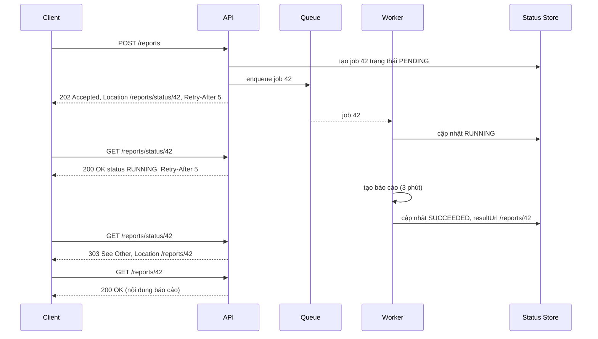
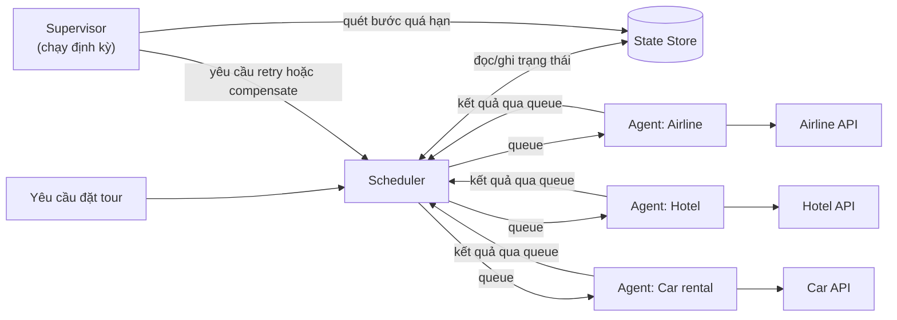
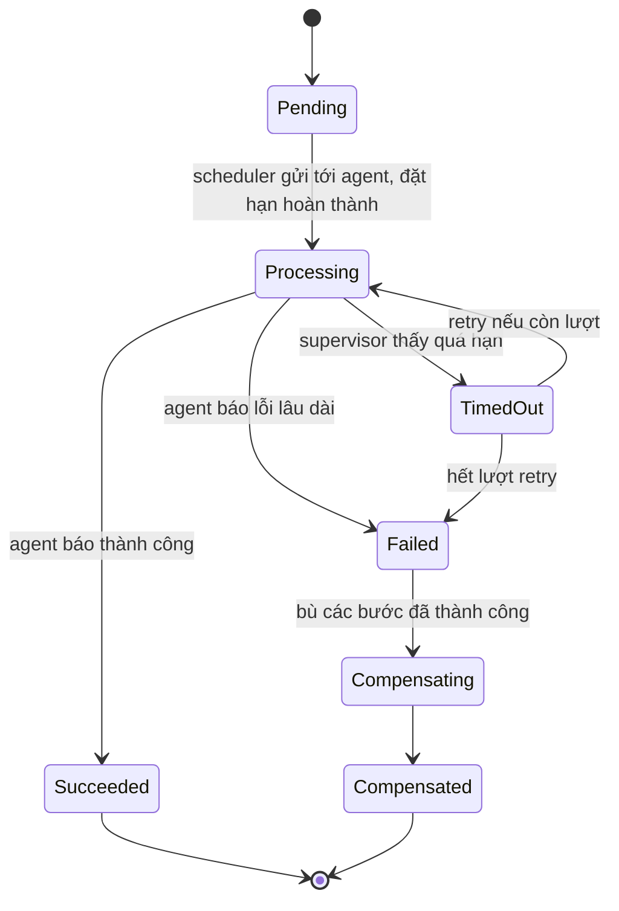

# Async Request-Reply & Scheduler Agent Supervisor

Hai pattern cuối của nhóm Messaging giải quyết bài toán **công việc chạy lâu**. **Asynchronous Request-Reply** cho phép client gửi yêu cầu, nhận ngay phản hồi "đã nhận" (HTTP 202), rồi hỏi lại kết quả sau -- thay vì giữ kết nối HTTP chờ hàng phút. **Scheduler Agent Supervisor** điều phối một quy trình nhiều bước trên các dịch vụ từ xa, và **tự phát hiện, khôi phục** khi một bước bị treo hoặc thất bại.

**Tương tự đơn giản:** **Async Request-Reply** giống gửi đồ ở tiệm giặt ủi: bạn đưa đồ, nhận phiếu hẹn (202 + mã phiếu), về nhà, lâu lâu gọi điện hỏi "xong chưa?" (polling), đến khi tiệm báo xong thì tới lấy (kết quả). **Scheduler Agent Supervisor** giống tổ chức một tour du lịch: **Scheduler** là người lên lịch trình và giao việc từng chặng; **Agent** là các hướng dẫn viên địa phương, mỗi người lo một chặng (khách sạn, xe, vé tham quan); **Supervisor** là người trực văn phòng định kỳ gọi kiểm tra -- chặng nào quá giờ không báo cáo thì xử lý (gọi lại, đổi nhà cung cấp, hoặc huỷ và hoàn tiền các chặng trước).

---

:::note[Ghi nhớ nhanh]

- ⭐ **Async Request-Reply = 202 Accepted + Location header + status endpoint** — client poll status; khi xong, status trả 303/200 trỏ tới resource kết quả.
- ⭐ **Scheduler Agent Supervisor = điều phối + thực thi + giám sát khôi phục** — trạng thái quy trình lưu bền vững (state store); supervisor quét bước quá hạn để retry hoặc bù.
- **Dùng `Retry-After` để điều khiển tần suất polling** — tránh client poll dồn dập.
- **Polling không phải lựa chọn duy nhất** — webhook/callback, WebSocket, SSE tốt hơn khi client là server hoặc cần realtime.
- **Mọi bước phải idempotent** — supervisor có thể gửi lại một bước đã thực hiện nhưng chưa kịp ghi nhận.
- **Ngày nay thường dùng workflow engine** — Temporal, AWS Step Functions, Azure Durable Functions hiện thực sẵn ý tưởng Scheduler Agent Supervisor.

:::

---

## Mục lục

- [Vì sao cần hai pattern này?](#vì-sao-cần-hai-pattern-này)
- [1. Async Request-Reply](#1-async-request-reply)
- [2. Triển khai Async Request-Reply](#2-triển-khai-async-request-reply)
- [3. Các lựa chọn thay thế polling](#3-các-lựa-chọn-thay-thế-polling)
- [4. Scheduler Agent Supervisor](#4-scheduler-agent-supervisor)
- [5. Luồng hoạt động và khôi phục lỗi](#5-luồng-hoạt-động-và-khôi-phục-lỗi)
- [6. Workflow engine hiện đại](#6-workflow-engine-hiện-đại)
- [Khi nào dùng?](#khi-nào-dùng)
- [Lỗi thường gặp](#lỗi-thường-gặp)
- [Câu hỏi phỏng vấn](#câu-hỏi-phỏng-vấn)

---

## Vì sao cần hai pattern này?

**Vấn đề:** Nhiều tác vụ mất từ vài giây tới vài giờ: xuất báo cáo Excel 1 triệu dòng, transcode video, chạy model AI, đặt một tour gồm vé máy bay + khách sạn + xe. Giữ một HTTP request mở suốt thời gian đó là không khả thi: load balancer và API gateway có timeout (AWS API Gateway REST giới hạn tích hợp mặc định 29 giây; ALB idle timeout mặc định 60 giây), client mobile mất mạng giữa chừng, và server phải giữ tài nguyên cho từng kết nối. Ngoài ra, quy trình nhiều bước trên các dịch vụ từ xa có thể **thất bại một phần**: đặt được vé máy bay nhưng khách sạn không phản hồi -- ai phát hiện và xử lý?

**Giải pháp:** **Async Request-Reply** tách "nhận yêu cầu" khỏi "trả kết quả" bằng 202 + endpoint trạng thái. **Scheduler Agent Supervisor** lưu trạng thái từng bước bền vững, giao việc cho agent, và có supervisor định kỳ phát hiện bước treo/lỗi để thử lại hoặc bù trừ.

:::tip[Dùng thực tế]

- **Azure Resource Manager, Azure Durable Functions** trả 202 + header `Location` / `Azure-AsyncOperation` cho thao tác lâu (tạo VM, deploy) -- client poll tới khi xong.
- **Batch API của các nhà cung cấp LLM** (OpenAI Batch, Anthropic Message Batches) nhận job, trả ID, client kiểm tra trạng thái và tải kết quả khi hoàn tất.
- **GitHub** trả 202 cho một số endpoint thống kê (ví dụ `/stats/contributors`) khi dữ liệu đang được tính -- client gọi lại sau.
- **Temporal** (fork từ Cadence của Uber), **AWS Step Functions**, **Netflix Conductor** -- workflow engine hiện thực tư tưởng Scheduler Agent Supervisor với state bền vững, retry, timeout, compensation.

:::

---

## 1. Async Request-Reply

### Bối cảnh và vấn đề

Client (thường là frontend hoặc một service khác) gọi API để thực hiện việc tốn thời gian. Backend xử lý bất đồng bộ phía sau (qua queue, background worker), nhưng client vẫn cần **biết khi nào xong** và **lấy kết quả**. HTTP thuần là request-response đồng bộ, và nhiều client (trình duyệt, ứng dụng bên ngoài) **không nhận được callback** vì không có endpoint công khai hoặc bị firewall chặn.

### Giải pháp

1. Client gửi request. API **xác thực nhanh** (validate input, auth), đưa việc vào queue, trả về ngay **HTTP 202 Accepted** kèm header **`Location`** trỏ tới **status endpoint** (và tuỳ chọn `Retry-After`).
2. Client **poll** status endpoint. Khi việc chưa xong: trả **200 OK** với trạng thái `pending/running` (+ `Retry-After`).
3. Khi xong: status endpoint trả **303 See Other** (hoặc 302) với `Location` trỏ tới **resource kết quả**, hoặc trả 200 kèm link kết quả. Nếu lỗi: trả trạng thái `failed` kèm lý do.



### Các mã trạng thái HTTP liên quan

| Mã                  | Dùng khi                                                         |
| ------------------- | ---------------------------------------------------------------- |
| **202 Accepted**    | Yêu cầu hợp lệ, đã nhận, sẽ xử lý sau (chưa có kết quả)           |
| **200 OK**          | Status endpoint: trả trạng thái hiện tại (đang chạy / thất bại)  |
| **303 See Other**   | Status endpoint: việc đã xong, chuyển hướng tới resource kết quả |
| **404 Not Found**   | Job ID không tồn tại hoặc đã hết hạn lưu                         |
| **400 / 422**       | Input không hợp lệ -- **phải trả ngay**, không đưa vào queue      |

Lưu ý: một số HTTP client (trình duyệt `fetch`, axios mặc định) **tự động follow redirect** 303. Với client cần đọc trạng thái trước, có thể trả 200 kèm `resultUrl` trong body thay vì 303.

---

## 2. Triển khai Async Request-Reply

### Server (Express + queue)

```ts
import express from 'express';
import { randomUUID } from 'node:crypto';
import { z } from 'zod';

const app = express();
app.use(express.json());

const CreateReportSchema = z.object({
  from: z.string().date(),
  to: z.string().date(),
  format: z.enum(['csv', 'xlsx']),
});

type JobStatus = 'PENDING' | 'RUNNING' | 'SUCCEEDED' | 'FAILED';

// 1. Nhận yêu cầu: validate đồng bộ, xử lý bất đồng bộ
app.post('/reports', async (req, res) => {
  const parsed = CreateReportSchema.safeParse(req.body);
  if (!parsed.success) {
    return res.status(422).json({ error: parsed.error.flatten() }); // lỗi input trả ngay
  }
  // Idempotency-Key: client gửi lại do mất mạng thì không tạo job trùng
  const idemKey = req.get('Idempotency-Key');
  const existing = idemKey ? await jobs.findByIdempotencyKey(idemKey) : null;
  const jobId = existing?.id ?? randomUUID();

  if (!existing) {
    await jobs.create({ id: jobId, status: 'PENDING', idemKey, input: parsed.data });
    await queue.publish('report-jobs', { jobId });
  }
  res
    .status(202)
    .location(`/reports/status/${jobId}`)
    .set('Retry-After', '5')
    .json({ jobId, status: 'PENDING' });
});

// 2. Status endpoint
app.get('/reports/status/:id', async (req, res) => {
  const job = await jobs.findById(req.params.id);
  if (!job || job.ownerId !== req.user.id) return res.status(404).end(); // không lộ job người khác

  if (job.status === 'SUCCEEDED') {
    return res.status(303).location(`/reports/${job.id}`).end();
  }
  if (job.status === 'FAILED') {
    return res.status(200).json({ status: 'FAILED', error: job.errorMessage });
  }
  res.set('Retry-After', '5').status(200).json({ status: job.status, progress: job.progress });
});

// 3. Resource kết quả
app.get('/reports/:id', async (req, res) => {
  const job = await jobs.findById(req.params.id);
  if (!job || job.status !== 'SUCCEEDED') return res.status(404).end();
  res.redirect(await storage.presignedUrl(job.resultKey, { expiresInSeconds: 300 }));
});
```

### Client polling với backoff

```ts
// Poll tôn trọng Retry-After, có giới hạn thời gian tổng
export async function waitForResult(statusUrl: string, timeoutMs = 10 * 60_000): Promise<string> {
  const deadline = Date.now() + timeoutMs;
  let delayMs = 2_000;

  while (Date.now() < deadline) {
    const res = await fetch(statusUrl, { redirect: 'manual' });
    if (res.status === 303) return res.headers.get('Location')!;
    if (res.status === 404) throw new Error('Job không tồn tại hoặc đã hết hạn');

    const body = await res.json();
    if (body.status === 'FAILED') throw new Error(`Job thất bại: ${body.error}`);

    const retryAfter = Number(res.headers.get('Retry-After'));
    delayMs = Number.isFinite(retryAfter) && retryAfter > 0
      ? retryAfter * 1000
      : Math.min(delayMs * 2, 30_000); // exponential backoff, trần 30 giây
    await new Promise((r) => setTimeout(r, delayMs));
  }
  throw new Error('Hết thời gian chờ kết quả');
}
```

### Cân nhắc khi triển khai

- **Validate trước khi trả 202**: lỗi input phải trả 4xx ngay; đừng để client poll 5 phút rồi mới biết sai định dạng ngày.
- **Idempotency key**: client retry POST do mạng chập chờn không được tạo hai job.
- **Bảo mật status endpoint**: kiểm tra quyền sở hữu; job ID nên khó đoán (UUID), không dùng số tăng dần.
- **Hết hạn**: xoá trạng thái/kết quả sau N giờ/ngày; trả 404 hoặc 410 Gone.
- **Hủy job**: cân nhắc `DELETE /reports/status/42` để client huỷ việc không còn cần.
- **Status store phải nhanh và chịu tải poll**: dùng Redis hoặc bảng có index; cache ngắn hạn nếu nhiều client poll.
- **Tiến độ**: trả `progress` (phần trăm, bước hiện tại) cải thiện trải nghiệm user đáng kể.

---

## 3. Các lựa chọn thay thế polling

| Cách                    | Cơ chế                                                         | Ưu điểm                          | Nhược điểm                                     |
| ----------------------- | -------------------------------------------------------------- | -------------------------------- | ---------------------------------------------- |
| **HTTP polling**        | Client gọi status endpoint định kỳ                             | Đơn giản, qua mọi firewall, client không cần endpoint | Tốn request, độ trễ phát hiện = khoảng poll  |
| **Long polling**        | Server giữ request status tới khi có thay đổi hoặc hết thời gian | Ít request rỗng hơn             | Giữ kết nối, vẫn vướng timeout gateway          |
| **Webhook / callback**  | Client cung cấp URL, server gọi khi xong                       | Tức thì, không tốn poll          | Client phải có endpoint công khai; cần ký (HMAC), retry |
| **WebSocket / SSE**     | Kênh đẩy realtime từ server                                    | Tức thì, hợp với UI             | Kết nối lâu dài, khó scale, cần sticky/pubsub   |
| **Thông báo ngoài**     | Email/push notification kèm link tải                           | Hợp việc rất lâu (giờ)          | Không dùng được cho máy-với-máy                 |

Thực tế thường **kết hợp**: trả 202 + status endpoint (luôn có, làm phương án dự phòng) và thêm webhook (cho client là server) hoặc SSE (cho UI).

---

## 4. Scheduler Agent Supervisor

### Bối cảnh và vấn đề

Một **quy trình nghiệp vụ** gồm nhiều bước, mỗi bước gọi một dịch vụ từ xa (có thể của bên thứ ba): đặt tour = giữ vé máy bay → đặt khách sạn → thuê xe → thanh toán. Dịch vụ từ xa có thể:

- **Lỗi tạm thời** (timeout, 503) -- thử lại là được.
- **Lỗi lâu dài** (hết phòng, sai thông tin) -- phải dừng và **bù trừ** các bước đã làm (huỷ vé đã giữ).
- **Treo im lặng** -- không trả lời, không báo lỗi. Ai phát hiện?

Ngoài ra, chính tiến trình điều phối cũng có thể **crash giữa chừng** -- khi khởi động lại phải biết quy trình đang dừng ở đâu.

### Giải pháp

Azure mô tả pattern với ba **actor** và một **state store**:

| Thành phần       | Vai trò                                                                                                        |
| ---------------- | -------------------------------------------------------------------------------------------------------------- |
| **Scheduler**    | Điều phối các bước của quy trình: đọc trạng thái, gửi yêu cầu tới agent, ghi trạng thái mỗi bước kèm **hạn hoàn thành** (complete-by time) |
| **Agent**        | Đóng gói lời gọi tới **một** dịch vụ từ xa (có thể có retry ngắn hạn bên trong); báo kết quả về scheduler      |
| **Supervisor**   | Chạy định kỳ, quét state store tìm bước **quá hạn** hoặc **thất bại**; quyết định retry, chuyển sang bù trừ, hoặc báo cho con người |
| **State Store**  | Lưu bền vững trạng thái từng bước (pending, processing, succeeded, failed, compensated), số lần thử, hạn hoàn thành |

Scheduler và agent giao tiếp **bất đồng bộ qua queue**; supervisor **không** tự gọi dịch vụ từ xa mà yêu cầu scheduler thực hiện lại hoặc bù trừ.



---

## 5. Luồng hoạt động và khôi phục lỗi

### Vòng đời một bước



### Bảng trạng thái mẫu

```sql
CREATE TABLE workflow_steps (
  workflow_id   UUID        NOT NULL,
  step_name     TEXT        NOT NULL,          -- 'airline', 'hotel', 'car'
  status        TEXT        NOT NULL,          -- PENDING, PROCESSING, SUCCEEDED, FAILED, COMPENSATED
  attempts      INT         NOT NULL DEFAULT 0,
  complete_by   TIMESTAMPTZ,                   -- hạn hoàn thành của lần thử hiện tại
  lock_owner    TEXT,                          -- supervisor instance đang xử lý (tránh 2 supervisor cùng sửa)
  lock_until    TIMESTAMPTZ,
  result        JSONB,
  updated_at    TIMESTAMPTZ NOT NULL DEFAULT now(),
  PRIMARY KEY (workflow_id, step_name)
);

CREATE INDEX idx_steps_overdue ON workflow_steps (complete_by) WHERE status = 'PROCESSING';
```

### Supervisor

```ts
const MAX_ATTEMPTS = 3;
const STEP_TIMEOUT_MS = 2 * 60_000;

// Chạy định kỳ (cron mỗi 30 giây); có thể chạy nhiều instance nhờ khoá theo dòng
export async function superviseOnce(supervisorId: string) {
  // Lấy và khoá các bước quá hạn -- SKIP LOCKED để nhiều supervisor không giẫm chân nhau
  const { rows: overdue } = await db.query(
    `UPDATE workflow_steps s
        SET lock_owner = $1, lock_until = now() + interval '1 minute'
      WHERE (s.workflow_id, s.step_name) IN (
        SELECT workflow_id, step_name FROM workflow_steps
         WHERE status = 'PROCESSING' AND complete_by < now()
           AND (lock_until IS NULL OR lock_until < now())
         LIMIT 100
         FOR UPDATE SKIP LOCKED)
      RETURNING *`,
    [supervisorId],
  );

  for (const step of overdue) {
    if (step.attempts < MAX_ATTEMPTS) {
      // Yêu cầu scheduler thử lại -- agent phải idempotent vì lần trước có thể đã chạy xong
      await scheduler.retryStep(step.workflow_id, step.step_name, {
        completeBy: new Date(Date.now() + STEP_TIMEOUT_MS),
      });
    } else {
      await scheduler.failAndCompensate(step.workflow_id, step.step_name);
    }
  }
}
```

### Agent idempotent

Một tình huống kinh điển: agent đã đặt phòng thành công nhưng message báo kết quả bị mất → supervisor thấy quá hạn → yêu cầu đặt lại → **đặt hai phòng**. Cách tránh:

- Gửi kèm **idempotency key** (`workflowId + stepName`) khi gọi dịch vụ từ xa (nếu dịch vụ hỗ trợ, như Stripe `Idempotency-Key`).
- Trước khi gọi lại, **truy vấn** dịch vụ từ xa xem đã có booking với mã tham chiếu này chưa.

### Cân nhắc

- **Supervisor không được là điểm hỏng đơn**: chạy nhiều instance, phối hợp bằng khoá (row lock, lease) để không xử lý trùng.
- **Chọn hạn hoàn thành hợp lý**: quá ngắn → retry thừa (và trùng lặp); quá dài → phát hiện lỗi chậm.
- **Bù trừ (compensation) cũng có thể thất bại** -- cũng phải retry, và cuối cùng có thể cần con người can thiệp (đưa vào hàng chờ xử lý thủ công).
- **Pattern này phức tạp** -- chỉ đáng khi quy trình thật sự nhiều bước, chạy lâu, gọi hệ thống ngoài không tin cậy.
- **Kết hợp với Saga**: Scheduler Agent Supervisor là một cách hiện thực **orchestration-based saga** với lớp giám sát khôi phục.

---

## 6. Workflow engine hiện đại

Tự viết scheduler + supervisor + state store là nhiều việc và dễ sai. Các workflow engine hiện đại làm sẵn: lưu trạng thái bền vững (durable execution), timeout, retry có backoff, chờ sự kiện, khôi phục sau crash.

| Công cụ                       | Đặc điểm                                                                 |
| ----------------------------- | ------------------------------------------------------------------------ |
| **Temporal**                  | Viết workflow bằng code (Go, Java, TS, Python...); trạng thái được tái dựng bằng event history; activity có retry/timeout |
| **AWS Step Functions**        | Định nghĩa state machine bằng JSON (Amazon States Language); tích hợp sâu với dịch vụ AWS |
| **Azure Durable Functions**   | Orchestrator function trong Azure Functions; có sẵn HTTP API async request-reply (202 + status URL) |
| **Netflix Conductor / Orkes** | Workflow định nghĩa bằng JSON, worker ở bất kỳ ngôn ngữ nào               |
| **Camunda**                   | BPMN, mạnh cho quy trình nghiệp vụ có con người tham gia                  |

```ts
// Temporal (TypeScript): cùng quy trình đặt tour, retry/timeout/compensation khai báo gọn
import { proxyActivities } from '@temporalio/workflow';
import type * as acts from './activities';

const { bookFlight, bookHotel, bookCar, cancelFlight, cancelHotel } =
  proxyActivities<typeof acts>({
    startToCloseTimeout: '2 minutes',            // vai trò "complete-by"
    retry: { maximumAttempts: 3, backoffCoefficient: 2 },
  });

export async function bookTrip(tripId: string): Promise<string> {
  const compensations: Array<() => Promise<void>> = [];
  try {
    const flight = await bookFlight(tripId);
    compensations.unshift(() => cancelFlight(flight.ref));
    const hotel = await bookHotel(tripId);
    compensations.unshift(() => cancelHotel(hotel.ref));
    await bookCar(tripId);
    return 'CONFIRMED';
  } catch (err) {
    for (const undo of compensations) await undo(); // bù theo thứ tự ngược
    throw err;
  }
}
```

Ở đây Temporal server đóng vai **state store + supervisor** (theo dõi timeout, lên lịch retry, khôi phục workflow khi worker crash), workflow code là **scheduler**, còn activity là **agent**.

---

## Khi nào dùng?

| Tình huống                                                                       | Pattern                              |
| -------------------------------------------------------------------------------- | ------------------------------------ |
| API xử lý mất hơn vài giây (báo cáo, export, AI inference, transcode)            | Async Request-Reply                  |
| Client là trình duyệt/mobile, không nhận được callback                            | Async Request-Reply (polling)        |
| Client là server đối tác, cần biết ngay khi xong                                  | Async Request-Reply + webhook        |
| Quy trình nhiều bước gọi hệ thống ngoài, cần retry, timeout, bù trừ              | Scheduler Agent Supervisor / workflow engine |
| Việc chạy dưới 1–2 giây                                                          | Không cần -- dùng request đồng bộ    |
| Một bước đơn lẻ, retry đơn giản là đủ                                            | Không cần supervisor -- queue + retry + DLQ |

---

## Lỗi thường gặp

### Lỗi 1: Trả 202 rồi mới validate

Client poll vài phút rồi nhận "FAILED: định dạng ngày sai". Validate mọi thứ có thể validate đồng bộ và trả 4xx ngay.

### Lỗi 2: Client poll không giới hạn, không backoff

Hàng nghìn client poll mỗi 100ms làm status endpoint thành nút thắt. Trả `Retry-After`, client dùng backoff và có tổng thời gian chờ tối đa.

### Lỗi 3: Status endpoint không kiểm tra quyền

Job ID tăng dần (`/status/1001`, `/status/1002`) → ai cũng xem được báo cáo của người khác (lỗi IDOR -- Insecure Direct Object Reference). Dùng UUID và kiểm tra quyền sở hữu.

### Lỗi 4: Supervisor retry nhưng agent không idempotent

Retry sau timeout tạo booking trùng, trừ tiền hai lần. Mọi lời gọi dịch vụ ngoài phải có idempotency key hoặc kiểm tra trước khi tạo.

### Lỗi 5: Trạng thái quy trình chỉ nằm trong bộ nhớ

Scheduler crash → mất toàn bộ quy trình đang chạy dở, vé đã giữ không ai huỷ. Trạng thái phải được ghi bền vững sau mỗi bước.

---

## Câu hỏi phỏng vấn

**1. Thiết kế API xuất báo cáo mất 5 phút. Client gọi thế nào và nhận kết quả ra sao?**

<details className="qa">
<summary>Xem đáp án</summary>

`POST /reports` → validate đồng bộ, tạo job, đẩy vào queue, trả **202 Accepted** + `Location: /reports/status/{id}` + `Retry-After`. Client poll status: đang chạy trả 200 + tiến độ; xong trả 303 tới `/reports/{id}` (hoặc presigned URL tới file trên S3); lỗi trả trạng thái FAILED. Thêm Idempotency-Key cho POST, UUID + kiểm tra quyền cho status, hết hạn kết quả, và tuỳ chọn webhook/SSE để thông báo tức thì.

</details>

**2. Vì sao không giữ HTTP request mở cho tới khi xử lý xong?**

<details className="qa">
<summary>Xem đáp án</summary>

Load balancer/API gateway có timeout (ví dụ AWS API Gateway REST mặc định 29 giây, ALB idle 60 giây); client mobile mất mạng giữa chừng là mất kết quả; mỗi kết nối chiếm tài nguyên server; không retry được an toàn. Tách nhận yêu cầu và trả kết quả giúp xử lý bền vững qua queue và client có thể quay lại bất cứ lúc nào.

</details>

**3. Polling, webhook và WebSocket/SSE -- chọn thế nào?**

<details className="qa">
<summary>Xem đáp án</summary>

Polling: đơn giản nhất, client không cần endpoint, hợp trình duyệt/mobile, đánh đổi bằng request thừa và độ trễ phát hiện. Webhook: tức thì, hợp tích hợp server-với-server, cần client có endpoint công khai, ký HMAC và retry. WebSocket/SSE: realtime cho UI, nhưng duy trì kết nối lâu dài khó scale. Thường giữ status endpoint làm nền tảng và thêm webhook hoặc SSE.

</details>

**4. Scheduler Agent Supervisor gồm những thành phần nào? Supervisor làm gì?**

<details className="qa">
<summary>Xem đáp án</summary>

Scheduler điều phối các bước và ghi trạng thái kèm hạn hoàn thành vào State Store; Agent đóng gói lời gọi tới từng dịch vụ từ xa; Supervisor chạy định kỳ, tìm bước quá hạn/thất bại, quyết định retry (qua scheduler) hoặc kích hoạt bù trừ, hoặc chuyển cho con người. State Store bền vững giúp khôi phục khi scheduler crash.

</details>

**5. Supervisor retry một bước đặt phòng đã thành công nhưng message kết quả bị mất. Làm sao tránh đặt trùng?**

<details className="qa">
<summary>Xem đáp án</summary>

Agent phải idempotent: gửi idempotency key cố định theo `workflowId + stepName` cho dịch vụ khách sạn (nếu hỗ trợ), hoặc trước khi gọi đặt phòng thì truy vấn xem đã có booking với mã tham chiếu đó chưa. Ở phía mình, ghi nhận kết quả bằng thao tác upsert theo khoá (workflow_id, step_name).

</details>

**6. Khi nào nên dùng Temporal/Step Functions thay vì tự xây Scheduler Agent Supervisor?**

<details className="qa">
<summary>Xem đáp án</summary>

Hầu hết các trường hợp. Workflow engine đã giải sẵn các phần khó: lưu trạng thái bền vững, timeout từng bước, retry có backoff, khôi phục khi worker crash, xem lịch sử từng workflow, phiên bản hoá workflow. Tự xây chỉ đáng khi yêu cầu rất đơn giản (vài bước, một bảng trạng thái + cron) hoặc ràng buộc không cho dùng thêm hạ tầng.

</details>
