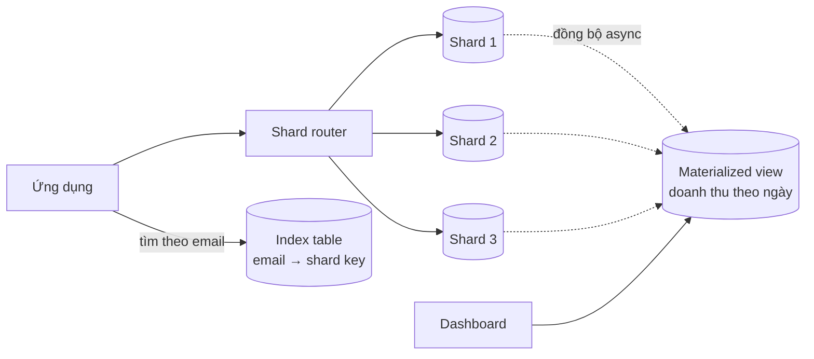
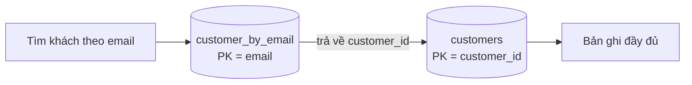
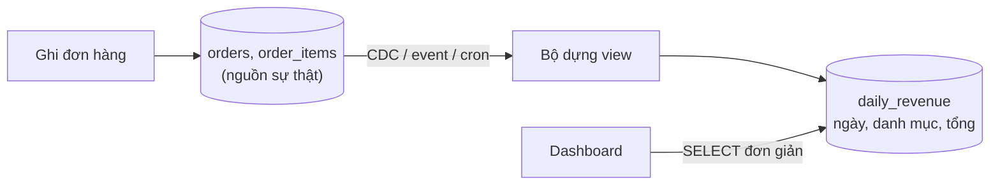

# Data Patterns: Sharding, Index Table, Materialized View

**Data Management patterns** là nhóm pattern trong bộ **Azure Cloud Design Patterns** giải quyết câu hỏi: dữ liệu nằm ở nhiều nơi (nhiều database, nhiều region, nhiều service) thì **chia, tìm và đọc** nó thế nào cho nhanh mà vẫn đúng. Bài này đi qua ba pattern nền tảng nhất: **Sharding** (chia dữ liệu ra nhiều node), **Index Table** (bảng chỉ mục phụ để tra cứu theo field không phải khoá chính) và **Materialized View** (view dựng sẵn, tính trước kết quả truy vấn tốn kém).

**Tương tự đơn giản:** Thư viện quá lớn thì chia sách ra nhiều toà nhà (**sharding**). Muốn tìm sách theo tên tác giả mà sách lại xếp theo mã số, thư viện in thêm **sổ tra cứu theo tác giả** (**index table**). Còn bảng "top 10 sách mượn nhiều nhất tháng" được thủ thư **tính sẵn mỗi đêm và dán lên bảng tin** thay vì mỗi người hỏi lại đếm lại (**materialized view**).

---

:::note[Ghi nhớ nhanh]

- ⭐ **Sharding = chia dữ liệu theo shard key ra nhiều node** — 3 chiến lược: **Lookup** (bảng ánh xạ), **Range** (theo khoảng), **Hash** (băm). Chọn sai shard key là nợ kỹ thuật cực đắt.
- ⭐ **Materialized View = kết quả truy vấn được tính sẵn và lưu lại** — đổi độ tươi (freshness) lấy tốc độ đọc; luôn là dữ liệu **có thể dựng lại** từ nguồn.
- **Index Table = bảng phụ ánh xạ field phụ → shard key / primary key** — dùng khi DB (thường là NoSQL hoặc dữ liệu đã shard) không có secondary index toàn cục.
- **Cả ba đều nhân bản/biến đổi dữ liệu** → phải chấp nhận **eventual consistency** (nhất quán sau cùng) giữa nguồn và bản phụ.
- **Hotspot** (một shard/partition bị dồn tải) là lỗi số 1 khi sharding — thường do shard key lệch (theo ngày, theo tenant lớn).

:::

---

## Mục lục

- [Vì sao cần Data Management patterns?](#vì-sao-cần-data-management-patterns)
- [1. Data Management là gì?](#1-data-management-là-gì)
- [2. Sharding pattern](#2-sharding-pattern)
- [3. Index Table pattern](#3-index-table-pattern)
- [4. Materialized View pattern](#4-materialized-view-pattern)
- [5. So sánh ba pattern](#5-so-sánh-ba-pattern)
- [Khi nào dùng?](#khi-nào-dùng)
- [Lỗi thường gặp](#lỗi-thường-gặp)
- [Câu hỏi phỏng vấn](#câu-hỏi-phỏng-vấn)

---

## Vì sao cần Data Management patterns?

**Vấn đề:** Một database đơn lẻ có giới hạn vật lý: dung lượng đĩa, IOPS, số kết nối, CPU. Khi bảng `orders` lên vài tỷ dòng và hàng chục nghìn ghi mỗi giây, scale dọc (mua máy to hơn) chạm trần cả về kỹ thuật lẫn chi phí. Chia dữ liệu ra nhiều node thì lại phát sinh vấn đề mới: muốn tìm đơn theo `email` khách hàng mà dữ liệu được chia theo `order_id` thì phải hỏi **mọi** shard (scatter-gather). Báo cáo tổng hợp `JOIN` nhiều bảng chạy vài giây, không thể chạy cho mỗi request.

**Giải pháp:** Ba pattern bổ trợ nhau:

- **Sharding** giải bài toán **ghi và dung lượng** — chia tải ra nhiều node.
- **Index Table** giải bài toán **tìm theo field phụ** trên dữ liệu đã chia.
- **Materialized View** giải bài toán **đọc tổng hợp đắt đỏ** — tính trước, đọc nhanh.

:::tip[Dùng thực tế]

- **Instagram** shard PostgreSQL theo user ID, nhúng shard ID vào chính ID sinh ra (ID 64-bit chứa timestamp + shard ID + sequence).
- **Discord** lưu message trên Cassandra/ScyllaDB với partition key gồm `channel_id` + bucket thời gian để tránh partition quá lớn.
- **DynamoDB Global Secondary Index (GSI)** thực chất là một **index table** được AWS tự đồng bộ bất đồng bộ.
- **Dashboard doanh thu** của các sàn TMĐT thường đọc từ bảng tổng hợp theo giờ/ngày (materialized view) thay vì quét bảng đơn hàng gốc.

:::

---

## 1. Data Management là gì?

**Data Management** trong Azure Cloud Design Patterns gồm các pattern xử lý **lưu trữ, phân phối, đồng bộ và truy cập dữ liệu** trong hệ thống phân tán. Đặc điểm chung của môi trường cloud:

- Dữ liệu thường **trải trên nhiều store** (SQL, NoSQL, blob, cache) và nhiều region.
- **Nhất quán mạnh (strong consistency) rất đắt** khi dữ liệu phân tán → đa số pattern chấp nhận eventual consistency.
- Cần thiết kế cho **scale ngang** và **chịu lỗi từng phần** (một node chết không kéo sập cả hệ thống).

Các pattern thuộc nhóm này trên roadmap gồm: Sharding, Index Table, Materialized View, Event Sourcing, CQRS, Valet Key, Static Content Hosting, Cache-Aside. Bài này phủ ba pattern đầu.



---

## 2. Sharding pattern

**Sharding** chia một tập dữ liệu logic thành nhiều **shard** (mảnh) nằm trên các node vật lý khác nhau. Mỗi shard có **cùng schema** nhưng chứa tập dòng khác nhau (chia ngang — horizontal partitioning). Field dùng để quyết định dòng nằm shard nào gọi là **shard key** (hay partition key).

Từ góc nhìn pattern, câu hỏi cốt lõi là **ánh xạ shard key → shard bằng cách nào**. Azure mô tả ba chiến lược:

### 2.1. Lookup strategy (bảng ánh xạ)

Một **shard map** lưu ánh xạ từ khoá (hoặc nhóm khoá, ví dụ `tenant_id`) tới shard vật lý. Router đọc shard map để biết gửi request đi đâu.

```sql
-- Shard map: lưu ở store riêng, cache mạnh trong router
CREATE TABLE shard_map (
  tenant_id   BIGINT PRIMARY KEY,
  shard_name  VARCHAR(64) NOT NULL   -- vd: 'pg-shard-07'
);
```

- **Ưu điểm:** linh hoạt nhất — dời một tenant lớn sang shard riêng chỉ cần đổi một dòng mapping (sau khi copy dữ liệu). Hợp với **multi-tenant SaaS**.
- **Nhược điểm:** thêm một bước tra cứu; shard map là **điểm lỗi đơn** nếu không cache/replicate.

### 2.2. Range strategy (theo khoảng)

Gom các khoá **liên tiếp** vào cùng shard, ví dụ theo tháng tạo đơn hoặc theo khoảng ID.

| Khoảng `created_at` | Shard |
| --- | --- |
| 2026-01 → 2026-03 | shard-q1 |
| 2026-04 → 2026-06 | shard-q2 |
| 2026-07 → 2026-09 | shard-q3 |

- **Ưu điểm:** truy vấn theo khoảng (`WHERE created_at BETWEEN ...`) chỉ chạm một vài shard; dễ archive shard cũ.
- **Nhược điểm:** **hotspot** — mọi ghi mới đều dồn vào shard "hiện tại". Phân bổ lệch nếu dữ liệu không đều.

### 2.3. Hash strategy (băm)

Áp hàm băm lên shard key rồi lấy modulo (hoặc dùng **consistent hashing** — băm nhất quán, xem bài về databases) để chọn shard.

```ts
import { createHash } from 'node:crypto';

const SHARDS = ['pg-0', 'pg-1', 'pg-2', 'pg-3'] as const;

// Băm userId → chọn shard. Phân bố đều, nhưng đổi số shard sẽ dời gần hết dữ liệu
export function pickShard(userId: string): string {
  const digest = createHash('sha1').update(userId).digest();
  const bucket = digest.readUInt32BE(0) % SHARDS.length;
  return SHARDS[bucket];
}
```

- **Ưu điểm:** phân bố tải đều, tránh hotspot do khoá tuần tự.
- **Nhược điểm:** truy vấn theo khoảng phải hỏi **mọi shard**; thêm shard với `hash % N` làm dời gần hết dữ liệu → nên dùng consistent hashing hoặc **virtual shard** (chia sẵn nhiều shard logic, vd 1024, rồi gán nhiều shard logic vào một node vật lý).

### 2.4. So sánh ba chiến lược

| Tiêu chí | Lookup | Range | Hash |
| --- | --- | --- | --- |
| Phân bố tải | Tuỳ cách gán | Dễ lệch, hotspot | Đều |
| Range query | Tuỳ | Tốt | Kém (scatter-gather) |
| Rebalance | Dễ (đổi mapping) | Trung bình (tách khoảng) | Khó nếu `% N`, dễ với virtual shard |
| Chi phí tra cứu | Thêm 1 lookup (cache được) | Rẻ | Rẻ |
| Ví dụ | SaaS multi-tenant | Time-series, log | User/session data |

### 2.5. Issues & considerations khi sharding

- **Chọn shard key:** phải có **cardinality cao**, phân bố đều và xuất hiện trong **hầu hết truy vấn**. Đổi shard key về sau gần như phải migrate toàn bộ.
- **Truy vấn cross-shard:** `JOIN`/`ORDER BY`/`COUNT` trên nhiều shard phải làm ở tầng ứng dụng (fan-out rồi gộp) → chậm. Thiết kế để truy vấn nóng chỉ chạm **một shard**.
- **Transaction phân tán:** ACID chỉ đảm bảo trong một shard. Cần saga/compensating transaction cho nghiệp vụ nhiều shard.
- **Unique ID toàn cục:** không dùng được auto-increment riêng từng shard → dùng UUID, Snowflake ID, hoặc nhúng shard ID vào ID như Instagram.
- **Dữ liệu tham chiếu nhỏ** (danh mục quốc gia, tỉnh thành) nên **replicate vào mọi shard** thay vì join chéo.
- **Rebalancing:** lên kế hoạch từ đầu (virtual shard, online migration, double-write).
- **Vận hành:** backup, schema migration, monitoring phải chạy trên N shard — tự động hoá là bắt buộc.

---

## 3. Index Table pattern

**Vấn đề:** Dữ liệu được tổ chức theo **một khoá chính** (shard key / partition key). Nhiều data store NoSQL (Cassandra, DynamoDB bảng gốc, Azure Table Storage) chỉ truy vấn hiệu quả theo khoá đó. Muốn tìm `customer` theo `email` hay `phone` thì phải quét toàn bộ — hoặc trên dữ liệu đã shard thì phải hỏi mọi shard.

**Giải pháp:** Tạo **bảng chỉ mục phụ** (index table) mà khoá chính của nó là field cần tìm, giá trị trỏ về khoá chính của bản ghi gốc.



### 3.1. Ba kiểu index table

| Kiểu | Index table chứa gì | Đọc | Ghi / lưu trữ |
| --- | --- | --- | --- |
| **Key-only** | Chỉ khoá trỏ về bản gốc | 2 lần đọc | Rẻ nhất |
| **Partially denormalized** | Khoá + vài field hay đọc | 1 lần cho truy vấn phổ biến | Trung bình |
| **Fully denormalized** | Bản sao đầy đủ bản ghi | 1 lần | Đắt, mỗi update phải ghi nhiều nơi |

```sql
-- Cassandra: bảng chính và index table theo email
CREATE TABLE customers (
  customer_id uuid PRIMARY KEY,
  email text, name text, tier text
);

CREATE TABLE customers_by_email (
  email text PRIMARY KEY,
  customer_id uuid,
  name text            -- denormalize một phần để đỡ một lần đọc
);
```

### 3.2. Issues & considerations

- **Chi phí ghi tăng:** mỗi thay đổi phải cập nhật bảng gốc **và** mọi index table. Ghi nhiều nơi không có transaction → có thể lệch. Thường đồng bộ qua **change feed / CDC** (Change Data Capture) hoặc batch write.
- **Eventual consistency:** index có thể trễ vài ms đến vài giây (DynamoDB GSI cũng vậy). Nghiệp vụ cần đọc ngay sau ghi phải đọc bảng gốc.
- **Field có cardinality thấp** (vd `status` chỉ có 3 giá trị) làm index table thành **hot partition** — một khoá chứa hàng triệu dòng.
- **Bản thân index table cũng có thể cần shard** — chọn partition key cho nó như với bảng gốc.
- Nếu DB đã hỗ trợ secondary index tốt (PostgreSQL, MySQL trong một node) thì **dùng index của DB**, đừng tự dựng index table.

---

## 4. Materialized View pattern

**Vấn đề:** Dữ liệu được lưu theo cách **tối ưu cho ghi** (chuẩn hoá, tách bảng, hoặc lưu dạng sự kiện), nhưng màn hình cần đọc theo hình dạng khác: tổng doanh thu theo ngày theo danh mục, số đơn theo trạng thái... Mỗi lần đọc phải `JOIN` + `GROUP BY` trên hàng triệu dòng → chậm và tốn tài nguyên.

**Giải pháp:** **Tính trước** kết quả truy vấn và lưu thành một "view" vật lý (materialized view) đúng hình dạng mà bên đọc cần. View là **dữ liệu phái sinh**, có thể xoá và dựng lại hoàn toàn từ nguồn.



### 4.1. Cách làm mới view

| Cách | Mô tả | Độ tươi | Ví dụ |
| --- | --- | --- | --- |
| **Refresh định kỳ** | Chạy lại toàn bộ truy vấn theo lịch | Trễ bằng chu kỳ | `REFRESH MATERIALIZED VIEW` qua cron |
| **Incremental theo sự kiện** | Mỗi event/CDC cập nhật phần liên quan | Gần real-time | Kafka consumer, Debezium |
| **On-demand** | Dựng khi có người đọc, rồi cache | Tuỳ TTL | Báo cáo hiếm dùng |

```sql
-- PostgreSQL: materialized view tổng doanh thu theo ngày
CREATE MATERIALIZED VIEW daily_revenue AS
SELECT date_trunc('day', o.created_at) AS day,
       p.category,
       SUM(oi.quantity * oi.unit_price)  AS revenue
FROM orders o
JOIN order_items oi ON oi.order_id = o.id
JOIN products p     ON p.id = oi.product_id
WHERE o.status = 'PAID'
GROUP BY 1, 2;

-- Cần unique index để refresh CONCURRENTLY (không khoá bên đọc)
CREATE UNIQUE INDEX ON daily_revenue (day, category);
REFRESH MATERIALIZED VIEW CONCURRENTLY daily_revenue;
```

Cập nhật **incremental** ở tầng ứng dụng (khi DB không có sẵn tính năng này):

```ts
// Consumer nhận event OrderPaid và cộng dồn vào bảng tổng hợp (idempotent theo eventId)
export async function onOrderPaid(db: Db, evt: OrderPaidEvent): Promise<void> {
  await db.tx(async (t) => {
    const inserted = await t.query(
      'INSERT INTO processed_events(event_id) VALUES ($1) ON CONFLICT DO NOTHING',
      [evt.eventId],
    );
    if (inserted.rowCount === 0) return; // đã xử lý rồi -> bỏ qua

    for (const item of evt.items) {
      await t.query(
        `INSERT INTO daily_revenue(day, category, revenue) VALUES ($1, $2, $3)
         ON CONFLICT (day, category) DO UPDATE SET revenue = daily_revenue.revenue + EXCLUDED.revenue`,
        [evt.paidDay, item.category, item.quantity * item.unitPrice],
      );
    }
  });
}
```

### 4.2. Issues & considerations

- **Độ trễ (staleness):** view luôn trễ hơn nguồn. Phải nói rõ với nghiệp vụ "số liệu cập nhật mỗi 5 phút".
- **Idempotency:** cập nhật incremental phải chịu được event trùng / đến lặp (lưu `event_id` đã xử lý).
- **Thứ tự event:** event đến sai thứ tự có thể làm view sai → dùng version/sequence.
- **Chi phí lưu trữ và ghi:** mỗi view là một bản dữ liệu nữa; đừng tạo view cho truy vấn hiếm.
- **Khả năng dựng lại:** luôn giữ đường "rebuild từ đầu" (replay event hoặc chạy lại truy vấn) cho trường hợp view hỏng hoặc đổi logic.
- **Materialized view là trái tim của read model trong CQRS** (xem bài 34: Event Sourcing và CQRS).

---

## 5. So sánh ba pattern

| | Sharding | Index Table | Materialized View |
| --- | --- | --- | --- |
| **Giải quyết** | Ghi/dung lượng vượt 1 node | Tìm theo field không phải khoá | Đọc tổng hợp đắt |
| **Bản chất** | Chia dữ liệu | Thêm bản ánh xạ phụ | Thêm bản dữ liệu phái sinh |
| **Nhất quán** | Mạnh trong 1 shard | Eventual so với bảng gốc | Eventual so với nguồn |
| **Chi phí chính** | Vận hành, cross-shard query | Ghi nhiều nơi | Lưu trữ, pipeline cập nhật |
| **Hay đi cùng** | Index Table | Sharding | CQRS, Event Sourcing |

---

## Khi nào dùng?

| Pattern | Nên dùng | Không nên dùng |
| --- | --- | --- |
| **Sharding** | Dữ liệu/ghi vượt khả năng 1 node sau khi đã tối ưu index, read replica, cache; multi-tenant cần cô lập | Dữ liệu vài chục GB; chưa thử scale dọc + replica; nghiệp vụ cần nhiều JOIN/transaction chéo |
| **Index Table** | NoSQL/dữ liệu đã shard cần tra cứu theo field phụ thường xuyên | DB có secondary index tốt; field cardinality thấp; dữ liệu đổi liên tục |
| **Materialized View** | Truy vấn đọc nặng, lặp lại nhiều, chấp nhận trễ; CQRS read model | Cần dữ liệu tuyệt đối mới nhất; truy vấn hiếm chạy; nguồn đổi quá nhanh khiến refresh đắt hơn query |

---

## Lỗi thường gặp

### Lỗi 1: Shard theo khoá tuần tự (thời gian, auto-increment)

Mọi ghi mới dồn vào shard cuối → shard đó quá tải, các shard khác ngồi chơi. **Sửa:** dùng hash strategy, hoặc khoá ghép `(tenant_id, bucket)`, hoặc thêm salt vào khoá.

### Lỗi 2: Shard quá sớm

Sharding thêm rất nhiều phức tạp (cross-shard query, migration, backup). Một PostgreSQL tốt với index đúng + read replica chịu được rất nhiều tải. **Sửa:** tối ưu query, cache, replica, partition trong một node trước; shard khi số liệu chứng minh cần.

### Lỗi 3: Quên rằng index table / view có thể lệch

Code đọc index table rồi tin tuyệt đối, trong khi bản ghi gốc đã bị xoá → lỗi `NotFound` hoặc hiển thị sai. **Sửa:** xử lý trường hợp "index trỏ tới bản ghi không tồn tại", có job đối soát (reconciliation) định kỳ.

### Lỗi 4: Materialized view không idempotent

Consumer cộng dồn doanh thu, broker giao lại event (at-least-once) → doanh thu bị cộng hai lần. **Sửa:** lưu event ID đã xử lý trong cùng transaction với cập nhật view.

### Lỗi 5: `REFRESH MATERIALIZED VIEW` không `CONCURRENTLY`

Trong PostgreSQL, refresh thường sẽ **khoá view**, dashboard bị treo trong lúc refresh. **Sửa:** tạo unique index và dùng `CONCURRENTLY`.

---

## Câu hỏi phỏng vấn

Những câu thường gặp về chủ đề này. Tự trả lời trước, rồi bấm **Xem đáp án** để đối chiếu.

**1. So sánh lookup, range và hash sharding. Khi nào chọn cái nào?**

<details className="qa">
<summary>Xem đáp án</summary>

- **Lookup:** có shard map ánh xạ khoá → shard. Linh hoạt, dễ dời tenant lớn; hợp SaaS multi-tenant. Cần cache shard map.
- **Range:** khoá liên tiếp nằm cùng shard. Tốt cho range query, time-series, archive; dễ hotspot.
- **Hash:** băm khoá để phân bố đều. Tránh hotspot; range query phải scatter-gather; rebalance khó nếu dùng `% N` → dùng consistent hashing / virtual shard.

</details>

**2. Tiêu chí chọn shard key tốt?**

<details className="qa">
<summary>Xem đáp án</summary>

Cardinality cao, phân bố đều (không có giá trị chiếm phần lớn dữ liệu/traffic), xuất hiện trong hầu hết truy vấn nóng để truy vấn chỉ chạm một shard, ổn định (ít khi đổi giá trị), và gom được dữ liệu hay đọc cùng nhau (vd `user_id` cho dữ liệu của một user).

</details>

**3. Index Table khác secondary index của database thế nào?**

<details className="qa">
<summary>Xem đáp án</summary>

Secondary index do DB quản lý, cập nhật cùng transaction, nhất quán mạnh nhưng thường chỉ trong một node/partition. Index table là **bảng do ứng dụng (hoặc hệ thống như DynamoDB GSI) tự duy trì**, có thể shard riêng, có thể denormalize thêm field, nhưng thường **eventual consistency** và tăng chi phí ghi.

</details>

**4. Materialized view khác cache thế nào?**

<details className="qa">
<summary>Xem đáp án</summary>

Cả hai là dữ liệu phái sinh để đọc nhanh. Cache thường lưu **bản sao nguyên dạng** theo key, có TTL, có thể mất bất cứ lúc nào (cache miss thì đọc nguồn). Materialized view lưu **kết quả đã biến đổi/tổng hợp** theo hình dạng của truy vấn, thường bền vững (nằm trong DB), được cập nhật chủ động qua refresh/event, và là nơi đọc chính chứ không phải lớp tăng tốc tuỳ chọn.

</details>

**5. Làm sao xử lý truy vấn cần dữ liệu trên nhiều shard?**

<details className="qa">
<summary>Xem đáp án</summary>

Ưu tiên tránh: thiết kế shard key để truy vấn nóng chạm 1 shard, replicate bảng tham chiếu nhỏ. Nếu buộc phải: fan-out song song tới các shard rồi gộp kết quả ở ứng dụng (có timeout, chấp nhận kết quả một phần), hoặc dựng **materialized view / index table** tổng hợp sẵn dữ liệu cross-shard, hoặc đẩy dữ liệu sang data warehouse/search engine cho truy vấn phân tích.

</details>
