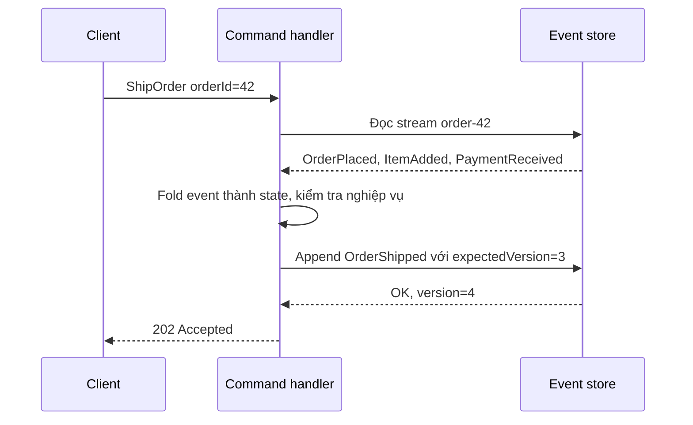
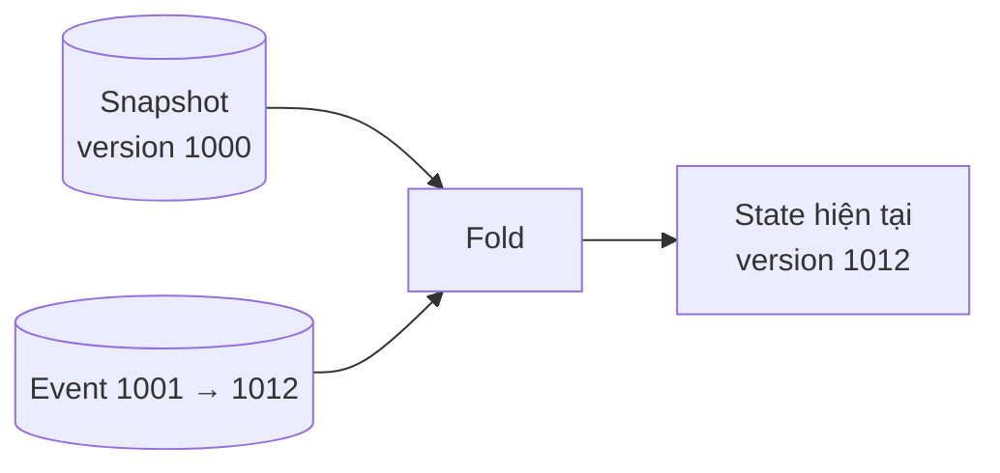
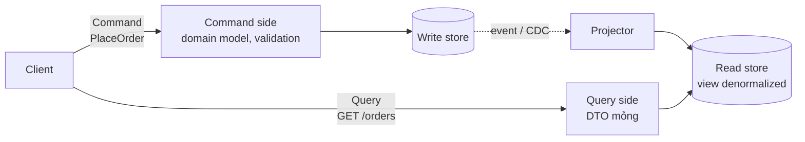
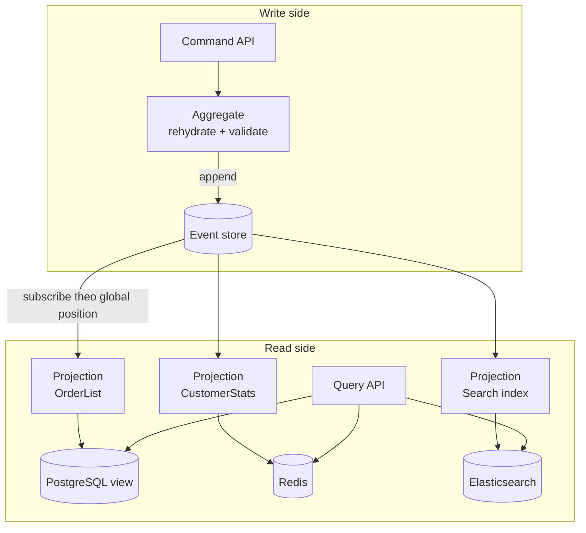

# Event Sourcing & CQRS

**Event Sourcing** là pattern lưu trạng thái hệ thống dưới dạng **chuỗi sự kiện (event) bất biến, chỉ được nối thêm (append-only)** thay vì chỉ lưu trạng thái hiện tại. **CQRS** (Command Query Responsibility Segregation — tách trách nhiệm ghi và đọc) là pattern tách **mô hình ghi (command)** khỏi **mô hình đọc (query)**, mỗi bên tối ưu cho việc của mình. Hai pattern độc lập nhưng rất hay đi cùng nhau: event store là phía ghi, các **projection** dựng read model từ event là phía đọc.

**Tương tự đơn giản:** Sổ tiết kiệm ngân hàng không lưu "số dư = 5 triệu" rồi ghi đè mỗi lần gửi/rút. Nó lưu **từng dòng giao dịch** (gửi 10 triệu, rút 3 triệu, rút 2 triệu) — số dư chỉ là **kết quả cộng dồn**. Đó là Event Sourcing. Còn quầy giao dịch (nhận lệnh gửi/rút) tách riêng với bảng điện tử hiển thị tỷ giá, số dư cho khách xem — đó là CQRS.

---

:::note[Ghi nhớ nhanh]

- ⭐ **Event Sourcing: nguồn sự thật là log event append-only** — trạng thái hiện tại = fold (cộng dồn) toàn bộ event; không `UPDATE`/`DELETE` event.
- ⭐ **CQRS: tách write model và read model** — write model kiểm tra nghiệp vụ, read model là các view denormalized; read model **eventual consistency** so với write.
- **Projection** = consumer đọc event và dựng read model; có thể xoá đi dựng lại bằng replay.
- **Snapshot** = lưu trạng thái tại version N để không phải replay hàng nghìn event mỗi lần load aggregate.
- **Không phải hệ thống nào cũng cần** — chi phí phức tạp cao; hợp domain nhiều nghiệp vụ, cần audit, cần nhiều cách đọc khác nhau.

:::

---

## Mục lục

- [Vì sao Event Sourcing và CQRS ra đời?](#vì-sao-event-sourcing-và-cqrs-ra-đời)
- [1. Event Sourcing](#1-event-sourcing)
- [2. Snapshot](#2-snapshot)
- [3. CQRS](#3-cqrs)
- [4. Kết hợp Event Sourcing và CQRS](#4-kết-hợp-event-sourcing-và-cqrs)
- [5. Projection và eventual consistency của read model](#5-projection-và-eventual-consistency-của-read-model)
- [6. Issues và considerations](#6-issues-và-considerations)
- [Khi nào dùng?](#khi-nào-dùng)
- [Lỗi thường gặp](#lỗi-thường-gặp)
- [Câu hỏi phỏng vấn](#câu-hỏi-phỏng-vấn)

---

## Vì sao Event Sourcing và CQRS ra đời?

**Vấn đề:** Mô hình CRUD truyền thống lưu **trạng thái hiện tại** và ghi đè khi thay đổi:

- **Mất lịch sử:** đơn hàng đang `CANCELLED` — nhưng ai huỷ, lúc nào, trước đó từng được giao một phần chưa? Muốn biết phải thêm bảng audit riêng, dễ quên ghi.
- **Một model phục vụ mọi thứ:** cùng bảng `orders` vừa phải đảm bảo ràng buộc nghiệp vụ khi ghi, vừa phải phục vụ màn hình danh sách, tìm kiếm, báo cáo. Kết quả là model phình to, query đọc phức tạp, index chồng chất làm chậm ghi.
- **Tải đọc và ghi lệch nhau:** nhiều hệ thống đọc gấp 10–100 lần ghi nhưng scale chung một DB.

**Giải pháp:**

- **Event Sourcing** lưu **mọi thay đổi dưới dạng event** → có audit log miễn phí, có thể "tua lại" trạng thái ở bất kỳ thời điểm nào, có thể dựng read model mới từ lịch sử cũ.
- **CQRS** tách hai phía → write model nhỏ gọn, tập trung bất biến (invariant) nghiệp vụ; read model denormalized, scale độc lập, mỗi màn hình một view phù hợp.

:::tip[Dùng thực tế]

- **Ngân hàng, ví điện tử, ledger kế toán:** sổ cái (ledger) bản chất là event sourcing — mọi bút toán được nối thêm, không sửa.
- **Git** là ví dụ quen thuộc: lịch sử commit là chuỗi thay đổi, working tree là trạng thái dựng ra từ lịch sử.
- **EventStoreDB, Axon Framework (Java), Marten (.NET)** là các công cụ chuyên cho event sourcing; nhiều đội dùng **Kafka** làm event log kèm DB cho read model.
- **Hệ thống đặt chỗ / thương mại điện tử** dùng CQRS để tách luồng đặt hàng khỏi trang tìm kiếm sản phẩm (Elasticsearch làm read model).

:::

---

## 1. Event Sourcing

### 1.1. Cơ chế

Mỗi **aggregate** (cụm đối tượng nghiệp vụ có ranh giới nhất quán, vd một `Order`, một `BankAccount`) có một **stream** event riêng. Event là **sự việc đã xảy ra**, đặt tên ở thì quá khứ: `OrderPlaced`, `ItemAdded`, `OrderShipped`.



Bảng event store tối giản trên PostgreSQL:

```sql
CREATE TABLE events (
  stream_id   TEXT        NOT NULL,       -- vd 'order-42'
  version     INT         NOT NULL,       -- thứ tự trong stream
  type        TEXT        NOT NULL,       -- 'OrderPlaced'
  data        JSONB       NOT NULL,
  metadata    JSONB       NOT NULL DEFAULT '{}',  -- userId, correlationId...
  global_pos  BIGSERIAL,                  -- thứ tự toàn cục cho projection
  created_at  TIMESTAMPTZ NOT NULL DEFAULT now(),
  PRIMARY KEY (stream_id, version)        -- chống ghi đồng thời (optimistic concurrency)
);
```

### 1.2. Dựng lại trạng thái (rehydrate)

```ts
type OrderEvent =
  | { type: 'OrderPlaced'; orderId: string; customerId: string }
  | { type: 'ItemAdded'; sku: string; qty: number; price: number }
  | { type: 'OrderShipped'; shippedAt: string }
  | { type: 'OrderCancelled'; reason: string };

interface OrderState {
  readonly status: 'NEW' | 'SHIPPED' | 'CANCELLED';
  readonly total: number;
  readonly version: number;
}

const initial: OrderState = { status: 'NEW', total: 0, version: 0 };

// Hàm thuần: (state, event) -> state mới, không mutate
function apply(state: OrderState, e: OrderEvent): OrderState {
  switch (e.type) {
    case 'ItemAdded':
      return { ...state, total: state.total + e.qty * e.price, version: state.version + 1 };
    case 'OrderShipped':
      return { ...state, status: 'SHIPPED', version: state.version + 1 };
    case 'OrderCancelled':
      return { ...state, status: 'CANCELLED', version: state.version + 1 };
    default:
      return { ...state, version: state.version + 1 };
  }
}

export const rehydrate = (events: readonly OrderEvent[]): OrderState =>
  events.reduce(apply, initial);

// Command handler: kiểm tra nghiệp vụ trên state, sinh event mới
export function ship(state: OrderState): OrderEvent {
  if (state.status !== 'NEW') throw new Error('Chỉ giao được đơn ở trạng thái NEW');
  return { type: 'OrderShipped', shippedAt: new Date().toISOString() };
}
```

Khi append, gửi kèm `expectedVersion` — nếu một request khác đã ghi trước, khoá chính `(stream_id, version)` bị trùng → lỗi xung đột, client retry. Đây là **optimistic concurrency control**.

### 1.3. Lợi ích

- **Audit log đầy đủ** và đáng tin (chính dữ liệu là log).
- **Temporal query:** trạng thái tại thời điểm T = replay event tới T.
- **Dựng read model mới từ lịch sử** — thêm báo cáo mới không cần migration dữ liệu cũ.
- **Debug:** replay event để tái hiện lỗi production.
- **Tích hợp:** event đã có sẵn để publish cho service khác.

---

## 2. Snapshot

Aggregate sống lâu (tài khoản ngân hàng 10 năm) có thể có hàng chục nghìn event. Replay toàn bộ mỗi lần xử lý command là chậm.

**Snapshot** = lưu trạng thái đã fold tại version N. Khi load: đọc snapshot mới nhất, rồi chỉ replay event **sau** version N.



```ts
export async function loadOrder(store: EventStore, id: string): Promise<OrderState> {
  const snap = await store.latestSnapshot<OrderState>(`order-${id}`);
  const from = snap ? snap.version + 1 : 1;
  const events = await store.readStream<OrderEvent>(`order-${id}`, from);
  return events.reduce(apply, snap ?? initial);
}
```

Lưu ý:

- Snapshot là **tối ưu hoá**, không phải nguồn sự thật — xoá hết snapshot hệ thống vẫn đúng, chỉ chậm hơn.
- Chụp theo ngưỡng (vd mỗi 100–500 event) hoặc bất đồng bộ bằng job nền.
- Khi đổi cấu trúc state, snapshot cũ có thể không tương thích → đánh version cho schema snapshot, bỏ snapshot cũ và dựng lại.
- Nếu aggregate thường xuyên cần snapshot, có thể ranh giới aggregate đang quá rộng — cân nhắc tách (vd "sổ cái theo tháng").

---

## 3. CQRS

### 3.1. Từ CQS đến CQRS

**CQS** (Command Query Separation, Bertrand Meyer) ở mức method: một method hoặc thay đổi trạng thái (command) hoặc trả dữ liệu (query), không làm cả hai. **CQRS** (Greg Young) đưa ý tưởng lên mức **kiến trúc**: hai model riêng, có thể hai data store riêng.



### 3.2. Các mức độ CQRS

| Mức | Mô tả | Độ phức tạp |
| --- | --- | --- |
| **Tách code** | Cùng DB, nhưng tách class/handler cho command và query | Thấp |
| **Tách model đọc** | Cùng DB, query đọc từ view/bảng denormalized | Trung bình |
| **Tách store** | Write vào PostgreSQL, read từ Elasticsearch/Redis/MongoDB | Cao |
| **CQRS + Event Sourcing** | Write store là event store, read model là projection | Cao nhất |

Không cần nhảy thẳng lên mức cao nhất — mức 1–2 đã mang lại phần lớn lợi ích về code sạch.

### 3.3. Lợi ích và cái giá

- **Scale độc lập:** read side thường nhiều replica; write side ít node nhưng nhất quán.
- **Model đơn giản hơn ở mỗi phía:** write model không cần quan tâm hiển thị; read model không có logic nghiệp vụ.
- **Bảo mật:** dễ kiểm soát ai được gửi command nào.
- **Cái giá:** hai model phải đồng bộ; read model **trễ**; nhiều thành phần vận hành hơn.

---

## 4. Kết hợp Event Sourcing và CQRS

Event Sourcing gần như **bắt buộc** đi cùng CQRS, vì event store chỉ đọc hiệu quả theo stream ID — không thể `SELECT * FROM orders WHERE status = 'SHIPPED' ORDER BY total` trên event store. Mọi truy vấn kiểu đó phải đi qua read model.

Ngược lại, CQRS **không** cần Event Sourcing: write side có thể là bảng quan hệ bình thường, đồng bộ sang read side qua CDC hoặc outbox.



---

## 5. Projection và eventual consistency của read model

### 5.1. Projection

**Projection** (hay projector) là consumer đọc event theo thứ tự và cập nhật read model. Yêu cầu:

- **Lưu checkpoint** (vị trí event đã xử lý, vd `global_pos`) **cùng transaction** với cập nhật read model → crash xong chạy lại không bị mất hay lặp.
- **Idempotent** — chịu được event giao lại.
- **Có thể rebuild:** xoá read model, đặt checkpoint về 0, replay toàn bộ. Đây là cách triển khai read model mới hoặc sửa bug projection.

```ts
export async function runOrderListProjection(db: Db, store: EventStore): Promise<void> {
  const checkpoint = await db.one('SELECT pos FROM checkpoints WHERE name = $1', ['order_list']);
  const batch = await store.readAll({ fromPosition: checkpoint.pos + 1, limit: 500 });

  for (const e of batch) {
    await db.tx(async (t) => {
      if (e.type === 'OrderPlaced') {
        await t.query(
          'INSERT INTO order_list(id, customer_id, status, total) VALUES ($1,$2,$3,0) ON CONFLICT DO NOTHING',
          [e.data.orderId, e.data.customerId, 'NEW'],
        );
      } else if (e.type === 'OrderShipped') {
        await t.query('UPDATE order_list SET status = $1 WHERE id = $2', ['SHIPPED', e.streamId]);
      }
      // checkpoint cập nhật cùng transaction với read model
      await t.query('UPDATE checkpoints SET pos = $1 WHERE name = $2', [e.globalPos, 'order_list']);
    });
  }
}
```

### 5.2. Xử lý eventual consistency ở UI

Sau khi gửi command, read model có thể chưa cập nhật (thường vài chục ms đến vài giây). Người dùng bấm "Tạo đơn" rồi về danh sách không thấy đơn → tưởng lỗi. Cách xử lý:

| Kỹ thuật | Mô tả |
| --- | --- |
| **Trả kết quả từ command** | Command trả ID + version, UI tự hiển thị optimistic |
| **Read-your-writes** | Query gửi kèm `minVersion`, server đợi projection bắt kịp (có timeout) |
| **Đọc write side cho chính entity vừa sửa** | Trang chi tiết đọc từ aggregate, danh sách đọc từ view |
| **Push cập nhật** | WebSocket/SSE báo khi projection xong |
| **UX rõ ràng** | "Đơn đang được xử lý" thay vì giả vờ đồng bộ |

---

## 6. Issues và considerations

- **Schema evolution (tiến hoá event):** event là bất biến và tồn tại mãi. Đổi cấu trúc event cần **versioning** (`OrderPlacedV2`) hoặc **upcaster** (chuyển event cũ sang dạng mới lúc đọc). Không sửa event cũ trong DB.
- **Xoá dữ liệu cá nhân (GDPR):** không xoá được event → dùng **crypto shredding** (mã hoá dữ liệu cá nhân bằng key riêng từng user, xoá key khi cần quên).
- **Thiết kế event đúng mức:** event nghiệp vụ (`OrderShipped`) chứ không phải event kỹ thuật (`OrderStatusColumnUpdated`).
- **Publish event ra ngoài:** event nội bộ (domain event) khác event tích hợp (integration event) — đừng để service khác phụ thuộc chi tiết nội bộ.
- **Ghi DB và publish message nguyên tử:** khi không dùng event store làm broker, dùng **Transactional Outbox**.
- **Truy vấn nghiệp vụ cần đọc nhiều aggregate** (vd username duy nhất) khó làm ở write side → cần bảng/constraint phụ hoặc chấp nhận kiểm tra trên read model kèm bù trừ.
- **Chi phí học và vận hành** cao: debug khó hơn CRUD, cần công cụ xem stream, rebuild projection.

---

## Khi nào dùng?

| Nên dùng | Không nên dùng |
| --- | --- |
| Domain phức tạp, nhiều quy tắc nghiệp vụ (DDD) | CRUD đơn giản, form nhập liệu |
| Bắt buộc audit trail / truy vết (tài chính, y tế, pháp lý) | Đội nhỏ, deadline gấp, chưa quen pattern |
| Cần nhiều cách đọc khác nhau trên cùng dữ liệu | Nghiệp vụ cần đọc nhất quán mạnh ngay sau ghi ở mọi nơi |
| Tải đọc và ghi chênh lệch lớn, cần scale riêng | Dữ liệu ít thay đổi, ít giá trị lịch sử |
| Muốn phân tích hành vi theo lịch sử, replay | Hệ thống mà phần lớn logic là truy vấn ad-hoc |

Có thể áp dụng **chỉ cho một bounded context** (vd module thanh toán) thay vì toàn hệ thống.

---

## Lỗi thường gặp

### Lỗi 1: Dùng event store như bảng để query

Viết query quét toàn event store để lấy "danh sách đơn đang giao". **Sửa:** mọi truy vấn ngoài "load theo stream ID" phải qua projection.

### Lỗi 2: Sửa hoặc xoá event cũ khi có bug

Event là sự thật lịch sử. **Sửa:** ghi **event bù trừ** (compensating event, vd `PaymentCorrected`), hoặc sửa projection và rebuild.

### Lỗi 3: Projection không idempotent, checkpoint lưu riêng

Lưu checkpoint sau khi đã commit read model ở transaction khác → crash giữa chừng thì event bị xử lý lại hai lần. **Sửa:** cùng transaction, hoặc thao tác upsert idempotent.

### Lỗi 4: Áp CQRS + ES cho cả hệ thống

Mọi module, kể cả quản lý danh mục đơn giản, đều thành event sourced → chi phí khổng lồ. **Sửa:** chỉ áp cho core domain cần thiết.

### Lỗi 5: Bỏ qua eventual consistency ở UX

Người dùng tạo xong không thấy dữ liệu, bấm tạo lại → đơn trùng. **Sửa:** idempotency key cho command + kỹ thuật ở mục 5.2.

---

## Câu hỏi phỏng vấn

Những câu thường gặp về chủ đề này. Tự trả lời trước, rồi bấm **Xem đáp án** để đối chiếu.

**1. Event Sourcing là gì? Khác gì so với lưu bảng audit log?**

<details className="qa">
<summary>Xem đáp án</summary>

Event Sourcing lấy **chuỗi event là nguồn sự thật**; trạng thái hiện tại được dựng ra từ event. Audit log thì là bản ghi **phụ**, trạng thái vẫn nằm ở bảng chính — audit có thể quên ghi hoặc lệch với dữ liệu thật. Với ES, không thể có thay đổi nào mà không có event.

</details>

**2. CQRS có bắt buộc phải dùng Event Sourcing không? Ngược lại?**

<details className="qa">
<summary>Xem đáp án</summary>

CQRS **không** cần ES — write side có thể là RDBMS, đồng bộ sang read side qua CDC/outbox. Ngược lại, ES **gần như cần** CQRS vì event store chỉ đọc hiệu quả theo stream ID; mọi truy vấn khác phải đi qua read model dựng bằng projection.

</details>

**3. Snapshot giải quyết vấn đề gì? Có rủi ro gì?**

<details className="qa">
<summary>Xem đáp án</summary>

Giảm thời gian load aggregate có nhiều event: đọc snapshot tại version N rồi chỉ replay event sau N. Rủi ro: schema state thay đổi làm snapshot cũ không tương thích (cần version snapshot và cho phép bỏ/dựng lại), và tốn thêm lưu trữ. Snapshot luôn là cache, không phải nguồn sự thật.

</details>

**4. Làm sao xử lý việc user tạo dữ liệu xong nhưng read model chưa cập nhật?**

<details className="qa">
<summary>Xem đáp án</summary>

Trả ID/version từ command để UI hiển thị optimistic; read-your-writes bằng cách query kèm version tối thiểu và chờ projection bắt kịp có timeout; đọc trực tiếp write side cho entity vừa sửa; push thông báo qua WebSocket khi projection xong; thiết kế UX thể hiện trạng thái "đang xử lý".

</details>

**5. Làm sao thay đổi cấu trúc event khi hệ thống đã chạy lâu?**

<details className="qa">
<summary>Xem đáp án</summary>

Không sửa event cũ. Dùng versioning (thêm loại event mới), **upcaster** chuyển event cũ sang dạng mới lúc đọc, thiết kế event chịu được field thêm (tolerant reader). Trường hợp cực đoan: copy-transform sang stream mới (migration) rồi chuyển hướng.

</details>

**6. Làm sao "xoá" dữ liệu cá nhân trong event store để tuân thủ GDPR?**

<details className="qa">
<summary>Xem đáp án</summary>

Crypto shredding: mã hoá trường dữ liệu cá nhân bằng key riêng của user, lưu key ở kho riêng; khi cần xoá thì xoá key — event vẫn còn nhưng dữ liệu không giải mã được. Hoặc chỉ lưu tham chiếu trong event, dữ liệu cá nhân nằm ở store có thể xoá.

</details>
