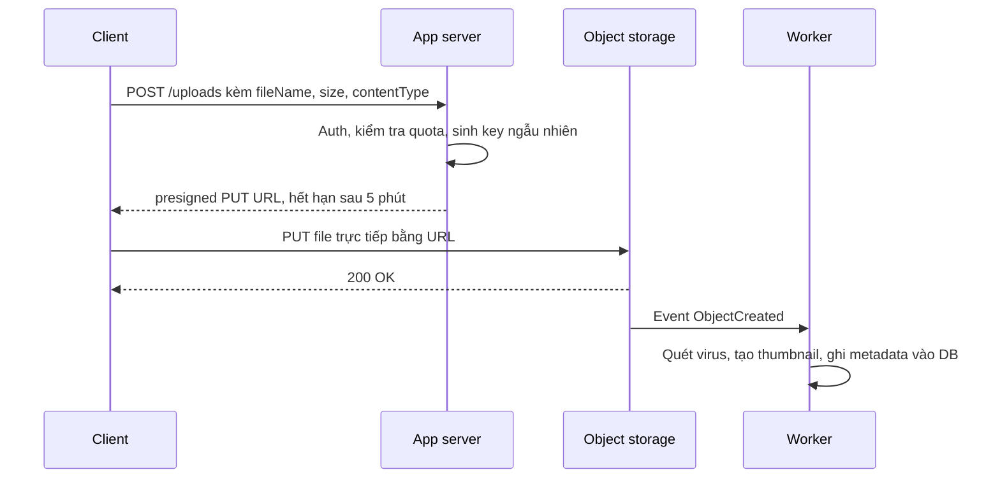
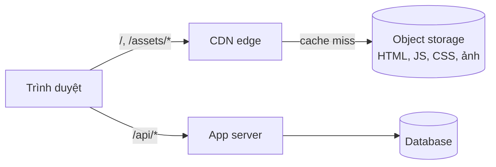
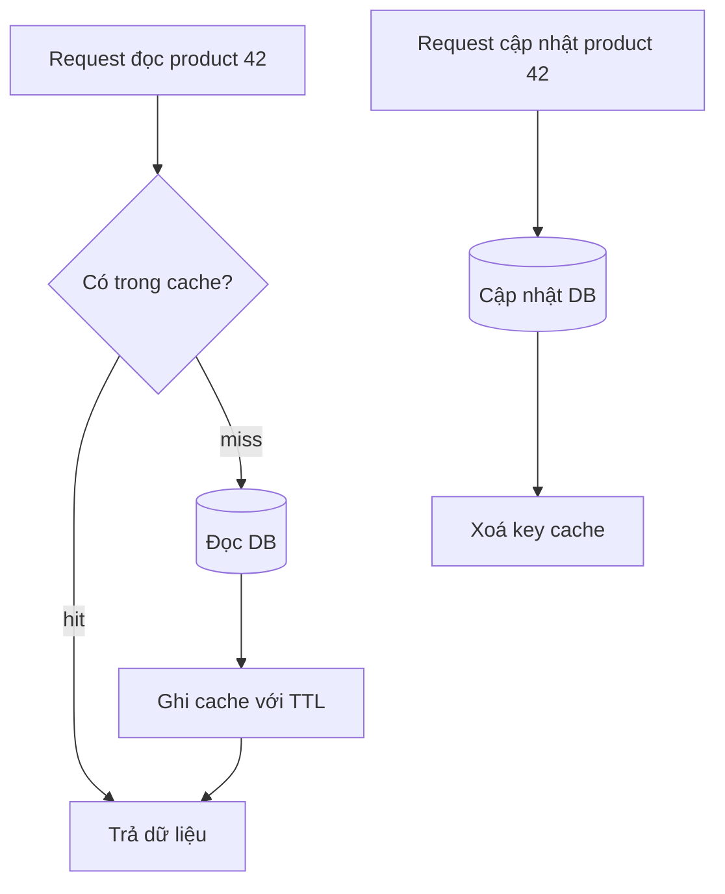

# Valet Key, Static Content Hosting & Cache-Aside

Ba pattern trong bài này cùng một tinh thần: **đừng bắt application server làm những việc mà tầng lưu trữ làm tốt hơn và rẻ hơn**. **Valet Key** cho client một "chìa khoá có hạn" (token/URL có chữ ký) để upload/download **trực tiếp** với storage. **Static Content Hosting** đặt file tĩnh (HTML, JS, ảnh) lên object storage + CDN thay vì để web server phục vụ. **Cache-Aside** để ứng dụng tự nạp dữ liệu vào cache khi cần, giảm tải database.

**Tương tự đơn giản:** **Valet key** chính là "chìa khoá giao xe" ở khách sạn — nhân viên đỗ xe cầm được chìa này để lái xe đi đỗ, nhưng không mở được cốp hay hộc đồ. Chìa đó có giới hạn quyền và bạn lấy lại sau khi xong việc.

---

:::note[Ghi nhớ nhanh]

- ⭐ **Valet Key = cấp quyền tạm thời, phạm vi hẹp, cho client truy cập trực tiếp storage** — vd S3 presigned URL, Azure SAS token. App server không còn phải "chuyển tiếp" từng byte.
- ⭐ **Cache-Aside = app đọc cache trước, miss thì đọc DB rồi ghi vào cache; khi ghi thì cập nhật DB rồi xoá cache.**
- **Static Content Hosting = file tĩnh nằm trên object storage (S3, Azure Blob, GCS) + CDN** — rẻ, scale gần như vô hạn, server chỉ lo API động.
- **Valet key phải ngắn hạn và hẹp:** đúng một object, đúng một thao tác (PUT hoặc GET), hết hạn sau vài phút, giới hạn content-type/size.
- **Cache-Aside chấp nhận dữ liệu cũ trong khoảng TTL** — luôn đặt TTL, coi chừng **cache stampede**.

:::

---

## Mục lục

- [Vì sao cần ba pattern này?](#vì-sao-cần-ba-pattern-này)
- [1. Valet Key pattern](#1-valet-key-pattern)
- [2. Static Content Hosting pattern](#2-static-content-hosting-pattern)
- [3. Cache-Aside pattern](#3-cache-aside-pattern)
- [4. Ba pattern phối hợp trong một hệ thống](#4-ba-pattern-phối-hợp-trong-một-hệ-thống)
- [Khi nào dùng?](#khi-nào-dùng)
- [Lỗi thường gặp](#lỗi-thường-gặp)
- [Câu hỏi phỏng vấn](#câu-hỏi-phỏng-vấn)

---

## Vì sao cần ba pattern này?

**Vấn đề:** Một app Node.js nhận upload video 500 MB: request đi qua load balancer → app server → S3. App server phải giữ kết nối lâu, đệm dữ liệu, tốn băng thông vào **và** ra, chiếm worker/thread, dễ timeout. Tương tự, server render cả file `bundle.js` 2 MB cho hàng triệu lượt truy cập; và mỗi request trang sản phẩm lại query DB cho dữ liệu hầu như không đổi.

**Giải pháp:**

- **Valet Key:** server chỉ **cấp quyền**, dữ liệu đi thẳng client ↔ storage.
- **Static Content Hosting:** đưa file tĩnh ra object storage + CDN, edge gần người dùng phục vụ.
- **Cache-Aside:** dữ liệu đọc nhiều nằm ở Redis/Memcached, DB chỉ nhận cache miss.

:::tip[Dùng thực tế]

- **S3 presigned URL** được dùng rộng rãi cho upload avatar, tài liệu, video trong app web/mobile; **Azure SAS (Shared Access Signature)** và **GCS signed URL** là tương đương.
- **CloudFront signed URL/cookie** cho phép bán nội dung trả phí (khoá học video) mà vẫn dùng CDN.
- **Website tĩnh / SPA** trên S3 + CloudFront, Azure Static Web Apps, Netlify, Vercel, GitHub Pages — chính trang tài liệu Docusaurus này là một site tĩnh.
- **Cache-Aside với Redis** là pattern cache phổ biến nhất ở backend web (trang sản phẩm, profile, cấu hình).

:::

---

## 1. Valet Key pattern

### 1.1. Cơ chế

1. Client xin quyền upload: `POST /uploads` kèm tên file, kích thước, loại.
2. Server **xác thực + phân quyền** người dùng, kiểm tra hạn mức, sinh key object an toàn.
3. Server ký một URL/token **giới hạn**: chỉ `PUT` đúng key đó, hết hạn sau N phút.
4. Client upload **trực tiếp** lên storage bằng URL đó.
5. Storage phát sự kiện (S3 Event Notification) hoặc client báo lại → server xác nhận, xử lý tiếp (quét virus, tạo thumbnail).



### 1.2. Code TypeScript với AWS SDK v3

```ts
import { S3Client, PutObjectCommand, GetObjectCommand } from '@aws-sdk/client-s3';
import { getSignedUrl } from '@aws-sdk/s3-request-presigner';
import { randomUUID } from 'node:crypto';
import { z } from 'zod';

const s3 = new S3Client({ region: process.env.AWS_REGION });
const BUCKET = process.env.UPLOAD_BUCKET;
const UPLOAD_TTL_SECONDS = 300;     // 5 phút
const DOWNLOAD_TTL_SECONDS = 60;
const MAX_SIZE_BYTES = 10 * 1024 * 1024;

const UploadRequest = z.object({
  contentType: z.enum(['image/png', 'image/jpeg', 'application/pdf']),
  size: z.number().int().positive().max(MAX_SIZE_BYTES),
});

// Cấp valet key để upload: chỉ PUT đúng 1 key, đúng content-type, hết hạn nhanh
export async function createUploadUrl(userId: string, input: unknown) {
  const { contentType, size } = UploadRequest.parse(input);
  // Key do server sinh, KHÔNG dùng tên file client gửi (tránh path traversal, ghi đè)
  const key = `uploads/${userId}/${randomUUID()}`;

  const url = await getSignedUrl(
    s3,
    new PutObjectCommand({
      Bucket: BUCKET,
      Key: key,
      ContentType: contentType,   // client phải gửi đúng header này, sai là bị từ chối chữ ký
      ContentLength: size,
    }),
    { expiresIn: UPLOAD_TTL_SECONDS },
  );

  return { key, url, expiresIn: UPLOAD_TTL_SECONDS };
}

// Cấp valet key để tải về: kiểm tra quyền sở hữu TRƯỚC khi ký
export async function createDownloadUrl(userId: string, key: string) {
  if (!key.startsWith(`uploads/${userId}/`)) {
    throw new Error('Không có quyền truy cập file này');
  }
  return getSignedUrl(s3, new GetObjectCommand({ Bucket: BUCKET, Key: key }), {
    expiresIn: DOWNLOAD_TTL_SECONDS,
  });
}
```

Phía client chỉ cần:

```ts
await fetch(url, { method: 'PUT', headers: { 'Content-Type': file.type }, body: file });
```

Bucket cần cấu hình **CORS** cho phép `PUT` từ domain frontend, và **block public access** — bucket vẫn private, chỉ URL có chữ ký mới truy cập được.

### 1.3. Issues & considerations

- **Phạm vi tối thiểu:** một object, một thao tác, thời hạn ngắn. Đừng cấp quyền cả bucket/prefix nếu không cần.
- **Không thu hồi được dễ dàng:** presigned URL hợp lệ tới khi hết hạn (hoặc khi credential dùng để ký bị vô hiệu). Vì vậy TTL phải ngắn. Azure SAS có thể gắn với **stored access policy** để thu hồi.
- **Kiểm soát nội dung:** presigned PUT đơn giản không giới hạn được kích thước chặt bằng mọi cách; với form upload từ trình duyệt, S3 **presigned POST** hỗ trợ điều kiện `content-length-range`. Luôn **validate lại sau upload** (kích thước, magic bytes, quét malware) trước khi dùng file.
- **Audit:** bật access log của storage, vì request không còn đi qua app.
- **Lộ URL:** URL chứa chữ ký — đừng log nguyên văn, đừng để trong referrer công khai.
- **Upload lớn:** dùng **multipart upload** với presigned URL cho từng part.

---

## 2. Static Content Hosting pattern

### 2.1. Vấn đề và giải pháp

Web server (Node, Java, PHP) tốn CPU, bộ nhớ, kết nối để phục vụ file không đổi như `logo.png`, `main.3f9a.js`. Object storage được thiết kế để phục vụ file với chi phí thấp, độ bền cao; đặt thêm CDN phía trước thì file được cache ở edge gần người dùng.



### 2.2. Thiết lập điển hình

- **Build** frontend (React/Vue/Docusaurus) ra thư mục tĩnh, upload lên bucket.
- **Tên file có hash nội dung** (`main.3f9a.js`) → đặt `Cache-Control: public, max-age=31536000, immutable`. Đổi nội dung → đổi tên → không cần invalidate.
- **`index.html` cache ngắn** (`no-cache` hoặc vài phút) vì nó trỏ tới tên file hash mới.
- **Origin access control:** chỉ CDN được đọc bucket, người dùng không truy cập bucket trực tiếp.
- **SPA routing:** cấu hình trả `index.html` cho route không tồn tại (rewrite/custom error page).

```bash
# Upload asset có hash: cache 1 năm, bất biến
aws s3 sync build/ s3://my-site --exclude "index.html" \
  --cache-control "public, max-age=31536000, immutable"
# index.html: luôn kiểm tra lại
aws s3 cp build/index.html s3://my-site/index.html --cache-control "no-cache"
```

### 2.3. Issues & considerations

- **Nội dung cần xác thực** (file của từng user) không để public → kết hợp **Valet Key** (signed URL/cookie).
- **Thứ tự deploy:** upload asset mới trước, `index.html` sau cùng — tránh HTML trỏ tới file chưa có.
- **Giữ asset cũ một thời gian** để user đang mở trang cũ không bị 404 khi lazy-load chunk.
- **Domain và HTTPS:** cấu hình custom domain, chứng chỉ TLS trên CDN.
- **Không phù hợp** nội dung cá nhân hoá theo từng request (cần SSR hoặc API).

---

## 3. Cache-Aside pattern

Đây là góc nhìn **pattern**; chi tiết so sánh với read-through, write-through, write-behind đã có ở chương caching.

### 3.1. Cơ chế

- **Đọc:** hỏi cache → **hit** thì trả; **miss** thì đọc DB, ghi vào cache kèm TTL, rồi trả.
- **Ghi:** cập nhật DB → **xoá (invalidate)** key trong cache. Lần đọc sau sẽ nạp lại.

Ứng dụng tự chịu trách nhiệm (cache không tự biết DB), nên còn gọi là **lazy loading**.



```ts
const TTL_SECONDS = 300;

export async function getProduct(id: string): Promise<Product | null> {
  const key = `product:${id}`;
  const cached = await redis.get(key);
  if (cached) return JSON.parse(cached) as Product;

  const product = await db.product.findUnique({ where: { id } });
  if (product) {
    // TTL cộng ngẫu nhiên để tránh hàng loạt key hết hạn cùng lúc
    const jitter = Math.floor(Math.random() * 60);
    await redis.set(key, JSON.stringify(product), 'EX', TTL_SECONDS + jitter);
  }
  return product;
}

export async function updateProduct(id: string, data: ProductUpdate): Promise<Product> {
  const updated = await db.product.update({ where: { id }, data });
  await redis.del(`product:${id}`);   // xoá chứ không set, tránh race ghi đè dữ liệu cũ
  return updated;
}
```

### 3.2. Issues & considerations

- **Xoá thay vì cập nhật cache khi ghi:** hai request ghi đồng thời có thể set cache theo thứ tự sai; xoá thì lần đọc sau nạp giá trị mới nhất.
- **Race đọc-ghi:** request A miss, đọc DB (giá trị cũ) → B cập nhật DB và xoá cache → A ghi giá trị cũ vào cache. Giảm thiểu bằng TTL ngắn, **delayed double delete** (xoá lại sau vài trăm ms), hoặc version.
- **Cache stampede (thundering herd):** key nóng hết hạn, nghìn request cùng miss và cùng đập DB. Giải: lock/single-flight (chỉ một request nạp lại), TTL có jitter, làm mới trước khi hết hạn.
- **Cache penetration:** truy vấn key không tồn tại liên tục → luôn miss. Giải: cache giá trị rỗng với TTL ngắn, hoặc Bloom filter.
- **Cache khởi động lạnh (cold start):** sau deploy/restart, tải dồn vào DB → warm-up key nóng.
- **Không hợp** dữ liệu cần nhất quán mạnh (số dư tài khoản) hoặc dữ liệu đổi liên tục.

---

## 4. Ba pattern phối hợp trong một hệ thống

Ví dụ một nền tảng chia sẻ ảnh:

| Thành phần | Pattern | Vai trò |
| --- | --- | --- |
| SPA React | Static Content Hosting | Phục vụ HTML/JS/CSS qua CDN |
| Upload ảnh | Valet Key | Presigned PUT, client upload thẳng S3 |
| Xem ảnh riêng tư | Valet Key + CDN | Signed URL ngắn hạn qua CloudFront |
| Trang profile | Cache-Aside | Redis cache profile, TTL 5 phút |

Kết quả: app server chỉ xử lý logic, auth và ký URL — băng thông và CPU giảm đáng kể, scale rẻ hơn.

---

## Khi nào dùng?

| Pattern | Nên dùng | Không nên dùng |
| --- | --- | --- |
| **Valet Key** | Upload/download file lớn hoặc nhiều; muốn giảm tải và chi phí băng thông cho app server | Cần biến đổi/kiểm tra dữ liệu **trong lúc** truyền; client không đáng tin để giữ token dù ngắn hạn |
| **Static Content Hosting** | SPA, site tài liệu, asset frontend, file media công khai | Nội dung cá nhân hoá từng request; trang cần SEO động mà không có prerender |
| **Cache-Aside** | Đọc nhiều ghi ít, chấp nhận cũ trong TTL; cache không hỗ trợ read-through | Dữ liệu cần nhất quán mạnh; dữ liệu ít khi đọc lại (hit rate thấp) |

---

## Lỗi thường gặp

### Lỗi 1: Presigned URL sống quá lâu

Đặt hết hạn 7 ngày "cho tiện". URL bị lộ qua log/chia sẻ → ai cũng tải được. **Sửa:** TTL vài phút; cấp lại khi cần.

### Lỗi 2: Dùng tên file client gửi làm key

Client gửi `../../config.json` hoặc trùng tên ghi đè file người khác. **Sửa:** server tự sinh key (UUID) theo prefix của user.

### Lỗi 3: Tin tưởng file vừa upload

Không kiểm tra lại kích thước, loại thực sự, malware. **Sửa:** worker xử lý sau upload, chỉ đánh dấu file "sẵn sàng" khi đã kiểm tra.

### Lỗi 4: Cache asset không có hash với max-age dài

`app.js` cache 1 năm → deploy xong người dùng vẫn chạy code cũ. **Sửa:** tên file có hash nội dung; HTML cache ngắn.

### Lỗi 5: Cache-Aside không có TTL

Bug invalidate bị sót → dữ liệu sai nằm mãi trong cache. **Sửa:** luôn có TTL làm lưới an toàn.

---

## Câu hỏi phỏng vấn

Những câu thường gặp về chủ đề này. Tự trả lời trước, rồi bấm **Xem đáp án** để đối chiếu.

**1. Thiết kế tính năng upload video 1 GB cho app có hàng triệu user?**

<details className="qa">
<summary>Xem đáp án</summary>

Dùng Valet Key: client xin URL, server auth + kiểm tra quota rồi trả **multipart presigned URL** (mỗi part một URL). Client upload song song trực tiếp lên S3, có thể resume part lỗi. S3 event kích hoạt worker transcode, quét malware, ghi metadata. App server không chạm byte dữ liệu nào.

</details>

**2. Presigned URL bị lộ thì sao? Làm sao giảm rủi ro?**

<details className="qa">
<summary>Xem đáp án</summary>

Ai có URL đều dùng được tới khi hết hạn. Giảm rủi ro: TTL ngắn, phạm vi một object một thao tác, không log URL, dùng HTTPS, ràng buộc content-type, với download có thể dùng CloudFront signed cookie/URL kèm điều kiện. Cần thu hồi khẩn cấp thì vô hiệu credential dùng để ký (hoặc Azure stored access policy).

</details>

**3. Vì sao khi ghi nên xoá cache thay vì cập nhật cache?**

<details className="qa">
<summary>Xem đáp án</summary>

Hai request ghi đồng thời có thể cập nhật DB theo thứ tự A→B nhưng set cache theo thứ tự B→A → cache giữ giá trị cũ vô thời hạn. Xoá key thì lần đọc tiếp theo luôn nạp giá trị mới nhất từ DB. Ngoài ra tính toán giá trị cache có thể đắt mà chưa chắc có ai đọc.

</details>

**4. Cache stampede là gì và xử lý thế nào?**

<details className="qa">
<summary>Xem đáp án</summary>

Key nóng hết hạn, rất nhiều request cùng miss và cùng truy vấn DB, có thể làm DB sập. Xử lý: single-flight/lock để chỉ một request nạp lại, các request khác chờ hoặc trả giá trị cũ (stale-while-revalidate); TTL có jitter; làm mới chủ động trước hạn (probabilistic early expiration).

</details>

**5. Static Content Hosting xử lý cache khi deploy phiên bản mới thế nào?**

<details className="qa">
<summary>Xem đáp án</summary>

Asset dùng tên có hash nội dung và cache dài hạn `immutable`; `index.html` cache ngắn hoặc `no-cache`. Deploy: upload asset mới trước, `index.html` sau; giữ asset cũ một thời gian. Nếu buộc phải, invalidate CDN cho `index.html`.

</details>
