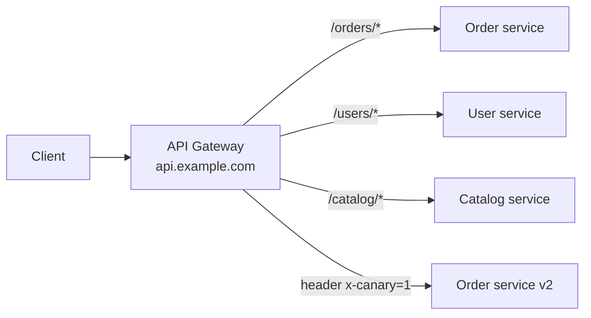
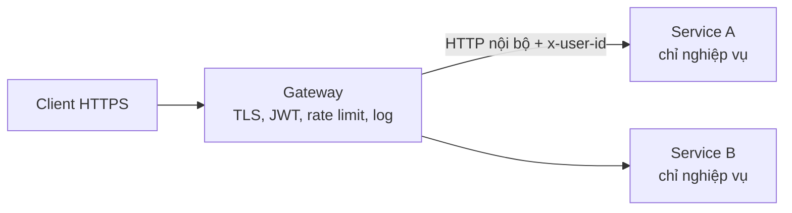
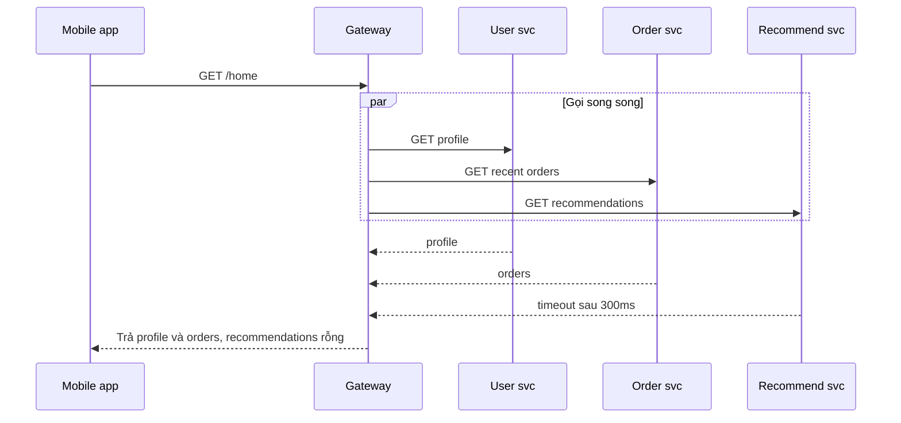
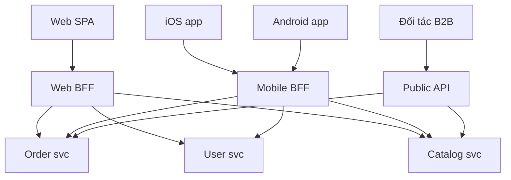

# Gateway Routing, Offloading, Aggregation & BFF

Khi hệ thống tách thành nhiều microservice, client không nên (và thường không thể) gọi trực tiếp từng service. Một **gateway** (cổng) đứng giữa client và backend để gánh các việc chung. Azure tách vai trò của gateway thành ba pattern: **Gateway Routing** (định tuyến một endpoint tới nhiều service), **Gateway Offloading** (gánh các việc cắt ngang như TLS, auth, rate limit), **Gateway Aggregation** (gộp nhiều lời gọi backend thành một). **Backends for Frontends (BFF)** mở rộng ý tưởng: mỗi loại frontend có gateway riêng được may đo cho nó.

**Tương tự đơn giản:** Gateway giống **lễ tân toà nhà văn phòng**: khách chỉ cần đến một quầy (routing), lễ tân kiểm tra giấy tờ và phát thẻ (offloading), và nếu khách cần hồ sơ từ ba phòng ban thì lễ tân gom lại đưa một lần (aggregation). Toà nhà lớn có thể có **quầy riêng cho khách VIP và quầy cho shipper** (BFF) — mỗi quầy phục vụ đúng nhu cầu nhóm khách của mình.

---

:::note[Ghi nhớ nhanh]

- ⭐ **Ba vai trò của gateway: Routing (đến đâu), Offloading (làm hộ việc chung), Aggregation (gộp nhiều call)** — một sản phẩm API Gateway thường đảm nhiệm cả ba.
- ⭐ **BFF = mỗi loại client (web, mobile, đối tác) một backend riêng** do chính team frontend đó sở hữu — tránh một API "vừa cho tất cả" phình to.
- **Offloading phù hợp việc cắt ngang, không chứa logic nghiệp vụ:** TLS termination, xác thực token, rate limit, nén, logging, CORS.
- **Aggregation giảm round-trip** (quan trọng với mobile mạng chậm) nhưng gateway dễ thành nút cổ chai và điểm lỗi tập trung.
- **Rủi ro lớn nhất:** gateway thành "monolith mới" vì nhồi logic nghiệp vụ vào.

:::

---

## Mục lục

- [Vì sao cần gateway?](#vì-sao-cần-gateway)
- [1. Nhóm Design and Implementation patterns](#1-nhóm-design-and-implementation-patterns)
- [2. Gateway Routing](#2-gateway-routing)
- [3. Gateway Offloading](#3-gateway-offloading)
- [4. Gateway Aggregation](#4-gateway-aggregation)
- [5. Backends for Frontends](#5-backends-for-frontends)
- [6. So sánh và kết hợp](#6-so-sánh-và-kết-hợp)
- [Khi nào dùng?](#khi-nào-dùng)
- [Lỗi thường gặp](#lỗi-thường-gặp)
- [Câu hỏi phỏng vấn](#câu-hỏi-phỏng-vấn)

---

## Vì sao cần gateway?

**Vấn đề:** Không có gateway, client phải:

- Biết địa chỉ của **từng** service (`orders.internal:8080`, `users.internal:9000`...) — đổi topology là phải cập nhật app mobile đã phát hành.
- Gọi **nhiều request** để dựng một màn hình — trên mạng di động với độ trễ mỗi round-trip có thể vài trăm ms, màn hình chậm rõ rệt.
- Mỗi service phải tự cài lại **TLS, xác thực, rate limit, CORS, logging** → trùng lặp, lệch phiên bản, dễ sót lỗ hổng.
- Một API chung cho web, mobile, smartwatch → mỗi client nhận dư/thiếu dữ liệu, thay đổi cho client này làm vỡ client khác.

**Giải pháp:** Đặt một lớp gateway (reverse proxy thông minh) làm **điểm vào duy nhất**, và khi các frontend khác nhau đủ nhiều, tách thành **nhiều gateway theo frontend (BFF)**.

:::tip[Dùng thực tế]

- **Netflix** dùng **Zuul** làm edge gateway (routing, auth, canary) và nổi tiếng với cách tiếp cận API riêng cho từng thiết bị.
- **SoundCloud** là nơi phổ biến thuật ngữ **BFF** (được Sam Newman mô tả), khi tách API riêng cho web, iOS, Android.
- **Sản phẩm phổ biến:** AWS API Gateway, Azure API Management, Kong, NGINX, Envoy, Traefik, Spring Cloud Gateway, Apollo Router (GraphQL federation).
- **Kubernetes Ingress / Gateway API** là dạng gateway routing chuẩn hoá trong cluster.

:::

---

## 1. Nhóm Design and Implementation patterns

**Design and Implementation** là nhóm pattern trong Azure Cloud Design Patterns hướng tới **thiết kế thành phần nhất quán, dễ bảo trì, tái sử dụng được** khi triển khai trên cloud. Các mối quan tâm chính: tách trách nhiệm rõ ràng, giảm trùng lặp, cho phép thành phần phát triển và deploy độc lập.

Các pattern trong nhóm trên roadmap gồm:

| Pattern | Ý tưởng một câu |
| --- | --- |
| Gateway Routing / Offloading / Aggregation | Một lớp gateway trước các service (bài này) |
| Backends for Frontends | Gateway riêng cho từng loại client (bài này) |
| Sidecar, Ambassador | Tách chức năng phụ ra process chạy kèm (bài 37) |
| Anti-corruption Layer, Strangler Fig | Tích hợp/thay thế hệ thống cũ (bài 37) |
| Leader Election, External Config Store, Compute Resource Consolidation | Điều phối và vận hành (bài 38) |
| Pipes and Filters, CQRS | Đã có bài riêng (bài 31 và 34) |

---

## 2. Gateway Routing

**Ý tưởng:** client gọi **một endpoint** duy nhất; gateway dùng **layer 7 routing** (theo path, host, header, method) để chuyển tới service phù hợp.



Ba cách dùng chính:

1. **Nhiều service sau một endpoint** — client không biết topology nội bộ.
2. **Nhiều phiên bản cùng service** — canary release, blue-green, A/B test bằng cách chia traffic theo tỷ lệ hoặc header.
3. **Nhiều instance / region** — kết hợp load balancing, route theo vị trí địa lý.

```nginx
# NGINX làm gateway routing đơn giản
upstream orders  { server orders-svc:8080; }
upstream users   { server users-svc:8080; }
upstream catalog { server catalog-svc:8080; }

server {
  listen 443 ssl;
  server_name api.example.com;

  location /orders/  { proxy_pass http://orders/; }
  location /users/   { proxy_pass http://users/; }
  location /catalog/ { proxy_pass http://catalog/; }
}
```

**Considerations:**

- Gateway là **điểm lỗi đơn** → chạy nhiều instance sau load balancer, đa AZ.
- Gateway thêm một hop → thêm độ trễ (thường vài ms); đo và tối ưu.
- Cấu hình route nên quản lý như code (GitOps) và hỗ trợ cập nhật không cần restart.
- Routing chỉ nên dựa trên **thông tin request**, không gọi service khác để quyết định route.

---

## 3. Gateway Offloading

**Ý tưởng:** chuyển các **chức năng cắt ngang** (cross-cutting concerns) từ từng service lên gateway, để service tập trung vào nghiệp vụ.

| Chức năng | Ví dụ ở gateway |
| --- | --- |
| **TLS termination** | Gateway giữ chứng chỉ, giải mã HTTPS; nội bộ dùng HTTP hoặc mTLS |
| **Xác thực** | Kiểm tra chữ ký và hạn JWT, chuyển `userId` xuống qua header |
| **Rate limiting / throttling** | Giới hạn theo API key, IP, user |
| **Nén, cache phản hồi** | gzip/brotli, cache GET công khai |
| **CORS, header bảo mật** | HSTS, CSP, X-Frame-Options |
| **Logging, metrics, tracing** | Gắn correlation ID, xuất access log |
| **IP allow/deny, WAF** | Chặn bot, SQL injection cơ bản |



```yaml
# Kong declarative config: offload xác thực JWT và rate limit cho order service
services:
  - name: orders
    url: http://orders-svc:8080
    routes:
      - name: orders-route
        paths: ["/orders"]
    plugins:
      - name: jwt
      - name: rate-limiting
        config:
          minute: 120
          policy: redis
```

**Considerations:**

- Chỉ offload thứ **dùng chung và ổn định**; logic nghiệp vụ (vd "user này có được huỷ đơn này không") vẫn nằm trong service.
- **Không tin tuyệt đối mạng nội bộ** (zero trust): nếu gateway chuyển `x-user-id`, service phải chắc chắn request đến từ gateway (mTLS, network policy), nếu không kẻ tấn công bên trong có thể giả header.
- Gateway phải được **tối ưu hiệu năng** vì mọi request đi qua nó.
- Team sở hữu gateway trở thành nút thắt nếu mọi thay đổi phải qua họ → tự phục vụ bằng config-as-code.

---

## 4. Gateway Aggregation

**Ý tưởng:** client gửi **một** request; gateway **fan-out** song song tới nhiều service, gộp kết quả và trả về một response.



```ts
// Aggregation có timeout từng phần và degrade khi service phụ lỗi
const withTimeout = <T>(p: Promise<T>, ms: number): Promise<T> =>
  Promise.race([
    p,
    new Promise<T>((_, reject) => setTimeout(() => reject(new Error('timeout')), ms)),
  ]);

export async function getHome(userId: string) {
  const [profile, orders, recs] = await Promise.allSettled([
    withTimeout(userClient.getProfile(userId), 500),
    withTimeout(orderClient.recent(userId, 5), 500),
    withTimeout(recClient.forUser(userId), 300),
  ]);

  // Profile là bắt buộc: lỗi thì trả lỗi; phần còn lại là tuỳ chọn
  if (profile.status === 'rejected') throw new Error('Không tải được hồ sơ người dùng');

  return {
    profile: profile.value,
    recentOrders: orders.status === 'fulfilled' ? orders.value : [],
    recommendations: recs.status === 'fulfilled' ? recs.value : [],
  };
}
```

**Considerations:**

- **Gọi song song**, không tuần tự — độ trễ tổng xấp xỉ service chậm nhất, không phải tổng các service.
- **Timeout và degrade từng phần**: phần phụ lỗi thì trả rỗng, đừng làm hỏng cả response.
- Kết hợp **circuit breaker** để không dồn request vào service đang chết.
- **Không đặt logic nghiệp vụ phức tạp** ở aggregator; nếu cần, đó là một service riêng.
- **GraphQL** (vd Apollo Federation) là một cách triển khai aggregation khai báo: client mô tả dữ liệu cần, gateway tự fan-out.

---

## 5. Backends for Frontends

### 5.1. Vấn đề của một API chung

Web cần danh sách sản phẩm đầy đủ 40 trường, ảnh lớn; mobile chỉ cần 8 trường, ảnh nhỏ, ít request; đối tác B2B cần API ổn định, versioning chặt. Một API "general purpose" phải chiều tất cả → phình to, thay đổi cho mobile phải đợi team API chung, dễ phá client khác.

### 5.2. Giải pháp

Mỗi loại trải nghiệm (web, mobile, đối tác...) có **một backend riêng** — BFF — chuyên gom, định dạng dữ liệu cho frontend đó. Nguyên tắc của Sam Newman: **"one experience, one BFF"** và **team frontend sở hữu BFF của mình**.



| Khía cạnh | Web BFF | Mobile BFF |
| --- | --- | --- |
| Kích thước payload | Đầy đủ | Tối giản, ảnh nhỏ |
| Số request mỗi màn hình | Có thể nhiều | Gộp thành 1 |
| Xác thực | Session cookie (an toàn hơn cho trình duyệt) | Access token + refresh token |
| Tương thích ngược | Deploy cùng web, đổi thoải mái | Phải hỗ trợ app phiên bản cũ nhiều tháng |
| Đặc thù | SSR, SEO | Push notification, offline sync |

### 5.3. Considerations

- **Trùng lặp code** giữa các BFF → tách thư viện dùng chung hoặc đẩy logic chung xuống service, nhưng chấp nhận trùng một phần thay vì gộp lại.
- **Bao nhiêu BFF là đủ?** iOS và Android thường dùng chung một Mobile BFF nếu trải nghiệm giống nhau.
- **BFF không chứa nghiệp vụ lõi** — chỉ gộp, định dạng, tối ưu cho UI.
- **Vận hành tăng**: thêm service để deploy, giám sát. Đội nhỏ, một frontend thì không cần BFF.
- BFF thường **kết hợp** với một edge gateway phía trước làm offloading (TLS, WAF, rate limit).

---

## 6. So sánh và kết hợp

| Pattern | Câu hỏi giải quyết | Ví dụ |
| --- | --- | --- |
| **Gateway Routing** | Request này đi đâu? | `/orders/*` → order service |
| **Gateway Offloading** | Việc chung nào làm một lần? | TLS, JWT, rate limit |
| **Gateway Aggregation** | Làm sao giảm round-trip? | `/home` gộp 3 service |
| **BFF** | Mỗi client cần API khác nhau? | Web BFF, Mobile BFF |

Một kiến trúc thực tế thường có: **CDN/WAF → Edge gateway (routing + offloading) → BFF theo client (aggregation) → microservices**.

---

## Khi nào dùng?

| Nên dùng | Không nên dùng |
| --- | --- |
| Nhiều microservice, client cần một điểm vào | Monolith một service — reverse proxy đơn giản là đủ |
| Client mobile cần giảm round-trip | Các service đã trả đúng dữ liệu client cần |
| Nhiều loại client khác nhau rõ rệt → BFF | Chỉ một frontend, một team → BFF là thừa |
| Cần thống nhất auth, rate limit, observability | Yêu cầu độ trễ cực thấp mà mỗi hop đều đáng kể |
| Canary, blue-green qua route theo tỷ lệ | Service-to-service nội bộ (dùng service mesh thay vì edge gateway) |

---

## Lỗi thường gặp

### Lỗi 1: Gateway thành monolith mới

Nhồi validation nghiệp vụ, tính giá, kiểm kho vào gateway. Mọi team phải sửa chung một codebase. **Sửa:** gateway chỉ làm routing/offloading/aggregation mỏng; nghiệp vụ ở service.

### Lỗi 2: Aggregation gọi tuần tự, không timeout

`await a(); await b(); await c();` — độ trễ cộng dồn, một service treo làm treo cả response. **Sửa:** gọi song song, timeout từng call, degrade phần tuỳ chọn.

### Lỗi 3: Service tin header từ gateway mà không bảo vệ mạng

Service đọc `x-user-id` để phân quyền, nhưng vẫn mở port cho mọi pod trong cluster. **Sửa:** network policy, mTLS, hoặc service tự verify token.

### Lỗi 4: Một BFF dùng chung cho mọi client

"BFF" phục vụ cả web, mobile, đối tác → quay lại đúng vấn đề API chung. **Sửa:** one experience, one BFF.

### Lỗi 5: Chỉ chạy một instance gateway

Gateway sập là toàn hệ thống sập. **Sửa:** nhiều instance, nhiều AZ, health check, autoscale.

---

## Câu hỏi phỏng vấn

Những câu thường gặp về chủ đề này. Tự trả lời trước, rồi bấm **Xem đáp án** để đối chiếu.

**1. Phân biệt Gateway Routing, Offloading và Aggregation.**

<details className="qa">
<summary>Xem đáp án</summary>

- **Routing:** một endpoint, gateway định tuyến theo path/host/header tới service hoặc phiên bản phù hợp.
- **Offloading:** gateway gánh việc cắt ngang (TLS, auth, rate limit, logging) để service không phải tự làm.
- **Aggregation:** một request client → gateway gọi song song nhiều service rồi gộp kết quả, giảm round-trip.

Một sản phẩm API Gateway thường làm cả ba.

</details>

**2. BFF là gì? Khi nào nên dùng?**

<details className="qa">
<summary>Xem đáp án</summary>

Backend riêng cho từng loại trải nghiệm frontend (web, mobile, đối tác), do team frontend sở hữu, chuyên gộp và định dạng dữ liệu cho client đó. Dùng khi các client có nhu cầu dữ liệu, xác thực, nhịp phát hành khác nhau rõ rệt. Không dùng khi chỉ có một frontend hoặc các client gần giống nhau.

</details>

**3. API Gateway khác load balancer và service mesh thế nào?**

<details className="qa">
<summary>Xem đáp án</summary>

Load balancer chủ yếu phân phối traffic tới các instance giống nhau (L4/L7). API Gateway là điểm vào cho traffic **bắc-nam** (client → hệ thống), có routing theo API, auth, rate limit, aggregation, quản lý API key. Service mesh (Istio, Linkerd) quản lý traffic **đông-tây** (service ↔ service) bằng sidecar: mTLS, retry, circuit breaker, telemetry.

</details>

**4. Gateway Aggregation có rủi ro gì? Giảm thiểu thế nào?**

<details className="qa">
<summary>Xem đáp án</summary>

Gateway thành nút cổ chai và điểm lỗi; một service chậm kéo chậm cả response; dễ bị nhồi logic. Giảm thiểu: gọi song song, timeout từng call, circuit breaker, degrade phần tuỳ chọn, scale ngang gateway, giữ aggregation mỏng.

</details>

**5. Gateway đã xác thực JWT, service phía sau có cần xác thực lại không?**

<details className="qa">
<summary>Xem đáp án</summary>

Theo zero trust thì service vẫn cần đảm bảo request đến từ nguồn tin cậy: mTLS giữa gateway và service, network policy chỉ cho gateway gọi vào, hoặc gateway chuyển token xuống để service tự verify (chi phí thấp vì chỉ kiểm tra chữ ký). Phân quyền theo nghiệp vụ (authorization chi tiết) luôn nằm ở service.

</details>
