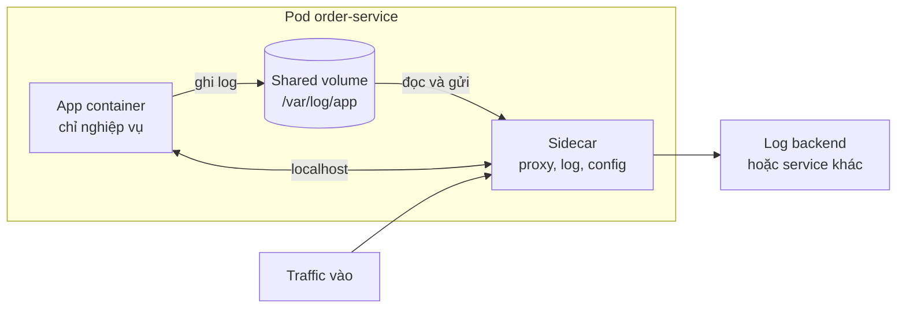
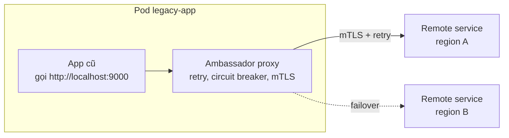
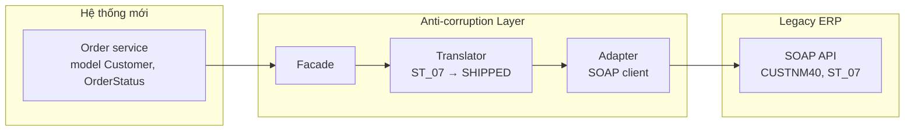
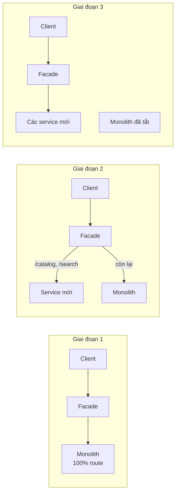

# Sidecar, Ambassador, Anti-corruption Layer & Strangler Fig

Bốn pattern trong bài chia làm hai cặp. **Sidecar** và **Ambassador** trả lời câu hỏi: *làm sao thêm chức năng hạ tầng (log, proxy, retry, mTLS) cho ứng dụng mà không sửa code ứng dụng?* — bằng cách chạy một tiến trình phụ đi kèm. **Anti-corruption Layer** và **Strangler Fig** trả lời câu hỏi: *làm sao sống chung và dần thay thế hệ thống cũ (legacy) mà không để nó "làm bẩn" thiết kế mới, và không phải viết lại một lần (big-bang rewrite)?*

**Tương tự đơn giản:** **Sidecar** là cái thùng gắn bên hông xe máy — đi cùng xe, chung hành trình, nhưng là bộ phận riêng có thể tháo lắp. **Strangler fig** (cây đa bóp cổ) là loài cây mọc bám quanh cây chủ, lớn dần cho tới khi thay thế hoàn toàn cây chủ — giống cách hệ thống mới mọc quanh hệ thống cũ.

---

:::note[Ghi nhớ nhanh]

- ⭐ **Sidecar = container/tiến trình phụ chạy cạnh app, chung vòng đời và tài nguyên** — gánh việc hạ tầng (log shipping, proxy, cấu hình), app không cần biết. Nền tảng của service mesh (Envoy trong Istio).
- **Ambassador = một dạng sidecar chuyên làm proxy chiều ra (outbound)** — thay app xử lý retry, circuit breaker, mTLS, routing khi gọi service bên ngoài.
- **Anti-corruption Layer (ACL) = lớp phiên dịch** giữa hệ thống mới và hệ thống cũ/bên ngoài — giữ domain model mới sạch, không bị lây khái niệm của legacy.
- ⭐ **Strangler Fig = thay hệ thống cũ từng phần** — đặt facade (proxy) phía trước, chuyển dần từng route sang hệ thống mới, cuối cùng tắt hệ thống cũ.
- Sidecar và Ambassador **thêm độ trễ một hop cục bộ và tốn tài nguyên** trên mỗi instance — đánh đổi lấy sự độc lập ngôn ngữ và tách trách nhiệm.

:::

---

## Mục lục

- [Vì sao cần bốn pattern này?](#vì-sao-cần-bốn-pattern-này)
- [1. Sidecar pattern](#1-sidecar-pattern)
- [2. Ambassador pattern](#2-ambassador-pattern)
- [3. Anti-corruption Layer pattern](#3-anti-corruption-layer-pattern)
- [4. Strangler Fig pattern](#4-strangler-fig-pattern)
- [5. So sánh nhanh](#5-so-sánh-nhanh)
- [Khi nào dùng?](#khi-nào-dùng)
- [Lỗi thường gặp](#lỗi-thường-gặp)
- [Câu hỏi phỏng vấn](#câu-hỏi-phỏng-vấn)

---

## Vì sao cần bốn pattern này?

**Vấn đề:**

- Công ty có service viết bằng Java, Go, Node, Python. Mỗi service cần mTLS, retry, metrics, tracing, log shipping. Viết thư viện cho từng ngôn ngữ → 4 bản cài đặt, lệch hành vi, nâng cấp phải deploy lại mọi service.
- Một ứng dụng legacy không sửa được code (mất source, vendor đóng) nhưng cần thêm TLS hoặc giám sát.
- Hệ thống mới phải đọc dữ liệu từ ERP 20 năm tuổi với mã trạng thái kiểu `ST_07`, trường tên `CUSTNM40` — nếu để các khái niệm này len vào code mới, thiết kế mới sẽ "bị nhiễm" legacy.
- Monolith khổng lồ cần thay thế, nhưng **big-bang rewrite** (viết lại toàn bộ rồi chuyển một lần) nổi tiếng là rủi ro: mất nhiều năm, nghiệp vụ không dừng chờ, ngày chuyển đổi dễ thảm hoạ.

**Giải pháp:** Sidecar/Ambassador tách chức năng hạ tầng ra tiến trình riêng, độc lập ngôn ngữ. ACL cô lập hệ thống cũ sau lớp phiên dịch. Strangler Fig thay hệ thống cũ **dần dần**, có thể quay lui từng bước.

:::tip[Dùng thực tế]

- **Istio, Linkerd**: service mesh chèn sidecar proxy (Envoy, linkerd2-proxy) vào mỗi pod Kubernetes để làm mTLS, retry, telemetry.
- **Fluent Bit / Fluentd** chạy dạng sidecar hoặc DaemonSet để thu log; **Dapr** cung cấp sidecar cho state, pub/sub, secret.
- **Martin Fowler** đặt tên Strangler Fig (2004); nhiều công ty chuyển từ monolith sang microservice theo cách này (một ví dụ hay được nhắc là Shopify tách dần các phần của monolith Rails).
- **Anti-corruption Layer** là khái niệm từ **Domain-Driven Design** (Eric Evans), dùng nhiều khi tích hợp core banking, ERP, hệ thống của đối tác.

:::

---

## 1. Sidecar pattern

### 1.1. Cơ chế

Triển khai một **thành phần phụ** trong **cùng đơn vị triển khai** với ứng dụng chính — trong Kubernetes là container thứ hai trong **cùng Pod**. Hai container chia sẻ network namespace (gọi nhau qua `localhost`), có thể chia sẻ volume, được tạo và huỷ cùng nhau.



```yaml
# Pod có app và sidecar Fluent Bit đọc log qua volume chung
apiVersion: v1
kind: Pod
metadata:
  name: order-service
spec:
  volumes:
    - name: app-logs
      emptyDir: {}
  containers:
    - name: app
      image: registry.example.com/order-service:1.4.2
      volumeMounts:
        - { name: app-logs, mountPath: /var/log/app }
    - name: log-shipper
      image: fluent/fluent-bit:3.0
      volumeMounts:
        - { name: app-logs, mountPath: /var/log/app, readOnly: true }
      resources:
        limits: { cpu: 100m, memory: 64Mi }
```

Từ Kubernetes 1.28 có **native sidecar** (init container với `restartPolicy: Always`) giúp sidecar khởi động trước và tắt sau app — giải quyết vấn đề thứ tự vòng đời trước đây.

### 1.2. Ứng dụng phổ biến

- **Service mesh proxy** (Envoy): mTLS, retry, load balancing, metrics cho traffic vào/ra.
- **Log/metrics agent**: thu log, export metrics.
- **Config/secret watcher**: theo dõi config store, ghi file cấu hình mới, báo app reload.
- **Adapter**: chuẩn hoá giao diện của app cũ (vd chuyển metrics định dạng riêng sang Prometheus).

### 1.3. Issues & considerations

- **Tài nguyên nhân lên theo số instance:** 1000 pod thì 1000 sidecar. Với proxy, mỗi sidecar có thể tốn vài chục MB RAM. Đây là lý do có xu hướng **sidecarless** (Istio ambient mode, eBPF).
- **Độ trễ:** thêm một hop qua localhost (thường dưới 1 ms, nhưng cộng dồn qua nhiều hop).
- **Giao tiếp app ↔ sidecar** nên dùng cơ chế độc lập ngôn ngữ (HTTP, gRPC, file, socket).
- **Vòng đời:** sidecar chưa sẵn sàng mà app đã gọi ra ngoài → lỗi lúc khởi động; Job chạy xong nhưng sidecar không tắt → Pod treo.
- **Khi nào không cần sidecar:** chức năng gắn chặt với logic app, cần hiệu năng cực cao giữa hai bên, hoặc ứng dụng nhỏ — dùng thư viện cho đơn giản.

---

## 2. Ambassador pattern

### 2.1. Cơ chế

**Ambassador** là sidecar đóng vai **"đại sứ"** cho app khi giao tiếp ra ngoài. App gọi `localhost`, ambassador lo phần còn lại: tìm địa chỉ, retry, timeout, circuit breaker, mTLS, metrics.



```yaml
# Envoy làm ambassador: app gọi localhost:9000, Envoy gọi payment-api qua TLS kèm retry
static_resources:
  listeners:
    - name: outbound
      address: { socket_address: { address: 127.0.0.1, port_value: 9000 } }
      filter_chains:
        - filters:
            - name: envoy.filters.network.http_connection_manager
              typed_config:
                "@type": type.googleapis.com/envoy.extensions.filters.network.http_connection_manager.v3.HttpConnectionManager
                stat_prefix: outbound
                route_config:
                  virtual_hosts:
                    - name: payment
                      domains: ["*"]
                      routes:
                        - match: { prefix: "/" }
                          route:
                            cluster: payment_api
                            timeout: 2s
                            retry_policy: { retry_on: "5xx,connect-failure", num_retries: 2 }
                http_filters:
                  - name: envoy.filters.http.router
                    typed_config:
                      "@type": type.googleapis.com/envoy.extensions.filters.http.router.v3.Router
```

### 2.2. Sidecar vs Ambassador

| | Sidecar (tổng quát) | Ambassador |
| --- | --- | --- |
| Hướng | Bất kỳ (log, config, proxy vào/ra) | Chủ yếu **outbound** (app gọi ra) |
| Vai trò | Bổ sung chức năng phụ | Proxy đại diện cho app khi gọi dịch vụ ngoài |
| Ví dụ | Fluent Bit, config watcher | Envoy outbound, proxy DB có pool kết nối |

Ambassador là **một trường hợp đặc biệt của sidecar**. Trong service mesh, cùng một proxy Envoy vừa làm inbound vừa làm ambassador outbound.

### 2.3. Issues & considerations

- **Retry phải idempotent:** ambassador retry `POST /payments` có thể trừ tiền hai lần nếu API không có idempotency key.
- **Ẩn lỗi:** app không thấy retry → khó debug; cần metrics/tracing của ambassador.
- **Độ trễ thêm** — không phù hợp nếu yêu cầu độ trễ cực thấp.
- **Hợp nhất cấu hình:** khi nhiều team dùng chung ambassador, nên quản lý cấu hình tập trung (control plane của mesh).
- **Hữu ích nhất với legacy** không sửa được code, hoặc fleet đa ngôn ngữ.

---

## 3. Anti-corruption Layer pattern

### 3.1. Cơ chế

Đặt một **lớp phiên dịch** (façade + adapter + translator) giữa **bounded context mới** và hệ thống cũ/bên ngoài. Lớp này:

- Chuyển **request** của hệ thống mới sang giao thức, định dạng của hệ thống cũ (SOAP, file CSV, mã trạng thái kỳ quặc).
- Chuyển **response** ngược lại thành **model sạch** của domain mới.
- Là nơi **duy nhất** biết về chi tiết legacy.



```ts
// Model sạch của domain mới
export type OrderStatus = 'PENDING' | 'PAID' | 'SHIPPED' | 'CANCELLED';
export interface Customer { readonly id: string; readonly fullName: string; readonly email: string }

// DTO thô của ERP: chỉ tồn tại trong ACL, không lọt ra ngoài
interface ErpCustomerRecord { CUSTNO: string; CUSTNM40: string; EMAILADR: string | null }

const ERP_STATUS: Readonly<Record<string, OrderStatus>> = {
  ST_01: 'PENDING', ST_04: 'PAID', ST_07: 'SHIPPED', ST_99: 'CANCELLED',
};

export function translateStatus(code: string): OrderStatus {
  const status = ERP_STATUS[code];
  if (!status) throw new Error(`Mã trạng thái ERP không xác định: ${code}`);
  return status;
}

export function translateCustomer(r: ErpCustomerRecord): Customer {
  return { id: r.CUSTNO.trim(), fullName: r.CUSTNM40.trim(), email: r.EMAILADR ?? '' };
}

// Facade: hệ thống mới chỉ thấy interface này
export class ErpCustomerGateway {
  constructor(private readonly soap: ErpSoapClient) {}

  async findCustomer(id: string): Promise<Customer> {
    const raw = await this.soap.call<ErpCustomerRecord>('GETCUST', { CUSTNO: id.padStart(10, '0') });
    return translateCustomer(raw);
  }
}
```

### 3.2. Issues & considerations

- **Thêm độ trễ và một thành phần cần vận hành/scale** (nếu ACL là service riêng).
- **Có thể thành điểm nghẽn** khi mọi tích hợp đi qua → scale ngang, giám sát.
- **Nhất quán dữ liệu** giữa hai hệ thống khi ghi hai phía.
- **Xác định vòng đời:** ACL vĩnh viễn (tích hợp đối tác) hay tạm thời (tắt khi legacy bị thay hết)?
- ACL có thể là **module trong code** (lớp adapter) hoặc **service riêng** — chọn theo quy mô.

---

## 4. Strangler Fig pattern

### 4.1. Cơ chế

1. **Đặt facade** (reverse proxy / API gateway) trước hệ thống cũ — ban đầu mọi traffic vẫn đi vào legacy.
2. **Chọn một phần** (một route, một tính năng, một bounded context) để xây mới.
3. **Chuyển route** đó sang hệ thống mới tại facade. Có thể chuyển dần theo tỷ lệ traffic.
4. **Lặp lại** cho đến khi legacy không còn nhận traffic.
5. **Tắt legacy** và (tuỳ chọn) gỡ facade.



```nginx
# Facade: chuyển dần route sang hệ thống mới
upstream legacy  { server monolith:8080; }
upstream catalog { server catalog-svc:8080; }

# Chia 10% traffic /orders sang service mới để canary
split_clients "${remote_addr}${request_id}" $orders_backend {
  10%  orders_new;
  *    legacy;
}
upstream orders_new { server orders-svc:8080; }

server {
  listen 80;
  location /catalog/ { proxy_pass http://catalog; }          # đã chuyển hẳn
  location /orders/  { proxy_pass http://$orders_backend; }  # đang chuyển dần
  location /         { proxy_pass http://legacy; }           # mặc định: legacy
}
```

### 4.2. Issues & considerations

- **Dữ liệu dùng chung là phần khó nhất:** service mới và monolith có thể phải dùng chung DB một thời gian, hoặc đồng bộ qua CDC/event. Lên kế hoạch tách dữ liệu ngay từ đầu.
- **Chọn phần tách trước:** ưu tiên phần ít phụ thuộc, giá trị cao, hoặc phần đang đổi nhiều (để tránh sửa code cũ).
- **Facade không được thành điểm lỗi đơn / nút cổ chai.**
- **Rollback dễ:** chuyển route ngược lại legacy nếu service mới lỗi — đây là ưu điểm lớn so với big-bang.
- **Đừng để dở dang mãi:** nhiều dự án dừng ở 70%, phải vận hành cả hai hệ thống vĩnh viễn → chi phí cao hơn ban đầu.
- **Kết hợp ACL:** service mới gọi ngược legacy qua ACL để không nhiễm model cũ.
- **Không phù hợp** khi hệ thống nhỏ (viết lại nhanh hơn) hoặc không chặn được request ở một facade (vd client kết nối DB trực tiếp).

---

## 5. So sánh nhanh

| Pattern | Giải quyết | Vị trí | Vòng đời |
| --- | --- | --- | --- |
| **Sidecar** | Thêm chức năng hạ tầng không sửa app | Cạnh từng instance | Lâu dài |
| **Ambassador** | Proxy gọi ra ngoài (retry, mTLS) | Cạnh từng instance | Lâu dài |
| **Anti-corruption Layer** | Cô lập model legacy/bên ngoài | Giữa hai bounded context | Lâu dài hoặc tới khi legacy tắt |
| **Strangler Fig** | Thay thế legacy dần dần | Facade trước toàn hệ thống | Tạm thời, kết thúc khi chuyển xong |

---

## Khi nào dùng?

| Pattern | Nên dùng | Không nên dùng |
| --- | --- | --- |
| **Sidecar** | Fleet đa ngôn ngữ; chức năng hạ tầng dùng chung; app không sửa được | App nhỏ, ít instance; cần giao tiếp hiệu năng cực cao giữa app và chức năng phụ |
| **Ambassador** | App legacy cần retry/mTLS/circuit breaker; chuẩn hoá cách gọi ra ngoài | Độ trễ là ưu tiên số 1; đã có service mesh làm việc này |
| **ACL** | Tích hợp legacy/đối tác có model khác biệt; hệ thống mới theo DDD | Hai hệ thống có model tương đồng; chi phí dịch không đáng |
| **Strangler Fig** | Monolith lớn đang chạy production, cần thay dần, giảm rủi ro | Hệ thống nhỏ; không chặn được request đi vào legacy |

---

## Lỗi thường gặp

### Lỗi 1: Sidecar không có giới hạn tài nguyên

Sidecar log ăn hết CPU khi log tăng đột biến, làm app chết đói. **Sửa:** đặt `resources.limits` cho sidecar, giám sát riêng.

### Lỗi 2: Retry ở cả app, ambassador và gateway

Mỗi tầng retry 3 lần → một lỗi thành 27 request (retry storm). **Sửa:** retry ở **một** tầng, có budget và backoff.

### Lỗi 3: ACL "rò rỉ" model cũ

Trả nguyên DTO của ERP ra ngoài "cho nhanh" → code mới bắt đầu dùng `CUSTNM40`. **Sửa:** ACL chỉ xuất model domain mới; DTO legacy là private.

### Lỗi 4: Strangler mà vẫn thêm tính năng vào monolith

Đang chuyển nhưng team khác tiếp tục build tính năng mới trong monolith → không bao giờ xong. **Sửa:** quy tắc "tính năng mới chỉ xây ở hệ thống mới".

### Lỗi 5: Bỏ qua tách dữ liệu khi strangle

Service mới vẫn đọc/ghi bảng của monolith mãi mãi → coupling qua DB, không deploy độc lập được. **Sửa:** kế hoạch tách dữ liệu (CDC, sync, rồi chuyển ownership) cho từng phần.

---

## Câu hỏi phỏng vấn

Những câu thường gặp về chủ đề này. Tự trả lời trước, rồi bấm **Xem đáp án** để đối chiếu.

**1. Sidecar pattern là gì? Ưu nhược điểm?**

<details className="qa">
<summary>Xem đáp án</summary>

Thành phần phụ chạy cùng đơn vị triển khai với app (cùng Pod), chia sẻ network/volume, cùng vòng đời. Ưu: độc lập ngôn ngữ, tách trách nhiệm, nâng cấp hạ tầng không cần sửa app, dùng được cho legacy. Nhược: tốn tài nguyên trên mỗi instance, thêm độ trễ, phức tạp vòng đời (thứ tự khởi động/tắt), khó debug hơn.

</details>

**2. Ambassador khác Sidecar thế nào?**

<details className="qa">
<summary>Xem đáp án</summary>

Ambassador là một dạng sidecar chuyên làm **proxy outbound**: app gọi localhost, ambassador lo service discovery, retry, timeout, circuit breaker, mTLS khi gọi ra ngoài. Sidecar là khái niệm rộng hơn, gồm cả log agent, config watcher, proxy inbound.

</details>

**3. Anti-corruption Layer dùng để làm gì? Đặt ở đâu?**

<details className="qa">
<summary>Xem đáp án</summary>

Lớp phiên dịch giữa bounded context mới và hệ thống cũ/bên ngoài, chuyển đổi giao thức và model hai chiều, giữ domain mới không bị lây khái niệm legacy. Có thể là module adapter trong service hoặc service riêng đứng giữa. Là nơi duy nhất biết chi tiết legacy.

</details>

**4. Bạn sẽ chuyển một monolith sang microservice thế nào?**

<details className="qa">
<summary>Xem đáp án</summary>

Dùng Strangler Fig: đặt facade trước monolith; xác định bounded context; chọn phần ít phụ thuộc/giá trị cao để tách trước; xây service mới, gọi ngược monolith qua ACL khi cần; chuyển route dần (canary theo tỷ lệ), giám sát, sẵn sàng rollback; tách dữ liệu bằng CDC/sync rồi chuyển ownership; tính năng mới chỉ làm ở hệ thống mới; lặp tới khi tắt monolith.

</details>

**5. Vì sao service mesh đang hướng tới "sidecarless"?**

<details className="qa">
<summary>Xem đáp án</summary>

Sidecar proxy ở mỗi pod tốn RAM/CPU nhân theo số pod, thêm độ trễ, phức tạp khi nâng cấp (phải restart pod để đổi phiên bản proxy). Các hướng như Istio ambient mode (proxy theo node cho L4, waypoint proxy cho L7) hoặc eBPF giảm chi phí đó, đổi lại cô lập kém hơn ở mức pod.

</details>
