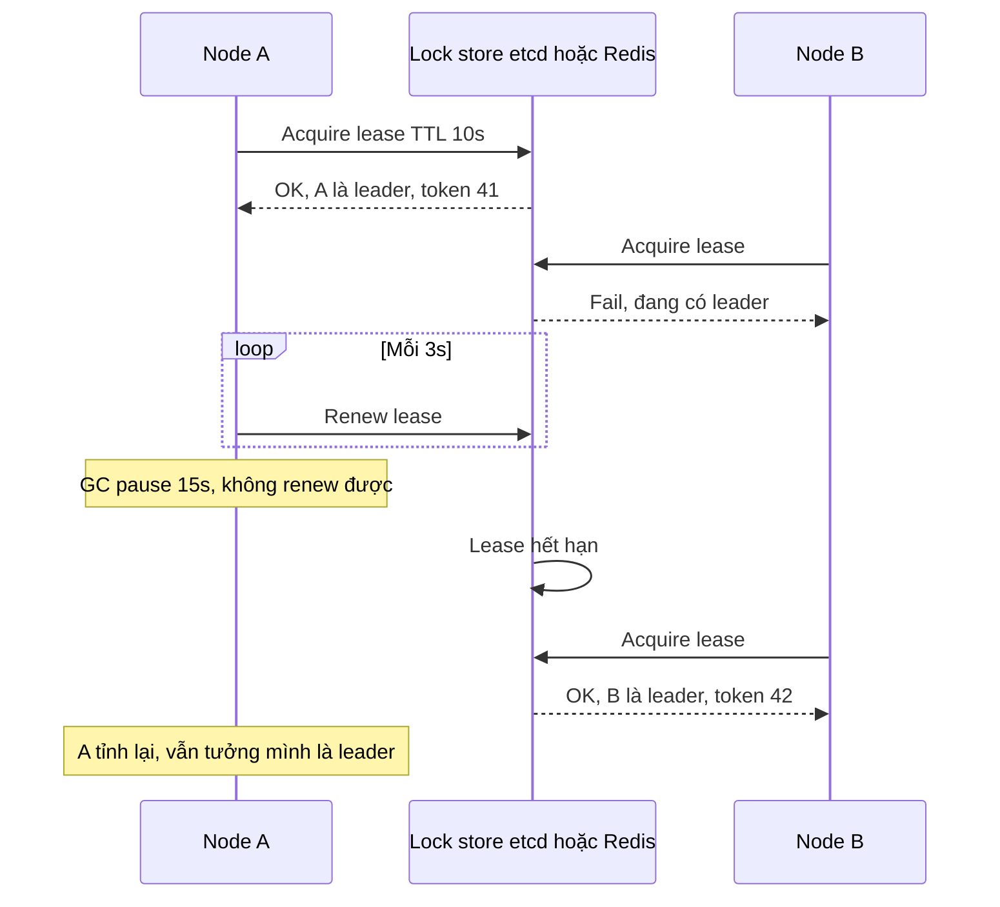
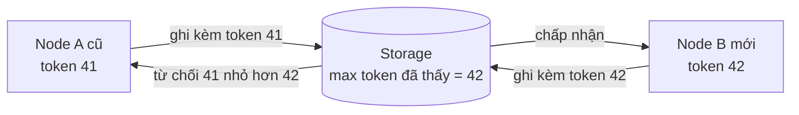
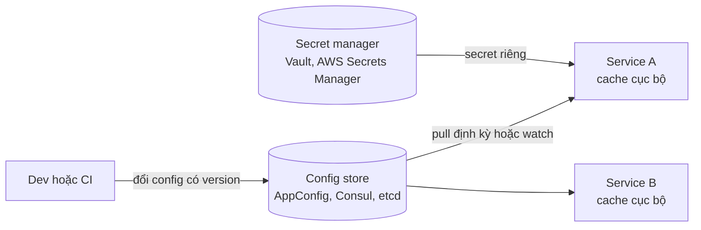
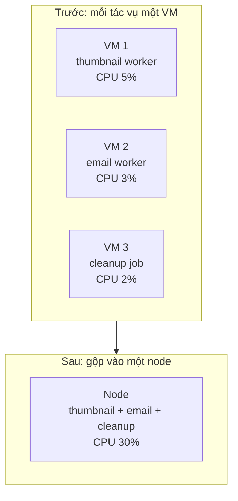

# Leader Election, External Config Store, Compute Resource Consolidation

Bài này gom ba pattern về **điều phối và vận hành** trong nhóm Design and Implementation. **Leader Election** chọn ra **đúng một** instance làm "trưởng" để điều phối công việc mà chỉ được làm một lần (cron job, phân chia partition). **External Configuration Store** đưa cấu hình ra khỏi gói deploy, vào một kho tập trung để đổi cấu hình không cần build lại. **Compute Resource Consolidation** gộp nhiều tác vụ nhỏ vào chung một đơn vị tính toán để tận dụng tài nguyên và giảm chi phí.

**Tương tự đơn giản:** Một nhóm 5 người đi du lịch cần **một trưởng nhóm** cầm tiền quỹ — nếu hai người cùng nghĩ mình là trưởng nhóm và cùng trả tiền khách sạn thì mất gấp đôi. Đó là lý do cần leader election, và cần cơ chế đảm bảo "trưởng nhóm cũ" (đã bị thay vì mất liên lạc) không được tiêu tiền nữa — đó là **fencing token**.

---

:::note[Ghi nhớ nhanh]

- ⭐ **Leader election dựa trên lease (hợp đồng thuê có hạn):** leader phải **gia hạn** lease định kỳ; ngừng gia hạn (chết, mất mạng, GC pause) thì lease hết hạn và node khác lên thay.
- ⭐ **Lease thôi chưa đủ an toàn — cần fencing token:** số tăng dần cấp mỗi lần có leader mới; tài nguyên từ chối mọi thao tác mang token cũ hơn token đã thấy.
- **Công cụ:** etcd/ZooKeeper/Consul (đồng thuận Raft/ZAB, đáng tin cho tính đúng), Kubernetes Lease, Redis `SET NX PX` (đơn giản, phù hợp khi chỉ cần hiệu quả chứ không cần đúng tuyệt đối).
- **External Config Store:** cấu hình (không phải secret) ở kho tập trung có version, cache cục bộ, hỗ trợ reload; secret để ở secret manager.
- **Compute Resource Consolidation:** gộp tác vụ có đặc tính tài nguyên, vòng đời, mức bảo mật tương đồng; tránh gộp thứ có scale/độ tin cậy khác nhau.

:::

---

## Mục lục

- [Vì sao cần ba pattern này?](#vì-sao-cần-ba-pattern-này)
- [1. Leader Election](#1-leader-election)
- [2. External Configuration Store](#2-external-configuration-store)
- [3. Compute Resource Consolidation](#3-compute-resource-consolidation)
- [4. Các pattern khác cùng nhóm](#4-các-pattern-khác-cùng-nhóm)
- [Khi nào dùng?](#khi-nào-dùng)
- [Lỗi thường gặp](#lỗi-thường-gặp)
- [Câu hỏi phỏng vấn](#câu-hỏi-phỏng-vấn)

---

## Vì sao cần ba pattern này?

**Vấn đề:**

- Service chạy 5 replica để chịu tải, nhưng có cron "gửi email nhắc thanh toán lúc 8h" — chạy trên cả 5 replica thì khách nhận 5 email.
- Cấu hình (URL dịch vụ, feature flag, giới hạn rate) nằm trong file `config.json` đóng gói theo image — đổi một giá trị phải build và deploy lại 30 service.
- Hàng chục worker nhỏ, mỗi cái một VM/container riêng dùng 3% CPU — tiền hạ tầng phần lớn trả cho tài nguyên nhàn rỗi.

**Giải pháp:** Leader Election đảm bảo việc đơn lẻ chỉ một instance làm. External Config Store tách cấu hình khỏi artifact. Compute Resource Consolidation gộp tác vụ để tăng mật độ sử dụng.

:::tip[Dùng thực tế]

- **Kubernetes** controller-manager và scheduler chạy nhiều bản nhưng chỉ một bản active, bầu chọn qua đối tượng **Lease** trong API server (dựa trên etcd).
- **Apache Kafka** (KRaft) và **etcd** dùng **Raft** để bầu leader; các phiên bản Kafka cũ dùng **ZooKeeper** cho controller election.
- **External config:** AWS AppConfig / Systems Manager Parameter Store, Azure App Configuration, Spring Cloud Config, Consul KV, etcd; feature flag như LaunchDarkly, Unleash.
- **Consolidation:** Kubernetes bin-packing nhiều pod trên một node; AWS Lambda/Azure Functions gom nhiều function vào một app; chạy nhiều consumer nhẹ trong một process.

:::

---

## 1. Leader Election

### 1.1. Khi nào cần leader?

- Tác vụ **chỉ được làm một lần**: cron, gửi báo cáo, dọn dẹp dữ liệu.
- **Điều phối**: phân chia partition/shard cho worker, gán job.
- **Ghi vào tài nguyên không chịu được ghi đồng thời**: file, hệ thống bên ngoài không có transaction.
- **Replication**: leader nhận ghi, follower sao chép (Raft, Kafka partition leader).

### 1.2. Cơ chế lease



Các tham số điển hình:

| Tham số | Ý nghĩa | Gợi ý |
| --- | --- | --- |
| **Lease TTL** | Thời gian lease hợp lệ nếu không gia hạn | 10–30 s |
| **Renew interval** | Chu kỳ gia hạn | khoảng 1/3 TTL |
| **Retry acquire** | Chu kỳ node khác thử giành lease | 1–5 s |

TTL ngắn → failover nhanh nhưng dễ "đổi leader" sai do mạng chập chờn. TTL dài → ít dao động nhưng thời gian không có leader dài hơn khi leader chết.

### 1.3. Vấn đề "hai leader" và fencing token

Lease chỉ đảm bảo **store** nghĩ có một leader. Nhưng node A có thể bị **GC pause**, treo máy ảo, hoặc mạng chậm — khi tỉnh dậy nó **vẫn tin mình là leader** và tiếp tục ghi, trong khi B đã lên làm leader. Kiểm tra "lease còn hạn không?" ngay trước khi ghi cũng không đủ, vì pause có thể xảy ra **giữa** lúc kiểm tra và lúc ghi.

**Fencing token** (Martin Kleppmann mô tả trong bài phân tích Redlock): mỗi lần cấp lease, store trả về một **số tăng đơn điệu**. Leader gửi token kèm mọi thao tác ghi; **tài nguyên đích** ghi nhớ token lớn nhất đã thấy và **từ chối** token nhỏ hơn.



```sql
-- Tài nguyên đích tự kiểm tra fencing token (ví dụ bảng job_state)
UPDATE job_state
SET    payload = $1, fencing_token = $2
WHERE  job_id = $3
  AND  fencing_token <= $2;   -- token cũ hơn sẽ không cập nhật được dòng nào
```

Với etcd, **revision** của key lease có thể dùng làm fencing token; với ZooKeeper, **zxid** hoặc số thứ tự của znode tuần tự.

### 1.4. Các cách triển khai

| Công cụ | Cơ chế | Đảm bảo | Ghi chú |
| --- | --- | --- | --- |
| **etcd** | Raft + lease + revision | Mạnh (CP) | Có API `election` sẵn; Kubernetes dùng etcd |
| **ZooKeeper** | ZAB + ephemeral sequential znode | Mạnh (CP) | Node nhỏ nhất là leader; công thức trong Apache Curator |
| **Consul** | Raft + session | Mạnh | Lock qua KV + session |
| **Kubernetes Lease** | Đối tượng Lease trong API server | Dựa trên etcd | `client-go/leaderelection` |
| **Redis `SET NX PX`** | Key có TTL | Yếu (một node, failover có thể mất lock) | Đủ cho "tránh làm trùng cho hiệu quả" |
| **Database** | Row lock / advisory lock | Theo DB | PostgreSQL `pg_try_advisory_lock` |

Ví dụ Redis cho trường hợp "chỉ cần tránh chạy trùng cron, chạy trùng hiếm khi cũng chịu được":

```ts
import { randomUUID } from 'node:crypto';
import type Redis from 'ioredis';

const LEASE_MS = 15_000;
const RENEW_MS = 5_000;
const KEY = 'leader:report-cron';

// Chỉ gia hạn/xoá nếu lease vẫn là của mình (so sánh owner id, nguyên tử bằng Lua)
const RENEW_LUA = `
if redis.call('GET', KEYS[1]) == ARGV[1] then
  return redis.call('PEXPIRE', KEYS[1], ARGV[2])
end
return 0`;

export function startLeaderLoop(redis: Redis, onElected: () => void, onRevoked: () => void) {
  const me = randomUUID();
  let isLeader = false;

  const tick = async () => {
    try {
      if (isLeader) {
        const ok = await redis.eval(RENEW_LUA, 1, KEY, me, LEASE_MS);
        if (ok !== 1) { isLeader = false; onRevoked(); }
      } else {
        const res = await redis.set(KEY, me, 'PX', LEASE_MS, 'NX');
        if (res === 'OK') { isLeader = true; onElected(); }
      }
    } catch (err) {
      // Mất kết nối store: tự hạ cấp cho an toàn, không giả định mình còn là leader
      if (isLeader) { isLeader = false; onRevoked(); }
    }
  };

  const timer = setInterval(tick, RENEW_MS);
  void tick();
  return () => clearInterval(timer);
}
```

Với tác vụ mà chạy trùng gây hậu quả nghiêm trọng (trừ tiền, ghi dữ liệu không idempotent), dùng etcd/ZooKeeper **kèm fencing token**, hoặc tốt hơn: thiết kế tác vụ **idempotent** để chạy trùng không gây hại.

### 1.5. Issues & considerations

- **Leader là điểm nghẽn / điểm lỗi tạm thời:** trong lúc bầu lại không có leader → tác vụ trễ.
- **Split brain:** mạng phân mảnh khiến hai phía đều có leader nếu không dùng quorum (đa số). Thuật toán đồng thuận chỉ cho phía có đa số bầu leader.
- **Clock:** lease dựa trên thời gian; đồng hồ lệch hoặc pause làm lease "hết hạn" ở store nhưng leader chưa biết.
- **Leader phải tự kiểm tra trạng thái** thường xuyên và dừng việc ngay khi mất lease.
- **Có thể tránh leader election** bằng thiết kế khác: job queue (mỗi job chỉ một consumer nhận), partition cố định cho từng worker, hoặc dùng scheduler tập trung (Kubernetes CronJob với `concurrencyPolicy: Forbid`).

---

## 2. External Configuration Store

### 2.1. Vấn đề và giải pháp

Cấu hình đóng gói trong artifact → đổi phải deploy lại; nhiều service dùng chung cấu hình bị lặp và lệch; không có lịch sử ai đổi gì. **Giải pháp:** chuyển cấu hình vào **kho tập trung bên ngoài**, ứng dụng đọc lúc khởi động và theo dõi thay đổi.



### 2.2. Thiết kế

- **Phân tầng:** mặc định trong code → file môi trường → config store → override theo instance.
- **Cache cục bộ + last-known-good:** store chết thì ứng dụng tiếp tục với cấu hình cuối cùng hợp lệ, không sập.
- **Validate trước khi áp dụng:** cấu hình sai (vd timeout âm) phải bị từ chối, không làm sập cả fleet cùng lúc.
- **Version và rollout dần:** áp cấu hình mới cho một phần instance trước (AWS AppConfig có deployment strategy dạng này).
- **Secret tách riêng:** mật khẩu, API key để ở secret manager có mã hoá, kiểm soát truy cập và audit.

```ts
import { z } from 'zod';

const ConfigSchema = z.object({
  paymentTimeoutMs: z.number().int().min(100).max(30_000),
  newCheckoutEnabled: z.boolean(),
  maxItemsPerOrder: z.number().int().positive(),
});
type AppConfig = z.infer<typeof ConfigSchema>;

const DEFAULTS: AppConfig = { paymentTimeoutMs: 3000, newCheckoutEnabled: false, maxItemsPerOrder: 50 };
let current: AppConfig = DEFAULTS;

export const getConfig = (): AppConfig => current;

// Pull định kỳ; cấu hình sai hoặc store lỗi -> giữ bản cuối cùng hợp lệ
export async function refreshConfig(fetchRaw: () => Promise<unknown>): Promise<void> {
  try {
    const parsed = ConfigSchema.safeParse(await fetchRaw());
    if (!parsed.success) {
      logger.error({ issues: parsed.error.issues }, 'Config mới không hợp lệ, giữ bản cũ');
      return;
    }
    current = parsed.data; // thay cả object, không sửa từng field
  } catch (err) {
    logger.warn({ err }, 'Không đọc được config store, dùng last-known-good');
  }
}
```

### 2.3. Issues & considerations

- **Config store là phụ thuộc quan trọng:** cần HA; ứng dụng phải khởi động được khi store chết (dùng cache/bản đóng gói).
- **Đổi cấu hình là đổi production:** cần review, audit, rollback như deploy code. Nhiều sự cố lớn trong ngành bắt nguồn từ một thay đổi cấu hình lan ra toàn cầu cùng lúc.
- **Định dạng và schema:** thống nhất kiểu dữ liệu, có validation.
- **Bảo mật:** phân quyền ai được đọc/ghi namespace nào.
- **Không lạm dụng:** cấu hình gắn chặt với code (thay đổi phải cùng code mới) thì để cùng code.

---

## 3. Compute Resource Consolidation

### 3.1. Ý tưởng

Thay vì mỗi tác vụ nhỏ chạy trên một đơn vị tính toán riêng (VM, container, app service), **gộp nhiều tác vụ vào chung một đơn vị** để tăng mức sử dụng tài nguyên, giảm chi phí và chi phí quản lý.



Các mức gộp:

- **Nhiều container trên một node** (Kubernetes bin-packing qua `requests`/`limits`).
- **Nhiều tác vụ trong một process** (một worker Node.js chạy nhiều consumer queue nhẹ).
- **Nhiều function trong một Function App / App Service plan.**

### 3.2. Tiêu chí gộp

| Nên gộp chung | Không nên gộp chung |
| --- | --- |
| Đặc tính tài nguyên bổ sung nhau (một cái nặng CPU, một cái nặng I/O) | Cùng tranh một tài nguyên khan hiếm |
| Vòng đời, nhịp deploy tương tự | Một cái deploy 10 lần/ngày, một cái hiếm khi đổi |
| Cùng mức bảo mật, cùng team sở hữu | Khác ranh giới bảo mật / tenant |
| Yêu cầu scale giống nhau | Một cái cần scale 50 instance, cái kia chỉ 1 |
| Cùng mức độ quan trọng | Tác vụ critical gộp với tác vụ thử nghiệm dễ crash |

### 3.3. Issues & considerations

- **Fault isolation giảm:** một tác vụ rò bộ nhớ làm chết cả process/node → dùng giới hạn tài nguyên, process riêng trong cùng container nếu cần.
- **Scale chung:** scale tác vụ A kéo theo scale cả B dù không cần.
- **Deploy chung:** sửa B phải deploy lại cả A.
- **Noisy neighbor:** tác vụ ồn ào chiếm tài nguyên của tác vụ khác → đặt `requests`/`limits`, priority class.
- Đây là đánh đổi **ngược chiều microservice**: tách để độc lập, gộp để tiết kiệm. Cân bằng theo dữ liệu sử dụng thực tế.

---

## 4. Các pattern khác cùng nhóm

Nhóm Design and Implementation trên roadmap còn hai pattern đã có bài riêng trong topic này:

- **Pipes and Filters** — chia xử lý phức tạp thành chuỗi bước độc lập nối qua hàng đợi; xem bài số 31.
- **CQRS** — tách mô hình ghi và mô hình đọc; xem bài số 34 (Event Sourcing và CQRS).

Cùng với Gateway Routing/Offloading/Aggregation, BFF (bài 36), Sidecar, Ambassador, Anti-corruption Layer, Strangler Fig (bài 37) và ba pattern trong bài này, nhóm Design and Implementation trên roadmap được phủ đủ.

---

## Khi nào dùng?

| Pattern | Nên dùng | Không nên dùng |
| --- | --- | --- |
| **Leader Election** | Tác vụ chỉ được chạy một lần trong cụm nhiều replica; điều phối partition | Có thể thiết kế tác vụ idempotent hoặc dùng queue; chỉ có một instance |
| **External Config Store** | Nhiều service/môi trường; cần đổi cấu hình không deploy; feature flag | App nhỏ, một môi trường; cấu hình gắn chặt phiên bản code |
| **Compute Resource Consolidation** | Nhiều tác vụ nhỏ dùng ít tài nguyên; muốn giảm chi phí | Tác vụ cần cô lập lỗi/bảo mật; yêu cầu scale khác nhau |

---

## Lỗi thường gặp

### Lỗi 1: Dùng lock Redis như thể đảm bảo tuyệt đối

Tin rằng `SET NX` + TTL ngăn được mọi trường hợp chạy trùng, trong khi GC pause hoặc failover Redis có thể tạo hai leader. **Sửa:** fencing token hoặc tác vụ idempotent; với yêu cầu đúng tuyệt đối dùng etcd/ZooKeeper.

### Lỗi 2: Xoá lock của người khác

Leader cũ tỉnh dậy, chạy `DEL leader-key` → xoá lease của leader mới. **Sửa:** kiểm tra owner id trước khi xoá/gia hạn (Lua script nguyên tử).

### Lỗi 3: Config store sập kéo cả hệ thống sập

Ứng dụng không khởi động được nếu không đọc được config. **Sửa:** cache cục bộ, last-known-good, bản mặc định đóng gói.

### Lỗi 4: Đẩy cấu hình mới cho toàn fleet cùng lúc

Một giá trị sai làm sập tất cả. **Sửa:** validate schema, rollout từng phần, tự động rollback khi lỗi tăng.

### Lỗi 5: Gộp tác vụ critical với tác vụ không ổn định

Job thử nghiệm rò bộ nhớ làm chết worker thanh toán chung process. **Sửa:** tách theo mức độ quan trọng, đặt giới hạn tài nguyên.

---

## Câu hỏi phỏng vấn

Những câu thường gặp về chủ đề này. Tự trả lời trước, rồi bấm **Xem đáp án** để đối chiếu.

**1. Thiết kế cron job chỉ chạy một lần trong cụm 10 instance?**

<details className="qa">
<summary>Xem đáp án</summary>

Lựa chọn: (1) Leader election qua etcd/Kubernetes Lease/Redis, chỉ leader chạy cron; (2) đơn giản hơn: scheduler tập trung (Kubernetes CronJob `concurrencyPolicy: Forbid`) đẩy job vào queue, một worker nhận; (3) lock theo từng lần chạy (`job:2026-10-01T08:00`) bằng `SET NX` hoặc bảng DB có unique constraint. Kèm theo: tác vụ idempotent để chạy trùng không gây hại.

</details>

**2. Fencing token là gì, vì sao lease thôi chưa đủ?**

<details className="qa">
<summary>Xem đáp án</summary>

Lease có thể hết hạn mà leader cũ không biết (GC pause, mạng chậm), leader cũ tiếp tục ghi trong khi leader mới đã lên → hai bên cùng ghi. Fencing token là số tăng đơn điệu cấp mỗi lần có leader mới; mọi thao tác ghi kèm token, tài nguyên đích từ chối token nhỏ hơn token lớn nhất đã thấy. Điều kiện: tài nguyên đích phải hỗ trợ kiểm tra token.

</details>

**3. So sánh Redis lock và etcd/ZooKeeper cho leader election.**

<details className="qa">
<summary>Xem đáp án</summary>

Redis `SET NX PX`: nhanh, dễ dùng, nhưng một node hoặc replication bất đồng bộ có thể mất lock khi failover; không có fencing token sẵn → phù hợp khi chỉ cần tránh trùng cho hiệu quả. etcd/ZooKeeper: đồng thuận Raft/ZAB theo quorum, nhất quán mạnh, có revision/zxid làm fencing token, có watch để biết leader thay đổi → phù hợp khi tính đúng quan trọng; đổi lại vận hành phức tạp hơn và chậm hơn.

</details>

**4. External Config Store khác Secret Manager thế nào?**

<details className="qa">
<summary>Xem đáp án</summary>

Config store cho cấu hình không nhạy cảm (timeout, URL, feature flag), ưu tiên version, rollout, reload nhanh. Secret manager cho thông tin nhạy cảm (mật khẩu, key), có mã hoá khi lưu, kiểm soát truy cập chi tiết, audit, xoay vòng (rotation) tự động. Nhiều hệ thống để config tham chiếu tới secret thay vì chứa giá trị secret.

</details>

**5. Khi nào nên gộp nhiều tác vụ vào chung một đơn vị tính toán?**

<details className="qa">
<summary>Xem đáp án</summary>

Khi các tác vụ nhỏ, dùng ít tài nguyên, đặc tính tài nguyên bổ sung nhau, vòng đời/deploy/scale tương tự, cùng ranh giới bảo mật và mức độ quan trọng. Không gộp khi cần cô lập lỗi, bảo mật, hoặc yêu cầu scale khác nhau. Đặt giới hạn tài nguyên để tránh noisy neighbor.

</details>
