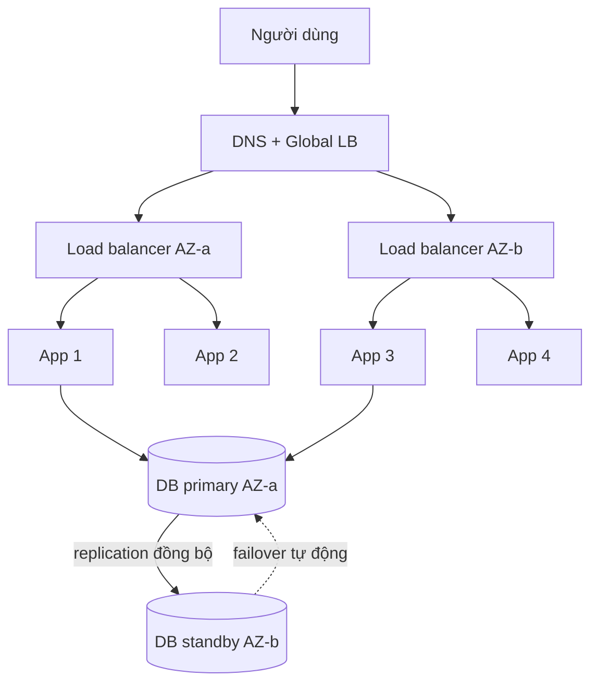
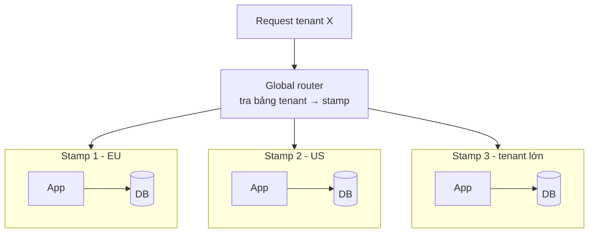
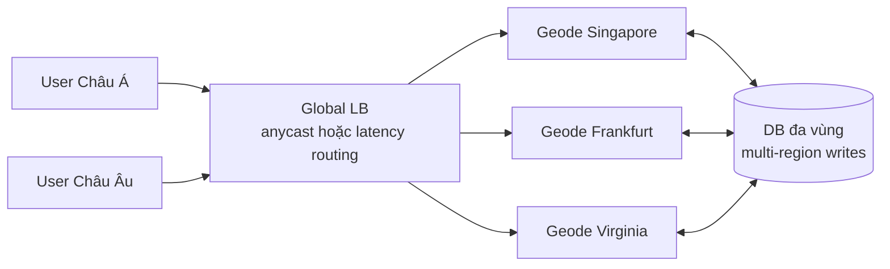
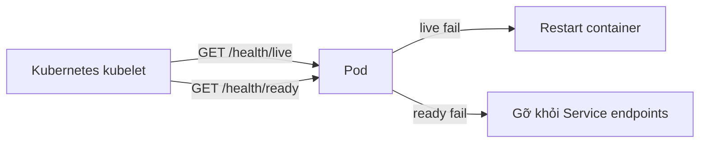
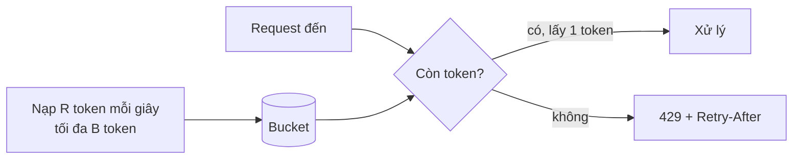
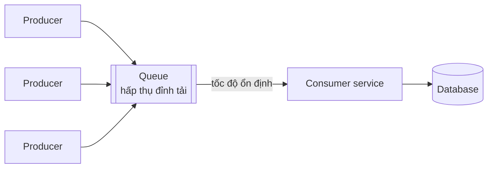

# Reliability: Availability & High Availability

**Reliability Patterns** là nhóm pattern trong Azure Cloud Design Patterns giúp hệ thống **tiếp tục phục vụ đúng** khi có sự cố. Nhóm này chia thành ba mảng: **Availability** (hệ thống có mặt và phản hồi), **Resiliency** (chịu lỗi và phục hồi — bài 40) và **Security** (bài 41). Bài này tập trung vào mảng availability: các khái niệm **Availability** và **High Availability**, cùng các pattern **Deployment Stamps**, **Geodes**, **Health Endpoint Monitoring**, **Throttling** và **Queue-Based Load Leveling**.

**Tương tự đơn giản:** Một chuỗi cửa hàng tiện lợi muốn "luôn mở cửa": mỗi cửa hàng có **nhiều quầy thu ngân** (high availability), chuỗi mở **nhiều chi nhánh giống hệt nhau** ở các quận (deployment stamps), khách vào **chi nhánh gần nhất** và chi nhánh nào cũng phục vụ được mọi khách (geodes), quản lý đi **kiểm tra định kỳ** xem quầy nào còn hoạt động (health monitoring), và khi quá đông thì **phát số thứ tự, giới hạn người vào** (throttling).

---

:::note[Ghi nhớ nhanh]

- ⭐ **Availability = tỷ lệ thời gian hệ thống phục vụ được** — 99.9% cho phép khoảng 8.76 giờ downtime/năm, 99.99% khoảng 52.6 phút/năm. Thành phần nối tiếp thì availability **nhân** với nhau (giảm), song song thì **tăng**.
- ⭐ **High Availability = loại bỏ điểm lỗi đơn (SPOF) bằng dư thừa + tự động failover + phát hiện lỗi nhanh.**
- **Deployment Stamps:** nhân bản cả "một bộ" hệ thống (app + DB) thành nhiều đơn vị độc lập, mỗi stamp phục vụ một nhóm tenant/vùng.
- **Geodes:** nhiều node phân tán địa lý, **node nào cũng phục vụ được mọi request** (active-active), dữ liệu replicate đa vùng.
- **Health endpoint: tách liveness (process còn sống?) và readiness (sẵn sàng nhận traffic?)** — liveness không kiểm tra phụ thuộc bên ngoài.
- **Throttling** (token bucket...) bảo vệ hệ thống khỏi quá tải; **Queue-Based Load Leveling** làm phẳng tải đột biến bằng hàng đợi.

:::

---

## Mục lục

- [Vì sao cần Availability patterns?](#vì-sao-cần-availability-patterns)
- [1. Reliability patterns tổng quan](#1-reliability-patterns-tổng-quan)
- [2. Availability](#2-availability)
- [3. High Availability](#3-high-availability)
- [4. Deployment Stamps](#4-deployment-stamps)
- [5. Geodes](#5-geodes)
- [6. Health Endpoint Monitoring](#6-health-endpoint-monitoring)
- [7. Throttling](#7-throttling)
- [8. Queue-Based Load Leveling](#8-queue-based-load-leveling)
- [Khi nào dùng?](#khi-nào-dùng)
- [Lỗi thường gặp](#lỗi-thường-gặp)
- [Câu hỏi phỏng vấn](#câu-hỏi-phỏng-vấn)

---

## Vì sao cần Availability patterns?

**Vấn đề:** Trong cloud, lỗi là chuyện **bình thường**, không phải ngoại lệ: máy chủ hỏng, cả availability zone mất điện, deploy lỗi, một khách hàng gửi lượng request gấp 100 lần bình thường, region gặp sự cố. Hệ thống thiết kế "chạy trên một máy, mong là không hỏng" sẽ chết mỗi lần như vậy. Mỗi phút downtime của dịch vụ thanh toán, thương mại điện tử có thể là doanh thu mất trực tiếp và vi phạm SLA.

**Giải pháp:** Thiết kế **giả định lỗi sẽ xảy ra** (design for failure): dư thừa ở mọi tầng, phát hiện lỗi nhanh qua health check, cô lập phạm vi ảnh hưởng (blast radius) bằng stamps, phân tán địa lý bằng geodes, và chủ động từ chối bớt tải (throttling, queue) thay vì để quá tải sập toàn bộ.

:::tip[Dùng thực tế]

- **AWS, Azure, GCP** công bố SLA theo dịch vụ (vd nhiều dịch vụ compute cam kết 99.99% khi triển khai đa AZ) và khuyến nghị triển khai tối thiểu 2–3 AZ.
- **Azure DevOps, Microsoft Teams** và nhiều SaaS lớn dùng kiểu **scale unit / stamp** — mỗi stamp phục vụ một nhóm tổ chức.
- **Amazon DynamoDB Global Tables, Azure Cosmos DB multi-region writes** là nền tảng dữ liệu cho kiến trúc geode.
- **Kubernetes** dùng `livenessProbe`/`readinessProbe`; **GitHub, Stripe** API trả `429 Too Many Requests` kèm header giới hạn khi vượt rate limit.

:::

---

## 1. Reliability patterns tổng quan

**Reliability** (độ tin cậy) là khả năng hệ thống **thực hiện đúng chức năng** trong điều kiện và khoảng thời gian định trước, kể cả khi có lỗi. Roadmap chia nhóm Reliability Patterns thành:

| Mảng | Câu hỏi | Pattern chính |
| --- | --- | --- |
| **Availability** | Hệ thống có phản hồi được không? | Deployment Stamps, Geodes, Health Endpoint Monitoring, Queue-Based Load Leveling, Throttling |
| **High Availability** | Hệ thống có tồn tại qua lỗi thành phần không? | Deployment Stamps, Geodes, Health Endpoint Monitoring, Bulkhead, Circuit Breaker |
| **Resiliency** | Hệ thống có chịu lỗi và phục hồi không? | Retry, Circuit Breaker, Bulkhead, Compensating Transaction, Leader Election, Scheduler Agent Supervisor |
| **Security** | Hệ thống có chống được truy cập trái phép không? | Federated Identity, Gatekeeper, Valet Key |

Các khái niệm đo lường thường dùng:

- **SLA** (Service Level Agreement): cam kết với khách hàng, có điều khoản bồi thường.
- **SLO** (Service Level Objective): mục tiêu nội bộ, thường chặt hơn SLA.
- **SLI** (Service Level Indicator): chỉ số đo thực tế (tỷ lệ request thành công, p99 latency).
- **RTO** (Recovery Time Objective): phục hồi trong bao lâu. **RPO** (Recovery Point Objective): chấp nhận mất dữ liệu trong khoảng bao lâu.
- **MTBF / MTTR**: thời gian trung bình giữa hai lần lỗi / thời gian trung bình để sửa.

---

## 2. Availability

**Availability** (tính sẵn sàng) là tỷ lệ thời gian hệ thống hoạt động và phục vụ được:

```
Availability = Uptime / (Uptime + Downtime)  ≈  MTBF / (MTBF + MTTR)
```

| Availability | Downtime/năm | Downtime/tháng (30 ngày) |
| --- | --- | --- |
| 99% (two nines) | 3.65 ngày | 7.2 giờ |
| 99.9% (three nines) | 8.76 giờ | 43.2 phút |
| 99.95% | 4.38 giờ | 21.6 phút |
| 99.99% (four nines) | 52.6 phút | 4.32 phút |
| 99.999% (five nines) | 5.26 phút | 25.9 giây |

### Availability khi ghép thành phần

- **Nối tiếp** (request phải đi qua cả A và B): `A_total = A_a × A_b`. Hai thành phần 99.9% → 99.8%. Càng nhiều phụ thuộc bắt buộc, availability càng giảm.
- **Song song** (chỉ cần một trong hai sống): `A_total = 1 − (1 − A_a) × (1 − A_b)`. Hai bản 99.9% → 99.9999% (với giả định lỗi độc lập — thực tế thường không hoàn toàn độc lập).

Từ công thức có hai cách tăng availability: **tăng MTBF** (thành phần ít hỏng hơn, ít phụ thuộc hơn) và **giảm MTTR** (phát hiện và phục hồi nhanh hơn — thường rẻ và hiệu quả hơn).

---

## 3. High Availability

**High Availability (HA)** là thiết kế để hệ thống đạt availability cao bằng cách **chịu được lỗi của từng thành phần** mà không gián đoạn (hoặc gián đoạn rất ngắn). Ba nguyên tắc:

1. **Loại bỏ SPOF** (single point of failure) — mọi thành phần quan trọng có bản dư thừa: nhiều instance app, DB có replica, load balancer cặp, đa AZ.
2. **Failover tự động và tin cậy** — chuyển traffic khỏi thành phần lỗi mà không cần người can thiệp.
3. **Phát hiện lỗi nhanh** — health check, monitoring, alert.



| Mô hình | Mô tả | RTO | Chi phí |
| --- | --- | --- | --- |
| **Active-passive (cold/warm standby)** | Bản dự phòng chờ sẵn, chỉ nhận traffic khi primary lỗi | Phút | Thấp–trung bình |
| **Active-passive (hot standby)** | Standby đồng bộ liên tục, failover nhanh | Giây | Trung bình |
| **Active-active** | Mọi bản cùng phục vụ | Gần 0 | Cao, phức tạp dữ liệu |

Lưu ý: HA **không thay thế backup/disaster recovery** — xoá nhầm dữ liệu thì replica cũng xoá theo.

---

## 4. Deployment Stamps

### 4.1. Ý tưởng

**Deployment Stamp** (còn gọi scale unit, cell, service unit) là **một bản sao đầy đủ, độc lập** của toàn bộ hệ thống: app, DB, cache, queue. Thay vì scale một hệ thống khổng lồ, ta **nhân bản stamp**. Mỗi stamp phục vụ một tập tenant hoặc một vùng địa lý.



### 4.2. Lợi ích

- **Giới hạn blast radius:** stamp 2 lỗi chỉ ảnh hưởng tenant của stamp 2.
- **Scale gần như tuyến tính:** hết sức chứa → thêm stamp.
- **Data residency:** dữ liệu khách EU nằm trong stamp EU (GDPR).
- **Rollout an toàn:** deploy phiên bản mới cho một stamp trước (canary theo stamp).
- **Cô lập tenant lớn/nhạy cảm** vào stamp riêng.

### 4.3. Issues & considerations

- **Cần tầng định tuyến toàn cục** (lookup tenant → stamp) — chính nó phải HA.
- **Tự động hoá triển khai bắt buộc** (Infrastructure as Code): 20 stamp không thể quản lý thủ công.
- **Dữ liệu cross-stamp** (báo cáo toàn hệ thống) cần pipeline tổng hợp riêng.
- **Di chuyển tenant giữa stamp** là thao tác phức tạp, cần công cụ.
- **Chi phí cơ sở:** mỗi stamp có chi phí nền tối thiểu, không đáng nếu tải nhỏ.

---

## 5. Geodes

### 5.1. Ý tưởng

**Geode** (geographical node) là pattern triển khai **tập hợp node backend phân tán địa lý, mỗi node phục vụ được mọi request của mọi người dùng**. Người dùng được định tuyến tới geode gần nhất; khi một vùng lỗi, traffic tự chảy sang vùng khác. Khác với stamps (mỗi stamp giữ **tập dữ liệu riêng**), geodes dùng **dữ liệu replicate đa vùng** nên node nào cũng có đủ dữ liệu.



### 5.2. Stamps vs Geodes

| | Deployment Stamps | Geodes |
| --- | --- | --- |
| Dữ liệu | Mỗi stamp một tập riêng | Replicate toàn cầu, mọi node đọc/ghi được |
| Định tuyến | Theo tenant | Theo vị trí/độ trễ, node nào cũng được |
| Region lỗi | Tenant của stamp đó bị ảnh hưởng | Traffic chuyển sang geode khác |
| Độ phức tạp dữ liệu | Thấp hơn | Cao (xung đột ghi đa vùng) |

### 5.3. Issues & considerations

- **Nhất quán dữ liệu:** ghi đa vùng gây xung đột → cần chiến lược giải quyết (last-writer-wins, CRDT, hoặc định "home region" cho từng bản ghi).
- **Độ trễ replication** giữa các châu lục (thường hàng chục đến hàng trăm ms).
- **Chi phí** cao: chạy đầy đủ ở nhiều vùng, phí truyền dữ liệu liên vùng.
- **Phù hợp** ứng dụng toàn cầu, đọc nhiều, chịu được eventual consistency.

---

## 6. Health Endpoint Monitoring

### 6.1. Ý tưởng

Ứng dụng **tự cung cấp endpoint** để công cụ bên ngoài (load balancer, Kubernetes, uptime monitor) kiểm tra định kỳ. Từ kết quả, hệ thống quyết định: khởi động lại instance, ngừng gửi traffic, hay báo động.

### 6.2. Liveness vs readiness

| | Liveness | Readiness | Startup |
| --- | --- | --- | --- |
| Câu hỏi | Process còn sống, không treo? | Sẵn sàng nhận traffic chưa? | Đã khởi động xong chưa? |
| Kiểm tra | Nhẹ, nội bộ; **không** gọi DB/service ngoài | Có thể kiểm tra phụ thuộc thiết yếu (DB, cache) | Như liveness, cho app khởi động chậm |
| Fail thì | Kubernetes **restart** container | **Gỡ khỏi load balancer**, không restart | Chưa chạy liveness |
| Sai lầm nếu trộn | DB chết → mọi pod bị restart liên tục | — | — |



```ts
import express from 'express';

const app = express();
let shuttingDown = false;

// Liveness: chỉ trả lời process còn chạy được event loop. KHÔNG gọi DB.
app.get('/health/live', (_req, res) => {
  res.status(200).json({ status: 'ok' });
});

// Readiness: kiểm tra phụ thuộc thiết yếu, có timeout ngắn
app.get('/health/ready', async (_req, res) => {
  if (shuttingDown) return res.status(503).json({ status: 'shutting_down' });

  const checks = await Promise.allSettled([
    withTimeout(db.query('SELECT 1'), 1000),
    withTimeout(redis.ping(), 500),
  ]);
  const [dbCheck, cacheCheck] = checks.map((c) => (c.status === 'fulfilled' ? 'ok' : 'fail'));
  const ready = dbCheck === 'ok'; // cache lỗi thì vẫn phục vụ được (degraded)

  // Không trả chi tiết lỗi/stack ra ngoài, chỉ trạng thái
  res.status(ready ? 200 : 503).json({ status: ready ? 'ready' : 'not_ready', db: dbCheck, cache: cacheCheck });
});

// Graceful shutdown: báo not ready trước, chờ LB rút traffic rồi mới đóng
process.on('SIGTERM', () => {
  shuttingDown = true;
  setTimeout(() => server.close(() => process.exit(0)), 10_000);
});

const server = app.listen(3000);
```

```yaml
# Khai báo probe trong Kubernetes Deployment
livenessProbe:
  httpGet: { path: /health/live, port: 3000 }
  periodSeconds: 10
  failureThreshold: 3
readinessProbe:
  httpGet: { path: /health/ready, port: 3000 }
  periodSeconds: 5
  failureThreshold: 2
startupProbe:
  httpGet: { path: /health/live, port: 3000 }
  failureThreshold: 30
  periodSeconds: 2
```

### 6.3. Issues & considerations

- **Bảo mật endpoint:** không lộ version, cấu hình, chuỗi kết nối; endpoint chi tiết thì yêu cầu auth hoặc chỉ mở nội bộ.
- **Chi phí kiểm tra:** probe chạy liên tục — giữ nhẹ, có timeout, cache kết quả vài giây nếu kiểm tra đắt.
- **Cascading failure qua readiness:** nếu mọi pod cùng phụ thuộc DB và DB chậm, tất cả cùng not ready → không pod nào nhận traffic. Cân nhắc phụ thuộc nào thật sự là điều kiện "sẵn sàng".
- **Kiểm tra từ bên ngoài** (synthetic monitoring từ nhiều vùng) để phát hiện lỗi mạng/DNS mà kiểm tra nội bộ không thấy.

---

## 7. Throttling

### 7.1. Ý tưởng

**Throttling** (điều tiết) là **giới hạn lượng tài nguyên** một client/tenant/toàn hệ thống được dùng trong một khoảng thời gian. Khi vượt ngưỡng: từ chối (`429 Too Many Requests` kèm `Retry-After`), xếp hàng, hoặc **giảm chất lượng** (tắt tính năng phụ). Mục tiêu: hệ thống vẫn phục vụ được trong SLA thay vì sập toàn bộ vì quá tải; đảm bảo công bằng giữa tenant.

Các chiến lược:

- **Rate limiting theo client/tenant** (100 request/phút/API key).
- **Tắt tính năng không thiết yếu** khi tải cao (graceful degradation).
- **Ưu tiên** request quan trọng (thanh toán) hơn request phụ (gợi ý sản phẩm).
- **Load shedding:** từ chối sớm khi hàng đợi nội bộ quá dài.

### 7.2. Thuật toán phổ biến

| Thuật toán | Cơ chế | Burst | Ghi chú |
| --- | --- | --- | --- |
| **Token bucket** | Bucket dung lượng B, nạp R token/giây; mỗi request lấy 1 token | Cho phép burst tới B | Phổ biến nhất (AWS API Gateway, nhiều proxy) |
| **Leaky bucket** | Hàng đợi chảy ra với tốc độ cố định | Làm phẳng hoàn toàn | Output đều |
| **Fixed window** | Đếm theo cửa sổ cố định (mỗi phút) | Burst gấp đôi ở ranh giới cửa sổ | Đơn giản |
| **Sliding window log/counter** | Cửa sổ trượt | Chính xác hơn | Tốn bộ nhớ hơn (log) |

### 7.3. Token bucket bằng TypeScript



```ts
interface Bucket {
  readonly tokens: number;
  readonly lastRefillMs: number;
}

export interface TokenBucketOptions {
  readonly capacity: number;       // B: số token tối đa (độ lớn burst)
  readonly refillPerSecond: number; // R: tốc độ nạp
}

export class TokenBucketLimiter {
  private readonly buckets = new Map<string, Bucket>();

  constructor(private readonly opts: TokenBucketOptions) {
    if (opts.capacity <= 0 || opts.refillPerSecond <= 0) {
      throw new Error('capacity và refillPerSecond phải lớn hơn 0');
    }
  }

  // Trả về { allowed, retryAfterMs } — tính lười: chỉ nạp token khi có request
  tryConsume(key: string, nowMs: number = Date.now()): { allowed: boolean; retryAfterMs: number } {
    const prev = this.buckets.get(key) ?? { tokens: this.opts.capacity, lastRefillMs: nowMs };
    const elapsedSec = (nowMs - prev.lastRefillMs) / 1000;
    const refilled = Math.min(this.opts.capacity, prev.tokens + elapsedSec * this.opts.refillPerSecond);

    if (refilled >= 1) {
      this.buckets.set(key, { tokens: refilled - 1, lastRefillMs: nowMs });
      return { allowed: true, retryAfterMs: 0 };
    }
    this.buckets.set(key, { tokens: refilled, lastRefillMs: nowMs });
    const retryAfterMs = Math.ceil(((1 - refilled) / this.opts.refillPerSecond) * 1000);
    return { allowed: false, retryAfterMs };
  }
}

// Middleware Express: 10 request/giây, burst 20, theo API key
const limiter = new TokenBucketLimiter({ capacity: 20, refillPerSecond: 10 });

export function rateLimit(req: Request, res: Response, next: NextFunction) {
  const key = req.header('x-api-key') ?? req.ip ?? 'anonymous';
  const { allowed, retryAfterMs } = limiter.tryConsume(key);
  if (!allowed) {
    res.setHeader('Retry-After', Math.ceil(retryAfterMs / 1000).toString());
    return res.status(429).json({ error: 'Quá nhiều request, vui lòng thử lại sau' });
  }
  next();
}
```

Bản trên lưu trạng thái trong bộ nhớ một instance — chạy nhiều instance thì mỗi instance có bucket riêng. Hệ thống phân tán thường lưu bucket trong **Redis** và cập nhật nguyên tử bằng Lua script, hoặc dùng rate limit của gateway (Kong, Envoy, NGINX `limit_req`). Map trong ví dụ cũng cần dọn key cũ (TTL/LRU) để không rò bộ nhớ.

### 7.4. Issues & considerations

- **Throttle phải phản ứng nhanh** — khi đã quá tải thì cơ chế chậm chạp vô ích; kết hợp autoscaling (throttle che khoảng thời gian chờ scale).
- **Trả tín hiệu rõ ràng cho client:** `429` + `Retry-After` + header kiểu `RateLimit-Remaining`; client phải retry có backoff.
- **Giới hạn theo nhiều chiều:** theo user, tenant, endpoint (endpoint đắt có hạn mức thấp hơn).
- **Throttling là quyết định nghiệp vụ** — gói trả phí khác gói miễn phí.

---

## 8. Queue-Based Load Leveling

Pattern này đã được trình bày chi tiết ở bài 30 (nhóm Messaging); ở đây chỉ nhắc vai trò trong availability.

**Ý tưởng:** đặt **hàng đợi** giữa phía gửi tác vụ và service xử lý. Tải đột biến dồn vào hàng đợi; service xử lý với tốc độ ổn định của nó. Service không bị quá tải nên không sập, request không bị mất.



- Phù hợp tác vụ **không cần phản hồi tức thì** (gửi email, xử lý ảnh, ghi log nghiệp vụ).
- Cần giám sát **độ dài hàng đợi / tuổi message** và autoscale consumer theo đó.
- Kết hợp Throttling: throttle ở cửa vào cho request đồng bộ, queue cho tác vụ bất đồng bộ.

---

## Khi nào dùng?

| Pattern | Nên dùng | Không nên dùng |
| --- | --- | --- |
| **High Availability đa AZ** | Gần như mọi hệ thống production có SLA | Môi trường dev/test; công cụ nội bộ chấp nhận downtime |
| **Deployment Stamps** | SaaS multi-tenant lớn; yêu cầu data residency; cần giới hạn blast radius | Hệ thống nhỏ; dữ liệu cần truy vấn chéo toàn cục thường xuyên |
| **Geodes** | Ứng dụng toàn cầu cần độ trễ thấp và chịu mất cả region | Dữ liệu cần nhất quán mạnh; người dùng tập trung một vùng |
| **Health Endpoint Monitoring** | Mọi service chạy sau LB/orchestrator | Hầu như luôn nên có |
| **Throttling** | API công khai, multi-tenant, tài nguyên đắt | Hệ thống nội bộ tải thấp, đã có autoscale đủ nhanh |
| **Queue-Based Load Leveling** | Tải đột biến, tác vụ bất đồng bộ | Request cần phản hồi đồng bộ, độ trễ thấp |

---

## Lỗi thường gặp

### Lỗi 1: Liveness probe kiểm tra database

DB chậm 30 giây → mọi pod fail liveness → Kubernetes restart toàn bộ → khi DB hồi phục thì hệ thống đang khởi động lại hàng loạt (thundering herd). **Sửa:** liveness chỉ kiểm tra process; phụ thuộc đưa vào readiness.

### Lỗi 2: Tính sai availability tổng

Mỗi service 99.99% nên nghĩ hệ thống cũng 99.99%, trong khi một request đi qua 10 service nối tiếp → khoảng 99.9%. **Sửa:** vẽ đường đi phụ thuộc, nhân availability, giảm phụ thuộc đồng bộ.

### Lỗi 3: "Dư thừa" nhưng chung điểm lỗi

Hai instance app nhưng cùng một AZ, cùng một DB không replica, cùng một NAT gateway. **Sửa:** rà SPOF ở mọi tầng, kể cả DNS, chứng chỉ, secret store.

### Lỗi 4: Rate limit trong bộ nhớ với nhiều instance

Giới hạn 100 request/phút nhưng chạy 10 instance sau LB → thực tế 1000 request/phút. **Sửa:** lưu trạng thái ở Redis hoặc rate limit tại gateway.

### Lỗi 5: Không bao giờ thử failover

Có standby nhưng chưa từng chuyển thử; khi sự cố thật, failover hỏng. **Sửa:** diễn tập định kỳ (game day, chaos engineering).

---

## Câu hỏi phỏng vấn

Những câu thường gặp về chủ đề này. Tự trả lời trước, rồi bấm **Xem đáp án** để đối chiếu.

**1. 99.99% availability nghĩa là bao nhiêu downtime? Hệ thống gồm 3 thành phần nối tiếp 99.9% thì availability tổng là bao nhiêu?**

<details className="qa">
<summary>Xem đáp án</summary>

99.99% khoảng 52.6 phút/năm, khoảng 4.3 phút/tháng. Ba thành phần nối tiếp 99.9%: 0.999³ ≈ 99.7%, khoảng 26 giờ downtime/năm. Muốn tăng thì đặt song song (dư thừa) cho từng thành phần hoặc giảm số phụ thuộc đồng bộ.

</details>

**2. Liveness và readiness probe khác nhau thế nào?**

<details className="qa">
<summary>Xem đáp án</summary>

Liveness hỏi "process có treo không" — fail thì restart; phải nhẹ, không phụ thuộc bên ngoài. Readiness hỏi "có nhận traffic được không" — fail thì gỡ khỏi load balancer nhưng không restart; có thể kiểm tra phụ thuộc thiết yếu. Trộn hai cái (liveness kiểm tra DB) gây restart dây chuyền khi DB chậm.

</details>

**3. Deployment Stamps khác Geodes thế nào?**

<details className="qa">
<summary>Xem đáp án</summary>

Stamps: nhiều bản sao độc lập của hệ thống, mỗi stamp giữ dữ liệu riêng của một nhóm tenant/vùng, định tuyến theo tenant — mục tiêu chính là scale và giới hạn blast radius. Geodes: nhiều node phân tán địa lý, dữ liệu replicate toàn cầu, node nào cũng phục vụ được mọi user — mục tiêu là độ trễ thấp và chịu mất cả region; đổi lại phức tạp về nhất quán dữ liệu.

</details>

**4. Thiết kế rate limiter cho API công khai chạy trên nhiều instance?**

<details className="qa">
<summary>Xem đáp án</summary>

Chọn thuật toán (token bucket cho phép burst, sliding window cho chính xác), khoá theo API key/user/IP và endpoint. Lưu trạng thái trong Redis, cập nhật nguyên tử bằng Lua (hoặc dùng rate limit của gateway). Trả `429` + `Retry-After` + header remaining. Xử lý khi Redis lỗi (fail-open hay fail-closed tuỳ mức rủi ro). Có hạn mức theo gói dịch vụ, giám sát tỷ lệ bị chặn.

</details>

**5. Throttling khác Queue-Based Load Leveling thế nào?**

<details className="qa">
<summary>Xem đáp án</summary>

Throttling **từ chối hoặc giảm chất lượng** phần tải vượt ngưỡng — phù hợp request đồng bộ, bảo vệ hệ thống và công bằng giữa client. Queue-Based Load Leveling **hoãn** phần tải vượt bằng hàng đợi rồi xử lý dần — không mất request nhưng tăng độ trễ, phù hợp tác vụ bất đồng bộ. Thường dùng kết hợp.

</details>
