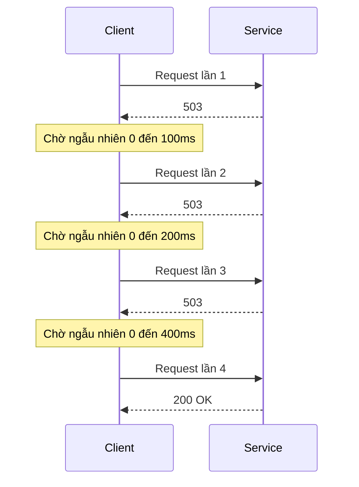
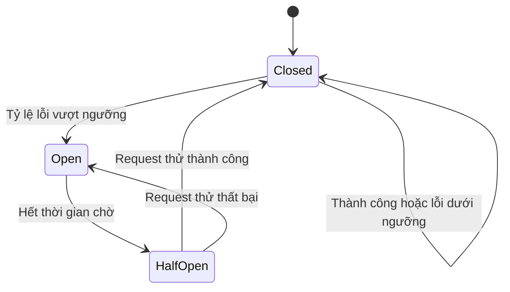
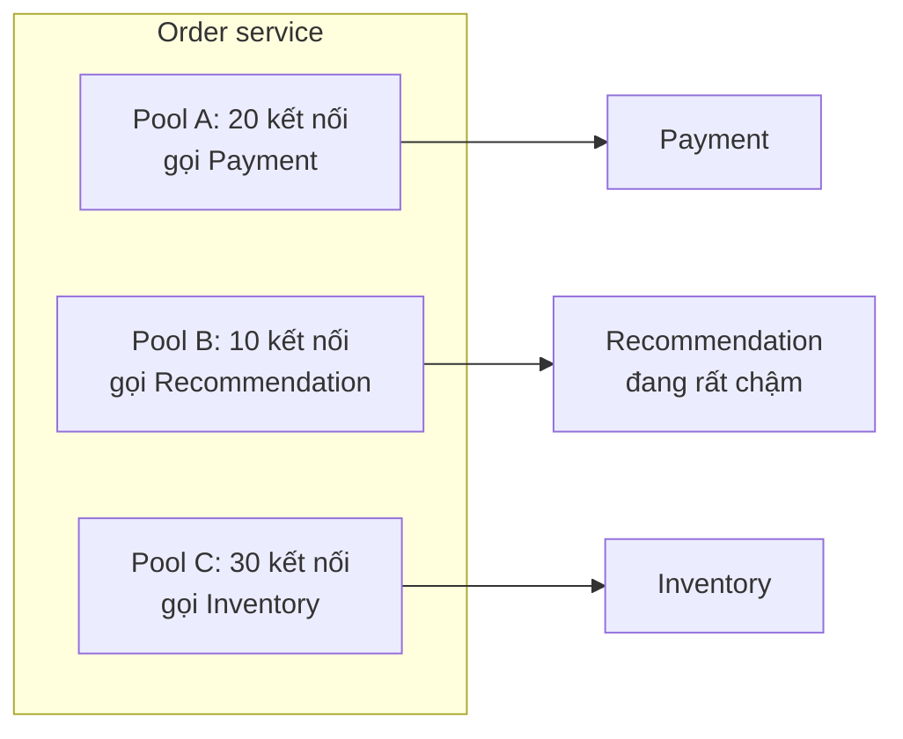
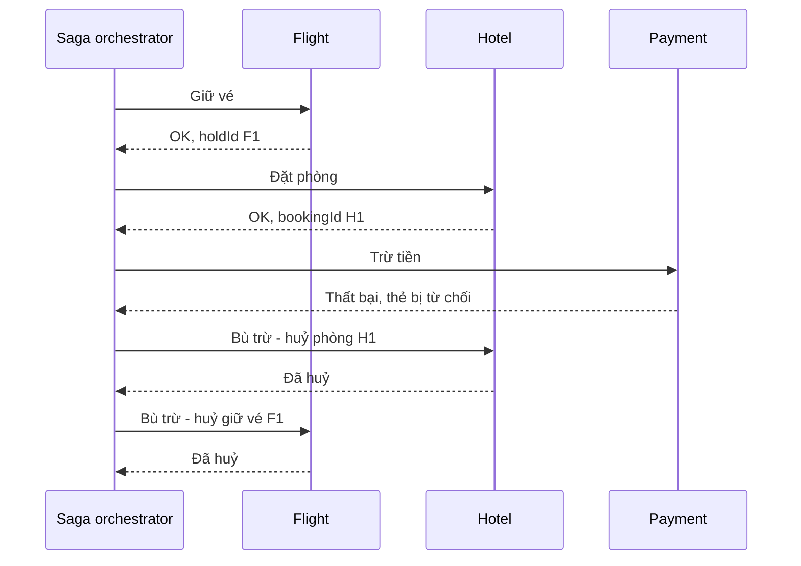
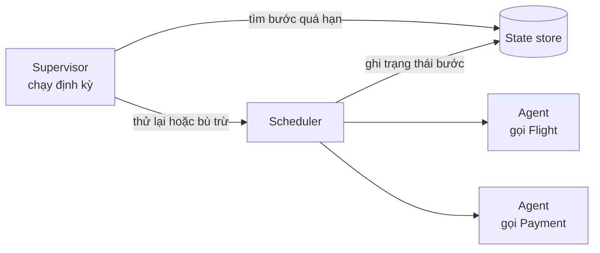
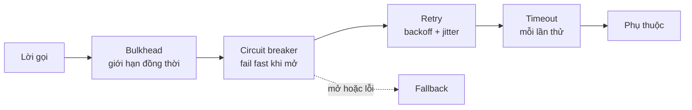

# Reliability: Resiliency Patterns

**Resiliency** (khả năng phục hồi) là khả năng hệ thống **chịu được lỗi và hồi phục** về trạng thái hoạt động bình thường. Nếu availability đo "hệ thống có đang phục vụ không", thì resiliency trả lời "khi một phần hỏng, hệ thống **phản ứng** thế nào": thử lại lỗi thoáng qua (**Retry**), ngừng gọi thứ đang chết (**Circuit Breaker**), cô lập để lỗi không lan (**Bulkhead**), và hoàn tác các bước đã làm khi một quy trình nhiều bước thất bại (**Compensating Transaction**). Bài cũng nhắc ngắn **Leader Election** và **Scheduler Agent Supervisor**.

**Tương tự đơn giản:** Tàu thuỷ được chia thành nhiều **khoang kín nước** (bulkhead) — thủng một khoang thì tàu không chìm. Nhà có **cầu dao tự động** (circuit breaker) — chập điện thì ngắt mạch thay vì cháy nhà, sau một lúc thử đóng lại. Gọi điện không được thì **chờ một chút rồi gọi lại**, mỗi lần chờ lâu hơn (retry với backoff).

---

:::note[Ghi nhớ nhanh]

- ⭐ **Retry chỉ cho lỗi thoáng qua (transient) và thao tác idempotent** — luôn dùng **exponential backoff + jitter** và giới hạn số lần; retry mù quáng gây **retry storm**.
- ⭐ **Circuit Breaker có 3 trạng thái: Closed → Open → Half-Open** — lỗi vượt ngưỡng thì mở mạch (fail fast), sau thời gian chờ cho vài request thử, thành công thì đóng lại.
- **Bulkhead = chia tài nguyên (thread pool, connection pool, instance) theo nhóm** để một phụ thuộc chậm không chiếm hết tài nguyên của cả hệ thống.
- **Compensating Transaction = hoàn tác bằng thao tác nghiệp vụ ngược** (huỷ đặt phòng, hoàn tiền) — nền tảng của **Saga** khi không có transaction phân tán.
- **Kết hợp:** timeout → retry (vài lần, có backoff) → circuit breaker → fallback; bulkhead bao quanh từng phụ thuộc.

:::

---

## Mục lục

- [Vì sao cần Resiliency patterns?](#vì-sao-cần-resiliency-patterns)
- [1. Resiliency là gì?](#1-resiliency-là-gì)
- [2. Retry pattern](#2-retry-pattern)
- [3. Circuit Breaker pattern](#3-circuit-breaker-pattern)
- [4. Bulkhead pattern](#4-bulkhead-pattern)
- [5. Compensating Transaction pattern](#5-compensating-transaction-pattern)
- [6. Leader Election và Scheduler Agent Supervisor](#6-leader-election-và-scheduler-agent-supervisor)
- [7. Kết hợp các pattern](#7-kết-hợp-các-pattern)
- [Khi nào dùng?](#khi-nào-dùng)
- [Lỗi thường gặp](#lỗi-thường-gặp)
- [Câu hỏi phỏng vấn](#câu-hỏi-phỏng-vấn)

---

## Vì sao cần Resiliency patterns?

**Vấn đề:** Trong hệ thống phân tán, mỗi lời gọi mạng có thể: thất bại thoáng qua (mất gói, DB failover vài giây, throttle tạm thời), chậm bất thường, hoặc treo vô hạn. Lỗi nhỏ ở một service dễ **lan dây chuyền (cascading failure)**: service B chậm → các thread của A chờ B bị chiếm hết → A không phục vụ được cả những request không liên quan đến B → các service gọi A cũng chết theo. Quy trình nhiều bước (đặt vé máy bay + khách sạn + trừ tiền) thất bại giữa chừng để lại dữ liệu nửa vời.

**Giải pháp:** Một bộ pattern phòng thủ: **timeout** cho mọi lời gọi; **retry** có kiểm soát cho lỗi thoáng qua; **circuit breaker** để ngừng gọi thứ đang chết; **bulkhead** để cô lập; **compensating transaction** để đưa quy trình nhiều bước về trạng thái nhất quán.

:::tip[Dùng thực tế]

- **Netflix Hystrix** (nay ở chế độ bảo trì) phổ biến circuit breaker + bulkhead; thế hệ sau là **Resilience4j** (Java), **Polly** (.NET), **opossum**/**cockatiel** (Node.js).
- **AWS SDK** tích hợp sẵn retry với exponential backoff + jitter; AWS Architecture Blog có bài phân tích nổi tiếng về các biến thể jitter.
- **Service mesh** (Istio, Linkerd) cấu hình retry, timeout, outlier detection (một dạng circuit breaker) ở tầng proxy.
- **Saga** với compensating transaction dùng trong đặt tour du lịch, thương mại điện tử (giữ hàng → trừ tiền → giao hàng); công cụ như **Temporal**, AWS Step Functions hỗ trợ điều phối.

:::

---

## 1. Resiliency là gì?

**Resiliency** là khả năng hệ thống **hấp thụ** lỗi (không sụp đổ) và **phục hồi** (trở về trạng thái hoạt động đầy đủ) mà không cần con người can thiệp, hoặc với can thiệp tối thiểu.

Phân loại lỗi để chọn phản ứng đúng:

| Loại lỗi | Ví dụ | Phản ứng phù hợp |
| --- | --- | --- |
| **Transient** (thoáng qua) | Timeout mạng, 503, DB failover, throttle 429 | Retry có backoff |
| **Kéo dài** | Service sập, region lỗi | Circuit breaker, fallback, failover |
| **Quá tải** | Một phụ thuộc chậm làm cạn tài nguyên | Bulkhead, timeout, load shedding |
| **Lỗi nghiệp vụ / vĩnh viễn** | 400, 404, hết hàng, thẻ bị từ chối | **Không retry**; báo lỗi, compensate |

**Graceful degradation** (suy giảm có kiểm soát): khi phụ thuộc không quan trọng lỗi, vẫn phục vụ phần chính — trang sản phẩm hiện được dù dịch vụ gợi ý chết.

---

## 2. Retry pattern

### 2.1. Nguyên tắc

- **Chỉ retry lỗi transient:** timeout, connection reset, 502/503/504, 429 (theo `Retry-After`). Không retry 400/401/403/404/422.
- **Chỉ retry thao tác idempotent** — hoặc thao tác có **idempotency key** (Stripe API hỗ trợ header `Idempotency-Key`).
- **Giới hạn số lần** (thường 2–5) và **tổng thời gian** (deadline).
- **Exponential backoff:** chờ `base × 2^attempt` (100ms, 200ms, 400ms, 800ms...) có trần.
- **Jitter:** thêm ngẫu nhiên để các client không retry đồng loạt cùng thời điểm (thundering herd).
- **Retry ở một tầng** — app, ambassador, gateway cùng retry thì số request nhân lên theo cấp số nhân.

### 2.2. Exponential backoff + jitter



**Full jitter** (được AWS khuyến nghị): `sleep = random(0, min(cap, base × 2^attempt))` — trải đều thời điểm retry tốt nhất.

```ts
export interface RetryOptions {
  readonly maxAttempts: number;   // tổng số lần thử, kể cả lần đầu
  readonly baseDelayMs: number;
  readonly maxDelayMs: number;
  readonly isRetryable: (err: unknown) => boolean;
}

const sleep = (ms: number) => new Promise((r) => setTimeout(r, ms));

export async function retry<T>(fn: () => Promise<T>, opts: RetryOptions): Promise<T> {
  let lastError: unknown;
  for (let attempt = 0; attempt < opts.maxAttempts; attempt++) {
    try {
      return await fn();
    } catch (err) {
      lastError = err;
      const isLast = attempt === opts.maxAttempts - 1;
      if (isLast || !opts.isRetryable(err)) throw err;

      // Full jitter: ngẫu nhiên trong [0, min(cap, base * 2^attempt)]
      const ceiling = Math.min(opts.maxDelayMs, opts.baseDelayMs * 2 ** attempt);
      await sleep(Math.random() * ceiling);
    }
  }
  throw lastError;
}

// Chỉ retry lỗi mạng và 5xx/429, không retry lỗi nghiệp vụ
export const isTransientHttpError = (err: unknown): boolean => {
  if (err instanceof HttpError) return err.status === 429 || err.status >= 500;
  return err instanceof Error && ['ECONNRESET', 'ETIMEDOUT', 'ECONNREFUSED'].includes((err as NodeJS.ErrnoException).code ?? '');
};
```

### 2.3. Issues & considerations

- **Retry làm tăng tải** lên service đang gặp khó → kết hợp circuit breaker và **retry budget** (vd retry không quá 10% tổng request).
- **Retry storm qua nhiều tầng:** 3 tầng × 3 lần = 27 request cho một lỗi.
- **Độ trễ người dùng:** tổng thời gian retry phải nằm trong deadline của request gốc.
- **Log từng lần retry** để phát hiện vấn đề tiềm ẩn (retry thành công che giấu lỗi hệ thống).

---

## 3. Circuit Breaker pattern

### 3.1. Vấn đề

Khi service B **chết hẳn**, retry chỉ phí tài nguyên: mỗi request của A vẫn chờ timeout vài giây, thread bị chiếm, người dùng chờ lâu rồi vẫn lỗi. Tốt hơn là **thất bại ngay (fail fast)** và cho B thời gian hồi phục.

### 3.2. Ba trạng thái



| Trạng thái | Hành vi |
| --- | --- |
| **Closed** (đóng mạch) | Request đi qua bình thường; đếm lỗi trong cửa sổ trượt |
| **Open** (mở mạch) | Request **bị từ chối ngay** (hoặc trả fallback), không gọi B |
| **Half-Open** (nửa mở) | Cho một số ít request thử; thành công thì Closed, thất bại thì Open lại |

### 3.3. Code TypeScript

```ts
type State = 'CLOSED' | 'OPEN' | 'HALF_OPEN';

export interface BreakerOptions {
  readonly failureThreshold: number;  // số lỗi liên tiếp để mở mạch
  readonly openDurationMs: number;    // thời gian ở trạng thái OPEN
  readonly halfOpenMaxCalls: number;  // số request thử ở HALF_OPEN
}

export class CircuitOpenError extends Error {
  constructor(name: string) { super(`Circuit ${name} đang mở, từ chối gọi`); }
}

export class CircuitBreaker {
  private state: State = 'CLOSED';
  private failures = 0;
  private openedAt = 0;
  private halfOpenCalls = 0;

  constructor(private readonly name: string, private readonly opts: BreakerOptions) {}

  async exec<T>(fn: () => Promise<T>, fallback?: () => T): Promise<T> {
    if (this.state === 'OPEN') {
      if (Date.now() - this.openedAt < this.opts.openDurationMs) return this.reject(fallback);
      this.transition('HALF_OPEN');
    }
    if (this.state === 'HALF_OPEN' && this.halfOpenCalls >= this.opts.halfOpenMaxCalls) {
      return this.reject(fallback);
    }
    if (this.state === 'HALF_OPEN') this.halfOpenCalls++;

    try {
      const result = await fn();
      this.onSuccess();
      return result;
    } catch (err) {
      this.onFailure();
      if (fallback) return fallback();
      throw err;
    }
  }

  private onSuccess(): void {
    this.failures = 0;
    if (this.state === 'HALF_OPEN') this.transition('CLOSED');
  }

  private onFailure(): void {
    this.failures++;
    if (this.state === 'HALF_OPEN' || this.failures >= this.opts.failureThreshold) {
      this.transition('OPEN');
    }
  }

  private transition(next: State): void {
    logger.warn({ breaker: this.name, from: this.state, to: next }, 'Circuit breaker đổi trạng thái');
    this.state = next;
    this.halfOpenCalls = 0;
    if (next === 'OPEN') this.openedAt = Date.now();
    if (next === 'CLOSED') this.failures = 0;
  }

  private reject<T>(fallback?: () => T): T {
    if (fallback) return fallback();
    throw new CircuitOpenError(this.name);
  }
}

// Sử dụng: bọc lời gọi dịch vụ gợi ý, lỗi thì trả danh sách rỗng
const recBreaker = new CircuitBreaker('recommendation', {
  failureThreshold: 5, openDurationMs: 30_000, halfOpenMaxCalls: 2,
});
const recs = await recBreaker.exec(() => recClient.forUser(userId), () => []);
```

Bản production (Resilience4j, opossum) thường dùng **tỷ lệ lỗi trong cửa sổ trượt** (vd trên 50% trong 20 request gần nhất) kèm **số request tối thiểu**, tính cả **slow call** (request chậm hơn ngưỡng) là lỗi.

### 3.4. Issues & considerations

- **Phân loại lỗi:** lỗi 4xx của client không nên làm mở mạch.
- **Một breaker cho mỗi phụ thuộc** (thậm chí mỗi endpoint) — không dùng chung.
- **Fallback hợp lý:** cache cũ, giá trị mặc định, hàng đợi để xử lý sau, hoặc lỗi rõ ràng.
- **Trạng thái cục bộ mỗi instance** là chấp nhận được trong đa số trường hợp; chia sẻ trạng thái qua instance phức tạp hơn và ít khi cần.
- **Giám sát và cảnh báo** khi breaker mở — đó là tín hiệu sự cố.
- **Kết hợp retry:** retry nằm **trong** breaker (mỗi lần retry thất bại được đếm), hoặc breaker mở thì không retry nữa.

---

## 4. Bulkhead pattern

### 4.1. Ý tưởng

Chia tài nguyên thành **các khoang cô lập** để một phần lỗi/quá tải không làm cạn tài nguyên của phần khác.



Recommendation chậm chỉ làm cạn Pool B; thanh toán và kho vẫn chạy bình thường.

### 4.2. Các mức bulkhead

| Mức | Ví dụ |
| --- | --- |
| **Thread / connection pool** | Pool riêng cho từng phụ thuộc; semaphore giới hạn số request đồng thời |
| **Process / container** | Tách worker xử lý tác vụ nặng ra deployment riêng |
| **Instance theo loại khách** | Cụm riêng cho khách VIP, cụm riêng cho API công khai |
| **Hạ tầng** | Stamps, cell-based architecture (AWS dùng nhiều) |

```ts
// Bulkhead bằng semaphore: giới hạn số lời gọi đồng thời tới một phụ thuộc
export class Bulkhead {
  private active = 0;
  private readonly queue: Array<() => void> = [];

  constructor(private readonly maxConcurrent: number, private readonly maxQueue: number) {}

  async run<T>(fn: () => Promise<T>): Promise<T> {
    if (this.active >= this.maxConcurrent) {
      if (this.queue.length >= this.maxQueue) throw new Error('Bulkhead đầy, từ chối request');
      await new Promise<void>((resolve) => this.queue.push(resolve));
    }
    this.active++;
    try {
      return await fn();
    } finally {
      this.active--;
      this.queue.shift()?.();
    }
  }
}

const recBulkhead = new Bulkhead(10, 20); // tối đa 10 đang chạy, 20 đang chờ
```

### 4.3. Issues & considerations

- **Chia tài nguyên làm giảm hiệu suất sử dụng** — pool nhàn rỗi không cho pool khác mượn.
- **Định cỡ pool** dựa trên đo đạc (số request đồng thời × độ trễ, định luật Little).
- **Kết hợp timeout và circuit breaker** — bulkhead giới hạn thiệt hại, breaker cắt nguồn.
- Bulkhead ở cấp tenant chống **noisy neighbor** trong hệ thống multi-tenant.

---

## 5. Compensating Transaction pattern

### 5.1. Vấn đề

Quy trình đặt tour: giữ vé máy bay (service A) → đặt khách sạn (service B) → trừ tiền (service C). Mỗi bước commit trong DB riêng; không có transaction ACID xuyên service (2PC thường không khả thi trên cloud vì khoá lâu, phụ thuộc mọi bên sẵn sàng). Bước 3 thất bại thì hai bước trước đã commit.

### 5.2. Giải pháp: Saga với bước bù trừ

Mỗi bước có một **compensating action** — thao tác nghiệp vụ đảo ngược tác dụng (không phải rollback kỹ thuật). Khi một bước lỗi, chạy các bước bù trừ **theo thứ tự ngược**.



```ts
interface SagaStep<C> {
  readonly name: string;
  readonly action: (ctx: C) => Promise<C>;
  readonly compensate: (ctx: C) => Promise<void>;
}

export async function runSaga<C>(steps: readonly SagaStep<C>[], initial: C): Promise<C> {
  const done: SagaStep<C>[] = [];
  let ctx = initial;
  try {
    for (const step of steps) {
      ctx = await step.action(ctx);
      done.push(step);
    }
    return ctx;
  } catch (err) {
    // Bù trừ theo thứ tự ngược; mỗi compensate phải idempotent và được retry
    for (const step of [...done].reverse()) {
      await retry(() => step.compensate(ctx), {
        maxAttempts: 5, baseDelayMs: 200, maxDelayMs: 5000, isRetryable: () => true,
      });
    }
    throw err;
  }
}
```

### 5.3. Issues & considerations

- **Bù trừ không phải lúc nào cũng khôi phục nguyên trạng:** email đã gửi không thu hồi được (bù trừ bằng email xin lỗi); phí huỷ phòng có thể phát sinh.
- **Compensate phải idempotent và được retry** đến khi thành công; nếu vẫn thất bại cần hàng đợi xử lý thủ công.
- **Trạng thái saga phải được lưu bền** (orchestrator crash giữa chừng vẫn tiếp tục được).
- **Không có isolation:** trong lúc saga chạy, bên khác có thể thấy trạng thái trung gian (phòng đang "giữ") → dùng trạng thái chờ (`PENDING`), semantic lock.
- **Orchestration vs choreography:** orchestrator trung tâm dễ theo dõi; choreography (mỗi service phản ứng theo event) ít coupling hơn nhưng khó nhìn toàn cảnh.
- **Thứ tự bước:** đặt bước dễ thất bại hoặc khó bù trừ nhất (vd trừ tiền) ở vị trí hợp lý — thường là **pivot** sau các bước có thể bù trừ.

---

## 6. Leader Election và Scheduler Agent Supervisor

Hai pattern này cũng được roadmap xếp vào mảng resiliency; nhắc ngắn:

- **Leader Election** — chọn một instance điều phối, các instance khác dự phòng; leader chết thì lease hết hạn và node khác lên thay → không có điểm lỗi đơn ở vai trò điều phối. Chi tiết về lease, etcd/ZooKeeper/Redis và fencing token ở bài 38.
- **Scheduler Agent Supervisor** — điều phối một quy trình nhiều bước qua các service/tài nguyên từ xa với ba vai trò:
  - **Scheduler:** sắp xếp và chạy các bước, ghi trạng thái từng bước vào **state store** bền.
  - **Agent:** đóng gói lời gọi tới từng service/tài nguyên từ xa (có retry, timeout).
  - **Supervisor:** chạy định kỳ, quét state store tìm bước bị treo hoặc thất bại (quá hạn), yêu cầu thử lại hoặc kích hoạt compensating transaction.



Workflow engine như **Temporal**, **AWS Step Functions**, **Azure Durable Functions** hiện thực các ý tưởng này sẵn.

---

## 7. Kết hợp các pattern

Thứ tự bọc điển hình cho một lời gọi tới phụ thuộc bên ngoài:



| Pattern | Bảo vệ khỏi | Không bảo vệ khỏi |
| --- | --- | --- |
| **Timeout** | Treo vô hạn | Lỗi nhanh lặp lại |
| **Retry** | Lỗi thoáng qua | Lỗi kéo dài (còn làm tệ hơn) |
| **Circuit Breaker** | Gọi liên tục thứ đang chết | Cạn tài nguyên do chậm (nếu chưa mở) |
| **Bulkhead** | Lỗi lan sang phần khác | Lỗi trong chính khoang đó |
| **Compensating Transaction** | Dữ liệu nửa vời trong quy trình nhiều bước | Thao tác không thể đảo ngược |

---

## Khi nào dùng?

| Pattern | Nên dùng | Không nên dùng |
| --- | --- | --- |
| **Retry** | Lỗi transient khi gọi mạng, DB, cloud API; thao tác idempotent | Lỗi nghiệp vụ; thao tác không idempotent mà không có idempotency key; lỗi kéo dài |
| **Circuit Breaker** | Gọi service/tài nguyên từ xa có thể lỗi kéo dài | Tài nguyên cục bộ trong bộ nhớ; thay cho xử lý exception nghiệp vụ |
| **Bulkhead** | Nhiều phụ thuộc với mức quan trọng khác nhau; multi-tenant | Hệ thống nhỏ, ít phụ thuộc; tài nguyên khan hiếm không thể chia |
| **Compensating Transaction** | Quy trình nhiều bước xuyên service cần nhất quán sau cùng | Khi một transaction ACID cục bộ làm được; bước không đảo ngược được |

---

## Lỗi thường gặp

### Lỗi 1: Retry không có backoff và jitter

Hàng nghìn client retry ngay lập tức cùng lúc → service vừa hồi phục lại sập. **Sửa:** exponential backoff + full jitter + giới hạn số lần.

### Lỗi 2: Retry thao tác không idempotent

Retry `POST /charge` sau timeout — request đầu thực ra đã thành công → trừ tiền hai lần. **Sửa:** idempotency key phía server.

### Lỗi 3: Không có timeout

Mặc định của nhiều HTTP client là chờ rất lâu hoặc vô hạn → circuit breaker và bulkhead không phát huy. **Sửa:** timeout tường minh cho mọi lời gọi mạng.

### Lỗi 4: Một circuit breaker cho mọi phụ thuộc

Recommendation lỗi làm mở mạch chung → payment cũng bị chặn. **Sửa:** breaker riêng cho từng phụ thuộc.

### Lỗi 5: Saga không lưu trạng thái

Orchestrator restart giữa chừng → không biết bước nào đã làm, không bù trừ được. **Sửa:** lưu trạng thái saga bền vững, hoặc dùng workflow engine.

---

## Câu hỏi phỏng vấn

Những câu thường gặp về chủ đề này. Tự trả lời trước, rồi bấm **Xem đáp án** để đối chiếu.

**1. Vì sao cần jitter trong exponential backoff?**

<details className="qa">
<summary>Xem đáp án</summary>

Không có jitter, các client cùng gặp lỗi tại một thời điểm sẽ retry đồng loạt tại cùng các mốc (100ms, 200ms, 400ms...) → tạo các đợt tải đỉnh dồn dập lên service vừa hồi phục (thundering herd). Jitter rải thời điểm retry ngẫu nhiên, làm phẳng tải. Full jitter: `random(0, min(cap, base × 2^attempt))`.

</details>

**2. Mô tả các trạng thái của circuit breaker.**

<details className="qa">
<summary>Xem đáp án</summary>

Closed: request đi qua, đếm lỗi. Lỗi vượt ngưỡng → Open: từ chối ngay (fail fast) hoặc fallback, cho phụ thuộc thời gian hồi phục. Hết thời gian chờ → Half-Open: cho vài request thử; thành công → Closed, thất bại → Open lại.

</details>

**3. Retry và Circuit Breaker khác nhau và phối hợp thế nào?**

<details className="qa">
<summary>Xem đáp án</summary>

Retry giả định lỗi sẽ sớm hết và thử lại; circuit breaker giả định lỗi kéo dài và ngừng thử. Phối hợp: retry vài lần có backoff cho lỗi transient; các lần thất bại được breaker đếm; khi breaker mở thì retry không gọi nữa mà fail fast/fallback. Retry nên nhận biết lỗi `CircuitOpenError` để không retry.

</details>

**4. Bulkhead là gì? Cho ví dụ.**

<details className="qa">
<summary>Xem đáp án</summary>

Cô lập tài nguyên theo nhóm để lỗi một nhóm không lan sang nhóm khác. Ví dụ: connection pool riêng cho từng service phụ thuộc — service gợi ý chậm chỉ làm cạn pool của nó, thanh toán vẫn chạy; hoặc cụm instance riêng cho khách hàng lớn để tránh noisy neighbor.

</details>

**5. Làm sao đảm bảo nhất quán khi đặt hàng cần trừ kho, trừ tiền, tạo vận đơn ở 3 service khác nhau?**

<details className="qa">
<summary>Xem đáp án</summary>

Dùng Saga: mỗi bước là transaction cục bộ + compensating action (hoàn kho, hoàn tiền, huỷ vận đơn). Orchestrator lưu trạng thái bền, gọi các bước; lỗi thì chạy bù trừ theo thứ tự ngược, compensate idempotent và được retry. Dùng outbox để ghi DB và phát event nguyên tử, idempotency key cho mỗi bước, trạng thái `PENDING` cho dữ liệu trung gian. Chấp nhận eventual consistency.

</details>

**6. Scheduler Agent Supervisor giải quyết vấn đề gì?**

<details className="qa">
<summary>Xem đáp án</summary>

Điều phối quy trình nhiều bước qua tài nguyên từ xa một cách tin cậy: scheduler chạy các bước và lưu trạng thái, agent bọc lời gọi từng tài nguyên, supervisor định kỳ phát hiện bước treo/thất bại để thử lại hoặc kích hoạt bù trừ. Giúp quy trình phục hồi được sau lỗi tạm thời hoặc crash.

</details>
