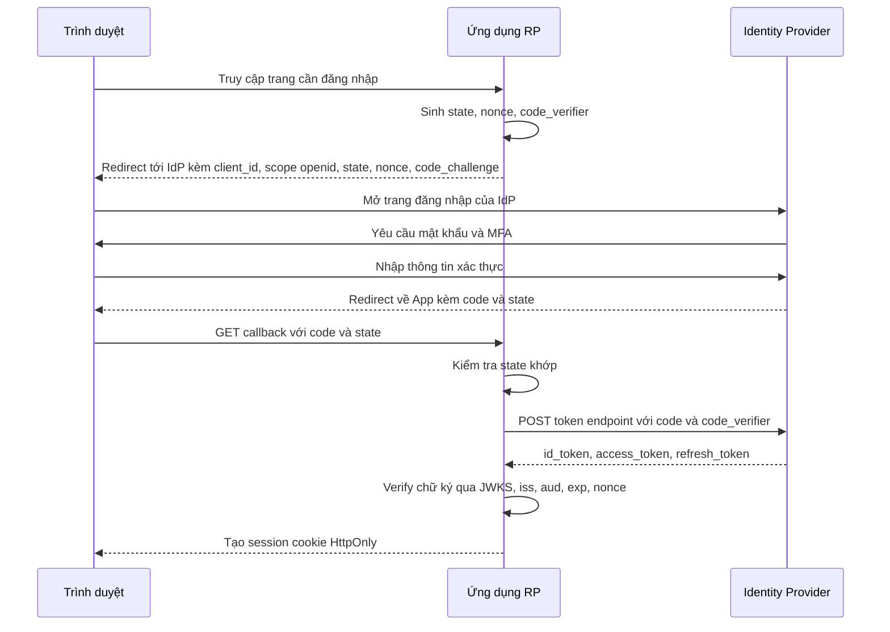
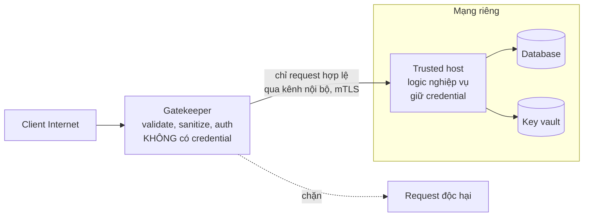
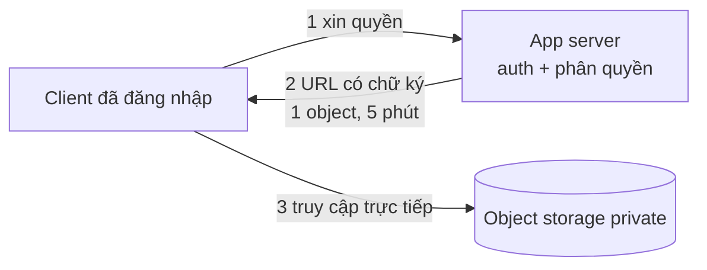
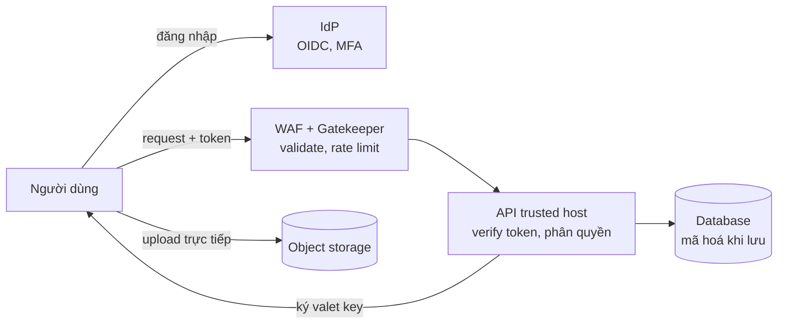

# Reliability: Security Patterns

Một hệ thống không thể coi là **đáng tin cậy** nếu kẻ tấn công có thể chiếm quyền, đánh cắp dữ liệu hoặc làm sập nó. Vì vậy roadmap xếp **Security** vào nhóm Reliability Patterns. Bài này trình bày ba pattern bảo mật trong Azure Cloud Design Patterns: **Federated Identity** (uỷ thác xác thực cho nhà cung cấp danh tính bên ngoài qua OIDC/SAML), **Gatekeeper** (một lớp trung gian chuyên kiểm tra, lọc request trước khi tới hệ thống chứa dữ liệu nhạy cảm) và **Valet Key** (cấp quyền truy cập tài nguyên có giới hạn — nhắc ngắn vì đã có bài 35).

**Tương tự đơn giản:** **Federated identity** giống việc khách sạn chấp nhận **hộ chiếu do nhà nước cấp** thay vì tự làm thẻ căn cước cho từng khách — khách sạn tin cơ quan cấp hộ chiếu. **Gatekeeper** là **bảo vệ ở cổng** ngân hàng: kiểm tra, soát người trước khi cho vào khu giao dịch; két sắt nằm sâu bên trong, không mở ra đường.

---

:::note[Ghi nhớ nhanh]

- ⭐ **Federated Identity = ứng dụng không tự quản lý mật khẩu**, mà tin **token** do **Identity Provider (IdP)** phát hành (Google, Microsoft Entra ID, Okta, Keycloak). Giao thức: **OIDC** (trên OAuth 2.0, token JWT, hợp app hiện đại) và **SAML 2.0** (XML, phổ biến SSO doanh nghiệp).
- ⭐ **Gatekeeper = lớp trung gian tách biệt, quyền tối thiểu**, kiểm tra/sanitize request rồi mới chuyển tới **trusted host** chứa dữ liệu/khoá bí mật; gatekeeper bị chiếm cũng không có credential của storage.
- **Ứng dụng phải verify token đúng cách:** chữ ký (qua JWKS), `iss`, `aud`, `exp`, `nonce` — bỏ sót một trường là lỗ hổng.
- **Valet Key** = token/URL có chữ ký, phạm vi hẹp, thời hạn ngắn để client truy cập trực tiếp tài nguyên (S3 presigned URL, Azure SAS).
- **Defense in depth (phòng thủ nhiều lớp):** không pattern nào đủ một mình — kết hợp IdP, gateway/WAF, gatekeeper, mã hoá, least privilege.

:::

---

## Mục lục

- [Vì sao cần Security patterns?](#vì-sao-cần-security-patterns)
- [1. Security trong Reliability](#1-security-trong-reliability)
- [2. Federated Identity](#2-federated-identity)
- [3. Gatekeeper](#3-gatekeeper)
- [4. Valet Key](#4-valet-key)
- [5. Kết hợp các pattern](#5-kết-hợp-các-pattern)
- [Khi nào dùng?](#khi-nào-dùng)
- [Lỗi thường gặp](#lỗi-thường-gặp)
- [Câu hỏi phỏng vấn](#câu-hỏi-phỏng-vấn)

---

## Vì sao cần Security patterns?

**Vấn đề:**

- Mỗi ứng dụng tự làm đăng nhập: tự lưu mật khẩu (dễ băm sai cách), tự làm quên mật khẩu, MFA, khoá tài khoản... Người dùng doanh nghiệp phải nhớ 10 mật khẩu cho 10 hệ thống; nhân viên nghỉ việc phải xoá tài khoản ở 10 nơi.
- Ứng dụng web công khai vừa nhận request từ Internet vừa giữ chuỗi kết nối DB, khoá mã hoá. Một lỗ hổng (RCE, SSRF) ở tầng web là kẻ tấn công lấy được tất cả.
- Cho client tải file qua app server thì tốn tài nguyên; cho client đọc thẳng storage bằng khoá thật thì quá nguy hiểm.

**Giải pháp:**

- **Federated Identity:** tập trung xác thực vào IdP chuyên nghiệp; ứng dụng chỉ kiểm tra token. Có SSO, MFA, quản lý vòng đời tài khoản ở một nơi.
- **Gatekeeper:** tách tầng tiếp xúc Internet (không có bí mật) khỏi tầng giữ bí mật.
- **Valet Key:** cấp quyền tạm thời, hẹp thay vì chia sẻ khoá thật.

:::tip[Dùng thực tế]

- **"Đăng nhập bằng Google / Apple / Microsoft"** trên hầu hết ứng dụng là federated identity qua OIDC.
- **SSO doanh nghiệp:** nhân viên đăng nhập Microsoft Entra ID / Okta một lần, truy cập Salesforce, Slack, Jira qua SAML hoặc OIDC.
- **Gatekeeper:** API Gateway + WAF (AWS WAF, Azure Application Gateway WAF, Cloudflare) đứng trước backend; mô hình "DMZ" trong mạng doanh nghiệp.
- **Valet key:** S3 presigned URL, Azure SAS, GCS signed URL cho upload/download trực tiếp.

:::

---

## 1. Security trong Reliability

Security đóng góp vào reliability theo bộ ba **CIA**:

| Thuộc tính | Ý nghĩa | Đe doạ ví dụ |
| --- | --- | --- |
| **Confidentiality** (bảo mật) | Chỉ người được phép xem dữ liệu | Lộ dữ liệu, đánh cắp token |
| **Integrity** (toàn vẹn) | Dữ liệu không bị sửa trái phép | Giả mạo request, SQL injection |
| **Availability** (sẵn sàng) | Hệ thống phục vụ được người hợp lệ | DDoS, ransomware |

Nguyên tắc nền tảng khi thiết kế:

- **Least privilege** (quyền tối thiểu): mỗi thành phần chỉ có đúng quyền nó cần.
- **Defense in depth:** nhiều lớp bảo vệ độc lập.
- **Zero trust:** không tin mặc định vì "đã ở trong mạng nội bộ"; xác thực mọi lời gọi.
- **Giảm bề mặt tấn công:** càng ít thành phần tiếp xúc Internet càng tốt.

---

## 2. Federated Identity

### 2.1. Các vai trò

| Vai trò | OIDC gọi là | SAML gọi là | Ví dụ |
| --- | --- | --- | --- |
| Người dùng | End-user | Principal | Nhân viên, khách hàng |
| Nhà cung cấp danh tính | OpenID Provider (OP) | Identity Provider (IdP) | Google, Entra ID, Okta, Keycloak, Auth0 |
| Ứng dụng tin tưởng IdP | Relying Party (RP) / Client | Service Provider (SP) | Ứng dụng của bạn |

Ứng dụng **không bao giờ thấy mật khẩu**. IdP xác thực người dùng (mật khẩu, MFA, passkey) rồi phát hành **token/assertion có chữ ký** chứa **claims** (thông tin như `sub`, `email`, `groups`). Ứng dụng kiểm tra chữ ký và claims để biết người dùng là ai.

### 2.2. OIDC Authorization Code Flow với PKCE

Đây là luồng khuyến nghị cho web app và mobile app (PKCE — Proof Key for Code Exchange — chống đánh cắp authorization code).



### 2.3. Verify ID token (TypeScript với thư viện `jose`)

```ts
import { createRemoteJWKSet, jwtVerify, type JWTPayload } from 'jose';

const ISSUER = process.env.OIDC_ISSUER;        // vd https://accounts.google.com
const CLIENT_ID = process.env.OIDC_CLIENT_ID;
if (!ISSUER || !CLIENT_ID) throw new Error('Thiếu cấu hình OIDC_ISSUER hoặc OIDC_CLIENT_ID');

// JWKS: tập public key của IdP, thư viện tự cache và xoay vòng key theo kid
const JWKS = createRemoteJWKSet(new URL(`${ISSUER}/.well-known/jwks.json`));
// Thực tế nên lấy jwks_uri từ ${ISSUER}/.well-known/openid-configuration

export interface VerifiedUser {
  readonly sub: string;
  readonly email?: string;
}

export async function verifyIdToken(idToken: string, expectedNonce: string): Promise<VerifiedUser> {
  // jwtVerify kiểm tra chữ ký, exp, nbf, iss, aud; chỉ chấp nhận thuật toán chỉ định
  const { payload } = await jwtVerify(idToken, JWKS, {
    issuer: ISSUER,
    audience: CLIENT_ID,
    algorithms: ['RS256'],
  });

  if (payload.nonce !== expectedNonce) {
    throw new Error('nonce không khớp, có thể là replay attack');
  }
  return toUser(payload);
}

const toUser = (p: JWTPayload): VerifiedUser => {
  if (!p.sub) throw new Error('Token thiếu sub');
  return { sub: p.sub, email: typeof p.email === 'string' ? p.email : undefined };
};
```

Danh tính người dùng nên được định danh bằng cặp **`(iss, sub)`** — không dùng `email` làm khoá chính, vì email có thể đổi hoặc trùng giữa các IdP.

### 2.4. OIDC vs SAML

| Tiêu chí | OIDC | SAML 2.0 |
| --- | --- | --- |
| Nền tảng | OAuth 2.0, JSON, JWT | XML, XML Signature |
| Ra đời | 2014 | 2005 |
| Phù hợp | Web hiện đại, SPA, mobile, API | SSO doanh nghiệp, ứng dụng web truyền thống |
| Token | ID token (JWT), access token | SAML assertion (XML) |
| Truyền tải | Redirect + gọi back-channel tới token endpoint | Thường qua trình duyệt (HTTP POST binding) |
| Độ phức tạp | Thấp hơn | Cao hơn, nhiều lỗ hổng lịch sử do xử lý XML signature |

**OAuth 2.0** bản thân là giao thức **uỷ quyền** (authorization — cho app quyền truy cập tài nguyên thay người dùng), không phải xác thực. **OIDC** thêm lớp **xác thực** (ID token cho biết người dùng là ai).

### 2.5. Issues & considerations

- **IdP là điểm lỗi đơn:** IdP sập thì không ai đăng nhập được → chọn IdP có SLA cao, session trong app đủ dài hợp lý, cân nhắc nhiều IdP.
- **Ánh xạ danh tính:** cùng một người đăng nhập qua Google và qua email thì là một hay hai tài khoản? Thiết kế liên kết tài khoản cẩn thận (tránh chiếm tài khoản qua email chưa xác minh).
- **Claims và phân quyền:** IdP cho biết **ai**; quyền chi tiết trong ứng dụng thường vẫn do ứng dụng quản lý (hoặc ánh xạ từ `groups`/`roles` claim).
- **Đăng xuất toàn cục (single logout)** phức tạp; token đã phát hành vẫn hợp lệ tới khi hết hạn → access token ngắn hạn.
- **Home realm discovery:** hệ thống nhiều IdP cần xác định người dùng thuộc IdP nào (theo domain email, lựa chọn trên UI).
- **Lưu token an toàn:** trên web ưu tiên session cookie `HttpOnly`, `Secure`, `SameSite` (hoặc mô hình BFF giữ token phía server) thay vì `localStorage`.

---

## 3. Gatekeeper

### 3.1. Ý tưởng

Đặt một **host trung gian chuyên dụng** giữa client và ứng dụng/dịch vụ giữ dữ liệu nhạy cảm. Gatekeeper:

- **Validate và sanitize** mọi request (schema, kích thước, ký tự nguy hiểm).
- **Xác thực/phân quyền sơ bộ**, rate limit.
- **Chỉ chuyển request hợp lệ** tới **trusted host** qua kênh nội bộ được bảo vệ.
- **Không giữ credential** truy cập storage/khoá mã hoá — kể cả bị chiếm cũng không truy cập trực tiếp được dữ liệu.



### 3.2. Ví dụ gatekeeper validate request

```ts
import { z } from 'zod';

const TransferRequest = z.object({
  fromAccount: z.string().regex(/^\d{10,14}$/),
  toAccount: z.string().regex(/^\d{10,14}$/),
  amount: z.number().int().positive().max(500_000_000),
  note: z.string().max(140).optional(),
}).strict(); // từ chối field lạ

// Gatekeeper: chỉ kiểm tra và chuyển tiếp; không có quyền truy cập DB
export async function gatekeeperHandler(req: Request, res: Response) {
  const parsed = TransferRequest.safeParse(req.body);
  if (!parsed.success) {
    return res.status(400).json({ error: 'Dữ liệu không hợp lệ' }); // không trả chi tiết nội bộ
  }
  if (!req.user) return res.status(401).json({ error: 'Chưa xác thực' });

  try {
    const upstream = await trustedHostClient.post('/internal/transfers', {
      ...parsed.data,
      requestedBy: req.user.sub,
    });
    return res.status(upstream.status).json(upstream.body);
  } catch (err) {
    logger.error({ err }, 'Lỗi khi chuyển tiếp tới trusted host');
    return res.status(502).json({ error: 'Dịch vụ tạm thời không khả dụng' });
  }
}
```

Trusted host **vẫn tự kiểm tra lại** (không tin tuyệt đối gatekeeper) và chỉ nhận kết nối từ gatekeeper (network policy, mTLS, private endpoint).

### 3.3. Issues & considerations

- **Thêm độ trễ và một hop** — gatekeeper phải nhẹ, scale ngang.
- **Điểm lỗi đơn:** chạy nhiều instance; gatekeeper sập thì không vào được hệ thống.
- **Chỉ có giá trị khi trusted host thật sự bị cô lập:** nếu client vẫn gọi thẳng trusted host được thì gatekeeper vô nghĩa.
- **Không đặt logic nghiệp vụ** trong gatekeeper — chỉ validate, sanitize, chuyển tiếp.
- **Ghi log bảo mật** (request bị chặn, tần suất) để phát hiện tấn công.
- **Liên hệ với Gateway Offloading:** API gateway/WAF có thể đóng vai gatekeeper; điểm khác của gatekeeper là nhấn mạnh **tách biệt bí mật** — tầng tiếp xúc Internet không có credential.

---

## 4. Valet Key

Đã trình bày chi tiết (cơ chế, code S3 presigned URL bằng TypeScript) ở bài 35. Tóm tắt dưới góc nhìn bảo mật:

- **Mục tiêu:** cho client truy cập trực tiếp một tài nguyên cụ thể mà **không chia sẻ khoá thật** và không đi qua app server.
- **Token có chữ ký** do app cấp sau khi đã xác thực, phân quyền người dùng.
- **Phạm vi hẹp:** một object/prefix, một thao tác (đọc hoặc ghi), giới hạn content-type.
- **Thời hạn ngắn** (vài phút) vì khó thu hồi trước hạn.
- **Validate lại sau upload** (malware, loại file, kích thước) — valet key không đảm bảo nội dung an toàn.
- **Bucket vẫn private** — chỉ URL có chữ ký mới truy cập được.



---

## 5. Kết hợp các pattern

Một kiến trúc điển hình áp dụng defense in depth:



| Lớp | Pattern | Bảo vệ |
| --- | --- | --- |
| Danh tính | Federated Identity | Ai đang truy cập; MFA; SSO |
| Biên | Gatekeeper / WAF | Request độc hại, tấn công tiêm, quá tải |
| Ứng dụng | Phân quyền trong service | Ai được làm gì với dữ liệu nào |
| Dữ liệu | Valet Key, mã hoá | Truy cập file hạn chế, dữ liệu lộ vẫn không đọc được |

---

## Khi nào dùng?

| Pattern | Nên dùng | Không nên dùng |
| --- | --- | --- |
| **Federated Identity** | SSO doanh nghiệp; đăng nhập mạng xã hội; nhiều ứng dụng dùng chung người dùng; B2B với IdP của khách hàng | Hệ thống hoàn toàn offline/air-gapped; yêu cầu pháp lý buộc tự quản lý danh tính (vẫn có thể tự host IdP như Keycloak) |
| **Gatekeeper** | Hệ thống giữ dữ liệu nhạy cảm (tài chính, y tế); yêu cầu tuân thủ cao | Ứng dụng nhỏ, rủi ro thấp — overhead không đáng; khi độ trễ cực quan trọng |
| **Valet Key** | Upload/download file trực tiếp với storage; chia sẻ tạm thời | Cần kiểm soát/biến đổi dữ liệu trong lúc truyền |

---

## Lỗi thường gặp

### Lỗi 1: Decode JWT mà không verify

Dùng `jwt.decode()` lấy `sub` rồi tin luôn — ai cũng tự tạo được token. **Sửa:** luôn `verify` chữ ký bằng JWKS của IdP, kiểm tra `iss`, `aud`, `exp`.

### Lỗi 2: Chấp nhận thuật toán `none` hoặc nhầm thuật toán

Thư viện cấu hình lỏng chấp nhận `alg: none` hoặc HS256 với public key làm secret. **Sửa:** chỉ định danh sách thuật toán cho phép.

### Lỗi 3: Bỏ qua `aud`

Token phát cho ứng dụng A được dùng để truy cập ứng dụng B cùng IdP. **Sửa:** kiểm tra `aud` khớp `client_id` của mình.

### Lỗi 4: Gatekeeper giữ chuỗi kết nối DB

Tầng tiếp xúc Internet có credential DB "cho tiện" → mất ý nghĩa pattern. **Sửa:** chỉ trusted host giữ credential; gatekeeper không có quyền gì với storage.

### Lỗi 5: Dùng email làm định danh người dùng từ IdP

Email đổi, hoặc IdP cho phép email chưa xác minh → chiếm tài khoản. **Sửa:** dùng `(iss, sub)`; chỉ liên kết tài khoản theo email khi `email_verified` là true và có quy trình xác nhận.

---

## Câu hỏi phỏng vấn

Những câu thường gặp về chủ đề này. Tự trả lời trước, rồi bấm **Xem đáp án** để đối chiếu.

**1. OAuth 2.0 và OpenID Connect khác nhau thế nào?**

<details className="qa">
<summary>Xem đáp án</summary>

OAuth 2.0 là giao thức **uỷ quyền**: cho ứng dụng access token để truy cập tài nguyên thay người dùng, không định nghĩa cách biết người dùng là ai. OIDC là lớp **xác thực** xây trên OAuth 2.0: thêm ID token (JWT) chứa danh tính người dùng, scope `openid`, endpoint userinfo, discovery. Dùng access token của OAuth làm bằng chứng đăng nhập là sai lầm.

</details>

**2. Mô tả Authorization Code Flow với PKCE. Vì sao cần `state` và `nonce`?**

<details className="qa">
<summary>Xem đáp án</summary>

App sinh `code_verifier` ngẫu nhiên, gửi `code_challenge` (hash của verifier) khi redirect tới IdP. Người dùng đăng nhập ở IdP, IdP redirect về kèm `code`. App đổi `code` + `code_verifier` lấy token — kẻ đánh cắp `code` không có verifier nên không đổi được. `state` chống CSRF trên callback (đảm bảo phản hồi thuộc phiên đăng nhập do app khởi tạo). `nonce` gắn ID token với phiên đó, chống replay token.

</details>

**3. Khi nào chọn SAML, khi nào chọn OIDC?**

<details className="qa">
<summary>Xem đáp án</summary>

OIDC cho ứng dụng mới, SPA, mobile, API — JSON/JWT đơn giản, hỗ trợ tốt. SAML khi phải tích hợp SSO doanh nghiệp mà khách hàng/IdP chỉ hỗ trợ SAML, hoặc ứng dụng web truyền thống trong hệ sinh thái doanh nghiệp. Nhiều IdP (Entra ID, Okta, Keycloak) hỗ trợ cả hai.

</details>

**4. Gatekeeper pattern khác API Gateway thế nào?**

<details className="qa">
<summary>Xem đáp án</summary>

API Gateway tập trung vào routing, offloading, aggregation cho nhiều service. Gatekeeper tập trung vào **bảo mật**: một lớp trung gian tách biệt, quyền tối thiểu, validate/sanitize request và **không giữ bí mật**, để nếu bị chiếm thì kẻ tấn công vẫn không chạm được dữ liệu. Một API Gateway/WAF có thể đóng vai gatekeeper nếu thoả các điều kiện đó và backend bị cô lập.

</details>

**5. Ứng dụng nhận được JWT, cần kiểm tra những gì?**

<details className="qa">
<summary>Xem đáp án</summary>

Chữ ký hợp lệ với public key của issuer (qua JWKS, đúng `kid`); thuật toán thuộc danh sách cho phép; `iss` đúng issuer tin cậy; `aud` chứa client_id/API của mình; `exp` chưa hết hạn, `nbf`/`iat` hợp lý (chấp nhận lệch đồng hồ nhỏ); với ID token kiểm tra `nonce`; sau đó mới đọc claims để phân quyền.

</details>
