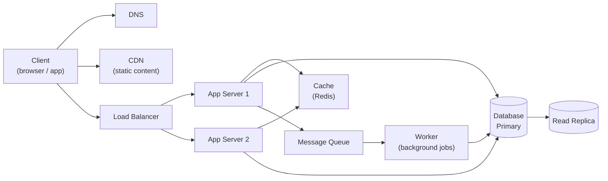

# System Design

Đây là lộ trình **System Design** (thiết kế hệ thống) bám theo [roadmap.sh/system-design](https://roadmap.sh/system-design) — đi từ các khái niệm nền tảng (performance, scalability, CAP), các khối xây dựng (DNS, CDN, load balancer, database, cache, queue), tới các **cloud design patterns** và **reliability patterns** dùng trong hệ thống phân tán thực tế. Mỗi **thuật ngữ chuyên ngành** đều được giải thích ngay khi xuất hiện.

**Tương tự đơn giản:** Viết code giống xây **một căn phòng**; system design là quy hoạch **cả toà nhà** — bao nhiêu thang máy (load balancer), kho chứa đặt ở đâu (database), tủ đồ để gần tay (cache), lối thoát hiểm khi cháy (fail-over) — để toà nhà chứa được hàng triệu người mà không sập.

---

:::note[Ghi nhớ nhanh]

- ⭐ **System design là nghệ thuật đánh đổi (trade-off)** — không có thiết kế "tốt nhất", chỉ có thiết kế phù hợp nhất với yêu cầu và ràng buộc cụ thể.
- ⭐ **Luôn bắt đầu từ yêu cầu** — làm rõ use case, quy mô (QPS, dung lượng), yêu cầu phi chức năng (latency, availability) trước khi vẽ kiến trúc.
- **Các khối xây dựng lặp lại** — DNS, CDN, load balancer, app server stateless, cache, database (replication/sharding), message queue.
- **Ba cặp đánh đổi nền tảng** — performance vs scalability, latency vs throughput, availability vs consistency (CAP).
- **Cloud design patterns** — lời giải đã được kiểm chứng cho messaging, data management, design & implementation, reliability và security.

:::

---

## Vì sao cần học System Design?

**Vấn đề:** Một ứng dụng chạy tốt với 100 người dùng có thể sập hoàn toàn khi có 1 triệu người: database quá tải, server hết RAM, một service chết kéo theo cả hệ thống. Viết code đúng là chưa đủ — cần biết **ghép các thành phần** sao cho hệ thống **mở rộng được, chịu lỗi được và vận hành được**.

**Giải pháp:** System design cung cấp bộ khái niệm, khối xây dựng và pattern để lập luận về kiến trúc: chỗ nào là nút thắt cổ chai, khi nào thêm cache, khi nào tách database, khi nào cần queue, xử lý lỗi dây chuyền ra sao.

:::tip[Dùng thực tế]

- **Phỏng vấn senior / big tech:** vòng system design gần như bắt buộc (thiết kế URL shortener, news feed, chat app...).
- **Thiết kế tính năng mới:** ước lượng tải, chọn database, quyết định đồng bộ hay bất đồng bộ.
- **Xử lý sự cố production:** hiểu vì sao hệ thống chậm/sập và chọn đúng cách khắc phục (cache, throttling, circuit breaker...).
- **Đọc hiểu kiến trúc có sẵn:** nhanh chóng nắm được hệ thống của công ty mới.

:::

---

## Bức tranh tổng thể

---

## Nội dung tài liệu

| # | Chủ đề | Bạn sẽ học được gì |
|---|--------|--------------------|
| 1 | **Giới thiệu** | System design là gì, khung 4 bước giải bài toán, ước lượng back-of-the-envelope |
| 2 | **Các đánh đổi cốt lõi** | Performance vs scalability, latency vs throughput, CAP theorem |
| 3 | **Consistency & Availability** | Weak/eventual/strong consistency, fail-over, replication, số "9" |
| 4 | **Background Jobs** | Event-driven, schedule-driven, trả kết quả cho job |
| 5 | **DNS & CDN** | Phân giải tên miền, push vs pull CDN |
| 6 | **Load Balancing** | Thuật toán cân bằng tải, L4 vs L7, horizontal scaling |
| 7 | **Application Layer** | Microservices, service discovery |
| 8 | **Databases** | SQL vs NoSQL, replication, federation, sharding, các loại NoSQL |
| 9 | **Caching** | Các tầng cache, cache-aside, write-through, write-behind, refresh-ahead |
| 10 | **Asynchronism** | Message queue, task queue, back pressure, idempotency |
| 11 | **Communication** | HTTP, TCP, UDP, RPC, REST, gRPC, GraphQL |
| 12 | **Performance Antipatterns** | Busy database, chatty I/O, retry storm, noisy neighbor... |
| 13 | **Monitoring** | Health, availability, performance, security, usage monitoring, alerting |
| 14–16 | **Cloud Design Patterns** | Messaging, data management, design & implementation |
| 17 | **Reliability Patterns** | Availability, high availability, resiliency, security patterns |

Bắt đầu từ chủ đề **1. Giới thiệu System Design** ở thanh bên trái.
