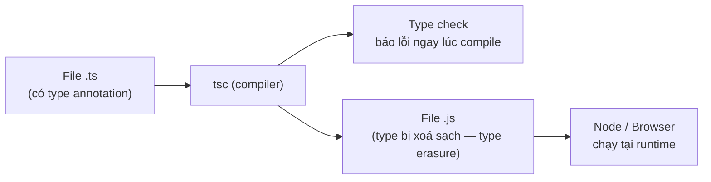

# TypeScript là gì?

**TypeScript** là một ngôn ngữ mở rộng của JavaScript, bổ sung **hệ thống kiểu tĩnh** (static typing) để bắt lỗi ngay khi viết code thay vì lúc chạy. Bài này giúp người mới nắm bản chất của TypeScript và cách nó phối hợp với JavaScript.

---

:::note[Ghi nhớ nhanh]

- ⭐ **TS là superset của JavaScript** — do Microsoft phát triển từ 2012; mọi code JS hợp lệ đều là code TS hợp lệ, TS chỉ thêm vào chứ không bỏ đi.
- ⭐ **Type erasure** — mọi type annotation (`: string`, `interface`, `type`) bị xoá sạch khi compile, nên không thể check type tại runtime; muốn validate dữ liệu runtime phải dùng **Zod**, **io-ts** hoặc viết type guard thủ công.
- **Luồng chạy 3 bước** — `[.ts]` → `tsc` → `[.js]` → Node/Browser; TS không có runtime riêng.
- **Interoperability với JS** — dùng thư viện JS cần file declaration `.d.ts`; phần lớn có sẵn qua `@types/*` trên DefinitelyTyped.
- **Migration dần** — bật `allowJs`/`checkJs` để compile lẫn file `.js`; bật `noImplicitAny` để chặn implicit `any` (thứ vô hiệu hoá toàn bộ type-check).

:::

---

## Mục lục

- [Định nghĩa](#định-nghĩa)
- [Mục tiêu của TypeScript](#mục-tiêu-của-typescript)
- [TypeScript hoạt động ra sao?](#typescript-hoạt-động-ra-sao)
- [Tương tác với JavaScript](#tương-tác-với-javascript)
- [Câu hỏi phỏng vấn](#câu-hỏi-phỏng-vấn)

---

## Định nghĩa

**TypeScript (TS)** là một **superset** của JavaScript do Microsoft phát
triển từ năm 2012. "Superset" nghĩa là **mọi code JavaScript hợp lệ đều
là code TypeScript hợp lệ** — TS chỉ thêm vào, không bỏ đi.

TS bổ sung hai thứ chính:

1. **Hệ thống type tĩnh** (static typing) — kiểm tra kiểu tại compile-time.
2. **Tính năng ngôn ngữ hiện đại** — sau đó được compile (transpile) về
   JavaScript chạy được trên trình duyệt/Node.

```ts
// TypeScript
function greet(name: string): string {
  return `Hello ${name}`;
}
```

```js
// Sau khi compile → JavaScript
function greet(name) {
  return "Hello " + name;
}
```

---

## Mục tiêu của TypeScript

TypeScript ra đời để giải quyết vấn đề của JavaScript khi dự án lớn lên:

- **Phát hiện lỗi sớm** ngay khi code, không đợi runtime.
- **Tự động hoàn thành code (IntelliSense)** chính xác hơn nhờ biết kiểu.
- **Refactor an toàn** — đổi tên hàm/biến không sợ vỡ chỗ khác.
- **Tài liệu hóa code bằng chính type** — type vừa là constraint, vừa là doc.

---

## TypeScript hoạt động ra sao?

TypeScript là ngôn ngữ **compile-time** — không có runtime riêng. Quá
trình chạy gồm 3 bước:

```
[file .ts]  →  tsc (compiler)  →  [file .js]  →  Node / Browser chạy
```

Sơ đồ dưới đây tóm tắt luồng biên dịch: `tsc` vừa **check type** (báo lỗi ngay lúc compile), vừa **sinh ra file .js** đã bị xoá sạch type để runtime chạy:



:::info[Phân tích]

**Type erasure**: tất cả type annotation (`: string`, `: number`,
`interface`, `type`) bị **xoá hoàn toàn** khi compile. Code JS sinh ra
không biết gì về type. Hệ quả:

- **Không thể** check type tại runtime bằng `typeof MyInterface`.
- Muốn validate dữ liệu runtime (API response, user input) phải dùng
  thư viện như **Zod**, **io-ts**, hoặc viết type guard thủ công.

```ts
interface User { id: number; name: string; }

function isUser(x: unknown): x is User {
  return typeof x === "object" && x !== null
    && "id" in x && "name" in x;
}
```

:::

---

## Tương tác với JavaScript

TS và JS sống chung được trong cùng project — gọi là **interoperability**.

**Bạn có thể:**

- Đổi tên file `.js` → `.ts` và TS sẽ chấp nhận (nhưng kiểu mặc định là
  `any`).
- Import file `.js` từ file `.ts` bình thường.
- Dùng thư viện JS thuần có sẵn trên npm.

**Để TS hiểu type của thư viện JS**, cần file **type declaration** (đuôi
`.d.ts`). Phần lớn thư viện phổ biến đã có sẵn trên **DefinitelyTyped**
(npm namespace `@types/*`):

```bash
npm install lodash
npm install --save-dev @types/lodash
```

:::tip[Mẹo]

Bật flag `allowJs: true` trong `tsconfig.json` để TS compile cả file `.js`.
Kết hợp `checkJs: true` để TS check type cả trong file `.js` qua JSDoc —
chiến lược **migration dần dần** từ JS sang TS mà không phải đổi toàn bộ
codebase một lúc.

:::

:::warning[Cần lưu ý]

Khai báo `: any` hoặc gặp **implicit any** sẽ **vô hiệu hoá toàn bộ
type-check** cho biến đó — TS sẽ im lặng cho qua mọi thứ. Đây là cách
"lách luật" nguy hiểm nhất. Bật `noImplicitAny: true` trong `tsconfig.json`
để TS báo lỗi khi gặp implicit any.

:::

---

## Câu hỏi phỏng vấn

Những câu thường gặp về chủ đề này. Tự trả lời trước, rồi đối chiếu lại với nội dung phía trên.

1. TypeScript là gì, và vì sao nói nó là **superset** của JavaScript? Điều đó có đồng nghĩa với việc đổi mọi file `.js` thành `.ts` là chạy được ngay không?
2. TypeScript bổ sung thêm những gì so với JavaScript, và nó **không** bổ sung thứ gì (về mặt runtime)?
3. **Type erasure** là gì? Sau khi `tsc` biên dịch, những thành phần nào trong code TypeScript biến mất hoàn toàn khỏi file `.js` output?
4. Vì sao không thể viết `typeof MyInterface` hay `x instanceof MyInterface` để kiểm tra kiểu tại runtime? Giải thích theo cơ chế biên dịch.
5. Nếu type bị xoá lúc compile, làm sao đảm bảo dữ liệu trả về từ API đúng shape? Kể vài hướng xử lý (thư viện hoặc tự viết).
6. Hàm có return type `x is User` khác gì hàm trả về `boolean` thông thường? Compiler dùng thông tin đó để làm gì?
7. TypeScript có runtime riêng không? Mô tả luồng từ file `.ts` cho tới lúc code thực sự chạy trên Node hoặc trình duyệt.
8. File `.d.ts` là gì và khi nào bạn cần đến nó? Kho **DefinitelyTyped** với namespace `@types/*` giải quyết vấn đề gì?
9. Cài `lodash` mà quên cài `@types/lodash` thì compiler báo lỗi gì, và có mấy cách xử lý tình huống này?
10. `allowJs` và `checkJs` khác nhau ra sao? Dùng hai flag đó để migrate dần một codebase JavaScript lớn sang TypeScript như thế nào?
11. **Implicit any** là gì và vì sao nó nguy hiểm hơn `any` được khai báo tường minh? Flag nào chặn được nó?
12. Vì sao nói `any` "vô hiệu hoá toàn bộ type-check" cho biến đó? Cho một ví dụ lỗi lọt qua compiler chỉ vì `any`.
13. Đoán kết quả biên dịch của `const s: string = JSON.parse(raw);` — compiler có chặn không, và vì sao đây vẫn là bug tiềm ẩn?
14. Dùng TypeScript có làm chương trình chạy chậm hơn JavaScript thuần không? Trả lời dựa trên cơ chế type erasure.
