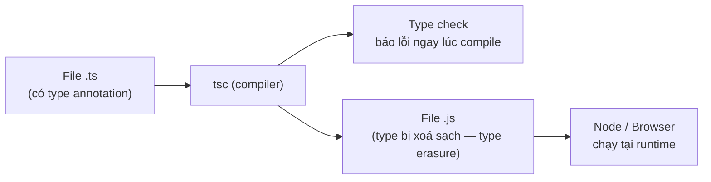

# TypeScript là gì?

**TypeScript** là một ngôn ngữ mở rộng của JavaScript, bổ sung **hệ thống kiểu tĩnh** (static typing) để bắt lỗi ngay khi viết code thay vì lúc chạy. Bài này giúp người mới nắm bản chất của TypeScript và cách nó phối hợp với JavaScript.

[](pathname:///img/typescript/typescript-la-gi.webp)

---

:::note[Ghi nhớ nhanh]

- ⭐ **TS là superset của JavaScript** — do Microsoft phát triển từ 2012; mọi code JS hợp lệ đều là code TS hợp lệ, TS chỉ thêm vào chứ không bỏ đi.
- ⭐ **Type erasure** — mọi type annotation (`: string`, `interface`, `type`) bị xoá sạch khi compile, nên không thể check type tại runtime; muốn validate dữ liệu runtime phải dùng **Zod**, **io-ts** hoặc viết type guard thủ công.
- **Luồng chạy 3 bước** — `[.ts]` → `tsc` → `[.js]` → Node/Browser; TS không có runtime riêng.
- **Interoperability với JS** — dùng thư viện JS cần file declaration `.d.ts`; phần lớn có sẵn qua `@types/*` trên DefinitelyTyped.
- **Migration dần** — bật `allowJs`/`checkJs` để compile lẫn file `.js`; bật `noImplicitAny` để chặn implicit `any` (thứ vô hiệu hoá toàn bộ type-check).

:::

---

## Mục lục

- [Định nghĩa](#định-nghĩa)
- [Mục tiêu của TypeScript](#mục-tiêu-của-typescript)
- [TypeScript hoạt động ra sao?](#typescript-hoạt-động-ra-sao)
- [Tương tác với JavaScript](#tương-tác-với-javascript)
- [Câu hỏi phỏng vấn](#câu-hỏi-phỏng-vấn)

---

## Định nghĩa

**TypeScript (TS)** là một **superset** của JavaScript do Microsoft phát
triển từ năm 2012. "Superset" nghĩa là **mọi code JavaScript hợp lệ đều
là code TypeScript hợp lệ** — TS chỉ thêm vào, không bỏ đi.

TS bổ sung hai thứ chính:

1. **Hệ thống type tĩnh** (static typing) — kiểm tra kiểu tại compile-time.
2. **Tính năng ngôn ngữ hiện đại** — sau đó được compile (transpile) về
   JavaScript chạy được trên trình duyệt/Node.

```ts
// TypeScript
function greet(name: string): string {
  return `Hello ${name}`;
}
```

```js
// Sau khi compile → JavaScript
function greet(name) {
  return "Hello " + name;
}
```

---

## Mục tiêu của TypeScript

TypeScript ra đời để giải quyết vấn đề của JavaScript khi dự án lớn lên:

- **Phát hiện lỗi sớm** ngay khi code, không đợi runtime.
- **Tự động hoàn thành code (IntelliSense)** chính xác hơn nhờ biết kiểu.
- **Refactor an toàn** — đổi tên hàm/biến không sợ vỡ chỗ khác.
- **Tài liệu hóa code bằng chính type** — type vừa là constraint, vừa là doc.

---

## TypeScript hoạt động ra sao?

TypeScript là ngôn ngữ **compile-time** — không có runtime riêng. Quá
trình chạy gồm 3 bước:

```
[file .ts]  →  tsc (compiler)  →  [file .js]  →  Node / Browser chạy
```

Sơ đồ dưới đây tóm tắt luồng biên dịch: `tsc` vừa **check type** (báo lỗi ngay lúc compile), vừa **sinh ra file .js** đã bị xoá sạch type để runtime chạy:



:::info[Phân tích]

**Type erasure**: tất cả type annotation (`: string`, `: number`,
`interface`, `type`) bị **xoá hoàn toàn** khi compile. Code JS sinh ra
không biết gì về type. Hệ quả:

- **Không thể** check type tại runtime bằng `typeof MyInterface`.
- Muốn validate dữ liệu runtime (API response, user input) phải dùng
  thư viện như **Zod**, **io-ts**, hoặc viết type guard thủ công.

```ts
interface User { id: number; name: string; }

function isUser(x: unknown): x is User {
  return typeof x === "object" && x !== null
    && "id" in x && "name" in x;
}
```

:::

---

## Tương tác với JavaScript

TS và JS sống chung được trong cùng project — gọi là **interoperability**.

**Bạn có thể:**

- Đổi tên file `.js` → `.ts` và TS sẽ chấp nhận (nhưng kiểu mặc định là
  `any`).
- Import file `.js` từ file `.ts` bình thường.
- Dùng thư viện JS thuần có sẵn trên npm.

**Để TS hiểu type của thư viện JS**, cần file **type declaration** (đuôi
`.d.ts`). Phần lớn thư viện phổ biến đã có sẵn trên **DefinitelyTyped**
(npm namespace `@types/*`):

```bash
npm install lodash
npm install --save-dev @types/lodash
```

:::tip[Mẹo]

Bật flag `allowJs: true` trong `tsconfig.json` để TS compile cả file `.js`.
Kết hợp `checkJs: true` để TS check type cả trong file `.js` qua JSDoc —
chiến lược **migration dần dần** từ JS sang TS mà không phải đổi toàn bộ
codebase một lúc.

:::

:::warning[Cần lưu ý]

Khai báo `: any` hoặc gặp **implicit any** sẽ **vô hiệu hoá toàn bộ
type-check** cho biến đó — TS sẽ im lặng cho qua mọi thứ. Đây là cách
"lách luật" nguy hiểm nhất. Bật `noImplicitAny: true` trong `tsconfig.json`
để TS báo lỗi khi gặp implicit any.

:::

---

## Câu hỏi phỏng vấn

Những câu thường gặp về chủ đề này. Tự trả lời trước, rồi bấm **Xem đáp án** để đối chiếu.

**1. TypeScript là gì, và vì sao nói nó là superset của JavaScript? Điều đó có đồng nghĩa với việc đổi mọi file `.js` thành `.ts` là chạy được ngay không?**

<details className="qa">
<summary>Xem đáp án</summary>

**TypeScript** là ngôn ngữ do Microsoft phát triển từ năm 2012, bổ sung **hệ thống type tĩnh** lên trên JavaScript rồi compile (transpile) ngược về JS thuần để chạy trên Node/trình duyệt.

Gọi là **superset** vì TS **chỉ thêm vào, không bỏ đi**: mọi cú pháp JavaScript hợp lệ đều là cú pháp TypeScript hợp lệ — vòng tròn JS nằm trọn trong vòng tròn TS.

Nhưng "đổi đuôi là chạy được ngay" cần hiểu đúng ở hai mức:

- **Chạy được**: có. Sau khi compile, type bị xoá sạch nên output gần như chính là file JS ban đầu.
- **Compile sạch lỗi**: chưa chắc. File `.js` đổi thành `.ts` sẽ bị compiler soi kiểu — tham số không khai báo trở thành **implicit any**, và nếu bật `noImplicitAny` thì lỗi nổi lên hàng loạt.

Nói cách khác, "superset" đảm bảo *tính hợp lệ về cú pháp*, không đảm bảo *code qua được type-check*.

</details>

**2. TypeScript bổ sung thêm những gì so với JavaScript, và nó không bổ sung thứ gì (về mặt runtime)?**

<details className="qa">
<summary>Xem đáp án</summary>

**TS bổ sung (chỉ tồn tại ở compile-time):**

- Type annotation cho biến, tham số, giá trị trả về: `name: string`, `: void`.
- Các cách khai báo kiểu: `interface`, `type`, generic, union/intersection, enum.
- Type inference, type narrowing, type guard (`x is User`).
- Lợi ích tooling như bài đã nêu: phát hiện lỗi sớm, IntelliSense chính xác, refactor an toàn, type vừa là ràng buộc vừa là tài liệu.

**TS KHÔNG bổ sung gì ở runtime:**

- Không có runtime riêng, không có VM riêng, không có thư viện chuẩn riêng.
- Không thêm hàm hay API nào cho chương trình lúc chạy.
- Không tự kiểm tra kiểu khi chạy — trong file `.js` output không có "type checker" nào cả.

Đúng như sơ đồ trong bài: `tsc` làm hai việc — **check type** rồi **sinh file `.js` đã xoá sạch type**. Thứ thực sự chạy luôn là JavaScript thuần.

</details>

**3. Type erasure là gì? Sau khi `tsc` biên dịch, những thành phần nào trong code TypeScript biến mất hoàn toàn khỏi file `.js` output?**

<details className="qa">
<summary>Xem đáp án</summary>

**Type erasure** là việc compiler **xoá sạch mọi thông tin về type** khi sinh ra JavaScript. Code JS output không biết gì về hệ thống type đã dùng để viết ra nó.

Những thứ biến mất hoàn toàn:

- Type annotation: `: string`, `: number`, `: User`, kiểu trả về `: void`.
- Khai báo `interface` và `type` alias.
- Generic type parameter (`<T>`) cùng các ràng buộc `extends`.
- Type assertion: `as User`.
- Khai báo thuần type: `declare`, toàn bộ nội dung file `.d.ts`.

```ts
interface User { id: number }
function f(u: User): string { return String(u.id); }
```

```js
function f(u) { return String(u.id); }
```

Ngược lại, những thứ **sinh ra giá trị thật** thì vẫn còn: `class`, `enum` (trừ `const enum`), biến, hàm. Chỉ phần thuần type mới bị xoá.

</details>

**4. Vì sao không thể viết `typeof MyInterface` hay `x instanceof MyInterface` để kiểm tra kiểu tại runtime? Giải thích theo cơ chế biên dịch.**

<details className="qa">
<summary>Xem đáp án</summary>

Vì `interface` **không tồn tại sau khi compile**. Nó nằm trong "không gian type" của TypeScript, còn `typeof` và `instanceof` là toán tử JavaScript, chỉ làm việc với **giá trị** lúc runtime.

Chuỗi lý luận:

1. Bạn viết `interface User { id: number }`.
2. `tsc` dùng nó để check code, rồi **xoá nó đi** (type erasure).
3. File `.js` output không còn định danh `User` nào.
4. Nếu code đó chạy được tới runtime, JS sẽ báo `User is not defined` — nhưng thực tế bạn không tới được đó, vì chính compiler đã chặn trước với lỗi kiểu *"'User' only refers to a type, but is being used as a value here"*.

`instanceof` chỉ dùng được với **class**, vì class sinh ra một function thật ở runtime nên vẫn còn tồn tại. Muốn kiểm tra shape của một interface, phải tự viết **type guard** soi từng property như ví dụ `isUser` trong bài.

</details>

**5. Nếu type bị xoá lúc compile, làm sao đảm bảo dữ liệu trả về từ API đúng shape? Kể vài hướng xử lý (thư viện hoặc tự viết).**

<details className="qa">
<summary>Xem đáp án</summary>

Viết `const data: User = await res.json()` **không kiểm tra gì cả** — đó chỉ là lời hứa với compiler. Nếu API trả về thiếu field, TS vẫn tin và bug sẽ nổ ở chỗ khác. Dữ liệu từ bên ngoài (API, `localStorage`, user input, file config) bắt buộc phải được **validate ở runtime**.

Các hướng xử lý:

- **Thư viện schema validation**: **Zod**, **io-ts**, Yup, Valibot. Điểm mạnh của Zod là khai báo schema một lần rồi suy ra type TS từ chính schema đó, nên type và validation không bao giờ lệch nhau.
- **Tự viết type guard** — cách bài đã minh hoạ, không cần thêm dependency:

```ts
function isUser(x: unknown): x is User {
  return typeof x === "object" && x !== null
    && "id" in x && "name" in x;
}
```

- **Nhận dữ liệu ngoài dưới dạng `unknown`** thay vì `any`, để compiler buộc bạn narrow trước khi dùng.

Nguyên tắc: type lo compile-time, validation lo runtime — hai lớp bảo vệ khác nhau, không thay thế cho nhau.

</details>

**6. Hàm có return type `x is User` khác gì hàm trả về `boolean` thông thường? Compiler dùng thông tin đó để làm gì?**

<details className="qa">
<summary>Xem đáp án</summary>

`x is User` là **type predicate**: hàm vừa trả về `boolean` ở runtime, vừa nói với compiler rằng "nếu trả `true` thì trong nhánh đó `x` có kiểu `User`". Hàm khai báo trả `boolean` thường không mang theo thông tin ấy, nên compiler không **narrow** kiểu giúp bạn.

```ts
declare function isUserBool(x: unknown): boolean;
declare function isUser(x: unknown): x is User;

if (isUserBool(data)) {
  data.name; // lỗi: 'data' vẫn là unknown
}

if (isUser(data)) {
  data.name; // OK: đã được narrow thành User
}
```

Compiler dùng type predicate cho **control flow analysis**: trong nhánh `true`, biến được thu hẹp thành `User`; trong nhánh `else`, `User` bị loại khỏi union. Lưu ý quan trọng: TS **tin** bạn — nếu phần kiểm tra bên trong viết sai, compiler vẫn narrow như thường, nên type guard phải được viết cẩn thận.

</details>

**7. TypeScript có runtime riêng không? Mô tả luồng từ file `.ts` cho tới lúc code thực sự chạy trên Node hoặc trình duyệt.**

<details className="qa">
<summary>Xem đáp án</summary>

**Không.** TypeScript là ngôn ngữ **compile-time**, không có runtime, VM hay engine riêng. Thứ chạy thật luôn là JavaScript trên V8, SpiderMonkey hoặc JavaScriptCore.

Luồng 3 bước như bài đã nêu:

```
[file .ts]  →  tsc (compiler)  →  [file .js]  →  Node / Browser chạy
```

Ở bước `tsc`, compiler làm song song hai việc:

- **Type check**: phân tích và báo lỗi kiểu ngay lúc compile — đây chính là toàn bộ giá trị TS mang lại.
- **Emit**: sinh file `.js` đã xoá sạch type (type erasure), kèm hạ cấp cú pháp về phiên bản JS mong muốn.

Một điểm hay bị hiểu nhầm: hai việc này **độc lập nhau**. Mặc định, dù có lỗi type, `tsc` vẫn xuất ra file `.js` chạy được (muốn chặn thì bật `noEmitOnError`). Các công cụ tốc độ cao như `esbuild` hay `swc` chỉ *strip* type mà **không** check type, nên dự án vẫn cần chạy `tsc --noEmit` riêng để bắt lỗi.

</details>

**8. File `.d.ts` là gì và khi nào bạn cần đến nó? Kho DefinitelyTyped với namespace `@types/*` giải quyết vấn đề gì?**

<details className="qa">
<summary>Xem đáp án</summary>

**`.d.ts`** (type declaration file) là file **chỉ chứa khai báo type, không chứa code chạy được**. Nó mô tả cho compiler biết "module này export những gì, kiểu ra sao" mà không cần có source TypeScript.

Khi nào cần:

- Dùng một **thư viện viết bằng JS thuần** — bản thân file `.js` không mang type nào, TS cần `.d.ts` mới biết `lodash.chunk` nhận gì và trả gì.
- Khi bạn **publish một package viết bằng TS**: `tsc` sinh ra `.js` + `.d.ts` để người dùng khác vẫn có type.
- Khai báo biến global, module không có type, hoặc kiểu cho asset (`*.svg`, `*.css`).

**DefinitelyTyped** là kho cộng đồng chứa `.d.ts` cho hàng chục nghìn thư viện JS không tự kèm type, phát hành trên npm dưới namespace **`@types/*`**:

```bash
npm install lodash
npm install --save-dev @types/lodash
```

Nó giải quyết đúng bài toán: dùng được cả hệ sinh thái JS khổng lồ mà vẫn giữ được type safety, không phải chờ từng tác giả thư viện viết lại bằng TS.

</details>

**9. Cài `lodash` mà quên cài `@types/lodash` thì compiler báo lỗi gì, và có mấy cách xử lý tình huống này?**

<details className="qa">
<summary>Xem đáp án</summary>

Compiler báo lỗi đại ý: *"Could not find a declaration file for module 'lodash'. Try `npm i --save-dev @types/lodash`"* — tức TS tìm thấy file `.js` nhưng không tìm thấy khai báo type nào cho module đó.

Các cách xử lý, theo thứ tự nên ưu tiên:

- **Cài package type có sẵn**: `npm i -D @types/lodash`. Đây là cách đúng nhất nếu thư viện có mặt trên DefinitelyTyped.
- **Kiểm tra xem thư viện đã tự kèm type chưa** — nhiều package hiện đại viết bằng TS đã có sẵn `.d.ts`, khi đó không cần `@types/*`.
- **Tự viết file declaration** trong dự án, ví dụ `src/types/ten-thu-vien.d.ts`, khai báo những phần bạn thực sự dùng.
- **Khai báo tối thiểu để tạm bỏ qua**: `declare module "ten-thu-vien";` — nhanh nhưng module đó sẽ mang kiểu `any`, mất hết type safety.

Tránh cách "cùng đường" là ép `any` khắp nơi, vì như bài cảnh báo, `any` vô hiệu hoá toàn bộ type-check ở chỗ đó.

</details>

**10. `allowJs` và `checkJs` khác nhau ra sao? Dùng hai flag đó để migrate dần một codebase JavaScript lớn sang TypeScript như thế nào?**

<details className="qa">
<summary>Xem đáp án</summary>

| Flag | Tác dụng |
|---|---|
| `allowJs: true` | Cho phép `tsc` **nhận và compile** cả file `.js` nằm trong project — nhưng không kiểm tra kiểu bên trong chúng |
| `checkJs: true` | Bật thêm **type-check cho chính các file `.js`** đó, suy luận kiểu từ code và từ chú thích **JSDoc** |

Nói ngắn: `allowJs` là "cho phép vào nhà", `checkJs` là "soi kỹ luôn".

Chiến lược migrate dần cho codebase lớn:

1. Thêm `tsconfig.json`, bật `allowJs: true` — dự án vẫn chạy y nguyên, chưa có lỗi nào.
2. Bật `checkJs: true` (hoặc chỉ thêm `// @ts-check` ở đầu từng file để làm từ từ) và bổ sung JSDoc cho những module quan trọng.
3. Đổi dần từng file `.js` sang `.ts`, ưu tiên các module lõi và phần dùng lại nhiều.
4. Siết dần độ nghiêm: bật `noImplicitAny`, rồi tiến tới `strict`.

Ưu điểm lớn nhất là **không phải dừng phát triển để viết lại toàn bộ codebase một lượt**.

</details>

**11. Implicit any là gì và vì sao nó nguy hiểm hơn `any` được khai báo tường minh? Flag nào chặn được nó?**

<details className="qa">
<summary>Xem đáp án</summary>

**Implicit any** là khi TS **không suy luận được kiểu** nên tự gán `any` cho biến/tham số, dù bạn không hề viết chữ `any` nào:

```ts
function greet(name) {   // name: implicit any
  return name.toUpperCase();
}

greet(42); // compiler không hề cản — runtime mới nổ lỗi
```

Vì sao nguy hiểm hơn `any` tường minh:

- **Vô hình**: đọc code không thấy dấu hiệu nào cho biết chỗ đó đã mất type safety. Còn `: any` viết rõ ràng thì ít nhất là một quyết định có ý thức, reviewer nhìn thấy được và có thể grep ra.
- **Lan rộng âm thầm**: kiểu `any` lây sang giá trị trả về, rồi sang mọi chỗ dùng kết quả đó.
- Thường xuất hiện hàng loạt khi mới đổi file `.js` sang `.ts`, tạo cảm giác "code đã có type" trong khi thực chất chưa được bảo vệ.

Chặn bằng **`noImplicitAny: true`** trong `tsconfig.json` (đã nằm sẵn trong `strict: true`). Khi đó compiler bắt bạn khai báo kiểu tường minh ở mọi chỗ nó không tự suy ra được.

</details>

**12. Vì sao nói `any` "vô hiệu hoá toàn bộ type-check" cho biến đó? Cho một ví dụ lỗi lọt qua compiler chỉ vì `any`.**

<details className="qa">
<summary>Xem đáp án</summary>

Vì `any` nghĩa là "đừng kiểm tra gì cả". Với một giá trị `any`, compiler cho phép **mọi thao tác**: truy cập property không tồn tại, gọi như hàm, gán sang bất kỳ kiểu nào khác. Nó là cửa thoát hiểm tắt hẳn type system, chứ không phải "kiểu chung chung".

```ts
const data: any = { name: "Thuan" };

data.foo.bar;        // compiler im lặng → runtime: TypeError
data();              // compiler im lặng → runtime: not a function
const n: number = data.name; // gán string vào number, vẫn lọt

const list: any = "khong phai mang";
list.forEach((x: string) => console.log(x)); // runtime: not a function
```

Tệ hơn, `any` **lây lan**: giá trị `any` gán vào đâu thì chỗ đó cũng mất type safety theo.

Giải pháp an toàn khi thật sự chưa biết kiểu là dùng **`unknown`**: nó cũng nhận mọi giá trị, nhưng compiler **bắt buộc bạn narrow** (qua `typeof`, `in`, type guard) trước khi được phép dùng.

</details>

**13. Đoán kết quả biên dịch của `const s: string = JSON.parse(raw);` — compiler có chặn không, và vì sao đây vẫn là bug tiềm ẩn?**

<details className="qa">
<summary>Xem đáp án</summary>

**Compiler không chặn** — dòng này biên dịch sạch sẽ, không một cảnh báo nào.

Lý do: chữ ký của `JSON.parse` trong thư viện chuẩn trả về **`any`**. Mà `any` gán được sang bất kỳ kiểu nào, nên gán vào `string` là hợp lệ dưới mắt compiler.

Vì sao vẫn là bug tiềm ẩn:

```ts
const raw = '{"id": 1}';
const s: string = JSON.parse(raw); // compile OK
s.toUpperCase();                   // runtime: s.toUpperCase is not a function
```

`s` thực tế là một object, nhưng compiler tưởng là `string` nên vui vẻ cho gọi `.toUpperCase()`. Đây chính là minh hoạ kinh điển cho ý "type không tồn tại ở runtime": annotation chỉ là lời khai báo ý định, không phải kiểm tra.

Cách xử lý đúng: coi kết quả parse là **`unknown`** rồi validate trước khi dùng — bằng type guard tự viết hoặc schema của **Zod**/**io-ts**, đúng như phần type erasure trong bài đã khuyến nghị.

</details>

**14. Dùng TypeScript có làm chương trình chạy chậm hơn JavaScript thuần không? Trả lời dựa trên cơ chế type erasure.**

<details className="qa">
<summary>Xem đáp án</summary>

**Không.** Nhờ **type erasure**, toàn bộ type annotation, `interface`, generic đều bị xoá lúc compile. File `.js` sinh ra về cơ bản giống hệt code JS bạn sẽ tự viết tay, và engine chạy nó với đúng tốc độ đó. TypeScript không thêm bất kỳ phép kiểm tra nào vào runtime.

Chi phí của TS nằm ở chỗ khác — **thời gian build**, không phải thời gian chạy:

- `tsc` phải phân tích và check kiểu toàn dự án, nên build lâu hơn; dự án lớn có thể mất vài chục giây.
- Đổi lại có thể dùng `esbuild`/`swc` để strip type cực nhanh cho bước build, và chạy `tsc --noEmit` riêng để check kiểu.

Vài lưu ý nhỏ: nếu đặt `target` quá thấp, compiler phải hạ cấp cú pháp hiện đại thành code dài hơn (ví dụ `async/await` thành state machine), khiến bundle to hơn — nhưng đó là chi phí của downlevel, không phải của type. Ngược lại, TS còn gián tiếp giúp hiệu năng vì khuyến khích kiểu ổn định, hợp với cách engine tối ưu.

</details>
