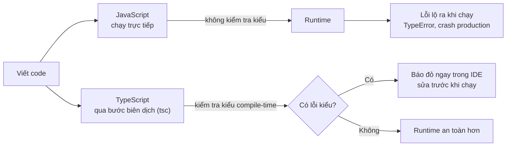

# TypeScript vs JavaScript

Bài này so sánh **TypeScript** và **JavaScript** để bạn hiểu khi nào nên dùng cái nào. Khác biệt cốt lõi nằm ở chỗ JavaScript là ngôn ngữ **dynamic typing** (kiểu động — xác định khi chạy), còn TypeScript là **static typing** (kiểu tĩnh — kiểm tra khi biên dịch). Nhờ đó TypeScript phát hiện lỗi tại **compile-time** (lúc biên dịch) thay vì để lỗi xảy ra tại **runtime** (lúc chạy) như JavaScript.

[](pathname:///img/typescript/ts-vs-js.webp)

---

:::note[Ghi nhớ nhanh]

- ⭐ **Static vs dynamic typing** — JS là dynamic (kiểu xác định lúc chạy), TS là static (khai báo trước, kiểm tra lúc compile) nên bắt lỗi tại compile-time thay vì runtime.
- ⭐ **TS dùng structural typing** — hai type khác tên nhưng cùng "shape" thì tương thích, khác nominal typing của Java/C#; linh hoạt nhưng dễ sinh bug "trùng shape".
- **Type không tồn tại tại runtime** — code pass compile vẫn có thể crash; `as` chỉ "nói dối" TS, phải validate ở biên hệ thống (API, user input, file).
- **Khi nào nên dùng** — project trung bình–lớn, nhiều người, dài hạn; có thể bỏ qua với script nhỏ một file hoặc prototype nhanh.
- **Mẹo** — chọn TypeScript template ngay khi tạo project mới (Next.js, NestJS...) sẽ ít công hơn migrate sau.

:::

---

## Mục lục

- [So sánh tổng quan](#so-sánh-tổng-quan)
- [Static typing vs Dynamic typing](#static-typing-vs-dynamic-typing)
- [Compile-time vs Runtime](#compile-time-vs-runtime)
- [Khi nào nên dùng TypeScript?](#khi-nào-nên-dùng-typescript)
- [Câu hỏi phỏng vấn](#câu-hỏi-phỏng-vấn)

---

## So sánh tổng quan

| Tiêu chí | JavaScript | TypeScript |
|----------|-----------|------------|
| Loại | Ngôn ngữ chạy thực thi | Superset của JS, compile thành JS |
| Type system | Dynamic, weak | Static, structural |
| Phát hiện lỗi | Runtime | Compile-time |
| Tooling (IDE hint) | Hạn chế | Mạnh (IntelliSense, refactor) |
| Cần build step? | Không (chạy trực tiếp) | Có (qua `tsc` hoặc bundler) |
| Học khó hơn? | Dễ hơn | Cần học type + JS |
| File extension | `.js`, `.mjs`, `.cjs` | `.ts`, `.tsx` |

---

## Static typing vs Dynamic typing

JavaScript là **dynamic** — kiểu được xác định tại lúc chạy:

```js
let x = 10;
x = "hello"; // OK
x = true;    // OK
```

TypeScript là **static** — kiểu được khai báo trước, kiểm tra tại compile:

```ts
let x: number = 10;
x = "hello"; // Error: Type 'string' is not assignable to type 'number'
```

:::info[Phân tích]

TypeScript dùng **structural typing** (kiểu cấu trúc), không phải
**nominal typing** (kiểu định danh) như Java/C#.

Hai type khác tên nhưng cùng "hình dạng" thì **tương thích**:

```ts
interface Point { x: number; y: number; }
interface Coord { x: number; y: number; }

const p: Point = { x: 1, y: 2 };
const c: Coord = p; // OK — cùng shape
```

Đây là lý do TypeScript rất linh hoạt khi làm việc với object literal,
nhưng cũng là nguồn của một số bug "trùng shape không mong muốn".

:::

---

## Compile-time vs Runtime

JavaScript chỉ kiểm tra lỗi khi code thực sự chạy:

```js
const user = { name: "An" };
console.log(user.age.toFixed(2)); // TypeError tại runtime
```

TypeScript bắt lỗi ngay khi viết:

```ts
const user = { name: "An" };
console.log(user.age.toFixed(2));
// Error: Property 'age' does not exist on type '{ name: string; }'
```

Sơ đồ dưới đây cho thấy thời điểm phát hiện lỗi khác nhau giữa hai ngôn ngữ:



:::warning[Cần lưu ý]

Type của TypeScript **không tồn tại tại runtime**. Code dưới đây pass
compile nhưng vẫn có thể crash:

```ts
function process(data: User) {
  console.log(data.name.toUpperCase());
}

// Dữ liệu từ API có thể không đúng type
const apiData = JSON.parse(response) as User; // 'as' chỉ nói dối TS
process(apiData); // Crash nếu apiData.name không phải string
```

→ Phải **validate runtime** ở biên hệ thống (API, user input, file).
Đừng tin tưởng `as` để bỏ qua kiểm tra.

:::

---

## Khi nào nên dùng TypeScript?

**Nên dùng:**

- Project trung bình – lớn (≥ vài nghìn dòng code).
- Nhiều người cùng làm.
- Dự án dài hạn, cần maintain.
- Backend Node.js, frontend React/Next.js production.

**Có thể bỏ qua:**

- Script nhỏ một file, dùng một lần.
- Prototype nhanh để demo concept.
- Học JS thuần lần đầu (nên nắm JS trước rồi học TS).

:::tip[Mẹo]

Các framework hiện đại (Next.js, Nuxt, Remix, NestJS, Astro) đều có
**TypeScript template** mặc định. Khi tạo project mới, chọn template
TypeScript ngay từ đầu sẽ ít công hơn là migrate sau.

:::

---

## Câu hỏi phỏng vấn

Những câu thường gặp về chủ đề này. Tự trả lời trước, rồi bấm **Xem đáp án** để đối chiếu.

**1. Static typing và dynamic typing khác nhau ở điểm nào? JavaScript và TypeScript thuộc nhóm nào?**

<details className="qa">
<summary>Xem đáp án</summary>

| Tiêu chí | Dynamic typing | Static typing |
|---|---|---|
| Kiểu gắn với | Giá trị, xác định lúc chạy | Biến, khai báo/suy luận trước |
| Thời điểm kiểm tra | Runtime | Compile-time |
| Đại diện | JavaScript, Python, Ruby | TypeScript, Java, C#, Rust |

**JavaScript là dynamic** — một biến đổi kiểu thoải mái mà không ai cản:

```js
let x = 10;
x = "hello"; // OK
x = true;    // OK
```

**TypeScript là static** — kiểu được khai báo trước và kiểm tra lúc compile:

```ts
let x: number = 10;
x = "hello"; // Error: Type 'string' is not assignable to type 'number'
```

Đánh đổi: dynamic viết nhanh, linh hoạt, không cần build; static bắt lỗi sớm, tooling mạnh, an toàn khi codebase lớn. Lưu ý TS chỉ static ở tầng compile — khi chạy thì vẫn là JavaScript dynamic như cũ.

</details>

**2. Compile-time và runtime khác nhau thế nào? Cho một ví dụ lỗi mà TypeScript bắt được lúc biên dịch còn JavaScript chỉ lộ ra lúc chạy.**

<details className="qa">
<summary>Xem đáp án</summary>

- **Compile-time**: lúc `tsc` đọc và phân tích code, trước khi chương trình chạy. Lỗi hiện ngay trong IDE, sửa xong mới chạy.
- **Runtime**: lúc code thực sự thực thi trên Node/trình duyệt. Lỗi ở đây nghĩa là người dùng đã gặp — crash production.

Ví dụ trong bài:

```js
// JavaScript — im lặng cho tới lúc chạy
const user = { name: "An" };
console.log(user.age.toFixed(2)); // TypeError tại runtime
```

```ts
// TypeScript — báo đỏ ngay khi viết
const user = { name: "An" };
console.log(user.age.toFixed(2));
// Error: Property 'age' does not exist on type '{ name: string; }'
```

Giá trị cốt lõi của TypeScript nằm đúng ở chỗ này: **dời thời điểm phát hiện lỗi từ runtime lên compile-time**. Lỗi phát hiện càng sớm thì càng rẻ — sửa lúc gõ code rẻ hơn rất nhiều so với sửa khi đã lên production.

</details>

**3. Structural typing là gì? Vì sao hai `interface` khác tên nhưng cùng shape lại gán được cho nhau?**

<details className="qa">
<summary>Xem đáp án</summary>

**Structural typing** (kiểu cấu trúc) nghĩa là TypeScript xác định hai type có tương thích hay không dựa trên **hình dạng (shape)** của chúng — có những property nào, kiểu gì — chứ không dựa vào tên type hay quan hệ kế thừa được khai báo.

```ts
interface Point { x: number; y: number; }
interface Coord { x: number; y: number; }

const p: Point = { x: 1, y: 2 };
const c: Coord = p; // OK — cùng shape
```

Compiler chỉ hỏi: "`Point` có đủ mọi thứ mà `Coord` yêu cầu không?" Có, nên gán được. Tên `Point` hay `Coord` hoàn toàn không liên quan.

Quy tắc kèm theo là **có thừa vẫn được, thiếu thì không**: object nhiều property hơn yêu cầu vẫn gán được (trừ trường hợp excess property check với object literal), nhưng thiếu một property bắt buộc là lỗi ngay.

Cách tiếp cận này giúp TS ăn khớp tự nhiên với văn hoá JavaScript — nơi người ta truyền object literal khắp nơi mà không khai báo class trước.

</details>

**4. Nominal typing của Java hay C# khác structural typing ra sao? Hệ quả thực tế khi thiết kế type trong TypeScript là gì?**

<details className="qa">
<summary>Xem đáp án</summary>

| | Structural (TypeScript) | Nominal (Java, C#) |
|---|---|---|
| Căn cứ tương thích | Shape — có đủ property đúng kiểu | Tên type và quan hệ `implements`/`extends` khai báo tường minh |
| Tạo tương thích | Tự động, chỉ cần cùng shape | Phải khai báo rõ ràng |
| Ưu | Linh hoạt, hợp với object literal, dễ mock trong test | Chặt chẽ, không nhầm hai khái niệm khác nhau |
| Nhược | Hai khái niệm khác nhau có thể vô tình hoán đổi | Nhiều boilerplate, cứng nhắc |

**Hệ quả thực tế khi thiết kế type trong TS:**

- Không cần `implements` để một object "khớp" một interface — viết đúng shape là đủ. Test dễ hơn nhiều vì chỉ cần object giả có đúng field.
- Nhưng phải cảnh giác với bug **"trùng shape không mong muốn"**: `interface Meters { value: number }` và `interface Feet { value: number }` hoán đổi được cho nhau, dù về mặt nghiệp vụ là hai thứ hoàn toàn khác.
- Khi cần phân biệt thật sự, phải chủ động tạo khác biệt về shape — dùng **branded type** hoặc thêm một field phân biệt (discriminant).

</details>

**5. "Duck typing" liên quan gì tới cơ chế structural typing của TypeScript?**

<details className="qa">
<summary>Xem đáp án</summary>

**Duck typing** xuất phát từ câu: *"Nếu nó đi như vịt và kêu như vịt thì nó là vịt"* — không quan tâm object thuộc class nào, chỉ cần nó có đủ method/property cần dùng. Đây là cách các ngôn ngữ dynamic như JavaScript, Python vận hành: gọi `obj.quack()` và hy vọng object đó có `quack`.

**Structural typing** là phiên bản **kiểm tra được lúc compile** của chính ý tưởng đó. Cả hai đều xét theo shape; khác biệt nằm ở thời điểm:

- **Duck typing** (JS): kiểm tra lúc chạy — thiếu method thì crash.
- **Structural typing** (TS): kiểm tra lúc biên dịch — thiếu property là báo lỗi ngay, chưa kịp chạy.

```ts
interface Duck { quack(): void }

function makeSound(d: Duck) { d.quack(); }

makeSound({ quack: () => console.log("quack!") }); // OK, không cần class Duck
makeSound({ bark: () => {} });                     // Error ngay lúc compile
```

Có thể nói structural typing chính là cách TypeScript giữ lại tinh thần duck typing rất "JavaScript", nhưng bổ sung lưới an toàn ở compile-time.

</details>

**6. Nếu muốn hai kiểu cùng shape nhưng không được gán lẫn nhau (ví dụ `UserId` và `OrderId` cùng là `string`), bạn làm cách nào? Gợi ý: branded type.**

<details className="qa">
<summary>Xem đáp án</summary>

Vì TS là structural, `type UserId = string` và `type OrderId = string` là **cùng một kiểu** — hoán đổi thoải mái, rất dễ truyền nhầm id. Giải pháp là **branded type** (còn gọi nominal typing giả lập): gắn thêm một property "ảo" chỉ tồn tại ở tầng type để hai kiểu khác shape nhau.

```ts
type Brand<T, B> = T & { readonly __brand: B };

type UserId = Brand<string, "UserId">;
type OrderId = Brand<string, "OrderId">;

const asUserId = (s: string) => s as UserId;

function getUser(id: UserId) { /* ... */ }

const uid = asUserId("u_1");
getUser(uid);            // OK
getUser("u_1");          // Error: string không phải UserId
getUser("o_9" as OrderId); // Error: OrderId không phải UserId
```

Ở runtime `uid` vẫn chỉ là một string bình thường — `__brand` bị xoá sạch khi compile, không tốn gì cả. Cách dùng chuẩn là đưa việc "đóng dấu" vào một hàm factory có validate, để mọi giá trị mang brand đều đã được kiểm tra thật sự.

</details>

**7. Excess property check là gì? Vì sao gán trực tiếp một object literal dư property thì lỗi, nhưng gán qua biến trung gian lại không?**

<details className="qa">
<summary>Xem đáp án</summary>

**Excess property check** là một kiểm tra thêm mà TS chỉ áp dụng cho **object literal gán trực tiếp** vào một vị trí có kiểu xác định: nếu literal có property không nằm trong type đích thì báo lỗi.

```ts
interface Point { x: number; y: number; }

const p1: Point = { x: 1, y: 2, z: 3 };
// Error: Object literal may only specify known properties, 'z' does not exist

const tmp = { x: 1, y: 2, z: 3 };
const p2: Point = tmp; // OK — không còn là object literal trực tiếp
```

Vì sao có sự khác nhau? Theo luật structural thuần tuý thì "thừa property vẫn tương thích", nên trường hợp thứ hai hợp lệ. Nhưng với object literal viết tại chỗ, property thừa gần như luôn là **lỗi gõ nhầm tên** (`colour` thay vì `color`) hoặc hiểu sai API — không ai cố ý tạo ra một property rồi vứt đi ngay. Vì vậy TS cố tình nghiêm khắc hơn ở đúng tình huống đó.

Muốn cho phép property thừa một cách có chủ đích: gán qua biến trung gian, dùng `as`, hoặc khai báo index signature trong type.

</details>

**8. `as` (type assertion) làm gì tại runtime? Vì sao nói `as` chỉ "nói dối" compiler chứ không hề chuyển đổi giá trị?**

<details className="qa">
<summary>Xem đáp án</summary>

Tại runtime, `as` **không làm gì cả** — nó bị xoá hoàn toàn khi compile, giống mọi thông tin type khác. Nó không ép kiểu, không parse, không validate, không tạo object mới.

`as` chỉ là một lời khẳng định gửi tới compiler: *"tin tôi đi, giá trị này có kiểu X"*. Compiler chấp nhận và ngừng kiểm tra, còn giá trị thật thì vẫn nguyên như cũ.

```ts
const n = "123" as unknown as number;
console.log(typeof n); // "string" — vẫn là chuỗi!
console.log(n.toFixed(2)); // runtime: n.toFixed is not a function
```

So sánh cho rõ:

- **`as`** — thao tác compile-time, zero code sinh ra, không an toàn.
- **`Number("123")`, `String(x)`, `JSON.parse`** — hàm JavaScript thật, thực sự chuyển đổi giá trị lúc chạy.

Đúng như cảnh báo trong bài: dùng `as` để "cho qua" lỗi đỏ là tự tay tháo lưới an toàn. Khi chưa chắc về dữ liệu, hãy dùng `unknown` rồi narrow bằng type guard, thay vì `as` bừa.

</details>

**9. Đoạn `const u = JSON.parse(res) as User; u.name.toUpperCase();` pass compile — vì sao vẫn có thể crash ở production?**

<details className="qa">
<summary>Xem đáp án</summary>

Vì `as User` **không kiểm tra gì cả**. `JSON.parse` trả về `any`, còn `as User` chỉ nói với compiler rằng "coi giá trị này là `User`". Sau khi compile, dòng đó chỉ còn `const u = JSON.parse(res);` — không có một phép kiểm tra nào lọt vào file `.js`.

Nên chỉ cần thực tế khác kỳ vọng là crash:

```ts
// res = '{"id": 1}'         → u.name là undefined
// res = '{"name": 123}'     → u.name là number
u.name.toUpperCase();
// TypeError: Cannot read properties of undefined (reading 'toUpperCase')
```

Compiler tin bạn, còn server thì không. Backend đổi field, API trả lỗi dạng khác, dữ liệu cũ trong `localStorage`... đều làm giả định vỡ.

Cách viết đúng: coi kết quả parse là `unknown` rồi validate trước khi dùng — bằng type guard tự viết, hoặc schema của Zod/io-ts. Khi đó nhánh dữ liệu sai được xử lý tử tế thay vì nổ giữa production.

</details>

**10. Những vị trí nào trong hệ thống bắt buộc phải validate runtime dù đã dùng TypeScript?**

<details className="qa">
<summary>Xem đáp án</summary>

Nguyên tắc chung: **mọi biên của hệ thống** — tức mọi nơi dữ liệu đi từ ngoài vào mà compiler không nhìn thấy được.

Danh sách các vị trí thường gặp:

- **API response** — `fetch`, `axios`, GraphQL: backend có thể đổi schema bất cứ lúc nào.
- **Request body ở server** — dữ liệu client gửi lên; đây vừa là vấn đề đúng đắn vừa là vấn đề bảo mật.
- **Query param, route param, form input** — bản chất luôn là string, có thể thiếu hoặc bị sửa tay.
- **`localStorage` / `sessionStorage` / cookie** — dữ liệu cũ từ phiên bản trước của app vẫn còn nằm đó.
- **Biến môi trường và file config** — `process.env.X` thực chất là `string | undefined`.
- **Kết quả đọc file, message từ queue/WebSocket, webhook bên thứ ba.**
- **Dữ liệu qua ranh giới thư viện JS thuần** — nơi type chỉ đến từ `.d.ts`, không có gì đảm bảo.

Bên trong biên đó, khi dữ liệu đã được validate, có thể yên tâm dựa vào type. Khẩu hiệu dễ nhớ: *parse, don't validate* — chuyển dữ liệu `unknown` thành type đã được xác thực ngay tại cửa vào.

</details>

**11. TypeScript cần build step, JavaScript thì không — điều đó ảnh hưởng thế nào tới workflow phát triển và deploy?**

<details className="qa">
<summary>Xem đáp án</summary>

**Chi phí thêm vào:**

- Cần cấu hình `tsconfig.json` và một công cụ build (`tsc`, `esbuild`, `swc`, hoặc bundler).
- Vòng lặp sửa–chạy dài hơn; dự án lớn có thể mất vài chục giây để check kiểu toàn bộ.
- Debug trên production cần **source map** để ánh xạ ngược từ `.js` về `.ts`.
- CI phải có thêm bước type-check, và artifact deploy là file `.js` đã build chứ không phải source.

**Cách giảm đau trong thực tế:**

- Dùng watch mode (`tsc --watch`) hoặc dev server hot-reload để không phải build tay.
- Tách hai việc: `esbuild`/`swc` strip type cực nhanh cho bước chạy, còn `tsc --noEmit` chạy song song/trong CI để check kiểu.
- Node phiên bản mới và các runtime như Deno/Bun chạy thẳng file `.ts` (strip type), giúp khâu dev gần như không khác JS.

Đổi lại, bước build này chính là chỗ bắt lỗi trước khi lên production — với dự án dài hạn thì đó là khoản đầu tư có lãi.

</details>

**12. So sánh khả năng refactor và IntelliSense giữa hai ngôn ngữ. Vì sao type giúp IDE gợi ý chính xác hơn?**

<details className="qa">
<summary>Xem đáp án</summary>

Với **JavaScript**, IDE phải **đoán**: nó suy luận hạn chế từ code, gợi ý dựa trên các tên đã từng xuất hiện trong dự án, nên danh sách autocomplete thường dài và nhiễu. Đổi tên một method chỉ là tìm–thay chuỗi, dễ sót chỗ hoặc sửa nhầm thứ trùng tên.

Với **TypeScript**, IDE dùng chính **language service của compiler** — nó biết chắc biến này là `User`, nên chỉ gợi ý đúng property của `User`, kèm kiểu và JSDoc.

| | JavaScript | TypeScript |
|---|---|---|
| Autocomplete | Đoán theo heuristic, nhiều nhiễu | Chính xác theo type |
| Rename symbol | Tìm–thay theo chuỗi, dễ sai | Đổi đúng mọi tham chiếu thật |
| Go to definition | Thường không chắc chắn | Chính xác |
| Đổi chữ ký hàm | Phải tự tìm mọi nơi gọi | Compiler liệt kê hết chỗ vỡ |

Lợi ích lớn nhất là **refactor không sợ**: xoá một field trong interface, chạy `tsc`, mọi chỗ bị ảnh hưởng hiện ra thành danh sách lỗi cần sửa. Trong JS, những chỗ đó âm thầm trở thành `undefined` và chỉ lộ ra khi người dùng gặp lỗi.

</details>

**13. Trường hợp nào bạn sẽ chọn JavaScript thuần thay vì TypeScript? Nêu tiêu chí cụ thể chứ không nói chung chung.**

<details className="qa">
<summary>Xem đáp án</summary>

Tiêu chí thiên về JavaScript thuần:

- **Quy mô nhỏ**: script một file, vài chục tới vài trăm dòng, dùng một lần rồi bỏ (script build, tool tự động hoá cá nhân).
- **Vòng đời ngắn**: prototype demo concept, code thử nghiệm sẽ vứt sau buổi họp — chi phí khai báo type không kịp hoàn vốn.
- **Một người làm, không bàn giao**: không có nhu cầu dùng type như tài liệu giao tiếp giữa các thành viên.
- **Cần chạy ngay không build**: snippet dán vào console trình duyệt, code inline trong HTML, tool CLI muốn chạy thẳng.
- **Người học JS lần đầu**: nên nắm vững JS trước, tránh phải học hai thứ cùng lúc.
- **Team chưa có ai biết TS và deadline rất gấp**: chi phí học và cấu hình có thể lớn hơn lợi ích trong ngắn hạn.

Ngược lại, khi dự án cỡ vài nghìn dòng trở lên, nhiều người cùng làm, hoặc phải maintain lâu dài, thì TypeScript gần như luôn đáng giá. Một lựa chọn trung dung: viết JS nhưng thêm JSDoc và bật `checkJs` để có type-check mà chưa cần build step.

</details>

**14. TypeScript có làm code chạy nhanh hơn JavaScript không? Giải thích vì sao.**

<details className="qa">
<summary>Xem đáp án</summary>

**Không.** Sau khi compile, type bị xoá sạch và thứ chạy là JavaScript — engine không hề biết code đó từng được viết bằng TS. Cùng một thuật toán thì tốc độ như nhau.

Cần tách bạch hai thứ:

- **Tốc độ thực thi**: không đổi. TS không thêm tối ưu runtime nào.
- **Tốc độ build**: chậm hơn, vì có thêm bước check kiểu.

Tuy nhiên có vài ảnh hưởng **gián tiếp** đáng nói:

- Type khuyến khích viết code với shape object ổn định, kiểu nhất quán — đúng thứ mà JIT của V8 thích, nên đôi khi code TS vô tình "engine-friendly" hơn.
- Một số cấu hình build có thể làm **chậm hoặc nặng hơn**: đặt `target` quá thấp khiến compiler hạ cấp cú pháp hiện đại thành code dài dòng hơn; `enum` thường sinh thêm object ở runtime.

Lợi ích thật của TypeScript nằm ở **tốc độ và sự an toàn của quá trình phát triển** — ít bug, refactor nhanh, onboard dễ — chứ không phải ở hiệu năng lúc chạy.

</details>
