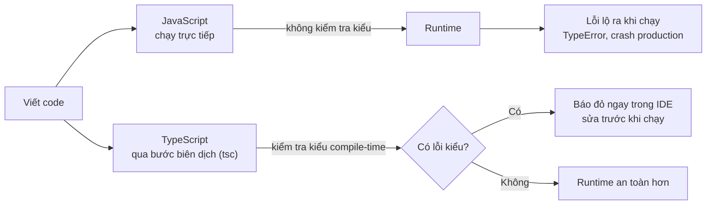

# TypeScript vs JavaScript

Bài này so sánh **TypeScript** và **JavaScript** để bạn hiểu khi nào nên dùng cái nào. Khác biệt cốt lõi nằm ở chỗ JavaScript là ngôn ngữ **dynamic typing** (kiểu động — xác định khi chạy), còn TypeScript là **static typing** (kiểu tĩnh — kiểm tra khi biên dịch). Nhờ đó TypeScript phát hiện lỗi tại **compile-time** (lúc biên dịch) thay vì để lỗi xảy ra tại **runtime** (lúc chạy) như JavaScript.

---

:::note[Ghi nhớ nhanh]

- ⭐ **Static vs dynamic typing** — JS là dynamic (kiểu xác định lúc chạy), TS là static (khai báo trước, kiểm tra lúc compile) nên bắt lỗi tại compile-time thay vì runtime.
- ⭐ **TS dùng structural typing** — hai type khác tên nhưng cùng "shape" thì tương thích, khác nominal typing của Java/C#; linh hoạt nhưng dễ sinh bug "trùng shape".
- **Type không tồn tại tại runtime** — code pass compile vẫn có thể crash; `as` chỉ "nói dối" TS, phải validate ở biên hệ thống (API, user input, file).
- **Khi nào nên dùng** — project trung bình–lớn, nhiều người, dài hạn; có thể bỏ qua với script nhỏ một file hoặc prototype nhanh.
- **Mẹo** — chọn TypeScript template ngay khi tạo project mới (Next.js, NestJS...) sẽ ít công hơn migrate sau.

:::

---

## Mục lục

- [So sánh tổng quan](#so-sánh-tổng-quan)
- [Static typing vs Dynamic typing](#static-typing-vs-dynamic-typing)
- [Compile-time vs Runtime](#compile-time-vs-runtime)
- [Khi nào nên dùng TypeScript?](#khi-nào-nên-dùng-typescript)
- [Câu hỏi phỏng vấn](#câu-hỏi-phỏng-vấn)

---

## So sánh tổng quan

| Tiêu chí | JavaScript | TypeScript |
|----------|-----------|------------|
| Loại | Ngôn ngữ chạy thực thi | Superset của JS, compile thành JS |
| Type system | Dynamic, weak | Static, structural |
| Phát hiện lỗi | Runtime | Compile-time |
| Tooling (IDE hint) | Hạn chế | Mạnh (IntelliSense, refactor) |
| Cần build step? | Không (chạy trực tiếp) | Có (qua `tsc` hoặc bundler) |
| Học khó hơn? | Dễ hơn | Cần học type + JS |
| File extension | `.js`, `.mjs`, `.cjs` | `.ts`, `.tsx` |

---

## Static typing vs Dynamic typing

JavaScript là **dynamic** — kiểu được xác định tại lúc chạy:

```js
let x = 10;
x = "hello"; // OK
x = true;    // OK
```

TypeScript là **static** — kiểu được khai báo trước, kiểm tra tại compile:

```ts
let x: number = 10;
x = "hello"; // Error: Type 'string' is not assignable to type 'number'
```

:::info[Phân tích]

TypeScript dùng **structural typing** (kiểu cấu trúc), không phải
**nominal typing** (kiểu định danh) như Java/C#.

Hai type khác tên nhưng cùng "hình dạng" thì **tương thích**:

```ts
interface Point { x: number; y: number; }
interface Coord { x: number; y: number; }

const p: Point = { x: 1, y: 2 };
const c: Coord = p; // OK — cùng shape
```

Đây là lý do TypeScript rất linh hoạt khi làm việc với object literal,
nhưng cũng là nguồn của một số bug "trùng shape không mong muốn".

:::

---

## Compile-time vs Runtime

JavaScript chỉ kiểm tra lỗi khi code thực sự chạy:

```js
const user = { name: "An" };
console.log(user.age.toFixed(2)); // TypeError tại runtime
```

TypeScript bắt lỗi ngay khi viết:

```ts
const user = { name: "An" };
console.log(user.age.toFixed(2));
// Error: Property 'age' does not exist on type '{ name: string; }'
```

Sơ đồ dưới đây cho thấy thời điểm phát hiện lỗi khác nhau giữa hai ngôn ngữ:



:::warning[Cần lưu ý]

Type của TypeScript **không tồn tại tại runtime**. Code dưới đây pass
compile nhưng vẫn có thể crash:

```ts
function process(data: User) {
  console.log(data.name.toUpperCase());
}

// Dữ liệu từ API có thể không đúng type
const apiData = JSON.parse(response) as User; // 'as' chỉ nói dối TS
process(apiData); // Crash nếu apiData.name không phải string
```

→ Phải **validate runtime** ở biên hệ thống (API, user input, file).
Đừng tin tưởng `as` để bỏ qua kiểm tra.

:::

---

## Khi nào nên dùng TypeScript?

**Nên dùng:**

- Project trung bình – lớn (≥ vài nghìn dòng code).
- Nhiều người cùng làm.
- Dự án dài hạn, cần maintain.
- Backend Node.js, frontend React/Next.js production.

**Có thể bỏ qua:**

- Script nhỏ một file, dùng một lần.
- Prototype nhanh để demo concept.
- Học JS thuần lần đầu (nên nắm JS trước rồi học TS).

:::tip[Mẹo]

Các framework hiện đại (Next.js, Nuxt, Remix, NestJS, Astro) đều có
**TypeScript template** mặc định. Khi tạo project mới, chọn template
TypeScript ngay từ đầu sẽ ít công hơn là migrate sau.

:::

---

## Câu hỏi phỏng vấn

Những câu thường gặp về chủ đề này. Tự trả lời trước, rồi đối chiếu lại với nội dung phía trên.

1. **Static typing** và **dynamic typing** khác nhau ở điểm nào? JavaScript và TypeScript thuộc nhóm nào?
2. **Compile-time** và **runtime** khác nhau thế nào? Cho một ví dụ lỗi mà TypeScript bắt được lúc biên dịch còn JavaScript chỉ lộ ra lúc chạy.
3. **Structural typing** là gì? Vì sao hai `interface` khác tên nhưng cùng shape lại gán được cho nhau?
4. **Nominal typing** của Java hay C# khác structural typing ra sao? Hệ quả thực tế khi thiết kế type trong TypeScript là gì?
5. "Duck typing" liên quan gì tới cơ chế structural typing của TypeScript?
6. Nếu muốn hai kiểu cùng shape nhưng **không** được gán lẫn nhau (ví dụ `UserId` và `OrderId` cùng là `string`), bạn làm cách nào? Gợi ý: branded type.
7. **Excess property check** là gì? Vì sao gán trực tiếp một object literal dư property thì lỗi, nhưng gán qua biến trung gian lại không?
8. `as` (type assertion) làm gì tại runtime? Vì sao nói `as` chỉ "nói dối" compiler chứ không hề chuyển đổi giá trị?
9. Đoạn `const u = JSON.parse(res) as User; u.name.toUpperCase();` pass compile — vì sao vẫn có thể crash ở production?
10. Những vị trí nào trong hệ thống **bắt buộc** phải validate runtime dù đã dùng TypeScript?
11. TypeScript cần build step, JavaScript thì không — điều đó ảnh hưởng thế nào tới workflow phát triển và deploy?
12. So sánh khả năng refactor và IntelliSense giữa hai ngôn ngữ. Vì sao type giúp IDE gợi ý chính xác hơn?
13. Trường hợp nào bạn sẽ chọn JavaScript thuần thay vì TypeScript? Nêu tiêu chí cụ thể chứ không nói chung chung.
14. TypeScript có làm code chạy nhanh hơn JavaScript không? Giải thích vì sao.
