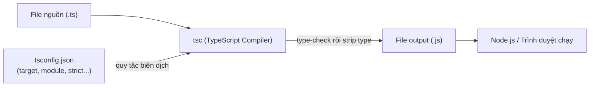
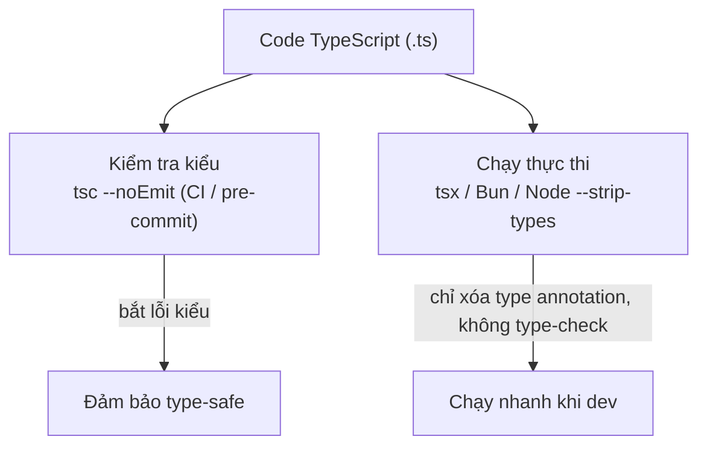

# Cài đặt và chạy TypeScript

Vì trình duyệt và Node.js không hiểu file `.ts` trực tiếp, bạn cần một **compiler** (trình biên dịch) để chuyển TypeScript thành JavaScript trước khi chạy. Bài này hướng dẫn cài TypeScript qua npm, dùng `tsc` (compiler chính thức) để biên dịch, và các cách chạy nhanh như `ts-node` hay `tsx` cho người mới bắt đầu.

---

:::note[Ghi nhớ nhanh]

- ⭐ **Ưu tiên cài local** — `npm install --save-dev typescript` thay vì global, giúp mỗi project khoá đúng version → reproducible build.
- ⭐ **`tsc` là compiler chuẩn** — biên dịch `.ts` → `.js`; `tsc --init` tạo `tsconfig.json`, `tsc --watch` tự compile lại khi file đổi.
- **`ts-node`/`tsx` chạy `.ts` trực tiếp** — tiện cho dev/script/REPL nhưng KHÔNG thay `tsc` khi build production.
- **Runtime hiện đại chỉ strip type** — Deno, Bun, Node ≥ 22.6 (`--experimental-strip-types`), tsx xoá type annotation mà **không type-check**; workflow chuẩn dùng `tsc --noEmit` trong CI để check kiểu.
- **TypeScript Playground** (typescriptlang.org/play) — công cụ debug type tốt nhất, hover để xem TS infer ra type gì.

:::

---

## Mục lục

- [Cài đặt TypeScript](#cài-đặt-typescript)
- [Chạy bằng tsc (compiler chính thức)](#chạy-bằng-tsc-compiler-chính-thức)
- [Chạy trực tiếp bằng ts-node](#chạy-trực-tiếp-bằng-ts-node)
- [TypeScript Playground](#typescript-playground)
- [Các runtime hỗ trợ TS trực tiếp](#các-runtime-hỗ-trợ-ts-trực-tiếp)
- [Câu hỏi phỏng vấn](#câu-hỏi-phỏng-vấn)

---

## Cài đặt TypeScript

Yêu cầu: Node.js ≥ 18.

**Cài global** (dùng cho mọi project):

```bash
npm install -g typescript
tsc --version
```

**Cài local trong project** (khuyên dùng):

```bash
npm install --save-dev typescript
npx tsc --version
```

:::info[Phân tích]

**Luôn ưu tiên cài local** thay vì global. Lý do:

- Mỗi project có thể dùng phiên bản TS khác nhau — global gây xung đột.
- CI/CD và dev khác máy phải có version giống hệt → reproducible build.
- `package.json` ghi rõ version dùng → dễ track lịch sử.

Phiên bản TS lock trong `package-lock.json` mới là phiên bản thật sự
build production.

:::

---

## Chạy bằng tsc (compiler chính thức)

`tsc` (TypeScript Compiler) là tool chuẩn để biên dịch `.ts` → `.js`.

Tạo file `hello.ts`:

```ts
const message: string = "Hello TypeScript";
console.log(message);
```

Compile:

```bash
npx tsc hello.ts
# Sinh ra hello.js cùng thư mục
```

Chạy file JS đã sinh ra:

```bash
node hello.js
```

**Khởi tạo `tsconfig.json`** cho cả project:

```bash
npx tsc --init
```

Sau đó chỉ cần gõ `npx tsc` để compile **toàn bộ project** theo cấu hình.

Sơ đồ dưới đây mô tả luồng biên dịch của `tsc`: từ file nguồn `.ts`, đọc cấu hình trong `tsconfig.json`, rồi sinh ra `.js` để Node/trình duyệt chạy:



**Chế độ watch** — tự compile lại khi file thay đổi:

```bash
npx tsc --watch
```

---

## Chạy trực tiếp bằng ts-node

`ts-node` là REPL/runner cho phép chạy file `.ts` **không cần compile
trước**, tiện cho dev và script:

```bash
npm install --save-dev ts-node
npx ts-node hello.ts
```

Hoặc REPL tương tác:

```bash
npx ts-node
> const x: number = 10
> x + 5
15
```

:::warning[Cần lưu ý]

`ts-node` **không** thay thế cho `tsc` khi build production. Nó:

- Compile trong memory mỗi lần chạy → chậm hơn JS thuần.
- Có thể bỏ qua một số lỗi mà `tsc --noEmit` bắt được.
- Khi deploy, luôn build trước bằng `tsc` rồi chạy bằng `node` thuần.

`ts-node` chỉ phù hợp cho: dev scripts, tests, REPL, tooling.

:::

---

## TypeScript Playground

Không muốn cài gì? Vào **https://www.typescriptlang.org/play** — môi
trường TS chạy trên trình duyệt với:

- Compiler đầy đủ (đổi version được).
- Xem output JS được sinh ra theo thời gian thực.
- Chia sẻ snippet qua URL.
- Đổi `tsconfig` options ngay trong giao diện.

:::tip[Mẹo]

Playground là công cụ **debug type tốt nhất**. Khi bạn không hiểu vì sao
TS báo lỗi, copy đoạn code lên Playground, hover vào biến để xem TS
infer ra type gì. Cực kỳ hữu ích cho generic và conditional type phức tạp.

:::

---

## Các runtime hỗ trợ TS trực tiếp

Năm 2024–2026 nhiều runtime đã chạy TS **không cần build**:

| Runtime | Hỗ trợ TS |
|---------|-----------|
| **Deno** | Native, không cần config |
| **Bun** | Native, rất nhanh |
| **Node.js ≥ 22.6** | Có flag `--experimental-strip-types` |
| **tsx** | Drop-in thay thế `ts-node`, dùng esbuild → nhanh hơn nhiều |

```bash
# Chạy TS nhanh hơn ts-node
npm install --save-dev tsx
npx tsx hello.ts
```

:::info[Phân tích]

Các runtime "chạy TS trực tiếp" thực ra chỉ **strip type annotation**
(xóa `: string`, `: number`) chứ **không type-check**. Lỗi type sẽ
**không bị bắt** khi chạy bằng Bun / Node `--strip-types` / tsx.

→ Workflow chuẩn: dùng `tsc --noEmit` trong CI/pre-commit để type-check,
dùng runtime nhanh (tsx/Bun) để chạy thực thi.

Sơ đồ workflow chuẩn tách riêng hai việc: kiểm tra kiểu và chạy code:



:::

---

## Câu hỏi phỏng vấn

Những câu thường gặp về chủ đề này. Tự trả lời trước, rồi đối chiếu lại với nội dung phía trên.

1. Vì sao nên cài TypeScript local bằng `--save-dev` thay vì cài global? Nêu ít nhất hai lý do liên quan tới CI/CD.
2. `npx tsc` và `tsc` khác nhau thế nào khi project đã cài TypeScript local?
3. Chạy `tsc hello.ts` và chạy `tsc` không tham số khác nhau ra sao? Khi truyền thẳng tên file, `tsconfig.json` có được đọc không?
4. `tsc --init` sinh ra cái gì? `tsc --watch` giải quyết vấn đề gì trong vòng lặp phát triển hằng ngày?
5. `tsc --noEmit` dùng để làm gì, và thường được đặt ở bước nào trong pipeline CI hoặc pre-commit?
6. `ts-node` hoạt động ra sao? Vì sao nó **không** thay thế được `tsc` khi build production?
7. `tsx` khác `ts-node` ở điểm nào và vì sao nhanh hơn đáng kể? Gợi ý: esbuild.
8. Deno, Bun và Node với `--experimental-strip-types` đều "chạy TS trực tiếp" — chúng có type-check không? Hệ quả thực tế là gì?
9. "Strip type" khác "compile kèm type-check" ở chỗ nào? Vì sao một file có lỗi kiểu vẫn chạy được bằng `tsx` hoặc Bun?
10. Mô tả workflow chuẩn khi vừa muốn chạy nhanh lúc dev, vừa đảm bảo type-safe trước khi merge.
11. Vì sao phiên bản TypeScript ghi trong `package-lock.json` mới là phiên bản "thật sự" build production?
12. Team dùng Babel hoặc esbuild để build còn `tsc` chỉ chạy `--noEmit` — rủi ro nào cần lưu ý với cấu hình này?
13. Bạn dùng **TypeScript Playground** để debug type như thế nào? Kể một tình huống cụ thể nó giúp bạn hiểu lỗi.
14. Cùng một đoạn code, chạy `tsx file.ts` thì OK nhưng `tsc --noEmit` lại báo lỗi — hãy giải thích vì sao và nên tin bên nào.
