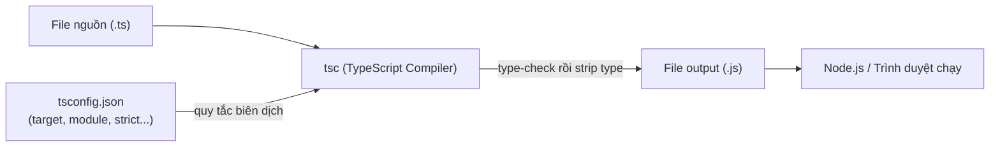
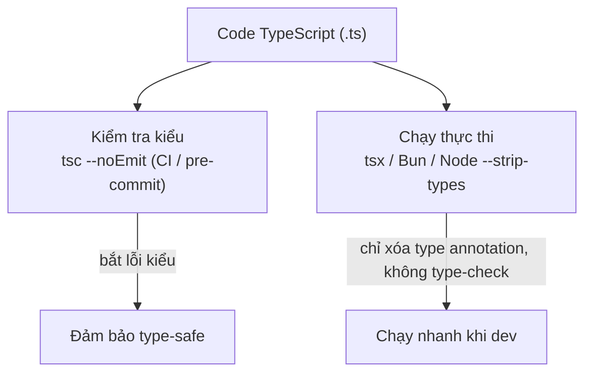

# Cài đặt và chạy TypeScript

Vì trình duyệt và Node.js không hiểu file `.ts` trực tiếp, bạn cần một **compiler** (trình biên dịch) để chuyển TypeScript thành JavaScript trước khi chạy. Bài này hướng dẫn cài TypeScript qua npm, dùng `tsc` (compiler chính thức) để biên dịch, và các cách chạy nhanh như `ts-node` hay `tsx` cho người mới bắt đầu.

[](pathname:///img/typescript/cai-dat-cau-hinh.webp)

---

:::note[Ghi nhớ nhanh]

- ⭐ **Ưu tiên cài local** — `npm install --save-dev typescript` thay vì global, giúp mỗi project khoá đúng version → reproducible build.
- ⭐ **`tsc` là compiler chuẩn** — biên dịch `.ts` → `.js`; `tsc --init` tạo `tsconfig.json`, `tsc --watch` tự compile lại khi file đổi.
- **`ts-node`/`tsx` chạy `.ts` trực tiếp** — tiện cho dev/script/REPL nhưng KHÔNG thay `tsc` khi build production.
- **Runtime hiện đại chỉ strip type** — Deno, Bun, Node ≥ 22.6 (`--experimental-strip-types`), tsx xoá type annotation mà **không type-check**; workflow chuẩn dùng `tsc --noEmit` trong CI để check kiểu.
- **TypeScript Playground** (typescriptlang.org/play) — công cụ debug type tốt nhất, hover để xem TS infer ra type gì.

:::

---

## Mục lục

- [Cài đặt TypeScript](#cài-đặt-typescript)
- [Chạy bằng tsc (compiler chính thức)](#chạy-bằng-tsc-compiler-chính-thức)
- [Chạy trực tiếp bằng ts-node](#chạy-trực-tiếp-bằng-ts-node)
- [TypeScript Playground](#typescript-playground)
- [Các runtime hỗ trợ TS trực tiếp](#các-runtime-hỗ-trợ-ts-trực-tiếp)
- [Câu hỏi phỏng vấn](#câu-hỏi-phỏng-vấn)

---

## Cài đặt TypeScript

Yêu cầu: Node.js ≥ 18.

**Cài global** (dùng cho mọi project):

```bash
npm install -g typescript
tsc --version
```

**Cài local trong project** (khuyên dùng):

```bash
npm install --save-dev typescript
npx tsc --version
```

:::info[Phân tích]

**Luôn ưu tiên cài local** thay vì global. Lý do:

- Mỗi project có thể dùng phiên bản TS khác nhau — global gây xung đột.
- CI/CD và dev khác máy phải có version giống hệt → reproducible build.
- `package.json` ghi rõ version dùng → dễ track lịch sử.

Phiên bản TS lock trong `package-lock.json` mới là phiên bản thật sự
build production.

:::

---

## Chạy bằng tsc (compiler chính thức)

`tsc` (TypeScript Compiler) là tool chuẩn để biên dịch `.ts` → `.js`.

Tạo file `hello.ts`:

```ts
const message: string = "Hello TypeScript";
console.log(message);
```

Compile:

```bash
npx tsc hello.ts
# Sinh ra hello.js cùng thư mục
```

Chạy file JS đã sinh ra:

```bash
node hello.js
```

**Khởi tạo `tsconfig.json`** cho cả project:

```bash
npx tsc --init
```

Sau đó chỉ cần gõ `npx tsc` để compile **toàn bộ project** theo cấu hình.

Sơ đồ dưới đây mô tả luồng biên dịch của `tsc`: từ file nguồn `.ts`, đọc cấu hình trong `tsconfig.json`, rồi sinh ra `.js` để Node/trình duyệt chạy:



**Chế độ watch** — tự compile lại khi file thay đổi:

```bash
npx tsc --watch
```

---

## Chạy trực tiếp bằng ts-node

`ts-node` là REPL/runner cho phép chạy file `.ts` **không cần compile
trước**, tiện cho dev và script:

```bash
npm install --save-dev ts-node
npx ts-node hello.ts
```

Hoặc REPL tương tác:

```bash
npx ts-node
> const x: number = 10
> x + 5
15
```

:::warning[Cần lưu ý]

`ts-node` **không** thay thế cho `tsc` khi build production. Nó:

- Compile trong memory mỗi lần chạy → chậm hơn JS thuần.
- Có thể bỏ qua một số lỗi mà `tsc --noEmit` bắt được.
- Khi deploy, luôn build trước bằng `tsc` rồi chạy bằng `node` thuần.

`ts-node` chỉ phù hợp cho: dev scripts, tests, REPL, tooling.

:::

---

## TypeScript Playground

Không muốn cài gì? Vào **https://www.typescriptlang.org/play** — môi
trường TS chạy trên trình duyệt với:

- Compiler đầy đủ (đổi version được).
- Xem output JS được sinh ra theo thời gian thực.
- Chia sẻ snippet qua URL.
- Đổi `tsconfig` options ngay trong giao diện.

:::tip[Mẹo]

Playground là công cụ **debug type tốt nhất**. Khi bạn không hiểu vì sao
TS báo lỗi, copy đoạn code lên Playground, hover vào biến để xem TS
infer ra type gì. Cực kỳ hữu ích cho generic và conditional type phức tạp.

:::

---

## Các runtime hỗ trợ TS trực tiếp

Năm 2024–2026 nhiều runtime đã chạy TS **không cần build**:

| Runtime | Hỗ trợ TS |
|---------|-----------|
| **Deno** | Native, không cần config |
| **Bun** | Native, rất nhanh |
| **Node.js ≥ 22.6** | Có flag `--experimental-strip-types` |
| **tsx** | Drop-in thay thế `ts-node`, dùng esbuild → nhanh hơn nhiều |

```bash
# Chạy TS nhanh hơn ts-node
npm install --save-dev tsx
npx tsx hello.ts
```

:::info[Phân tích]

Các runtime "chạy TS trực tiếp" thực ra chỉ **strip type annotation**
(xóa `: string`, `: number`) chứ **không type-check**. Lỗi type sẽ
**không bị bắt** khi chạy bằng Bun / Node `--strip-types` / tsx.

→ Workflow chuẩn: dùng `tsc --noEmit` trong CI/pre-commit để type-check,
dùng runtime nhanh (tsx/Bun) để chạy thực thi.

Sơ đồ workflow chuẩn tách riêng hai việc: kiểm tra kiểu và chạy code:



:::

---

## Câu hỏi phỏng vấn

Những câu thường gặp về chủ đề này. Tự trả lời trước, rồi bấm **Xem đáp án** để đối chiếu.

**1. Vì sao nên cài TypeScript local bằng `--save-dev` thay vì cài global? Nêu ít nhất hai lý do liên quan tới CI/CD.**

<details className="qa">
<summary>Xem đáp án</summary>

Cài local (`npm install --save-dev typescript`) đưa TypeScript thành một dependency của chính project, thay vì một công cụ nằm ngoài tầm kiểm soát trên máy từng người.

Các lý do chính:

- **Reproducible build**: version TS được ghi trong `package.json` và khoá trong `package-lock.json`, nên máy dev, máy đồng nghiệp và runner CI đều dùng đúng một phiên bản. Bản global mỗi máy một version dễ gây cảnh "trên máy tôi build được".
- **CI không phụ thuộc máy chủ**: runner chỉ cần `npm ci` là có sẵn compiler đúng version, không phải cài global thêm bước nào.
- **Mỗi project một version**: dự án cũ giữ TS 4.x, dự án mới dùng 5.x mà không xung đột.
- **Nâng cấp có kiểm soát**: TS mỗi bản minor đều có thể siết thêm luật type; nâng version qua PR thì thấy rõ diff và test được, còn global nâng lặng lẽ thì build vỡ bất ngờ.

Đúng như bài nhấn mạnh: phiên bản trong `package-lock.json` mới là phiên bản thật sự build production.

</details>

**2. `npx tsc` và `tsc` khác nhau thế nào khi project đã cài TypeScript local?**

<details className="qa">
<summary>Xem đáp án</summary>

- **`npx tsc`** ưu tiên tìm binary trong `node_modules/.bin` của project trước. Nếu đã cài local thì nó chạy **đúng phiên bản của project**. Không có mới tải tạm bản mới nhất từ registry về chạy.
- **`tsc`** gõ trực tiếp trong terminal sẽ được resolve theo `PATH` của hệ thống, tức là **bản cài global** — có thể là một version hoàn toàn khác, hoặc báo `command not found` nếu chưa cài global.

Hệ quả thực tế: cùng một codebase, `tsc` global có thể báo lỗi khác hẳn `npx tsc` chỉ vì lệch version.

Cách làm chuẩn trong dự án là khai báo script trong `package.json`:

```json
{
  "scripts": {
    "build": "tsc",
    "typecheck": "tsc --noEmit"
  }
}
```

Khi chạy qua `npm run build`, npm tự thêm `node_modules/.bin` vào `PATH`, nên `tsc` ở đây chính là bản local — không cần gõ `npx`, và cả team dùng chung một lệnh.

</details>

**3. Chạy `tsc hello.ts` và chạy `tsc` không tham số khác nhau ra sao? Khi truyền thẳng tên file, `tsconfig.json` có được đọc không?**

<details className="qa">
<summary>Xem đáp án</summary>

| Lệnh | Hành vi |
|---|---|
| `tsc` (không tham số) | Tìm `tsconfig.json` từ thư mục hiện tại đi lên, biên dịch **toàn bộ project** theo đúng cấu hình trong đó |
| `tsc hello.ts` | Chỉ biên dịch file được chỉ định (cùng các file nó import), và **bỏ qua hoàn toàn `tsconfig.json`** |

Đây là điểm rất hay gây bối rối: khi truyền tên file, `tsc` dùng **option mặc định** chứ không phải cấu hình dự án — nên `strict` không bật, `target`/`module`/`outDir` đều là mặc định. Kết quả là output đặt sai chỗ, hoặc code đang lỗi `strict` bỗng "compile sạch".

Muốn vừa dùng config vừa chỉ định file, dùng `--project`:

```bash
npx tsc                       # cả project theo tsconfig.json
npx tsc --project tsconfig.build.json
npx tsc hello.ts              # một file, KHÔNG đọc tsconfig.json
```

Quy tắc dễ nhớ: truyền file vào là tự tách khỏi cấu hình dự án — chỉ nên dùng khi thử nghiệm nhanh một file rời.

</details>

**4. `tsc --init` sinh ra cái gì? `tsc --watch` giải quyết vấn đề gì trong vòng lặp phát triển hằng ngày?**

<details className="qa">
<summary>Xem đáp án</summary>

**`tsc --init`** tạo ra file **`tsconfig.json`** ở thư mục hiện tại — file cấu hình trung tâm cho cả project. File sinh ra có sẵn một số option được bật (như `strict`, `target`, `module`, `esModuleInterop`) cùng rất nhiều option khác được liệt kê dạng comment kèm mô tả, để bạn bật dần khi cần. Sự tồn tại của file này cũng chính là dấu hiệu để `tsc`, IDE và các công cụ khác biết đâu là gốc của project.

**`tsc --watch`** (viết tắt `-w`) giữ compiler chạy nền, theo dõi file và **tự biên dịch lại phần thay đổi** ngay khi bạn lưu. Nó giải quyết hai phiền toái:

- Không phải gõ lại lệnh build sau mỗi lần sửa.
- Nhanh hơn nhiều so với build lại từ đầu, vì chỉ xử lý những gì đổi, nên lỗi kiểu hiện ra gần như tức thì.

Trong thực tế, watch mode thường được dùng cho vòng lặp dev (song song với dev server), còn build một lần thì dành cho CI và bước deploy.

</details>

**5. `tsc --noEmit` dùng để làm gì, và thường được đặt ở bước nào trong pipeline CI hoặc pre-commit?**

<details className="qa">
<summary>Xem đáp án</summary>

`tsc --noEmit` yêu cầu compiler **chỉ type-check mà không sinh ra file `.js` nào**. Nó tách riêng hai việc mà `tsc` vốn làm cùng lúc: kiểm tra kiểu và emit output.

Dùng khi nào:

- Dự án **build bằng công cụ khác** (esbuild, swc, Vite, Next.js, Babel) — những công cụ này chỉ strip type, không check kiểu, nên cần `tsc --noEmit` đảm nhiệm phần kiểm tra.
- Muốn một lệnh "kiểm tra sức khoẻ" nhanh mà không làm bẩn thư mục bằng file build.

Vị trí trong pipeline:

```json
{ "scripts": { "typecheck": "tsc --noEmit" } }
```

- **Pre-commit / pre-push hook** (qua husky, lint-staged): chặn sớm, nhưng lưu ý type-check đúng nghĩa phải chạy cả project nên có thể hơi chậm cho hook.
- **CI**: chạy `npm run typecheck` như một job bắt buộc, song song với lint và test, và **phải pass mới được merge**. Đây là chốt chặn quan trọng nhất.

</details>

**6. `ts-node` hoạt động ra sao? Vì sao nó không thay thế được `tsc` khi build production?**

<details className="qa">
<summary>Xem đáp án</summary>

`ts-node` móc vào cơ chế nạp module của Node: khi Node gặp file `.ts`, `ts-node` **biên dịch nó trong bộ nhớ** bằng chính TypeScript compiler rồi đưa JS kết quả cho Node chạy. Nhờ vậy bạn gõ `npx ts-node hello.ts` là chạy ngay, không cần bước build, và có cả REPL tương tác.

Vì sao không dùng cho production:

- **Chậm và tốn RAM**: mỗi lần khởi động phải compile lại toàn bộ, làm cold start của server dài ra một cách vô ích.
- **Compiler thành dependency runtime**: production phải cài kèm TypeScript, image nặng hơn và bề mặt rủi ro lớn hơn.
- **Lỗi lộ muộn**: nếu bật `transpileOnly` (hoặc dùng swc mode cho nhanh) thì nó bỏ qua type-check; lỗi kiểu chỉ phát hiện khi module đó thực sự được nạp, thay vì phát hiện toàn bộ ngay lúc build.

Cách đúng khi deploy: build trước bằng `tsc` (hoặc bundler), rồi chạy `node dist/index.js` thuần. `ts-node` chỉ nên dùng cho dev script, test và REPL.

</details>

**7. `tsx` khác `ts-node` ở điểm nào và vì sao nhanh hơn đáng kể? Gợi ý: esbuild.**

<details className="qa">
<summary>Xem đáp án</summary>

`tsx` là bản thay thế drop-in cho `ts-node`: cách dùng gần như y hệt (`npx tsx hello.ts`), nhưng bên dưới dùng **esbuild** thay vì TypeScript compiler.

Vì sao nhanh hơn nhiều:

- **esbuild viết bằng Go**, biên dịch sẵn ra mã máy và chạy song song đa luồng, trong khi `tsc` là JavaScript chạy trên một luồng.
- Quan trọng hơn: esbuild **chỉ strip type annotation**, hoàn toàn **không type-check**. Bỏ qua bước phân tích kiểu — phần tốn thời gian nhất — nên nhanh hơn nhiều bậc.

| | ts-node | tsx |
|---|---|---|
| Nhân xử lý | TypeScript compiler | esbuild (Go) |
| Type-check | Có (trừ khi bật `transpileOnly`) | Không bao giờ |
| Tốc độ khởi động | Chậm | Rất nhanh |
| ESM/CJS | Cần cấu hình thêm | Xử lý sẵn khá mượt |

Đánh đổi rất rõ: `tsx` đổi type-check lấy tốc độ. Vì vậy dùng `tsx` để chạy lúc dev, và giữ `tsc --noEmit` ở CI làm chốt kiểm tra kiểu.

</details>

**8. Deno, Bun và Node với `--experimental-strip-types` đều "chạy TS trực tiếp" — chúng có type-check không? Hệ quả thực tế là gì?**

<details className="qa">
<summary>Xem đáp án</summary>

Khi **chạy**, cả ba đều **không type-check**. Chúng chỉ **strip type** — xoá `: string`, `interface`, generic... rồi thực thi phần JavaScript còn lại. (Deno có lệnh `deno check` riêng để type-check, nhưng đó là bước tách biệt, không nằm trong lúc chạy.)

Hệ quả thực tế:

- File đầy lỗi kiểu vẫn **chạy bình thường** cho tới khi gặp lỗi thật ở runtime. Việc "chạy được" không còn là bằng chứng code type-safe nữa.
- Lỗi kiểu chỉ bị bắt ở chỗ khác — IDE hoặc bước `tsc --noEmit` trong CI. Nếu dự án bỏ bước đó, TypeScript gần như chỉ còn là chú thích cho vui.
- Vài cú pháp TS cần sinh thêm code ở runtime (như `enum`, decorator kiểu cũ, `namespace`) có thể không được hỗ trợ ở chế độ strip thuần, nên nên tránh dùng.

Kết luận đúng như bài: tách hai việc — dùng runtime nhanh (tsx/Bun/Deno) để chạy khi dev, và `tsc --noEmit` trong CI/pre-commit để đảm bảo type-safe.

</details>

**9. "Strip type" khác "compile kèm type-check" ở chỗ nào? Vì sao một file có lỗi kiểu vẫn chạy được bằng `tsx` hoặc Bun?**

<details className="qa">
<summary>Xem đáp án</summary>

- **Strip type**: chỉ làm biến đổi cú pháp — xoá annotation, `interface`, generic, rồi xuất JS. Công cụ xử lý **từng file độc lập**, không cần biết các file khác, nên cực nhanh. Nó không hề "hiểu" hệ thống kiểu.
- **Compile kèm type-check** (`tsc`): dựng đồ thị toàn bộ chương trình, phân giải mọi import, suy luận và đối chiếu kiểu giữa các file, báo lỗi rồi mới emit. Chậm hơn nhiều vì phải nhìn bức tranh toàn cục.

Vì sao file lỗi kiểu vẫn chạy được:

```ts
const n: number = "hello"; // tsc: error TS2322
console.log(n.toUpperCase());
```

Sau khi `tsx`/Bun strip type, thứ còn lại là `const n = "hello"; console.log(n.toUpperCase());` — JavaScript hoàn toàn hợp lệ, in ra `HELLO`. Type annotation vốn không bao giờ tồn tại ở runtime, nên "sai kiểu" không phải lỗi cú pháp JS. Chỉ có `tsc` mới phát hiện được điều đó — và đó chính là lý do bước `tsc --noEmit` không thể bỏ.

</details>

**10. Mô tả workflow chuẩn khi vừa muốn chạy nhanh lúc dev, vừa đảm bảo type-safe trước khi merge.**

<details className="qa">
<summary>Xem đáp án</summary>

Nguyên tắc: **tách bạch việc chạy và việc kiểm tra kiểu**, đúng như sơ đồ workflow trong bài.

Lúc phát triển:

- Chạy code bằng runtime nhanh: `tsx watch src/index.ts`, Bun hoặc dev server của framework — khởi động gần như tức thì.
- Type-check diễn ra liên tục trong **IDE** (VS Code dùng chính TS language service), nên lỗi kiểu vẫn báo đỏ ngay khi gõ.
- Muốn chắc hơn nữa thì mở thêm một terminal chạy `tsc --noEmit --watch`.

Trước khi commit và merge:

```json
{
  "scripts": {
    "dev": "tsx watch src/index.ts",
    "typecheck": "tsc --noEmit",
    "build": "tsc -p tsconfig.build.json"
  }
}
```

- **Pre-commit hook**: lint + format cho file đã stage (nhanh).
- **CI bắt buộc pass**: `npm run typecheck`, lint, test — chạy song song, fail là chặn merge.
- **Bước build/deploy**: dùng `tsc` hoặc bundler sinh ra `dist/`, rồi production chạy `node dist/index.js` thuần.

Cách này giữ được tốc độ khi dev mà không hy sinh độ an toàn khi lên nhánh chính.

</details>

**11. Vì sao phiên bản TypeScript ghi trong `package-lock.json` mới là phiên bản "thật sự" build production?**

<details className="qa">
<summary>Xem đáp án</summary>

Vì `package.json` thường chỉ ghi một **dải version** như `"typescript": "^5.4.0"` — dải đó khớp với 5.4.2, 5.5.0, 5.6.0... Còn `package-lock.json` ghi **đúng một version cụ thể** kèm hash, và đó mới là thứ được cài thật.

Trên CI, `npm ci` cài **chính xác theo lock file** (chứ không giải lại dải version như `npm install`). Nghĩa là compiler chạy trong pipeline build production chính là bản trong lock, không phải bản mới nhất khớp dải, và càng không phải bản `tsc` global trên máy ai đó.

Điều này quan trọng vì TypeScript **không theo semver theo nghĩa thông thường**: mỗi bản minor có thể bổ sung luật kiểm tra chặt hơn hoặc sửa lỗi suy luận kiểu, khiến code đang compile sạch bỗng báo lỗi. Nếu không khoá version, một bản TS mới phát hành có thể làm đỏ CI dù không ai đụng vào code.

Vì vậy: commit lock file, nâng TypeScript qua PR riêng để review và test được, đừng cài global rồi tưởng đó là version dự án đang dùng.

</details>

**12. Team dùng Babel hoặc esbuild để build còn `tsc` chỉ chạy `--noEmit` — rủi ro nào cần lưu ý với cấu hình này?**

<details className="qa">
<summary>Xem đáp án</summary>

Cấu hình này rất phổ biến và hợp lý (build nhanh, check kiểu riêng), nhưng có vài rủi ro:

- **Hai công cụ, hai bộ quy tắc**: Babel/esbuild transpile **từng file độc lập**, không nhìn thấy các file khác. Vì vậy một số tính năng TS không hoạt động đúng — `const enum`, `namespace` kiểu cũ, `export =`. Nên bật `isolatedModules: true` để `tsc` cảnh báo trước những chỗ transpiler đơn file không xử lý nổi.
- **Import chỉ chứa type**: khi transpile theo từng file, công cụ không biết một import là type hay value. Dùng `import type { X }` (và bật `verbatimModuleSyntax`) để tránh import thừa hoặc bị xoá nhầm.
- **Cấu hình dễ lệch nhau**: `target`, `paths` alias, `jsx`, decorator phải khai báo ở cả hai nơi; lệch là output khác với thứ `tsc` giả định khi check.
- **Decorator và `emitDecoratorMetadata`**: esbuild không hỗ trợ đầy đủ, ảnh hưởng trực tiếp tới NestJS, TypeORM.
- **Nếu quên chạy `tsc --noEmit` trong CI** thì thực tế không còn ai check kiểu — build vẫn xanh trong khi code đầy lỗi type.

</details>

**13. Bạn dùng TypeScript Playground để debug type như thế nào? Kể một tình huống cụ thể nó giúp bạn hiểu lỗi.**

<details className="qa">
<summary>Xem đáp án</summary>

Playground (typescriptlang.org/play) là môi trường TS đầy đủ chạy trong trình duyệt. Cách dùng để debug:

- Dán đoạn code gây lỗi vào, **hover** vào từng biến để xem TS thực sự infer ra kiểu gì — thường lỗi đến từ chỗ inference khác với tưởng tượng.
- Xem tab **JS** để biết output biên dịch, và tab **Errors** để đọc lỗi đầy đủ.
- Đổi **compiler options** ngay trong giao diện (bật/tắt `strict`, `strictNullChecks`) để xác định lỗi đến từ flag nào.
- **Đổi version TS** để kiểm chứng xem lỗi có phải do nâng cấp compiler.
- Chia sẻ link cho đồng nghiệp — cả đoạn code và config đều nằm trong URL.

Tình huống cụ thể hay gặp: một mảng khai báo `const arr = []` rồi `push` vào, TS lại báo lỗi lạ. Hover trên Playground sẽ thấy `arr` được infer là `never[]` — từ đó hiểu ngay phải viết `const arr: string[] = []`. Tương tự, hover vào một generic hay conditional type phức tạp sẽ cho thấy kiểu đã được "giải" thành gì, nhanh hơn nhiều so với đoán mò.

</details>

**14. Cùng một đoạn code, chạy `tsx file.ts` thì OK nhưng `tsc --noEmit` lại báo lỗi — hãy giải thích vì sao và nên tin bên nào.**

<details className="qa">
<summary>Xem đáp án</summary>

Vì hai công cụ làm hai việc khác hẳn nhau:

- **`tsx`** dùng esbuild để **strip type** rồi chạy. Nó không hề kiểm tra kiểu, nên lỗi type không tồn tại dưới góc nhìn của nó. Chỉ khi code sai **cú pháp** hoặc sai logic lúc chạy thì mới nổ.
- **`tsc --noEmit`** phân tích toàn bộ chương trình, đối chiếu kiểu giữa các file, và báo mọi vi phạm.

```ts
const n: number = "hello"; // tsx: chạy ngon lành
console.log(n);            // tsc --noEmit: error TS2322
```

**Nên tin `tsc`.** Nó là nguồn chân lý duy nhất về tính đúng đắn kiểu; "chạy được" chỉ chứng minh đoạn code đó chưa đi vào nhánh gây lỗi, không chứng minh code an toàn. Một sai kiểu lọt qua hôm nay có thể thành `TypeError` trên production ngày mai khi dữ liệu khác đi.

Cần lưu ý thêm một khả năng: nếu `tsx` và `tsc` đọc cấu hình khác nhau (khác `tsconfig`, khác `paths`, khác `lib`/`types`) thì kết quả cũng lệch — nên kiểm tra xem cả hai có cùng dùng một `tsconfig.json` không.

</details>
