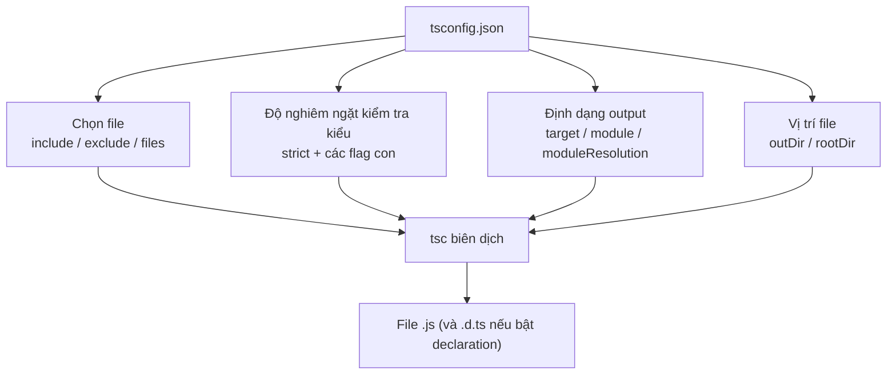
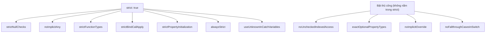

# tsconfig.json và Compiler Options

`tsconfig.json` là **file cấu hình** (configuration file) đặt ở gốc dự án, cho compiler biết phải biên dịch những file nào và theo quy tắc ra sao. Các **compiler options** (tùy chọn biên dịch) bên trong nó quyết định mức độ kiểm tra kiểu nghiêm ngặt, phiên bản JavaScript đầu ra và cách xử lý module. Bài này giúp người mới đọc hiểu và tự cấu hình file này.

---

:::note[Ghi nhớ nhanh]

- ⭐ **`tsconfig.json` ở gốc project** — báo cho `tsc` compile file nào (`include`/`exclude`), ra JS phiên bản nào (`target`), module gì (`module`), strict đến đâu; có nó chỉ cần gõ `tsc` không tham số.
- ⭐ **`"strict": true`** — bật một loạt flag cùng lúc (`strictNullChecks`, `noImplicitAny`, `strictFunctionTypes`...); luôn bật cho project mới, migrate thì bật từng flag một.
- **Vài flag "siêu strict" nằm ngoài `strict`** — phải bật thủ công: `noUncheckedIndexedAccess`, `exactOptionalPropertyTypes`, `noImplicitOverride`, `noFallthroughCasesInSwitch`.
- **`target`/`module`/`moduleResolution`** — quyết định phiên bản JS output và cách resolve `import` (`Bundler` cho Vite/Next, `NodeNext` cho Node ESM).
- **Kế thừa cấu hình** — dùng `extends` từ preset `@tsconfig/*`; monorepo lớn dùng `references` (project references) để build incremental.

:::

---

## Mục lục

- [tsconfig.json là gì?](#tsconfigjson-là-gì)
- [Cấu trúc cơ bản](#cấu-trúc-cơ-bản)
- [Các option quan trọng nhất](#các-option-quan-trọng-nhất)
- [Strict mode](#strict-mode)
- [Module và Target](#module-và-target)
- [Kế thừa cấu hình](#kế-thừa-cấu-hình)
- [Câu hỏi phỏng vấn](#câu-hỏi-phỏng-vấn)

---

## tsconfig.json là gì?

`tsconfig.json` là **file cấu hình** đặt ở thư mục gốc project, báo cho
`tsc` biết:

- Compile file nào (`include`, `exclude`, `files`).
- Compile ra phiên bản JS nào (`target`).
- Module system gì (`module`).
- Kiểm tra type nghiêm ngặt đến đâu (`strict`).
- Đặt output ở đâu (`outDir`).

Có file này → chỉ cần gõ `tsc` không tham số là compile cả project.

Sơ đồ dưới đây cho thấy mỗi nhóm option ảnh hưởng đến khía cạnh nào của quá trình biên dịch:



---

## Cấu trúc cơ bản

```json
{
  "compilerOptions": {
    "target": "ES2022",
    "module": "ESNext",
    "moduleResolution": "Bundler",
    "strict": true,
    "esModuleInterop": true,
    "skipLibCheck": true,
    "outDir": "./dist",
    "rootDir": "./src"
  },
  "include": ["src/**/*"],
  "exclude": ["node_modules", "dist"]
}
```

---

## Các option quan trọng nhất

| Option | Tác dụng |
|--------|----------|
| `target` | Phiên bản JS output (`ES5`, `ES2022`, `ESNext`) |
| `module` | Hệ module output (`CommonJS`, `ESNext`, `NodeNext`) |
| `moduleResolution` | Cách resolve `import` (`Node`, `Bundler`, `NodeNext`) |
| `strict` | Bật toàn bộ option strict (xem dưới) |
| `outDir` | Thư mục chứa file `.js` sau khi compile |
| `rootDir` | Thư mục source code đầu vào |
| `esModuleInterop` | Cho phép `import x from 'cjs-module'` |
| `skipLibCheck` | Bỏ qua check `.d.ts` của thư viện → build nhanh hơn |
| `declaration` | Sinh file `.d.ts` (cần khi publish thư viện) |
| `sourceMap` | Sinh `.map` cho debug |
| `noEmit` | Chỉ type-check, không sinh file (cho IDE/CI) |
| `jsx` | Cách xử lý `.tsx` (`preserve`, `react-jsx`, `react`) |
| `paths` + `baseUrl` | Alias import (`@/utils/...`) |

---

## Strict mode

`"strict": true` bật tất cả các flag strict cùng lúc:

| Flag con | Tác dụng |
|----------|----------|
| `strictNullChecks` | `null` / `undefined` là kiểu riêng, không gán bừa |
| `noImplicitAny` | Báo lỗi khi không infer được type, không cho ngầm `any` |
| `strictFunctionTypes` | Kiểm tra tham số hàm theo contravariance đúng chuẩn |
| `strictBindCallApply` | Check type khi dùng `.bind()`, `.call()`, `.apply()` |
| `strictPropertyInitialization` | Property class phải được khởi tạo |
| `alwaysStrict` | Tự thêm `"use strict"` vào file output |
| `useUnknownInCatchVariables` | Biến `catch (e)` là `unknown` thay vì `any` |

Sơ đồ dưới đây phân biệt các flag được bật sẵn bởi `strict` với các flag "siêu strict" phải bật thủ công:



:::info[Phân tích]

**Luôn bật `"strict": true` cho project mới.** Nếu migrate codebase JS
lớn, bật **từng flag một** theo thứ tự:

1. `noImplicitAny` — buộc khai báo type rõ ràng.
2. `strictNullChecks` — tốn công nhất nhưng quan trọng nhất.
3. Các flag còn lại bật sau cùng.

Bật `strict` từ đầu rẻ hơn rất nhiều so với bật lại sau 6 tháng.

:::

:::warning[Cần lưu ý]

Bật `strict` nhưng **chưa đủ** — vẫn cần bật thủ công các flag sau, chúng
**không** nằm trong `strict`:

- `noUncheckedIndexedAccess` — truy cập `array[i]` trả về `T | undefined`.
- `exactOptionalPropertyTypes` — phân biệt `{ x?: number }` với `{ x: number | undefined }`.
- `noImplicitOverride` — buộc dùng `override` keyword khi override method.
- `noFallthroughCasesInSwitch` — bắt case thiếu `break`.

Đây là những flag "siêu strict" thường thấy ở team senior.

:::

---

## Module và Target

```json
{
  "target": "ES2022",
  "module": "ESNext",
  "moduleResolution": "Bundler"
}
```

- `target`: trình duyệt/Node bạn deploy đến — JS sinh ra sẽ dùng cú pháp
  của phiên bản này.
- `module`: định dạng module trong output (`CommonJS` cho Node cũ,
  `ESNext`/`NodeNext` cho hiện đại).
- `moduleResolution`: cách TS tìm file khi gặp `import`. `Bundler` phù
  hợp khi dùng Vite/Webpack/Next; `NodeNext` cho thuần Node ESM.

:::tip[Mẹo]

**Preset chuẩn 2026** cho từng môi trường:

- **Frontend (Vite/Next.js)**: `target: ES2022`, `module: ESNext`,
  `moduleResolution: Bundler`, `jsx: react-jsx`, `noEmit: true`.
- **Backend Node**: `target: ES2022`, `module: NodeNext`,
  `moduleResolution: NodeNext`.
- **Thư viện publish npm**: thêm `declaration: true`, `sourceMap: true`,
  `outDir: ./dist`.

:::

---

## Kế thừa cấu hình

Bạn không cần viết lại từ đầu — kế thừa từ preset có sẵn:

```bash
npm install --save-dev @tsconfig/node20
```

```json
{
  "extends": "@tsconfig/node20/tsconfig.json",
  "compilerOptions": {
    "outDir": "./dist"
  }
}
```

Repo **tsconfig/bases** (https://github.com/tsconfig/bases) chứa preset
sẵn cho Node, Deno, Next.js, React Native, Astro, Svelte...

:::info[Phân tích]

Trong monorepo lớn, dùng **project references**:

```json
{
  "references": [
    { "path": "./packages/core" },
    { "path": "./packages/ui" }
  ]
}
```

Cho phép TS build **incremental** — chỉ rebuild package thay đổi, tiết
kiệm hàng phút build cho monorepo nhiều package.

:::

---

## Câu hỏi phỏng vấn

Những câu thường gặp về chủ đề này. Tự trả lời trước, rồi đối chiếu lại với nội dung phía trên.

1. `tsconfig.json` dùng để làm gì? Kể các nhóm thông tin chính mà nó khai báo cho compiler.
2. `include`, `exclude` và `files` khác nhau thế nào? Nếu khai báo cả ba thì cái nào có ưu tiên cao hơn?
3. `target` ảnh hưởng gì tới file JavaScript sinh ra? Đặt `target: ES5` so với `target: ES2022` khác nhau ra sao khi code có `async/await`?
4. `module` và `moduleResolution` khác nhau ở điểm nào? Vì sao cặp `module: ESNext` đi với `moduleResolution: Node10` là cấu hình sai phổ biến?
5. Khi nào chọn `moduleResolution: Bundler`, khi nào chọn `NodeNext`? Với `NodeNext` thì đường dẫn `import` phải viết thế nào?
6. `esModuleInterop` giải quyết vấn đề gì giữa CommonJS và ES Modules? Tắt nó đi thì `import express from 'express'` gặp chuyện gì?
7. `skipLibCheck: true` bỏ qua việc kiểm tra gì? Đánh đổi giữa tốc độ build và độ an toàn ở đây là gì?
8. `strict: true` bật những flag con nào? Kể ít nhất năm flag và tác dụng của từng cái.
9. `strictNullChecks` thay đổi hành vi type system ra sao? Tắt nó thì `let s: string = null;` có báo lỗi không, và vì sao điều đó nguy hiểm?
10. `noImplicitAny` khác `strictNullChecks` ở chỗ nào? Khi migrate một codebase JavaScript lớn, nên bật flag nào trước và vì sao?
11. `strictFunctionTypes` kiểm tra điều gì? Khái niệm contravariance của tham số hàm nghĩa là gì trong ngữ cảnh này?
12. `useUnknownInCatchVariables` đổi kiểu của biến trong `catch` thành gì, và vì sao đó là mặc định an toàn hơn?
13. Những flag "siêu strict" nào **không** nằm trong `strict` và phải bật thủ công? Mỗi flag bắt loại lỗi gì?
14. `noUncheckedIndexedAccess` biến biểu thức `arr[0]` thành kiểu gì? Vì sao nó rất hữu ích nhưng nhiều team vẫn tắt?
15. `exactOptionalPropertyTypes` phân biệt hai kiểu nào với nhau? Cho một ví dụ lỗi mà nó bắt được còn `strict` thường thì không.
16. `noEmit`, `declaration`, `outDir`, `rootDir` — mỗi option dùng khi nào? Publish một thư viện lên npm thì cần bật những cái nào?
17. `extends` và `references` (project references) khác nhau thế nào? `references` mang lại lợi ích gì cho monorepo nhiều package?
