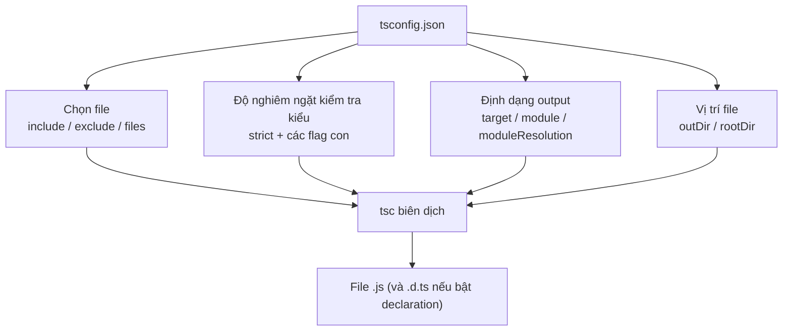
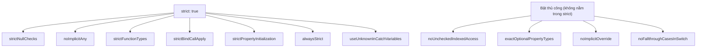

# tsconfig.json và Compiler Options

`tsconfig.json` là **file cấu hình** (configuration file) đặt ở gốc dự án, cho compiler biết phải biên dịch những file nào và theo quy tắc ra sao. Các **compiler options** (tùy chọn biên dịch) bên trong nó quyết định mức độ kiểm tra kiểu nghiêm ngặt, phiên bản JavaScript đầu ra và cách xử lý module. Bài này giúp người mới đọc hiểu và tự cấu hình file này.

[](pathname:///img/typescript/compiler-options.webp)

---

:::note[Ghi nhớ nhanh]

- ⭐ **`tsconfig.json` ở gốc project** — báo cho `tsc` compile file nào (`include`/`exclude`), ra JS phiên bản nào (`target`), module gì (`module`), strict đến đâu; có nó chỉ cần gõ `tsc` không tham số.
- ⭐ **`"strict": true`** — bật một loạt flag cùng lúc (`strictNullChecks`, `noImplicitAny`, `strictFunctionTypes`...); luôn bật cho project mới, migrate thì bật từng flag một.
- **Vài flag "siêu strict" nằm ngoài `strict`** — phải bật thủ công: `noUncheckedIndexedAccess`, `exactOptionalPropertyTypes`, `noImplicitOverride`, `noFallthroughCasesInSwitch`.
- **`target`/`module`/`moduleResolution`** — quyết định phiên bản JS output và cách resolve `import` (`Bundler` cho Vite/Next, `NodeNext` cho Node ESM).
- **Kế thừa cấu hình** — dùng `extends` từ preset `@tsconfig/*`; monorepo lớn dùng `references` (project references) để build incremental.

:::

---

## Mục lục

- [tsconfig.json là gì?](#tsconfigjson-là-gì)
- [Cấu trúc cơ bản](#cấu-trúc-cơ-bản)
- [Các option quan trọng nhất](#các-option-quan-trọng-nhất)
- [Strict mode](#strict-mode)
- [Module và Target](#module-và-target)
- [Kế thừa cấu hình](#kế-thừa-cấu-hình)
- [Câu hỏi phỏng vấn](#câu-hỏi-phỏng-vấn)

---

## tsconfig.json là gì?

`tsconfig.json` là **file cấu hình** đặt ở thư mục gốc project, báo cho
`tsc` biết:

- Compile file nào (`include`, `exclude`, `files`).
- Compile ra phiên bản JS nào (`target`).
- Module system gì (`module`).
- Kiểm tra type nghiêm ngặt đến đâu (`strict`).
- Đặt output ở đâu (`outDir`).

Có file này → chỉ cần gõ `tsc` không tham số là compile cả project.

Sơ đồ dưới đây cho thấy mỗi nhóm option ảnh hưởng đến khía cạnh nào của quá trình biên dịch:



---

## Cấu trúc cơ bản

```json
{
  "compilerOptions": {
    "target": "ES2022",
    "module": "ESNext",
    "moduleResolution": "Bundler",
    "strict": true,
    "esModuleInterop": true,
    "skipLibCheck": true,
    "outDir": "./dist",
    "rootDir": "./src"
  },
  "include": ["src/**/*"],
  "exclude": ["node_modules", "dist"]
}
```

---

## Các option quan trọng nhất

| Option | Tác dụng |
|--------|----------|
| `target` | Phiên bản JS output (`ES5`, `ES2022`, `ESNext`) |
| `module` | Hệ module output (`CommonJS`, `ESNext`, `NodeNext`) |
| `moduleResolution` | Cách resolve `import` (`Node`, `Bundler`, `NodeNext`) |
| `strict` | Bật toàn bộ option strict (xem dưới) |
| `outDir` | Thư mục chứa file `.js` sau khi compile |
| `rootDir` | Thư mục source code đầu vào |
| `esModuleInterop` | Cho phép `import x from 'cjs-module'` |
| `skipLibCheck` | Bỏ qua check `.d.ts` của thư viện → build nhanh hơn |
| `declaration` | Sinh file `.d.ts` (cần khi publish thư viện) |
| `sourceMap` | Sinh `.map` cho debug |
| `noEmit` | Chỉ type-check, không sinh file (cho IDE/CI) |
| `jsx` | Cách xử lý `.tsx` (`preserve`, `react-jsx`, `react`) |
| `paths` + `baseUrl` | Alias import (`@/utils/...`) |

---

## Strict mode

`"strict": true` bật tất cả các flag strict cùng lúc:

| Flag con | Tác dụng |
|----------|----------|
| `strictNullChecks` | `null` / `undefined` là kiểu riêng, không gán bừa |
| `noImplicitAny` | Báo lỗi khi không infer được type, không cho ngầm `any` |
| `strictFunctionTypes` | Kiểm tra tham số hàm theo contravariance đúng chuẩn |
| `strictBindCallApply` | Check type khi dùng `.bind()`, `.call()`, `.apply()` |
| `strictPropertyInitialization` | Property class phải được khởi tạo |
| `alwaysStrict` | Tự thêm `"use strict"` vào file output |
| `useUnknownInCatchVariables` | Biến `catch (e)` là `unknown` thay vì `any` |

Sơ đồ dưới đây phân biệt các flag được bật sẵn bởi `strict` với các flag "siêu strict" phải bật thủ công:



:::info[Phân tích]

**Luôn bật `"strict": true` cho project mới.** Nếu migrate codebase JS
lớn, bật **từng flag một** theo thứ tự:

1. `noImplicitAny` — buộc khai báo type rõ ràng.
2. `strictNullChecks` — tốn công nhất nhưng quan trọng nhất.
3. Các flag còn lại bật sau cùng.

Bật `strict` từ đầu rẻ hơn rất nhiều so với bật lại sau 6 tháng.

:::

:::warning[Cần lưu ý]

Bật `strict` nhưng **chưa đủ** — vẫn cần bật thủ công các flag sau, chúng
**không** nằm trong `strict`:

- `noUncheckedIndexedAccess` — truy cập `array[i]` trả về `T | undefined`.
- `exactOptionalPropertyTypes` — phân biệt `{ x?: number }` với `{ x: number | undefined }`.
- `noImplicitOverride` — buộc dùng `override` keyword khi override method.
- `noFallthroughCasesInSwitch` — bắt case thiếu `break`.

Đây là những flag "siêu strict" thường thấy ở team senior.

:::

---

## Module và Target

```json
{
  "target": "ES2022",
  "module": "ESNext",
  "moduleResolution": "Bundler"
}
```

- `target`: trình duyệt/Node bạn deploy đến — JS sinh ra sẽ dùng cú pháp
  của phiên bản này.
- `module`: định dạng module trong output (`CommonJS` cho Node cũ,
  `ESNext`/`NodeNext` cho hiện đại).
- `moduleResolution`: cách TS tìm file khi gặp `import`. `Bundler` phù
  hợp khi dùng Vite/Webpack/Next; `NodeNext` cho thuần Node ESM.

:::tip[Mẹo]

**Preset chuẩn 2026** cho từng môi trường:

- **Frontend (Vite/Next.js)**: `target: ES2022`, `module: ESNext`,
  `moduleResolution: Bundler`, `jsx: react-jsx`, `noEmit: true`.
- **Backend Node**: `target: ES2022`, `module: NodeNext`,
  `moduleResolution: NodeNext`.
- **Thư viện publish npm**: thêm `declaration: true`, `sourceMap: true`,
  `outDir: ./dist`.

:::

---

## Kế thừa cấu hình

Bạn không cần viết lại từ đầu — kế thừa từ preset có sẵn:

```bash
npm install --save-dev @tsconfig/node20
```

```json
{
  "extends": "@tsconfig/node20/tsconfig.json",
  "compilerOptions": {
    "outDir": "./dist"
  }
}
```

Repo **tsconfig/bases** (https://github.com/tsconfig/bases) chứa preset
sẵn cho Node, Deno, Next.js, React Native, Astro, Svelte...

:::info[Phân tích]

Trong monorepo lớn, dùng **project references**:

```json
{
  "references": [
    { "path": "./packages/core" },
    { "path": "./packages/ui" }
  ]
}
```

Cho phép TS build **incremental** — chỉ rebuild package thay đổi, tiết
kiệm hàng phút build cho monorepo nhiều package.

:::

---

## Câu hỏi phỏng vấn

Những câu thường gặp về chủ đề này. Tự trả lời trước, rồi bấm **Xem đáp án** để đối chiếu.

**1. `tsconfig.json` dùng để làm gì? Kể các nhóm thông tin chính mà nó khai báo cho compiler.**

<details className="qa">
<summary>Xem đáp án</summary>

`tsconfig.json` là file cấu hình đặt ở **gốc project**, cho `tsc` biết phải biên dịch những file nào và theo quy tắc gì. Sự tồn tại của nó cũng đánh dấu đâu là gốc project — nhờ vậy chỉ cần gõ `tsc` không tham số là compile cả dự án, và IDE cũng đọc chính file này để báo lỗi giống hệt compiler.

Các nhóm thông tin chính:

- **Phạm vi file**: `include`, `exclude`, `files` — compile những file nào.
- **Độ nghiêm ngặt kiểm tra kiểu**: `strict` cùng các flag con, và các flag "siêu strict" bật thêm.
- **Định dạng output**: `target` (phiên bản JS), `module` (hệ module), `moduleResolution` (cách tìm file khi `import`).
- **Vị trí file**: `rootDir` (nguồn), `outDir` (đích), cùng `paths`/`baseUrl` cho alias import.
- **Sản phẩm phụ**: `declaration` (`.d.ts`), `sourceMap`, hoặc `noEmit` khi chỉ muốn type-check.

Ngoài ra còn `extends` để kế thừa preset và `references` cho monorepo.

</details>

**2. `include`, `exclude` và `files` khác nhau thế nào? Nếu khai báo cả ba thì cái nào có ưu tiên cao hơn?**

<details className="qa">
<summary>Xem đáp án</summary>

| Option | Ý nghĩa |
|---|---|
| `files` | Danh sách **đường dẫn cụ thể**, liệt kê tay từng file. Không dùng glob |
| `include` | Danh sách **glob pattern**, ví dụ `["src/**/*"]` |
| `exclude` | Glob để **loại bớt** khỏi kết quả của `include` |

Quy tắc ưu tiên cần nhớ:

- `exclude` **chỉ lọc những gì `include` gom vào**, nó không loại được file đã liệt kê trong `files`.
- Nếu không khai báo `files` lẫn `include`, mặc định compiler lấy **mọi file `.ts`/`.tsx`** dưới thư mục chứa config.
- `exclude` mặc định là `node_modules`, `bower_components`, `jspm_packages` và thư mục `outDir`.

Một điểm rất hay nhầm: **`exclude` không đảm bảo file bị bỏ qua hoàn toàn**. Nếu một file nằm ngoài `include` nhưng lại được `import` từ file trong `include`, nó vẫn được kéo vào chương trình và vẫn bị type-check. Muốn thật sự loại trừ thì phải cắt luôn đường import tới nó.

</details>

**3. `target` ảnh hưởng gì tới file JavaScript sinh ra? Đặt `target: ES5` so với `target: ES2022` khác nhau ra sao khi code có `async/await`?**

<details className="qa">
<summary>Xem đáp án</summary>

`target` quyết định **phiên bản cú pháp JavaScript của file output**. Cú pháp nào môi trường đích chưa hỗ trợ sẽ bị compiler hạ cấp (downlevel) thành code tương đương. Nó cũng kéo theo `lib` mặc định — tức những API mà TS coi là có sẵn.

Với `async/await`:

- **`target: ES2017` trở lên (gồm ES2022)**: `async/await` được giữ **nguyên xi**, vì môi trường đích đã hỗ trợ natively. Output gọn, dễ đọc, dễ debug.
- **`target: ES5`**: không có `async/await` lẫn generator, nên compiler phải biến mỗi hàm `async` thành một **state machine** dùng helper `__awaiter`/`__generator` do TS sinh ra. Code output dài hơn nhiều, khó đọc, bundle nặng hơn. Ngoài ra ES5 không có `Promise`, nên phải tự thêm polyfill và khai báo `lib` phù hợp, nếu không sẽ lỗi.

Lời khuyên thực dụng: chọn `target` theo môi trường thật sự deploy. Năm 2026, `ES2022` là mặc định hợp lý cho cả Node hiện đại lẫn trình duyệt evergreen; `ES5` chỉ còn cần khi buộc phải hỗ trợ trình duyệt rất cũ.

</details>

**4. `module` và `moduleResolution` khác nhau ở điểm nào? Vì sao cặp `module: ESNext` đi với `moduleResolution: Node10` là cấu hình sai phổ biến?**

<details className="qa">
<summary>Xem đáp án</summary>

- **`module`** — định dạng module của **output**: `import/export` sẽ được giữ nguyên (`ESNext`) hay dịch thành `require`/`exports` (`CommonJS`).
- **`moduleResolution`** — thuật toán compiler dùng để **tìm file** khi gặp `import "abc"`: tra ở đâu, thử những đuôi nào, đọc trường nào trong `package.json`.

Nói ngắn: `module` là "xuất ra kiểu gì", `moduleResolution` là "tìm vào bằng cách nào". Hai việc độc lập nhưng phải khớp nhau.

Vì sao `ESNext` + `Node10` thường sai: `Node10` (trước đây gọi là `Node`) mô phỏng cách resolve **CommonJS đời cũ** — nó chỉ biết `main`, `types`, và không hiểu trường **`exports`** trong `package.json`. Trong khi đó, phần lớn package hiện đại công bố entry point và type **chỉ qua `exports`**. Kết quả là compiler báo không tìm thấy module hoặc không tìm thấy khai báo type, dù package cài hoàn toàn bình thường và bundler chạy ngon lành.

Cấu hình đúng: `ESNext` đi với `Bundler` (khi có bundler) hoặc dùng cặp `NodeNext` + `NodeNext` cho Node thuần.

</details>

**5. Khi nào chọn `moduleResolution: Bundler`, khi nào chọn `NodeNext`? Với `NodeNext` thì đường dẫn `import` phải viết thế nào?**

<details className="qa">
<summary>Xem đáp án</summary>

**Chọn `Bundler`** khi có một bundler lo khâu resolve: Vite, webpack, Next.js, Remix, esbuild, Rollup. Chế độ này hiểu trường `exports` và cho phép viết import **không cần đuôi file** — đúng như thói quen quen thuộc ở frontend. Nó đi kèm `module: ESNext` (hoặc `Preserve`), và thường kèm `noEmit: true` vì bundler mới là nơi sinh output.

**Chọn `NodeNext`** khi code chạy thẳng trên Node, không qua bundler — điển hình là backend hoặc CLI tool. Nó mô phỏng chính xác cách Node phân giải module ngày nay, gồm cả việc phân biệt ESM và CommonJS theo trường `"type"` trong `package.json` và theo đuôi `.mts`/`.cts`.

Với `NodeNext` ở chế độ ESM, import tương đối **bắt buộc có đuôi file**, và phải viết là `.js` dù file nguồn là `.ts`:

```ts
import { helper } from "./utils.js";  // đúng, dù file thật là utils.ts
import { helper } from "./utils";     // lỗi: relative import needs extension
```

Lý do: đường dẫn này tồn tại nguyên vẹn trong output, và thứ Node thực sự nạp lúc chạy chính là `utils.js`.

</details>

**6. `esModuleInterop` giải quyết vấn đề gì giữa CommonJS và ES Modules? Tắt nó đi thì `import express from 'express'` gặp chuyện gì?**

<details className="qa">
<summary>Xem đáp án</summary>

Vấn đề gốc: CommonJS dùng `module.exports = fn` — export **một giá trị duy nhất**, không có khái niệm "default export". ES Modules thì phân biệt rạch ròi default và named export. Khi import một package CJS từ code ESM, hai mô hình này lệch nhau.

`esModuleInterop: true` bảo compiler sinh thêm helper (`__importDefault`, `__importStar`) để tạo ra một default export "tổng hợp" cho module CJS, khiến `import x from "cjs-module"` chạy đúng như kỳ vọng. Nó cũng tự bật `allowSyntheticDefaultImports` để type-check không kêu ca.

Tắt nó đi thì:

```ts
import express from "express";
// Error: Module '"express"' can only be default-imported using the 'esModuleInterop' flag
```

Phải viết thay bằng `import * as express from "express"` — cách này vừa xấu, vừa sai về mặt ngữ nghĩa ESM (namespace object lẽ ra không được gọi như hàm), và dễ vỡ khi đổi bundler.

Thực tế: hầu như luôn nên bật `esModuleInterop: true`; các preset `@tsconfig/*` và `tsc --init` đều bật sẵn.

</details>

**7. `skipLibCheck: true` bỏ qua việc kiểm tra gì? Đánh đổi giữa tốc độ build và độ an toàn ở đây là gì?**

<details className="qa">
<summary>Xem đáp án</summary>

`skipLibCheck: true` bảo compiler **bỏ qua việc type-check nội dung của mọi file `.d.ts`** — cả `@types/*` trong `node_modules` lẫn file declaration bạn tự viết.

Cần nhấn mạnh: nó **không** làm mất type. Compiler vẫn đọc các `.d.ts` đó để suy luận và vẫn kiểm tra code của bạn dùng thư viện có đúng hay không. Thứ bị bỏ qua chỉ là việc soi tính nhất quán **bên trong** các file declaration.

Đánh đổi:

- **Được**: build nhanh hơn rõ rệt ở dự án nhiều dependency, và tránh được cảnh CI đỏ vì hai package khai báo type xung đột nhau (ví dụ hai version `@types/react`) — lỗi nằm trong thư viện mà bạn không sửa được.
- **Mất**: những lỗi thật trong `.d.ts` của chính bạn sẽ không bị phát hiện, và xung đột type giữa các thư viện bị giấu đi thay vì lộ ra.

Thực tế đa số dự án app đều bật `true` (cả `tsc --init` cũng mặc định bật). Riêng khi bạn **viết thư viện và publish `.d.ts`** thì nên tắt, để chắc chắn file declaration mình phát hành là đúng.

</details>

**8. `strict: true` bật những flag con nào? Kể ít nhất năm flag và tác dụng của từng cái.**

<details className="qa">
<summary>Xem đáp án</summary>

`"strict": true` là một công tắc tổng, bật cùng lúc nhóm flag sau:

| Flag con | Tác dụng |
|---|---|
| `strictNullChecks` | `null` và `undefined` là kiểu riêng, không gán bừa vào kiểu khác |
| `noImplicitAny` | Báo lỗi khi compiler không suy ra được kiểu, thay vì ngầm gán `any` |
| `strictFunctionTypes` | Kiểm tra tham số hàm theo contravariance đúng chuẩn |
| `strictBindCallApply` | Check kiểu tham số khi dùng `.bind()`, `.call()`, `.apply()` |
| `strictPropertyInitialization` | Property của class phải được khởi tạo (cần `strictNullChecks`) |
| `alwaysStrict` | Parse ở strict mode và thêm `"use strict"` vào output |
| `useUnknownInCatchVariables` | Biến trong `catch (e)` mang kiểu `unknown` thay vì `any` |

Hai điểm đáng nhớ khi phỏng vấn:

- Có thể bật `strict: true` rồi **tắt riêng** một flag (ví dụ `"strictPropertyInitialization": false`) — hữu ích khi migrate dần.
- `strict` **chưa phải mức cao nhất**: `noUncheckedIndexedAccess`, `exactOptionalPropertyTypes`, `noImplicitOverride`, `noFallthroughCasesInSwitch` nằm ngoài nhóm này và phải bật thủ công.

</details>

**9. `strictNullChecks` thay đổi hành vi type system ra sao? Tắt nó thì `let s: string = null;` có báo lỗi không, và vì sao điều đó nguy hiểm?**

<details className="qa">
<summary>Xem đáp án</summary>

**Tắt `strictNullChecks`**: `null` và `undefined` được coi là thành viên của **mọi kiểu**. Nên `let s: string = null;` **không báo lỗi gì cả** — compiler xem đó là hợp lệ.

**Bật `strictNullChecks`**: `null` và `undefined` trở thành hai kiểu riêng biệt, chỉ gán được vào chỗ đã khai báo chấp nhận chúng.

```ts
let s: string = null;        // Error khi bật strictNullChecks
let t: string | null = null; // OK — khai báo rõ ràng

function f(x: string | null) {
  x.toUpperCase();           // Error: 'x' is possibly 'null'
  if (x) x.toUpperCase();    // OK — đã narrow
}
```

Vì sao tắt nó rất nguy hiểm: `null`/`undefined` chính là nguồn gốc của lỗi runtime phổ biến nhất trong JavaScript — *"Cannot read properties of undefined"*. Khi flag tắt, compiler mất hoàn toàn khả năng cảnh báo về lớp lỗi đó, và type annotation trở nên "lạc quan giả": khai báo `string` nhưng thực tế có thể là `null`. Đây cũng là flag **tốn công nhất khi migrate**, nhưng đổi lại giá trị lớn nhất, nên đáng làm.

</details>

**10. `noImplicitAny` khác `strictNullChecks` ở chỗ nào? Khi migrate một codebase JavaScript lớn, nên bật flag nào trước và vì sao?**

<details className="qa">
<summary>Xem đáp án</summary>

Hai flag trị hai bệnh khác nhau:

- **`noImplicitAny`** — chống việc **thiếu thông tin kiểu**. Khi compiler không suy ra được kiểu (tham số hàm chưa khai báo, biến từ code JS cũ), nó báo lỗi thay vì lặng lẽ gán `any`.
- **`strictNullChecks`** — chống việc **dùng giá trị có thể rỗng**. Nó buộc bạn xử lý `null`/`undefined` một cách tường minh.

**Nên bật `noImplicitAny` trước**, đúng như thứ tự bài đề xuất:

- Lỗi mà nó tạo ra mang tính **cục bộ**: mỗi lỗi sửa bằng cách thêm một annotation tại chỗ, không lan sang file khác.
- Số lượng lỗi thường ít hơn `strictNullChecks` rất nhiều, nên đội ngũ sớm thấy thành quả.
- Sau khi code đã có kiểu tường minh, việc bật `strictNullChecks` mới chính xác — nếu bật ngược lại, phân tích `null` diễn ra trên một rừng `any` nên gần như vô nghĩa.

`strictNullChecks` bật sau, làm theo từng module, vì nó thường kéo theo việc sửa cả cấu trúc dữ liệu và luồng xử lý. Các flag còn lại để sau cùng.

</details>

**11. `strictFunctionTypes` kiểm tra điều gì? Khái niệm contravariance của tham số hàm nghĩa là gì trong ngữ cảnh này?**

<details className="qa">
<summary>Xem đáp án</summary>

Không bật flag này, TypeScript so sánh tham số hàm theo kiểu **bivariant** — gán xuôi hay ngược đều cho qua, tiện nhưng không an toàn. `strictFunctionTypes` bắt compiler kiểm tra tham số theo **contravariance**, tức đúng chuẩn về mặt lý thuyết kiểu.

**Contravariance** ở đây nghĩa là: hàm `A` thay thế được cho hàm `B` khi tham số của `A` **rộng hơn hoặc bằng** tham số của `B`. Trực giác: ai xử lý được *mọi loài động vật* thì chắc chắn xử lý được *chó*; ngược lại thì không.

```ts
interface Animal { name: string }
interface Dog extends Animal { bark(): void }

type Handler<T> = (x: T) => void;

let animalH: Handler<Animal> = (a) => console.log(a.name);
let dogH: Handler<Dog> = (d) => d.bark();

dogH = animalH;  // OK — nhận Animal thì nhận được Dog
animalH = dogH;  // Error với strictFunctionTypes
// vì nếu cho phép, ai đó truyền Mèo vào animalH sẽ gọi trúng d.bark()
```

Lưu ý quan trọng hay bị hỏi thêm: flag này **chỉ áp dụng cho function type**, còn **method khai báo trong interface/class vẫn được so sánh bivariant** — TS cố ý giữ vậy để không phá vỡ các API sẵn có như mảng và DOM.

</details>

**12. `useUnknownInCatchVariables` đổi kiểu của biến trong `catch` thành gì, và vì sao đó là mặc định an toàn hơn?**

<details className="qa">
<summary>Xem đáp án</summary>

Nó đổi kiểu của biến trong `catch (e)` từ `any` thành **`unknown`**.

Vì sao an toàn hơn: trong JavaScript, `throw` ném được **bất kỳ giá trị nào** — không chỉ `Error`, mà cả string, number, object bất kỳ, hay thậm chí `undefined`. Thư viện bên thứ ba và code cũ ném lung tung là chuyện thường. Giả định `e` luôn là `Error` là một giả định sai.

Với `any`, compiler cho bạn viết `e.message` thoải mái — và nếu lỗi ném ra là một string thì đó lại thành lỗi mới ngay trong khối `catch`, che mất lỗi gốc. Với `unknown`, compiler buộc bạn kiểm tra trước:

```ts
try {
  risky();
} catch (e) {
  if (e instanceof Error) {
    console.error(e.message);
  } else {
    console.error("Lỗi không rõ:", e);
  }
}
```

Mẫu xử lý này vừa an toàn vừa rõ ràng hơn hẳn. Flag nằm trong `strict`, và khi cần vẫn có thể khai báo tường minh `catch (e: any)` cho một chỗ cụ thể.

</details>

**13. Những flag "siêu strict" nào không nằm trong `strict` và phải bật thủ công? Mỗi flag bắt loại lỗi gì?**

<details className="qa">
<summary>Xem đáp án</summary>

Bốn flag bài đã nêu, đều phải khai báo riêng trong `compilerOptions`:

- **`noUncheckedIndexedAccess`** — truy cập bằng index (`arr[i]`, `obj[key]`) trả về `T | undefined` thay vì `T`. Bắt lớp lỗi truy cập phần tử không tồn tại.
- **`exactOptionalPropertyTypes`** — phân biệt "property vắng mặt" với "property có giá trị `undefined`". Bắt lỗi gán `undefined` tường minh vào property optional.
- **`noImplicitOverride`** — buộc dùng từ khoá `override` khi ghi đè method của lớp cha. Bắt lỗi ghi đè nhầm, hoặc method cha bị đổi tên khiến bản "override" thành method mới vô dụng.
- **`noFallthroughCasesInSwitch`** — báo lỗi khi một `case` có code nhưng thiếu `break`/`return` rồi rơi xuống case sau. Bắt lỗi quên `break`.

Ngoài ra còn vài flag cùng nhóm hay được bật kèm: `noUnusedLocals`, `noUnusedParameters`, `noImplicitReturns`, `verbatimModuleSyntax`.

Lời khuyên thực tế: project mới nên bật hết ngay từ đầu; project đang chạy thì bật từng cái một, vì mỗi flag có thể làm xuất hiện hàng trăm lỗi cần dọn.

</details>

**14. `noUncheckedIndexedAccess` biến biểu thức `arr[0]` thành kiểu gì? Vì sao nó rất hữu ích nhưng nhiều team vẫn tắt?**

<details className="qa">
<summary>Xem đáp án</summary>

Nó biến `arr[0]` từ `T` thành **`T | undefined`**, phản ánh đúng sự thật là JavaScript không kiểm tra biên mảng.

```ts
const arr: string[] = [];
const first = arr[0];      // string | undefined
first.toUpperCase();       // Error: possibly 'undefined'

const rec: Record<string, number> = {};
rec["khong-ton-tai"].toFixed(); // Error — thay vì crash lúc chạy
```

Đây chính là lớp lỗi rất hay gặp: mảng rỗng, key không tồn tại, kết quả `find` không thấy gì.

Vì sao nhiều team tắt:

- **Ồn ào**: ngay cả khi bạn đã kiểm tra `if (arr.length > 0)`, compiler vẫn không narrow được `arr[0]` — vì nó không phân tích quan hệ giữa `length` và index.
- Vòng lặp `for (let i = 0; i < arr.length; i++)` cũng bị than phiền dù index hiển nhiên hợp lệ.
- Dễ dẫn tới việc lạm dụng non-null assertion `arr[0]!` khắp nơi, cuối cùng lại quay về mất an toàn nhưng code thì xấu hơn.

Cách dùng dễ chịu hơn: ưu tiên `for...of`, `at()`, destructuring, hoặc các method như `find`/`filter` vốn đã trả về kiểu có `undefined`.

</details>

**15. `exactOptionalPropertyTypes` phân biệt hai kiểu nào với nhau? Cho một ví dụ lỗi mà nó bắt được còn `strict` thường thì không.**

<details className="qa">
<summary>Xem đáp án</summary>

Nó phân biệt **`{ x?: number }`** — property *có thể vắng mặt* — với **`{ x: number | undefined }`** — property *bắt buộc có, nhưng giá trị có thể là `undefined`*. Ở chế độ `strict` thường, TS gộp hai thứ này lại, coi `x?: number` như `x?: number | undefined`.

```ts
interface Opts { debug?: boolean }

const a: Opts = {};                  // OK ở cả hai chế độ
const b: Opts = { debug: undefined }; // OK ở strict thường
                                      // Error với exactOptionalPropertyTypes
```

Vì sao khác biệt này quan trọng: ở runtime, hai trường hợp **không hề giống nhau**. `"debug" in b` trả về `true` còn `"debug" in a` trả về `false`; `Object.keys` cũng cho kết quả khác. Điều đó ảnh hưởng trực tiếp tới các mẫu code rất phổ biến:

```ts
const merged = { ...defaults, ...userOpts };
// nếu userOpts.debug là undefined, nó GHI ĐÈ giá trị mặc định thành undefined
```

Đúng loại bug "cấu hình mặc định tự nhiên biến mất" mà rất khó truy. Bật flag này buộc phải nói rõ ý định: hoặc bỏ hẳn property, hoặc khai báo tường minh `debug?: boolean | undefined`.

</details>

**16. `noEmit`, `declaration`, `outDir`, `rootDir` — mỗi option dùng khi nào? Publish một thư viện lên npm thì cần bật những cái nào?**

<details className="qa">
<summary>Xem đáp án</summary>

| Option | Dùng khi nào |
|---|---|
| `noEmit` | Chỉ type-check, không sinh file. Dùng khi build bằng bundler/esbuild, hoặc cho lệnh `tsc --noEmit` trong CI |
| `declaration` | Sinh file `.d.ts` kèm theo `.js`. Cần khi phát hành package cho người khác dùng |
| `outDir` | Thư mục chứa output, ví dụ `./dist` — tách hẳn code build khỏi source |
| `rootDir` | Thư mục source đầu vào, ví dụ `./src` — quyết định cấu trúc thư mục bên trong `outDir` |

**Khi publish thư viện lên npm**, cấu hình tối thiểu:

```json
{
  "compilerOptions": {
    "declaration": true,
    "declarationMap": true,
    "sourceMap": true,
    "outDir": "./dist",
    "rootDir": "./src",
    "noEmit": false
  }
}
```

- `declaration: true` là bắt buộc — không có `.d.ts` thì người dùng TS mất hết type.
- `declarationMap` + `sourceMap` cho phép người dùng "go to definition" và debug về tận source gốc.
- `rootDir` giữ cho output là `dist/index.js` thay vì `dist/src/index.js`.
- Nhớ trỏ `main`/`types`/`exports` trong `package.json` vào đúng file trong `dist`.

Lưu ý `noEmit: true` và `declaration: true` xung đột nhau — không thể vừa không xuất file vừa đòi sinh `.d.ts`.

</details>

**17. `extends` và `references` (project references) khác nhau thế nào? `references` mang lại lợi ích gì cho monorepo nhiều package?**

<details className="qa">
<summary>Xem đáp án</summary>

Hai thứ giải quyết hai bài toán hoàn toàn khác nhau:

- **`extends`** là **kế thừa cấu hình**: file config này lấy option của file kia làm nền rồi ghi đè phần cần sửa. Nó chỉ tác động tới nội dung `tsconfig.json`, không thay đổi cách build.

```json
{
  "extends": "@tsconfig/node20/tsconfig.json",
  "compilerOptions": { "outDir": "./dist" }
}
```

- **`references`** khai báo **quan hệ phụ thuộc giữa các project con**. Mỗi package là một project TS độc lập, và `tsc --build` sẽ dựng chúng theo đúng thứ tự phụ thuộc.

```json
{
  "references": [
    { "path": "./packages/core" },
    { "path": "./packages/ui" }
  ]
}
```

Lợi ích cho monorepo:

- **Build incremental**: nhờ file `.tsbuildinfo`, chỉ package nào thay đổi mới được dựng lại — tiết kiệm hàng phút mỗi lần build.
- **Ranh giới rõ ràng**: package chỉ dùng được những gì nó khai báo phụ thuộc, tránh import chéo lộn xộn.
- **IDE nhanh hơn** vì làm việc với `.d.ts` đã build của package khác thay vì phân tích lại toàn bộ source.

Hai option này thường dùng chung: một `tsconfig.base.json` cho cả repo `extends`, cộng với `references` để nối các package.

</details>
