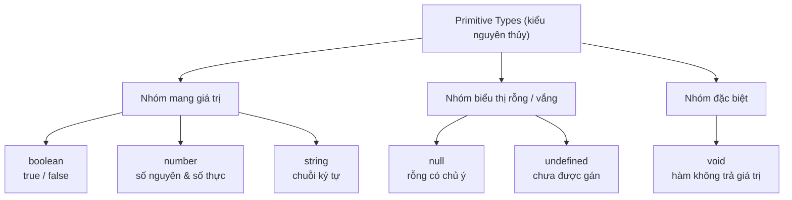

# Primitive Types

**Primitive types** (kiểu nguyên thủy) là những kiểu dữ liệu cơ bản nhất trong TypeScript, dùng để lưu một giá trị đơn lẻ như số, chuỗi hay true/false. Đây là nền tảng đầu tiên cần nắm trước khi học các kiểu phức tạp hơn. Bài này giới thiệu sáu kiểu nguyên thủy kế thừa từ JavaScript: `boolean`, `number`, `string`, `void`, `null` và `undefined`.

[](pathname:///img/typescript/primitive-types.webp)

---

:::note[Ghi nhớ nhanh]

- ⭐ **Sáu kiểu nguyên thủy** — `boolean`, `number`, `string`, `void`, `null`, `undefined` được kiểm tra chặt tại compile-time thay vì lộ lỗi lúc runtime.
- ⭐ **Bật `strictNullChecks`** — flag quan trọng nhất giúp `null`/`undefined` là kiểu riêng, phải khai báo tường minh qua union (`string | null`).
- **`number` là IEEE-754 64-bit** — không phân biệt int/float; vượt `Number.MAX_SAFE_INTEGER` phải dùng `bigint` (không tự convert).
- **`void` khác `undefined`** — `void` là "bỏ qua giá trị trả về" của hàm, còn `undefined` là một giá trị thực.
- **Phân biệt chữ hoa/thường** — `boolean` là primitive, `Boolean` là object wrapper (không nên dùng).

:::

---

## Mục lục

- [Vì sao cần kiểu tĩnh cho primitive?](#vì-sao-cần-kiểu-tĩnh-cho-primitive)
- [Tổng quan](#tổng-quan)
- [boolean](#boolean)
- [number](#number)
- [string](#string)
- [void](#void)
- [null và undefined](#null-và-undefined)
- [Câu hỏi phỏng vấn](#câu-hỏi-phỏng-vấn)

---

## Vì sao cần kiểu tĩnh cho primitive?

**Vấn đề:** JavaScript là ngôn ngữ **động kiểu** — một biến có thể giữ bất kỳ loại giá trị nào và bạn có thể gán/truyền sai kiểu mà không bị báo lỗi. Sai sót chỉ lộ ra **lúc chạy** (runtime), sinh ra bug khó tìm:

```ts
// JavaScript thuần — không ai cản
let age = 25;
age = "hai mươi lăm"; // không báo lỗi

function tongDiem(a, b) {
  return a + b;
}

tongDiem(10, "5"); // "105" — cộng number với string, kết quả sai
// Lỗi chỉ phát hiện khi chương trình đã chạy
```

**Giải pháp:** TypeScript cho phép thêm **chú thích kiểu** (`: string`, `: number`, `: boolean`...) cho primitive. Compiler kiểm tra **ngay lúc viết / lúc build**, bắt lỗi trước khi chạy và bật autocomplete trong IDE:

```ts
let age: number = 25;
age = "hai mươi lăm"; // Error ngay khi viết: không gán string cho number

function tongDiem(a: number, b: number): number {
  return a + b;
}

tongDiem(10, "5"); // Error: tham số thứ 2 phải là number
tongDiem(10, 5);   // OK → 15
```

:::tip[Dùng thực tế]

- **Tham số hàm đúng kiểu**: ép người gọi truyền đúng `number`/`string`, không lo cộng nhầm số với chuỗi.
- **Tránh `undefined is not a function`**: compiler cảnh báo khi biến có thể chưa được gán hoặc sai kiểu.
- **Refactor an toàn**: đổi tên/đổi kiểu một biến, compiler chỉ ra mọi chỗ bị ảnh hưởng.
- **IDE gợi ý (autocomplete)**: biết rõ kiểu nên gợi ý đúng phương thức (`.toFixed()` cho number, `.toUpperCase()` cho string).

:::

---

## Tổng quan

TypeScript có 6 kiểu primitive kế thừa từ JavaScript, được kiểm tra
chặt chẽ tại compile-time.

| Kiểu | Lưu giá trị |
|------|-------------|
| `boolean` | true / false |
| `number` | số nguyên & số thực |
| `string` | chuỗi ký tự |
| `void` | không có giá trị (dành cho hàm) |
| `null` | rỗng có chủ ý |
| `undefined` | chưa được gán |

Sơ đồ dưới đây phân loại 6 kiểu nguyên thủy theo nhóm ý nghĩa:



Cú pháp khai báo:

```ts
let tên: kiểu = giá_trị;
```

---

## boolean

```ts
let isActive: boolean = true;
let isDone: boolean = false;
```

:::warning[Cần lưu ý]

`boolean` (chữ thường) là **kiểu nguyên thủy**, còn `Boolean` (chữ hoa)
là **object wrapper** — đừng nhầm lẫn.

```ts
let a: boolean = true;
let b: Boolean = true;
a = b; // Error: Type 'Boolean' is not assignable to type 'boolean'
```

:::

---

## number

```ts
let age: number = 25;
let price: number = 9.99;
let hex: number = 0xff;
```

:::info[Phân tích]

TypeScript không phân biệt `int` / `float` — mọi số đều dùng chuẩn
**IEEE-754 double precision (64-bit)** giống JavaScript.

Giới hạn số nguyên an toàn: `Number.MAX_SAFE_INTEGER = 2^53 - 1`.
Vượt ngưỡng phải dùng `bigint`:

```ts
const safe: number = 9007199254740991;
const big: bigint = 9007199254740993n;
```

`number` và `bigint` **không tự động convert** qua lại — phải ép kiểu
tường minh.

:::

---

## string

```ts
let name: string = "Thuận";
let greet: string = `Hello ${name}`;
```

:::tip[Mẹo]

TypeScript hỗ trợ **string literal type** — dùng chính giá trị chuỗi
làm type, rất hữu ích để giới hạn input:

```ts
let direction: "left" | "right" = "left";
direction = "up"; // Error
```

Đây là nền tảng cho **discriminated union** và **template literal types**.

:::

---

## void

```ts
function log(msg: string): void {
  console.log(msg);
}
```

:::warning[Cần lưu ý]

`void` **khác** `undefined`:
- `void`: dùng cho **return type** — nghĩa là "đừng quan tâm giá trị
  trả về".
- `undefined`: là một **giá trị thực** mà biến có thể giữ.

Khi gán callback `() => void`, TypeScript **cho phép** hàm trả về giá
trị — vì `void` chỉ có nghĩa "ignore return", không phải "phải là
undefined":

```ts
type Callback = () => void;
const cb: Callback = () => 42; // OK, dù trả về number
```

:::

---

## null và undefined

```ts
let a: undefined = undefined;
let b: null = null;
```

- `undefined`: biến **chưa được gán**.
- `null`: gán **chủ ý** để biểu thị "rỗng".

:::info[Phân tích]

**`strictNullChecks`** là flag quan trọng nhất trong `tsconfig.json`
đối với type safety:

- **Tắt**: `null` và `undefined` được phép gán cho **mọi kiểu** →
  mất hết lợi ích của TypeScript.
- **Bật** (luôn nên bật): `null` và `undefined` là **kiểu riêng**,
  phải khai báo tường minh qua union.

```ts
// strictNullChecks: true
let name: string = null;        // Error
let name: string | null = null; // OK
```

:::

---

## Câu hỏi phỏng vấn

Những câu thường gặp về chủ đề này. Tự trả lời trước, rồi bấm **Xem đáp án** để đối chiếu.

**1. Kể sáu kiểu primitive được trình bày trong bài. Ngoài chúng, JavaScript và TypeScript còn kiểu nguyên thủy nào nữa?**

<details className="qa">
<summary>Xem đáp án</summary>

Sáu kiểu bài này trình bày:

| Kiểu | Lưu giá trị |
|---|---|
| `boolean` | true / false |
| `number` | số nguyên & số thực (IEEE-754 64-bit) |
| `string` | chuỗi ký tự |
| `void` | hàm không trả giá trị |
| `null` | rỗng có chủ ý |
| `undefined` | chưa được gán |

Ngoài ra JavaScript còn hai kiểu nguyên thủy nữa mà TypeScript cũng có type tương ứng:

- **`bigint`** (ES2020) — số nguyên lớn không giới hạn độ chính xác, viết với hậu tố `n`: `9007199254740993n`.
- **`symbol`** (ES6) — giá trị duy nhất, thường dùng làm key không đụng độ cho object.

Riêng phía TypeScript còn có các kiểu đặc biệt không phải primitive của JS như `any`, `unknown`, `never` — chúng chỉ tồn tại ở tầng type, không có ở runtime.

</details>

**2. Vì sao `number` trong TypeScript không phân biệt số nguyên với số thực? Chuẩn biểu diễn nào đứng sau?**

<details className="qa">
<summary>Xem đáp án</summary>

Vì TypeScript chỉ là lớp kiểu phủ lên JavaScript — nó không thêm kiểu số mới ở runtime. JavaScript chỉ có **một** kiểu số duy nhất, biểu diễn theo chuẩn **IEEE-754 double precision (64-bit)**, nên `1` và `1.0` là cùng một giá trị. Do đó TypeScript không có `int`, `float`, `double`, `long` như Java hay C#; tất cả gom vào `number`.

```ts
let age: number = 25;    // "số nguyên"
let price: number = 9.99; // số thực
let hex: number = 0xff;   // vẫn là number
```

Hệ quả cần nhớ: phép chia không tự làm tròn (`5 / 2` ra `2.5`), và số thực có sai số nhị phân (`0.1 + 0.2 !== 0.3`). Muốn diễn đạt "chỉ nhận số nguyên" thì phải tự kiểm tra ở runtime (`Number.isInteger`) hoặc dùng branded type, chứ hệ kiểu không làm thay.

</details>

**3. `Number.MAX_SAFE_INTEGER` bằng bao nhiêu, và điều gì xảy ra khi phép tính vượt ngưỡng đó? Khi nào phải chuyển sang `bigint`?**

<details className="qa">
<summary>Xem đáp án</summary>

`Number.MAX_SAFE_INTEGER` = `2^53 - 1` = `9007199254740991`. Đây là số nguyên lớn nhất mà kiểu `number` (IEEE-754 64-bit) còn biểu diễn được **chính xác từng đơn vị**.

Vượt ngưỡng, các số nguyên liền kề không còn phân biệt được nữa — kết quả bị làm tròn âm thầm, không có lỗi nào được ném ra:

```ts
const safe: number = 9007199254740991;
console.log(safe + 1); // 9007199254740992
console.log(safe + 2); // 9007199254740992 — sai!
```

Nên chuyển sang `bigint` khi làm việc với: ID lớn từ database (snowflake ID, ID 64-bit), số tiền tính theo đơn vị nhỏ nhất với giá trị rất lớn, timestamp nanosecond, hoặc tính toán mật mã. Ngược lại, với số lượng, giá tiền thông thường, chỉ số mảng thì `number` là đủ và nhanh hơn.

</details>

**4. `number` và `bigint` có tự động convert qua lại không? Đoán xem `const x: number = 1n;` báo lỗi gì.**

<details className="qa">
<summary>Xem đáp án</summary>

**Không.** `number` và `bigint` là hai kiểu hoàn toàn tách biệt, không gán lẫn nhau được và cũng không trộn trong cùng phép tính số học. Muốn chuyển phải ép tường minh bằng `Number(big)` hoặc `BigInt(num)`.

```ts
const x: number = 1n;
// Error: Type 'bigint' is not assignable to type 'number'.

const a: bigint = 10n;
const b: number = 5;
a + b; // Error: Operator '+' cannot be applied to types 'bigint' and 'number'.

const ok = a + BigInt(b); // 15n — phải ép tường minh
```

Lý do của quy định nghiêm ngặt này: `Number(bigint)` có thể **mất độ chính xác** khi giá trị vượt `MAX_SAFE_INTEGER`, còn `BigInt(number)` sẽ ném `RangeError` nếu số đó không phải số nguyên. Bắt lập trình viên viết rõ bước chuyển đổi giúp lỗi mất mát dữ liệu lộ ra ngay tại chỗ.

</details>

**5. `boolean` khác `Boolean` ở điểm nào? Vì sao gán một `Boolean` cho biến `boolean` lại lỗi?**

<details className="qa">
<summary>Xem đáp án</summary>

- `boolean` (chữ thường) là **kiểu nguyên thủy** — giá trị `true` / `false` thuần.
- `Boolean` (chữ hoa) là **object wrapper** — interface mô tả đối tượng bọc quanh giá trị boolean, tạo ra bằng `new Boolean(...)`.

```ts
let a: boolean = true;
let b: Boolean = true;
a = b; // Error: Type 'Boolean' is not assignable to type 'boolean'
```

Chiều gán chỉ đi được một hướng: mọi `boolean` đều dùng được ở nơi cần `Boolean` (vì primitive tự động được bọc khi gọi method), nhưng ngược lại thì không — một `Boolean` có thể là object thực sự, mà object thì luôn truthy kể cả khi bọc giá trị `false`:

```ts
if (new Boolean(false)) console.log("vẫn chạy!"); // object luôn truthy
```

Quy tắc chung: **luôn dùng chữ thường** — `boolean`, `number`, `string`. Các wrapper `Boolean`, `Number`, `String` gần như không bao giờ nên xuất hiện trong annotation.

</details>

**6. `void` khác `undefined` như thế nào? Khi nào dùng cái nào?**

<details className="qa">
<summary>Xem đáp án</summary>

| | `void` | `undefined` |
|---|---|---|
| Ý nghĩa | "đừng quan tâm giá trị trả về" | một **giá trị thực** |
| Vị trí dùng | return type của hàm | kiểu của biến / property |
| Gán được gì | hàm trả về bất cứ thứ gì (khi khớp signature) | chỉ chính giá trị `undefined` |

Dùng `void` khi khai báo hàm chỉ chạy để gây tác dụng phụ, không dùng kết quả:

```ts
function log(msg: string): void {
  console.log(msg);
}
```

Dùng `undefined` khi mô tả một giá trị có thể vắng mặt — thường trong union:

```ts
let found: string | undefined;
function find(id: number): User | undefined { /* ... */ }
```

Điểm dễ nhầm: `void` không có nghĩa là "phải trả về `undefined`". Với biến kiểu `void`, bạn gần như không làm được gì với giá trị đó — đó đúng là ý đồ thiết kế.

</details>

**7. Vì sao `const cb: () => void = () => 42;` được compiler chấp nhận dù hàm trả về `number`? Quy tắc đó phục vụ tình huống thực tế nào, ví dụ `arr.forEach(x => other.push(x))`?**

<details className="qa">
<summary>Xem đáp án</summary>

Vì `void` ở vị trí return type của một **kiểu hàm** mang nghĩa "người gọi sẽ bỏ qua giá trị trả về", chứ không phải "hàm bắt buộc trả về `undefined`". Trả thừa một giá trị mà không ai dùng thì hoàn toàn vô hại, nên TypeScript cho phép:

```ts
type Callback = () => void;
const cb: Callback = () => 42; // OK, dù trả về number
```

Lưu ý phân biệt: quy tắc nới lỏng này **chỉ áp dụng khi gán kiểu hàm**. Nếu khai báo trực tiếp `function f(): void { return 42; }` thì vẫn lỗi.

Tình huống thực tế chính là các callback rút gọn kiểu `arr.forEach(x => other.push(x))`. `forEach` khai báo callback trả `void`, còn `push` trả về `number` (độ dài mới). Nếu TypeScript bắt chặt, bạn sẽ phải viết `x => { other.push(x); }` với dấu ngoặc nhọn ở mọi chỗ. Tương tự với `.then(() => setState(...))`, `addEventListener("click", () => count++)`.

</details>

**8. `null` và `undefined` khác nhau về ngữ nghĩa ra sao? Trong thực tế nên thống nhất chọn cái nào để biểu thị "không có giá trị"?**

<details className="qa">
<summary>Xem đáp án</summary>

- `undefined`: **chưa được gán** — biến khai báo mà chưa có giá trị, property không tồn tại, hàm không `return`, tham số optional không truyền. Đây là trạng thái "vắng mặt" mặc định do chính engine tạo ra.
- `null`: **rỗng có chủ ý** — lập trình viên gán vào để nói "chỗ này cố ý trống", ví dụ user chưa chọn avatar, kết quả tìm kiếm không có.

```ts
let a: undefined = undefined; // chưa gán
let b: null = null;           // cố ý rỗng
```

Trong thực tế, **nên thống nhất một kiểu duy nhất trong codebase** để tránh phải kiểm tra cả hai ở mọi chỗ. Phần lớn dự án TypeScript hiện đại (và style guide của chính team TypeScript) chọn `undefined`, vì nó ăn khớp sẵn với optional property (`name?: string`), default parameter và optional chaining. `null` vẫn phải chấp nhận ở ranh giới hệ thống — JSON từ API, kết quả truy vấn database, các DOM API như `document.getElementById` — nên thường chuẩn hoá về `undefined` ngay tại lớp tiếp nhận dữ liệu.

</details>

**9. Bật và tắt `strictNullChecks` thì `let name: string = null;` khác nhau thế nào? Vì sao đây được coi là flag quan trọng nhất với type safety?**

<details className="qa">
<summary>Xem đáp án</summary>

```ts
// strictNullChecks: false → OK, compiler im lặng
// strictNullChecks: true  → Error: Type 'null' is not assignable to type 'string'
let name: string = null;

// Muốn hợp lệ khi bật flag, phải khai báo tường minh qua union:
let name2: string | null = null; // OK
```

- **Tắt**: `null` và `undefined` được coi là thành viên của **mọi kiểu** — gán vào đâu cũng lọt. Annotation `string` không còn bảo đảm điều gì.
- **Bật**: chúng trở thành **kiểu riêng**, muốn cho phép thì phải viết ra trong union, và compiler ép bạn thu hẹp kiểu (narrowing) trước khi dùng.

Đây là flag quan trọng nhất vì nhóm lỗi phổ biến nhất khi chạy JavaScript chính là `Cannot read property 'x' of null/undefined` — lỗi mà Tony Hoare gọi là "sai lầm tỷ đô". Khi tắt flag, TypeScript hoàn toàn bất lực trước nhóm lỗi này; bật lên thì compiler bắt gần như toàn bộ chúng ngay lúc build. `strictNullChecks` nằm trong nhóm bật sẵn khi đặt `"strict": true` trong `tsconfig.json`.

</details>

**10. String literal type là gì? Khai báo `let d: "left" | "right"` khác `let d: string` ở chỗ nào, và nó là nền tảng cho kỹ thuật nào?**

<details className="qa">
<summary>Xem đáp án</summary>

**String literal type** là dùng chính một giá trị chuỗi cụ thể làm kiểu. Kết hợp với union, nó tạo ra tập giá trị hợp lệ đóng kín:

```ts
let direction: "left" | "right" = "left";
direction = "up"; // Error
```

Khác biệt so với `string`:

- `string` nhận **mọi** chuỗi — gõ sai `"Left"`, `"lef"` compiler vẫn chấp nhận, lỗi chỉ lộ lúc chạy.
- `"left" | "right"` chỉ nhận đúng hai giá trị, sai là báo lỗi ngay. IDE còn autocomplete sẵn danh sách, và khi thu hẹp bằng `if`/`switch` thì compiler kiểm tra được bạn đã xử lý đủ nhánh chưa.

Đây là nền tảng cho:

- **Discriminated union** — dùng một field literal (`type: "circle" | "square"`) làm "thẻ" phân biệt để thu hẹp kiểu.
- **Template literal types** — ghép literal thành mẫu chuỗi, ví dụ `` type Event = `on${"Click" | "Focus"}` `` cho ra `"onClick" | "onFocus"`.

</details>

**11. Vì sao gán chuỗi cho `const` được suy ra literal type còn gán cho `let` lại suy ra `string`? Cú pháp nào ép giữ literal type cho một object?**

<details className="qa">
<summary>Xem đáp án</summary>

Vì `const` **không thể gán lại**, giá trị của nó vĩnh viễn là chuỗi đó, nên TypeScript suy ra kiểu hẹp nhất — chính literal type. Còn `let` có thể gán lại sau này, nên compiler nới rộng (widening) lên `string` để lần gán sau không lỗi:

```ts
const a = "left"; // kiểu: "left"
let b = "left";   // kiểu: string
b = "right";      // OK vì kiểu là string
```

Với object thì property luôn bị widening, kể cả khi object đó khai báo bằng `const`. Cách ép giữ literal là **`as const`**:

```ts
const o1 = { dir: "left" };            // { dir: string }
const o2 = { dir: "left" } as const;   // { readonly dir: "left" }

const arr = ["a", "b"] as const;       // readonly ["a", "b"] — tuple
```

`as const` làm mọi property thành `readonly` và giữ nguyên literal type, rất hay dùng cho bảng cấu hình, danh sách route, hoặc để rút ra union bằng `typeof arr[number]`.

</details>

**12. `any`, `unknown` và `never` khác nhau thế nào? Vì sao `unknown` là lựa chọn an toàn hơn `any` trong hầu hết trường hợp?**

<details className="qa">
<summary>Xem đáp án</summary>

| | `any` | `unknown` | `never` |
|---|---|---|---|
| Ý nghĩa | tắt kiểm tra kiểu | "chưa biết kiểu gì" | không giá trị nào thuộc kiểu này |
| Gán **vào** nó | mọi giá trị | mọi giá trị | không gì cả |
| Gán nó **ra** kiểu khác | được hết | chỉ `any` / `unknown` | được hết |
| Dùng trực tiếp | tự do, không kiểm tra | phải thu hẹp kiểu trước | không dùng được |

```ts
let a: any = JSON.parse(s);
a.foo.bar();        // compiler im lặng → nổ lúc runtime

let u: unknown = JSON.parse(s);
u.foo;              // Error: phải kiểm tra trước
if (typeof u === "string") u.toUpperCase(); // OK sau khi narrow
```

`unknown` an toàn hơn vì nó giữ nguyên tính "không biết": bạn vẫn nhận được mọi giá trị đầu vào, nhưng compiler **bắt buộc** kiểm tra kiểu (typeof, instanceof, type guard) trước khi dùng. `any` thì ngược lại — nó lây lan, làm tắt kiểm tra ở mọi chỗ giá trị đó đi qua, biến TypeScript về lại JavaScript một cách âm thầm. Vậy nên `unknown` là kiểu mặc định nên dùng ở ranh giới dữ liệu ngoài: `JSON.parse`, response API, biến trong `catch`.

</details>

**13. Hàm `function fail(): never { throw new Error("x"); }` — vì sao return type là `never` chứ không phải `void`?**

<details className="qa">
<summary>Xem đáp án</summary>

Vì hai kiểu mô tả hai chuyện khác nhau:

- `void`: hàm **chạy xong và trả về**, chỉ là không có giá trị hữu ích để trả.
- `never`: hàm **không bao giờ trả về** — nó luôn ném lỗi hoặc lặp vô hạn. Điểm cuối hàm là không thể chạm tới.

```ts
function log(msg: string): void { console.log(msg); }   // có trả về
function fail(): never { throw new Error("x"); }         // không bao giờ trả về
function loop(): never { while (true) {} }               // cũng vậy
```

Khai báo `never` cho compiler biết thêm thông tin để phân tích luồng: mọi dòng sau lời gọi `fail()` được coi là code chết, và trong nhánh `if` gọi `fail()` thì compiler hiểu nhánh đó kết thúc luôn nên phần còn lại vẫn được thu hẹp kiểu đúng. `never` cũng là kiểu rỗng — không giá trị nào thuộc về nó — nên nó là công cụ kinh điển cho exhaustiveness check trong `switch` trên discriminated union.

</details>

**14. Khi nào nên viết type annotation tường minh (`let age: number = 25`) và khi nào nên để TypeScript tự infer (`let age = 25`)?**

<details className="qa">
<summary>Xem đáp án</summary>

Nguyên tắc chung: **để infer cho biến cục bộ, viết tường minh ở ranh giới API**.

Nên để TypeScript tự suy ra khi:

- Khai báo biến cục bộ có giá trị khởi tạo rõ ràng — `let age = 25` đã ra `number`, ghi thêm `: number` chỉ là thừa và tạo thêm chỗ phải sửa khi refactor.
- Kết quả gán từ hàm đã có kiểu trả về rõ ràng.

Nên viết tường minh khi:

- **Tham số hàm** — TypeScript không tự đoán được, không ghi thì thành `any` ngầm.
- **Return type của hàm public** — chốt "hợp đồng" của hàm, để nếu thân hàm lỡ trả sai thì báo lỗi tại chính hàm đó chứ không phải ở nơi gọi.
- **Biến khai báo trước rồi gán sau**: `let result: string | null = null;` — không ghi thì kiểu bị suy ra hẹp sai.
- Khi muốn kiểu **rộng hơn** giá trị khởi tạo, ví dụ `let dir: "left" | "right" = "left";`.
- Shape dữ liệu quan trọng (config, model) — annotation đóng vai trò tài liệu và bắt lỗi ngay tại chỗ khai báo.

</details>
