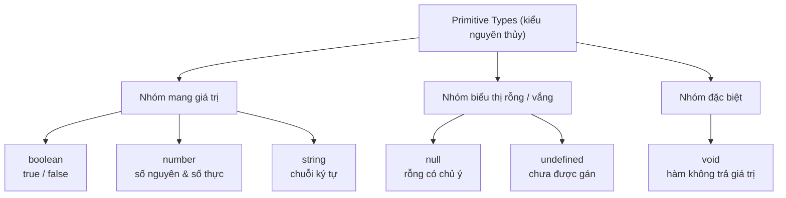

# Primitive Types

**Primitive types** (kiểu nguyên thủy) là những kiểu dữ liệu cơ bản nhất trong TypeScript, dùng để lưu một giá trị đơn lẻ như số, chuỗi hay true/false. Đây là nền tảng đầu tiên cần nắm trước khi học các kiểu phức tạp hơn. Bài này giới thiệu sáu kiểu nguyên thủy kế thừa từ JavaScript: `boolean`, `number`, `string`, `void`, `null` và `undefined`.

---

:::note[Ghi nhớ nhanh]

- ⭐ **Sáu kiểu nguyên thủy** — `boolean`, `number`, `string`, `void`, `null`, `undefined` được kiểm tra chặt tại compile-time thay vì lộ lỗi lúc runtime.
- ⭐ **Bật `strictNullChecks`** — flag quan trọng nhất giúp `null`/`undefined` là kiểu riêng, phải khai báo tường minh qua union (`string | null`).
- **`number` là IEEE-754 64-bit** — không phân biệt int/float; vượt `Number.MAX_SAFE_INTEGER` phải dùng `bigint` (không tự convert).
- **`void` khác `undefined`** — `void` là "bỏ qua giá trị trả về" của hàm, còn `undefined` là một giá trị thực.
- **Phân biệt chữ hoa/thường** — `boolean` là primitive, `Boolean` là object wrapper (không nên dùng).

:::

---

## Mục lục

- [Vì sao cần kiểu tĩnh cho primitive?](#vì-sao-cần-kiểu-tĩnh-cho-primitive)
- [Tổng quan](#tổng-quan)
- [boolean](#boolean)
- [number](#number)
- [string](#string)
- [void](#void)
- [null và undefined](#null-và-undefined)
- [Câu hỏi phỏng vấn](#câu-hỏi-phỏng-vấn)

---

## Vì sao cần kiểu tĩnh cho primitive?

**Vấn đề:** JavaScript là ngôn ngữ **động kiểu** — một biến có thể giữ bất kỳ loại giá trị nào và bạn có thể gán/truyền sai kiểu mà không bị báo lỗi. Sai sót chỉ lộ ra **lúc chạy** (runtime), sinh ra bug khó tìm:

```ts
// JavaScript thuần — không ai cản
let age = 25;
age = "hai mươi lăm"; // không báo lỗi

function tongDiem(a, b) {
  return a + b;
}

tongDiem(10, "5"); // "105" — cộng number với string, kết quả sai
// Lỗi chỉ phát hiện khi chương trình đã chạy
```

**Giải pháp:** TypeScript cho phép thêm **chú thích kiểu** (`: string`, `: number`, `: boolean`...) cho primitive. Compiler kiểm tra **ngay lúc viết / lúc build**, bắt lỗi trước khi chạy và bật autocomplete trong IDE:

```ts
let age: number = 25;
age = "hai mươi lăm"; // Error ngay khi viết: không gán string cho number

function tongDiem(a: number, b: number): number {
  return a + b;
}

tongDiem(10, "5"); // Error: tham số thứ 2 phải là number
tongDiem(10, 5);   // OK → 15
```

:::tip[Dùng thực tế]

- **Tham số hàm đúng kiểu**: ép người gọi truyền đúng `number`/`string`, không lo cộng nhầm số với chuỗi.
- **Tránh `undefined is not a function`**: compiler cảnh báo khi biến có thể chưa được gán hoặc sai kiểu.
- **Refactor an toàn**: đổi tên/đổi kiểu một biến, compiler chỉ ra mọi chỗ bị ảnh hưởng.
- **IDE gợi ý (autocomplete)**: biết rõ kiểu nên gợi ý đúng phương thức (`.toFixed()` cho number, `.toUpperCase()` cho string).

:::

---

## Tổng quan

TypeScript có 6 kiểu primitive kế thừa từ JavaScript, được kiểm tra
chặt chẽ tại compile-time.

| Kiểu | Lưu giá trị |
|------|-------------|
| `boolean` | true / false |
| `number` | số nguyên & số thực |
| `string` | chuỗi ký tự |
| `void` | không có giá trị (dành cho hàm) |
| `null` | rỗng có chủ ý |
| `undefined` | chưa được gán |

Sơ đồ dưới đây phân loại 6 kiểu nguyên thủy theo nhóm ý nghĩa:



Cú pháp khai báo:

```ts
let tên: kiểu = giá_trị;
```

---

## boolean

```ts
let isActive: boolean = true;
let isDone: boolean = false;
```

:::warning[Cần lưu ý]

`boolean` (chữ thường) là **kiểu nguyên thủy**, còn `Boolean` (chữ hoa)
là **object wrapper** — đừng nhầm lẫn.

```ts
let a: boolean = true;
let b: Boolean = true;
a = b; // Error: Type 'Boolean' is not assignable to type 'boolean'
```

:::

---

## number

```ts
let age: number = 25;
let price: number = 9.99;
let hex: number = 0xff;
```

:::info[Phân tích]

TypeScript không phân biệt `int` / `float` — mọi số đều dùng chuẩn
**IEEE-754 double precision (64-bit)** giống JavaScript.

Giới hạn số nguyên an toàn: `Number.MAX_SAFE_INTEGER = 2^53 - 1`.
Vượt ngưỡng phải dùng `bigint`:

```ts
const safe: number = 9007199254740991;
const big: bigint = 9007199254740993n;
```

`number` và `bigint` **không tự động convert** qua lại — phải ép kiểu
tường minh.

:::

---

## string

```ts
let name: string = "Thuận";
let greet: string = `Hello ${name}`;
```

:::tip[Mẹo]

TypeScript hỗ trợ **string literal type** — dùng chính giá trị chuỗi
làm type, rất hữu ích để giới hạn input:

```ts
let direction: "left" | "right" = "left";
direction = "up"; // Error
```

Đây là nền tảng cho **discriminated union** và **template literal types**.

:::

---

## void

```ts
function log(msg: string): void {
  console.log(msg);
}
```

:::warning[Cần lưu ý]

`void` **khác** `undefined`:
- `void`: dùng cho **return type** — nghĩa là "đừng quan tâm giá trị
  trả về".
- `undefined`: là một **giá trị thực** mà biến có thể giữ.

Khi gán callback `() => void`, TypeScript **cho phép** hàm trả về giá
trị — vì `void` chỉ có nghĩa "ignore return", không phải "phải là
undefined":

```ts
type Callback = () => void;
const cb: Callback = () => 42; // OK, dù trả về number
```

:::

---

## null và undefined

```ts
let a: undefined = undefined;
let b: null = null;
```

- `undefined`: biến **chưa được gán**.
- `null`: gán **chủ ý** để biểu thị "rỗng".

:::info[Phân tích]

**`strictNullChecks`** là flag quan trọng nhất trong `tsconfig.json`
đối với type safety:

- **Tắt**: `null` và `undefined` được phép gán cho **mọi kiểu** →
  mất hết lợi ích của TypeScript.
- **Bật** (luôn nên bật): `null` và `undefined` là **kiểu riêng**,
  phải khai báo tường minh qua union.

```ts
// strictNullChecks: true
let name: string = null;        // Error
let name: string | null = null; // OK
```

:::

---

## Câu hỏi phỏng vấn

Những câu thường gặp về chủ đề này. Tự trả lời trước, rồi đối chiếu lại với nội dung phía trên.

1. Kể sáu kiểu primitive được trình bày trong bài. Ngoài chúng, JavaScript và TypeScript còn kiểu nguyên thủy nào nữa?
2. Vì sao `number` trong TypeScript không phân biệt số nguyên với số thực? Chuẩn biểu diễn nào đứng sau?
3. `Number.MAX_SAFE_INTEGER` bằng bao nhiêu, và điều gì xảy ra khi phép tính vượt ngưỡng đó? Khi nào phải chuyển sang `bigint`?
4. `number` và `bigint` có tự động convert qua lại không? Đoán xem `const x: number = 1n;` báo lỗi gì.
5. `boolean` khác `Boolean` ở điểm nào? Vì sao gán một `Boolean` cho biến `boolean` lại lỗi?
6. `void` khác `undefined` như thế nào? Khi nào dùng cái nào?
7. Vì sao `const cb: () => void = () => 42;` được compiler chấp nhận dù hàm trả về `number`? Quy tắc đó phục vụ tình huống thực tế nào, ví dụ `arr.forEach(x => other.push(x))`?
8. `null` và `undefined` khác nhau về ngữ nghĩa ra sao? Trong thực tế nên thống nhất chọn cái nào để biểu thị "không có giá trị"?
9. Bật và tắt `strictNullChecks` thì `let name: string = null;` khác nhau thế nào? Vì sao đây được coi là flag quan trọng nhất với type safety?
10. **String literal type** là gì? Khai báo `let d: "left" | "right"` khác `let d: string` ở chỗ nào, và nó là nền tảng cho kỹ thuật nào?
11. Vì sao gán chuỗi cho `const` được suy ra literal type còn gán cho `let` lại suy ra `string`? Cú pháp nào ép giữ literal type cho một object?
12. `any`, `unknown` và `never` khác nhau thế nào? Vì sao `unknown` là lựa chọn an toàn hơn `any` trong hầu hết trường hợp?
13. Hàm `function fail(): never { throw new Error("x"); }` — vì sao return type là `never` chứ không phải `void`?
14. Khi nào nên viết type annotation tường minh (`let age: number = 25`) và khi nào nên để TypeScript tự infer (`let age = 25`)?
