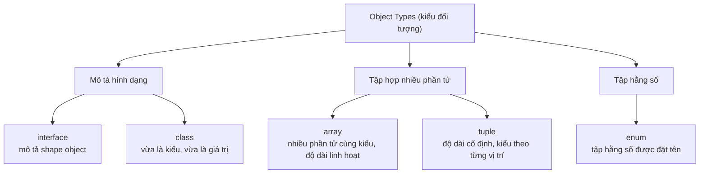

# Object Types

**Object types** (kiểu đối tượng) là các kiểu dùng để mô tả dữ liệu có cấu trúc — gồm nhiều giá trị gộp lại — thay vì một giá trị đơn lẻ như kiểu nguyên thủy. Bài này giới thiệu các kiểu đối tượng thường gặp trong TypeScript: `interface`, `class`, `enum`, `array` (mảng) và `tuple` (mảng cố định kiểu cho từng vị trí).

[](pathname:///img/typescript/object-types.webp)

---

:::note[Ghi nhớ nhanh]

- ⭐ **`interface` mô tả hình dạng (shape)** — bắt lỗi khi thiếu field, thừa field lạ hoặc sai kiểu; hỗ trợ `?` (optional) và `readonly`.
- ⭐ **Structural typing** — hai object cùng shape là tương thích, không cần `implements` tường minh (khác Java/C#).
- **`class` vừa là kiểu vừa là giá trị** — dùng làm type lẫn constructor.
- **`enum` có runtime cost** — numeric enum sinh reverse mapping; nhiều team thay bằng union string literal (`"Active" | "Inactive"`) nhẹ hơn.
- **`array` vs `tuple`** — array độ dài linh hoạt cùng kiểu; tuple độ dài cố định, kiểu theo từng vị trí. Bật `noUncheckedIndexedAccess` để index trả `T | undefined`.

:::

---

## Mục lục

- [Vì sao cần định kiểu cho object?](#vì-sao-cần-định-kiểu-cho-object)
- [Interface](#interface)
- [Class](#class)
- [Enum](#enum)
- [Array](#array)
- [Tuple](#tuple)
- [Câu hỏi phỏng vấn](#câu-hỏi-phỏng-vấn)

---

## Vì sao cần định kiểu cho object?

Object trong JavaScript không có **hình dạng (shape)** cố định: có thể thêm, bớt, sửa thuộc tính bất cứ lúc nào. Truy cập sai tên thuộc tính (gõ nhầm), thiếu field, hay gán sai kiểu cho field đều **không báo lỗi lúc viết code** — chỉ vỡ ra lúc chạy.

**Vấn đề:**

```ts
// JavaScript — không có ràng buộc shape
const user = { id: 1, name: "An", isActive: true };

console.log(user.nmae);     // undefined — gõ nhầm "name" → "nmae", không ai báo
console.log(user.email);    // undefined — field không tồn tại, vẫn chạy
user.isActive = "yes";      // gán sai kiểu (string thay vì boolean), vẫn chạy

// Lỗi chỉ lộ ra lúc runtime, có khi tận production
```

**Giải pháp:**

```ts
// TypeScript — mô tả HÌNH DẠNG object
interface User {
  readonly id: number;        // không cho sửa sau khi tạo
  name: string;               // bắt buộc
  isActive: boolean;          // đúng kiểu
  email?: string;             // optional (?)
  [key: string]: unknown;     // index signature — key động
}

const user: User = { id: 1, name: "An", isActive: true };

console.log(user.nmae);   // Error: thuộc tính 'nmae' không tồn tại
user.isActive = "yes";    // Error: 'string' không gán được cho 'boolean'
user.id = 2;              // Error: 'id' là readonly
```

Compiler bắt lỗi ngay khi **thiếu field bắt buộc, thừa field lạ, hoặc sai kiểu**, đồng thời editor **autocomplete** đúng tên thuộc tính nên gần như không gõ nhầm.

Sơ đồ dưới đây phân loại các kiểu đối tượng thường gặp trong bài này:



:::tip[Dùng thực tế]

- **Định kiểu response API**: mô tả shape JSON trả về để dùng `data.user.name` an toàn, không lo field đổi tên.
- **Props của component**: khai báo props bắt buộc/optional cho React, gọi thiếu prop là báo lỗi ngay.
- **Config object**: ràng buộc các tùy chọn cấu hình hợp lệ, tránh gõ nhầm key như `tiemout` thay vì `timeout`.
- **Dữ liệu lồng nhau (nested)**: mô tả object trong object (ví dụ `user.address.city`) để truy cập sâu vẫn được kiểm tra kiểu.

:::

---

## Interface

`interface` mô tả **hình dạng (shape)** của một object.

```ts
interface User {
  id: number;
  name: string;
  isActive: boolean;
}

const user: User = {
  id: 1,
  name: "An",
  isActive: true,
};
```

Property tùy chọn (`?`) và read-only (`readonly`):

```ts
interface Product {
  readonly id: number;
  name: string;
  description?: string;
}
```

:::info[Phân tích]

TypeScript dùng **structural typing** — hai object có cùng shape thì
tương thích, không cần `implements` interface tường minh:

```ts
interface Point { x: number; y: number; }
function distance(p: Point): number { return Math.hypot(p.x, p.y); }

distance({ x: 1, y: 2 }); // OK, không cần khai báo type
```

Đây là khác biệt lớn so với Java/C# (nominal typing).

:::

---

## Class

`class` định nghĩa cả **kiểu** lẫn **giá trị** (cấu trúc dữ liệu + logic).

```ts
class User {
  constructor(
    public id: number,
    public name: string,
  ) {}

  greet(): string {
    return `Hello ${this.name}`;
  }
}

const u = new User(1, "An");
```

Class vừa dùng làm type, vừa dùng làm constructor:

```ts
function printUser(user: User) {
  console.log(user.name);
}
```

---

## Enum

Enum là tập hằng số được đặt tên.

```ts
enum Status {
  Active,    // 0
  Inactive,  // 1
  Pending,   // 2
}

let s: Status = Status.Active;
```

Enum dạng string (rõ nghĩa hơn):

```ts
enum Role {
  Admin = "ADMIN",
  User = "USER",
}
```

:::warning[Cần lưu ý]

**Numeric enum** có behavior gọi là **reverse mapping** — vừa tra theo
key, vừa tra theo value:

```ts
enum Status { Active, Inactive }
Status.Active     // 0
Status[0]         // "Active"
```

Điều này khiến enum sinh ra **runtime code** (object 2 chiều), không
phải zero-cost như nhiều người tưởng. Trong codebase hiện đại, nhiều
team dùng **union of string literal** thay cho enum:

```ts
type Status = "Active" | "Inactive";
```

Nhẹ hơn, không có runtime cost, type-safe ngang nhau.

:::

---

## Array

Hai cách khai báo, tương đương:

```ts
let nums: number[] = [1, 2, 3];
let names: Array<string> = ["An", "Bình"];
```

Array các object:

```ts
const users: User[] = [
  { id: 1, name: "An" },
  { id: 2, name: "Bình" },
];
```

:::info[Phân tích]

Bật flag `noUncheckedIndexedAccess: true` để TS hiểu rằng truy cập
phần tử mảng có thể trả về `undefined`:

```ts
// noUncheckedIndexedAccess: true
const arr: number[] = [1, 2, 3];
const first = arr[0]; // type: number | undefined
```

Flag này không nằm trong `strict` nhưng cực kỳ quan trọng để tránh
crash khi truy cập index ngoài phạm vi.

:::

---

## Tuple

Tuple là mảng có **độ dài cố định** và **kiểu cho từng vị trí**.

```ts
let pair: [string, number] = ["age", 25];

// Sai thứ tự — Error
let wrong: [string, number] = [25, "age"];
```

Tuple với label (rõ nghĩa hơn):

```ts
type Coord = [x: number, y: number];
const p: Coord = [10, 20];
```

Rest tuple — hỗn hợp:

```ts
type StringFirst = [string, ...number[]];
const data: StringFirst = ["scores", 90, 85, 70];
```

:::tip[Mẹo]

Tuple rất hữu dụng cho hàm trả về **nhiều giá trị có ý nghĩa khác nhau**,
giống pattern `useState` của React:

```ts
function useCounter(): [number, () => void] {
  let count = 0;
  return [count, () => { count++; }];
}

const [count, increment] = useCounter();
```

:::

---

## Câu hỏi phỏng vấn

Những câu thường gặp về chủ đề này. Tự trả lời trước, rồi bấm **Xem đáp án** để đối chiếu.

**1. `interface` dùng để mô tả cái gì, và nó khác gì so với việc chỉ gán một object literal rồi để TypeScript tự suy luận?**

<details className="qa">
<summary>Xem đáp án</summary>

`interface` mô tả **hình dạng (shape)** của object: có những property nào, tên gì, kiểu gì, bắt buộc hay tùy chọn, có `readonly` không.

Khác biệt so với để TypeScript tự suy luận từ object literal:

- **Là hợp đồng dùng lại được**: một `interface User` khai báo một lần rồi áp cho tham số hàm, giá trị trả về, mảng, props component. Object literal chỉ suy ra kiểu cho đúng biến đó.
- **Ràng buộc hai chiều**: khi có annotation, compiler bắt lỗi ngay khi **thiếu field bắt buộc** hoặc **thừa field lạ**. Không có annotation thì shape nào cũng "đúng" theo chính nó.
- **Diễn đạt được thứ suy luận không ra**: `email?: string` (optional), `readonly id`, index signature, method overload.

```ts
interface User { id: number; name: string; isActive: boolean; }
const user: User = { id: 1, name: "An" }; // Error: thiếu isActive

const u2 = { id: 1, name: "An" }; // tự suy luận, không ai than phiền
```

</details>

**2. Structural typing là gì? Vì sao truyền thẳng `{ x: 1, y: 2 }` vào hàm nhận `Point` lại hợp lệ dù không hề khai báo `implements`?**

<details className="qa">
<summary>Xem đáp án</summary>

**Structural typing** ("duck typing" của hệ kiểu): hai kiểu tương thích khi **cấu trúc** của chúng khớp nhau, không cần khai báo quan hệ kế thừa hay `implements`. Nếu object có đủ các property mà kiểu đích yêu cầu, đúng kiểu, thì nó thuộc kiểu đó.

```ts
interface Point { x: number; y: number; }
function distance(p: Point): number { return Math.hypot(p.x, p.y); }

distance({ x: 1, y: 2 }); // OK — đủ x và y là hợp lệ
```

Đây là khác biệt lớn so với **nominal typing** của Java/C#, nơi một class chỉ thuộc về interface khi viết rõ `implements`. TypeScript chọn structural vì nó mô tả JavaScript — ngôn ngữ vốn làm việc với object literal tự do, dữ liệu JSON từ API không hề "implements" gì cả.

Lợi ích: rất linh hoạt, dễ mock trong test, không cần sửa code thư viện bên thứ ba để nó khớp interface của mình. Điểm cần cảnh giác: hai kiểu tình cờ trùng shape (ví dụ `UserId` và `OrderId` cùng là `{ id: number }`) sẽ lẫn lộn được với nhau; muốn tách bạch phải dùng thủ thuật branded type.

</details>

**3. Phân biệt property optional `name?: string` với property kiểu `name: string | undefined`. Hai cách khai báo này khác nhau ở điểm nào khi gọi/khởi tạo object?**

<details className="qa">
<summary>Xem đáp án</summary>

| | `name?: string` | `name: string \| undefined` |
|---|---|---|
| Được phép bỏ hẳn key | Có | **Không** — phải ghi ra |
| Gán `undefined` tường minh | Được (trừ khi bật `exactOptionalPropertyTypes`) | Được |
| Kiểu khi đọc ra | `string \| undefined` | `string \| undefined` |
| `"name" in obj` | có thể `false` | luôn `true` |

```ts
interface A { name?: string; }
interface B { name: string | undefined; }

const a: A = {};                  // OK
const b: B = {};                  // Error: thiếu property 'name'
const b2: B = { name: undefined }; // OK — phải viết ra
```

Khi đọc giá trị, cả hai đều cho kiểu `string | undefined` nên cách xử lý giống nhau. Khác biệt nằm ở **phía khởi tạo**: `?` nói "có thể không cần quan tâm tới field này", còn `| undefined` nói "bắt buộc phải quyết định, và bạn được phép quyết định là không có". Dạng thứ hai hữu ích khi muốn compiler nhắc bạn không quên field nào, ví dụ khi map dữ liệu từ API sang model nội bộ.

</details>

**4. `readonly` trong `interface` có thực sự ngăn được việc thay đổi giá trị lúc chạy (runtime) không? Vì sao?**

<details className="qa">
<summary>Xem đáp án</summary>

**Không.** `readonly` chỉ tồn tại ở **tầng kiểu**, được compiler kiểm tra lúc build rồi biến mất hoàn toàn trong JavaScript sinh ra. Nó không phải `Object.freeze`.

```ts
interface Product { readonly id: number; name: string; }

const p: Product = { id: 1, name: "Bàn phím" };
p.id = 2;              // Error lúc compile

// Nhưng lách qua kiểu thì runtime vẫn đổi được:
(p as any).id = 2;     // chạy bình thường, p.id === 2
```

Lý do: TypeScript theo triết lý **type erasure** — mọi annotation bị xoá khi transpile, code chạy vẫn là JavaScript thuần, không thêm chi phí kiểm tra runtime. Vì vậy `readonly` chỉ bảo vệ khỏi **lỗi vô ý của chính team mình**, không bảo vệ khỏi dữ liệu ngoài hay `any`.

Muốn bất biến thật ở runtime thì phải dùng `Object.freeze()` (chỉ nông một cấp), thư viện immutable, hoặc đơn giản là luôn tạo object mới thay vì sửa tại chỗ.

</details>

**5. Index signature `[key: string]: unknown` giải quyết vấn đề gì, và cái giá phải trả về mặt an toàn kiểu là gì?**

<details className="qa">
<summary>Xem đáp án</summary>

Index signature cho phép mô tả object có **key động** — không biết trước tên property, ví dụ từ điển dịch, bộ đếm theo id, hoặc phần dữ liệu mở rộng tuỳ ý trong response API.

```ts
interface Dict { [key: string]: unknown; }
const d: Dict = { a: 1, b: "x" };
d["bat-ky-key-nao"] = true; // OK
```

Cái giá phải trả:

- **Mất bảo vệ lỗi gõ nhầm**: `user.nmae` không còn báo lỗi nữa vì mọi key string đều hợp lệ. Đây thường là lý do chính người ta *không* nên thêm index signature vào interface model thông thường.
- **Autocomplete kém đi** — editor không có danh sách key để gợi ý.
- **Ràng buộc các property khai báo tường minh**: mọi property cụ thể trong cùng interface phải có kiểu gán được vào kiểu của index signature.
- Nếu kiểu index là `unknown` thì phải thu hẹp kiểu trước khi dùng; nếu là `any` thì an toàn kiểu mất hẳn.

Khi biết trước tập key, dùng `Record<"a" | "b", number>` hoặc `Map` sẽ chặt chẽ hơn nhiều.

</details>

**6. Excess property check là gì? Vì sao gán object literal thừa field vào biến kiểu `interface` thì báo lỗi, nhưng gán qua một biến trung gian lại không?**

<details className="qa">
<summary>Xem đáp án</summary>

**Excess property check** là kiểm tra bổ sung của TypeScript, chỉ áp dụng khi gán **object literal viết trực tiếp** vào một vị trí đã có kiểu: literal nào chứa property không nằm trong kiểu đích sẽ bị báo lỗi.

```ts
interface Point { x: number; y: number; }

const p: Point = { x: 1, y: 2, z: 3 }; // Error: 'z' không có trong Point

const tmp = { x: 1, y: 2, z: 3 };      // suy ra { x, y, z }
const p2: Point = tmp;                  // OK!
```

Vì sao lại khác nhau? Theo **structural typing** thuần tuý, `{ x, y, z }` có đủ `x` và `y` nên hoàn toàn tương thích với `Point` — trường hợp qua biến trung gian chính là luật gốc. Nhưng khi bạn viết literal ngay tại chỗ gán, gần như chắc chắn bạn không cố ý tạo field thừa — đó thường là **gõ nhầm tên** (`colour` thay vì `color`) hoặc hiểu sai API. Nên TypeScript thêm một lớp kiểm tra "cảnh báo thiện chí" cho riêng tình huống này.

Cách tắt có chủ đích: gán qua biến trung gian, dùng `as Point`, hoặc khai báo index signature.

</details>

**7. Khi nào nên dùng `interface`, khi nào nên dùng `type`? Nêu ít nhất hai việc `type` làm được mà `interface` không làm được.**

<details className="qa">
<summary>Xem đáp án</summary>

Với việc mô tả shape của object, hai cái gần như thay thế nhau được. Quy ước phổ biến: **`interface` cho shape object và cho API công khai có thể được mở rộng**; **`type` cho mọi thứ còn lại**.

Những việc chỉ `type` làm được:

- **Union type**: `type Status = "Active" | "Inactive";` — `interface` không diễn đạt được union.
- **Đặt tên cho primitive, tuple, kiểu hàm**: `type Id = string;`, `type Coord = [x: number, y: number];`.
- **Mapped type và conditional type**: `type Partial<T> = { [K in keyof T]?: T[K] };`, `type A<T> = T extends string ? ... : ...`.
- **Toán tử kiểu**: intersection `A & B`, `keyof`, `typeof`, template literal type.

Ngược lại, thứ `interface` có mà `type` không có là **declaration merging** — khai báo cùng tên nhiều lần sẽ được gộp lại. Đây là điểm mạnh khi cần mở rộng type của thư viện bên thứ ba, nhưng cũng là rủi ro "bị sửa ngầm" trong code ứng dụng. `interface` cũng thường cho thông báo lỗi dễ đọc hơn khi kiểu lồng nhau sâu.

</details>

**8. Nói `class` trong TypeScript vừa là kiểu vừa là giá trị nghĩa là sao? Cho ví dụ dùng cùng một `class` ở cả hai vai trò.**

<details className="qa">
<summary>Xem đáp án</summary>

Một khai báo `class` tạo ra **hai thứ cùng tên** nằm ở hai không gian khác nhau:

- **Giá trị** (value space): constructor function tồn tại thật lúc runtime — gọi được `new`, truy cập static member.
- **Kiểu** (type space): kiểu mô tả shape của instance — dùng được ở vị trí annotation.

```ts
class User {
  constructor(public id: number, public name: string) {}
  greet(): string { return `Hello ${this.name}`; }
}

// Vai trò GIÁ TRỊ: khởi tạo bằng new
const u = new User(1, "An");

// Vai trò KIỂU: annotation cho tham số
function printUser(user: User) {
  console.log(user.name);
}
printUser(u);
```

Đây là điểm khác `interface` và `type` — chúng chỉ tồn tại ở type space, bị xoá sạch khi biên dịch. Vì `class` để lại code runtime nên nó dùng được với `instanceof`, còn interface thì không. Lưu ý: kiểu `User` mô tả **instance**; muốn nói tới bản thân constructor phải viết `typeof User`.

</details>
**9. Reverse mapping của numeric `enum` hoạt động thế nào? Vì sao cơ chế này khiến `enum` sinh ra runtime code chứ không zero-cost?**

<details className="qa">
<summary>Xem đáp án</summary>

Với **numeric enum**, TypeScript sinh ra một object tra cứu được **cả hai chiều**: từ key ra số, và từ số ra key.

```ts
enum Status { Active, Inactive }
Status.Active; // 0
Status[0];     // "Active" — reverse mapping
```

Để làm được việc đó, compiler phải phát ra JavaScript thật, đại ý:

```js
var Status;
(function (Status) {
  Status[Status["Active"] = 0] = "Active";
  Status[Status["Inactive"] = 1] = "Inactive";
})(Status || (Status = {}));
```

Vì vậy `enum` **không zero-cost**: nó để lại một object trong bundle, khác hẳn `interface` hay `type` vốn bị xoá sạch. Object này cũng khó tree-shake vì được tạo trong IIFE gán vào biến, bundler khó chứng minh là không dùng tới.

Lưu ý: chỉ numeric enum mới có reverse mapping. **String enum không có** — vì giá trị chuỗi có thể trùng với tên key, ánh xạ ngược sẽ nhập nhằng.

</details>

**10. So sánh `enum` với union of string literal (`"Active" | "Inactive"`) về runtime cost, tree-shaking và mức độ an toàn kiểu.**

<details className="qa">
<summary>Xem đáp án</summary>

| Tiêu chí | `enum` | Union string literal |
|---|---|---|
| Runtime cost | Sinh object thật trong bundle | Bị xoá hoàn toàn, zero-cost |
| Tree-shaking | Khó (object tạo trong IIFE) | Không cần — không có gì để shake |
| An toàn kiểu | Tốt; numeric enum lỏng hơn (một số phiên bản cho gán số bất kỳ) | Tốt, chặt chẽ |
| Viết giá trị | Phải import và viết `Status.Active` | Viết thẳng `"Active"` |
| Ghép với JSON/API | Phải map qua lại | Khớp trực tiếp với chuỗi trong JSON |
| Duyệt hết giá trị | `Object.values(Status)` | Cần khai báo mảng `as const` rồi lấy `typeof arr[number]` |

```ts
type Status = "Active" | "Inactive";
const s: Status = "Active"; // gọn, không import gì

// Muốn có danh sách runtime thì:
const STATUSES = ["Active", "Inactive"] as const;
type Status2 = typeof STATUSES[number]; // "Active" | "Inactive"
```

Kết luận thực dụng: với dữ liệu đi qua API, union string literal thường là lựa chọn mặc định — nhẹ hơn, khớp thẳng với JSON, type-safe ngang nhau. `enum` vẫn hợp lý khi cần một object runtime để duyệt/hiển thị, hoặc khi codebase đã dùng thống nhất.

</details>

**11. `const enum` khác `enum` thường ở điểm nào? Vì sao nhiều team và bundler (isolatedModules) khuyến cáo tránh dùng nó?**

<details className="qa">
<summary>Xem đáp án</summary>

`const enum` được compiler **inline thẳng giá trị** tại nơi sử dụng và **không sinh object** nào ở runtime:

```ts
const enum Direction { Up, Down }
const d = Direction.Up;
// JS sinh ra: const d = 0 /* Direction.Up */;
```

Nghe thì lý tưởng, nhưng nó phá vỡ mô hình biên dịch từng file:

- Với **`isolatedModules`** (chế độ mà Babel, esbuild, SWC, Vite dùng), mỗi file được transpile **độc lập**, không đọc file khác. Trình transpile không biết `Direction.Up` bằng mấy nên không inline được — do đó `const enum` xuyên module bị cấm hoặc xử lý sai.
- Không có object runtime nên **không duyệt được giá trị**, không `Object.values` được.
- Không dùng an toàn trong file `.d.ts` phát hành ra ngoài: người dùng biên dịch với cấu hình khác sẽ gặp giá trị inline không khớp.

Vì vậy khuyến cáo phổ biến: tránh `const enum`; nếu muốn zero-cost thì dùng union string literal, còn nếu cần object runtime thì dùng `enum` thường hoặc object `as const`.

</details>

**12. `number[]` và `Array<number>` có khác nhau không? Trường hợp nào buộc phải viết dạng generic?**

<details className="qa">
<summary>Xem đáp án</summary>

Hai cách hoàn toàn **tương đương** về mặt kiểu — `number[]` chỉ là cú pháp rút gọn của `Array<number>`. Chọn cái nào là thuần quy ước code style (đa số style guide ưu tiên `T[]` cho gọn).

```ts
let nums: number[] = [1, 2, 3];
let names: Array<string> = ["An", "Bình"];
```

Trường hợp nên hoặc buộc phải dùng dạng generic:

- Khi kiểu phần tử là biểu thức phức tạp, dạng ngoặc vuông cần thêm dấu ngoặc và khó đọc: `Array<string | number>` rõ hơn `(string | number)[]`; `Array<() => void>` rõ hơn `(() => void)[]`.
- Khi muốn nhất quán với các kiểu generic khác trong cùng khai báo, ví dụ `Promise<Array<User>>`.
- Với `ReadonlyArray<T>` — có dạng rút gọn `readonly T[]`, nhưng nhiều team viết dạng đầy đủ cho rõ.

Một lưu ý nhỏ: `Array` là kiểu toàn cục do `lib.d.ts` cung cấp, nên nếu trong scope có một type tên `Array` do bạn tự khai báo thì `Array<number>` sẽ trỏ nhầm, còn `number[]` thì không bị.

</details>

**13. Tuple khác array ở những điểm nào? Đoán xem `let wrong: [string, number] = [25, "age"];` báo lỗi gì và tại sao.**

<details className="qa">
<summary>Xem đáp án</summary>

| | Array | Tuple |
|---|---|---|
| Độ dài | linh hoạt | cố định (trừ khi có rest element) |
| Kiểu phần tử | một kiểu chung cho mọi vị trí | riêng theo **từng vị trí** |
| Ý nghĩa | tập hợp đồng nhất | bản ghi có thứ tự, mỗi ô một vai trò |
| Truy cập index | luôn ra kiểu phần tử | ra đúng kiểu của vị trí đó |

Với `let wrong: [string, number] = [25, "age"];`, TypeScript báo **hai lỗi**, mỗi vị trí một lỗi:

```ts
let wrong: [string, number] = [25, "age"];
// Type 'number' is not assignable to type 'string'.   (vị trí 0)
// Type 'string' is not assignable to type 'number'.   (vị trí 1)
```

Lý do: tuple ràng buộc kiểu **theo thứ tự vị trí**, phần tử 0 phải là `string`, phần tử 1 phải là `number`. Ở đây giá trị đúng kiểu nhưng đặt ngược chỗ, nên cả hai ô đều sai. Với `number[]` hay `Array<string | number>` thì đoạn này lại hợp lệ — đó chính là giá trị mà tuple mang lại.

</details>

**14. Flag `noUncheckedIndexedAccess` làm gì? Vì sao khi bật, `arr[0]` lại có kiểu `number | undefined`, và tại sao flag này không nằm trong `strict`?**

<details className="qa">
<summary>Xem đáp án</summary>

Flag này khiến mọi lần truy cập qua **index** (mảng, hoặc object có index signature) trả về kiểu phần tử **kèm `undefined`**:

```ts
// noUncheckedIndexedAccess: true
const arr: number[] = [1, 2, 3];
const first = arr[0];      // number | undefined
first.toFixed();           // Error: có thể undefined
if (first !== undefined) first.toFixed(); // OK
```

Vì sao đúng? Kiểu `number[]` không mang thông tin về **độ dài**. `arr[10]` trên mảng ba phần tử trả về `undefined` ở runtime, nhưng nếu không bật flag thì compiler vẫn khẳng định đó là `number` — một lời nói dối dẫn thẳng tới `Cannot read property of undefined`.

Không nằm trong `strict` vì nó gây khá nhiều "ồn ào": mọi vòng lặp theo index, mọi lần đọc `matrix[i][j]` đều phải kiểm tra hoặc dùng `!`, kể cả khi bạn biết chắc index hợp lệ. Team TypeScript giữ nó ngoài `strict` để không phá vỡ hàng loạt codebase cũ. Dù vậy, với dự án mới thì rất nên bật — dùng kèm `for...of`, `.at()`, destructuring và optional chaining sẽ đỡ rườm rà đi nhiều.

</details>

**15. Labeled tuple (`[x: number, y: number]`) có tạo khác biệt nào lúc runtime không? Nó mang lại lợi ích gì?**

<details className="qa">
<summary>Xem đáp án</summary>

**Không có khác biệt gì lúc runtime.** Nhãn chỉ tồn tại ở tầng kiểu, biến mất hoàn toàn sau khi biên dịch — tuple vẫn là một mảng JavaScript thường, vẫn truy cập bằng chỉ số `p[0]`, `p[1]`, **không** truy cập được bằng `p.x`.

```ts
type Coord = [x: number, y: number];
const p: Coord = [10, 20];
p[0];  // 10
// p.x — không tồn tại
```

Lợi ích nằm ở khả năng đọc và tooling:

- **Tài liệu tại chỗ**: `[x: number, y: number]` nói rõ ô nào là gì, thay vì `[number, number]` mơ hồ về thứ tự.
- **Tooltip và signature help trong IDE** hiển thị tên nhãn, nhất là khi tuple được dùng làm danh sách tham số hàm (rest parameter) — lúc đó nhãn trở thành tên tham số gợi ý.
- **Thông báo lỗi dễ hiểu hơn**, nhắc đúng phần tử nào sai.

Lưu ý nhỏ về cú pháp: trong một tuple, hoặc **tất cả** phần tử đều có nhãn, hoặc không phần tử nào có — không trộn lẫn được.

</details>

**16. Rest element trong tuple (`[string, ...number[]]`) hoạt động ra sao? Có được đặt phần rest ở giữa tuple không?**

<details className="qa">
<summary>Xem đáp án</summary>

Rest element cho phép tuple có phần **cố định** kết hợp với phần **độ dài tuỳ ý**:

```ts
type StringFirst = [string, ...number[]];
const data: StringFirst = ["scores", 90, 85, 70]; // OK
const d2: StringFirst = ["scores"];               // OK — phần rest có thể rỗng
const d3: StringFirst = [90, 85];                 // Error — ô đầu phải là string
```

Về vị trí: từ TypeScript 4.2 (variadic tuple types), rest element **được phép nằm ở giữa hoặc ở đầu**, miễn là chỉ có **một** rest element trong tuple:

```ts
type A = [string, ...number[], boolean]; // hợp lệ
type B = [...string[], number];          // hợp lệ
type C = [...string[], ...number[]];     // Error: chỉ được một rest element
```

Ràng buộc còn lại: **phần tử optional (`?`) không được đứng sau rest element**, vì compiler sẽ không xác định được biên giữa hai phần. Ứng dụng thực tế phổ biến của rest tuple là mô tả danh sách tham số hàm — nền tảng cho các kiểu tiện ích như `Parameters<T>` và cho pattern bọc hàm (`(...args: [...Args, Callback]) => void`).

</details>
