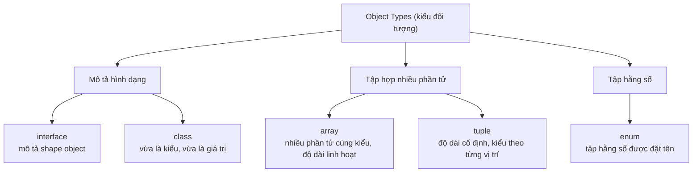

# Object Types

**Object types** (kiểu đối tượng) là các kiểu dùng để mô tả dữ liệu có cấu trúc — gồm nhiều giá trị gộp lại — thay vì một giá trị đơn lẻ như kiểu nguyên thủy. Bài này giới thiệu các kiểu đối tượng thường gặp trong TypeScript: `interface`, `class`, `enum`, `array` (mảng) và `tuple` (mảng cố định kiểu cho từng vị trí).

---

:::note[Ghi nhớ nhanh]

- ⭐ **`interface` mô tả hình dạng (shape)** — bắt lỗi khi thiếu field, thừa field lạ hoặc sai kiểu; hỗ trợ `?` (optional) và `readonly`.
- ⭐ **Structural typing** — hai object cùng shape là tương thích, không cần `implements` tường minh (khác Java/C#).
- **`class` vừa là kiểu vừa là giá trị** — dùng làm type lẫn constructor.
- **`enum` có runtime cost** — numeric enum sinh reverse mapping; nhiều team thay bằng union string literal (`"Active" | "Inactive"`) nhẹ hơn.
- **`array` vs `tuple`** — array độ dài linh hoạt cùng kiểu; tuple độ dài cố định, kiểu theo từng vị trí. Bật `noUncheckedIndexedAccess` để index trả `T | undefined`.

:::

---

## Mục lục

- [Vì sao cần định kiểu cho object?](#vì-sao-cần-định-kiểu-cho-object)
- [Interface](#interface)
- [Class](#class)
- [Enum](#enum)
- [Array](#array)
- [Tuple](#tuple)
- [Câu hỏi phỏng vấn](#câu-hỏi-phỏng-vấn)

---

## Vì sao cần định kiểu cho object?

Object trong JavaScript không có **hình dạng (shape)** cố định: có thể thêm, bớt, sửa thuộc tính bất cứ lúc nào. Truy cập sai tên thuộc tính (gõ nhầm), thiếu field, hay gán sai kiểu cho field đều **không báo lỗi lúc viết code** — chỉ vỡ ra lúc chạy.

**Vấn đề:**

```ts
// JavaScript — không có ràng buộc shape
const user = { id: 1, name: "An", isActive: true };

console.log(user.nmae);     // undefined — gõ nhầm "name" → "nmae", không ai báo
console.log(user.email);    // undefined — field không tồn tại, vẫn chạy
user.isActive = "yes";      // gán sai kiểu (string thay vì boolean), vẫn chạy

// Lỗi chỉ lộ ra lúc runtime, có khi tận production
```

**Giải pháp:**

```ts
// TypeScript — mô tả HÌNH DẠNG object
interface User {
  readonly id: number;        // không cho sửa sau khi tạo
  name: string;               // bắt buộc
  isActive: boolean;          // đúng kiểu
  email?: string;             // optional (?)
  [key: string]: unknown;     // index signature — key động
}

const user: User = { id: 1, name: "An", isActive: true };

console.log(user.nmae);   // Error: thuộc tính 'nmae' không tồn tại
user.isActive = "yes";    // Error: 'string' không gán được cho 'boolean'
user.id = 2;              // Error: 'id' là readonly
```

Compiler bắt lỗi ngay khi **thiếu field bắt buộc, thừa field lạ, hoặc sai kiểu**, đồng thời editor **autocomplete** đúng tên thuộc tính nên gần như không gõ nhầm.

Sơ đồ dưới đây phân loại các kiểu đối tượng thường gặp trong bài này:



:::tip[Dùng thực tế]

- **Định kiểu response API**: mô tả shape JSON trả về để dùng `data.user.name` an toàn, không lo field đổi tên.
- **Props của component**: khai báo props bắt buộc/optional cho React, gọi thiếu prop là báo lỗi ngay.
- **Config object**: ràng buộc các tùy chọn cấu hình hợp lệ, tránh gõ nhầm key như `tiemout` thay vì `timeout`.
- **Dữ liệu lồng nhau (nested)**: mô tả object trong object (ví dụ `user.address.city`) để truy cập sâu vẫn được kiểm tra kiểu.

:::

---

## Interface

`interface` mô tả **hình dạng (shape)** của một object.

```ts
interface User {
  id: number;
  name: string;
  isActive: boolean;
}

const user: User = {
  id: 1,
  name: "An",
  isActive: true,
};
```

Property tùy chọn (`?`) và read-only (`readonly`):

```ts
interface Product {
  readonly id: number;
  name: string;
  description?: string;
}
```

:::info[Phân tích]

TypeScript dùng **structural typing** — hai object có cùng shape thì
tương thích, không cần `implements` interface tường minh:

```ts
interface Point { x: number; y: number; }
function distance(p: Point): number { return Math.hypot(p.x, p.y); }

distance({ x: 1, y: 2 }); // OK, không cần khai báo type
```

Đây là khác biệt lớn so với Java/C# (nominal typing).

:::

---

## Class

`class` định nghĩa cả **kiểu** lẫn **giá trị** (cấu trúc dữ liệu + logic).

```ts
class User {
  constructor(
    public id: number,
    public name: string,
  ) {}

  greet(): string {
    return `Hello ${this.name}`;
  }
}

const u = new User(1, "An");
```

Class vừa dùng làm type, vừa dùng làm constructor:

```ts
function printUser(user: User) {
  console.log(user.name);
}
```

---

## Enum

Enum là tập hằng số được đặt tên.

```ts
enum Status {
  Active,    // 0
  Inactive,  // 1
  Pending,   // 2
}

let s: Status = Status.Active;
```

Enum dạng string (rõ nghĩa hơn):

```ts
enum Role {
  Admin = "ADMIN",
  User = "USER",
}
```

:::warning[Cần lưu ý]

**Numeric enum** có behavior gọi là **reverse mapping** — vừa tra theo
key, vừa tra theo value:

```ts
enum Status { Active, Inactive }
Status.Active     // 0
Status[0]         // "Active"
```

Điều này khiến enum sinh ra **runtime code** (object 2 chiều), không
phải zero-cost như nhiều người tưởng. Trong codebase hiện đại, nhiều
team dùng **union of string literal** thay cho enum:

```ts
type Status = "Active" | "Inactive";
```

Nhẹ hơn, không có runtime cost, type-safe ngang nhau.

:::

---

## Array

Hai cách khai báo, tương đương:

```ts
let nums: number[] = [1, 2, 3];
let names: Array<string> = ["An", "Bình"];
```

Array các object:

```ts
const users: User[] = [
  { id: 1, name: "An" },
  { id: 2, name: "Bình" },
];
```

:::info[Phân tích]

Bật flag `noUncheckedIndexedAccess: true` để TS hiểu rằng truy cập
phần tử mảng có thể trả về `undefined`:

```ts
// noUncheckedIndexedAccess: true
const arr: number[] = [1, 2, 3];
const first = arr[0]; // type: number | undefined
```

Flag này không nằm trong `strict` nhưng cực kỳ quan trọng để tránh
crash khi truy cập index ngoài phạm vi.

:::

---

## Tuple

Tuple là mảng có **độ dài cố định** và **kiểu cho từng vị trí**.

```ts
let pair: [string, number] = ["age", 25];

// Sai thứ tự — Error
let wrong: [string, number] = [25, "age"];
```

Tuple với label (rõ nghĩa hơn):

```ts
type Coord = [x: number, y: number];
const p: Coord = [10, 20];
```

Rest tuple — hỗn hợp:

```ts
type StringFirst = [string, ...number[]];
const data: StringFirst = ["scores", 90, 85, 70];
```

:::tip[Mẹo]

Tuple rất hữu dụng cho hàm trả về **nhiều giá trị có ý nghĩa khác nhau**,
giống pattern `useState` của React:

```ts
function useCounter(): [number, () => void] {
  let count = 0;
  return [count, () => { count++; }];
}

const [count, increment] = useCounter();
```

:::

---

## Câu hỏi phỏng vấn

Những câu thường gặp về chủ đề này. Tự trả lời trước, rồi đối chiếu lại với nội dung phía trên.

1. `interface` dùng để mô tả cái gì, và nó khác gì so với việc chỉ gán một object literal rồi để TypeScript tự suy luận?
2. Structural typing là gì? Vì sao truyền thẳng `{ x: 1, y: 2 }` vào hàm nhận `Point` lại hợp lệ dù không hề khai báo `implements`?
3. Phân biệt property optional `name?: string` với property kiểu `name: string | undefined`. Hai cách khai báo này khác nhau ở điểm nào khi gọi/khởi tạo object?
4. `readonly` trong `interface` có thực sự ngăn được việc thay đổi giá trị lúc chạy (runtime) không? Vì sao?
5. Index signature `[key: string]: unknown` giải quyết vấn đề gì, và cái giá phải trả về mặt an toàn kiểu là gì?
6. Excess property check là gì? Vì sao gán object literal thừa field vào biến kiểu `interface` thì báo lỗi, nhưng gán qua một biến trung gian lại không?
7. Khi nào nên dùng `interface`, khi nào nên dùng `type`? Nêu ít nhất hai việc `type` làm được mà `interface` không làm được.
8. Nói `class` trong TypeScript vừa là kiểu vừa là giá trị nghĩa là sao? Cho ví dụ dùng cùng một `class` ở cả hai vai trò.
9. Reverse mapping của numeric `enum` hoạt động thế nào? Vì sao cơ chế này khiến `enum` sinh ra runtime code chứ không zero-cost?
10. So sánh `enum` với union of string literal (`"Active" | "Inactive"`) về runtime cost, tree-shaking và mức độ an toàn kiểu.
11. `const enum` khác `enum` thường ở điểm nào? Vì sao nhiều team và bundler (isolatedModules) khuyến cáo tránh dùng nó?
12. `number[]` và `Array<number>` có khác nhau không? Trường hợp nào buộc phải viết dạng generic?
13. Tuple khác array ở những điểm nào? Đoán xem `let wrong: [string, number] = [25, "age"];` báo lỗi gì và tại sao.
14. Flag `noUncheckedIndexedAccess` làm gì? Vì sao khi bật, `arr[0]` lại có kiểu `number | undefined`, và tại sao flag này không nằm trong `strict`?
15. Labeled tuple (`[x: number, y: number]`) có tạo khác biệt nào lúc runtime không? Nó mang lại lợi ích gì?
16. Rest element trong tuple (`[string, ...number[]]`) hoạt động ra sao? Có được đặt phần rest ở giữa tuple không?
