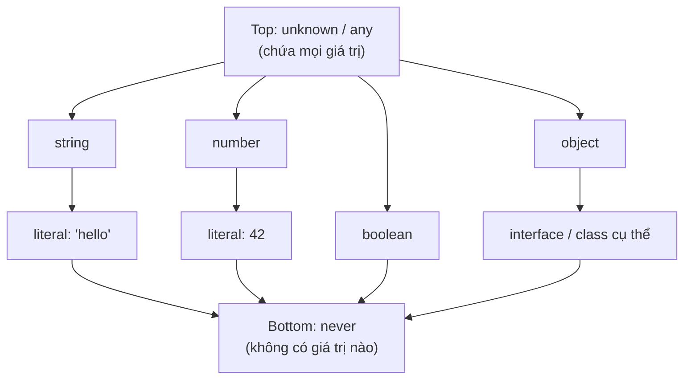

# Top types và Bottom types

**Top type** (kiểu đỉnh) là kiểu chứa được mọi giá trị, còn **bottom type** (kiểu đáy) là kiểu không chứa bất kỳ giá trị nào. Hiểu hai khái niệm này giúp bạn dùng đúng `any`, `unknown` (các kiểu đỉnh) và `never` (kiểu đáy) để viết code vừa linh hoạt vừa an toàn. Bài này giải thích từng kiểu và khi nào nên dùng chúng.

[](pathname:///img/typescript/top-bottom-types.webp)

---

:::note[Ghi nhớ nhanh]

- ⭐ **`unknown` thay cho `any`** — cùng nhận mọi giá trị nhưng bắt buộc narrow (type guard/Zod) trước khi dùng, giữ được type safety.
- ⭐ **`any` lan truyền như virus** — tắt hoàn toàn type-check và làm cả chain mất an toàn; chỉ dùng khi migrate JS cũ.
- **`never` là bottom type** — không chứa giá trị nào; dùng cho hàm luôn throw/loop vô hạn và exhaustiveness check trong `switch`.
- **`Object` vs `object`** — `Object` (hoa) nhận cả primitive nên vô dụng; `object` (thường) là mọi giá trị non-primitive.
- **Đặc tính `never`** — `never & T = never`, `never | T = T`, là subtype của mọi type (dùng trong conditional types).

:::

---

## Mục lục

- [Vì sao có any, unknown, never?](#vì-sao-có-any-unknown-never)
- [Khái niệm](#khái-niệm)
- [any](#any)
- [unknown](#unknown)
- [Object và object](#object-và-object)
- [never](#never)
- [Câu hỏi phỏng vấn](#câu-hỏi-phỏng-vấn)

---

## Vì sao có any, unknown, never?

**Vấn đề:** Đôi khi ta **không biết trước kiểu** dữ liệu — JSON trả từ API, hay code JS cũ chưa gắn type. Dùng `any` cho nhanh thì **tắt hết kiểm tra kiểu**, mất an toàn, dễ lỗi runtime:

```ts
const data: any = JSON.parse(input);
data.user.name.toUpperCase(); // OK lúc compile, crash nếu data không có user
```

**Giải pháp:** TS cung cấp các kiểu chuyên biệt để vẫn an toàn:

```ts
// unknown — top type AN TOÀN: nhận mọi giá trị, BẮT BUỘC narrow trước khi dùng
const data: unknown = JSON.parse(input);
if (typeof data === "object" && data !== null && "name" in data) {
  // đã thu hẹp kiểu, giờ mới dùng được
}

// never — bottom type: "không bao giờ có giá trị", cho hàm luôn throw/loop vô hạn
function fail(msg: string): never {
  throw new Error(msg);
}

// void — hàm không trả gì
function log(msg: string): void {
  console.log(msg);
}
```

:::tip[Dùng thực tế]

- **Parse JSON / dữ liệu API**: cho trả về `unknown` rồi validate (Zod, type guard) trước khi truy cập field.
- **Exhaustiveness check**: gán biến `never` ở nhánh `default` của `switch` trên union → quên xử lý case mới sẽ báo lỗi compile.
- **Gõ hàm luôn throw**: hàm báo lỗi / kết thúc tiến trình trả `never` để TS hiểu sau đó code không chạy tiếp.
- **Di chuyển dần từ JS**: dùng `any` tạm cho phần chưa kịp gắn type, rồi siết dần sang `unknown` / kiểu cụ thể.

:::

---

## Khái niệm

Trong type theory:

- **Top type**: kiểu chứa **mọi giá trị**. Trong TS có `any` và `unknown`.
- **Bottom type**: kiểu **không chứa giá trị nào**. Trong TS là `never`.

| Kiểu | Vị trí | Đặc điểm |
|------|--------|----------|
| `any` | Top | Tắt type check |
| `unknown` | Top | An toàn — phải narrow trước khi dùng |
| `Object` | Gần top | Object wrapper, hiếm dùng |
| `object` | Object thường | Bất kỳ non-primitive |
| `never` | Bottom | Không bao giờ có giá trị |

Có thể hình dung hệ thống type của TS như một tháp: `unknown`/`any` ở đỉnh chứa tất cả, `never` ở đáy không chứa gì — mũi tên đi xuống nghĩa là "kiểu hẹp hơn nằm trong kiểu rộng hơn":



---

## any

`any` **tắt hoàn toàn type-check** cho biến đó — TS coi như JavaScript thuần.

```ts
let x: any = 10;
x = "hello";       // OK
x = { a: 1 };      // OK
x.toUpperCase();   // OK lúc compile, crash runtime nếu x là number
```

:::warning[Cần lưu ý]

`any` lan truyền như **virus**: bất kỳ thao tác nào trên `any` cũng cho
ra `any`, khiến cả chain mất type safety:

```ts
const data: any = fetchData();
const name = data.user.name; // type: any
const upper = name.toUpperCase(); // type: any — không ai check
```

Quy tắc: **không bao giờ dùng `any`** trừ khi migrate code JS cũ. Dùng
`unknown` thay thế.

:::

---

## unknown

`unknown` là phiên bản **an toàn** của `any`. Có thể **nhận** mọi giá trị,
nhưng **không thao tác được** trước khi narrow type.

```ts
let x: unknown = fetchData();

x.toUpperCase();   // Error: Object is of type 'unknown'

if (typeof x === "string") {
  x.toUpperCase(); // OK — đã narrow xuống string
}
```

:::info[Phân tích]

`unknown` là kiểu **đúng nhất** cho:

- Dữ liệu từ API (`fetch().then(r => r.json())` thực ra trả về `any`,
  nên ép sang `unknown` rồi validate).
- Biến trong `catch (e)` (nếu bật `useUnknownInCatchVariables`).
- Tham số nhận từ ngoài hệ thống.

Kết hợp với **type guard** hoặc thư viện validation (Zod, io-ts) để
narrow an toàn:

```ts
async function loadUser(): Promise<User> {
  const raw: unknown = await fetch("/api/user").then(r => r.json());
  return UserSchema.parse(raw); // Zod validate
}
```

:::

---

## Object và object

Hai cái trông giống nhau nhưng khác nhau hoàn toàn:

| | `Object` (chữ hoa) | `object` (chữ thường) |
|--|--|--|
| Nghĩa | Mọi giá trị **không phải `null`/`undefined`** | Mọi giá trị **không phải primitive** |
| Bao gồm primitive? | Có (number, string... đều có boxed wrapper) | Không |
| Khuyến nghị | Tránh dùng | Dùng khi cần "bất kỳ object" |

```ts
const a: Object = 42;        // OK (number cũng là Object)
const b: object = 42;        // Error
const c: object = { x: 1 };  // OK
```

:::warning[Cần lưu ý]

`Object` (chữ hoa) gần như **vô dụng trong code thực** — nó nhận cả
primitive, nên không có ý nghĩa ràng buộc. Linter (`@typescript-eslint`)
mặc định cấm dùng `Object`, `Number`, `String`, `Boolean` chữ hoa làm
type annotation.

:::

---

## never

`never` là **bottom type** — không có giá trị nào thuộc kiểu này.

Dùng khi:

**1. Hàm không bao giờ trả về** (throw hoặc loop vô hạn):

```ts
function fail(msg: string): never {
  throw new Error(msg);
}

function loop(): never {
  while (true) {}
}
```

**2. Exhaustiveness check** trong `switch`:

```ts
type Shape = { kind: "circle" } | { kind: "square" };

function area(s: Shape) {
  switch (s.kind) {
    case "circle": return 1;
    case "square": return 2;
    default:
      const _exhaustive: never = s; // Đảm bảo đã xử lý hết case
      throw new Error("Unhandled");
  }
}
```

Nếu sau này thêm `{ kind: "triangle" }` vào `Shape`, dòng `_exhaustive: never`
sẽ báo lỗi compile → buộc bạn phải xử lý case mới.

:::info[Phân tích]

`never` là **subtype của mọi type**. Đặc tính:

- `never & T = never` (giao với mọi type ra never).
- `never | T = T` (hợp với mọi type bị nuốt mất).
- Mảng `never[]` chỉ có thể là `[]` (không nhét gì vào được).

Điều này được khai thác trong **conditional types** để loại bỏ nhánh
không hợp lệ:

```ts
type NonNullable<T> = T extends null | undefined ? never : T;
type X = NonNullable<string | null>; // string
```

:::

---

## Câu hỏi phỏng vấn

Những câu thường gặp về chủ đề này. Tự trả lời trước, rồi bấm **Xem đáp án** để đối chiếu.

**1. Top type và bottom type là gì? Trong TypeScript mỗi loại gồm những kiểu nào?**

<details className="qa">
<summary>Xem đáp án</summary>

Hai khái niệm mượn từ type theory, mô tả hai đầu của "tháp kiểu":

- **Top type** (kiểu đỉnh): kiểu chứa **mọi giá trị** — mọi kiểu khác đều gán được vào nó. Trong TypeScript có hai: **`any`** và **`unknown`**.
- **Bottom type** (kiểu đáy): kiểu **không chứa giá trị nào**, và là subtype của mọi kiểu. Trong TypeScript là **`never`**.

| Kiểu | Vị trí | Đặc điểm |
|---|---|---|
| `any` | Top | Tắt hoàn toàn type check |
| `unknown` | Top | An toàn — phải narrow trước khi dùng |
| `object` | Ở giữa | Mọi giá trị non-primitive |
| `never` | Bottom | Không bao giờ có giá trị |

Hình dung theo tập hợp: `unknown` là tập vũ trụ chứa tất cả, `never` là tập rỗng. Vì tập rỗng là tập con của mọi tập, `never` gán được vào bất cứ đâu — nhưng không có giá trị nào để mà gán. Điểm khác biệt quan trọng: `any` là top type "gian lận" — nó vừa nhận mọi thứ, vừa gán ngược ra mọi kiểu, nên phá vỡ hệ thống; `unknown` chỉ nhận vào chứ không cho ra tự do.

</details>

**2. `any` và `unknown` đều nhận được mọi giá trị — khác biệt cốt lõi giữa chúng nằm ở đâu?**

<details className="qa">
<summary>Xem đáp án</summary>

Khác biệt nằm ở **chiều ra**: cả hai nhận được mọi giá trị, nhưng `any` cho phép làm mọi thứ với giá trị đó, còn `unknown` thì chặn lại cho tới khi bạn chứng minh được kiểu.

```ts
let a: any = fetchData();
a.toUpperCase();   // compiler im lặng → crash runtime nếu a là number

let u: unknown = fetchData();
u.toUpperCase();   // Error: Object is of type 'unknown'
if (typeof u === "string") {
  u.toUpperCase(); // OK — đã narrow xuống string
}
```

| | `any` | `unknown` |
|---|---|---|
| Gán vào nó | mọi giá trị | mọi giá trị |
| Gán nó ra kiểu khác | được hết | chỉ `any` / `unknown` |
| Truy cập property, gọi method | tự do | phải narrow trước |
| Ảnh hưởng tới code xung quanh | lan truyền, tắt check cả chain | khoanh vùng tại chỗ |

Nói ngắn: `any` nghĩa là "tôi từ bỏ hệ kiểu ở đây", `unknown` nghĩa là "tôi chưa biết kiểu, nhưng vẫn muốn compiler canh chừng". Vì vậy `unknown` là mặc định nên dùng ở ranh giới dữ liệu ngoài.

</details>

**3. Vì sao nói `any` lan truyền như virus? Cho ví dụ một chuỗi thao tác làm mất hoàn toàn an toàn kiểu.**

<details className="qa">
<summary>Xem đáp án</summary>

Vì **mọi thao tác trên một giá trị `any` đều cho ra `any`**: truy cập property, gọi method, toán tử, giá trị trả về của hàm. Chỉ cần một điểm `any` ở đầu nguồn là cả chuỗi phía sau mất kiểm tra kiểu, mà không có cảnh báo nào.

```ts
const data: any = fetchData();
const name = data.user.name;       // type: any
const upper = name.toUpperCase();  // type: any — không ai check
const len: number = upper.lenght;  // gõ sai "length" vẫn lọt!
```

Tệ hơn, `any` gán được ra **mọi** kiểu, nên nó chui vào cả những biến đã khai báo kiểu đàng hoàng:

```ts
function getUser(): any { /* ... */ }
const u: User = getUser();  // không kiểm tra gì, User giờ có thể là bất cứ thứ gì
u.name.trim();              // crash nếu API đổi field
```

Đó là lý do quy tắc chung: **không dùng `any`** trừ khi đang migrate code JS cũ; dùng `unknown` rồi narrow, và bật `noImplicitAny` để compiler chỉ ra những chỗ `any` lọt vào một cách vô tình.

</details>

**4. Đoán lỗi: với `let x: unknown = fetchData();` thì `x.toUpperCase()` có biên dịch được không? Cần làm gì trước khi gọi được method đó?**

<details className="qa">
<summary>Xem đáp án</summary>

**Không biên dịch được.** Compiler báo đại ý: `'x' is of type 'unknown'` (bản cũ hơn: `Object is of type 'unknown'`). Với `unknown`, TypeScript không cho phép truy cập bất kỳ property hay method nào, kể cả `.toString()`.

Muốn dùng được, phải **thu hẹp kiểu (narrowing)** trước bằng một trong các cách:

```ts
// 1. typeof — cho primitive
if (typeof x === "string") x.toUpperCase();   // OK

// 2. instanceof — cho class
if (x instanceof Date) x.getTime();

// 3. type guard tự viết
function isUser(v: unknown): v is User {
  return typeof v === "object" && v !== null && "name" in v;
}
if (isUser(x)) x.name;

// 4. schema validation (Zod, io-ts) — an toàn nhất cho dữ liệu API
const user = UserSchema.parse(x);
```

Cũng có thể ép bằng `x as string`, nhưng đó chỉ là lời hứa với compiler chứ không kiểm tra gì ở runtime — chính là thứ mà `unknown` sinh ra để tránh.

</details>

**5. `unknown` có gán được cho `string` không, và ngược lại `string` có gán được cho `unknown` không? Giải thích theo quan hệ subtype.**

<details className="qa">
<summary>Xem đáp án</summary>

```ts
let s: string = "hi";
let u: unknown;

u = s;  // OK — string → unknown
s = u;  // Error: Type 'unknown' is not assignable to type 'string'
```

Quy tắc gán của TypeScript: giá trị chỉ đi được từ kiểu **hẹp hơn** sang kiểu **rộng hơn** (từ subtype lên supertype).

- `unknown` là **top type** — tập chứa mọi giá trị, nên `string` là tập con của nó. Gán `string` vào `unknown` luôn an toàn: mọi chuỗi đều là "một giá trị nào đó".
- Chiều ngược lại không an toàn: một biến `unknown` có thể đang giữ `number`, `null`, object bất kỳ. Cho gán xuống `string` là compiler tự nói dối về thứ nó không biết.

Muốn đi xuống thì phải **narrow** (`typeof`, type guard, validate) hoặc dùng type assertion `u as string` — và lúc đó trách nhiệm đúng/sai thuộc về lập trình viên.

Đối lập hoàn toàn là `never`: nó là **bottom type**, subtype của mọi kiểu, nên gán `never` cho `string` hợp lệ, còn `string` không gán được cho `never`.

</details>

**6. Phân biệt `never` và `void`. Hàm trả `void` khác hàm trả `never` ở chỗ nào về mặt luồng thực thi?**

<details className="qa">
<summary>Xem đáp án</summary>

| | `void` | `never` |
|---|---|---|
| Nghĩa | hàm **chạy xong và trả về**, chỉ không có giá trị hữu ích | hàm **không bao giờ trả về** |
| Có giá trị thuộc kiểu | có (`undefined`) | không có giá trị nào |
| Vị trí trong hệ kiểu | kiểu bình thường | bottom type |
| Code sau lời gọi | vẫn chạy | compiler coi là **không thể tới** |

```ts
function log(msg: string): void {
  console.log(msg);
}          // chạy xong, quay về nơi gọi

function fail(msg: string): never {
  throw new Error(msg);
}          // không bao giờ quay về

function loop(): never {
  while (true) {}
}
```

Khác biệt về luồng thực thi rất cụ thể trong phân tích của compiler: sau khi gọi một hàm trả `never`, TypeScript biết luồng kết thúc ở đó nên xử lý phần sau như code chết, và các nhánh còn lại vẫn được narrow đúng:

```ts
function handle(x: string | null) {
  if (x === null) fail("null!");
  x.toUpperCase(); // OK — TS biết nhánh trên không trả về
}
```

</details>

**7. Những trường hợp nào TypeScript tự suy luận ra `never`? Nêu ít nhất ba tình huống.**

<details className="qa">
<summary>Xem đáp án</summary>

Các tình huống phổ biến:

- **Hàm không bao giờ trả về**: một function expression hoặc arrow function luôn `throw` (hoặc lặp vô hạn) được suy ra kiểu trả về `never`. Lưu ý function declaration viết bằng `function ...` lại được suy ra `void`, muốn `never` thì phải khai báo tường minh.
- **Narrowing loại hết mọi khả năng**: thu hẹp tới mức không còn kiểu nào hợp lệ.

```ts
function f(x: string) {
  if (typeof x === "number") {
    x; // type: never — string không bao giờ là number
  }
}
```

- **Giao của các kiểu không tương thích**: `type A = string & number;` cho ra `never`, vì không giá trị nào vừa là chuỗi vừa là số.
- **Conditional type loại bỏ nhánh**: `Exclude<"a" | "b", "a" | "b">` cho ra `never` khi không còn thành viên nào.
- **Mảng rỗng không có ngữ cảnh kiểu** dưới `strictNullChecks`: `const a = [];` được suy ra `never[]`.
- **Nhánh `default` của một `switch` đã xử lý hết member** của discriminated union — chính là nền tảng của exhaustiveness check.

</details>

**8. Exhaustiveness check bằng `never` hoạt động thế nào? Điều gì xảy ra ở nhánh `default` khi ta thêm một member mới vào union?**

<details className="qa">
<summary>Xem đáp án</summary>

Ý tưởng: sau khi `switch` đã xử lý hết mọi member của union, kiểu của biến ở nhánh `default` bị thu hẹp còn `never`. Gán nó vào một biến khai báo `never` chính là "câu thần chú" bắt compiler xác nhận điều đó.

```ts
type Shape = { kind: "circle" } | { kind: "square" };

function area(s: Shape) {
  switch (s.kind) {
    case "circle": return 1;
    case "square": return 2;
    default:
      const _exhaustive: never = s; // s đã bị narrow còn never
      throw new Error("Unhandled");
  }
}
```

Khi thêm `{ kind: "triangle" }` vào `Shape` mà quên bổ sung `case`, ở nhánh `default` biến `s` không còn là `never` nữa mà là `{ kind: "triangle" }`. Gán nó cho biến kiểu `never` lập tức **lỗi compile**: `Type '{ kind: "triangle" }' is not assignable to type 'never'`.

Giá trị của kỹ thuật này: biến một lỗi lẽ ra chỉ lộ lúc runtime thành lỗi build, và thông báo lỗi chỉ đúng chỗ còn thiếu. Nhiều team gói nó thành hàm dùng chung `function assertNever(x: never): never { throw new Error(...) }` rồi gọi `assertNever(s)` ở `default`.

</details>
**9. Vì sao `never & T = never` còn `never | T = T`? Giải thích bằng khái niệm tập hợp.**

<details className="qa">
<summary>Xem đáp án</summary>

Coi mỗi kiểu là một **tập hợp các giá trị**. `never` là **tập rỗng** (∅) — không chứa giá trị nào.

- **Intersection (`&`) là phép giao**: `never & T` = ∅ ∩ T = ∅ = `never`. Giao của tập rỗng với bất cứ tập nào cũng rỗng, vì không có phần tử nào để mà chung.
- **Union (`|`) là phép hợp**: `never | T` = ∅ ∪ T = T. Thêm tập rỗng vào một tập không làm nó lớn thêm, nên `never` "biến mất" trong union.

```ts
type A = never & string;  // never
type B = never | string;  // string
type C = "a" | never | "b"; // "a" | "b" — never tự bị nuốt
```

Hệ quả thực tế rất hay dùng: trong **conditional type**, trả về `never` ở một nhánh đồng nghĩa với "loại thành viên này ra khỏi union". Đó là cơ chế đứng sau `Exclude`, `NonNullable`, `Extract`.

Một đặc tính liên quan: `never[]` là mảng mà không phần tử nào hợp lệ, nên giá trị duy nhất thuộc kiểu đó là mảng rỗng `[]`.

</details>

**10. Phân biệt `Object` (chữ hoa), `object` (chữ thường) và `{}`. Kiểu nào nhận được primitive, kiểu nào không?**

<details className="qa">
<summary>Xem đáp án</summary>

| Kiểu | Nhận primitive? | Nhận `null` / `undefined`? | Ý nghĩa |
|---|---|---|---|
| `Object` (hoa) | **Có** | Không | Interface của object wrapper, mọi giá trị đều có các member của `Object.prototype` |
| `object` (thường) | **Không** | Không | Mọi giá trị **non-primitive** — object, array, function |
| `{}` | **Có** | Không | "Bất cứ thứ gì không phải null/undefined" |

```ts
const a: Object = 42;        // OK — number cũng khớp Object
const b: object = 42;        // Error
const c: object = { x: 1 };  // OK
const d: {} = "hello";       // OK — {} không có nghĩa "object rỗng"!
const e: {} = null;          // Error
```

Bẫy hay gặp nhất là `{}`: nhìn tưởng "object không có property nào", nhưng thực chất nó chỉ yêu cầu "có không ít hơn 0 property" — tức là gần như mọi giá trị đều thoả, kể cả chuỗi và số. Muốn nói "object bất kỳ" thì dùng `object`; muốn nói "object có key động" thì dùng `Record<string, unknown>`; muốn nói "giá trị bất kỳ nhưng chưa biết kiểu" thì dùng `unknown`.

</details>

**11. Vì sao `@typescript-eslint` mặc định cấm dùng `Object`, `Number`, `String`, `Boolean` chữ hoa làm type annotation?**

<details className="qa">
<summary>Xem đáp án</summary>

Vì các tên chữ hoa là **interface của object wrapper**, không phải kiểu nguyên thủy, và dùng chúng gần như luôn là nhầm lẫn:

- **Rộng hơn mức mong muốn**: `Object` nhận cả `42`, `"hi"`, `true` — không ràng buộc được gì. `{}` cũng vậy.
- **Không tương thích ngược**: `boolean` gán vào `Boolean` được, nhưng `Boolean` không gán vào `boolean` được, gây lỗi khó hiểu ở chỗ tưởng như vô hại.

```ts
let a: boolean = true;
let b: Boolean = true;
a = b; // Error: Type 'Boolean' is not assignable to type 'boolean'
```

- **Lẫn lộn với hành vi runtime nguy hiểm**: object bọc luôn truthy, nên `new Boolean(false)` vẫn vào nhánh `if`. Viết `Boolean` trong annotation dễ khiến người đọc tưởng đây là chỗ dùng wrapper thật.

Quy tắc liên quan trong ESLint là `@typescript-eslint/no-restricted-types` (trước đây là `ban-types`), và khuyến nghị của nó rất đơn giản: luôn dùng chữ thường `boolean`, `number`, `string`; thay `Object`/`{}` bằng `object`, `Record<string, unknown>` hoặc `unknown` tuỳ ý định.

</details>

**12. Flag `useUnknownInCatchVariables` làm gì? Vì sao ở cấu hình cũ biến trong `catch (e)` lại là `any`, và điều đó nguy hiểm ra sao?**

<details className="qa">
<summary>Xem đáp án</summary>

Flag này (có từ TypeScript 4.4, nằm trong nhóm bật sẵn khi đặt `"strict": true`) đổi kiểu của biến trong `catch` từ `any` thành **`unknown`**.

```ts
// useUnknownInCatchVariables: true
try {
  risky();
} catch (e) {
  e.message;                    // Error: 'e' is of type 'unknown'
  if (e instanceof Error) {
    console.log(e.message);     // OK
  }
}
```

Trước đó mặc định là `any` đơn giản vì lý do lịch sử tương thích ngược — và vì `unknown` mãi tới TypeScript 3.0 mới có.

Nguy hiểm của `any` ở đây rất thật: trong JavaScript bạn có thể `throw` **bất cứ giá trị nào**, không nhất thiết là `Error`. Thư viện có thể ném chuỗi, ném object `{ code, message }`, còn Promise bị reject với giá trị bất kỳ cũng rơi vào `catch` của `await`. Viết `e.message` mà giá trị ném ra là chuỗi thì nhận `undefined`; nếu là `null` thì lỗi ngay trong chính khối `catch` — che mất lỗi gốc, cực kỳ khó debug. Ép narrow bằng `instanceof Error` khiến những trường hợp đó lộ ra lúc build.

</details>

**13. Trong `type NonNullable<T> = T extends null | undefined ? never : T`, vì sao trả về `never` lại có tác dụng loại bỏ nhánh khỏi union?**

<details className="qa">
<summary>Xem đáp án</summary>

Hai cơ chế kết hợp lại:

Thứ nhất, conditional type có tính **phân phối (distributive)** khi tham số kiểu đứng "trần" bên trái `extends`: với `T` là union, TypeScript áp dụng điều kiện cho **từng thành viên** rồi hợp kết quả lại.

Thứ hai, `never` **bị nuốt trong union** (`never | T = T`), như đã nói ở câu về tập hợp.

Ghép lại, `NonNullable<string | null>` được tính như sau:

```ts
type X = NonNullable<string | null>;
// = (string extends null|undefined ? never : string)
// | (null   extends null|undefined ? never : null)
// = string | never
// = string
```

Nhánh nào thoả điều kiện bị thay bằng `never`, và `never` tự biến mất khi hợp union — nên hiệu ứng cuối cùng đúng là "lọc bỏ thành viên đó". Đây là khuôn mẫu chung của mọi kiểu tiện ích dạng lọc: `Exclude<T, U>`, `Extract` (đảo điều kiện), hay các mapped type lọc key theo kiểu giá trị.

</details>

**14. Mảng `never[]` có ý nghĩa gì? Vì sao `const a = [];` trong một số ngữ cảnh strict lại được suy luận thành `never[]`?**

<details className="qa">
<summary>Xem đáp án</summary>

`never[]` là mảng mà **không giá trị nào là phần tử hợp lệ**. Hệ quả: giá trị duy nhất thuộc kiểu này là mảng rỗng, và mọi lần `push` đều lỗi.

```ts
const a: never[] = [];
a.push(1); // Error: 'number' không gán được cho 'never'
```

Vì sao `const a = [];` lại ra `never[]`? Vì mảng rỗng không cung cấp manh mối nào về kiểu phần tử. Khi không có **contextual type** (không có annotation, không phải tham số của hàm đã biết kiểu), compiler ở chế độ `strictNullChecks` chọn kiểu hẹp nhất có thể — `never[]`.

Trường hợp khai báo bằng `let`/`var` trong thân hàm thì TypeScript dùng cơ chế **evolving array**: nó theo dõi các lệnh `push`/gán index phía sau và mở rộng dần kiểu phần tử.

```ts
let b = [];     // theo dõi dần
b.push(1);
b.push("x");
b;              // (number | string)[]
```

Khi gặp lỗi kiểu `never[]` bất ngờ, cách xử lý đúng là khai báo kiểu ngay từ đầu: `const a: number[] = [];`.

</details>

**15. `unknown` được coi là top type an toàn, nhưng có trường hợp nào bắt buộc phải dùng `any` không? Nếu có thì nên khoanh vùng thế nào?**

<details className="qa">
<summary>Xem đáp án</summary>

Có một vài trường hợp `any` vẫn là lựa chọn thực tế:

- **Migrate dần code JavaScript cũ**: gắn `any` tạm cho phần chưa kịp mô tả kiểu, siết dần sau.
- **Ràng buộc generic dạng "hàm bất kỳ"**: `T extends (...args: any[]) => any` — dùng `unknown[]` ở vị trí tham số sẽ quá chặt vì tham số hàm là contravariant.
- **Bên trong phần thân của các kiểu tiện ích / code hạ tầng** mà chính chữ ký công khai vẫn chặt chẽ.
- **Type định nghĩa của thư viện bên thứ ba** quá phức tạp hoặc sai, cần lách qua tạm thời.

Cách khoanh vùng:

- Ép `any` ở **một điểm duy nhất**, ngay lập tức chuyển sang kiểu cụ thể hoặc `unknown`; đừng để nó chảy qua nhiều hàm.
- Bọc trong một hàm nhỏ có chữ ký công khai chuẩn (`function parse(raw: string): User`), phần `any` nằm gọn bên trong.
- Viết kèm `// eslint-disable-next-line` với lời giải thích, để chỗ đó hiện rõ trong review.
- Bật `noImplicitAny` để mọi `any` phải là cố ý, và cân nhắc `@typescript-eslint/no-explicit-any` ở mức cảnh báo để đếm được "nợ kỹ thuật".

</details>
