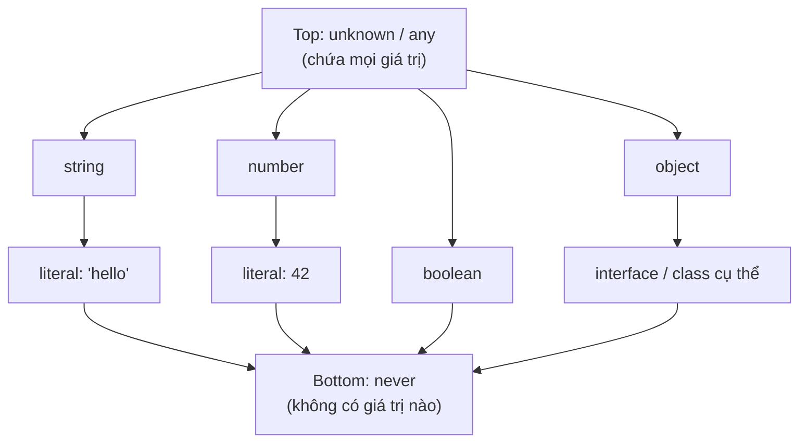

# Top types và Bottom types

**Top type** (kiểu đỉnh) là kiểu chứa được mọi giá trị, còn **bottom type** (kiểu đáy) là kiểu không chứa bất kỳ giá trị nào. Hiểu hai khái niệm này giúp bạn dùng đúng `any`, `unknown` (các kiểu đỉnh) và `never` (kiểu đáy) để viết code vừa linh hoạt vừa an toàn. Bài này giải thích từng kiểu và khi nào nên dùng chúng.

---

:::note[Ghi nhớ nhanh]

- ⭐ **`unknown` thay cho `any`** — cùng nhận mọi giá trị nhưng bắt buộc narrow (type guard/Zod) trước khi dùng, giữ được type safety.
- ⭐ **`any` lan truyền như virus** — tắt hoàn toàn type-check và làm cả chain mất an toàn; chỉ dùng khi migrate JS cũ.
- **`never` là bottom type** — không chứa giá trị nào; dùng cho hàm luôn throw/loop vô hạn và exhaustiveness check trong `switch`.
- **`Object` vs `object`** — `Object` (hoa) nhận cả primitive nên vô dụng; `object` (thường) là mọi giá trị non-primitive.
- **Đặc tính `never`** — `never & T = never`, `never | T = T`, là subtype của mọi type (dùng trong conditional types).

:::

---

## Mục lục

- [Vì sao có any, unknown, never?](#vì-sao-có-any-unknown-never)
- [Khái niệm](#khái-niệm)
- [any](#any)
- [unknown](#unknown)
- [Object và object](#object-và-object)
- [never](#never)

---

## Vì sao có any, unknown, never?

**Vấn đề:** Đôi khi ta **không biết trước kiểu** dữ liệu — JSON trả từ API, hay code JS cũ chưa gắn type. Dùng `any` cho nhanh thì **tắt hết kiểm tra kiểu**, mất an toàn, dễ lỗi runtime:

```ts
const data: any = JSON.parse(input);
data.user.name.toUpperCase(); // OK lúc compile, crash nếu data không có user
```

**Giải pháp:** TS cung cấp các kiểu chuyên biệt để vẫn an toàn:

```ts
// unknown — top type AN TOÀN: nhận mọi giá trị, BẮT BUỘC narrow trước khi dùng
const data: unknown = JSON.parse(input);
if (typeof data === "object" && data !== null && "name" in data) {
  // đã thu hẹp kiểu, giờ mới dùng được
}

// never — bottom type: "không bao giờ có giá trị", cho hàm luôn throw/loop vô hạn
function fail(msg: string): never {
  throw new Error(msg);
}

// void — hàm không trả gì
function log(msg: string): void {
  console.log(msg);
}
```

:::tip[Dùng thực tế]

- **Parse JSON / dữ liệu API**: cho trả về `unknown` rồi validate (Zod, type guard) trước khi truy cập field.
- **Exhaustiveness check**: gán biến `never` ở nhánh `default` của `switch` trên union → quên xử lý case mới sẽ báo lỗi compile.
- **Gõ hàm luôn throw**: hàm báo lỗi / kết thúc tiến trình trả `never` để TS hiểu sau đó code không chạy tiếp.
- **Di chuyển dần từ JS**: dùng `any` tạm cho phần chưa kịp gắn type, rồi siết dần sang `unknown` / kiểu cụ thể.

:::

---

## Khái niệm

Trong type theory:

- **Top type**: kiểu chứa **mọi giá trị**. Trong TS có `any` và `unknown`.
- **Bottom type**: kiểu **không chứa giá trị nào**. Trong TS là `never`.

| Kiểu | Vị trí | Đặc điểm |
|------|--------|----------|
| `any` | Top | Tắt type check |
| `unknown` | Top | An toàn — phải narrow trước khi dùng |
| `Object` | Gần top | Object wrapper, hiếm dùng |
| `object` | Object thường | Bất kỳ non-primitive |
| `never` | Bottom | Không bao giờ có giá trị |

Có thể hình dung hệ thống type của TS như một tháp: `unknown`/`any` ở đỉnh chứa tất cả, `never` ở đáy không chứa gì — mũi tên đi xuống nghĩa là "kiểu hẹp hơn nằm trong kiểu rộng hơn":



---

## any

`any` **tắt hoàn toàn type-check** cho biến đó — TS coi như JavaScript thuần.

```ts
let x: any = 10;
x = "hello";       // OK
x = { a: 1 };      // OK
x.toUpperCase();   // OK lúc compile, crash runtime nếu x là number
```

:::warning[Cần lưu ý]

`any` lan truyền như **virus**: bất kỳ thao tác nào trên `any` cũng cho
ra `any`, khiến cả chain mất type safety:

```ts
const data: any = fetchData();
const name = data.user.name; // type: any
const upper = name.toUpperCase(); // type: any — không ai check
```

Quy tắc: **không bao giờ dùng `any`** trừ khi migrate code JS cũ. Dùng
`unknown` thay thế.

:::

---

## unknown

`unknown` là phiên bản **an toàn** của `any`. Có thể **nhận** mọi giá trị,
nhưng **không thao tác được** trước khi narrow type.

```ts
let x: unknown = fetchData();

x.toUpperCase();   // Error: Object is of type 'unknown'

if (typeof x === "string") {
  x.toUpperCase(); // OK — đã narrow xuống string
}
```

:::info[Phân tích]

`unknown` là kiểu **đúng nhất** cho:

- Dữ liệu từ API (`fetch().then(r => r.json())` thực ra trả về `any`,
  nên ép sang `unknown` rồi validate).
- Biến trong `catch (e)` (nếu bật `useUnknownInCatchVariables`).
- Tham số nhận từ ngoài hệ thống.

Kết hợp với **type guard** hoặc thư viện validation (Zod, io-ts) để
narrow an toàn:

```ts
async function loadUser(): Promise<User> {
  const raw: unknown = await fetch("/api/user").then(r => r.json());
  return UserSchema.parse(raw); // Zod validate
}
```

:::

---

## Object và object

Hai cái trông giống nhau nhưng khác nhau hoàn toàn:

| | `Object` (chữ hoa) | `object` (chữ thường) |
|--|--|--|
| Nghĩa | Mọi giá trị **không phải `null`/`undefined`** | Mọi giá trị **không phải primitive** |
| Bao gồm primitive? | Có (number, string... đều có boxed wrapper) | Không |
| Khuyến nghị | Tránh dùng | Dùng khi cần "bất kỳ object" |

```ts
const a: Object = 42;        // OK (number cũng là Object)
const b: object = 42;        // Error
const c: object = { x: 1 };  // OK
```

:::warning[Cần lưu ý]

`Object` (chữ hoa) gần như **vô dụng trong code thực** — nó nhận cả
primitive, nên không có ý nghĩa ràng buộc. Linter (`@typescript-eslint`)
mặc định cấm dùng `Object`, `Number`, `String`, `Boolean` chữ hoa làm
type annotation.

:::

---

## never

`never` là **bottom type** — không có giá trị nào thuộc kiểu này.

Dùng khi:

**1. Hàm không bao giờ trả về** (throw hoặc loop vô hạn):

```ts
function fail(msg: string): never {
  throw new Error(msg);
}

function loop(): never {
  while (true) {}
}
```

**2. Exhaustiveness check** trong `switch`:

```ts
type Shape = { kind: "circle" } | { kind: "square" };

function area(s: Shape) {
  switch (s.kind) {
    case "circle": return 1;
    case "square": return 2;
    default:
      const _exhaustive: never = s; // Đảm bảo đã xử lý hết case
      throw new Error("Unhandled");
  }
}
```

Nếu sau này thêm `{ kind: "triangle" }` vào `Shape`, dòng `_exhaustive: never`
sẽ báo lỗi compile → buộc bạn phải xử lý case mới.

:::info[Phân tích]

`never` là **subtype của mọi type**. Đặc tính:

- `never & T = never` (giao với mọi type ra never).
- `never | T = T` (hợp với mọi type bị nuốt mất).
- Mảng `never[]` chỉ có thể là `[]` (không nhét gì vào được).

Điều này được khai thác trong **conditional types** để loại bỏ nhánh
không hợp lệ:

```ts
type NonNullable<T> = T extends null | undefined ? never : T;
type X = NonNullable<string | null>; // string
```

:::
