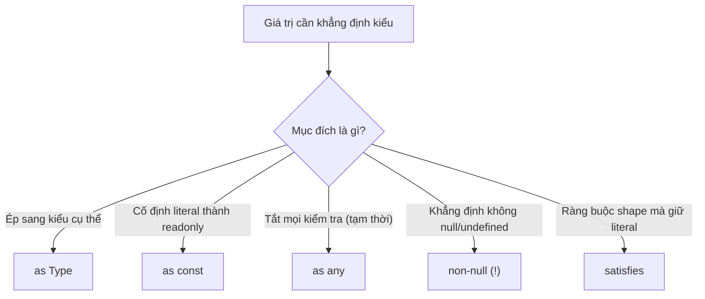
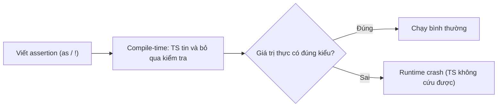

# Type Assertions

**Type assertion** (khẳng định kiểu) là cách bạn chủ động nói với TypeScript rằng một giá trị thuộc kiểu nào đó mà bạn đã biết chắc, để compiler tin theo thay vì tự suy luận. Lưu ý quan trọng: assertion chỉ tác động lúc biên dịch và **không kiểm tra tại runtime** (lúc chạy). Bài này giới thiệu các dạng assertion phổ biến như `as`, `as const`, non-null `!` và từ khóa `satisfies`.

---

## Mục lục

- [Vì sao có type assertion?](#vì-sao-có-type-assertion)
- [Assertion là gì?](#assertion-là-gì)
- [as Type](#as-type)
- [as const](#as-const)
- [as any](#as-any)
- [Non-null assertion (!)](#non-null-assertion-)
- [Từ khóa satisfies](#từ-khóa-satisfies)

---

## Vì sao có type assertion?

Đôi khi **lập trình viên biết kiểu chính xác hơn compiler**. TS phải suy luận an toàn nên trả về kiểu rộng hoặc cảnh báo quá thận trọng, dù bạn biết rõ giá trị thật là gì.

**Vấn đề:**

```ts
// getElementById trả HTMLElement | null, nhưng ta biết đó là input
const el = document.getElementById("name");
el.value = "abc"; // Error: el có thể null, và HTMLElement không có .value

// JSON.parse trả về any → mất hết kiểu
const data = JSON.parse('{"id":1}');
data.id; // any, không gợi ý gì
```

**Giải pháp:**

```ts
// `as` — nói cho compiler kiểu thật
const el = document.getElementById("name") as HTMLInputElement;
el.value = "abc"; // OK

// `as const` — cố định literal, biến thành readonly
const cfg = { method: "GET" } as const; // method: "GET" (không phải string)

// non-null `!` — khẳng định không null/undefined
const node = document.querySelector("#app")!;
```

:::tip[Dùng thực tế]

- **Ép kiểu DOM element**: `getElementById(...) as HTMLInputElement` để truy cập `.value`, `.checked`...
- **Kết quả `JSON.parse`**: gán kiểu cho dữ liệu `any` trả về (nhưng nên kèm validation cho dữ liệu ngoài).
- **Thu hẹp literal với `as const`**: tạo union/readonly từ mảng hoặc object hằng số.
- **Khẳng định non-null sau khi đã check**: khi logic đảm bảo giá trị tồn tại nhưng TS chưa suy luận được.

**Lưu ý:** assertion **không kiểm tra lúc chạy** — nó chỉ ghi đè kiểu cho compiler. Nếu giá trị thực sai, code vẫn lỗi runtime → ưu tiên **type guard** khi có thể.

:::

---

## Assertion là gì?

Assertion là cách **nói với TypeScript** rằng "tôi biết kiểu của giá trị
này, hãy tin tôi". TS sẽ **không kiểm tra runtime** — chỉ nhận type bạn
khai báo.

```ts
const data: unknown = "Hello";
const len = (data as string).length;
```

Có 5 dạng assertion chính, mỗi dạng có mục đích riêng.

Sơ đồ dưới đây tóm tắt: tùy mục đích mà chọn dạng assertion phù hợp.



---

## as Type

Ép kiểu sang một type cụ thể.

```ts
const input = document.getElementById("name") as HTMLInputElement;
console.log(input.value); // OK
```

Có thể chain qua `unknown` khi hai type không tương thích:

```ts
const x = "hello" as unknown as number; // Hai bước, TS không cản
```

:::warning[Cần lưu ý]

`as` **không phải ép kiểu runtime** — nó chỉ "lừa" type system. Nếu giá
trị thực sự không đúng, code vẫn crash:

```ts
const x = "hello" as unknown as number;
const result = x.toFixed(2); // Crash runtime: x.toFixed is not a function
```

→ Chỉ dùng `as` khi **bạn chắc chắn 100%** về kiểu. Với dữ liệu từ ngoài
(API, user), dùng validation runtime (Zod) thay vì `as`.

:::

Sơ đồ sau minh họa rủi ro: assertion chỉ tác động lúc biên dịch, nếu giá trị thực sai thì vẫn crash lúc chạy.



---

## as const

Biến giá trị thành **literal type bất biến (readonly)**.

```ts
const colors = ["red", "green"];
// type: string[]

const colors2 = ["red", "green"] as const;
// type: readonly ["red", "green"]
```

Áp dụng cho object — toàn bộ property thành `readonly`:

```ts
const config = {
  url: "/api",
  method: "GET",
} as const;
// type: { readonly url: "/api"; readonly method: "GET" }
```

:::tip[Mẹo]

`as const` cực mạnh khi kết hợp với `typeof` để tạo type từ giá trị
thực — không phải maintain hai chỗ:

```ts
const ROLES = ["admin", "user", "guest"] as const;
type Role = typeof ROLES[number]; // "admin" | "user" | "guest"
```

Một thay đổi (thêm "moderator" vào ROLES) tự động cập nhật type.

:::

---

## as any

Ép sang `any` — **tắt mọi check**. Dùng tạm khi không tìm được type
đúng, nhưng để lại nợ kỹ thuật.

```ts
const data = (response as any).user.name;
```

:::warning[Cần lưu ý]

`as any` là **tệ hơn cả** việc không dùng TS — vì nó tạo cảm giác an
toàn giả. Trong code review, mỗi lần thấy `as any` đều cần lý do rõ
ràng và TODO khắc phục.

Nếu chỉ muốn "qua lỗi tạm thời", dùng `as unknown as T` ít nguy hiểm
hơn — vì ít nhất bạn đã khai báo kiểu cuối mong muốn.

:::

---

## Non-null assertion (!)

Toán tử `!` nói "giá trị này chắc chắn không phải `null`/`undefined`".

```ts
function find(id: number): User | null {
  // ...
}

const user = find(1)!; // type: User (không còn null)
console.log(user.name);
```

Cũng dùng được trên truy cập property:

```ts
const el = document.getElementById("app")!;
el.innerHTML = "Hi";
```

:::warning[Cần lưu ý]

`!` chỉ tắt cảnh báo của TS — nếu giá trị thực sự là `null`, vẫn crash:

```ts
const el = document.getElementById("not-exist")!;
el.innerHTML = "Hi"; // TypeError: Cannot set properties of null
```

→ Ưu tiên dùng **kiểm tra thực**:

```ts
const el = document.getElementById("app");
if (!el) throw new Error("Missing #app");
el.innerHTML = "Hi";
```

`!` chỉ chấp nhận khi bạn có lý do logic chắc chắn (đã check ở chỗ
khác, framework đảm bảo...).

:::

---

## Từ khóa satisfies

`satisfies` (TS 4.9+) là cách **kiểm tra constraint** mà **không làm
mất type chính xác** (literal narrowing).

```ts
type Palette = Record<string, string | number>;

// Cách cũ — dùng `:` mất literal type
const colors1: Palette = {
  red: "#f00",
  blue: 42,
};
colors1.red.toUpperCase(); // Error: red có thể là number

// Cách mới — dùng `satisfies` giữ literal type
const colors2 = {
  red: "#f00",
  blue: 42,
} satisfies Palette;
colors2.red.toUpperCase(); // OK — TS biết red là string
```

:::info[Phân tích]

Khác biệt cốt lõi giữa 3 dạng:

| Cách viết | Kiểm tra constraint? | Giữ literal type? |
|-----------|---------------------|-------------------|
| `const x: T = ...` | Có | **Không** (widen) |
| `const x = ... as T` | **Không** (lừa TS) | Tùy |
| `const x = ... satisfies T` | Có | **Có** |

`satisfies` là cách viết "đúng nhất" trong 90% trường hợp khi bạn vừa
muốn ràng buộc shape, vừa muốn dùng được giá trị cụ thể bên trong.

:::
