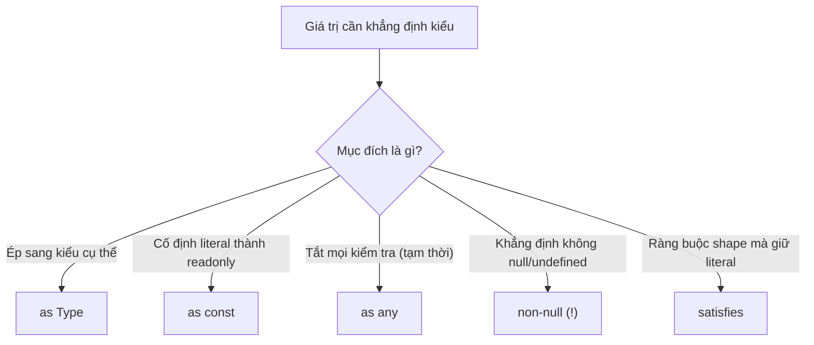
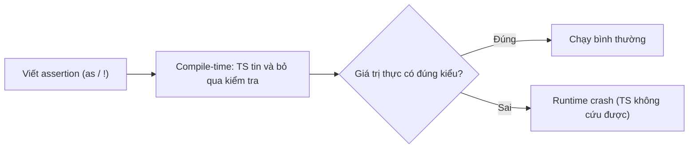

# Type Assertions

**Type assertion** (khẳng định kiểu) là cách bạn chủ động nói với TypeScript rằng một giá trị thuộc kiểu nào đó mà bạn đã biết chắc, để compiler tin theo thay vì tự suy luận. Lưu ý quan trọng: assertion chỉ tác động lúc biên dịch và **không kiểm tra tại runtime** (lúc chạy). Bài này giới thiệu các dạng assertion phổ biến như `as`, `as const`, non-null `!` và từ khóa `satisfies`.

[](pathname:///img/typescript/assertions.webp)

---

:::note[Ghi nhớ nhanh]

- ⭐ **Assertion không kiểm tra runtime** — chỉ "lừa" type system lúc biên dịch; nếu giá trị thực sai vẫn crash lúc chạy, nên ưu tiên type guard/validation (Zod).
- ⭐ **`satisfies` (TS 4.9+) là lựa chọn tốt nhất** — vừa kiểm tra constraint vừa giữ literal type, khác `: T` (widen) và `as T` (không check).
- **`as Type`** — ép sang kiểu cụ thể; chỉ dùng khi chắc chắn 100% về kiểu.
- **`as const`** — cố định literal thành readonly; mạnh khi kết hợp `typeof ARR[number]` để sinh union từ giá trị.
- **Non-null `!`** — khẳng định không `null`/`undefined`; chỉ tắt cảnh báo, vẫn crash nếu thực sự null. Tránh `as any` vì tạo an toàn giả.

:::

---

## Mục lục

- [Vì sao có type assertion?](#vì-sao-có-type-assertion)
- [Assertion là gì?](#assertion-là-gì)
- [as Type](#as-type)
- [as const](#as-const)
- [as any](#as-any)
- [Non-null assertion (!)](#non-null-assertion-)
- [Từ khóa satisfies](#từ-khóa-satisfies)
- [Câu hỏi phỏng vấn](#câu-hỏi-phỏng-vấn)

---

## Vì sao có type assertion?

Đôi khi **lập trình viên biết kiểu chính xác hơn compiler**. TS phải suy luận an toàn nên trả về kiểu rộng hoặc cảnh báo quá thận trọng, dù bạn biết rõ giá trị thật là gì.

**Vấn đề:**

```ts
// getElementById trả HTMLElement | null, nhưng ta biết đó là input
const el = document.getElementById("name");
el.value = "abc"; // Error: el có thể null, và HTMLElement không có .value

// JSON.parse trả về any → mất hết kiểu
const data = JSON.parse('{"id":1}');
data.id; // any, không gợi ý gì
```

**Giải pháp:**

```ts
// `as` — nói cho compiler kiểu thật
const el = document.getElementById("name") as HTMLInputElement;
el.value = "abc"; // OK

// `as const` — cố định literal, biến thành readonly
const cfg = { method: "GET" } as const; // method: "GET" (không phải string)

// non-null `!` — khẳng định không null/undefined
const node = document.querySelector("#app")!;
```

:::tip[Dùng thực tế]

- **Ép kiểu DOM element**: `getElementById(...) as HTMLInputElement` để truy cập `.value`, `.checked`...
- **Kết quả `JSON.parse`**: gán kiểu cho dữ liệu `any` trả về (nhưng nên kèm validation cho dữ liệu ngoài).
- **Thu hẹp literal với `as const`**: tạo union/readonly từ mảng hoặc object hằng số.
- **Khẳng định non-null sau khi đã check**: khi logic đảm bảo giá trị tồn tại nhưng TS chưa suy luận được.

**Lưu ý:** assertion **không kiểm tra lúc chạy** — nó chỉ ghi đè kiểu cho compiler. Nếu giá trị thực sai, code vẫn lỗi runtime → ưu tiên **type guard** khi có thể.

:::

---

## Assertion là gì?

Assertion là cách **nói với TypeScript** rằng "tôi biết kiểu của giá trị
này, hãy tin tôi". TS sẽ **không kiểm tra runtime** — chỉ nhận type bạn
khai báo.

```ts
const data: unknown = "Hello";
const len = (data as string).length;
```

Có 5 dạng assertion chính, mỗi dạng có mục đích riêng.

Sơ đồ dưới đây tóm tắt: tùy mục đích mà chọn dạng assertion phù hợp.



---

## as Type

Ép kiểu sang một type cụ thể.

```ts
const input = document.getElementById("name") as HTMLInputElement;
console.log(input.value); // OK
```

Có thể chain qua `unknown` khi hai type không tương thích:

```ts
const x = "hello" as unknown as number; // Hai bước, TS không cản
```

:::warning[Cần lưu ý]

`as` **không phải ép kiểu runtime** — nó chỉ "lừa" type system. Nếu giá
trị thực sự không đúng, code vẫn crash:

```ts
const x = "hello" as unknown as number;
const result = x.toFixed(2); // Crash runtime: x.toFixed is not a function
```

→ Chỉ dùng `as` khi **bạn chắc chắn 100%** về kiểu. Với dữ liệu từ ngoài
(API, user), dùng validation runtime (Zod) thay vì `as`.

:::

Sơ đồ sau minh họa rủi ro: assertion chỉ tác động lúc biên dịch, nếu giá trị thực sai thì vẫn crash lúc chạy.



---

## as const

Biến giá trị thành **literal type bất biến (readonly)**.

```ts
const colors = ["red", "green"];
// type: string[]

const colors2 = ["red", "green"] as const;
// type: readonly ["red", "green"]
```

Áp dụng cho object — toàn bộ property thành `readonly`:

```ts
const config = {
  url: "/api",
  method: "GET",
} as const;
// type: { readonly url: "/api"; readonly method: "GET" }
```

:::tip[Mẹo]

`as const` cực mạnh khi kết hợp với `typeof` để tạo type từ giá trị
thực — không phải maintain hai chỗ:

```ts
const ROLES = ["admin", "user", "guest"] as const;
type Role = typeof ROLES[number]; // "admin" | "user" | "guest"
```

Một thay đổi (thêm "moderator" vào ROLES) tự động cập nhật type.

:::

---

## as any

Ép sang `any` — **tắt mọi check**. Dùng tạm khi không tìm được type
đúng, nhưng để lại nợ kỹ thuật.

```ts
const data = (response as any).user.name;
```

:::warning[Cần lưu ý]

`as any` là **tệ hơn cả** việc không dùng TS — vì nó tạo cảm giác an
toàn giả. Trong code review, mỗi lần thấy `as any` đều cần lý do rõ
ràng và TODO khắc phục.

Nếu chỉ muốn "qua lỗi tạm thời", dùng `as unknown as T` ít nguy hiểm
hơn — vì ít nhất bạn đã khai báo kiểu cuối mong muốn.

:::

---

## Non-null assertion (!)

Toán tử `!` nói "giá trị này chắc chắn không phải `null`/`undefined`".

```ts
function find(id: number): User | null {
  // ...
}

const user = find(1)!; // type: User (không còn null)
console.log(user.name);
```

Cũng dùng được trên truy cập property:

```ts
const el = document.getElementById("app")!;
el.innerHTML = "Hi";
```

:::warning[Cần lưu ý]

`!` chỉ tắt cảnh báo của TS — nếu giá trị thực sự là `null`, vẫn crash:

```ts
const el = document.getElementById("not-exist")!;
el.innerHTML = "Hi"; // TypeError: Cannot set properties of null
```

→ Ưu tiên dùng **kiểm tra thực**:

```ts
const el = document.getElementById("app");
if (!el) throw new Error("Missing #app");
el.innerHTML = "Hi";
```

`!` chỉ chấp nhận khi bạn có lý do logic chắc chắn (đã check ở chỗ
khác, framework đảm bảo...).

:::

---

## Từ khóa satisfies

`satisfies` (TS 4.9+) là cách **kiểm tra constraint** mà **không làm
mất type chính xác** (literal narrowing).

```ts
type Palette = Record<string, string | number>;

// Cách cũ — dùng `:` mất literal type
const colors1: Palette = {
  red: "#f00",
  blue: 42,
};
colors1.red.toUpperCase(); // Error: red có thể là number

// Cách mới — dùng `satisfies` giữ literal type
const colors2 = {
  red: "#f00",
  blue: 42,
} satisfies Palette;
colors2.red.toUpperCase(); // OK — TS biết red là string
```

:::info[Phân tích]

Khác biệt cốt lõi giữa 3 dạng:

| Cách viết | Kiểm tra constraint? | Giữ literal type? |
|-----------|---------------------|-------------------|
| `const x: T = ...` | Có | **Không** (widen) |
| `const x = ... as T` | **Không** (lừa TS) | Tùy |
| `const x = ... satisfies T` | Có | **Có** |

`satisfies` là cách viết "đúng nhất" trong 90% trường hợp khi bạn vừa
muốn ràng buộc shape, vừa muốn dùng được giá trị cụ thể bên trong.

:::

---

## Câu hỏi phỏng vấn

Những câu thường gặp về chủ đề này. Tự trả lời trước, rồi bấm **Xem đáp án** để đối chiếu.

**1. Type assertion là gì? Vì sao nói nó chỉ tồn tại lúc biên dịch và biến mất hoàn toàn sau khi transpile?**

<details className="qa">
<summary>Xem đáp án</summary>

**Type assertion** là cách nói với compiler "tôi biết kiểu của giá trị này rõ hơn bạn, hãy tin tôi". Nó ghi đè kết quả suy luận kiểu, không thay đổi giá trị.

```ts
const data: unknown = "Hello";
const len = (data as string).length;
```

Nó biến mất sau khi transpile vì TypeScript theo nguyên tắc **type erasure**: mọi thứ thuộc tầng kiểu — annotation, interface, generic, assertion — bị xoá sạch, JavaScript sinh ra không có bất kỳ đoạn kiểm tra nào thêm.

```ts
// TypeScript
const len = (data as string).length;
```

```js
// JavaScript sinh ra
const len = data.length;
```

Hệ quả quan trọng nhất: assertion **không kiểm tra gì lúc chạy**. Nếu `data` thực ra là số, compiler im lặng nhưng chương trình vẫn crash. Vì thế `as` chỉ nên dùng khi bạn thật sự chắc chắn; với dữ liệu từ bên ngoài (API, input người dùng) phải dùng type guard hoặc validation runtime.

</details>

**2. `as Type` khác gì với type casting/conversion trong Java hay C#?**

<details className="qa">
<summary>Xem đáp án</summary>

Khác nhau căn bản: một bên là **chú thích cho compiler**, một bên là **thao tác thật lúc chạy**.

| | TypeScript `as` | Cast trong Java / C# |
|---|---|---|
| Có code runtime | Không — bị xoá khi biên dịch | Có |
| Kiểm tra khi sai kiểu | Không kiểm tra gì | Ném `ClassCastException` / `InvalidCastException` |
| Chuyển đổi giá trị | Không bao giờ | `(int) 3.9` thực sự đổi thành `3` |
| Hệ kiểu nền | Structural | Nominal |

```ts
const x = "hello" as unknown as number;
x.toFixed(2); // Crash runtime: x.toFixed is not a function
```

Trong Java, `(Dog) animal` sẽ kiểm tra tại chỗ và ném exception ngay nếu `animal` không phải `Dog` — bạn biết lỗi ở đúng dòng cast. Trong TypeScript, sai kiểu chỉ lộ ra ở một nơi nào đó xa hơn, khi ai đó gọi method không tồn tại.

Vì vậy đừng gọi `as` là "ép kiểu" — cách gọi chính xác hơn là **khẳng định kiểu**. Muốn chuyển đổi giá trị thật sự thì phải dùng hàm runtime: `Number(x)`, `String(x)`, `parseInt(x)`.

</details>

**3. TypeScript có cho phép assert bừa từ `string` sang `number` không? Quy tắc nào giới hạn những cặp kiểu được phép assert trực tiếp?**

<details className="qa">
<summary>Xem đáp án</summary>

**Không.** Compiler chặn lại:

```ts
const x = "hello" as number;
// Error: Conversion of type 'string' to type 'number' may be a mistake
// because neither type sufficiently overlaps with the other.
// If this was intentional, convert the expression to 'unknown' first.
```

Quy tắc: assertion `v as T` chỉ hợp lệ khi **một trong hai kiểu gán được vào kiểu kia** — tức là T hẹp hơn kiểu hiện tại, hoặc rộng hơn. Nói cách khác, hai kiểu phải "đủ chồng lấn".

```ts
const a = someUnknown as string;          // OK — đi xuống từ top type
const b = ({} as { x?: number });          // OK — hai shape tương thích
const c = (el as HTMLElement) as HTMLInputElement; // OK — subtype
const d = "hi" as number;                  // Error — không liên quan
```

Ý đồ thiết kế: assertion chỉ nên dùng để **thu hẹp hoặc mở rộng** hiểu biết về cùng một giá trị, chứ không phải để tuyên bố một giá trị là thứ hoàn toàn khác. Khi bạn cố làm chuyện sau, gần như chắc chắn là nhầm lẫn — nên compiler bắt bạn viết rõ ý định qua hai bước `as unknown as T`, đủ xấu xí để lộ ra trong code review.

</details>

**4. Vì sao muốn ép giữa hai kiểu không liên quan lại phải đi qua `as unknown as T`? Cách viết này nguy hiểm ở chỗ nào?**

<details className="qa">
<summary>Xem đáp án</summary>

Vì `unknown` là **top type** — mọi kiểu đều gán được vào nó, và từ nó có thể assert xuống bất kỳ kiểu nào. Đi vòng qua `unknown` tách một bước cấm thành hai bước hợp lệ:

```ts
const x = "hello" as unknown as number; // TS không cản nữa
```

Nguy hiểm nằm ở chỗ nó **vô hiệu hoá đúng cái lưới an toàn** mà quy tắc chồng lấn sinh ra. Compiler đã cố nói "hai kiểu này chẳng liên quan gì, bạn đang nhầm" và bạn trả lời "cứ làm đi":

```ts
const x = "hello" as unknown as number;
const result = x.toFixed(2); // Crash runtime: x.toFixed is not a function
```

Tệ hơn, lỗi không nổ tại dòng assertion mà nổ ở nơi giá trị được dùng — có thể cách đó nhiều module, nên rất khó lần ngược.

Khi nào chấp nhận được: viết test/mock (`{} as unknown as Repository`), lách qua type definition sai của thư viện bên thứ ba, hoặc code hạ tầng generic mà chữ ký công khai vẫn chặt. Mọi trường hợp khác nên thay bằng type guard hoặc validation. Nếu buộc phải dùng, hãy kèm comment giải thích lý do.

</details>

**5. `as const` làm gì với object và array? Tính `readonly` mà nó tạo ra là nông hay sâu (deep)?**

<details className="qa">
<summary>Xem đáp án</summary>

`as const` yêu cầu compiler suy luận kiểu **hẹp nhất có thể** và đánh dấu mọi thứ là `readonly`:

- Với **array**: từ mảng thường thành **readonly tuple** giữ nguyên literal.
- Với **object**: mọi property thành `readonly`, giá trị giữ literal type thay vì bị nới rộng.

```ts
const colors = ["red", "green"];
// string[]

const colors2 = ["red", "green"] as const;
// readonly ["red", "green"]

const config = { url: "/api", method: "GET" } as const;
// { readonly url: "/api"; readonly method: "GET" }
```

Về độ sâu: `as const` áp dụng **đệ quy (deep)** trên toàn bộ cây literal viết trực tiếp — object lồng trong object, mảng lồng trong mảng đều thành `readonly` và giữ literal.

```ts
const c = { db: { host: "local", ports: [1, 2] } } as const;
// c.db.ports là readonly [1, 2]; c.db.host là "local"
```

Nhưng đây vẫn chỉ là ràng buộc **ở tầng kiểu** — không phải `Object.freeze`. Lúc chạy giá trị vẫn sửa được nếu lách qua `any`. Và `as const` chỉ dùng được với literal viết ngay tại chỗ, không áp lên biến hay lời gọi hàm.

</details>

**6. Đoán kiểu: `const a = ["GET", "POST"];` và `const b = ["GET", "POST"] as const;` — mỗi biến được suy luận ra kiểu gì?**

<details className="qa">
<summary>Xem đáp án</summary>

```ts
const a = ["GET", "POST"];
// type: string[]

const b = ["GET", "POST"] as const;
// type: readonly ["GET", "POST"]
```

Vì sao `a` là `string[]` dù khai báo bằng `const`? Vì `const` chỉ khoá **tham chiếu tới mảng**, còn nội dung mảng thì vẫn sửa được — `a.push("PUT")`, `a[0] = "PATCH"` đều hợp lệ. Nên compiler nới rộng (widening) từng phần tử từ literal `"GET"` lên `string`, và coi độ dài là linh hoạt.

Với `as const`, kết quả khác ở ba điểm:

- **Giữ literal type** cho từng phần tử: `"GET"`, `"POST"` chứ không phải `string`.
- **Thành tuple**: độ dài cố định 2, kiểu gắn theo từng vị trí.
- **`readonly`**: `b.push(...)`, `b[0] = ...` đều báo lỗi compile.

```ts
a[0] = "PATCH"; // OK
b[0] = "PATCH"; // Error: Cannot assign to '0' because it is a read-only property
```

Đây chính là điều kiện để sinh union từ mảng bằng `typeof b[number]`.

</details>

**7. Pattern `typeof ARR[number]` để sinh union từ một mảng hoạt động thế nào? Vì sao bắt buộc phải có `as const` mới ra kết quả mong muốn?**

<details className="qa">
<summary>Xem đáp án</summary>

Pattern này gồm hai bước:

```ts
const ROLES = ["admin", "user", "guest"] as const;
type Role = typeof ROLES[number]; // "admin" | "user" | "guest"
```

- `typeof ROLES` chuyển **giá trị** `ROLES` sang **kiểu** của nó: `readonly ["admin", "user", "guest"]`.
- `[number]` là **indexed access type** — lấy kiểu tại mọi chỉ số kiểu `number`. Với tuple, kết quả là union của mọi phần tử.

Không có `as const` thì bước một đã hỏng:

```ts
const ROLES2 = ["admin", "user", "guest"];
type Role2 = typeof ROLES2[number]; // string — vô dụng
```

Vì mảng không `as const` được suy ra `string[]`, mọi phần tử đều là `string`, nên indexed access chỉ cho lại `string`.

Giá trị của pattern: **một nguồn sự thật duy nhất**. Bạn có mảng dùng được lúc runtime (để render dropdown, để validate) và union type sinh tự động từ chính nó. Thêm `"moderator"` vào mảng là type cập nhật theo ngay, không phải sửa hai chỗ và không sợ lệch nhau.

</details>

**8. Non-null assertion `!` khác gì optional chaining `?.` và toán tử nullish coalescing `??`?**

<details className="qa">
<summary>Xem đáp án</summary>

Ba thứ này hay bị xếp chung nhưng bản chất khác hẳn: `!` thuộc **tầng kiểu**, hai cái còn lại là **toán tử JavaScript thật**.

| | `!` | `?.` | `??` |
|---|---|---|---|
| Tồn tại lúc runtime | Không — bị xoá khi biên dịch | Có | Có |
| Việc nó làm | Khẳng định "không null/undefined" | Dừng và trả `undefined` nếu bên trái null/undefined | Trả vế phải nếu vế trái là null/undefined |
| Nếu giá trị thật là null | **Crash** | An toàn, trả `undefined` | An toàn, dùng giá trị mặc định |

```ts
user!.name;          // TS tin bạn; null → TypeError lúc chạy
user?.name;          // undefined nếu user null — an toàn
user?.name ?? "N/A"; // có giá trị mặc định
```

Lưu ý `??` chỉ nhảy vào vế phải khi vế trái là `null` hoặc `undefined`, khác `||` vốn nhảy với cả `0`, `""`, `false` — nên `count ?? 10` giữ được `count = 0`, còn `count || 10` thì không.

Quy tắc chọn: cần xử lý thật thì dùng `?.` / `??`; chỉ khi bạn có bằng chứng logic chắc chắn mà compiler không thấy được thì mới dùng `!`.

</details>

**9. Vì sao `!` bị coi là một trong những tính năng nguy hiểm nhất của TypeScript? Khi nào thì chấp nhận được?**

<details className="qa">
<summary>Xem đáp án</summary>

Vì nó **tắt đúng cái bảo vệ giá trị nhất** mà TypeScript mang lại — `strictNullChecks` — và làm việc đó chỉ bằng một ký tự, dễ gõ, dễ lọt qua review.

```ts
const el = document.getElementById("not-exist")!;
el.innerHTML = "Hi"; // TypeError: Cannot set properties of null
```

Mấy điểm khiến nó đặc biệt rủi ro:

- Không để lại dấu vết runtime, nên khi crash không có thông báo nào chỉ về chỗ đã khẳng định sai.
- Nó thường được dùng như cách "làm im lỗi đỏ trong editor" chứ không phải sau khi suy nghĩ.
- Giả định có thể **đúng hôm nay, sai ngày mai** — DOM đổi, API đổi field, thứ tự khởi tạo đổi, mà `!` thì không ai xem lại.

Chấp nhận được khi bạn có lý do logic vững và nói ra được: giá trị đã được khởi tạo bởi framework trước khi code chạy; đã kiểm tra ở một chỗ mà control-flow analysis không lần được qua (ví dụ sau một hàm helper kiểm tra); hoặc trong test/script nhỏ. Kể cả vậy, phương án tốt hơn thường có sẵn:

```ts
const el = document.getElementById("app");
if (!el) throw new Error("Missing #app");
el.innerHTML = "Hi"; // narrow thật, thông báo lỗi rõ ràng
```

</details>

**10. Đoán lỗi: `const el = document.getElementById("app")!; el.innerHTML = "x";` — đoạn này đã an toàn chưa, chuyện gì xảy ra nếu phần tử không tồn tại?**

<details className="qa">
<summary>Xem đáp án</summary>

**Chưa an toàn.** Đoạn code biên dịch sạch vì `!` đã thu kiểu từ `HTMLElement | null` xuống `HTMLElement`, nhưng chẳng có kiểm tra nào ở runtime.

Nếu trang không có phần tử `id="app"`, `getElementById` trả về `null`, và dòng sau ném:

```
TypeError: Cannot set properties of null (setting 'innerHTML')
```

Các tình huống thực tế khiến nó xảy ra: script chạy trong `<head>` trước khi DOM parse xong, id bị đổi tên trong HTML, component render muộn, hoặc cùng đoạn code chạy trên một trang khác không có phần tử đó.

Cách viết an toàn — kiểm tra thật, và thông báo lỗi nói rõ nguyên nhân:

```ts
const el = document.getElementById("app");
if (!el) throw new Error("Missing #app element");
el.innerHTML = "x"; // el đã được narrow thành HTMLElement
```

Hoặc xử lý mềm hơn khi phần tử là tuỳ chọn:

```ts
document.getElementById("app")?.replaceChildren("x");
```

Khác biệt cốt lõi: `!` giấu vấn đề, còn `if (!el) throw` biến nó thành lỗi có tên và có vị trí rõ ràng.

</details>

**11. `satisfies` (TS 4.9+) khác `as T` và khác annotation `: T` ở điểm nào? Hãy điền bảng hai cột: có kiểm tra constraint / có giữ literal type.**

<details className="qa">
<summary>Xem đáp án</summary>

| Cách viết | Kiểm tra constraint? | Giữ kiểu suy luận chi tiết? |
|---|---|---|
| `const x: T = ...` | Có | **Không** — kiểu của `x` bị rộng thành `T` |
| `const x = ... as T` | **Không** — chỉ khẳng định | Không — kiểu thành `T` |
| `const x = ... satisfies T` | Có | **Có** — giữ kiểu suy luận từ giá trị |

```ts
type Palette = Record<string, string | number>;

const colors1: Palette = { red: "#f00", blue: 42 };
colors1.red.toUpperCase(); // Error: red có thể là number

const colors2 = { red: "#f00", blue: 42 } satisfies Palette;
colors2.red.toUpperCase(); // OK — TS vẫn biết red là string
```

`satisfies` giải đúng thế lưỡng nan cũ: trước đây muốn được kiểm tra shape thì phải viết `: T` và chịu mất thông tin chi tiết, còn muốn giữ chi tiết thì bỏ annotation và mất luôn kiểm tra. Nay bạn được cả hai — compiler xác minh giá trị thoả `T`, nhưng kiểu của biến vẫn là kiểu suy luận từ chính giá trị đó. `as T` thì tệ nhất trong ba: nó không xác minh gì cả. Vì vậy `satisfies` nên là lựa chọn mặc định cho object cấu hình, bảng hằng số, map route.

</details>

**12. Cho `const config = { port: 3000 } satisfies Config;` — `config.port` có kiểu gì? Nếu đổi sang `const config: Config = { port: 3000 }` thì kiểu đó thay đổi ra sao?**

<details className="qa">
<summary>Xem đáp án</summary>

Câu trả lời phụ thuộc vào `Config` khai báo `port` rộng đến đâu — và đó chính là điểm mấu chốt.

Nếu `Config = { port: number }` thì cả hai cách đều cho `config.port` kiểu `number`: `satisfies` giữ kiểu suy luận từ giá trị, mà property của object literal vốn bị nới rộng từ `3000` lên `number`.

Khác biệt lộ ra khi kiểu trong `Config` rộng hơn giá trị thật:

```ts
type Config = { port: number | string; host?: string };

const a = { port: 3000 } satisfies Config;
a.port;        // number — giữ được kiểu hẹp
a.host;        // Error: property 'host' không tồn tại trên kiểu của a

const b: Config = { port: 3000 };
b.port;        // number | string — phải narrow mới dùng được
b.port.toFixed(2); // Error
b.host;        // string | undefined
```

Muốn giữ literal `3000` thì kết hợp cả hai: `{ port: 3000 } as const satisfies Config`. Điểm chung của cả hai cách là **đều được kiểm tra** thoả `Config` — thiếu field bắt buộc hay thừa field lạ đều báo lỗi; khác biệt nằm ở kiểu mà biến mang sau đó.

</details>

**13. Vì sao `as any` tạo ra cảm giác an toàn giả? Nêu phương án thay thế khi thật sự chưa biết kiểu của dữ liệu.**

<details className="qa">
<summary>Xem đáp án</summary>

Vì file vẫn là `.ts`, build vẫn xanh, editor vẫn không gạch đỏ — nhưng từ điểm đó trở đi bạn đang viết JavaScript thuần mà không hay biết. Đó là tình huống tệ hơn cả không dùng TypeScript: khi không có TS, ít nhất bạn còn cảnh giác.

```ts
const data = (response as any).user.name.trim();
// mọi bước đều là any, gõ sai tên field cũng không ai báo
```

`any` còn **lan truyền**: giá trị đó chảy vào các hàm khác, gán vào biến đã khai báo kiểu tử tế, làm hỏng bảo đảm ở những nơi rất xa chỗ bạn viết `as any`.

Phương án thay thế, xếp theo thứ tự ưu tiên:

- **`unknown` + type guard** — vẫn nhận mọi giá trị nhưng compiler bắt kiểm tra trước khi dùng.
- **Schema validation (Zod, Valibot, io-ts)** — tốt nhất cho dữ liệu ngoài, vì kiểm tra thật lúc chạy rồi suy ra kiểu từ schema.
- **`as unknown as T`** — nếu buộc phải khẳng định, ít nhất bạn nêu rõ kiểu đích mong muốn.
- **Viết type cho thư viện thiếu định nghĩa** trong file `.d.ts`, thay vì bôi `any` khắp nơi.

Nếu vẫn phải dùng `any`, hãy khoanh nó trong một hàm nhỏ có chữ ký công khai chặt chẽ, kèm comment giải thích.

</details>

**14. Assertion function (`function assert(x: unknown): asserts x is string`) khác type guard (`function isStr(x: unknown): x is string`) ở điểm nào?**

<details className="qa">
<summary>Xem đáp án</summary>

| | Type guard `x is T` | Assertion function `asserts x is T` |
|---|---|---|
| Trả về | `boolean` | không trả gì (`void`) |
| Khi sai kiểu | trả `false` | **ném lỗi** |
| Cách narrow | trong nhánh `if` | từ dòng gọi trở đi trong cả scope |

```ts
function isStr(x: unknown): x is string {
  return typeof x === "string";
}

function assertStr(x: unknown): asserts x is string {
  if (typeof x !== "string") throw new Error("Not a string");
}

function demo(v: unknown) {
  if (isStr(v)) v.toUpperCase();   // chỉ narrow trong if
  assertStr(v);
  v.toUpperCase();                 // narrow từ đây trở xuống
}
```

Chọn cái nào: type guard khi cần **rẽ nhánh** (giá trị sai vẫn là tình huống hợp lệ); assertion function khi giá trị sai là **lỗi lập trình** và nên dừng ngay — kiểu như `assertIsDefined`, `assertNever`.

Một quy định cú pháp dễ vấp: hàm dùng `asserts` phải được gọi qua một tham chiếu có **annotation kiểu tường minh**. Viết `const assertStr = (x: unknown): asserts x is string => {...}` sẽ bị compiler từ chối, phải khai báo dạng `function` hoặc gán kèm kiểu tường minh cho biến.

</details>

**15. Khi nào nên dùng validation runtime (Zod, type guard) thay vì assertion? Minh hoạ bằng luồng xử lý JSON trả về từ API.**

<details className="qa">
<summary>Xem đáp án</summary>

Nguyên tắc: dùng validation runtime ở **mọi ranh giới mà dữ liệu đến từ ngoài chương trình** — response API, `localStorage`, query string, file cấu hình, message từ WebSocket, input người dùng. Ở đó bạn không kiểm soát được hình dạng dữ liệu, nên một lời khẳng định `as` chỉ là mong ước.

Luồng sai lầm quen thuộc:

```ts
const user = (await fetch("/api/user").then(r => r.json())) as User;
user.profile.avatar; // API đổi field → crash, và crash ở tận component
```

Luồng đúng — validate ngay tại chỗ tiếp nhận:

```ts
const UserSchema = z.object({
  id: z.number(),
  name: z.string(),
  email: z.string().email(),
});

async function loadUser(): Promise<User> {
  const raw: unknown = await fetch("/api/user").then(r => r.json());
  return UserSchema.parse(raw); // sai shape → ném lỗi ngay tại đây
}
```

Lợi ích: lỗi nổ đúng chỗ, đúng lúc, kèm thông báo chỉ rõ field nào sai; kiểu được **suy ra từ schema** (`z.infer<typeof UserSchema>`) nên chỉ có một nguồn sự thật. `as` vẫn hợp lý cho dữ liệu nội bộ mà bạn kiểm soát hoàn toàn — ví dụ ép một DOM element mà chính bạn vừa tạo ra.

</details>

**16. Trong file `.tsx`, cú pháp assertion kiểu `<Type>value` có dùng được không? Vì sao, và phải viết thay thế thế nào?**

<details className="qa">
<summary>Xem đáp án</summary>

**Không dùng được.** Trong `.tsx`, dấu `<` mở đầu một biểu thức được parser hiểu là bắt đầu **JSX element**, nên `<string>value` bị đọc thành một thẻ JSX tên `string` chưa đóng — lỗi cú pháp, không có cách nào phân biệt được hai ý nghĩa.

```tsx
const a = <string>value;  // Error trong .tsx
const b = value as string; // OK
```

Cú pháp `<Type>value` là dạng assertion cũ, vẫn hợp lệ trong file `.ts` thuần, nhưng khuyến nghị chung hiện nay là **luôn dùng `as`** cho nhất quán — code dễ di chuyển giữa `.ts` và `.tsx`, và hầu hết style guide đều quy định vậy.

Một tình huống liên quan hay gặp: khai báo generic arrow function trong `.tsx` cũng vướng cùng vấn đề. `const f = <T>(x: T) => x;` bị hiểu là JSX; cách viết thường dùng là thêm dấu phẩy hoặc ràng buộc:

```tsx
const f = <T,>(x: T) => x;          // dấu phẩy báo cho parser đây là generic
const g = <T extends unknown>(x: T) => x; // hoặc dùng extends
```

</details>
