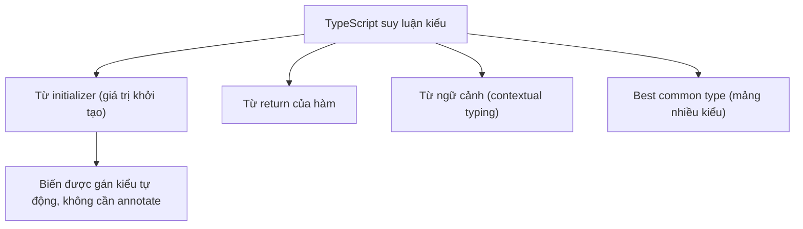
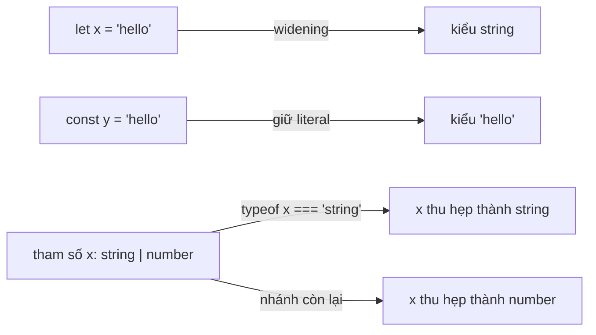

# Type Inference và Compatibility

**Type inference** (suy luận kiểu tự động) là khả năng TypeScript tự đoán ra kiểu dữ liệu của biến hay biểu thức mà bạn không cần viết kiểu một cách tường minh. **Type compatibility** (tính tương thích kiểu) là quy tắc giúp TypeScript quyết định khi nào một kiểu có thể được gán cho kiểu khác. Hiểu hai khái niệm này giúp bạn viết code gọn hơn mà vẫn an toàn về kiểu.

[](pathname:///img/typescript/type-inference.webp)

---

:::note[Ghi nhớ nhanh]

- ⭐ **Để TS tự suy luận khi đã rõ** — bỏ annotation thừa (`const n = 5`), chỉ annotate tham số hàm, public API hoặc khi inference sai/quá rộng.
- ⭐ **Narrowing qua control flow analysis** — TS thu hẹp union theo `typeof`, `instanceof`, `in`, truthy check, tagged union, type guard, assertion function.
- **Contextual typing** — TS suy kiểu từ ngữ cảnh dùng (ví dụ callback `addEventListener` biết `event: MouseEvent`).
- **Widening vs literal** — `let x = "hello"` widen thành `string`, còn `const y = "hello"` giữ literal `"hello"`.
- **Structural typing + variance** — tương thích theo shape; tham số hàm là contravariance, return type là covariance (bật `strictFunctionTypes`).

:::

---

## Mục lục

- [Vì sao cần type inference?](#vì-sao-cần-type-inference)
- [Type Inference](#type-inference)
- [Contextual Typing](#contextual-typing)
- [Best Common Type](#best-common-type)
- [Widening và Narrowing](#widening-và-narrowing)
- [Type Compatibility](#type-compatibility)
- [Câu hỏi phỏng vấn](#câu-hỏi-phỏng-vấn)

---

## Vì sao cần type inference?

**Vấn đề:** Nếu phải ghi chú thích kiểu cho **mọi** biến và **mọi** return,
code trở nên rườm rà, trùng lặp — kiểu hiển nhiên vẫn phải viết lại, vừa
dài vừa nản:

```ts
const n: number = 5;
const name: string = "An";
const tags: string[] = ["a", "b"];

function add(a: number, b: number): number {
  return a + b; // return number rõ ràng mà vẫn phải khai báo
}
```

**Giải pháp:** TypeScript **tự suy luận kiểu** từ giá trị và ngữ cảnh
(initializer, return, đối số mặc định, contextual typing) → code gọn
**nhưng vẫn type-safe**. Nguyên tắc: để TS suy luận khi đã rõ ràng, chỉ
annotate khi thật sự cần (tham số hàm, public API, hoặc khi inference sai
hay quá rộng):

```ts
const n = 5;             // number
const name = "An";       // string
const tags = ["a", "b"]; // string[]

function add(a: number, b: number) {
  return a + b; // return type tự suy ra: number
}
```

:::tip[Dùng thực tế]

- Bỏ chú thích thừa cho biến khởi tạo: `const count = 0;` thay vì
  `const count: number = 0;`.
- Để return type tự suy ra cho hàm nội bộ, chỉ annotate return ở public
  API để khoá hợp đồng (contract) rõ ràng.
- Callback của array method tự biết kiểu phần tử:
  `[1, 2, 3].map((x) => x * 2)` — TS biết `x: number`.
- Cân bằng: để TS suy luận khi hiển nhiên, annotate tham số hàm và những
  chỗ inference cho ra kiểu sai hoặc quá rộng.

:::

---

## Type Inference

TypeScript có thể **tự suy ra type** mà không cần khai báo, dựa trên
giá trị khởi tạo.

```ts
let count = 10;          // inferred: number
let name = "An";         // inferred: string
let active = true;       // inferred: boolean
const PI = 3.14;         // inferred: 3.14 (literal!)
```

Cũng infer cho return type của hàm:

```ts
function add(a: number, b: number) {
  return a + b; // return type inferred: number
}
```

Sơ đồ dưới đây tổng hợp các nguồn mà TypeScript dựa vào để suy luận kiểu.



:::tip[Mẹo]

**Quy tắc vàng**: chỉ khai báo type **khi inference không đủ rõ** hoặc
đó là **public API**. Code đẹp là code ít annotation thừa:

```ts
// Thừa
const name: string = "An";

// Đẹp
const name = "An";

// Cần annotation — public API export
export function format(user: User): string {
  return user.name;
}
```

:::

---

## Contextual Typing

TS suy luận type từ **ngữ cảnh** (vị trí dùng), không chỉ từ giá trị:

```ts
window.addEventListener("click", (event) => {
  console.log(event.button); // event: MouseEvent (TS biết từ context)
});
```

Trong callback hoặc tham số, TS tìm signature mong đợi để gán type.

---

## Best Common Type

Khi mảng có nhiều phần tử khác kiểu, TS chọn **kiểu chung tốt nhất**
(thường là union):

```ts
const arr = [1, "hello", true];
// inferred: (string | number | boolean)[]
```

Nếu không có kiểu chung phù hợp, TS sẽ widen lên `(A | B)[]`:

```ts
const items = [{ a: 1 }, { b: 2 }];
// inferred: ({ a: number } | { b: number })[]
```

---

## Widening và Narrowing

**Widening**: TS mở rộng literal type thành kiểu chung.

```ts
let x = "hello";  // type: string (widened)
const y = "hello"; // type: "hello" (literal, không widen)
```

Lý do: `let` cho phép gán lại nên không thể giữ literal; `const` thì cố
định.

Sơ đồ sau đối chiếu hai chiều: widening mở rộng literal, còn narrowing thu hẹp union theo điều kiện kiểm tra.



**Narrowing**: TS thu hẹp type khi gặp điều kiện kiểm tra.

```ts
function format(x: string | number) {
  if (typeof x === "string") {
    return x.toUpperCase(); // x: string ở đây
  }
  return x.toFixed(2);      // x: number ở đây
}
```

:::info[Phân tích]

**Control flow analysis** là engine giúp TS narrow type theo dòng chảy
code. Nó hiểu được:

- `typeof`, `instanceof`, `in`.
- Truthy check (`if (x)`).
- Tagged union (`if (shape.kind === "circle")`).
- `Array.isArray()`.
- User-defined type guards (`function isUser(x): x is User`).
- Assertion functions (`function assert(x): asserts x is string`).

Hiểu sâu narrowing là kỹ năng phân biệt junior và senior khi viết TS.
Một function được narrow đúng có thể loại bỏ hàng chục `as` không cần
thiết.

:::

---

## Type Compatibility

TS dùng **structural typing** — hai type tương thích nếu **shape** khớp,
không cần cùng tên.

```ts
interface Named { name: string; }
class Person { constructor(public name: string) {} }

const p: Named = new Person("An"); // OK — cùng shape
```

**Quy tắc**: type **đích (target)** chỉ cần các thuộc tính của **nguồn
(source)** là tập con — không thiếu là được.

```ts
interface Point { x: number; y: number; }
const a: Point = { x: 1, y: 2, z: 3 }; // OK — z thừa nhưng không sao*
```

(* `*` Khi gán object literal trực tiếp, TS có **excess property check**
chặt hơn — sẽ báo lỗi `z`. Gán qua biến trung gian thì không.)

:::warning[Cần lưu ý]

**Variance** trong hàm khác với type thường:

- **Tham số hàm** kiểm tra theo **contravariance** (chiều ngược):

```ts
type Animal = { name: string };
type Dog = Animal & { breed: string };

let animalFn: (a: Animal) => void;
let dogFn: (d: Dog) => void;

animalFn = dogFn; // Error (strictFunctionTypes)
dogFn = animalFn; // OK
```

Lý do: nếu một chỗ cần hàm xử lý mọi `Animal`, không thể đưa hàm chỉ
biết xử lý `Dog`.

- **Return type** kiểm tra theo **covariance** (chiều thuận):

```ts
let getAnimal: () => Animal;
let getDog: () => Dog;

getAnimal = getDog; // OK — Dog vẫn là Animal
```

Bật flag `strictFunctionTypes: true` để TS check contravariance đúng.

:::

---

## Câu hỏi phỏng vấn

Những câu thường gặp về chủ đề này. Tự trả lời trước, rồi bấm **Xem đáp án** để đối chiếu.

**1. Type inference là gì? TypeScript dựa vào những nguồn nào để suy luận kiểu cho một biến hoặc một hàm?**

<details className="qa">
<summary>Xem đáp án</summary>

**Type inference** là khả năng TypeScript tự đoán kiểu của biến hoặc biểu thức mà bạn không cần viết annotation. Nhờ vậy code gọn hơn nhưng vẫn type-safe.

Các nguồn chính TS dựa vào:

- **Initializer** — giá trị khởi tạo của biến: `const n = 5` → `number`.
- **Return của hàm** — TS suy từ các lệnh `return` bên trong: `function add(a: number, b: number) { return a + b }` → return type `number`.
- **Contextual typing** — suy từ ngữ cảnh nơi biểu thức được dùng, ví dụ tham số của callback truyền vào `addEventListener`.
- **Best common type** — khi mảng chứa nhiều kiểu, TS chọn kiểu chung tốt nhất (thường là union).
- **Giá trị mặc định của tham số** — `function f(x = 0)` → `x: number`.

Nguyên tắc dùng: để TS suy luận khi kiểu đã hiển nhiên, chỉ annotate tham số hàm, public API, hoặc khi inference cho ra kiểu sai/quá rộng.

</details>

**2. Đoán kiểu: `let count = 10;` và `const PI = 3.14;` — hai biến được suy luận thành kiểu gì, và vì sao lại khác nhau?**

<details className="qa">
<summary>Xem đáp án</summary>

```ts
let count = 10;    // number
const PI = 3.14;   // 3.14 (literal type)
```

- `count` được suy thành `number` — kiểu **rộng**.
- `PI` được suy thành literal type `3.14` — kiểu **hẹp**, chỉ chứa đúng giá trị đó.

Khác nhau vì **widening**. Biến khai báo bằng `let` có thể gán lại sau này, nên giữ literal `10` là vô nghĩa — TS mở rộng (widen) lên `number` để mọi phép gán số sau đó đều hợp lệ. Còn `const` với giá trị primitive không bao giờ đổi được, nên TS giữ nguyên literal type, cho phép dùng nó ở những nơi cần đúng giá trị cụ thể (ví dụ khớp với union literal).

Lưu ý: quy tắc này chỉ áp dụng cho primitive. `const obj = { a: 1 }` vẫn suy thành `{ a: number }` vì property bên trong object vẫn sửa được.

</details>

**3. Widening là gì? Vì sao `let x = "hello"` cho ra `string` còn `const y = "hello"` giữ nguyên literal `"hello"`?**

<details className="qa">
<summary>Xem đáp án</summary>

**Widening** là việc TypeScript mở rộng một literal type thành kiểu chung bao trùm nó — `"hello"` thành `string`, `10` thành `number`, `true` thành `boolean`.

```ts
let x = "hello";    // string (widened)
const y = "hello";  // "hello" (literal, không widen)

x = "world";        // OK vì kiểu là string
```

Lý do nằm ở khả năng gán lại:

- `let` cho phép gán giá trị mới. Nếu TS giữ kiểu `"hello"` thì dòng `x = "world"` sẽ lỗi ngay — vô lý với ý định của lập trình viên. Nên TS widen lên `string`.
- `const` với primitive thì giá trị cố định vĩnh viễn, giữ literal type là an toàn và còn hữu ích hơn.

Hệ quả thực tế: khi cần truyền một chuỗi vào tham số kiểu union literal, hãy dùng `const` (hoặc `as const`) thay vì `let`, nếu không giá trị sẽ bị widen thành `string` và gán không được.

</details>

**4. Khi nào nên khai báo kiểu tường minh thay vì để TypeScript tự suy luận? Nêu tiêu chí cho code nội bộ và cho public API.**

<details className="qa">
<summary>Xem đáp án</summary>

Quy tắc vàng: **để TS suy luận khi đã rõ, chỉ annotate khi thật sự cần**.

Với **code nội bộ**:

- Bỏ annotation thừa cho biến có initializer rõ ràng: viết `const count = 0` thay vì `const count: number = 0`.
- Để return type tự suy ra cho hàm private/helper.
- Vẫn phải annotate **tham số hàm** — TS không có gì để suy ra từ đó (trừ khi hàm nằm trong ngữ cảnh contextual typing).
- Annotate khi inference cho ra kiểu **sai hoặc quá rộng**, ví dụ mảng khởi tạo rỗng `const list = []` cho ra `any[]`.

Với **public API** (hàm/biến `export`):

- Nên annotate return type để **khoá hợp đồng** — nếu sau này sửa thân hàm làm đổi kiểu trả về, compiler báo lỗi ngay tại chỗ định nghĩa thay vì để lỗi lan ra chỗ gọi.
- Giúp file `.d.ts` sinh ra ổn định và đọc được, không phụ thuộc chi tiết cài đặt bên trong.

</details>

**5. Contextual typing hoạt động thế nào? Vì sao trong `addEventListener("click", (e) => ...)` TypeScript biết `e` là `MouseEvent` mà không cần annotate?**

<details className="qa">
<summary>Xem đáp án</summary>

**Contextual typing** là chiều suy luận **ngược**: thay vì suy kiểu của biểu thức từ giá trị của nó, TS suy từ **vị trí mà biểu thức được dùng**. Khi một hàm được đặt vào chỗ đang mong đợi một kiểu hàm cụ thể, TS lấy signature mong đợi đó để gán kiểu cho các tham số.

```ts
window.addEventListener("click", (event) => {
  console.log(event.button); // event: MouseEvent
});

[1, 2, 3].map((x) => x * 2); // x: number
```

Với `addEventListener`, khai báo trong lib DOM dùng overload theo tên sự kiện: chuỗi `"click"` khớp với entry `click` trong `WindowEventMap`, và entry đó khai báo handler nhận `MouseEvent`. TS đọc ngược signature này rồi gán `event: MouseEvent`. Đổi sang `"keydown"` thì `event` sẽ là `KeyboardEvent`.

Nhờ contextual typing, callback trong array method, Promise `.then`, event handler... đều không cần annotate tham số.

</details>

**6. Best common type là gì? Đoán kiểu suy luận của `const arr = [1, "hello", true];` và của `const items = [{ a: 1 }, { b: 2 }];`**

<details className="qa">
<summary>Xem đáp án</summary>

**Best common type** là cơ chế TS dùng khi suy kiểu cho mảng có nhiều phần tử khác kiểu: nó xét kiểu của từng phần tử rồi chọn một kiểu chung bao được tất cả — thường là **union** của các kiểu đó.

```ts
const arr = [1, "hello", true];
// inferred: (string | number | boolean)[]

const items = [{ a: 1 }, { b: 2 }];
// inferred: ({ a: number } | { b: number })[]
```

Điểm cần chú ý ở ví dụ thứ hai: TS **không** trộn hai object thành `{ a?: number; b?: number }`, mà giữ chúng thành union hai shape riêng. Hệ quả là `items[0].a` sẽ báo lỗi, vì trên union đó property `a` không tồn tại trên mọi nhánh — muốn truy cập phải narrow trước (ví dụ bằng toán tử `in`).

Nếu muốn kiểm soát, hãy annotate tường minh kiểu phần tử thay vì phụ thuộc vào best common type.

</details>

**7. Vì sao return type của hàm thường không cần annotate, nhưng với hàm được export ra ngoài lại nên khai báo tường minh?**

<details className="qa">
<summary>Xem đáp án</summary>

Với hàm nội bộ, TS suy return type từ chính các lệnh `return` — annotation chỉ là lặp lại thông tin đã hiển nhiên, làm code dài thêm mà không tăng an toàn.

Với hàm **export** (public API) thì khác, vì annotation đóng vai trò **hợp đồng**:

- **Bắt lỗi tại đúng nơi gây ra.** Nếu để suy luận, một thay đổi nhỏ trong thân hàm (lỡ trả thêm `undefined`) sẽ âm thầm đổi kiểu trả về, và lỗi chỉ nổ ra ở hàng chục chỗ gọi phía ngoài. Có annotation, compiler chặn ngay tại định nghĩa.
- **Ổn định đầu ra.** Kiểu công khai không còn phụ thuộc chi tiết cài đặt bên trong, nên refactor nội bộ không vô tình phá vỡ người dùng thư viện.
- **Tài liệu hoá và tăng tốc biên dịch.** File `.d.ts` sinh ra gọn, dễ đọc; TS cũng không phải suy luận lại toàn bộ thân hàm.

```ts
export function format(user: User): string {
  return user.name;
}
```

</details>

**8. Narrowing là gì? Liệt kê các cơ chế mà control flow analysis dùng để thu hẹp kiểu.**

<details className="qa">
<summary>Xem đáp án</summary>

**Narrowing** là việc TypeScript **thu hẹp** kiểu của một biến (thường là union) xuống kiểu cụ thể hơn khi gặp điều kiện kiểm tra. Engine phụ trách việc này là **control flow analysis** — nó đi theo dòng chảy code và biết ở mỗi nhánh biến còn có thể mang kiểu gì.

```ts
function format(x: string | number) {
  if (typeof x === "string") {
    return x.toUpperCase(); // x: string
  }
  return x.toFixed(2);      // x: number
}
```

Các cơ chế narrowing chính:

- `typeof` — cho primitive.
- `instanceof` — cho instance của class.
- Toán tử `in` — kiểm tra sự tồn tại của property.
- Truthy check (`if (x)`) — loại `null`, `undefined`, giá trị falsy.
- Tagged (discriminated) union — `if (shape.kind === "circle")`.
- `Array.isArray()`.
- User-defined type guard — `function isUser(x): x is User`.
- Assertion function — `function assert(x): asserts x is string`.

Narrow đúng giúp loại bỏ phần lớn các ép kiểu `as` không cần thiết.

</details>

**9. Phân biệt narrowing bằng `typeof`, `instanceof` và `in` — mỗi cách phù hợp với dạng dữ liệu nào?**

<details className="qa">
<summary>Xem đáp án</summary>

| Cách | Kiểm tra gì | Phù hợp với |
|---|---|---|
| `typeof x === "string"` | Kiểu primitive tại runtime | Phân biệt `string`, `number`, `boolean`, `symbol`, `bigint`, `function`, `undefined` |
| `x instanceof Foo` | Có nằm trên prototype chain của `Foo` không | Instance của class hoặc constructor function (`Date`, `Error`, class tự viết) |
| `"prop" in x` | Object có property tên đó không | Union các object shape khác nhau, không có class và không có trường phân biệt |

```ts
function handle(x: string | Date | { a: number } | { b: number }) {
  if (typeof x === "string") return x.toUpperCase();
  if (x instanceof Date) return x.getFullYear();
  if ("a" in x) return x.a;
  return x.b;
}
```

Điểm yếu cần nhớ: `typeof null === "object"` nên không dùng `typeof` để loại `null`; `instanceof` không hoạt động với `interface` hay `type` thuần (chúng bị xoá lúc biên dịch), và cũng không đáng tin khi object đi qua ranh giới realm khác.

</details>

**10. User-defined type guard (`x is User`) khác assertion function (`asserts x is string`) ở điểm nào về cách compiler xử lý luồng code sau đó?**

<details className="qa">
<summary>Xem đáp án</summary>

Cả hai đều dạy compiler cách narrow, nhưng khác nhau ở **phạm vi ảnh hưởng**.

**Type guard** (`x is User`) trả về `boolean`. Nó chỉ narrow **bên trong nhánh điều kiện** dùng kết quả đó:

```ts
function isUser(x: unknown): x is User {
  return typeof x === "object" && x !== null && "name" in x;
}

if (isUser(data)) {
  data.name; // data: User, chỉ trong block này
}
// ra khỏi if, data trở lại unknown
```

**Assertion function** (`asserts x is string`) trả về `void`. Nếu điều kiện sai thì nó **throw**; nếu hàm trả về bình thường, compiler coi như khẳng định đã đúng và narrow **toàn bộ phần code còn lại** của scope, không cần `if`:

```ts
function assertString(x: unknown): asserts x is string {
  if (typeof x !== "string") throw new Error("not a string");
}

assertString(input);
input.toUpperCase(); // input: string từ đây trở đi
```

Lưu ý: assertion function phải được gọi qua một biến có annotation kiểu tường minh, không dùng được với arrow function suy luận kiểu.

</details>

**11. Structural typing khác nominal typing ra sao? Vì sao một instance của `class Person` gán được cho biến kiểu `interface Named`?**

<details className="qa">
<summary>Xem đáp án</summary>

- **Nominal typing** (Java, C#): hai kiểu tương thích khi chúng **cùng tên** hoặc có quan hệ kế thừa khai báo tường minh. Muốn gán được, class phải `implements` interface đó.
- **Structural typing** (TypeScript): hai kiểu tương thích khi **shape khớp** — có đủ property với kiểu phù hợp. Tên gọi và quan hệ khai báo không quan trọng.

```ts
interface Named { name: string; }
class Person { constructor(public name: string) {} }

const p: Named = new Person("An"); // OK — cùng shape
```

`Person` không hề khai báo `implements Named`, nhưng nó có property `name: string` — đủ để thoả shape của `Named`, nên phép gán hợp lệ.

Quy tắc chung: kiểu **nguồn** chỉ cần có **ít nhất** các thuộc tính mà kiểu **đích** yêu cầu; thừa thì không sao (trừ trường hợp excess property check với object literal). Cách kiểm tra này hợp với tinh thần "duck typing" của JavaScript, giúp TS làm việc được với code JS có sẵn mà không cần sửa khai báo.

</details>

**12. Excess property check là gì? Vì sao gán object literal có field thừa thì báo lỗi, còn gán qua biến trung gian lại không?**

<details className="qa">
<summary>Xem đáp án</summary>

**Excess property check** là một lớp kiểm tra bổ sung, chỉ áp dụng khi bạn gán **object literal viết trực tiếp** vào một kiểu đã biết: TS báo lỗi nếu literal có property không tồn tại trong kiểu đích.

```ts
interface Point { x: number; y: number; }

const a: Point = { x: 1, y: 2, z: 3 }; // Error: 'z' không có trong Point

const tmp = { x: 1, y: 2, z: 3 };
const b: Point = tmp;                  // OK — không còn là literal trực tiếp
```

Vì sao khác nhau? Theo quy tắc structural typing thuần, cả hai đều hợp lệ — `tmp` đã có đủ `x` và `y`. Nhưng khi bạn viết literal ngay tại chỗ gán, property thừa gần như chắc chắn là **lỗi gõ nhầm tên** (`widht` thay vì `width`) hoặc hiểu nhầm API, chứ không ai cố tình tạo giá trị rác. Nên TS thêm cảnh báo cho riêng trường hợp đó.

Muốn bỏ qua có chủ đích: gán qua biến trung gian, dùng `as Point`, hoặc khai báo index signature trong kiểu đích.

</details>

**13. Variance: vì sao tham số hàm được kiểm tra theo contravariance còn return type theo covariance? Giải thích bằng ví dụ `Animal` và `Dog`.**

<details className="qa">
<summary>Xem đáp án</summary>

```ts
type Animal = { name: string };
type Dog = Animal & { breed: string };
```

`Dog` hẹp hơn (cụ thể hơn) `Animal`.

**Return type — covariance (chiều thuận):** nơi nào cần một hàm trả về `Animal`, đưa hàm trả về `Dog` vẫn an toàn, vì mọi `Dog` đều là `Animal` — người gọi nhận về nhiều thông tin hơn mức cần, không hỏng gì.

```ts
let getAnimal: () => Animal;
let getDog: () => Dog;
getAnimal = getDog; // OK
```

**Tham số — contravariance (chiều ngược):** nơi nào cần một hàm xử lý **mọi** `Animal`, không thể đưa hàm chỉ biết xử lý `Dog` — người gọi có quyền truyền vào một `Animal` không phải chó, và hàm sẽ truy cập `breed` trên giá trị không có property đó. Ngược lại, hàm nhận `Animal` thì dùng được ở chỗ cần hàm nhận `Dog`, vì nó chỉ đòi ít hơn.

```ts
let animalFn: (a: Animal) => void;
let dogFn: (d: Dog) => void;
animalFn = dogFn; // Error
dogFn = animalFn; // OK
```

</details>

**14. Đoán lỗi: với `let animalFn: (a: Animal) => void;` và `let dogFn: (d: Dog) => void;` thì `animalFn = dogFn` có lỗi không? Flag `strictFunctionTypes` ảnh hưởng thế nào?**

<details className="qa">
<summary>Xem đáp án</summary>

Có lỗi — **khi bật `strictFunctionTypes`**.

```ts
animalFn = dogFn; // Error (strictFunctionTypes)
dogFn = animalFn; // OK
```

Lý do: gán `dogFn` vào `animalFn` nghĩa là sau đó ai cũng có thể gọi `animalFn({ name: "Miu" })` với một `Animal` không có `breed`, trong khi thân hàm `dogFn` lại giả định tham số là `Dog`. Đây chính là vi phạm contravariance của tham số.

Vai trò của flag:

- **`strictFunctionTypes: false`** (mặc định khi không bật `strict`): TS kiểm tra tham số theo **bivariance** — cả hai chiều gán đều được chấp nhận, tiện nhưng không an toàn. Đây là di sản từ thời TS ưu tiên tương thích với code JS cũ.
- **`strictFunctionTypes: true`** (bật kèm `strict`): TS kiểm tra contravariance đúng chuẩn cho các kiểu hàm viết dạng function type, và bắt lỗi ở dòng trên.

Nên bật flag này để tránh lỗi kiểu chỉ lộ ra lúc runtime.

</details>

**15. Vì sao method khai báo dạng shorthand trong `interface` lại được kiểm tra bivariant, trong khi property kiểu function type thì không?**

<details className="qa">
<summary>Xem đáp án</summary>

`strictFunctionTypes` chỉ áp dụng contravariance cho **function type syntax**, còn **method shorthand** vẫn được kiểm tra **bivariant** — đây là ngoại lệ có chủ ý.

```ts
interface A {
  handle(x: Dog): void;        // method shorthand → bivariant
  onEvent: (x: Dog) => void;   // property function type → contravariant
}
```

Lý do là **tương thích ngược với thư viện chuẩn và code JS sẵn có**. Rất nhiều API được xây dựng trên giả định bivariance, điển hình là `Array`: `Dog[]` cần gán được cho `Animal[]` để dùng thoải mái, nhưng các method như `push(item: T)`, `forEach(cb: (item: T) => void)` nhận `T` ở vị trí tham số. Nếu áp contravariance chặt, `Dog[]` sẽ không còn tương thích với `Animal[]`, và hàng loạt code đang chạy tốt sẽ đỏ lỗi.

Nói cách khác, mảng của TypeScript vốn đã unsound theo covariance; giữ method bivariant là cái giá đánh đổi để hệ thống kiểu vẫn dùng được trong thực tế. Khi cần chặt chẽ thật sự, hãy khai báo dạng property function type.

</details>

**16. `as const` ảnh hưởng đến widening ra sao? Cho ví dụ một trường hợp thiếu `as const` khiến không gán được vào tham số kiểu union literal.**

<details className="qa">
<summary>Xem đáp án</summary>

`as const` là **const assertion** — nó chặn widening, giữ mọi giá trị ở literal type hẹp nhất, đồng thời làm object/array trở thành `readonly` (array thành tuple).

```ts
const a = { method: "GET" };            // { method: string }
const b = { method: "GET" } as const;   // { readonly method: "GET" }

const arr1 = ["a", "b"];                // string[]
const arr2 = ["a", "b"] as const;       // readonly ["a", "b"]
```

Trường hợp kinh điển thiếu `as const`:

```ts
type Method = "GET" | "POST";
function request(url: string, method: Method) {}

const opts = { method: "GET" };
request("/api", opts.method);
// Error: 'string' không gán được cho 'Method'

const opts2 = { method: "GET" } as const;
request("/api", opts2.method); // OK — kiểu là "GET"
```

Property bên trong object luôn bị widen (vì có thể gán lại), nên `opts.method` thành `string`. Thêm `as const` giữ đúng literal `"GET"`, khớp với union. Cách khác: annotate `const opts: { method: Method } = ...`.

</details>
