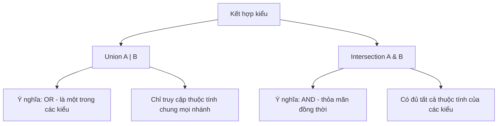

# Combining Types

**Combining types** (kết hợp kiểu) là cách ghép nhiều kiểu lại với nhau để mô tả dữ liệu linh hoạt hơn. Hai cách phổ biến là **union type** (kiểu hợp — giá trị có thể là một trong nhiều kiểu) và **intersection type** (kiểu giao — giá trị phải thỏa mãn đồng thời nhiều kiểu). Nhờ vậy bạn có thể diễn đạt chính xác những trường hợp mà một kiểu đơn lẻ không đủ.

[](pathname:///img/typescript/combining-types.webp)

---

:::note[Ghi nhớ nhanh]

- ⭐ **Union `A | B` là OR, Intersection `A & B` là AND** — union nhận một trong các kiểu (chỉ truy cập được thuộc tính chung mọi nhánh), intersection gộp đủ mọi thuộc tính.
- ⭐ **Literal union mô hình hoá trạng thái cố định** — `type Status = "loading" | "success" | "error"` chặn giá trị sai chính tả ngay khi gõ.
- **`type` linh hoạt hơn `interface`** — dùng được cho union/primitive/tuple/function; chọn một quy ước và giữ nhất quán trong codebase.
- **`keyof T` trả về union các key** — kết hợp indexed access `T[K]` là nền tảng để viết hàm truy cập property an toàn (`getProp`).

:::

---

## Mục lục

- [Vì sao có union, intersection & literal types?](#vì-sao-có-union-intersection--literal-types)
- [Union Types](#union-types)
- [Intersection Types](#intersection-types)
- [Type Aliases](#type-aliases)
- [keyof Operator](#keyof-operator)
- [Câu hỏi phỏng vấn](#câu-hỏi-phỏng-vấn)

---

## Vì sao có union, intersection & literal types?

**Vấn đề:** dữ liệu thực tế thường "đa dạng": một `id` có thể là `string` HOẶC `number`, một biến trạng thái chỉ nhận vài giá trị cố định. Nếu ép một kiểu cứng thì không mô tả nổi, mà dùng `any` thì mất hết an toàn kiểu.

```ts
function fetchUser(id: any) {       // any — TS không kiểm tra gì
  // ...
}
fetchUser(1);
fetchUser("abc");
fetchUser(true);                    // lọt — không ai chặn

let status = "loading";             // chỉ là string chung chung
status = "succes";                  // sai chính tả nhưng vẫn hợp lệ
```

**Giải pháp:** dùng **union** `A | B` (một trong nhiều kiểu), **literal types** (chỉ nhận đúng vài giá trị cụ thể) và **intersection** `A & B` (gộp nhiều kiểu thành một) để mô hình hoá dữ liệu chính xác.

```ts
function fetchUser(id: string | number) {   // union: chỉ string hoặc number
  // ...
}
fetchUser(1);
fetchUser("abc");
// fetchUser(true);                          // Error — bị chặn ngay

type Status = "loading" | "success" | "error"; // literal union
let status: Status = "loading";
// status = "succes";                        // Error — sai chính tả bị bắt

type WithId = { id: string | number };
type WithTimestamps = { createdAt: Date };
type Entity = WithId & WithTimestamps;       // intersection: gộp cả hai
const e: Entity = { id: 1, createdAt: new Date() };
```

Sơ đồ dưới đây so sánh hai cách kết hợp kiểu chính: union (OR) và intersection (AND).



:::tip[Dùng thực tế]

- **ID linh hoạt:** `id: string | number` cho key vừa là UUID chuỗi vừa là số tự tăng.
- **Trạng thái request:** `"idle" | "loading" | "success" | "error"` — chặn mọi giá trị sai chính tả ngay khi gõ.
- **Gộp props:** `BaseProps & { onClose: () => void }` để mở rộng component mà không lặp lại field.
- **Hàm nhận nhiều dạng input:** tham số `string | string[]` để vừa nhận một giá trị vừa nhận danh sách.

:::

---

## Union Types

Ký hiệu `|` — biến có thể là **một trong nhiều kiểu**.

```ts
let id: number | string;
id = 1;       // OK
id = "abc";   // OK
id = true;    // Error
```

Trong tham số hàm:

```ts
function print(value: number | string) {
  console.log(value);
}
```

:::info[Phân tích]

Union là **disjunction (OR)** trong type theory. Khi truy cập thuộc tính
của union, TS chỉ cho phép các thuộc tính **chung của mọi nhánh**:

```ts
type Animal = { name: string; legs: number };
type Fish = { name: string; fins: number };

function describe(x: Animal | Fish) {
  console.log(x.name);  // OK — cả hai đều có name
  console.log(x.legs);  // Error — Fish không có legs
}
```

→ Phải dùng **type guard** để narrow xuống một nhánh trước khi truy cập
thuộc tính riêng.

:::

---

## Intersection Types

Ký hiệu `&` — kết hợp **mọi thuộc tính** từ nhiều type.

```ts
type Named = { name: string };
type Aged = { age: number };

type Person = Named & Aged;

const p: Person = { name: "An", age: 25 };
```

Khác Union: Intersection là **conjunction (AND)** — phải có **đủ** các
thuộc tính.

---

## Type Aliases

`type` đặt **bí danh** cho bất kỳ type nào.

```ts
type ID = number | string;
type User = { id: ID; name: string };
type Callback = (data: User) => void;
```

Khác `interface`:

| | `type` | `interface` |
|--|--|--|
| Cho object | OK | OK |
| Cho union/primitive | **OK** | Không |
| Cho tuple/function | **OK** | Khó |
| Mở rộng | `&` (intersection) | `extends` |
| Khai báo nhiều lần (merge) | Không | **Có** |

:::tip[Mẹo]

**Khi nào dùng `type` vs `interface`?**

- `interface`: shape của object có thể bị extend/implement, đặc biệt
  cho **public API thư viện** (cho phép consumer "vá" thêm field).
- `type`: union, intersection, tuple, mapped, conditional — mọi thứ
  không phải shape thuần.

Trong code app, dùng cái nào cũng được — chọn một và **nhất quán** trong
codebase.

:::

---

## keyof Operator

`keyof T` trả về **union các key** của type `T`.

```ts
type User = { id: number; name: string; email: string };

type UserKey = keyof User; // "id" | "name" | "email"
```

Ứng dụng phổ biến — hàm truy cập property an toàn:

```ts
function getProp<T, K extends keyof T>(obj: T, key: K): T[K] {
  return obj[key];
}

const user = { id: 1, name: "An" };
const id = getProp(user, "id");      // type: number
const x = getProp(user, "email");    // Error: "email" không phải key
```

:::info[Phân tích]

`keyof` kết hợp với **indexed access type** (`T[K]`) là nền tảng của
TypeScript metaprogramming:

```ts
type Values<T> = T[keyof T]; // Union các value type của T

type Color = { red: 1; green: 2; blue: 3 };
type ColorValue = Values<Color>; // 1 | 2 | 3
```

Khi áp dụng `keyof` lên type có **index signature**, kết quả là
`string | number` thay vì literal cụ thể:

```ts
type Dict = { [key: string]: number };
type K = keyof Dict; // string | number (không phải string!)
```

`number` xuất hiện vì JS tự convert key số thành chuỗi khi truy cập object.

:::

---

## Câu hỏi phỏng vấn

Những câu thường gặp về chủ đề này. Tự trả lời trước, rồi bấm **Xem đáp án** để đối chiếu.

**1. Union (`|`) và intersection (`&`) khác nhau ra sao? Liên hệ với phép OR/AND trên tập hợp giá trị.**

<details className="qa">
<summary>Xem đáp án</summary>

| | Union `A \| B` | Intersection `A & B` |
|---|---|---|
| Ý nghĩa | OR — là **một trong** các kiểu | AND — thoả mãn **đồng thời** mọi kiểu |
| Tập hợp giá trị | Hợp của hai tập | Giao của hai tập |
| Truy cập thuộc tính | Chỉ thuộc tính **chung** mọi nhánh | Có **đủ** thuộc tính của cả hai |

```ts
let id: number | string;      // là number HOẶC string
id = 1;  id = "abc";          // đều OK

type Named = { name: string };
type Aged = { age: number };
const p: Named & Aged = { name: "An", age: 25 }; // phải đủ cả hai
```

Điểm dễ nhầm: với **object type**, union làm tập *giá trị* rộng ra nhưng tập *thuộc tính dùng được* lại hẹp lại; intersection thì ngược lại — tập giá trị hẹp hơn (phải thoả cả hai shape) nhưng thuộc tính dùng được nhiều hơn. Nhớ theo tập hợp giá trị, đừng nhớ theo "gộp field", sẽ tránh được nhầm lẫn.

</details>

**2. Vì sao truy cập `x.legs` trên kiểu `Animal | Fish` bị báo lỗi, trong khi `x.name` lại hợp lệ?**

<details className="qa">
<summary>Xem đáp án</summary>

```ts
type Animal = { name: string; legs: number };
type Fish = { name: string; fins: number };

function describe(x: Animal | Fish) {
  console.log(x.name); // OK
  console.log(x.legs); // Error
}
```

Với union, TypeScript chỉ biết chắc `x` là **một trong hai** nhánh, nhưng không biết là nhánh nào. Để phép truy cập an toàn ở **mọi** khả năng, TS chỉ cho phép các thuộc tính có mặt trên **tất cả** các nhánh.

- `name` tồn tại ở cả `Animal` lẫn `Fish` → truy cập luôn an toàn → hợp lệ.
- `legs` chỉ có ở `Animal`. Nếu runtime `x` là `Fish`, `x.legs` sẽ là `undefined` và có thể gây lỗi ở bước sau → TS chặn.

Muốn dùng `legs`, phải **narrow** `x` về đúng nhánh `Animal` trước (bằng `in`, type guard, hoặc discriminant). Đây chính là lý do discriminated union được ưa chuộng.

</details>

**3. Làm sao thu hẹp một union xuống đúng một nhánh trước khi dùng thuộc tính riêng? Nêu ít nhất ba cách.**

<details className="qa">
<summary>Xem đáp án</summary>

Các cách narrow phổ biến:

- **Toán tử `in`** — kiểm tra sự tồn tại của property, hợp với union các object shape.
- **`typeof`** — khi union trộn primitive (`string | number`).
- **`instanceof`** — khi các nhánh là instance của class (`Date`, `Error`, class tự viết).
- **Discriminant check** — so sánh trường phân biệt: `if (shape.kind === "circle")`.
- **User-defined type guard** — `function isFish(x: Animal | Fish): x is Fish`.

```ts
function describe(x: Animal | Fish) {
  if ("legs" in x) {
    return x.legs;  // x: Animal
  }
  return x.fins;    // x: Fish
}

function isFish(x: Animal | Fish): x is Fish {
  return "fins" in x;
}
```

Sau khi narrow, control flow analysis tự cập nhật kiểu của `x` trong từng nhánh, nên không cần ép kiểu `as`. Nếu thấy mình phải viết nhiều `as`, thường là dấu hiệu union chưa được thiết kế tốt — nên thêm trường discriminant.

</details>

**4. Discriminated union (tagged union) là gì? Trường discriminant cần thoả điều kiện nào để narrow hoạt động?**

<details className="qa">
<summary>Xem đáp án</summary>

**Discriminated union** là union các object type, trong đó mọi nhánh cùng có một property đóng vai trò "nhãn" (discriminant / tag) để phân biệt. So sánh nhãn là TS narrow được ngay.

```ts
type Result =
  | { status: "loading" }
  | { status: "success"; data: string }
  | { status: "error"; message: string };

function render(r: Result) {
  if (r.status === "success") return r.data;      // r: nhánh success
  if (r.status === "error") return r.message;     // r: nhánh error
  return "Đang tải...";
}
```

Điều kiện để narrow hoạt động:

- Property discriminant phải **có mặt ở mọi nhánh** của union.
- Kiểu của nó phải là **literal type** (hoặc kiểu đơn vị như `null`, `undefined`, enum member) — không phải `string` chung chung.
- Mỗi nhánh mang một giá trị literal **khác nhau**.

Lợi ích kèm theo: kết hợp với `switch` và biến kiểu `never` ở nhánh `default`, compiler sẽ báo lỗi khi bạn thêm nhánh mới mà quên xử lý (exhaustiveness check).

</details>

**5. Đoán kết quả: `type A = { a: string } & { a: number };` — thuộc tính `a` có kiểu gì, và có tạo được giá trị hợp lệ cho `A` không?**

<details className="qa">
<summary>Xem đáp án</summary>

Thuộc tính `a` có kiểu `string & number`, tức là **`never`**.

```ts
type A = { a: string } & { a: number };

const x: A = { a: "hi" }; // Error: string không gán được cho never
const y: A = { a: 1 };    // Error: number không gán được cho never
```

Giải thích: intersection trên object type được áp dụng **theo từng property trùng tên**. `a` phải đồng thời là `string` và là `number` — không tồn tại giá trị nào như vậy, nên kiểu của nó rút gọn về `never`.

Kết quả là **không tạo được giá trị hợp lệ nào cho `A`**. Điều đáng chú ý: bản thân type `A` **không** bị rút gọn thành `never` — nó vẫn là một object type có property kiểu `never`, nên khai báo `type A` không báo lỗi; lỗi chỉ xuất hiện lúc bạn thử gán giá trị.

Đây là cái bẫy kinh điển khi gộp hai type nguồn có field trùng tên khác kiểu: TS không cảnh báo tại chỗ định nghĩa, phải tới lúc dùng mới lộ.

</details>

**6. Intersection giữa hai primitive khác nhau như `string & number` cho ra kiểu gì? Giải thích theo góc nhìn tập hợp.**

<details className="qa">
<summary>Xem đáp án</summary>

Kết quả là **`never`** — kiểu rỗng, không có giá trị nào thuộc về nó.

```ts
type Impossible = string & number; // never
type S = "a" & "b";                // never
type Ok = "a" & string;            // "a"
```

Theo góc nhìn tập hợp: mỗi kiểu là một **tập các giá trị**. `string` là tập mọi chuỗi, `number` là tập mọi số. Intersection chính là **phép giao**. Hai tập này hoàn toàn rời nhau (không giá trị nào vừa là chuỗi vừa là số), nên giao của chúng là **tập rỗng** — trong TypeScript tập rỗng được biểu diễn bằng `never`.

Cũng theo logic đó, `"a" & string` cho ra `"a"`, vì tập `{"a"}` nằm trọn trong tập `string` nên giao lại chính là `{"a"}`.

Hệ quả cần nhớ: `never` gán được cho mọi kiểu nhưng không kiểu nào (ngoài chính nó) gán được cho `never`. Khi thấy kiểu bất ngờ thành `never`, hãy nghi ngờ một intersection đang giao hai tập rời nhau.

</details>

**7. Khi nào dùng `type`, khi nào dùng `interface`? Liệt kê những thứ `type` biểu diễn được mà `interface` thì không.**

<details className="qa">
<summary>Xem đáp án</summary>

| | `type` | `interface` |
|---|---|---|
| Object shape | OK | OK |
| Union / primitive | **OK** | Không |
| Tuple / function type | **OK** | Khó |
| Mapped, conditional, template literal | **OK** | Không |
| Mở rộng | `&` (intersection) | `extends` |
| Khai báo nhiều lần (merge) | Không | **Có** |

Những thứ chỉ `type` làm được: alias cho primitive (`type ID = string`), union (`type Status = "a" \| "b"`), tuple (`type Pair = [number, number]`), mapped type, conditional type, template literal type, và cả `typeof`/indexed access.

Cách chọn:

- Dùng `interface` cho shape object có thể bị `extends`/`implements`, đặc biệt với **public API của thư viện** — declaration merging cho phép người dùng "vá" thêm field.
- Dùng `type` cho union, intersection, tuple, và mọi kiểu không phải shape thuần.

Trong code ứng dụng, dùng cái nào cũng được — quan trọng là **chọn một quy ước và giữ nhất quán** trong codebase.

</details>

**8. Declaration merging của `interface` là gì? Vì sao tính năng này hữu ích cho thư viện nhưng lại rủi ro trong code ứng dụng?**

<details className="qa">
<summary>Xem đáp án</summary>

**Declaration merging**: khai báo cùng một tên `interface` nhiều lần thì TS **gộp** tất cả lại thành một, thay vì báo lỗi trùng tên. `type` không có khả năng này — khai báo lại là lỗi ngay.

```ts
interface User { id: number; }
interface User { name: string; }
// User giờ là { id: number; name: string }
```

**Hữu ích cho thư viện** — đây là cơ chế chính thức để mở rộng kiểu của bên thứ ba mà không phải fork chúng. Ví dụ điển hình là bổ sung field vào `Request` của Express hay mở rộng `Window`:

```ts
declare global {
  interface Window { myAnalytics: { track(e: string): void }; }
}
```

**Rủi ro trong code ứng dụng:**

- Kiểu bị "mở" ngầm — một file ở đâu đó thêm field vào interface của bạn mà đọc code tại chỗ khai báo gốc không hề thấy.
- Khó truy nguồn khi debug: định nghĩa thật của một kiểu nằm rải rác nhiều file.
- Trùng tên vô tình không bị compiler bắt, biến thành merge im lặng.

Vì thế trong app code, nhiều team ưu tiên `type` (hoặc chỉ dùng merging trong file `.d.ts` dành riêng cho việc mở rộng).

</details>

**9. `extends` của `interface` và `&` của intersection khác nhau thế nào khi hai type có field trùng tên nhưng khác kiểu?**

<details className="qa">
<summary>Xem đáp án</summary>

Khác nhau rõ nhất ở **thời điểm báo lỗi**.

**`interface extends`** — compiler kiểm tra tính tương thích ngay tại chỗ khai báo và **báo lỗi**:

```ts
interface A { x: string; }
interface B extends A { x: number; }
// Error: Interface 'B' incorrectly extends interface 'A'
```

**Intersection `&`** — không kiểm tra gì tại chỗ khai báo, chỉ **âm thầm giao hai kiểu** của property:

```ts
type A2 = { x: string };
type B2 = A2 & { x: number };
// x có kiểu string & number = never — khai báo không lỗi
const b: B2 = { x: 1 }; // Error chỉ xuất hiện lúc gán
```

Về mặt trải nghiệm: `extends` "fail fast", buộc bạn sửa xung đột ngay; `&` để lỗi trượt tới tận nơi sử dụng, thường khó hiểu hơn vì thông báo nhắc tới `never` chứ không nhắc xung đột.

Một khác biệt nữa: `extends` tạo quan hệ kế thừa được ghi nhận (hữu ích cho `implements`, cho thông báo lỗi dễ đọc, và tận dụng cache của compiler), còn `&` chỉ là phép hợp thành kiểu mới ẩn danh.

</details>

**10. `keyof T` trả về gì? Đoán kết quả của `keyof User` với `type User = { id: number; name: string; email: string }`.**

<details className="qa">
<summary>Xem đáp án</summary>

`keyof T` trả về **union các key** (dưới dạng literal type) của kiểu `T`.

```ts
type User = { id: number; name: string; email: string };
type UserKey = keyof User; // "id" | "name" | "email"
```

Kết quả là union ba string literal, **không phải** `string` chung chung. Nhờ vậy nó dùng được ở những chỗ cần giá trị chính xác:

```ts
const k: UserKey = "name";   // OK
const bad: UserKey = "age";  // Error
```

Vài điểm cần nhớ:

- `keyof` chỉ lấy key **công khai** của kiểu, kể cả key optional.
- Với object rỗng `keyof {}` cho `never`.
- Với type có index signature, kết quả không còn là literal (xem câu tiếp theo).

`keyof` gần như luôn đi kèm generic constraint `K extends keyof T` và indexed access `T[K]` — bộ ba này là nền tảng để viết hàm thao tác property an toàn kiểu.

</details>

**11. Vì sao `keyof` áp lên type có index signature dạng `[key: string]: number` lại ra `string | number` chứ không phải `string`?**

<details className="qa">
<summary>Xem đáp án</summary>

```ts
type Dict = { [key: string]: number };
type K = keyof Dict; // string | number
```

Lý do nằm ở hành vi của JavaScript: khi truy cập property bằng key số, JS **tự chuyển số thành chuỗi**.

```js
const o = {};
o[1] = "x";
o["1"]; // "x" — cùng một property
```

Nghĩa là với một object có index signature `[key: string]`, việc viết `dict[1]` là hoàn toàn hợp lệ tại runtime — số `1` sẽ được ép về `"1"` và khớp với index signature chuỗi. Để phản ánh đúng thực tế đó, TypeScript đưa cả `number` vào kết quả của `keyof`.

Đối xứng lại, nếu index signature là kiểu số thì không có chiều ngược:

```ts
type NumDict = { [key: number]: string };
type K2 = keyof NumDict; // number (không có string)
```

vì một key chuỗi bất kỳ (`"abc"`) không tự trở thành số được. Đây là chi tiết nhỏ nhưng hay bị hỏi để kiểm tra mức độ hiểu quan hệ giữa hệ thống kiểu TS và ngữ nghĩa JS bên dưới.

</details>

**12. Giải thích signature `function getProp<T, K extends keyof T>(obj: T, key: K): T[K]` — vai trò của ràng buộc `extends keyof T` và của indexed access `T[K]`.**

<details className="qa">
<summary>Xem đáp án</summary>

```ts
function getProp<T, K extends keyof T>(obj: T, key: K): T[K] {
  return obj[key];
}

const user = { id: 1, name: "An" };
const id = getProp(user, "id");   // number
const x = getProp(user, "email"); // Error: "email" không phải key của user
```

Vai trò từng phần:

- **`T`** — kiểu của object, được suy luận từ đối số truyền vào.
- **`K extends keyof T`** — ràng buộc (constraint) buộc `K` phải là một trong các key thật của `T`. Đây là phần chặn lỗi gõ sai tên property ngay lúc biên dịch. Nếu bỏ ràng buộc và để `key: string`, TS sẽ không biết `obj[key]` trả về gì và cũng không chặn được key không tồn tại.
- **`T[K]`** — **indexed access type**, lấy đúng kiểu của property có tên `K` trong `T`. Nhờ nó, kiểu trả về thay đổi theo từng lần gọi: gọi với `"id"` được `number`, gọi với `"name"` được `string` — thay vì trả về union của mọi value type.

Đây là mẫu chuẩn cho mọi hàm truy cập/ghi property động mà vẫn giữ an toàn kiểu.

</details>

**13. `T[keyof T]` cho ra kết quả gì? Ứng dụng nó để lấy union các value type như thế nào?**

<details className="qa">
<summary>Xem đáp án</summary>

`T[keyof T]` là indexed access với key là **toàn bộ union key** của `T`, nên kết quả là **union các kiểu giá trị** của `T`.

```ts
type Values<T> = T[keyof T];

type Color = { red: 1; green: 2; blue: 3 };
type ColorValue = Values<Color>; // 1 | 2 | 3

type User = { id: number; name: string };
type UserValue = Values<User>;   // string | number
```

Cơ chế: `keyof Color` là `"red" | "green" | "blue"`, và indexed access phân phối trên union key, cho ra `Color["red"] | Color["green"] | Color["blue"]` tức `1 | 2 | 3`.

Ứng dụng thực tế phổ biến nhất là lấy union giá trị từ một object hằng, thay cho `enum`:

```ts
const Role = { Admin: "admin", User: "user" } as const;
type Role = (typeof Role)[keyof typeof Role]; // "admin" | "user"
```

Ở đây `as const` giữ literal type, `typeof Role` lấy kiểu của object, rồi `[keyof ...]` rút ra union các giá trị — cho ta cả object tra cứu lúc runtime lẫn kiểu chặt lúc biên dịch.

</details>

**14. Union distribution trong conditional type là gì? Vì sao `T extends U ? X : Y` lại phân phối khi `T` là một union, và làm sao tắt hành vi đó?**

<details className="qa">
<summary>Xem đáp án</summary>

Khi `T` trong conditional type là một **naked type parameter** (đứng trần, không bị bọc), TS **áp điều kiện lên từng nhánh của union rồi hợp kết quả lại** — đó là union distribution.

```ts
type ToArray<T> = T extends any ? T[] : never;
type R = ToArray<string | number>; // string[] | number[] (không phải (string|number)[])

type Exclude2<T, U> = T extends U ? never : T;
type R2 = Exclude2<"a" | "b" | "c", "a">; // "b" | "c"
```

Cơ chế này chính là nền tảng của các utility type có sẵn như `Exclude`, `Extract`, `NonNullable`.

**Tắt distribution** bằng cách bọc cả hai vế trong tuple một phần tử, khiến `T` không còn "trần":

```ts
type ToArrayNonDist<T> = [T] extends [any] ? T[] : never;
type R3 = ToArrayNonDist<string | number>; // (string | number)[]
```

Khi nào cần tắt? Khi bạn muốn so sánh **cả union như một khối**, ví dụ kiểm tra `[T] extends [never]` để bắt đúng trường hợp `T` là `never` — nếu để phân phối, `never` (union rỗng) sẽ cho ra `never` một cách khó hiểu.

</details>

**15. Type alias có hỗ trợ đệ quy không? Hãy phác thảo định nghĩa kiểu `JsonValue` bao gồm cả object và array lồng nhau.**

<details className="qa">
<summary>Xem đáp án</summary>

Có. Type alias được phép tham chiếu tới chính nó, miễn là lần tham chiếu đó nằm trong một cấu trúc "trì hoãn" — property của object, phần tử của array/tuple, hoặc một nhánh của conditional type. Đệ quy trực tiếp kiểu `type X = X | string` mới bị cấm.

```ts
type JsonValue =
  | string
  | number
  | boolean
  | null
  | JsonValue[]
  | { [key: string]: JsonValue };

const data: JsonValue = {
  name: "An",
  tags: ["a", "b"],
  meta: { active: true, score: null },
};
```

Ở đây `JsonValue` xuất hiện lại ở hai chỗ: phần tử của mảng và value của index signature — cả hai đều hợp lệ vì TS chỉ cần "mở" kiểu khi thực sự dùng tới.

Ứng dụng thường gặp: mô tả dữ liệu trả về từ `JSON.parse`, cấu trúc cây (menu, comment lồng nhau), hoặc kiểu đệ quy tiện ích như `DeepPartial<T>`. Lưu ý thực tế: kiểu đệ quy quá sâu có thể làm compiler chậm hoặc báo lỗi "type instantiation is excessively deep".

</details>

**16. Vì sao literal type kết hợp union (ví dụ `type Method = "GET" | "POST"`) thường được ưu tiên hơn `enum` trong codebase hiện đại?**

<details className="qa">
<summary>Xem đáp án</summary>

```ts
type Method = "GET" | "POST";      // literal union
enum MethodEnum { GET = "GET", POST = "POST" }
```

Lý do ưu tiên literal union:

- **Không sinh code runtime.** `type` bị xoá hoàn toàn khi biên dịch; `enum` (trừ `const enum`) sinh ra một object JS thật, làm tăng bundle size.
- **Dùng trực tiếp giá trị JS.** Với union bạn viết `request("GET")`; với enum phải import và viết `MethodEnum.GET`, bất tiện khi dữ liệu đến từ JSON hay API.
- **Hợp với dữ liệu ngoài.** Chuỗi từ API khớp thẳng vào union; với enum phải ép kiểu hoặc map lại.
- **Enum số có lỗ hổng an toàn:** numeric enum cho phép gán số bất kỳ ở nhiều phiên bản TS, và giá trị ngược (reverse mapping) dễ gây bất ngờ.
- **Enum dùng nominal typing** — hai enum cùng giá trị vẫn không tương thích, khác hẳn phần còn lại của TypeScript vốn structural.

Nếu vẫn cần một object tra cứu lúc runtime, mẫu thay thế phổ biến là `const` object kèm `as const`, rồi rút kiểu bằng `(typeof Obj)[keyof typeof Obj]`.

</details>
