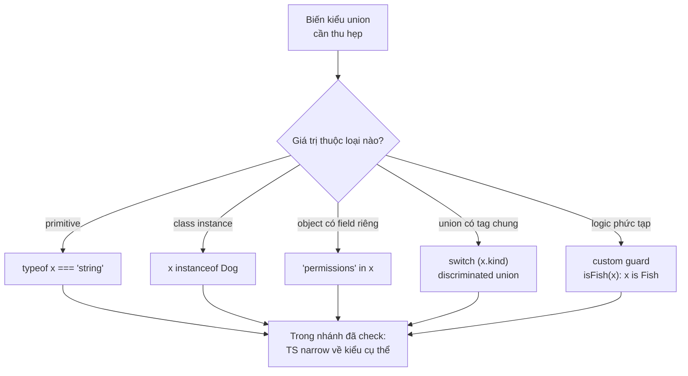

# Type Guards và Narrowing

**Type guard** (kiểm tra thu hẹp kiểu) là đoạn code kiểm tra kiểu thực tế của một giá trị tại thời điểm chạy, ví dụ dùng `typeof` hay `instanceof`. **Narrowing** (thu hẹp kiểu) là quá trình TypeScript dựa vào các kiểm tra đó để rút gọn kiểu rộng (như union) thành kiểu cụ thể hơn trong từng nhánh code. Nhờ đó bạn truy cập đúng thuộc tính và phương thức mà không gặp lỗi kiểu.

[](pathname:///img/typescript/type-guards.webp)

---

:::note[Ghi nhớ nhanh]

- ⭐ **Narrowing thu hẹp union về kiểu cụ thể trong từng nhánh** — nhờ vậy mới truy cập được method riêng (vd `x.toUpperCase()` với `string`); TS dựa vào control flow analysis để theo dõi kiểu.
- **Mỗi tình huống có một loại guard** — `typeof` cho primitive, `instanceof` cho class instance, `in` cho object có field riêng, equality/truthiness cho literal và loại `null`.
- ⭐ **Discriminated union là pattern mạnh nhất** — dùng field tag chung (`kind`) và `switch` để TS tự narrow từng `case`, không cần predicate.
- **Custom guard `pet is Fish` narrow trong nhánh `if`** — còn assertion function `asserts val is string` narrow **sau khi gọi** (hoặc throw).
- **`instanceof` không dùng được cho interface/type alias/object literal** — vì chúng bị xoá lúc compile; hãy dùng `in` hoặc type predicate.

:::

---

## Mục lục

- [Vì sao có type guard (thu hẹp kiểu)?](#vì-sao-có-type-guard-thu-hẹp-kiểu)
- [Narrowing là gì?](#narrowing-là-gì)
- [typeof guard](#typeof-guard)
- [instanceof guard](#instanceof-guard)
- [in operator](#in-operator)
- [Equality check](#equality-check)
- [Truthiness check](#truthiness-check)
- [User-defined type predicates](#user-defined-type-predicates)
- [Assertion functions](#assertion-functions)
- [Câu hỏi phỏng vấn](#câu-hỏi-phỏng-vấn)

---

## Vì sao có type guard (thu hẹp kiểu)?

**Vấn đề:** Khi một biến có kiểu union (`string | number`), bạn **không**
gọi được method riêng của từng kiểu, vì compiler chưa biết hiện tại là
kiểu nào.

```ts
function shout(x: string | number) {
  return x.toUpperCase();
  // Lỗi: Property 'toUpperCase' does not exist on type 'string | number'.
  // (number không có toUpperCase)
}
```

**Giải pháp:** Dùng **type guard** để **thu hẹp** (narrow) union về một
kiểu cụ thể trong từng nhánh — qua `typeof`, `instanceof`, toán tử `in`,
kiểm tra truthy/null, hoặc **custom type guard** (`function isX(v): v is X`).
Trong nhánh đã thu hẹp, TS hiểu đúng kiểu nên vừa an toàn vừa có
autocomplete.

```ts
function shout(x: string | number) {
  if (typeof x === "string") {
    return x.toUpperCase(); // x: string → OK
  }
  return x.toFixed(2);      // x: number → OK
}
```

:::tip[Dùng thực tế]

- **Xử lý `id: string | number`:** mỗi kiểu xử lý một cách (string thì
  trim, number thì so sánh) — narrow trước khi dùng.
- **Phân biệt loại đối tượng:** discriminated union theo field `"type"`/
  `"kind"`, dùng `switch` để rẽ nhánh từng loại.
- **Kiểm tra null trước khi dùng:** loại bỏ `null`/`undefined` để truy
  cập thuộc tính an toàn.
- **Custom guard cho dữ liệu API:** viết `isUser(data): data is User` để
  xác thực shape của response trước khi xử lý tiếp.

:::

---

## Narrowing là gì?

**Narrowing** là quá trình TS **thu hẹp** type của một biến dựa vào
điều kiện kiểm tra.

```ts
function format(x: string | number) {
  if (typeof x === "string") {
    // Trong nhánh này, x: string
    return x.toUpperCase();
  }
  // Ngoài nhánh, x: number
  return x.toFixed(2);
}
```

TS tự động theo dõi dòng chảy code (**control flow analysis**) để biết
type tại mỗi điểm.

Sơ đồ dưới đây giúp chọn nhanh loại guard phù hợp cho từng tình huống — tất cả đều dẫn về cùng một đích: trong nhánh đã kiểm tra, TS biết kiểu cụ thể:



---

## typeof guard

Dùng cho **primitive**.

```ts
function pad(value: string | number) {
  if (typeof value === "string") {
    return value.padStart(5);
  }
  return value.toString();
}
```

`typeof` chỉ trả về 8 giá trị: `"string"`, `"number"`, `"boolean"`,
`"bigint"`, `"symbol"`, `"undefined"`, `"object"`, `"function"`.

---

## instanceof guard

Dùng cho **class instance**.

```ts
class Dog { bark() {} }
class Cat { meow() {} }

function speak(a: Dog | Cat) {
  if (a instanceof Dog) {
    a.bark();
  } else {
    a.meow();
  }
}
```

:::warning[Cần lưu ý]

`instanceof` **không** hoạt động cho:

- Interface, type alias (chúng bị xoá lúc compile).
- Object literal không gắn với class.
- Class qua iframe/worker (mỗi context có constructor riêng).

→ Với object literal hoặc shape thuần, dùng `in` hoặc type predicate.

:::

---

## in operator

Kiểm tra **sự tồn tại của property**.

```ts
type Admin = { role: "admin"; permissions: string[] };
type User = { role: "user"; email: string };

function check(p: Admin | User) {
  if ("permissions" in p) {
    console.log(p.permissions); // p: Admin
  } else {
    console.log(p.email);       // p: User
  }
}
```

---

## Equality check

So sánh **giá trị literal** cũng narrow được.

```ts
function move(dir: "left" | "right" | "up") {
  if (dir === "left") {
    // dir: "left"
  } else {
    // dir: "right" | "up"
  }
}
```

Đây là cơ chế đằng sau **discriminated union** (xem dưới).

---

## Truthiness check

Kiểm tra giá trị "đúng/sai" trong `if`.

```ts
function greet(name: string | null) {
  if (name) {
    console.log(name.toUpperCase()); // name: string (null bị loại)
  }
}
```

:::warning[Cần lưu ý]

Truthiness check loại bỏ **toàn bộ falsy values**: `0`, `""`, `null`,
`undefined`, `NaN`, `false`. Coi chừng với `number`:

```ts
function setCount(n: number | undefined) {
  if (n) {
    // n: number, NHƯNG đã loại bỏ luôn n === 0
    console.log(n);
  }
}
```

Nếu `0` là giá trị hợp lệ, phải kiểm tra rõ:

```ts
if (n !== undefined) { /* ... */ }
```

:::

---

## User-defined type predicates

Khi `typeof` / `instanceof` không đủ, viết hàm trả về **type predicate**.

```ts
interface Fish { swim(): void }
interface Bird { fly(): void }

function isFish(pet: Fish | Bird): pet is Fish {
  return (pet as Fish).swim !== undefined;
}

function move(pet: Fish | Bird) {
  if (isFish(pet)) {
    pet.swim();   // pet: Fish
  } else {
    pet.fly();    // pet: Bird
  }
}
```

Cú pháp `pet is Fish` là **type predicate** — báo TS biết hàm này dùng
để narrow.

:::info[Phân tích]

**Discriminated union** là pattern mạnh nhất khi cần type guard nhiều
nhánh. Mỗi nhánh có một field **literal chung** (gọi là "tag" hoặc
"discriminator"):

```ts
type Shape =
  | { kind: "circle"; radius: number }
  | { kind: "square"; size: number }
  | { kind: "rect"; w: number; h: number };

function area(s: Shape): number {
  switch (s.kind) {
    case "circle": return Math.PI * s.radius ** 2;
    case "square": return s.size ** 2;
    case "rect":   return s.w * s.h;
  }
}
```

TS tự narrow trong từng `case` — không cần predicate. Đây là pattern
ưa thích của hàm xử lý state, action (Redux), AST...

:::

---

## Assertion functions

Hàm dạng `asserts x is T` — nếu chạy qua được, TS coi biến đã có type `T`.

```ts
function assertString(val: unknown): asserts val is string {
  if (typeof val !== "string") {
    throw new Error("Not a string");
  }
}

function upper(x: unknown) {
  assertString(x);
  return x.toUpperCase(); // x: string
}
```

:::info[Phân tích]

Assertion function khác type predicate ở chỗ:

- **Predicate** (`is`): trả về boolean → narrow trong nhánh `if`.
- **Assertion** (`asserts`): không trả về (hoặc throw) → narrow **sau
  khi gọi**.

Hữu dụng cho validation: kết hợp với Zod, io-ts, hoặc custom logic để
đảm bảo dữ liệu đúng kiểu trước khi tiếp tục.

:::

---

## Câu hỏi phỏng vấn

Những câu thường gặp về chủ đề này. Tự trả lời trước, rồi bấm **Xem đáp án** để đối chiếu.

**1. `Type guard` và `narrowing` khác nhau thế nào? Cái nào là công cụ, cái nào là kết quả?**

<details className="qa">
<summary>Xem đáp án</summary>

- **Type guard** là **công cụ** — đoạn code kiểm tra kiểu thực tế của giá trị tại thời điểm chạy: `typeof x === "string"`, `x instanceof Dog`, `"permissions" in p`, hay hàm predicate `isFish(pet)`.
- **Narrowing** là **kết quả** — quá trình compiler dựa vào các kiểm tra đó để rút gọn kiểu rộng (thường là union) thành kiểu cụ thể hơn trong từng nhánh code.

```ts
function shout(x: string | number) {
  if (typeof x === "string") { // type guard (công cụ)
    return x.toUpperCase();    // narrowing: x đã là string (kết quả)
  }
  return x.toFixed(2);         // nhánh còn lại: x là number
}
```

Nói cách khác: bạn viết guard, compiler thực hiện narrowing. Cầu nối giữa hai thứ là **control flow analysis** — engine theo dõi dòng chảy code để biết ở mỗi vị trí biến còn có thể mang kiểu gì. Guard chạy thật lúc runtime; narrowing chỉ tồn tại lúc biên dịch.

</details>

**2. Vì sao gọi `x.toUpperCase()` trên biến kiểu `string | number` bị báo lỗi, dù lúc chạy giá trị đúng là chuỗi?**

<details className="qa">
<summary>Xem đáp án</summary>

Vì TypeScript kiểm tra **tại thời điểm biên dịch**, còn "lúc chạy giá trị đúng là chuỗi" là thông tin chỉ có ở runtime. Compiler chỉ biết kiểu khai báo là `string | number`, và nó phải bảo đảm code hợp lệ với **mọi** khả năng của union đó.

```ts
function shout(x: string | number) {
  return x.toUpperCase();
  // Error: Property 'toUpperCase' does not exist on type 'string | number'.
}
```

Quy tắc: trên một union, chỉ truy cập được thành viên có mặt ở **tất cả** các nhánh. `toUpperCase` chỉ tồn tại trên `string`, `number` không có — nếu cho phép, một lần gọi `shout(5)` sẽ nổ `TypeError` lúc chạy.

Cách sửa là narrow trước khi dùng:

```ts
if (typeof x === "string") return x.toUpperCase();
```

Trong nhánh đó TS đã loại `number`, nên phép gọi trở nên an toàn — và bạn còn được autocomplete đúng method của `string`.

</details>

**3. `Control flow analysis` là gì và nó giúp compiler biết kiểu của biến tại từng điểm code ra sao?**

<details className="qa">
<summary>Xem đáp án</summary>

**Control flow analysis (CFA)** là engine của TypeScript đi theo **dòng chảy thực thi** của code — rẽ nhánh `if/else`, `switch`, `return`, `throw`, toán tử logic, vòng lặp — để tính ra kiểu **khả dĩ** của mỗi biến tại từng vị trí, thay vì chỉ dùng kiểu khai báo ban đầu.

```ts
function format(x: string | number) {
  // ở đây: x là string | number
  if (typeof x === "string") {
    return x.toUpperCase(); // nhánh true: x là string
  }
  return x.toFixed(2);      // nhánh false: x là number
}
```

CFA cũng hiểu các dạng thoát sớm:

```ts
function f(x: string | null) {
  if (x === null) return;   // thoát nếu null
  x.toUpperCase();          // từ đây trở đi x: string
}
```

Nó nhận diện `typeof`, `instanceof`, `in`, truthiness, so sánh literal, `Array.isArray`, type predicate và assertion function. Nhờ CFA, phần lớn ép kiểu `as` trở nên không cần thiết — nếu vẫn phải dùng `as` nhiều, thường là do cấu trúc dữ liệu chưa được mô hình hoá tốt.

</details>

**4. `typeof` trả về được bao nhiêu chuỗi kết quả? Vì sao `typeof null` lại là `"object"` và điều đó gây bẫy gì khi narrow?**

<details className="qa">
<summary>Xem đáp án</summary>

`typeof` trả về **8** chuỗi: `"string"`, `"number"`, `"boolean"`, `"bigint"`, `"symbol"`, `"undefined"`, `"object"`, `"function"`.

`typeof null === "object"` là một **bug lịch sử** của JavaScript từ bản đầu tiên (giá trị `null` được biểu diễn bằng con trỏ rỗng, mà các giá trị dạng object đều mang cùng tag kiểu). Sửa lại sẽ phá vỡ vô số code đang chạy, nên nó được giữ vĩnh viễn.

Cái bẫy khi narrow:

```ts
function f(x: { a: number } | null) {
  if (typeof x === "object") {
    x.a; // Error: 'x' is possibly 'null' — null vẫn lọt vào nhánh này
  }
}
```

Cách viết đúng:

```ts
if (x !== null) { x.a; }      // rõ ràng nhất
if (x) { x.a; }               // truthiness cũng loại null
if (typeof x === "object" && x !== null) { x.a; }
```

May là TypeScript đủ thông minh để **không** tự loại `null` trong nhánh `typeof x === "object"`, nên lỗi được bắt lúc biên dịch thay vì lúc chạy.

</details>

**5. Khi nào dùng `instanceof` thay cho `typeof`? Cho ví dụ mà `typeof` hoàn toàn không giúp được.**

<details className="qa">
<summary>Xem đáp án</summary>

Dùng `instanceof` khi cần phân biệt các **instance của class / constructor function**, vì `typeof` chỉ có 8 kết quả và mọi object đều trả về `"object"` — không phân biệt nổi.

```ts
class Dog { bark() {} }
class Cat { meow() {} }

function speak(a: Dog | Cat) {
  if (typeof a === "object") {
    // vô dụng: cả Dog lẫn Cat đều là "object"
  }
  if (a instanceof Dog) {
    a.bark();   // a: Dog
  } else {
    a.meow();   // a: Cat
  }
}
```

Ví dụ thực tế khác: phân biệt `Date` với `string`, hay xử lý lỗi:

```ts
try {
  risky();
} catch (e) {          // e: unknown
  if (e instanceof TypeError) console.log(e.message);
  else if (e instanceof Error) console.log(e.stack);
}
```

`instanceof` kiểm tra prototype chain lúc runtime, nên chỉ đúng với thứ thực sự tồn tại ở runtime: class, constructor function, các built-in như `Date`, `Error`, `RegExp`, `Map`.

</details>

**6. Vì sao `instanceof` không dùng được với `interface` hay `type alias`? Giải thích theo cơ chế `type erasure` lúc biên dịch.**

<details className="qa">
<summary>Xem đáp án</summary>

TypeScript áp dụng **type erasure**: mọi thứ thuần kiểu — `interface`, `type alias`, generic parameter, annotation — bị **xoá sạch** khi biên dịch sang JavaScript. File `.js` sinh ra không còn dấu vết nào của chúng.

```ts
interface Fish { swim(): void }

function isFish(x: unknown) {
  return x instanceof Fish; // Error: 'Fish' only refers to a type
}
```

Mà `instanceof` là toán tử **runtime**: nó lấy giá trị bên phải (phải là một constructor thật, có property `prototype`) rồi dò prototype chain của bên trái. `Fish` không tồn tại lúc chạy, nên không có gì để dò.

`class` thì khác — nó vừa là kiểu vừa là **giá trị runtime**, nên dùng được với `instanceof`.

Với interface, type alias hay object literal, hãy dùng:

- Toán tử **`in`**: `if ("swim" in pet)`.
- **Type predicate** tự viết: `function isFish(pet: Fish | Bird): pet is Fish { return "swim" in pet; }`.
- **Discriminated union** với field tag — cách sạch và mở rộng tốt nhất.

</details>

**7. Toán tử `in` narrow bằng cách nào? So với `instanceof`, khi nào bạn ưu tiên `in`?**

<details className="qa">
<summary>Xem đáp án</summary>

`in` kiểm tra **sự tồn tại của property** trên object (kể cả kế thừa qua prototype chain). TS dùng thông tin đó để giữ lại những nhánh của union có khai báo property ấy và loại các nhánh còn lại.

```ts
type Admin = { role: "admin"; permissions: string[] };
type User = { role: "user"; email: string };

function check(p: Admin | User) {
  if ("permissions" in p) {
    console.log(p.permissions); // p: Admin
  } else {
    console.log(p.email);       // p: User
  }
}
```

| | `in` | `instanceof` |
|---|---|---|
| Cần gì ở runtime | Chỉ cần object có property | Cần một constructor thật |
| Dùng với interface / type alias | **Được** | Không |
| Dùng với object literal, dữ liệu JSON | **Được** | Không |
| Qua iframe / worker | Vẫn đúng | Có thể sai |

Ưu tiên `in` khi làm việc với shape thuần (dữ liệu API, object literal, interface) — tức phần lớn code TypeScript đời thường. Chỉ chọn `instanceof` khi đối tượng thật sự là instance của class.

Lưu ý: property optional (`a?: string`) làm `in` kém tin cậy, vì nó có thể vắng mặt ở nhánh đáng lẽ khớp.

</details>

**8. Đoán lỗi: hàm nhận `n: number | undefined`, bên trong viết `if (n)` rồi xử lý. Bug nào sẽ xuất hiện và sửa thế nào?**

<details className="qa">
<summary>Xem đáp án</summary>

Bug: **giá trị `0` bị loại nhầm cùng với `undefined`**.

```ts
function setCount(n: number | undefined) {
  if (n) {
    console.log(n); // n: number — nhưng n === 0 không bao giờ vào đây
  }
}

setCount(0); // không in gì cả — thường là sai ý định
```

Truthiness check loại bỏ **mọi giá trị falsy**, mà `0` (và `NaN`) là số falsy. Về mặt kiểu thì TS vẫn narrow đúng thành `number`, nên compiler không báo gì — đây là lỗi **logic**, chỉ lộ ra lúc chạy. Đó là lý do nó hay được hỏi trong phỏng vấn.

Cách sửa — kiểm tra tường minh:

```ts
if (n !== undefined) { console.log(n); }      // rõ ràng nhất
if (typeof n === "number") { console.log(n); }
const count = n ?? 10;                        // ?? chỉ bắt null/undefined, giữ 0
```

Chú ý cùng họ: `||` cũng dính bẫy này (`n || 10` biến `0` thành `10`), nên với giá trị mặc định hãy dùng `??` (nullish coalescing).

</details>

**9. `Truthiness check` loại bỏ những giá trị nào? Kể đủ danh sách `falsy` và giải thích rủi ro với `string` rỗng.**

<details className="qa">
<summary>Xem đáp án</summary>

Danh sách **falsy** trong JavaScript gồm 7 giá trị: `false`, `0` (và `-0`), `0n` (BigInt zero), `""` (chuỗi rỗng), `null`, `undefined`, `NaN`. Mọi thứ còn lại đều truthy — kể cả `[]`, `{}` và `"0"`.

```ts
function greet(name: string | null) {
  if (name) {
    console.log(name.toUpperCase()); // name: string, null đã bị loại
  }
}
```

**Rủi ro với chuỗi rỗng:** `""` là một `string` hợp lệ, nhưng truthiness check vứt nó đi cùng `null`/`undefined`.

```ts
function render(label: string | undefined) {
  if (label) {
    show(label);     // label === "" sẽ bị bỏ qua
  }
}
```

Nếu chuỗi rỗng mang ý nghĩa (người dùng cố tình xoá trắng một trường, tên hiển thị để trống), logic này sai. Sửa bằng kiểm tra tường minh `if (label !== undefined)`, hoặc dùng `??` thay `||` khi đặt giá trị mặc định: `const text = label ?? "Không có";` giữ nguyên `""`, còn `label || "Không có"` thì không.

</details>

**10. Vì sao `equality check` (`dir === "left"`) cũng narrow được? Điều gì trong hệ kiểu cho phép việc đó?**

<details className="qa">
<summary>Xem đáp án</summary>

Vì TypeScript có **literal type** — `"left"` không chỉ là giá trị mà còn là một kiểu chỉ chứa đúng giá trị đó. Khi so sánh bằng `===`, compiler biết trong nhánh true biến phải nằm trong giao của kiểu hiện tại và literal đó; các nhánh không khớp bị loại khỏi union.

```ts
function move(dir: "left" | "right" | "up") {
  if (dir === "left") {
    // dir: "left"
  } else {
    // dir: "right" | "up"  — TS tự trừ đi nhánh đã xử lý
  }
}
```

Điều kiện để hoạt động: kiểu của biến phải là union các **kiểu đơn vị** (literal string/number/boolean, `null`, `undefined`, enum member). Nếu kiểu là `string` chung chung thì `dir === "left"` không narrow được gì thêm — vẫn là `string`.

So sánh hai biến với nhau cũng narrow cả hai chiều, và `!==` narrow nhánh còn lại. Đây chính là cơ chế nền của **discriminated union**: so sánh field tag bằng `===` (hoặc `switch`) để rẽ nhánh toàn bộ object.

</details>

**11. `Discriminated union` là gì? Field `discriminator` phải thoả điều kiện gì để TS narrow tự động trong `switch`?**

<details className="qa">
<summary>Xem đáp án</summary>

**Discriminated union** (tagged union) là union các object type, mọi nhánh cùng có một field đóng vai trò "nhãn" để phân biệt. So sánh nhãn đó là TS narrow được cả object.

```ts
type Shape =
  | { kind: "circle"; radius: number }
  | { kind: "square"; size: number }
  | { kind: "rect"; w: number; h: number };

function area(s: Shape): number {
  switch (s.kind) {
    case "circle": return Math.PI * s.radius ** 2;
    case "square": return s.size ** 2;
    case "rect":   return s.w * s.h;
  }
}
```

Điều kiện của field discriminator:

- **Có mặt ở mọi nhánh** của union.
- Kiểu là **literal / kiểu đơn vị** (string literal, number literal, boolean, enum member) — không được là `string` chung chung.
- Mỗi nhánh mang **giá trị khác nhau**, không trùng lặp.
- Nên là field bắt buộc, không optional.

Đây là pattern ưa thích cho state machine, Redux action, node của AST, kết quả API dạng `{ status: "success" | "error" }`.

</details>

**12. Vì sao `discriminated union` được coi là mạnh hơn việc kiểm tra sự tồn tại của property? Nêu ít nhất hai lý do.**

<details className="qa">
<summary>Xem đáp án</summary>

So với việc dò property bằng `in` hay `!== undefined`:

- **Ý định rõ ràng, không phụ thuộc chi tiết cài đặt.** Tag `kind: "circle"` nói thẳng "đây là hình tròn"; còn `"radius" in s` chỉ suy đoán gián tiếp qua một field ngẫu nhiên. Khi hai nhánh lỡ có chung field, cách dò property gãy ngay.
- **Hỗ trợ `switch` và exhaustiveness check.** Với tag, bạn viết `switch (s.kind)` rồi thêm nhánh `default` gán vào `never` — thêm một loại mới vào union mà quên xử lý là compiler báo lỗi ngay. Dò property không cho bạn cơ chế này.
- **Mở rộng tốt.** Thêm nhánh mới chỉ cần đặt tag mới; không phải tìm xem field nào là "duy nhất" của nhánh đó.
- **An toàn với optional property.** `"email" in p` cho kết quả sai nếu `email` là optional và tình cờ vắng mặt; tag thì luôn có.
- **Đọc và debug dễ.** Dữ liệu tự mô tả — nhìn JSON log là biết ngay object thuộc loại nào.

</details>

**13. Viết `type predicate` dạng `pet is Fish` nghĩa là gì với compiler? Chuyện gì xảy ra nếu thân hàm trả về sai kết quả?**

<details className="qa">
<summary>Xem đáp án</summary>

`pet is Fish` là **type predicate** — nó nói với compiler: "hàm này trả về `boolean`, và khi kết quả là `true` thì tham số `pet` chắc chắn thuộc kiểu `Fish`". Nhờ đó TS narrow được ở nơi gọi.

```ts
function isFish(pet: Fish | Bird): pet is Fish {
  return (pet as Fish).swim !== undefined;
}

function move(pet: Fish | Bird) {
  if (isFish(pet)) pet.swim(); // pet: Fish
  else pet.fly();              // pet: Bird
}
```

Nếu thân hàm **trả về sai**, compiler không phát hiện được. TS chỉ kiểm tra rất lỏng rằng kiểu predicate có liên quan tới kiểu tham số, còn **logic bên trong là lời hứa của bạn** — nó không xác minh.

```ts
function isFish(pet: Fish | Bird): pet is Fish {
  return true; // biên dịch trót lọt!
}
// hệ quả: gọi pet.swim() trên một Bird → TypeError lúc chạy
```

Vì vậy predicate phải được viết cẩn thận, kiểm tra đủ mọi field đặc trưng. Với dữ liệu ngoài (API), nên dùng thư viện validate như Zod và lấy predicate từ đó thay vì tự viết thủ công.

</details>

**14. So sánh `type predicate` (`is`) với `assertion function` (`asserts`): khác nhau ở thời điểm narrow và cách báo lỗi.**

<details className="qa">
<summary>Xem đáp án</summary>

| | Type predicate (`is`) | Assertion function (`asserts`) |
|---|---|---|
| Kiểu trả về | `boolean` | `void` (hoặc không bao giờ trả về) |
| Thời điểm narrow | **Trong nhánh `if`** dùng kết quả | **Sau lời gọi**, cho phần còn lại của scope |
| Khi điều kiện sai | Trả `false`, bạn tự xử lý nhánh else | **Throw** — dừng luồng thực thi |
| Hợp với | Rẽ nhánh, `filter`, kiểm tra tuỳ chọn | Validate đầu vào, "fail fast" |

```ts
function isFish(pet: Fish | Bird): pet is Fish {
  return (pet as Fish).swim !== undefined;
}
if (isFish(pet)) pet.swim();   // narrow trong if

function assertString(val: unknown): asserts val is string {
  if (typeof val !== "string") throw new Error("Not a string");
}
function upper(x: unknown) {
  assertString(x);
  return x.toUpperCase();      // narrow từ đây trở đi
}
```

Chọn predicate khi cả hai nhánh đều hợp lệ và cần xử lý riêng; chọn assertion khi dữ liệu sai kiểu là lỗi nghiêm trọng, không có gì để làm tiếp — nó giúp code phẳng hơn, tránh lồng `if` nhiều tầng.

</details>

**15. Vì sao một `assertion function` gán vào biến (dạng `const assertIsString = ...`) lại phải khai báo kiểu tường minh?**

<details className="qa">
<summary>Xem đáp án</summary>

Vì TypeScript yêu cầu: mọi tên trong biểu thức gọi một assertion function phải được khai báo với **kiểu tường minh**. Nếu chỉ để suy luận, compiler báo lỗi *"Assertions require every name in the call target to be declared with an explicit type annotation"*.

```ts
// Không được — kiểu chỉ được suy luận
const assertIsString = (val: unknown): asserts val is string => {
  if (typeof val !== "string") throw new Error("Not a string");
};
assertIsString(x); // Error

// Được — annotate tường minh cho biến
type AssertIsString = (val: unknown) => asserts val is string;
const assertIsString2: AssertIsString = (val) => {
  if (typeof val !== "string") throw new Error("Not a string");
};
assertIsString2(x);
x.toUpperCase(); // OK
```

Lý do thiết kế: hiệu ứng `asserts` ảnh hưởng tới **toàn bộ dòng code phía sau**, nên nó phải được xác định chắc chắn ngay từ khai báo, không được phụ thuộc vào suy luận có thể đổi khi refactor. Vì biến có thể bị gán lại, TS không tin vào kiểu suy luận trong trường hợp này.

Cách đơn giản nhất để tránh rắc rối: khai báo assertion function bằng `function` declaration thay vì arrow function gán vào biến.

</details>

**16. `Exhaustiveness check` với `never` hoạt động ra sao? Nó giúp gì khi bạn thêm một nhánh mới vào union?**

<details className="qa">
<summary>Xem đáp án</summary>

Ý tưởng: sau khi `switch` đã xử lý hết mọi nhánh của một discriminated union, kiểu còn lại ở `default` phải là `never`. Gán nó vào một biến kiểu `never` để compiler kiểm hộ.

```ts
type Shape =
  | { kind: "circle"; radius: number }
  | { kind: "square"; size: number };

function area(s: Shape): number {
  switch (s.kind) {
    case "circle": return Math.PI * s.radius ** 2;
    case "square": return s.size ** 2;
    default: {
      const _exhaustive: never = s; // s: never nếu đã xử lý đủ
      throw new Error(`Shape không hỗ trợ: ${_exhaustive}`);
    }
  }
}
```

Khi bạn **thêm nhánh mới** (ví dụ `{ kind: "rect"; w: number; h: number }`) mà quên bổ sung `case`, kiểu của `s` ở `default` không còn là `never` mà là nhánh `rect` — phép gán vào `never` **báo lỗi biên dịch ngay**.

Giá trị thực tế: biến một lỗi runtime im lặng (hàm trả về `undefined`, UI hiển thị sai) thành lỗi compile, và compiler tự chỉ cho bạn mọi chỗ cần cập nhật khi union mở rộng. Rất hữu ích với reducer, state machine, router.

</details>

**17. Khi nào bạn chọn `type predicate` tự viết thay vì `as` (type assertion)? Rủi ro của `as` là gì?**

<details className="qa">
<summary>Xem đáp án</summary>

Khác biệt cốt lõi: **`as` chỉ là lời khẳng định suông lúc biên dịch, không sinh ra bất kỳ kiểm tra nào lúc chạy**; còn type predicate buộc bạn viết logic kiểm tra thật.

```ts
const user = data as User;      // không kiểm tra gì, tin là đúng
user.name.toUpperCase();        // nổ nếu data không có name

function isUser(x: unknown): x is User {
  return typeof x === "object" && x !== null && "name" in x;
}
if (isUser(data)) data.name.toUpperCase(); // an toàn
```

Rủi ro của `as`:

- **Tắt kiểm tra kiểu** đúng chỗ nguy hiểm nhất, thường là ranh giới dữ liệu ngoài (API, `JSON.parse`, `localStorage`).
- Lỗi bị đẩy sang runtime, xa nơi gây ra, khó debug.
- Khi kiểu đích thay đổi, `as` vẫn im lặng — không có cảnh báo nào.

Chọn predicate khi giá trị đến từ **bên ngoài** hệ thống kiểu, khi cần narrow dùng lại ở nhiều nơi, hoặc khi dùng trong `filter`. Chỉ dùng `as` khi bạn biết chắc hơn compiler và giá trị vốn đã nằm trong code của mình (ví dụ ép literal, `as const`, hoặc thu hẹp sau một kiểm tra đã làm ở nơi khác).

</details>

**18. Narrowing bị "mất" trong những tình huống nào (callback, closure, gán lại biến, property của object)? Cách xử lý?**

<details className="qa">
<summary>Xem đáp án</summary>

Narrowing chỉ có hiệu lực khi compiler chắc chắn giá trị không đổi giữa lúc kiểm tra và lúc dùng. Các tình huống bị mất:

- **Callback / closure**: TS không biết callback chạy lúc nào, nên narrowing bên ngoài không giữ được với biến `let`.
- **Gán lại biến**: sau một phép gán mới, kiểu quay về kiểu khai báo.
- **Property của object**: sau khi gọi một hàm bất kỳ, TS coi như property có thể đã bị thay đổi nên xoá narrowing (nhất là với property mutable của object không phải `const`).
- **Phần tử mảng truy cập bằng index**: `arr[i]` không được theo dõi narrowing.

```ts
function f(x: string | null) {
  if (x) {
    setTimeout(() => x.toUpperCase(), 0); // OK nếu x là tham số (không gán lại)
  }
}

function g(o: { v?: string }) {
  if (o.v) {
    doSomething();
    o.v.toUpperCase(); // có thể mất narrowing
  }
}
```

Cách xử lý: **gán ra biến `const` cục bộ** ngay sau khi narrow rồi dùng biến đó (`const v = o.v; if (v) v.toUpperCase();`); ưu tiên `const` thay `let`; dùng optional chaining `o.v?.toUpperCase()`; hoặc destructure property ra trước khi kiểm tra.

</details>
