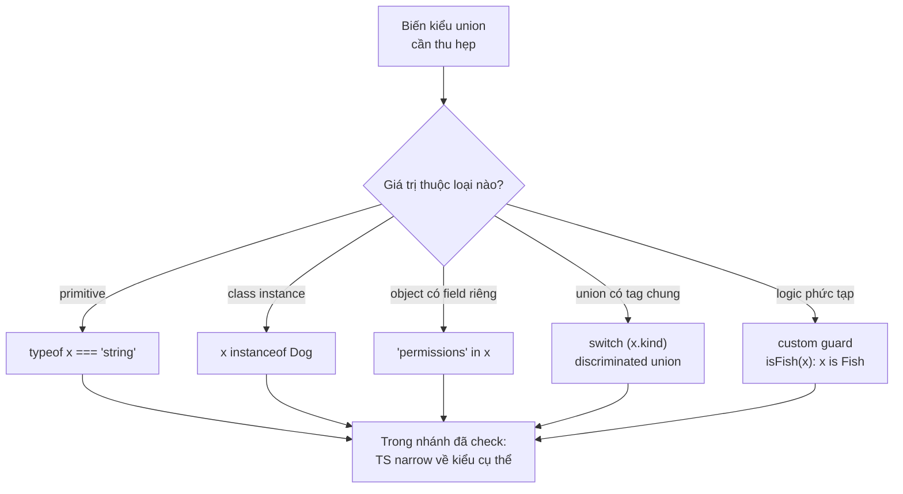

# Type Guards và Narrowing

**Type guard** (kiểm tra thu hẹp kiểu) là đoạn code kiểm tra kiểu thực tế của một giá trị tại thời điểm chạy, ví dụ dùng `typeof` hay `instanceof`. **Narrowing** (thu hẹp kiểu) là quá trình TypeScript dựa vào các kiểm tra đó để rút gọn kiểu rộng (như union) thành kiểu cụ thể hơn trong từng nhánh code. Nhờ đó bạn truy cập đúng thuộc tính và phương thức mà không gặp lỗi kiểu.

---

:::note[Ghi nhớ nhanh]

- ⭐ **Narrowing thu hẹp union về kiểu cụ thể trong từng nhánh** — nhờ vậy mới truy cập được method riêng (vd `x.toUpperCase()` với `string`); TS dựa vào control flow analysis để theo dõi kiểu.
- **Mỗi tình huống có một loại guard** — `typeof` cho primitive, `instanceof` cho class instance, `in` cho object có field riêng, equality/truthiness cho literal và loại `null`.
- ⭐ **Discriminated union là pattern mạnh nhất** — dùng field tag chung (`kind`) và `switch` để TS tự narrow từng `case`, không cần predicate.
- **Custom guard `pet is Fish` narrow trong nhánh `if`** — còn assertion function `asserts val is string` narrow **sau khi gọi** (hoặc throw).
- **`instanceof` không dùng được cho interface/type alias/object literal** — vì chúng bị xoá lúc compile; hãy dùng `in` hoặc type predicate.

:::

---

## Mục lục

- [Vì sao có type guard (thu hẹp kiểu)?](#vì-sao-có-type-guard-thu-hẹp-kiểu)
- [Narrowing là gì?](#narrowing-là-gì)
- [typeof guard](#typeof-guard)
- [instanceof guard](#instanceof-guard)
- [in operator](#in-operator)
- [Equality check](#equality-check)
- [Truthiness check](#truthiness-check)
- [User-defined type predicates](#user-defined-type-predicates)
- [Assertion functions](#assertion-functions)

---

## Vì sao có type guard (thu hẹp kiểu)?

**Vấn đề:** Khi một biến có kiểu union (`string | number`), bạn **không**
gọi được method riêng của từng kiểu, vì compiler chưa biết hiện tại là
kiểu nào.

```ts
function shout(x: string | number) {
  return x.toUpperCase();
  // Lỗi: Property 'toUpperCase' does not exist on type 'string | number'.
  // (number không có toUpperCase)
}
```

**Giải pháp:** Dùng **type guard** để **thu hẹp** (narrow) union về một
kiểu cụ thể trong từng nhánh — qua `typeof`, `instanceof`, toán tử `in`,
kiểm tra truthy/null, hoặc **custom type guard** (`function isX(v): v is X`).
Trong nhánh đã thu hẹp, TS hiểu đúng kiểu nên vừa an toàn vừa có
autocomplete.

```ts
function shout(x: string | number) {
  if (typeof x === "string") {
    return x.toUpperCase(); // x: string → OK
  }
  return x.toFixed(2);      // x: number → OK
}
```

:::tip[Dùng thực tế]

- **Xử lý `id: string | number`:** mỗi kiểu xử lý một cách (string thì
  trim, number thì so sánh) — narrow trước khi dùng.
- **Phân biệt loại đối tượng:** discriminated union theo field `"type"`/
  `"kind"`, dùng `switch` để rẽ nhánh từng loại.
- **Kiểm tra null trước khi dùng:** loại bỏ `null`/`undefined` để truy
  cập thuộc tính an toàn.
- **Custom guard cho dữ liệu API:** viết `isUser(data): data is User` để
  xác thực shape của response trước khi xử lý tiếp.

:::

---

## Narrowing là gì?

**Narrowing** là quá trình TS **thu hẹp** type của một biến dựa vào
điều kiện kiểm tra.

```ts
function format(x: string | number) {
  if (typeof x === "string") {
    // Trong nhánh này, x: string
    return x.toUpperCase();
  }
  // Ngoài nhánh, x: number
  return x.toFixed(2);
}
```

TS tự động theo dõi dòng chảy code (**control flow analysis**) để biết
type tại mỗi điểm.

Sơ đồ dưới đây giúp chọn nhanh loại guard phù hợp cho từng tình huống — tất cả đều dẫn về cùng một đích: trong nhánh đã kiểm tra, TS biết kiểu cụ thể:



---

## typeof guard

Dùng cho **primitive**.

```ts
function pad(value: string | number) {
  if (typeof value === "string") {
    return value.padStart(5);
  }
  return value.toString();
}
```

`typeof` chỉ trả về 8 giá trị: `"string"`, `"number"`, `"boolean"`,
`"bigint"`, `"symbol"`, `"undefined"`, `"object"`, `"function"`.

---

## instanceof guard

Dùng cho **class instance**.

```ts
class Dog { bark() {} }
class Cat { meow() {} }

function speak(a: Dog | Cat) {
  if (a instanceof Dog) {
    a.bark();
  } else {
    a.meow();
  }
}
```

:::warning[Cần lưu ý]

`instanceof` **không** hoạt động cho:

- Interface, type alias (chúng bị xoá lúc compile).
- Object literal không gắn với class.
- Class qua iframe/worker (mỗi context có constructor riêng).

→ Với object literal hoặc shape thuần, dùng `in` hoặc type predicate.

:::

---

## in operator

Kiểm tra **sự tồn tại của property**.

```ts
type Admin = { role: "admin"; permissions: string[] };
type User = { role: "user"; email: string };

function check(p: Admin | User) {
  if ("permissions" in p) {
    console.log(p.permissions); // p: Admin
  } else {
    console.log(p.email);       // p: User
  }
}
```

---

## Equality check

So sánh **giá trị literal** cũng narrow được.

```ts
function move(dir: "left" | "right" | "up") {
  if (dir === "left") {
    // dir: "left"
  } else {
    // dir: "right" | "up"
  }
}
```

Đây là cơ chế đằng sau **discriminated union** (xem dưới).

---

## Truthiness check

Kiểm tra giá trị "đúng/sai" trong `if`.

```ts
function greet(name: string | null) {
  if (name) {
    console.log(name.toUpperCase()); // name: string (null bị loại)
  }
}
```

:::warning[Cần lưu ý]

Truthiness check loại bỏ **toàn bộ falsy values**: `0`, `""`, `null`,
`undefined`, `NaN`, `false`. Coi chừng với `number`:

```ts
function setCount(n: number | undefined) {
  if (n) {
    // n: number, NHƯNG đã loại bỏ luôn n === 0
    console.log(n);
  }
}
```

Nếu `0` là giá trị hợp lệ, phải kiểm tra rõ:

```ts
if (n !== undefined) { /* ... */ }
```

:::

---

## User-defined type predicates

Khi `typeof` / `instanceof` không đủ, viết hàm trả về **type predicate**.

```ts
interface Fish { swim(): void }
interface Bird { fly(): void }

function isFish(pet: Fish | Bird): pet is Fish {
  return (pet as Fish).swim !== undefined;
}

function move(pet: Fish | Bird) {
  if (isFish(pet)) {
    pet.swim();   // pet: Fish
  } else {
    pet.fly();    // pet: Bird
  }
}
```

Cú pháp `pet is Fish` là **type predicate** — báo TS biết hàm này dùng
để narrow.

:::info[Phân tích]

**Discriminated union** là pattern mạnh nhất khi cần type guard nhiều
nhánh. Mỗi nhánh có một field **literal chung** (gọi là "tag" hoặc
"discriminator"):

```ts
type Shape =
  | { kind: "circle"; radius: number }
  | { kind: "square"; size: number }
  | { kind: "rect"; w: number; h: number };

function area(s: Shape): number {
  switch (s.kind) {
    case "circle": return Math.PI * s.radius ** 2;
    case "square": return s.size ** 2;
    case "rect":   return s.w * s.h;
  }
}
```

TS tự narrow trong từng `case` — không cần predicate. Đây là pattern
ưa thích của hàm xử lý state, action (Redux), AST...

:::

---

## Assertion functions

Hàm dạng `asserts x is T` — nếu chạy qua được, TS coi biến đã có type `T`.

```ts
function assertString(val: unknown): asserts val is string {
  if (typeof val !== "string") {
    throw new Error("Not a string");
  }
}

function upper(x: unknown) {
  assertString(x);
  return x.toUpperCase(); // x: string
}
```

:::info[Phân tích]

Assertion function khác type predicate ở chỗ:

- **Predicate** (`is`): trả về boolean → narrow trong nhánh `if`.
- **Assertion** (`asserts`): không trả về (hoặc throw) → narrow **sau
  khi gọi**.

Hữu dụng cho validation: kết hợp với Zod, io-ts, hoặc custom logic để
đảm bảo dữ liệu đúng kiểu trước khi tiếp tục.

:::
