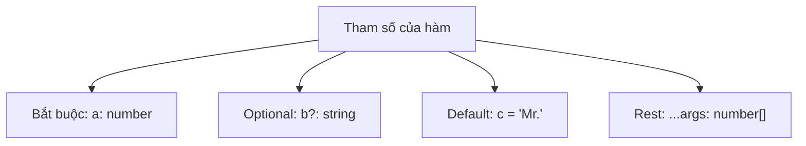
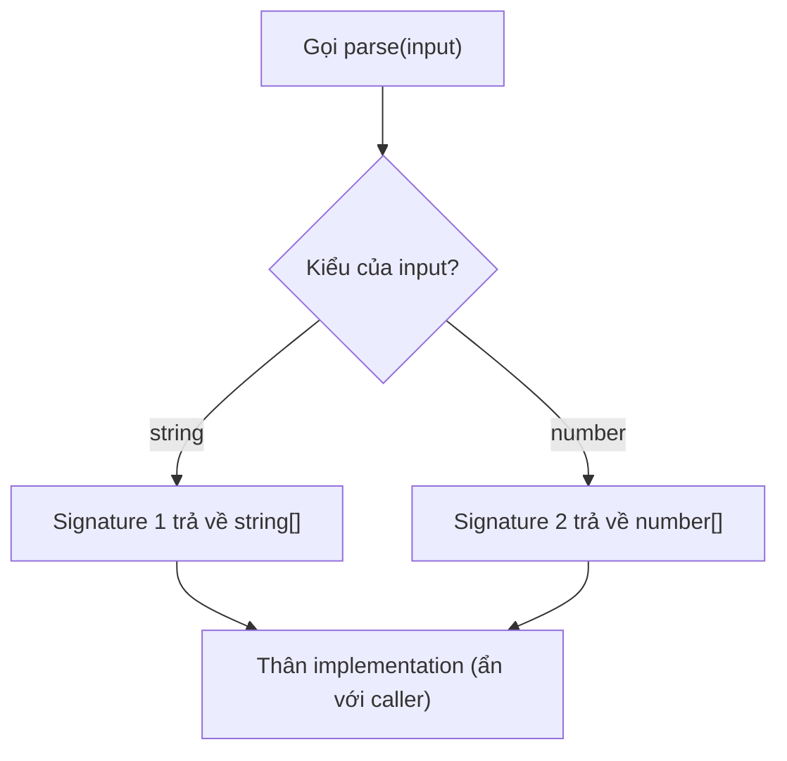

# Typing Functions

**Typing functions** (gán kiểu cho hàm) là việc khai báo kiểu dữ liệu cho tham số đầu vào và giá trị trả về của hàm. Khi làm vậy, TypeScript sẽ báo lỗi nếu bạn truyền sai kiểu hoặc dùng sai kết quả, giúp hàm an toàn và dễ hiểu hơn. Đây là một trong những lợi ích cốt lõi khi viết hàm bằng TypeScript thay vì JavaScript thuần.

---

:::note[Ghi nhớ nhanh]

- ⭐ **Định kiểu cho cả tham số và giá trị trả về** — compiler bắt lỗi gọi thiếu/thừa/sai kiểu đối số ngay khi viết, thay vì âm thầm chạy sai như JS.
- **Bốn dạng tham số** — bắt buộc `a: number`, optional `b?: string`, default `c = "Mr."`, và rest `...args: number[]`.
- **Optional `?` khác `| undefined`** — `?` cho phép **không truyền**, còn `| undefined` bắt buộc truyền nhưng có thể là `undefined`.
- **`type BinaryOp = (a, b) => number` mô tả chữ ký hàm để tái sử dụng** — dùng cho callback, tương đương call signature trong `interface`.
- ⭐ **Overload chỉ tồn tại ở compile-time** — liệt kê signature cụ thể trước, tổng quát sau; thường `generic` dễ đọc hơn, chỉ dùng overload khi return type khác hẳn nhau.

:::

---

## Mục lục

- [Vì sao cần định kiểu cho hàm?](#vì-sao-cần-định-kiểu-cho-hàm)
- [Tham số và return type](#tham-số-và-return-type)
- [Optional và default parameter](#optional-và-default-parameter)
- [Rest parameter](#rest-parameter)
- [Function type expression](#function-type-expression)
- [Function Overloading](#function-overloading)
- [Câu hỏi phỏng vấn](#câu-hỏi-phỏng-vấn)

---

## Vì sao cần định kiểu cho hàm?

**Vấn đề:**

Trong JavaScript, gọi hàm thiếu, thừa hoặc sai kiểu đối số không hề báo gì
lúc viết code. Quên `return` hoặc dùng sai kiểu giá trị trả về cũng chỉ lộ
ra khi chạy.

```ts
function add(a, b) {
  return a + b;
}

add(1);            // không báo lỗi — kết quả là NaN
add(1, 2, 3);      // không báo lỗi — đối số thừa bị bỏ qua
add("1", 2);       // không báo lỗi — kết quả là "12" (nối chuỗi)
```

**Giải pháp:**

TypeScript định kiểu cho cả **tham số** và **giá trị trả về**. Compiler bắt
lỗi gọi sai ngay khi viết, editor autocomplete đối số, và bạn biết chắc kiểu
trả về.

```ts
function add(a: number, b: number): number {
  return a + b;
}

add(1);            // Error — thiếu đối số
add(1, 2, 3);      // Error — thừa đối số
add("1", 2);       // Error — sai kiểu đối số
add(1, 2);         // OK — trả về number
```

Hỗ trợ đầy đủ: tham số optional `?`, default value, rest `...args: number[]`,
và **function type** để mô tả chữ ký callback.

:::tip[Dùng thực tế]

- **Callback đúng chữ ký:** truyền hàm vào `.map`, `.filter`, hay event
  handler mà không lo sai số lượng/kiểu tham số.
- **Hàm tiện ích an toàn:** mọi nơi gọi hàm helper đều được kiểm tra kiểu,
  giảm bug truyền nhầm dữ liệu.
- **API rõ ràng cho người khác:** đồng đội dùng hàm export của bạn được
  autocomplete và biết chính xác kiểu đầu vào/trả về.
- **Tránh nhầm thứ tự đối số:** truyền sai thứ tự hay sai kiểu đối số bị
  báo lỗi ngay, thay vì âm thầm chạy sai.

:::

---

## Tham số và return type

```ts
function add(a: number, b: number): number {
  return a + b;
}
```

Return type thường được **infer tự động**, không bắt buộc khai báo trong
hàm cục bộ. Với hàm export, nên khai báo rõ để làm contract.

Arrow function:

```ts
const multiply = (a: number, b: number): number => a * b;
```

Sơ đồ dưới đây liệt kê các dạng tham số mà TypeScript hỗ trợ khi khai báo hàm.



---

## Optional và default parameter

Tham số có `?` là **optional** — có thể không truyền.

```ts
function greet(name: string, title?: string) {
  return title ? `${title} ${name}` : name;
}

greet("An");           // OK
greet("An", "Mr.");    // OK
```

Default value (TS infer luôn type):

```ts
function greet(name: string, title = "Mr.") {
  return `${title} ${name}`;
}
```

:::warning[Cần lưu ý]

**Optional (`?`)** khác **`| undefined`**:

```ts
function a(x?: string) {}
function b(x: string | undefined) {}

a();           // OK
b();           // Error — phải truyền argument
b(undefined);  // OK
```

`?` cho phép **không truyền**; `| undefined` bắt buộc truyền nhưng có
thể là `undefined`. Trong public API, dùng `?` để cho phép caller bỏ qua.

:::

---

## Rest parameter

Gộp nhiều argument vào một mảng.

```ts
function sum(...nums: number[]): number {
  return nums.reduce((a, b) => a + b, 0);
}

sum(1, 2, 3, 4); // 10
```

Có thể dùng tuple để giới hạn vị trí:

```ts
function log(level: "info" | "error", ...messages: string[]) {
  console.log(`[${level}]`, ...messages);
}
```

---

## Function type expression

Khai báo **type của một hàm** để tái sử dụng.

```ts
type BinaryOp = (a: number, b: number) => number;

const add: BinaryOp = (a, b) => a + b;
const sub: BinaryOp = (a, b) => a - b;
```

Tương đương dùng `interface`:

```ts
interface BinaryOp {
  (a: number, b: number): number;
}
```

---

## Function Overloading

Một hàm có nhiều **signature** khác nhau, thân implementation chỉ một.

```ts
function parse(input: string): string[];
function parse(input: number): number[];
function parse(input: string | number): string[] | number[] {
  if (typeof input === "string") {
    return input.split(",");
  }
  return [input];
}

const a = parse("a,b,c"); // type: string[]
const b = parse(42);      // type: number[]
```

Sơ đồ sau minh họa cách compiler chọn signature theo kiểu đối số, còn thân implementation thì ẩn với caller.



:::info[Phân tích]

Overload trong TS **chỉ tồn tại ở compile-time** — runtime vẫn là một
hàm JS duy nhất. Quy tắc viết overload:

1. Liệt kê signature **cụ thể nhất trước**, **tổng quát nhất sau**.
2. Signature implementation (cuối cùng) **không hiển thị** với caller —
   nó chỉ là chỗ chứa logic.
3. Implementation phải **tương thích** với mọi overload signature.

Nhiều trường hợp **generic** hoặc **union return type** thay thế được
overload và dễ đọc hơn:

```ts
// Generic — dễ đọc hơn overload
function parse<T extends string | number>(
  input: T
): T extends string ? string[] : number[] {
  // ...
  return null as any;
}
```

Chỉ dùng overload khi **return type khác hẳn nhau** và không biểu diễn
được bằng generic.

:::

:::tip[Mẹo]

**Call signature** trong interface dùng để mô tả hàm có thêm property
(callable object) — pattern hay gặp khi typing thư viện cũ:

```ts
interface Counter {
  (): number;        // gọi như hàm
  count: number;     // có property
  reset(): void;     // có method
}
```

:::

---

## Câu hỏi phỏng vấn

Những câu thường gặp về chủ đề này. Tự trả lời trước, rồi đối chiếu lại với nội dung phía trên.

1. Vì sao định kiểu tham số và giá trị trả về lại quan trọng? Nêu ba loại bug mà JS thuần bỏ lọt còn TS bắt được.
2. Return type nên khai báo tường minh hay để TS `infer`? Trả lời khác nhau ra sao giữa hàm nội bộ và hàm `export`?
3. Kể bốn dạng tham số mà TypeScript hỗ trợ và thứ tự bắt buộc khi khai báo chúng.
4. Tham số optional `b?: string` khác `b: string | undefined` ở điểm nào? Đoán kết quả khi gọi hàm mà không truyền đối số.
5. Vì sao tham số optional không được đặt trước tham số bắt buộc? Có cách nào lách và có nên lách không?
6. Tham số có `default value` thì kiểu được suy ra thế nào? Nó có tự động thành optional với caller không?
7. `Rest parameter` phải khai báo kiểu ra sao? Vì sao nó bắt buộc đứng cuối danh sách tham số?
8. Dùng `tuple type` cho rest parameter mang lại lợi ích gì so với mảng thường?
9. So sánh `type BinaryOp = (a: number, b: number) => number` với `call signature` viết trong `interface`: khác nhau ở đâu?
10. `Function overloading` trong TS hoạt động ở thời điểm nào — biên dịch hay chạy? Điều đó ảnh hưởng gì tới cách viết thân hàm?
11. Nêu ba quy tắc viết overload đúng. Vì sao signature cụ thể phải đứng trước signature tổng quát?
12. Signature `implementation` có hiển thị với caller không? Chuyện gì xảy ra nếu nó không tương thích với một overload?
13. Khi nào nên thay overload bằng `generic` hoặc `union return type`? Cho một ví dụ mỗi hướng.
14. `Hybrid type` (callable object) là gì và vì sao nó hay xuất hiện khi typing thư viện cũ?
15. Kiểu của `this` trong hàm được khai báo thế nào? Vì sao arrow function không nhận tham số `this`?
16. Đoán lỗi: khai báo `function f(cb: (x: number) => void)` rồi truyền vào một hàm không nhận tham số nào — TS chấp nhận hay báo lỗi? Vì sao?
