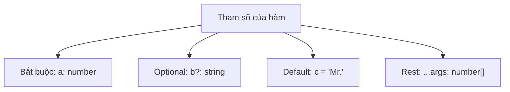
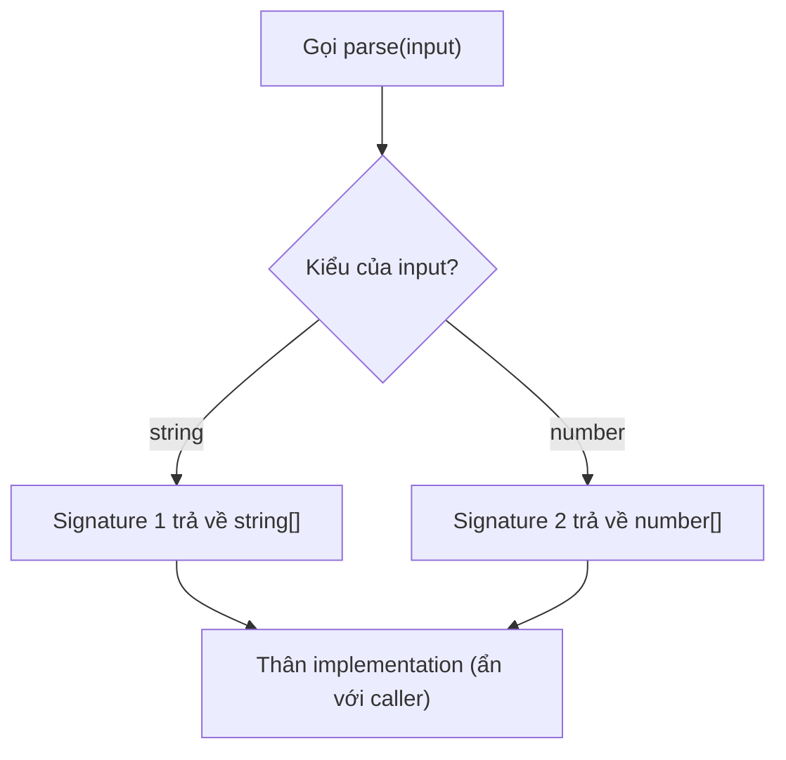

# Typing Functions

**Typing functions** (gán kiểu cho hàm) là việc khai báo kiểu dữ liệu cho tham số đầu vào và giá trị trả về của hàm. Khi làm vậy, TypeScript sẽ báo lỗi nếu bạn truyền sai kiểu hoặc dùng sai kết quả, giúp hàm an toàn và dễ hiểu hơn. Đây là một trong những lợi ích cốt lõi khi viết hàm bằng TypeScript thay vì JavaScript thuần.

[](pathname:///img/typescript/functions.webp)

---

:::note[Ghi nhớ nhanh]

- ⭐ **Định kiểu cho cả tham số và giá trị trả về** — compiler bắt lỗi gọi thiếu/thừa/sai kiểu đối số ngay khi viết, thay vì âm thầm chạy sai như JS.
- **Bốn dạng tham số** — bắt buộc `a: number`, optional `b?: string`, default `c = "Mr."`, và rest `...args: number[]`.
- **Optional `?` khác `| undefined`** — `?` cho phép **không truyền**, còn `| undefined` bắt buộc truyền nhưng có thể là `undefined`.
- **`type BinaryOp = (a, b) => number` mô tả chữ ký hàm để tái sử dụng** — dùng cho callback, tương đương call signature trong `interface`.
- ⭐ **Overload chỉ tồn tại ở compile-time** — liệt kê signature cụ thể trước, tổng quát sau; thường `generic` dễ đọc hơn, chỉ dùng overload khi return type khác hẳn nhau.

:::

---

## Mục lục

- [Vì sao cần định kiểu cho hàm?](#vì-sao-cần-định-kiểu-cho-hàm)
- [Tham số và return type](#tham-số-và-return-type)
- [Optional và default parameter](#optional-và-default-parameter)
- [Rest parameter](#rest-parameter)
- [Function type expression](#function-type-expression)
- [Function Overloading](#function-overloading)
- [Câu hỏi phỏng vấn](#câu-hỏi-phỏng-vấn)

---

## Vì sao cần định kiểu cho hàm?

**Vấn đề:**

Trong JavaScript, gọi hàm thiếu, thừa hoặc sai kiểu đối số không hề báo gì
lúc viết code. Quên `return` hoặc dùng sai kiểu giá trị trả về cũng chỉ lộ
ra khi chạy.

```ts
function add(a, b) {
  return a + b;
}

add(1);            // không báo lỗi — kết quả là NaN
add(1, 2, 3);      // không báo lỗi — đối số thừa bị bỏ qua
add("1", 2);       // không báo lỗi — kết quả là "12" (nối chuỗi)
```

**Giải pháp:**

TypeScript định kiểu cho cả **tham số** và **giá trị trả về**. Compiler bắt
lỗi gọi sai ngay khi viết, editor autocomplete đối số, và bạn biết chắc kiểu
trả về.

```ts
function add(a: number, b: number): number {
  return a + b;
}

add(1);            // Error — thiếu đối số
add(1, 2, 3);      // Error — thừa đối số
add("1", 2);       // Error — sai kiểu đối số
add(1, 2);         // OK — trả về number
```

Hỗ trợ đầy đủ: tham số optional `?`, default value, rest `...args: number[]`,
và **function type** để mô tả chữ ký callback.

:::tip[Dùng thực tế]

- **Callback đúng chữ ký:** truyền hàm vào `.map`, `.filter`, hay event
  handler mà không lo sai số lượng/kiểu tham số.
- **Hàm tiện ích an toàn:** mọi nơi gọi hàm helper đều được kiểm tra kiểu,
  giảm bug truyền nhầm dữ liệu.
- **API rõ ràng cho người khác:** đồng đội dùng hàm export của bạn được
  autocomplete và biết chính xác kiểu đầu vào/trả về.
- **Tránh nhầm thứ tự đối số:** truyền sai thứ tự hay sai kiểu đối số bị
  báo lỗi ngay, thay vì âm thầm chạy sai.

:::

---

## Tham số và return type

```ts
function add(a: number, b: number): number {
  return a + b;
}
```

Return type thường được **infer tự động**, không bắt buộc khai báo trong
hàm cục bộ. Với hàm export, nên khai báo rõ để làm contract.

Arrow function:

```ts
const multiply = (a: number, b: number): number => a * b;
```

Sơ đồ dưới đây liệt kê các dạng tham số mà TypeScript hỗ trợ khi khai báo hàm.



---

## Optional và default parameter

Tham số có `?` là **optional** — có thể không truyền.

```ts
function greet(name: string, title?: string) {
  return title ? `${title} ${name}` : name;
}

greet("An");           // OK
greet("An", "Mr.");    // OK
```

Default value (TS infer luôn type):

```ts
function greet(name: string, title = "Mr.") {
  return `${title} ${name}`;
}
```

:::warning[Cần lưu ý]

**Optional (`?`)** khác **`| undefined`**:

```ts
function a(x?: string) {}
function b(x: string | undefined) {}

a();           // OK
b();           // Error — phải truyền argument
b(undefined);  // OK
```

`?` cho phép **không truyền**; `| undefined` bắt buộc truyền nhưng có
thể là `undefined`. Trong public API, dùng `?` để cho phép caller bỏ qua.

:::

---

## Rest parameter

Gộp nhiều argument vào một mảng.

```ts
function sum(...nums: number[]): number {
  return nums.reduce((a, b) => a + b, 0);
}

sum(1, 2, 3, 4); // 10
```

Có thể dùng tuple để giới hạn vị trí:

```ts
function log(level: "info" | "error", ...messages: string[]) {
  console.log(`[${level}]`, ...messages);
}
```

---

## Function type expression

Khai báo **type của một hàm** để tái sử dụng.

```ts
type BinaryOp = (a: number, b: number) => number;

const add: BinaryOp = (a, b) => a + b;
const sub: BinaryOp = (a, b) => a - b;
```

Tương đương dùng `interface`:

```ts
interface BinaryOp {
  (a: number, b: number): number;
}
```

---

## Function Overloading

Một hàm có nhiều **signature** khác nhau, thân implementation chỉ một.

```ts
function parse(input: string): string[];
function parse(input: number): number[];
function parse(input: string | number): string[] | number[] {
  if (typeof input === "string") {
    return input.split(",");
  }
  return [input];
}

const a = parse("a,b,c"); // type: string[]
const b = parse(42);      // type: number[]
```

Sơ đồ sau minh họa cách compiler chọn signature theo kiểu đối số, còn thân implementation thì ẩn với caller.



:::info[Phân tích]

Overload trong TS **chỉ tồn tại ở compile-time** — runtime vẫn là một
hàm JS duy nhất. Quy tắc viết overload:

1. Liệt kê signature **cụ thể nhất trước**, **tổng quát nhất sau**.
2. Signature implementation (cuối cùng) **không hiển thị** với caller —
   nó chỉ là chỗ chứa logic.
3. Implementation phải **tương thích** với mọi overload signature.

Nhiều trường hợp **generic** hoặc **union return type** thay thế được
overload và dễ đọc hơn:

```ts
// Generic — dễ đọc hơn overload
function parse<T extends string | number>(
  input: T
): T extends string ? string[] : number[] {
  // ...
  return null as any;
}
```

Chỉ dùng overload khi **return type khác hẳn nhau** và không biểu diễn
được bằng generic.

:::

:::tip[Mẹo]

**Call signature** trong interface dùng để mô tả hàm có thêm property
(callable object) — pattern hay gặp khi typing thư viện cũ:

```ts
interface Counter {
  (): number;        // gọi như hàm
  count: number;     // có property
  reset(): void;     // có method
}
```

:::

---

## Câu hỏi phỏng vấn

Những câu thường gặp về chủ đề này. Tự trả lời trước, rồi bấm **Xem đáp án** để đối chiếu.

**1. Vì sao định kiểu tham số và giá trị trả về lại quan trọng? Nêu ba loại bug mà JS thuần bỏ lọt còn TS bắt được.**

<details className="qa">
<summary>Xem đáp án</summary>

Trong JavaScript, gọi hàm sai gần như không bao giờ báo gì lúc viết code — lỗi chỉ lộ ra khi chạy, thường ở xa nơi gây ra.

```ts
function add(a, b) { return a + b; }

add(1);         // NaN — thiếu đối số
add(1, 2, 3);   // 3 — đối số thừa bị bỏ qua im lặng
add("1", 2);    // "12" — nối chuỗi thay vì cộng số
```

Ba loại bug TypeScript bắt được:

- **Thiếu đối số** — `add(1)` báo lỗi "Expected 2 arguments, but got 1" thay vì trả về `NaN`.
- **Thừa đối số** — `add(1, 2, 3)` bị chặn, tránh trường hợp gọi nhầm API cũ sau khi hàm đổi signature.
- **Sai kiểu / sai thứ tự đối số** — `add("1", 2)` báo lỗi ngay, không âm thầm nối chuỗi.

Lợi ích kèm theo: editor autocomplete đối số, biết chắc kiểu trả về nên dùng kết quả cũng an toàn, và signature trở thành tài liệu sống cho đồng đội.

</details>

**2. Return type nên khai báo tường minh hay để TS `infer`? Trả lời khác nhau ra sao giữa hàm nội bộ và hàm `export`?**

<details className="qa">
<summary>Xem đáp án</summary>

Với **hàm nội bộ** (helper, hàm cục bộ trong module): để TS tự suy luận. Annotation chỉ lặp lại thông tin đã hiển nhiên, làm code dài mà không tăng an toàn.

```ts
function add(a: number, b: number) {
  return a + b; // return type suy ra: number
}
```

Với **hàm `export`** (public API): nên khai báo tường minh, vì nó đóng vai trò **hợp đồng**.

```ts
export function format(user: User): string {
  return user.name;
}
```

Lý do:

- Nếu để suy luận, một thay đổi nhỏ trong thân hàm (lỡ trả thêm `undefined`) sẽ âm thầm đổi kiểu trả về, và lỗi nổ ra ở hàng chục nơi gọi thay vì ngay tại định nghĩa.
- Kiểu công khai không còn phụ thuộc chi tiết cài đặt bên trong, nên refactor nội bộ không phá vỡ người dùng.
- File `.d.ts` sinh ra gọn, dễ đọc; compiler cũng đỡ phải suy luận lại toàn bộ thân hàm.

Ngoại lệ đáng annotate cả với hàm nội bộ: khi inference cho ra kiểu quá rộng hoặc sai ý định.

</details>

**3. Kể bốn dạng tham số mà TypeScript hỗ trợ và thứ tự bắt buộc khi khai báo chúng.**

<details className="qa">
<summary>Xem đáp án</summary>

Bốn dạng:

- **Bắt buộc** — `a: number`, caller phải truyền.
- **Optional** — `b?: string`, có thể bỏ qua; bên trong kiểu là `string | undefined`.
- **Default value** — `c = "Mr."`, kiểu được suy từ giá trị mặc định; caller cũng có thể bỏ qua.
- **Rest** — `...args: number[]`, gộp mọi đối số còn lại thành mảng.

```ts
function f(a: number, b?: string, c = "Mr.", ...rest: boolean[]) {}
```

Thứ tự bắt buộc:

- Tham số **bắt buộc phải đứng trước optional** — viết ngược lại là lỗi "A required parameter cannot follow an optional parameter".
- **Rest luôn đứng cuối cùng**, và chỉ được có một.
- Tham số có default value về mặt cú pháp được đặt ở bất kỳ đâu, nhưng nếu nó đứng trước tham số bắt buộc thì caller phải truyền `undefined` tường minh để lấy giá trị mặc định — nên trên thực tế vẫn nên đặt sau.

</details>

**4. Tham số optional `b?: string` khác `b: string | undefined` ở điểm nào? Đoán kết quả khi gọi hàm mà không truyền đối số.**

<details className="qa">
<summary>Xem đáp án</summary>

```ts
function a(x?: string) {}
function b(x: string | undefined) {}

a();           // OK
b();           // Error — Expected 1 arguments, but got 0
b(undefined);  // OK
```

Khác biệt nằm ở **có được phép bỏ qua đối số hay không**:

- `?` — caller **không cần truyền**. Bên trong hàm, kiểu của `x` vẫn là `string | undefined`, nên vẫn phải kiểm tra trước khi dùng.
- `| undefined` — caller **bắt buộc truyền**, nhưng được phép truyền `undefined`.

Về mặt kiểu bên trong thân hàm thì hai cách giống nhau; khác nhau ở phía nơi gọi. (Kỹ thuật hơn: `?` còn làm `arguments.length` khác nhau và ảnh hưởng tới cách compiler đếm arity.)

Chọn thế nào: dùng `?` cho public API khi đối số thực sự tuỳ chọn — caller viết gọn hơn. Dùng `| undefined` khi bạn muốn **ép caller ra quyết định tường minh**, tránh trường hợp quên truyền một giá trị quan trọng.

</details>

**5. Vì sao tham số optional không được đặt trước tham số bắt buộc? Có cách nào lách và có nên lách không?**

<details className="qa">
<summary>Xem đáp án</summary>

Vì JavaScript truyền đối số **theo vị trí**, không theo tên. Nếu optional đứng trước, compiler không có cách nào biết đối số bạn truyền ứng với tham số nào.

```ts
function f(a?: number, b: string) {} // Error: A required parameter cannot
                                      // follow an optional parameter.
f("hi"); // ứng với a hay b? Không xác định được
```

Cách "lách" có thể gặp:

- Khai báo `a: number | undefined, b: string` rồi bắt caller truyền `undefined` tường minh: `f(undefined, "hi")`.
- Dùng **function overload** để mô tả các dạng gọi khác nhau.
- Đảo thứ tự cho hợp lý — cách tự nhiên nhất.

Có nên lách không? Nói chung là **không**. Khi thấy mình cần vậy, đó là dấu hiệu signature đang quá phức tạp. Giải pháp sạch hơn là gom đối số vào một **object options**:

```ts
function f({ a, b }: { a?: number; b: string }) {}
f({ b: "hi" });
```

Cách này còn tránh được bẫy "boolean trap" và không cần nhớ thứ tự đối số.

</details>

**6. Tham số có `default value` thì kiểu được suy ra thế nào? Nó có tự động thành optional với caller không?**

<details className="qa">
<summary>Xem đáp án</summary>

Kiểu được **suy ra từ chính giá trị mặc định** (đã widen), nên thường không cần annotate:

```ts
function greet(name: string, title = "Mr.") {
  return `${title} ${name}`; // title: string
}
```

Với caller, tham số đó **trở thành optional** — bỏ qua được:

```ts
greet("An");          // "Mr. An"
greet("An", "Dr.");   // "Dr. An"
greet("An", undefined); // "Mr. An" — truyền undefined cũng kích hoạt default
```

Vài điểm cần nhớ:

- Bên trong thân hàm, kiểu **không** chứa `undefined` (khác với `title?: string`) — vì default đã đảm bảo luôn có giá trị. Đây là ưu điểm lớn: không phải kiểm tra null.
- Chỉ `undefined` mới kích hoạt giá trị mặc định; truyền `null` thì `title` sẽ là `null`.
- Không viết `title?: string = "Mr."` — TS báo lỗi, vì `?` và default là thừa nhau.
- Muốn kiểu rộng hơn giá trị mặc định thì vẫn annotate được: `function f(mode: "a" | "b" = "a") {}`.

</details>

**7. `Rest parameter` phải khai báo kiểu ra sao? Vì sao nó bắt buộc đứng cuối danh sách tham số?**

<details className="qa">
<summary>Xem đáp án</summary>

Rest parameter phải có kiểu **mảng** (hoặc tuple), vì nó gom nhiều đối số lại thành một mảng:

```ts
function sum(...nums: number[]): number {
  return nums.reduce((a, b) => a + b, 0);
}
sum(1, 2, 3, 4); // 10

function log(level: "info" | "error", ...messages: string[]) {
  console.log(`[${level}]`, ...messages);
}
```

Viết `...nums: number` là lỗi — TS yêu cầu kiểu mảng.

Vì sao phải đứng cuối: rest "hút" **tất cả đối số còn lại**, số lượng không xác định trước. Nếu có tham số nào đứng sau nó, compiler (và cả runtime JS) không thể biết đối số nào thuộc về rest và đối số nào thuộc tham số phía sau — ranh giới hoàn toàn nhập nhằng. Đây là quy tắc của chính JavaScript, TypeScript chỉ tuân theo.

Cũng vì thế mỗi hàm chỉ được có **một** rest parameter, và nó không kết hợp được với giá trị mặc định.

</details>

**8. Dùng `tuple type` cho rest parameter mang lại lợi ích gì so với mảng thường?**

<details className="qa">
<summary>Xem đáp án</summary>

Mảng thường (`...args: number[]`) chỉ nói "bao nhiêu số cũng được". Tuple cho phép mô tả **số lượng cố định, kiểu riêng cho từng vị trí, và cả tên nhãn**:

```ts
function point(...args: [x: number, y: number, label?: string]) {}
point(1, 2);            // OK
point(1, 2, "A");       // OK
point(1);               // Error — thiếu y
point(1, "2");          // Error — sai kiểu vị trí thứ hai
```

Lợi ích:

- **Kiểm tra theo vị trí** thay vì một kiểu chung cho mọi đối số.
- **Nhãn tham số** hiện ra trong autocomplete và thông báo lỗi, đọc dễ hơn `args[0]`, `args[1]`.
- Hỗ trợ **arity chính xác**: bắt được thiếu/thừa đối số.

Ứng dụng mạnh nhất là **chuyển tiếp đối số** trong hàm wrapper generic, kết hợp với `Parameters<T>`:

```ts
function withLog<T extends (...args: any[]) => any>(fn: T) {
  return (...args: Parameters<T>): ReturnType<T> => {
    console.log("gọi", args);
    return fn(...args);
  };
}
```

Nhờ tuple, wrapper giữ nguyên chữ ký của hàm gốc thay vì suy biến thành `any[]`.

</details>

**9. So sánh `type BinaryOp = (a: number, b: number) => number` với `call signature` viết trong `interface`: khác nhau ở đâu?**

<details className="qa">
<summary>Xem đáp án</summary>

```ts
type BinaryOp = (a: number, b: number) => number;

interface BinaryOp2 {
  (a: number, b: number): number;
}
```

Về khả năng mô tả hàm thuần, hai cách **tương đương** — gán hàm vào biến kiểu nào cũng như nhau.

Khác biệt:

| | Function type expression (`type`) | Call signature (`interface`) |
|---|---|---|
| Cú pháp | Gọn, dùng `=>` | Dài hơn, dùng `:` |
| Thêm property cho hàm | Phải dùng intersection `&` | Viết thẳng trong thân interface |
| Nhiều overload | Khó (phải dùng intersection) | Liệt kê nhiều call signature |
| Declaration merging | Không | Có |

Call signature mạnh hơn khi hàm còn mang **property** (hybrid type) hoặc cần **overload**:

```ts
interface Counter {
  (): number;        // gọi như hàm
  count: number;     // có property
  reset(): void;     // có method
}
```

Thực tế: dùng `type` cho callback và chữ ký hàm thông thường vì gọn và đọc nhanh; chuyển sang `interface` với call signature khi cần callable object hoặc khi typing thư viện cũ.

</details>

**10. `Function overloading` trong TS hoạt động ở thời điểm nào — biên dịch hay chạy? Điều đó ảnh hưởng gì tới cách viết thân hàm?**

<details className="qa">
<summary>Xem đáp án</summary>

Overload chỉ tồn tại ở **compile-time**. Sau khi biên dịch, mọi overload signature bị xoá sạch; JavaScript sinh ra chỉ có **một hàm duy nhất** — thân implementation.

```ts
function parse(input: string): string[];
function parse(input: number): number[];
function parse(input: string | number): string[] | number[] {
  if (typeof input === "string") return input.split(",");
  return [input];
}

const a = parse("a,b,c"); // string[]
const b = parse(42);      // number[]
```

Hệ quả với cách viết thân hàm:

- Thân hàm phải **tự phân biệt kiểu lúc runtime** bằng type guard (`typeof`, `Array.isArray`, kiểm tra `arguments.length`...) — không có cơ chế dispatch tự động như Java hay C++.
- Tham số của implementation phải đủ rộng để nhận **mọi** overload, thường là union.
- Kiểu trả về của implementation cũng phải bao hết các khả năng.

Đây là khác biệt cốt lõi so với overload trong ngôn ngữ compiled truyền thống: ở TS, overload chỉ là cách **mô tả** cho compiler và editor, còn logic rẽ nhánh vẫn do bạn viết tay.

</details>

**11. Nêu ba quy tắc viết overload đúng. Vì sao signature cụ thể phải đứng trước signature tổng quát?**

<details className="qa">
<summary>Xem đáp án</summary>

Ba quy tắc:

1. Liệt kê signature **cụ thể nhất trước, tổng quát nhất sau**.
2. Signature **implementation** (cái cuối cùng, có thân hàm) **không hiển thị** với caller — nó chỉ là chỗ chứa logic.
3. Implementation phải **tương thích với mọi** overload signature: tham số đủ rộng, kiểu trả về bao hết các khả năng.

Vì sao thứ tự quan trọng: compiler duyệt danh sách overload **từ trên xuống** và chọn **signature đầu tiên khớp** với đối số. Nếu đặt cái tổng quát lên trước, nó sẽ "nuốt" hết các lời gọi và signature cụ thể phía sau không bao giờ được chọn.

```ts
// Sai thứ tự
function get(x: any): any;
function get(x: string): string[];   // không bao giờ tới lượt

// Đúng thứ tự
function get(x: string): string[];
function get(x: any): any;
```

Kết quả của việc sai thứ tự không phải là lỗi biên dịch, mà là **kiểu trả về tệ hơn mong đợi** (`any` thay vì `string[]`) — âm thầm làm mất an toàn kiểu, nên rất dễ lọt qua review.

</details>

**12. Signature `implementation` có hiển thị với caller không? Chuyện gì xảy ra nếu nó không tương thích với một overload?**

<details className="qa">
<summary>Xem đáp án</summary>

**Không hiển thị.** Khi một hàm có overload, caller chỉ "nhìn thấy" các overload signature đã liệt kê; signature của implementation bị ẩn hoàn toàn.

```ts
function parse(input: string): string[];
function parse(input: number): number[];
function parse(input: string | number): string[] | number[] {
  if (typeof input === "string") return input.split(",");
  return [input];
}

parse("a,b");            // string[]
const x: string | number = Math.random() > 0.5 ? "a" : 1;
parse(x);                // Error — dù implementation nhận union!
```

Đây là chi tiết hay bị bất ngờ: implementation nhận `string | number` nhưng caller vẫn không được truyền union, vì không overload nào khai báo dạng đó. Muốn cho phép thì phải bổ sung một overload tương ứng.

Nếu implementation **không tương thích** với một overload — ví dụ overload khai báo trả `string[]` nhưng implementation chỉ trả `number[]` — compiler báo lỗi *"This overload signature is not compatible with its implementation signature"* ngay tại chỗ khai báo. Tuy vậy, việc kiểm tra này khá lỏng: nếu implementation dùng `any` hoặc ép kiểu, lỗi logic vẫn có thể lọt xuống runtime.

</details>

**13. Khi nào nên thay overload bằng `generic` hoặc `union return type`? Cho một ví dụ mỗi hướng.**

<details className="qa">
<summary>Xem đáp án</summary>

Nguyên tắc: chỉ dùng overload khi các kiểu trả về **khác hẳn nhau** và không diễn đạt được bằng cách khác. Overload dài dòng, khó bảo trì, và dễ sai thứ tự.

**Dùng generic** khi kiểu trả về phụ thuộc kiểu đầu vào theo một quy luật:

```ts
// Thay vì overload cho từng kiểu
function first<T>(arr: T[]): T | undefined {
  return arr[0];
}
first([1, 2]);       // number | undefined
first(["a", "b"]);   // string | undefined
```

**Dùng union return type** khi hàm thật sự có thể trả về vài dạng và caller nên narrow:

```ts
type Result = { ok: true; data: string } | { ok: false; error: string };
function run(): Result { /* ... */ }
```

**Vẫn nên dùng overload** khi số lượng và kiểu tham số khác nhau hẳn giữa các cách gọi, ví dụ `document.createElement("div")` trả `HTMLDivElement` còn `createElement("a")` trả `HTMLAnchorElement` — quan hệ tra bảng, không suy ra bằng generic đơn giản (lib DOM thực tế dùng map kiểu kết hợp generic).

Thứ tự ưu tiên đề xuất: generic → union → overload.

</details>

**14. `Hybrid type` (callable object) là gì và vì sao nó hay xuất hiện khi typing thư viện cũ?**

<details className="qa">
<summary>Xem đáp án</summary>

**Hybrid type** là kiểu mô tả một giá trị vừa **gọi được như hàm**, vừa **có property/method như object**. Trong TypeScript, nó được viết bằng `interface` chứa call signature kèm các thành viên khác:

```ts
interface Counter {
  (): number;        // gọi như hàm
  count: number;     // có property
  reset(): void;     // có method
}

const c: Counter = (() => c.count++) as Counter;
c.count = 0;
c();       // 0
c.reset;
```

Vì sao hay gặp ở thư viện cũ: trong JavaScript, hàm **chính là object**, nên gắn thêm property vào hàm là mẫu rất phổ biến trước thời module ES. Ví dụ kinh điển:

- **jQuery** — `$(selector)` gọi được, đồng thời có `$.ajax`, `$.extend`.
- **Express** — `express()` tạo app, còn `express.static`, `express.Router` là property.
- Nhiều thư viện cũ dùng chính hàm chính làm namespace cho các tiện ích liên quan.

Khi viết file khai báo `.d.ts` cho những thư viện này, hybrid type là cách duy nhất mô tả đúng. Trong code mới, mẫu này ít được khuyến khích — nên tách hàm và namespace riêng cho rõ ràng và dễ tree-shake.

</details>

**15. Kiểu của `this` trong hàm được khai báo thế nào? Vì sao arrow function không nhận tham số `this`?**

<details className="qa">
<summary>Xem đáp án</summary>

TypeScript cho phép khai báo `this` như một **tham số giả ở vị trí đầu tiên**. Nó chỉ tồn tại lúc biên dịch, bị xoá khi sinh JS, và không tính vào danh sách đối số của caller:

```ts
function handleClick(this: HTMLButtonElement, event: MouseEvent) {
  console.log(this.disabled); // this được định kiểu đúng
}
button.addEventListener("click", handleClick);
```

Nhờ đó, dùng sai `this` bị bắt ngay lúc biên dịch thay vì thành `undefined` lúc chạy (đặc biệt khi bật `strictBindCallApply` và `noImplicitThis`).

**Arrow function không nhận tham số `this`** vì bản thân nó **không có `this` riêng**: theo chuẩn ES, arrow function lấy `this` theo **lexical scope** — tức `this` của phạm vi bao quanh nơi nó được định nghĩa, và giá trị đó không thể thay đổi bằng `call`, `apply`, `bind` hay bằng cách gọi như method. Vì `this` đã bị cố định từ ngữ cảnh, việc khai báo kiểu cho nó là vô nghĩa, nên TS báo lỗi nếu bạn thử.

Hệ quả thực tế: dùng `function` khi cần `this` động (method của object, event handler DOM), dùng arrow function khi muốn giữ `this` của bên ngoài (callback trong class).

</details>

**16. Đoán lỗi: khai báo `function f(cb: (x: number) => void)` rồi truyền vào một hàm không nhận tham số nào — TS chấp nhận hay báo lỗi? Vì sao?**

<details className="qa">
<summary>Xem đáp án</summary>

TypeScript **chấp nhận** — không báo lỗi.

```ts
function f(cb: (x: number) => void) {
  cb(42);
}

f(() => console.log("xong")); // OK
f((x) => console.log(x));     // OK
f((x, y) => {});              // Error — thừa tham số
```

Lý do: một hàm **nhận ít tham số hơn** luôn dùng được ở chỗ cần hàm nhận nhiều tham số hơn. Người gọi vẫn truyền đủ đối số, hàm chỉ đơn giản **bỏ qua** những cái nó không khai báo — hoàn toàn an toàn. Ngược lại mới nguy hiểm: hàm đòi nhiều tham số hơn mức được cung cấp sẽ nhận `undefined`, nên TS chặn.

Quy tắc này phản ánh đúng thực tế JavaScript và cực kỳ hữu ích:

```ts
[1, 2, 3].forEach((x) => console.log(x));
// forEach thật ra truyền (value, index, array) — bạn chỉ lấy cái cần
["1", "2", "3"].map(Number);  // Number chỉ nhận 1 tham số, an toàn
```

Bẫy kinh điển liên quan: `["1","2","3"].map(parseInt)` cho `[1, NaN, NaN]`, vì `parseInt` nhận hai tham số và nhận luôn index làm cơ số.

</details>
