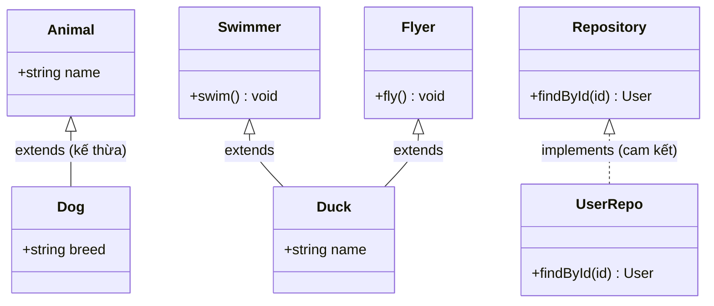
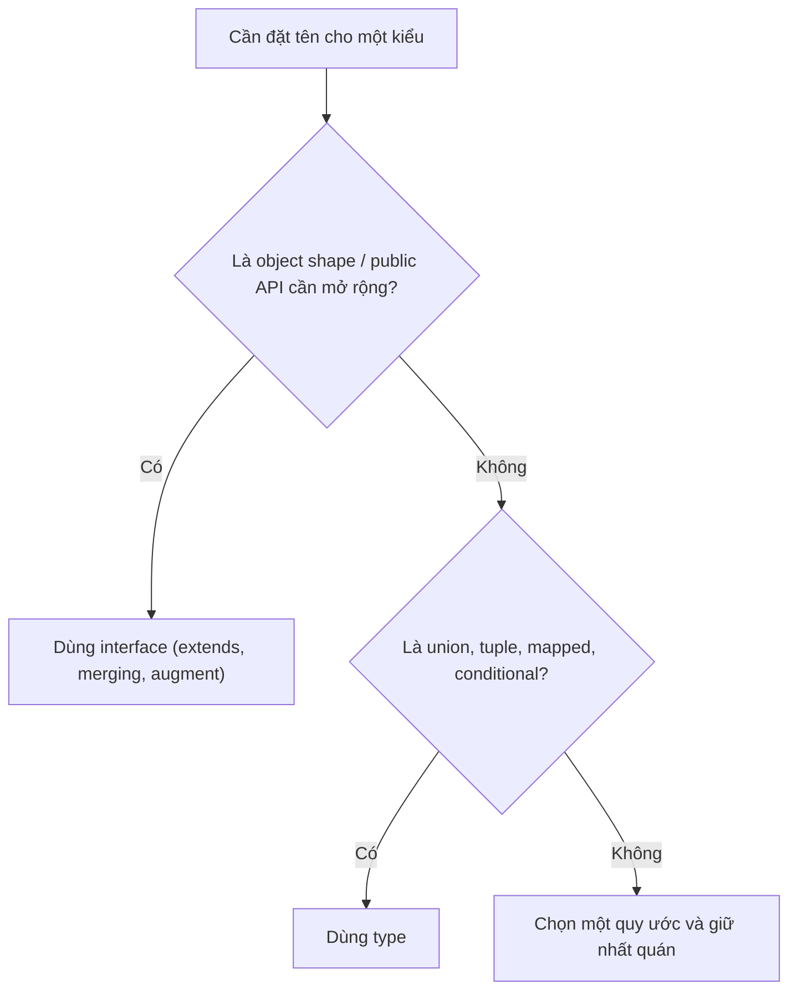

# Interfaces

**Interface** (bản mô tả hình dạng đối tượng) là cách bạn định nghĩa một đối tượng cần có những thuộc tính và phương thức nào, cùng kiểu của chúng. Nó hoạt động như một "hợp đồng": bất kỳ đối tượng nào tuân theo interface đều phải đáp ứng đúng cấu trúc đã khai báo. Interface giúp code rõ ràng, dễ tái sử dụng và có thể mở rộng (extends) khi cần.

[](pathname:///img/typescript/interfaces.webp)

---

:::note[Ghi nhớ nhanh]

- ⭐ **Interface đặt TÊN cho một hình dạng object để TÁI SỬ DỤNG** — như một "hợp đồng" chung, sửa một nơi áp dụng mọi nơi; class dùng `implements` để cam kết tuân theo.
- **`extends` để kế thừa (nhiều interface cùng lúc)** — khác `&` (intersection), `extends` phát hiện xung đột type ngay tại khai báo.
- ⭐ **Declaration merging: khai báo cùng tên nhiều lần được TS tự gộp** — `type` không có tính năng này; đây là kỹ thuật để augment `Window`, `express.Request`...
- **Hybrid types mô tả giá trị vừa là hàm vừa là object** — callable object, hay gặp khi typing thư viện kiểu jQuery/lodash.
- **`interface` cho object public API, `type` cho union/tuple/mapped/conditional** — interface còn compile nhanh hơn khi có nhiều intersection lồng nhau.

:::

---

## Mục lục

- [Vì sao có interface?](#vì-sao-có-interface)
- [Khai báo interface](#khai-báo-interface)
- [Extending interface](#extending-interface)
- [Declaration Merging](#declaration-merging)
- [Hybrid Types](#hybrid-types)
- [Type vs Interface](#type-vs-interface)
- [Câu hỏi phỏng vấn](#câu-hỏi-phỏng-vấn)

---

## Vì sao có interface?

**Vấn đề:** Khi định nghĩa hình dạng object **lặp lại bằng inline type** ở nhiều nơi, code bị trùng lặp; sửa một chỗ rất dễ quên chỗ khác.

```ts
// Lặp cùng một hình dạng ở nhiều nơi
function createUser(u: { id: number; name: string; email: string }) {}
function updateUser(u: { id: number; name: string; email: string }) {}
function renderUser(u: { id: number; name: string }) {} // quên email → sai lệch

// Thêm field "role"? Phải sửa thủ công từng nơi, sót là toang.
```

**Giải pháp:** `interface` đặt **TÊN** cho một hình dạng để **TÁI SỬ DỤNG**, mô tả một "hợp đồng" (contract) chung. Nó hỗ trợ `extends` (kế thừa), `implements` (class cam kết theo interface) và declaration merging. Sửa một nơi, áp dụng mọi nơi.

```ts
interface User {
  id: number;
  name: string;
  email: string;
}

function createUser(u: User) {}
function updateUser(u: User) {}
function renderUser(u: User) {}

// Class cam kết tuân theo contract qua implements
interface Repository {
  findById(id: number): User | null;
}

class UserRepo implements Repository {
  findById(id: number): User | null {
    return null;
  }
}
```

:::tip[Dùng thực tế]

- **Kiểu dùng lại nhiều nơi**: định nghĩa `User`, `Props`... một lần rồi import khắp dự án.
- **Contract giữa các module**: bên A mô tả interface, bên B tuân theo, không phụ thuộc cài đặt cụ thể.
- **Class implements interface**: nền tảng cho DI và repository pattern (đổi cài đặt mà không sửa nơi gọi).
- **Mở rộng kiểu thư viện**: augment `Window`, `express.Request`... qua declaration merging (xem mục dưới).

:::

---

## Khai báo interface

```ts
interface User {
  id: number;
  name: string;
  email?: string;        // optional
  readonly createdAt: Date; // không sửa được
}

const u: User = {
  id: 1,
  name: "An",
  createdAt: new Date(),
};
```

Interface chứa method:

```ts
interface Repository {
  findById(id: number): User | null;
  save(user: User): void;
}
```

Interface là index signature (dictionary):

```ts
interface StringDict {
  [key: string]: string;
}

const d: StringDict = { name: "An", city: "HN" };
```

---

## Extending interface

`extends` để kế thừa từ interface khác. Khác `&` (intersection), `extends`
phát hiện xung đột type ngay tại khai báo.

```ts
interface Animal {
  name: string;
}

interface Dog extends Animal {
  breed: string;
}

const d: Dog = { name: "Lulu", breed: "Husky" };
```

Một interface có thể `extends` **nhiều interface** cùng lúc:

```ts
interface Swimmer { swim(): void }
interface Flyer { fly(): void }

interface Duck extends Swimmer, Flyer {
  name: string;
}
```

Sơ đồ lớp dưới đây tóm tắt quan hệ: interface `extends` interface khác, và class `implements` interface (cam kết theo contract).



---

## Declaration Merging

Khai báo interface **cùng tên nhiều lần** — TS tự gộp.

```ts
interface User {
  id: number;
}

interface User {
  name: string;
}

// Tự động thành: { id: number; name: string }
const u: User = { id: 1, name: "An" };
```

`type` **không có** tính năng này — sẽ báo lỗi "Duplicate identifier".

:::info[Phân tích]

Declaration merging cực hữu dụng để **mở rộng type của thư viện bên ngoài**
(module augmentation):

```ts
// Mở rộng Window global
declare global {
  interface Window {
    myApp: { version: string };
  }
}

window.myApp = { version: "1.0" }; // TS hiểu
```

Hoặc augment module npm:

```ts
declare module "express" {
  interface Request {
    userId?: string;
  }
}
```

Đây là kỹ thuật **không thay thế được bằng `type`** — lý do chính nên
biết cả hai.

:::

---

## Hybrid Types

Interface mô tả giá trị **vừa là hàm vừa là object** (callable object).

```ts
interface Counter {
  (start: number): string;  // gọi như hàm
  interval: number;          // property
  reset(): void;             // method
}

function createCounter(): Counter {
  const fn = ((start: number) => `${start}`) as Counter;
  fn.interval = 100;
  fn.reset = () => {};
  return fn;
}

const c = createCounter();
c(5);
c.interval;
c.reset();
```

Pattern này hay gặp khi typing thư viện kiểu **jQuery**, **lodash chain**...

---

## Type vs Interface

| Tính năng | `interface` | `type` |
|-----------|-------------|--------|
| Object shape | OK | OK |
| Function type | OK (call sig) | OK |
| Union | **Không** | OK |
| Intersection | `extends` | `&` |
| Tuple | Khó | OK |
| Mapped type | Không | OK |
| Declaration merging | **Có** | Không |
| Module augmentation | **Có** | Không |

Sơ đồ sau gợi ý cách chọn nhanh giữa `interface` và `type`.



:::tip[Mẹo]

**Quy tắc gọn**:

- Dùng `interface` cho **object public API** (cần mở rộng, augment).
- Dùng `type` cho **mọi thứ khác** (union, tuple, mapped, conditional).
- Trong một codebase, hãy **chọn quy ước nhất quán** và áp dụng toàn dự án.

:::

:::warning[Cần lưu ý]

Hiệu năng compile: với type chứa **nhiều intersection lồng nhau**,
`interface` thường compile **nhanh hơn** `type` đáng kể, vì TS cache
shape của interface tốt hơn intersection của type. Trong codebase lớn
(monorepo > 100k LOC), khác biệt này có thể nhân lên hàng giây mỗi
build.

:::

---

## Câu hỏi phỏng vấn

Những câu thường gặp về chủ đề này. Tự trả lời trước, rồi bấm **Xem đáp án** để đối chiếu.

**1. `Interface` là gì và vì sao gọi nó là một "hợp đồng"? Nêu vấn đề mà nó giải quyết so với viết inline type lặp lại.**

<details className="qa">
<summary>Xem đáp án</summary>

`interface` là cách **đặt TÊN cho một hình dạng object** để tái sử dụng. Gọi là "hợp đồng" (contract) vì nó chỉ mô tả *cần có gì* (property, method, kiểu của chúng) mà không quy định *cài đặt thế nào* — bên nào nhận kiểu đó thì phải đáp ứng đủ.

Vấn đề khi viết inline type lặp lại:

```ts
function createUser(u: { id: number; name: string; email: string }) {}
function updateUser(u: { id: number; name: string; email: string }) {}
function renderUser(u: { id: number; name: string }) {} // quên email → sai lệch
```

Thêm field `role` là phải sửa thủ công từng nơi, sót một chỗ là lệch contract mà compiler không biết. Đặt tên bằng `interface User` thì sửa một nơi, áp dụng mọi nơi. Ngoài ra interface còn mở ra `extends` (kế thừa), `implements` (class cam kết theo contract — nền tảng cho DI và repository pattern) và declaration merging.

</details>

**2. Câu kinh điển: `interface` khác `type` ở những điểm nào? Kể ít nhất năm khác biệt cụ thể.**

<details className="qa">
<summary>Xem đáp án</summary>

| Tính năng | `interface` | `type` |
|---|---|---|
| Object shape | OK | OK |
| Function type | OK (call signature) | OK |
| Union | **Không** | OK |
| Intersection | qua `extends` | qua `&` |
| Tuple | Khó | OK |
| Mapped type | Không | OK |
| Conditional / template literal | Không | OK |
| Declaration merging | **Có** | Không |
| Module augmentation | **Có** | Không |
| Hiệu năng compile khi lồng nhiều tầng | Thường nhanh hơn | Chậm hơn với nhiều `&` |

Tóm lại: `interface` mạnh ở mảng **object shape có thể mở rộng**; `type` mạnh ở mảng **tổ hợp kiểu** (union, tuple, mapped, conditional). Cả hai đều dùng được cho object shape và function type, nên phần lớn tranh luận "chọn cái nào" chỉ xoay quanh quy ước, trừ khi bạn cần đúng một tính năng riêng của một bên.

</details>

**3. Tính năng nào của `interface` mà `type` hoàn toàn không có? Tính năng nào của `type` mà `interface` không có?**

<details className="qa">
<summary>Xem đáp án</summary>

**Chỉ `interface` có:**

- **Declaration merging** — khai báo cùng tên nhiều lần được TS tự gộp lại.
- **Module augmentation / `declare global`** — mở rộng kiểu của thư viện bên ngoài (`Window`, `express.Request`...). Đây là hệ quả trực tiếp của merging và là lý do chính khiến bạn không thể bỏ hẳn `interface`.

**Chỉ `type` có:**

- **Union**: `type Status = "idle" | "loading"`.
- **Tuple**: `type Pair = [string, number]`.
- **Mapped type**: `type Partial<T> = { [K in keyof T]?: T[K] }`.
- **Conditional type**: `type Ret<T> = T extends () => infer R ? R : never`.
- **Template literal type**: ``type Evt = `on${Capitalize<string>}` ``.
- Đặt tên cho primitive/kiểu bất kỳ: `type ID = string`.

</details>

**4. `Declaration merging` là gì? Cho ví dụ và giải thích vì sao khai báo trùng tên bằng `type` lại báo lỗi.**

<details className="qa">
<summary>Xem đáp án</summary>

**Declaration merging** là cơ chế TS **tự gộp** nhiều khai báo `interface` cùng tên trong cùng scope thành một kiểu duy nhất:

```ts
interface User { id: number }
interface User { name: string }

// TS tự gộp thành: { id: number; name: string }
const u: User = { id: 1, name: "An" };
```

Vì sao `type` không làm được? Vì `type X = ...` là một **type alias** — một tên gán cho đúng một biểu thức kiểu, giống như `const`. Nó phải được giải (resolve) ra đúng một giá trị kiểu tại chỗ khai báo, nên khai báo lại cùng tên là định nghĩa trùng → TS báo `Duplicate identifier`. Ngược lại, interface được thiết kế như một **khai báo mở (open-ended)**: TS thu thập mọi khai báo cùng tên rồi mới dựng ra shape cuối cùng.

</details>

**5. `Module augmentation` dùng để làm gì? Viết ví dụ mở rộng `Window` hoặc `express.Request`.**

<details className="qa">
<summary>Xem đáp án</summary>

Dùng để **thêm property/method vào kiểu có sẵn của thư viện bên ngoài** mà không phải sửa file khai báo của thư viện đó — chính là declaration merging áp dụng xuyên module.

Mở rộng global `Window`:

```ts
declare global {
  interface Window {
    myApp: { version: string };
  }
}

window.myApp = { version: "1.0" }; // TS hiểu, không còn lỗi
```

Augment module npm:

```ts
declare module "express" {
  interface Request {
    userId?: string;
  }
}
```

Tình huống điển hình: middleware auth gắn `req.userId`, analytics gắn biến toàn cục lên `window`, hoặc thêm field vào `ProcessEnv`. Lưu ý file chứa `declare global` phải là module (có `import`/`export`), còn `declare module "x"` chỉ augment được module đã tồn tại — sai tên là bạn vô tình khai báo mới một module rỗng.

</details>

**6. `Declaration merging` có rủi ro gì trong codebase lớn? Vì sao nhiều team lại thích `type` vì lý do này?**

<details className="qa">
<summary>Xem đáp án</summary>

Rủi ro chính là **tính "mở" ngoài ý muốn**:

- Bất kỳ file nào trong dự án (hoặc trong một package bạn cài) cũng có thể âm thầm thêm property vào interface của bạn, không cần bạn đồng ý.
- Khi đọc một interface, bạn **không thấy được shape thật** — phải tìm hết các khai báo cùng tên rải rác mới biết đủ. Đi ngược nguyên tắc "một chỗ là nguồn sự thật".
- Gõ nhầm tên interface không báo lỗi — nó lặng lẽ merge vào một interface có sẵn thay vì tạo kiểu mới.
- Với `declare global`, phạm vi ảnh hưởng là toàn dự án, rất khó truy nguồn khi có xung đột.

Vì vậy nhiều team dùng `type` làm mặc định: type alias là **đóng (closed)** — định nghĩa tại một chỗ, muốn mở rộng phải cố ý tạo kiểu mới bằng `&`, khai báo trùng thì lỗi ngay. Họ chỉ dùng `interface` khi thật sự cần augment thư viện.

</details>

**7. So sánh `extends` của interface với `&` (intersection) của type: khác nhau ra sao khi hai bên có property trùng tên nhưng khác kiểu?**

<details className="qa">
<summary>Xem đáp án</summary>

Khác biệt nằm ở **thời điểm phát hiện xung đột**:

```ts
interface A { x: string }

// extends: LỖI NGAY tại khai báo
interface B extends A {
  x: number; // Interface 'B' incorrectly extends interface 'A'
}

// intersection: KHÔNG lỗi tại khai báo
type C = { x: string } & { x: number };
// C.x có kiểu string & number → never
const c: C = { x: ??? }; // không giá trị nào gán được
```

| | `extends` | `&` |
|---|---|---|
| Xung đột kiểu | Báo lỗi ngay tại khai báo | Im lặng, gộp thành intersection |
| Kết quả khi trùng | Không compile | Kiểu thành `never` (với method thì thành overload) |
| Lộ lỗi lúc nào | Khi khai báo | Khi cố gán giá trị, thông báo khó hiểu |

Vì vậy `extends` an toàn hơn cho public API: nó buộc bạn xử lý xung đột ngay, thay vì để một kiểu `never` lặng lẽ trôi xuống tận nơi sử dụng.

</details>

**8. Vì sao `interface` với `extends` thường compile nhanh hơn `type` với nhiều `&` lồng nhau?**

<details className="qa">
<summary>Xem đáp án</summary>

Vì cách TS lưu trữ và kiểm tra hai thứ này khác nhau:

- `interface` tạo ra **một object type có tên, phẳng và được cache**. TS resolve các member một lần rồi ghi nhớ; khi kiểm tra tương thích giữa hai interface, nó còn có cơ chế cache kết quả so sánh theo cặp tên kiểu.
- `A & B & C` tạo ra một **intersection type** — TS phải giữ lại danh sách các thành phần và **hợp nhất member mỗi lần** cần kiểm tra. Lồng nhiều tầng intersection thì công việc này nhân lên, và thông báo lỗi cũng phình to vì phải in ra cả cây kiểu.

Hệ quả thực tế: trong monorepo lớn (hàng trăm nghìn dòng, props component chồng nhiều tầng), đổi từ chuỗi `&` sang `interface extends` có thể rút ngắn thời gian type-check thấy rõ. Đây cũng là khuyến nghị trong tài liệu performance của chính TypeScript.

</details>

**9. Một interface có thể `extends` nhiều interface cùng lúc không? Còn `type` thì làm điều tương tự bằng cách nào?**

<details className="qa">
<summary>Xem đáp án</summary>

Có — `extends` nhận danh sách phân tách bằng dấu phẩy:

```ts
interface Swimmer { swim(): void }
interface Flyer { fly(): void }

interface Duck extends Swimmer, Flyer {
  name: string;
}
```

`Duck` khi đó có đủ `swim`, `fly` và `name`. Đây là điểm khác class: class chỉ `extends` được **một** class, nhưng `implements` được nhiều interface.

Với `type`, tương đương là **intersection**:

```ts
type Duck = Swimmer & Flyer & { name: string };
```

Kết quả sử dụng gần như giống nhau, nhưng như câu trên: nếu hai bên có property trùng tên khác kiểu, bản `extends` báo lỗi ngay tại khai báo, còn bản `&` thì đẩy lỗi xuống lúc gán giá trị.

</details>

**10. `interface` có thể `extends` một `type alias` không? Điều kiện là gì?**

<details className="qa">
<summary>Xem đáp án</summary>

Được, với điều kiện type alias đó phải resolve về một **object type có các member xác định tĩnh** (statically known members):

```ts
type Point = { x: number; y: number };

interface Point3D extends Point {  // OK
  z: number;
}
```

Không được khi alias là:

```ts
type Shape = { kind: "a" } | { kind: "b" };
interface X extends Shape {}   // LỖI: không extends được union

type Id = string;
interface Y extends Id {}      // LỖI: không phải object type
```

Với những trường hợp không extends được, cách thay thế là dùng intersection: `type X = Shape & { extra: number }` — nhưng lưu ý với union thì intersection sẽ phân phối vào từng nhánh, ngữ nghĩa không hoàn toàn giống kế thừa. Chiều ngược lại thì luôn thoải mái: `type T = SomeInterface & { ... }` hợp lệ với mọi interface.

</details>

**11. `Optional property` (`email?: string`) và `readonly property` khác nhau thế nào? `readonly` có ngăn được mọi thay đổi không?**

<details className="qa">
<summary>Xem đáp án</summary>

Hai thứ kiểm soát hai chiều khác nhau:

- `email?: string` — **có thể vắng mặt**. Kiểu thực tế là `string | undefined`, nên phải kiểm tra trước khi dùng. Ảnh hưởng lúc *khởi tạo*.
- `readonly createdAt: Date` — **bắt buộc có, nhưng không gán lại được** sau khi khởi tạo. Ảnh hưởng lúc *ghi*.

```ts
interface User {
  email?: string;
  readonly createdAt: Date;
}

const u: User = { createdAt: new Date() }; // OK, thiếu email vẫn hợp lệ
u.createdAt = new Date();  // LỖI: Cannot assign to 'createdAt'
u.createdAt.setFullYear(2030); // KHÔNG lỗi — readonly chỉ nông (shallow)
```

`readonly` **không** ngăn được mọi thay đổi:

- Chỉ **nông**: object/array bên trong vẫn mutate được.
- Chỉ tồn tại **lúc compile**, biến mất khi ra JS — không giống `Object.freeze` (thật sự chặn lúc runtime).
- Có thể lách bằng cách gán qua một kiểu không có `readonly`, vì `readonly` không tham gia kiểm tra tương thích kiểu.

</details>

**12. `Index signature` (`[key: string]: string`) là gì? Vì sao khi có index signature thì mọi property khác phải tương thích kiểu với nó?**

<details className="qa">
<summary>Xem đáp án</summary>

**Index signature** khai báo rằng object có thể có **số lượng key không biết trước**, và mọi key kiểu đó trả về một kiểu cố định — tức mô tả một dictionary:

```ts
interface StringDict {
  [key: string]: string;
}

const d: StringDict = { name: "An", city: "HN" }; // key nào cũng được
d.anything; // TS cho là string
```

Vì sao property khai báo tường minh phải tương thích? Vì index signature là lời hứa áp dụng cho **mọi** key kiểu `string`, và tên property cụ thể cũng là một key kiểu `string`. Nếu cho phép mâu thuẫn thì cùng một key sẽ có hai kiểu:

```ts
interface Bad {
  [key: string]: string;
  count: number; // LỖI: 'number' không gán được cho 'string'
}
```

Muốn trộn, hãy nới kiểu của index signature (`[key: string]: string | number`) hoặc tách thành hai kiểu rồi kết hợp.

</details>

**13. Vì sao interface có index signature không gán được từ một `type` object thông thường trong một số trường hợp — liên quan gì tới `implicit index signature`?**

<details className="qa">
<summary>Xem đáp án</summary>

Thực ra chiều gây khó là: gán một **interface** vào một kiểu có index signature (ví dụ `Record<string, string>`) thì lỗi, còn gán một **type alias** tương đương thì được:

```ts
interface IUser { name: string }
type TUser = { name: string };

const a: Record<string, string> = {} as IUser; // LỖI
const b: Record<string, string> = {} as TUser; // OK
```

Lý do: TS cho phép object type **khai báo bằng type alias** có **implicit index signature** — vì shape của nó là đóng, TS biết chắc nó chỉ có đúng những member đó. Còn `interface` là **mở**: ở bất kỳ file nào sau đó cũng có thể declaration-merge thêm property kiểu khác vào, nên TS không dám suy ra index signature ngầm.

Cách xử lý: đổi sang `type`, hoặc cho interface một index signature tường minh, hoặc để hàm nhận generic `<T extends object>`.

</details>

**14. `Hybrid type` là gì? Viết interface mô tả một giá trị vừa gọi được như hàm vừa có property.**

<details className="qa">
<summary>Xem đáp án</summary>

**Hybrid type** là kiểu mô tả một giá trị **vừa là hàm vừa là object** (callable object). Trong JS hàm cũng là object nên gắn thêm property lên hàm là hoàn toàn hợp lệ — interface dùng **call signature** để mô tả phần gọi được, và các member thường để mô tả phần object:

```ts
interface Counter {
  (start: number): string;  // call signature — gọi như hàm
  interval: number;          // property
  reset(): void;             // method
}

function createCounter(): Counter {
  const fn = ((start: number) => `${start}`) as Counter;
  fn.interval = 100;
  fn.reset = () => {};
  return fn;
}

const c = createCounter();
c(5);        // gọi như hàm
c.interval;  // đọc property
c.reset();
```

Pattern này hay gặp khi typing thư viện kiểu **jQuery** (`$(...)` nhưng cũng có `$.ajax`) hay **lodash chain**. Cần ép kiểu (`as Counter`) ở bước khởi tạo vì TS chưa thể suy ra khi property được gán dần.

</details>

**15. `excess property check` hoạt động thế nào khi gán object literal cho biến kiểu interface? Vì sao gán qua biến trung gian lại không báo lỗi?**

<details className="qa">
<summary>Xem đáp án</summary>

TS dùng **structural typing**: chỉ cần có đủ member là tương thích, thừa cũng không sao. Nhưng riêng với **object literal gán trực tiếp**, TS bật thêm một bước kiểm tra nghiêm hơn gọi là *excess property check* — báo lỗi nếu có property lạ, vì đó gần như luôn là gõ nhầm hoặc hiểu sai API:

```ts
interface User { id: number; name: string }

const u1: User = { id: 1, name: "An", age: 20 };
// LỖI: 'age' does not exist in type 'User'

const tmp = { id: 1, name: "An", age: 20 };
const u2: User = tmp; // KHÔNG lỗi
```

Lý do trường hợp hai không lỗi: object literal khi gán cho `tmp` đã trở thành một giá trị có kiểu suy luận riêng; lúc gán `tmp` vào `u2`, TS chỉ áp dụng quy tắc tương thích cấu trúc thông thường — `tmp` có đủ `id` và `name` nên hợp lệ. Excess property check chỉ áp dụng cho object literal **tươi** (fresh). Muốn bỏ qua chủ động thì dùng `as User` hoặc thêm index signature.

</details>

**16. Class dùng `implements` interface thì compiler kiểm tra những gì? `implements` có làm class kế thừa code nào không?**

<details className="qa">
<summary>Xem đáp án</summary>

`implements` chỉ là một **lời kiểm tra**, không phải cơ chế tái sử dụng code. Compiler xác nhận class có khai báo **đủ** các member mà interface yêu cầu, với kiểu tương thích:

```ts
interface Repository {
  findById(id: number): User | null;
}

class UserRepo implements Repository {
  findById(id: number): User | null {
    return null;
  }
}
```

Những điều cần nhớ:

- **Không kế thừa gì cả** — không có implementation, không có property mặc định. Thiếu member nào là bạn phải tự viết.
- Interface chỉ mô tả phần **public**; member `private`/`protected` không thỏa mãn được yêu cầu của interface.
- `implements` **không ảnh hưởng tới suy luận kiểu bên trong class** — tham số không được TS tự điền kiểu từ interface, bạn vẫn phải khai báo (nếu không sẽ là `any` ngầm).
- Một class `implements` được **nhiều** interface, trong khi chỉ `extends` được một class.
- Ở JS đầu ra, `implements` biến mất hoàn toàn.

</details>

**17. Khi nào bạn bắt buộc phải dùng `type` thay vì `interface`? Kể các trường hợp union, tuple, mapped, conditional, template literal.**

<details className="qa">
<summary>Xem đáp án</summary>

Bắt buộc dùng `type` khi kiểu bạn cần **không phải là một object shape đơn thuần**:

```ts
type Status = "idle" | "loading" | "done";          // union
type Pair = [string, number];                        // tuple
type Optional<T> = { [K in keyof T]?: T[K] };        // mapped type
type Ret<T> = T extends (...a: any[]) => infer R ? R : never; // conditional + infer
type EventName = `on${Capitalize<string>}`;          // template literal
type ID = string;                                    // alias cho primitive
```

Thêm vài trường hợp nữa cũng chỉ `type` làm được: đặt tên cho kiểu hàm dạng `type Fn = (a: number) => void` kết hợp union, dùng `typeof`/`keyof` để lấy kiểu từ giá trị (`type Conf = typeof config`), hay các kiểu đệ quy phức tạp.

Ngược lại, chỉ `interface` làm được declaration merging và module augmentation. Ngoài hai vùng "độc quyền" đó, cả hai tương đương cho object shape — nên chọn theo quy ước của team.

</details>

**18. Interface có mô tả được `union type` không? Nếu cần một union của nhiều shape thì làm thế nào?**

<details className="qa">
<summary>Xem đáp án</summary>

Không. Thân `interface` luôn là **một** object shape, không có cú pháp `|` ở cấp khai báo. Cách làm: định nghĩa từng shape bằng interface rồi dùng `type` để hợp chúng lại:

```ts
interface Circle { kind: "circle"; radius: number }
interface Square { kind: "square"; side: number }

type Shape = Circle | Square;   // phải là type

function area(s: Shape): number {
  switch (s.kind) {
    case "circle": return Math.PI * s.radius ** 2;
    case "square": return s.side ** 2;
  }
}
```

Đây chính là **discriminated union** — mỗi nhánh có một property phân biệt (`kind`) là literal type, giúp TS thu hẹp kiểu (narrowing) trong `switch`/`if`. Lưu ý: union **không phải** `interface Shape extends Circle, Square` — cái đó nghĩa là "có cả hai", hoàn toàn khác "là một trong hai".

</details>

**19. Quy ước chọn `interface` hay `type` trong team bạn là gì? Bạn bảo vệ lựa chọn đó bằng lập luận nào?**

<details className="qa">
<summary>Xem đáp án</summary>

Không có đáp án "đúng" tuyệt đối — điều người phỏng vấn muốn nghe là bạn **có lập luận nhất quán**. Một quy ước gọn thường dùng:

- `interface` cho **object public API** — props của component, model dữ liệu, contract giữa các module, và mọi trường hợp cần `extends`, `implements`, augment thư viện.
- `type` cho **mọi thứ còn lại** — union, tuple, mapped, conditional, alias hàm.

Lập luận bảo vệ: interface báo lỗi xung đột ngay tại khai báo khi `extends`, thông báo lỗi ngắn và dễ đọc hơn (TS hiển thị tên interface thay vì bung cả cây intersection), và compile nhanh hơn ở codebase lớn nhiều tầng kế thừa.

Phe ngược lại (mặc định `type`) cũng có lý: type alias là kiểu **đóng**, không ai merge lén được, một cú pháp dùng cho mọi loại kiểu nên ít phải cân nhắc. Quan trọng nhất: chốt một quy ước, ghi vào lint rule (`@typescript-eslint/consistent-type-definitions`) và giữ nhất quán toàn dự án.

</details>

**20. Đoán lỗi: hai file khác nhau cùng khai báo `interface User` ở phạm vi global với property trùng tên nhưng khác kiểu — chuyện gì xảy ra?**

<details className="qa">
<summary>Xem đáp án</summary>

Hai khai báo cùng tên ở cùng scope global sẽ **được declaration merging cố gắng gộp lại**, và vì property trùng tên khác kiểu nên TS báo lỗi:

```ts
// a.d.ts
interface User { id: number }

// b.d.ts
interface User { id: string }
// LỖI: Subsequent property declarations must have the same type.
// Property 'id' must be of type 'number', but here has type 'string'.
```

Quy tắc merging: property **không trùng tên** thì gộp bình thường; property trùng tên thì **kiểu phải giống hệt**, khác kiểu là lỗi. Riêng **method** trùng tên lại được xử lý khác — chúng gộp thành **overload** chứ không báo lỗi, và khai báo đến sau được ưu tiên xếp lên trước trong danh sách overload.

Đây chính là rủi ro của merging trong codebase lớn: lỗi hiện ở một file bạn không hề sửa, và nguyên nhân nằm ở file khác. Cách phòng: đặt kiểu trong module (có `import`/`export`) thay vì để ở global, và đặt tên có namespace rõ ràng.

</details>
