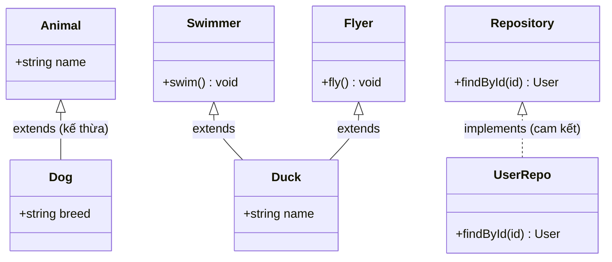
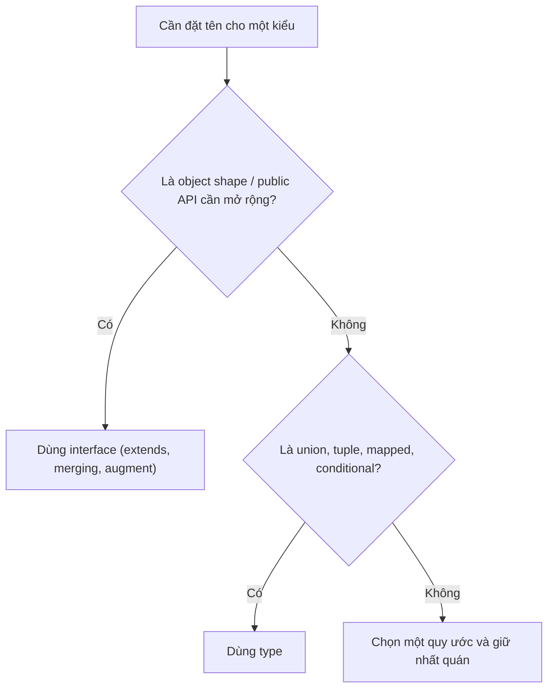

# Interfaces

**Interface** (bản mô tả hình dạng đối tượng) là cách bạn định nghĩa một đối tượng cần có những thuộc tính và phương thức nào, cùng kiểu của chúng. Nó hoạt động như một "hợp đồng": bất kỳ đối tượng nào tuân theo interface đều phải đáp ứng đúng cấu trúc đã khai báo. Interface giúp code rõ ràng, dễ tái sử dụng và có thể mở rộng (extends) khi cần.

---

:::note[Ghi nhớ nhanh]

- ⭐ **Interface đặt TÊN cho một hình dạng object để TÁI SỬ DỤNG** — như một "hợp đồng" chung, sửa một nơi áp dụng mọi nơi; class dùng `implements` để cam kết tuân theo.
- **`extends` để kế thừa (nhiều interface cùng lúc)** — khác `&` (intersection), `extends` phát hiện xung đột type ngay tại khai báo.
- ⭐ **Declaration merging: khai báo cùng tên nhiều lần được TS tự gộp** — `type` không có tính năng này; đây là kỹ thuật để augment `Window`, `express.Request`...
- **Hybrid types mô tả giá trị vừa là hàm vừa là object** — callable object, hay gặp khi typing thư viện kiểu jQuery/lodash.
- **`interface` cho object public API, `type` cho union/tuple/mapped/conditional** — interface còn compile nhanh hơn khi có nhiều intersection lồng nhau.

:::

---

## Mục lục

- [Vì sao có interface?](#vì-sao-có-interface)
- [Khai báo interface](#khai-báo-interface)
- [Extending interface](#extending-interface)
- [Declaration Merging](#declaration-merging)
- [Hybrid Types](#hybrid-types)
- [Type vs Interface](#type-vs-interface)
- [Câu hỏi phỏng vấn](#câu-hỏi-phỏng-vấn)

---

## Vì sao có interface?

**Vấn đề:** Khi định nghĩa hình dạng object **lặp lại bằng inline type** ở nhiều nơi, code bị trùng lặp; sửa một chỗ rất dễ quên chỗ khác.

```ts
// Lặp cùng một hình dạng ở nhiều nơi
function createUser(u: { id: number; name: string; email: string }) {}
function updateUser(u: { id: number; name: string; email: string }) {}
function renderUser(u: { id: number; name: string }) {} // quên email → sai lệch

// Thêm field "role"? Phải sửa thủ công từng nơi, sót là toang.
```

**Giải pháp:** `interface` đặt **TÊN** cho một hình dạng để **TÁI SỬ DỤNG**, mô tả một "hợp đồng" (contract) chung. Nó hỗ trợ `extends` (kế thừa), `implements` (class cam kết theo interface) và declaration merging. Sửa một nơi, áp dụng mọi nơi.

```ts
interface User {
  id: number;
  name: string;
  email: string;
}

function createUser(u: User) {}
function updateUser(u: User) {}
function renderUser(u: User) {}

// Class cam kết tuân theo contract qua implements
interface Repository {
  findById(id: number): User | null;
}

class UserRepo implements Repository {
  findById(id: number): User | null {
    return null;
  }
}
```

:::tip[Dùng thực tế]

- **Kiểu dùng lại nhiều nơi**: định nghĩa `User`, `Props`... một lần rồi import khắp dự án.
- **Contract giữa các module**: bên A mô tả interface, bên B tuân theo, không phụ thuộc cài đặt cụ thể.
- **Class implements interface**: nền tảng cho DI và repository pattern (đổi cài đặt mà không sửa nơi gọi).
- **Mở rộng kiểu thư viện**: augment `Window`, `express.Request`... qua declaration merging (xem mục dưới).

:::

---

## Khai báo interface

```ts
interface User {
  id: number;
  name: string;
  email?: string;        // optional
  readonly createdAt: Date; // không sửa được
}

const u: User = {
  id: 1,
  name: "An",
  createdAt: new Date(),
};
```

Interface chứa method:

```ts
interface Repository {
  findById(id: number): User | null;
  save(user: User): void;
}
```

Interface là index signature (dictionary):

```ts
interface StringDict {
  [key: string]: string;
}

const d: StringDict = { name: "An", city: "HN" };
```

---

## Extending interface

`extends` để kế thừa từ interface khác. Khác `&` (intersection), `extends`
phát hiện xung đột type ngay tại khai báo.

```ts
interface Animal {
  name: string;
}

interface Dog extends Animal {
  breed: string;
}

const d: Dog = { name: "Lulu", breed: "Husky" };
```

Một interface có thể `extends` **nhiều interface** cùng lúc:

```ts
interface Swimmer { swim(): void }
interface Flyer { fly(): void }

interface Duck extends Swimmer, Flyer {
  name: string;
}
```

Sơ đồ lớp dưới đây tóm tắt quan hệ: interface `extends` interface khác, và class `implements` interface (cam kết theo contract).



---

## Declaration Merging

Khai báo interface **cùng tên nhiều lần** — TS tự gộp.

```ts
interface User {
  id: number;
}

interface User {
  name: string;
}

// Tự động thành: { id: number; name: string }
const u: User = { id: 1, name: "An" };
```

`type` **không có** tính năng này — sẽ báo lỗi "Duplicate identifier".

:::info[Phân tích]

Declaration merging cực hữu dụng để **mở rộng type của thư viện bên ngoài**
(module augmentation):

```ts
// Mở rộng Window global
declare global {
  interface Window {
    myApp: { version: string };
  }
}

window.myApp = { version: "1.0" }; // TS hiểu
```

Hoặc augment module npm:

```ts
declare module "express" {
  interface Request {
    userId?: string;
  }
}
```

Đây là kỹ thuật **không thay thế được bằng `type`** — lý do chính nên
biết cả hai.

:::

---

## Hybrid Types

Interface mô tả giá trị **vừa là hàm vừa là object** (callable object).

```ts
interface Counter {
  (start: number): string;  // gọi như hàm
  interval: number;          // property
  reset(): void;             // method
}

function createCounter(): Counter {
  const fn = ((start: number) => `${start}`) as Counter;
  fn.interval = 100;
  fn.reset = () => {};
  return fn;
}

const c = createCounter();
c(5);
c.interval;
c.reset();
```

Pattern này hay gặp khi typing thư viện kiểu **jQuery**, **lodash chain**...

---

## Type vs Interface

| Tính năng | `interface` | `type` |
|-----------|-------------|--------|
| Object shape | OK | OK |
| Function type | OK (call sig) | OK |
| Union | **Không** | OK |
| Intersection | `extends` | `&` |
| Tuple | Khó | OK |
| Mapped type | Không | OK |
| Declaration merging | **Có** | Không |
| Module augmentation | **Có** | Không |

Sơ đồ sau gợi ý cách chọn nhanh giữa `interface` và `type`.



:::tip[Mẹo]

**Quy tắc gọn**:

- Dùng `interface` cho **object public API** (cần mở rộng, augment).
- Dùng `type` cho **mọi thứ khác** (union, tuple, mapped, conditional).
- Trong một codebase, hãy **chọn quy ước nhất quán** và áp dụng toàn dự án.

:::

:::warning[Cần lưu ý]

Hiệu năng compile: với type chứa **nhiều intersection lồng nhau**,
`interface` thường compile **nhanh hơn** `type` đáng kể, vì TS cache
shape của interface tốt hơn intersection của type. Trong codebase lớn
(monorepo > 100k LOC), khác biệt này có thể nhân lên hàng giây mỗi
build.

:::

---

## Câu hỏi phỏng vấn

Những câu thường gặp về chủ đề này. Tự trả lời trước, rồi đối chiếu lại với nội dung phía trên.

1. `Interface` là gì và vì sao gọi nó là một "hợp đồng"? Nêu vấn đề mà nó giải quyết so với viết inline type lặp lại.
2. Câu kinh điển: `interface` khác `type` ở những điểm nào? Kể ít nhất năm khác biệt cụ thể.
3. Tính năng nào của `interface` mà `type` hoàn toàn không có? Tính năng nào của `type` mà `interface` không có?
4. `Declaration merging` là gì? Cho ví dụ và giải thích vì sao khai báo trùng tên bằng `type` lại báo lỗi.
5. `Module augmentation` dùng để làm gì? Viết ví dụ mở rộng `Window` hoặc `express.Request`.
6. `Declaration merging` có rủi ro gì trong codebase lớn? Vì sao nhiều team lại thích `type` vì lý do này?
7. So sánh `extends` của interface với `&` (intersection) của type: khác nhau ra sao khi hai bên có property trùng tên nhưng khác kiểu?
8. Vì sao `interface` với `extends` thường compile nhanh hơn `type` với nhiều `&` lồng nhau?
9. Một interface có thể `extends` nhiều interface cùng lúc không? Còn `type` thì làm điều tương tự bằng cách nào?
10. `interface` có thể `extends` một `type alias` không? Điều kiện là gì?
11. `Optional property` (`email?: string`) và `readonly property` khác nhau thế nào? `readonly` có ngăn được mọi thay đổi không?
12. `Index signature` (`[key: string]: string`) là gì? Vì sao khi có index signature thì mọi property khác phải tương thích kiểu với nó?
13. Vì sao interface có index signature không gán được từ một `type` object thông thường trong một số trường hợp — liên quan gì tới `implicit index signature`?
14. `Hybrid type` là gì? Viết interface mô tả một giá trị vừa gọi được như hàm vừa có property.
15. `excess property check` hoạt động thế nào khi gán object literal cho biến kiểu interface? Vì sao gán qua biến trung gian lại không báo lỗi?
16. Class dùng `implements` interface thì compiler kiểm tra những gì? `implements` có làm class kế thừa code nào không?
17. Khi nào bạn bắt buộc phải dùng `type` thay vì `interface`? Kể các trường hợp union, tuple, mapped, conditional, template literal.
18. Interface có mô tả được `union type` không? Nếu cần một union của nhiều shape thì làm thế nào?
19. Quy ước chọn `interface` hay `type` trong team bạn là gì? Bạn bảo vệ lựa chọn đó bằng lập luận nào?
20. Đoán lỗi: hai file khác nhau cùng khai báo `interface User` ở phạm vi global với property trùng tên nhưng khác kiểu — chuyện gì xảy ra?
