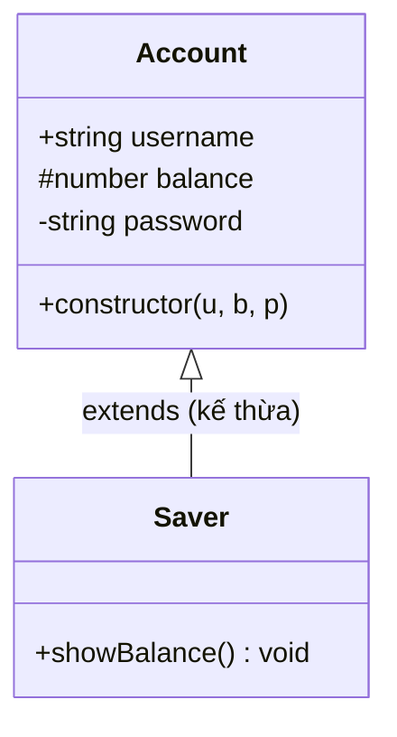
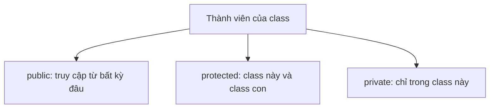

# Class cơ bản và Access Modifiers

**Class** (lớp — khuôn mẫu để tạo ra các đối tượng) cho phép bạn gom dữ liệu (thuộc tính) và hành vi (phương thức) vào cùng một nơi. **Access modifiers** (bộ điều chỉnh quyền truy cập) như `public`, `private`, `protected` quy định thành phần nào của class được truy cập từ bên ngoài và thành phần nào chỉ dùng nội bộ. Đây là nền tảng của lập trình hướng đối tượng trong TypeScript.

[](pathname:///img/typescript/class-co-ban.webp)

---

:::note[Ghi nhớ nhanh]

- ⭐ **Ba access modifier: `public` (mặc định), `protected` (class này + class con), `private` (chỉ class này)** — dùng để đóng gói và ẩn state nội bộ như `password`, `apiKey`.
- ⭐ **Parameter properties rút gọn constructor** — khai báo `constructor(public id: number, private password: string)` tự gán field, bớt code lặp.
- **`private` của TS là compile-time, `#field` là runtime** — cần private thực sự an toàn thì dùng `#field` (JS thuần không lách được).
- **`readonly` chỉ được gán trong constructor** — khoá `id`, `createdAt`, `apiUrl` để không bị sửa sau khi khởi tạo.
- **`static` thuộc về chính class, không phải instance** — dùng cho hằng số/factory/helper; tránh gom mọi util thành "god class".

:::

---

## Mục lục

- [Vì sao TypeScript bổ sung gì cho class?](#vì-sao-typescript-bổ-sung-gì-cho-class)
- [Khai báo class](#khai-báo-class)
- [Constructor và parameter properties](#constructor-và-parameter-properties)
- [Access modifiers](#access-modifiers)
- [readonly property](#readonly-property)
- [static member](#static-member)
- [Câu hỏi phỏng vấn](#câu-hỏi-phỏng-vấn)

---

## Vì sao TypeScript bổ sung gì cho class?

**Vấn đề:**

Class trong JS thuần không có cách **khai báo mức truy cập** rõ ràng — trước khi có `#private`, mọi thứ đều public và dễ bị sửa bậy từ bên ngoài. Cũng không kiểm tra kiểu thuộc tính, và phải viết constructor gán field thủ công khá dài dòng.

```ts
class User {
  constructor(id, name, password) {
    this.id = id;             // không khóa kiểu
    this.name = name;
    this.password = password; // ai cũng đọc/sửa được: u.password = "..."
  }
}
```

**Giải pháp:**

TypeScript thêm vào class: access modifier `public` / `private` / `protected`, `readonly`, parameter properties (gán field ngay trên tham số constructor), kiểu cho field/method, và `implements` interface. Kết quả là đóng gói (encapsulation) tốt hơn và an toàn kiểu.

```ts
interface HasId {
  id: number;
}

class User implements HasId {
  constructor(
    public readonly id: number,   // khóa kiểu + chỉ gán 1 lần
    public name: string,
    private password: string,     // không truy cập từ ngoài
  ) {}
}
```

Lưu ý: `private` của TS là **compile-time** (chỉ trình biên dịch chặn), khác `#field` chặn ở **runtime**.

:::tip[Dùng thực tế]

- **Service / model có field private**: ẩn `password`, `apiKey`, state nội bộ khỏi bên ngoài.
- **`readonly` cho id**: khóa `id`, `createdAt` để không bị sửa nhầm sau khi khởi tạo.
- **Parameter properties**: rút gọn constructor của DTO/entity nhiều field, bớt code lặp.
- **`implements` interface**: ép class tuân theo hợp đồng (vd `Repository`, `HasId`), dễ thay thế và mock khi test.

:::

---

## Khai báo class

```ts
class User {
  id: number;
  name: string;

  constructor(id: number, name: string) {
    this.id = id;
    this.name = name;
  }

  greet(): string {
    return `Hello ${this.name}`;
  }
}

const u = new User(1, "An");
```

---

## Constructor và parameter properties

TypeScript có **shortcut** — khai báo property ngay trong constructor:

```ts
class User {
  constructor(
    public id: number,
    public name: string,
    private password: string,
  ) {}
}
```

Tương đương:

```ts
class User {
  public id: number;
  public name: string;
  private password: string;

  constructor(id: number, name: string, password: string) {
    this.id = id;
    this.name = name;
    this.password = password;
  }
}
```

Tiết kiệm dòng đáng kể, đặc biệt khi class có nhiều property.

---

## Access modifiers

| Modifier | Truy cập được từ |
|----------|------------------|
| `public` (mặc định) | Bất kỳ đâu |
| `protected` | Class này và class con |
| `private` | Chỉ class này |

```ts
class Account {
  public username: string;
  protected balance: number;
  private password: string;

  constructor(u: string, b: number, p: string) {
    this.username = u;
    this.balance = b;
    this.password = p;
  }
}

class Saver extends Account {
  showBalance() {
    console.log(this.balance);  // OK — protected
    console.log(this.password); // Error — private
  }
}
```

Sơ đồ lớp dưới đây thể hiện các thành phần của class cùng mức truy cập: `+` public, `#` protected, `-` private.



Sơ đồ sau tóm tắt phạm vi truy cập của từng access modifier.



:::info[Phân tích]

TS có **hai cách** đánh dấu private:

| | `private` (TS) | `#field` (JS) |
|--|--|--|
| Áp dụng từ | TS 1.0 | ECMAScript 2022 |
| Kiểm tra ở | Compile-time | **Runtime** |
| Truy cập từ JS thuần | **Vẫn được** | **Không** (TypeError) |
| Tương thích với `[]` | Vẫn truy cập được | Không |

```ts
class A {
  private a = 1;
  #b = 2;
}

const x = new A() as any;
x.a;     // 1 (TS private bị "lách")
x["a"];  // 1
x["#b"]; // undefined — true private
```

→ Khi cần private **thực sự an toàn** (security, lib API), dùng `#field`.
Còn private cho code app thì `private` TS đủ tốt và dễ debug hơn.

:::

---

## readonly property

`readonly` — chỉ được gán trong constructor, không sửa sau đó.

```ts
class Config {
  constructor(public readonly apiUrl: string) {}
}

const c = new Config("/api");
c.apiUrl = "/other"; // Error
```

Kết hợp với `private`:

```ts
class User {
  constructor(
    private readonly _id: number,
    public name: string,
  ) {}

  get id(): number { return this._id; }
}
```

---

## static member

`static` thuộc về **chính class**, không phải instance.

```ts
class MathUtils {
  static PI = 3.14159;

  static double(n: number): number {
    return n * 2;
  }
}

MathUtils.PI;        // 3.14159
MathUtils.double(5); // 10
```

Static block (TS 4.4+) — chạy khi class được load:

```ts
class App {
  static config: Record<string, string>;

  static {
    App.config = loadConfig();
  }
}
```

:::tip[Mẹo]

**Khi nào dùng static thay vì hàm thường?**

- Khi method **liên quan trực tiếp** đến class (factory, helper, hằng số).
- Khi cần **gom logic** thành namespace (vd `Math.*`, `Array.from`).

Không nên dùng static để gom **mọi util** — sẽ thành "god class". Module
file riêng (`utils/math.ts`) thường gọn hơn.

:::

---

## Câu hỏi phỏng vấn

Những câu thường gặp về chủ đề này. Tự trả lời trước, rồi bấm **Xem đáp án** để đối chiếu.

**1. TypeScript bổ sung những gì cho `class` so với class của JavaScript thuần? Kể ít nhất bốn thứ.**

<details className="qa">
<summary>Xem đáp án</summary>

Class là tính năng của chính JavaScript; TypeScript phủ thêm một lớp kiểu và đóng gói lên trên:

- **Access modifier** `public` / `protected` / `private` — JS thuần trước ES2022 không có cách khai báo mức truy cập, mọi thứ đều public.
- **`readonly`** — khóa property chỉ được gán trong constructor.
- **Parameter properties** — khai báo và gán field ngay trên tham số constructor, bớt code lặp.
- **Kiểu cho field, tham số, giá trị trả về** của method; `strictPropertyInitialization` bắt buộc field phải được khởi tạo.
- **`implements` interface** — ép class tuân theo hợp đồng, dễ thay thế và mock khi test.
- **`abstract` class/method**, generic class, overload chữ ký method.

Điểm cần nhớ: hầu hết những thứ trên **chỉ tồn tại lúc compile**, biến mất khi ra JS. Riêng parameter properties có sinh code thật (dòng gán trong constructor).

</details>

**2. `Parameter properties` (khai báo `public`/`private` ngay trong constructor) hoạt động ra sao? Nó biên dịch ra JS thế nào?**

<details className="qa">
<summary>Xem đáp án</summary>

Khi một tham số constructor có access modifier (hoặc `readonly`), TS hiểu đó vừa là tham số vừa là **property của class**, và tự sinh lệnh gán:

```ts
class User {
  constructor(
    public id: number,
    public name: string,
    private password: string,
  ) {}
}
```

Tương đương với cách viết dài:

```ts
class User {
  public id: number;
  private password: string;
  constructor(id: number, name: string, password: string) {
    this.id = id;
    this.password = password;
  }
}
```

JS đầu ra chỉ còn các dòng `this.id = id;` — modifier bị xóa sạch. Vài lưu ý:

- Phải có **modifier** mới thành property; viết `constructor(id: number)` trơn thì `id` chỉ là tham số thường.
- Trong class con, các dòng gán này được chèn **sau `super()`**.
- Rất hợp với DTO/entity nhiều field và với dependency injection (NestJS, Angular).

</details>

**3. Kể ba `access modifier` và phạm vi truy cập của từng cái. Mặc định là gì khi không viết modifier?**

<details className="qa">
<summary>Xem đáp án</summary>

| Modifier | Truy cập được từ |
|---|---|
| `public` | Bất kỳ đâu — bên ngoài, class con, chính class |
| `protected` | Chính class và **class con** (không truy cập từ bên ngoài) |
| `private` | **Chỉ trong class khai báo nó** |

```ts
class Account {
  public username: string = "";
  protected balance: number = 0;
  private password: string = "";
}

class Saver extends Account {
  showBalance() {
    console.log(this.balance);  // OK — protected
    console.log(this.password); // Error — private
  }
}
```

Không viết gì thì mặc định là **`public`**. Nhiều team vẫn khuyến khích viết `public` tường minh cho method public để đọc code nhất quán, nhưng đó chỉ là quy ước. Lưu ý cả ba chỉ được kiểm tra **lúc compile**; ở JS đầu ra chúng biến mất hoàn toàn.

</details>

**4. `private` của TypeScript được kiểm tra ở thời điểm nào? Từ JavaScript thuần có truy cập được không?**

<details className="qa">
<summary>Xem đáp án</summary>

`private` của TS được kiểm tra **hoàn toàn lúc compile-time**. Nó là một quy ước do compiler ép buộc, không phải một rào chắn thật sự. Khi transpile ra JS, từ khóa `private` bị xóa và property trở thành property thường:

```ts
class A {
  private a = 1;
}

const x = new A() as any;
x.a;      // 1 — vẫn đọc được, TS private bị "lách"
x["a"];   // 1 — truy cập qua index signature cũng được
```

Từ JavaScript thuần (hoặc từ TS sau khi `as any`, hoặc từ JSON serialize như `JSON.stringify`) thì **truy cập bình thường** — vì trong bộ nhớ nó chỉ là một field công khai. Vì thế đừng dựa vào `private` của TS để bảo vệ dữ liệu nhạy cảm khỏi code chạy cùng tiến trình; nó chỉ giúp đóng gói và chống lỡ tay trong lúc phát triển.

</details>

**5. So sánh `private` (TS) với `#field` (ECMAScript): khác nhau về thời điểm kiểm tra, khả năng lách, và khả năng debug.**

<details className="qa">
<summary>Xem đáp án</summary>

| | `private` (TS) | `#field` (JS, ES2022) |
|---|---|---|
| Có từ | TypeScript 1.0 | ECMAScript 2022 |
| Kiểm tra ở | Compile-time | **Runtime** |
| Truy cập từ JS thuần | **Vẫn được** | Không — `SyntaxError`/`TypeError` |
| Truy cập qua `obj["x"]` | Được | Không (`x["#b"]` cho `undefined`) |
| Có trong `JSON.stringify` / `Object.keys` | Có | Không |
| Debug, inspect | Dễ — hiện như field thường | Khó hơn, devtools hiển thị riêng |

```ts
class A {
  private a = 1;
  #b = 2;
}
const x = new A() as any;
x.a;     // 1
x["#b"]; // undefined — true private
```

Ngoài ra `#field` còn ảnh hưởng tới **so sánh kiểu**: hai class có `#field` không bao giờ tương thích chéo. Đổi lại, `#field` sinh ra code kiểm tra lúc runtime nên tốn chút hiệu năng và khó proxy/mock hơn.

</details>

**6. Khi nào bạn chọn `#field` thay vì `private`? Nêu tình huống bảo mật cụ thể.**

<details className="qa">
<summary>Xem đáp án</summary>

Chọn `#field` khi bạn cần **bảo đảm thật sự lúc runtime**, chứ không chỉ là quy ước cho đội phát triển:

- **Viết thư viện / SDK công khai**: người dùng là JS thuần, không có compiler chặn giúp. `private` của TS khi đó vô nghĩa — họ vẫn `obj.internalState = ...` được và bạn mất quyền refactor nội bộ.
- **Giữ secret nhạy cảm**: `#apiSecret`, `#refreshToken`, khóa ký. Với `private` thường, secret lộ ngay khi ai đó `JSON.stringify(client)` hoặc log object ra console/Sentry; với `#field` thì nó không xuất hiện trong `Object.keys`, spread hay JSON.
- **Chạy chung với code bên thứ ba** (plugin, widget nhúng, extension): code lạ có thể đọc/ghi property thường.

Với code ứng dụng nội bộ, toàn bộ codebase đều là TS và được compile, thì `private` của TS đủ tốt — dễ debug, dễ test, không tốn chi phí runtime.

</details>

**7. `protected` khác `private` ở đâu? Đoán lỗi: class con truy cập property `private` của cha — compiler nói gì?**

<details className="qa">
<summary>Xem đáp án</summary>

Khác biệt duy nhất nằm ở **class con**: `protected` cho phép class kế thừa dùng, `private` thì không — chỉ đúng class khai báo mới dùng được. Cả hai đều chặn truy cập từ bên ngoài.

```ts
class Account {
  protected balance = 0;
  private password = "";
}

class Saver extends Account {
  showBalance() {
    console.log(this.balance);  // OK
    console.log(this.password); // Error
  }
}
```

Compiler báo đại ý: `Property 'password' is private and only accessible within class 'Account'.`

Mẹo chọn: `private` là mặc định an toàn — hãy bắt đầu bằng `private`, chỉ nới lên `protected` khi thực sự có class con cần dùng. Nới sẵn `protected` khắp nơi khiến bạn khó sửa nội bộ về sau, vì mọi class con đã phụ thuộc vào chi tiết cài đặt đó.

</details>

**8. Constructor có thể là `private` hoặc `protected` không? Pattern nào tận dụng điều đó?**

<details className="qa">
<summary>Xem đáp án</summary>

Có. `private constructor` chặn `new` từ bên ngoài **và** chặn cả việc kế thừa; `protected constructor` chỉ cho class con gọi qua `super()`.

**Singleton** (mỗi chương trình chỉ có một instance):

```ts
class Logger {
  private static instance: Logger;
  private constructor() {}

  static getInstance(): Logger {
    if (!Logger.instance) Logger.instance = new Logger();
    return Logger.instance;
  }
}

new Logger();            // Error: constructor is private
Logger.getInstance();    // cách duy nhất
```

**Static factory** — buộc tạo object qua hàm có kiểm tra/đặt tên rõ nghĩa:

```ts
class Email {
  private constructor(public readonly value: string) {}
  static create(raw: string): Email | null {
    return raw.includes("@") ? new Email(raw) : null;
  }
}
```

`protected constructor` thì dùng cho **base class chỉ để kế thừa** — gần giống `abstract class` nhưng vẫn có thân cài đặt đầy đủ.

</details>

**9. `readonly` là access modifier hay modifier khác loại? Nó cho phép gán ở những chỗ nào?**

<details className="qa">
<summary>Xem đáp án</summary>

`readonly` **không phải** access modifier — nó kiểm soát **quyền ghi**, còn `public`/`protected`/`private` kiểm soát **phạm vi nhìn thấy**. Hai nhóm độc lập nên kết hợp được: `private readonly`, `public readonly`...

`readonly` chỉ cho phép gán ở hai chỗ, và phải nằm **trong chính class khai báo nó**:

1. Tại chỗ khai báo field (initializer).
2. Bên trong `constructor`.

```ts
class Config {
  readonly createdAt = new Date();       // 1. initializer
  constructor(public readonly apiUrl: string) {} // 2. parameter property

  reset() {
    this.apiUrl = "/other"; // Error: cannot assign to a read-only property
  }
}

const c = new Config("/api");
c.apiUrl = "/other"; // Error
```

Lưu ý: gán trong method khác (kể cả method của chính class) là lỗi, và class con cũng không gán lại được `readonly` của cha. Giống mọi thứ khác của TS, `readonly` chỉ tồn tại lúc compile.

</details>

**10. `readonly` có tạo ra `deep immutability` không? Nếu property là mảng thì còn push được không, vì sao?**

<details className="qa">
<summary>Xem đáp án</summary>

Không — `readonly` chỉ **nông (shallow)**. Nó cấm gán lại *chính property đó*, chứ không cấm thay đổi nội dung bên trong giá trị mà property trỏ tới:

```ts
class Cart {
  constructor(public readonly items: string[]) {}
}

const c = new Cart(["a"]);
c.items = [];         // Error — gán lại property
c.items.push("b");    // OK! — mảng vẫn mutate được
c.items.length = 0;   // OK
```

Lý do: với kiểu tham chiếu, property chỉ giữ **địa chỉ** của mảng. `readonly` khóa cái địa chỉ đó, còn `push` không đổi địa chỉ mà đổi nội dung.

Muốn chặt hơn, dùng thêm:

- `readonly string[]` (hoặc `ReadonlyArray<string>`) — bỏ luôn `push`, `pop`, `splice` khỏi kiểu.
- `ReadonlyMap`, `ReadonlySet`, hoặc một kiểu `DeepReadonly<T>` tự viết.
- `Object.freeze` nếu cần chặn thật sự lúc runtime — vì mọi `readonly` đều biến mất khi ra JS.

</details>

**11. Kết hợp `private readonly _id` với `getter` mang lại lợi ích gì so với để `public readonly`?**

<details className="qa">
<summary>Xem đáp án</summary>

```ts
class User {
  constructor(
    private readonly _id: number,
    public name: string,
  ) {}

  get id(): number { return this._id; }
}
```

So với `public readonly id`, cách này cho bạn:

- **Toàn quyền kiểm soát cách đọc**: về sau muốn format, tính toán lazy, ghi log truy cập hay trả về bản sao phòng thủ (defensive copy cho object/mảng) đều làm được mà **không đổi API** — nơi gọi vẫn viết `u.id`.
- **Bảo vệ chắc hơn**: `public readonly` chỉ chặn lúc compile; ai đó `(u as any).id = 9` là sửa được. Với `_id` private và chỉ có getter, ít nhất API công khai không có đường ghi. Đổi `_id` thành `#id` thì thành bất khả xâm phạm ở runtime.
- **Che tên nội bộ**: đổi tên/đổi cách lưu `_id` không ảnh hưởng người dùng class.

Đánh đổi: nhiều code hơn, thêm một lớp gián tiếp. Với DTO/value object đơn giản, `public readonly` vẫn là lựa chọn gọn và đủ dùng.

</details>

**12. `static member` thuộc về ai? Trong method `static`, `this` trỏ tới cái gì?**

<details className="qa">
<summary>Xem đáp án</summary>

`static` member thuộc về **chính class** (đối tượng constructor), không phải instance. Vì vậy gọi qua tên class, không qua object:

```ts
class MathUtils {
  static PI = 3.14159;
  static double(n: number): number { return n * 2; }
}

MathUtils.PI;        // 3.14159
MathUtils.double(5); // 10
new MathUtils().double(5); // Error — không có trên instance
```

Trong method `static`, `this` trỏ tới **chính class đó** (constructor function), nên `this.PI` chính là `MathUtils.PI`. Điều thú vị là với kế thừa, `this` tuân theo cách gọi:

```ts
class Base {
  static create() { return new this(); } // this = class được gọi
}
class Child extends Base {}

Child.create(); // trả về instance của Child, không phải Base
```

Đây gọi là **polymorphic `this`** ở tầng static — nền tảng cho static factory kế thừa được. Lưu ý static member cũng nhận access modifier (`private static instance`) và `readonly`.

</details>

**13. `static block` dùng để làm gì và chạy vào lúc nào trong vòng đời của class?**

<details className="qa">
<summary>Xem đáp án</summary>

`static {}` (TS 4.4+, ES2022) là khối khởi tạo cho **state ở cấp class**, dùng khi việc khởi tạo cần nhiều dòng, cần `try/catch`, cần vòng lặp — những thứ không nhét vừa một initializer đơn giản:

```ts
class App {
  static config: Record<string, string>;

  static {
    App.config = loadConfig();
  }
}
```

Thời điểm chạy: **một lần duy nhất, ngay khi class được định nghĩa (lúc module chứa nó được load)** — trước bất kỳ instance nào được tạo và trước mọi lần dùng class. Các `static` field initializer và static block chạy **theo thứ tự xuất hiện** trong thân class.

Trong static block, `this` trỏ tới chính class, và nó truy cập được cả `private`/`#field` static của class — nên còn dùng để cho phép code ngoài class đọc private member một cách có kiểm soát. Lưu ý: nếu block ném lỗi, class coi như khởi tạo thất bại.

</details>

**14. Khi nào nên dùng `static` và khi nào nên tách thành module hàm thường? Rủi ro "god class" là gì?**

<details className="qa">
<summary>Xem đáp án</summary>

**Dùng `static` khi:**

- Method **gắn chặt về ngữ nghĩa** với class: factory (`User.fromJSON`), hằng số của domain (`Circle.MAX_RADIUS`), so sánh/validate của chính kiểu đó.
- Cần đụng tới `private`/`#field` static của class.
- Muốn gom thành namespace có ý nghĩa như `Math.*`, `Array.from`.

**Dùng module hàm thường khi:** đó là util chung chung, không thuộc về thực thể nào — `utils/math.ts` export `sum`, `clamp`. Cách này còn có ưu thế lớn: **tree-shaking** loại bỏ hàm không dùng, còn static method trong một class thì thường bị giữ lại cả cụm.

**Rủi ro "god class"**: gom mọi util vào một class static khiến file phình ra hàng trăm dòng, trách nhiệm lẫn lộn, khó test (không mock được từng phần), khó tách nhỏ và mọi nơi import đều kéo theo toàn bộ. Class khi đó chỉ đóng vai một cái "túi đựng hàm" — không có state, không có instance, tức là dùng sai công cụ.

</details>

**15. `getter` và `setter` trong class TS được định kiểu ra sao? Kiểu của getter và setter có bắt buộc giống nhau không?**

<details className="qa">
<summary>Xem đáp án</summary>

Getter khai báo **kiểu trả về**, setter khai báo **kiểu tham số**; setter không được có kiểu trả về (phải là `void`):

```ts
class Temp {
  private _c = 0;

  get celsius(): number { return this._c; }
  set celsius(v: number) { this._c = v; }
}
```

Từ TS 4.3 trở đi, **kiểu đọc và kiểu ghi được phép khác nhau**, miễn kiểu của getter **gán được** cho kiểu tham số của setter:

```ts
class Box {
  private _size = 0;
  get size(): number { return this._size; }
  set size(v: number | string) {        // nhận rộng, trả về hẹp
    this._size = typeof v === "string" ? Number(v) : v;
  }
}
```

Vài lưu ý: chỉ có getter mà không có setter thì property được coi là `readonly`; getter/setter được sinh ra bằng `Object.defineProperty` trên prototype nên không hiện trong `Object.keys` của instance; và nên tránh đặt logic nặng hay side effect trong getter vì người đọc code mong nó rẻ như đọc field.

</details>

**16. Class trong TypeScript vừa là giá trị vừa là kiểu — điều đó nghĩa là gì? Cho ví dụ dùng tên class ở vị trí kiểu.**

<details className="qa">
<summary>Xem đáp án</summary>

Khai báo một class tạo ra **hai thứ cùng tên** ở hai không gian khác nhau:

- Trong **value space**: một giá trị (constructor function) — thứ bạn `new`, truyền đi, gán biến.
- Trong **type space**: một kiểu mô tả **instance** của class đó.

```ts
class User {
  constructor(public id: number) {}
}

const u: User = new User(1);  // "User" bên trái là KIỂU (instance),
                              // "User" bên phải là GIÁ TRỊ (constructor)

function greet(user: User) {} // kiểu instance
```

Muốn nói tới kiểu của **chính constructor** thì dùng `typeof User`:

```ts
function createAny(Ctor: typeof User): User {
  return new Ctor(1);
}

// Hoặc mô tả tổng quát bằng construct signature:
type Ctor<T> = new (...args: any[]) => T;
```

Hai tiện ích liên quan: `InstanceType<typeof User>` lấy kiểu instance, `ConstructorParameters<typeof User>` lấy tuple tham số constructor. Ngược lại, `interface` và `type` chỉ tồn tại ở type space — không dùng được ở vị trí giá trị.

</details>

**17. `strictPropertyInitialization` là gì? Ba cách hợp lệ để xử lý property chưa được gán trong constructor.**

<details className="qa">
<summary>Xem đáp án</summary>

`strictPropertyInitialization` (bật kèm `strict`, yêu cầu `strictNullChecks`) buộc mọi property khai báo phải **chắc chắn có giá trị** khi constructor chạy xong — nếu không, TS báo `Property 'x' has no initializer and is not definitely assigned in the constructor`.

Ba cách xử lý hợp lệ:

```ts
class A {
  // 1. Gán tại chỗ khai báo hoặc trong constructor
  name: string = "";
  id: number;
  constructor(id: number) { this.id = id; }

  // 2. Đánh dấu optional — kiểu thành string | undefined
  nickname?: string;

  // 3. Definite assignment assertion — "tôi cam đoan sẽ có"
  ref!: HTMLElement;
}
```

Cách 3 (`!`) dùng khi giá trị được gán bởi cơ chế bên ngoài constructor: DI framework, `ngOnInit`, ORM khi hydrate từ DB, hoặc một hàm `init()` riêng. Nhưng nó **tắt kiểm tra**, nên nếu quên gán thật thì lỗi chỉ lộ lúc runtime — ưu tiên cách 1 và 2 bất cứ khi nào có thể.

</details>

**18. Hai class có cùng shape nhưng khác tên có gán cho nhau được không? Giải thích theo `structural typing` và ngoại lệ khi có thành viên `private`.**

<details className="qa">
<summary>Xem đáp án</summary>

Mặc định là **được**, vì TS dùng **structural typing** — chỉ so sánh hình dạng, không so tên:

```ts
class Point { constructor(public x: number, public y: number) {} }
class Coord { constructor(public x: number, public y: number) {} }

const p: Point = new Coord(1, 2); // OK — cùng shape
```

**Ngoại lệ**: khi class có member `private` hoặc `protected`, TS chuyển sang kiểu so sánh **nominal** — hai kiểu chỉ tương thích nếu member đó **bắt nguồn từ cùng một khai báo**:

```ts
class A { private secret = 1 }
class B { private secret = 1 }

const a: A = new B();
// Error: Types have separate declarations of a private property 'secret'.
```

Nghĩa là dù trông giống hệt, `A` và `B` vẫn không thay thế được cho nhau; chỉ `A` và class kế thừa `A` mới tương thích (vì `secret` cùng một nguồn khai báo). `#field` cũng gây hiệu ứng tương tự. Đây là mẹo phổ biến để tạo **branded type** — ép TS phân biệt hai kiểu có cùng cấu trúc.

</details>
