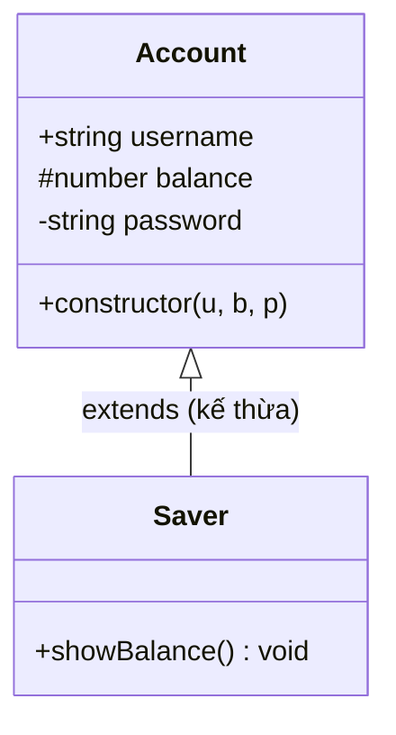
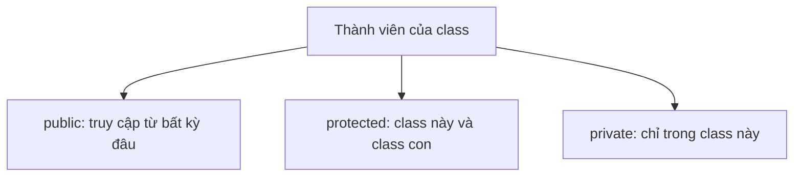

# Class cơ bản và Access Modifiers

**Class** (lớp — khuôn mẫu để tạo ra các đối tượng) cho phép bạn gom dữ liệu (thuộc tính) và hành vi (phương thức) vào cùng một nơi. **Access modifiers** (bộ điều chỉnh quyền truy cập) như `public`, `private`, `protected` quy định thành phần nào của class được truy cập từ bên ngoài và thành phần nào chỉ dùng nội bộ. Đây là nền tảng của lập trình hướng đối tượng trong TypeScript.

---

:::note[Ghi nhớ nhanh]

- ⭐ **Ba access modifier: `public` (mặc định), `protected` (class này + class con), `private` (chỉ class này)** — dùng để đóng gói và ẩn state nội bộ như `password`, `apiKey`.
- ⭐ **Parameter properties rút gọn constructor** — khai báo `constructor(public id: number, private password: string)` tự gán field, bớt code lặp.
- **`private` của TS là compile-time, `#field` là runtime** — cần private thực sự an toàn thì dùng `#field` (JS thuần không lách được).
- **`readonly` chỉ được gán trong constructor** — khoá `id`, `createdAt`, `apiUrl` để không bị sửa sau khi khởi tạo.
- **`static` thuộc về chính class, không phải instance** — dùng cho hằng số/factory/helper; tránh gom mọi util thành "god class".

:::

---

## Mục lục

- [Vì sao TypeScript bổ sung gì cho class?](#vì-sao-typescript-bổ-sung-gì-cho-class)
- [Khai báo class](#khai-báo-class)
- [Constructor và parameter properties](#constructor-và-parameter-properties)
- [Access modifiers](#access-modifiers)
- [readonly property](#readonly-property)
- [static member](#static-member)
- [Câu hỏi phỏng vấn](#câu-hỏi-phỏng-vấn)

---

## Vì sao TypeScript bổ sung gì cho class?

**Vấn đề:**

Class trong JS thuần không có cách **khai báo mức truy cập** rõ ràng — trước khi có `#private`, mọi thứ đều public và dễ bị sửa bậy từ bên ngoài. Cũng không kiểm tra kiểu thuộc tính, và phải viết constructor gán field thủ công khá dài dòng.

```ts
class User {
  constructor(id, name, password) {
    this.id = id;             // không khóa kiểu
    this.name = name;
    this.password = password; // ai cũng đọc/sửa được: u.password = "..."
  }
}
```

**Giải pháp:**

TypeScript thêm vào class: access modifier `public` / `private` / `protected`, `readonly`, parameter properties (gán field ngay trên tham số constructor), kiểu cho field/method, và `implements` interface. Kết quả là đóng gói (encapsulation) tốt hơn và an toàn kiểu.

```ts
interface HasId {
  id: number;
}

class User implements HasId {
  constructor(
    public readonly id: number,   // khóa kiểu + chỉ gán 1 lần
    public name: string,
    private password: string,     // không truy cập từ ngoài
  ) {}
}
```

Lưu ý: `private` của TS là **compile-time** (chỉ trình biên dịch chặn), khác `#field` chặn ở **runtime**.

:::tip[Dùng thực tế]

- **Service / model có field private**: ẩn `password`, `apiKey`, state nội bộ khỏi bên ngoài.
- **`readonly` cho id**: khóa `id`, `createdAt` để không bị sửa nhầm sau khi khởi tạo.
- **Parameter properties**: rút gọn constructor của DTO/entity nhiều field, bớt code lặp.
- **`implements` interface**: ép class tuân theo hợp đồng (vd `Repository`, `HasId`), dễ thay thế và mock khi test.

:::

---

## Khai báo class

```ts
class User {
  id: number;
  name: string;

  constructor(id: number, name: string) {
    this.id = id;
    this.name = name;
  }

  greet(): string {
    return `Hello ${this.name}`;
  }
}

const u = new User(1, "An");
```

---

## Constructor và parameter properties

TypeScript có **shortcut** — khai báo property ngay trong constructor:

```ts
class User {
  constructor(
    public id: number,
    public name: string,
    private password: string,
  ) {}
}
```

Tương đương:

```ts
class User {
  public id: number;
  public name: string;
  private password: string;

  constructor(id: number, name: string, password: string) {
    this.id = id;
    this.name = name;
    this.password = password;
  }
}
```

Tiết kiệm dòng đáng kể, đặc biệt khi class có nhiều property.

---

## Access modifiers

| Modifier | Truy cập được từ |
|----------|------------------|
| `public` (mặc định) | Bất kỳ đâu |
| `protected` | Class này và class con |
| `private` | Chỉ class này |

```ts
class Account {
  public username: string;
  protected balance: number;
  private password: string;

  constructor(u: string, b: number, p: string) {
    this.username = u;
    this.balance = b;
    this.password = p;
  }
}

class Saver extends Account {
  showBalance() {
    console.log(this.balance);  // OK — protected
    console.log(this.password); // Error — private
  }
}
```

Sơ đồ lớp dưới đây thể hiện các thành phần của class cùng mức truy cập: `+` public, `#` protected, `-` private.



Sơ đồ sau tóm tắt phạm vi truy cập của từng access modifier.



:::info[Phân tích]

TS có **hai cách** đánh dấu private:

| | `private` (TS) | `#field` (JS) |
|--|--|--|
| Áp dụng từ | TS 1.0 | ECMAScript 2022 |
| Kiểm tra ở | Compile-time | **Runtime** |
| Truy cập từ JS thuần | **Vẫn được** | **Không** (TypeError) |
| Tương thích với `[]` | Vẫn truy cập được | Không |

```ts
class A {
  private a = 1;
  #b = 2;
}

const x = new A() as any;
x.a;     // 1 (TS private bị "lách")
x["a"];  // 1
x["#b"]; // undefined — true private
```

→ Khi cần private **thực sự an toàn** (security, lib API), dùng `#field`.
Còn private cho code app thì `private` TS đủ tốt và dễ debug hơn.

:::

---

## readonly property

`readonly` — chỉ được gán trong constructor, không sửa sau đó.

```ts
class Config {
  constructor(public readonly apiUrl: string) {}
}

const c = new Config("/api");
c.apiUrl = "/other"; // Error
```

Kết hợp với `private`:

```ts
class User {
  constructor(
    private readonly _id: number,
    public name: string,
  ) {}

  get id(): number { return this._id; }
}
```

---

## static member

`static` thuộc về **chính class**, không phải instance.

```ts
class MathUtils {
  static PI = 3.14159;

  static double(n: number): number {
    return n * 2;
  }
}

MathUtils.PI;        // 3.14159
MathUtils.double(5); // 10
```

Static block (TS 4.4+) — chạy khi class được load:

```ts
class App {
  static config: Record<string, string>;

  static {
    App.config = loadConfig();
  }
}
```

:::tip[Mẹo]

**Khi nào dùng static thay vì hàm thường?**

- Khi method **liên quan trực tiếp** đến class (factory, helper, hằng số).
- Khi cần **gom logic** thành namespace (vd `Math.*`, `Array.from`).

Không nên dùng static để gom **mọi util** — sẽ thành "god class". Module
file riêng (`utils/math.ts`) thường gọn hơn.

:::

---

## Câu hỏi phỏng vấn

Những câu thường gặp về chủ đề này. Tự trả lời trước, rồi đối chiếu lại với nội dung phía trên.

1. TypeScript bổ sung những gì cho `class` so với class của JavaScript thuần? Kể ít nhất bốn thứ.
2. `Parameter properties` (khai báo `public`/`private` ngay trong constructor) hoạt động ra sao? Nó biên dịch ra JS thế nào?
3. Kể ba `access modifier` và phạm vi truy cập của từng cái. Mặc định là gì khi không viết modifier?
4. `private` của TypeScript được kiểm tra ở thời điểm nào? Từ JavaScript thuần có truy cập được không?
5. So sánh `private` (TS) với `#field` (ECMAScript): khác nhau về thời điểm kiểm tra, khả năng lách, và khả năng debug.
6. Khi nào bạn chọn `#field` thay vì `private`? Nêu tình huống bảo mật cụ thể.
7. `protected` khác `private` ở đâu? Đoán lỗi: class con truy cập property `private` của cha — compiler nói gì?
8. Constructor có thể là `private` hoặc `protected` không? Pattern nào tận dụng điều đó?
9. `readonly` là access modifier hay modifier khác loại? Nó cho phép gán ở những chỗ nào?
10. `readonly` có tạo ra `deep immutability` không? Nếu property là mảng thì còn push được không, vì sao?
11. Kết hợp `private readonly _id` với `getter` mang lại lợi ích gì so với để `public readonly`?
12. `static member` thuộc về ai? Trong method `static`, `this` trỏ tới cái gì?
13. `static block` dùng để làm gì và chạy vào lúc nào trong vòng đời của class?
14. Khi nào nên dùng `static` và khi nào nên tách thành module hàm thường? Rủi ro "god class" là gì?
15. `getter` và `setter` trong class TS được định kiểu ra sao? Kiểu của getter và setter có bắt buộc giống nhau không?
16. Class trong TypeScript vừa là giá trị vừa là kiểu — điều đó nghĩa là gì? Cho ví dụ dùng tên class ở vị trí kiểu.
17. `strictPropertyInitialization` là gì? Ba cách hợp lệ để xử lý property chưa được gán trong constructor.
18. Hai class có cùng shape nhưng khác tên có gán cho nhau được không? Giải thích theo `structural typing` và ngoại lệ khi có thành viên `private`.
