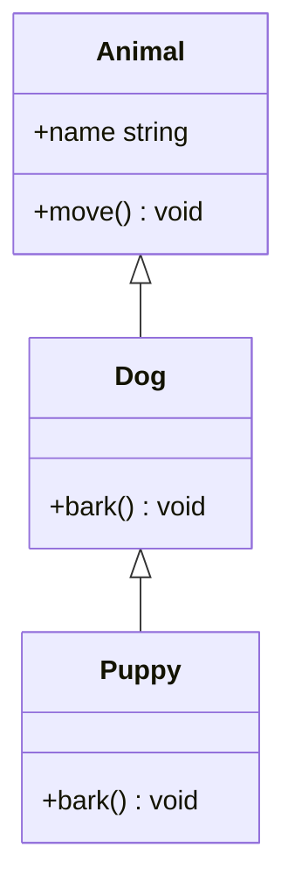
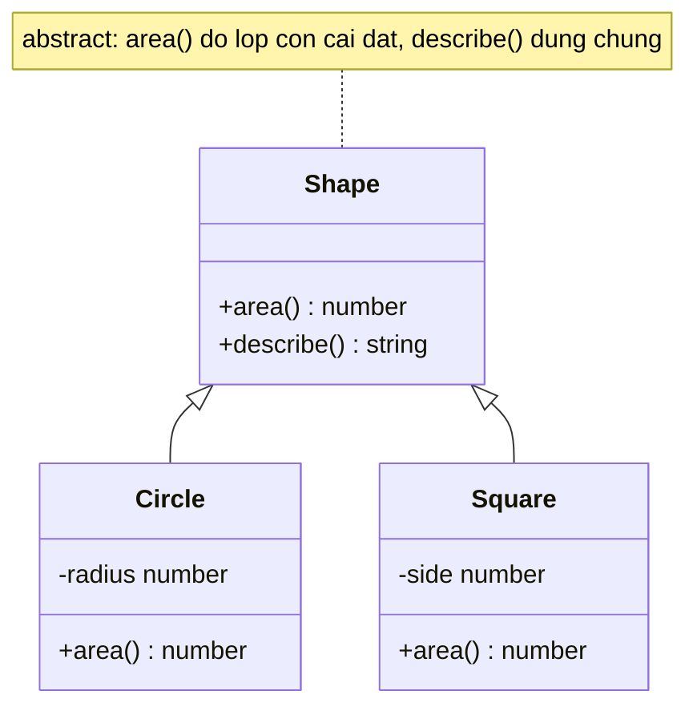

# Abstract Classes và Inheritance

**Inheritance** (kế thừa) cho phép một class con tái sử dụng và mở rộng thuộc tính, phương thức từ một class cha. **Abstract class** (lớp trừu tượng) là class chỉ dùng làm khuôn mẫu chung, không thể tạo đối tượng trực tiếp mà phải được class con kế thừa và hoàn thiện. Hai khái niệm này giúp bạn chia sẻ code chung và xây dựng hệ thống class có cấu trúc rõ ràng.

[](pathname:///img/typescript/abstract-inheritance.webp)

---

:::note[Ghi nhớ nhanh]

- ⭐ **Abstract class không thể `new` trực tiếp và ép lớp con implement abstract method** — compiler báo lỗi ngay lúc compile nếu lớp con thiếu, đồng thời vẫn chia sẻ được code chung.
- **`extends` để kế thừa, `super` để gọi lên class cha** — lớp con tái sử dụng và mở rộng field/method; bắt buộc gọi `super()` nếu cha có constructor.
- **Polymorphism qua dynamic dispatch** — gọi cùng một method (`s.area()`) nhưng runtime tự chọn đúng version theo class thực của object.
- ⭐ **Abstract class chứa code + tồn tại runtime, interface chỉ là shape bị xoá** — dùng abstract class khi cần chia sẻ code và bắt subclass tuân contract; interface khi chỉ cần contract (và implement được nhiều cái cùng lúc).

:::

---

## Mục lục

- [Vì sao có abstract class?](#vì-sao-có-abstract-class)
- [Inheritance (kế thừa)](#inheritance-kế-thừa)
- [Abstract Class](#abstract-class)
- [Polymorphism (đa hình)](#polymorphism-đa-hình)
- [Interface vs Abstract Class](#interface-vs-abstract-class)
- [Câu hỏi phỏng vấn](#câu-hỏi-phỏng-vấn)

---

## Vì sao có abstract class?

**Vấn đề:** Bạn muốn định nghĩa một **lớp khuôn** (base) chứa logic dùng
chung, nhưng **bắt buộc** mọi lớp con phải tự cài đặt vài method riêng,
đồng thời **không cho phép** new trực tiếp lớp khuôn đó. JS thuần không có
cơ chế ép buộc này.

```ts
// JS thuần — không ngăn được gì
class Shape {
  area() {
    throw new Error("Phải override area()"); // Chỉ lỗi lúc chạy
  }
}

const s = new Shape(); // Vẫn new được, không ai cấm
s.area();              // Nổ lúc runtime, không nổ lúc compile

class Circle extends Shape {} // Quên implement area() — không ai báo
```

**Giải pháp:** `abstract class` + `abstract method` — không thể `new` lớp
abstract; lớp con **bắt buộc** implement abstract method (compiler báo lỗi
ngay nếu thiếu); vẫn chia sẻ được code chung qua kế thừa.

```ts
abstract class Shape {
  abstract area(): number; // Lớp con bắt buộc cài đặt

  describe() {             // Code chung, dùng lại cho mọi lớp con
    return `Diện tích: ${this.area()}`;
  }
}

new Shape();               // Error: Cannot create an instance of an abstract class

class Circle extends Shape {} // Error: thiếu 'area' — báo ngay lúc compile

class Square extends Shape {
  constructor(private s: number) { super(); }
  area(): number { return this.s ** 2; } // Bắt buộc có
}
```

:::tip[Dùng thực tế]

- **Base `Shape`** với `area()` trừu tượng — mỗi hình tự tính diện tích.
- **Base `Repository`/`Service`** định khung CRUD chung, lớp con cài đặt
  chi tiết truy vấn.
- **Template Method pattern** — lớp cha định nghĩa flow, để lại các "lỗ
  hổng" abstract cho lớp con điền vào.
- **Framework/library** yêu cầu bạn override một số method bắt buộc khi
  kế thừa class base của chúng.

:::

---

## Inheritance (kế thừa)

Dùng `extends` để class con kế thừa từ class cha.

```ts
class Animal {
  constructor(public name: string) {}

  move() {
    console.log(`${this.name} đang di chuyển`);
  }
}

class Dog extends Animal {
  bark() {
    console.log(`${this.name} sủa`);
  }
}

const d = new Dog("Lulu");
d.move(); // Kế thừa từ Animal
d.bark();
```

Sơ đồ dưới minh hoạ cây kế thừa: `Puppy` kế thừa `Dog`, `Dog` kế thừa `Animal`, method được truyền xuống các lớp con.



Class con có thể gọi `super` để truy cập class cha:

```ts
class Puppy extends Dog {
  constructor(name: string) {
    super(name); // Bắt buộc gọi nếu cha có constructor
  }

  bark() {
    super.bark();           // Gọi method cha
    console.log("(yếu)");
  }
}
```

---

## Abstract Class

`abstract` — class **không thể new trực tiếp**, dùng để định nghĩa
template cho class con.

```ts
abstract class Shape {
  abstract area(): number; // Method abstract — class con phải implement

  describe() {
    return `Diện tích: ${this.area()}`;
  }
}

class Circle extends Shape {
  constructor(private radius: number) {
    super();
  }

  area(): number {
    return Math.PI * this.radius ** 2;
  }
}

new Shape();         // Error
new Circle(5);       // OK
```

Sơ đồ dưới cho thấy quan hệ abstract → concrete: lớp abstract `Shape` giữ code chung (`describe`) và để `area` cho các lớp con `Circle`, `Square` hoàn thiện.



:::info[Phân tích]

Abstract class **khác** interface ở những điểm quan trọng:

| | Abstract Class | Interface |
|--|--|--|
| Có thể chứa code | **Có** (method, constructor, field) | Không (chỉ shape) |
| Tồn tại runtime | **Có** (sinh JS class) | Không (bị xoá) |
| Inheritance | `extends` (1 cha duy nhất) | `implements` (nhiều cùng lúc) |
| Có constructor | Có | Không |

→ Dùng **abstract class** khi muốn **chia sẻ code và bắt subclass tuân
thủ contract** cùng lúc. Dùng **interface** khi chỉ cần contract.

:::

---

## Polymorphism (đa hình)

Đa hình — gọi cùng một method, nhưng kết quả khác nhau tùy class cụ thể.

```ts
abstract class Shape {
  abstract area(): number;
}

class Circle extends Shape {
  constructor(private r: number) { super(); }
  area(): number { return Math.PI * this.r ** 2; }
}

class Square extends Shape {
  constructor(private s: number) { super(); }
  area(): number { return this.s ** 2; }
}

function printArea(shapes: Shape[]) {
  for (const s of shapes) {
    console.log(s.area()); // Tự gọi đúng version
  }
}

printArea([new Circle(5), new Square(4)]);
```

TS hỗ trợ đa hình qua **dynamic dispatch** (giống Java) — runtime tự
quyết định gọi method nào dựa trên class thực của object.

---

## Interface vs Abstract Class

```ts
// Cách 1 — interface
interface Repository<T> {
  findById(id: number): T | null;
  save(entity: T): void;
}

class UserRepo implements Repository<User> {
  findById(id: number) { /* ... */ return null; }
  save(user: User) { /* ... */ }
}

// Cách 2 — abstract class
abstract class BaseRepo<T> {
  abstract findById(id: number): T | null;
  abstract save(entity: T): void;

  // Có thể có method dùng chung
  log(action: string) {
    console.log(`[Repo] ${action}`);
  }
}

class UserRepo2 extends BaseRepo<User> {
  findById(id: number) { return null; }
  save(user: User) { this.log("save"); }
}
```

:::tip[Mẹo]

**Khi nào chọn cái nào?**

- Cần **chia sẻ logic** (template method, hook lifecycle) → abstract class.
- Chỉ cần **shape contract** → interface.
- Muốn class có thể implement **nhiều interface** → interface (TS chỉ
  cho `extends` 1 class).
- Muốn **type-only**, không tồn tại runtime → interface.

Trong React/Node app hiện đại, **interface + composition** thường gọn
và linh hoạt hơn abstract class. Abstract class hợp khi xây framework,
ORM, hoặc library cần lifecycle phức tạp.

:::

---

## Câu hỏi phỏng vấn

Những câu thường gặp về chủ đề này. Tự trả lời trước, rồi bấm **Xem đáp án** để đối chiếu.

**1. `Inheritance` giải quyết vấn đề gì? Nêu một tình huống mà kế thừa gọn hơn hẳn việc lặp code.**

<details className="qa">
<summary>Xem đáp án</summary>

Kế thừa cho phép class con **tái sử dụng và mở rộng** field/method của class cha, đồng thời thiết lập quan hệ "là một" (is-a) để dùng chung một kiểu.

```ts
class Animal {
  constructor(public name: string) {}
  move() { console.log(`${this.name} đang di chuyển`); }
}

class Dog extends Animal {
  bark() { console.log(`${this.name} sủa`); }
}

const d = new Dog("Lulu");
d.move(); // dùng lại code của Animal
```

Tình huống kế thừa gọn hơn hẳn: một base `BaseRepo<T>` đã lo sẵn kết nối DB, logging, xử lý lỗi, phân trang — mỗi repository cụ thể (`UserRepo`, `OrderRepo`) chỉ cần viết phần truy vấn riêng. Không có kế thừa thì cùng một đoạn log/try-catch bị chép lại hàng chục lần, sửa một chỗ là phải rà toàn bộ.

Lợi ích thứ hai quan trọng không kém: mọi class con **dùng chung kiểu cha**, nên viết được hàm `printArea(shapes: Shape[])` xử lý mọi loại hình.

</details>

**2. `extends` cho phép kế thừa bao nhiêu class cha? Nếu cần hành vi từ nhiều nguồn thì làm cách nào?**

<details className="qa">
<summary>Xem đáp án</summary>

Đúng **một** class cha — TypeScript (và JavaScript) chỉ hỗ trợ single inheritance. Ngược lại, `implements` thì nhận **nhiều interface** cùng lúc.

Khi cần hành vi từ nhiều nguồn, các lựa chọn theo thứ tự ưu tiên:

- **Composition** — giữ các đối tượng cộng tác làm field và ủy quyền (delegate) cho chúng. Linh hoạt nhất, dễ test vì thay được bằng mock.
- **Nhiều interface + tự cài đặt**: `class Duck implements Swimmer, Flyer`. Có contract nhưng phải tự viết code, không tái sử dụng được.
- **Mixin** — hàm nhận một class base và trả về class mới đã thêm hành vi:

```ts
type Ctor<T = {}> = new (...args: any[]) => T;

function Timestamped<TBase extends Ctor>(Base: TBase) {
  return class extends Base {
    createdAt = new Date();
  };
}

class User {}
class TimedUser extends Timestamped(User) {}
```

Mixin mạnh nhưng làm kiểu và stack trace khó đọc — chỉ dùng khi composition thật sự không gọn.

</details>

**3. Vì sao class con bắt buộc gọi `super()` trong constructor? Chuyện gì xảy ra nếu dùng `this` trước khi gọi `super()`?**

<details className="qa">
<summary>Xem đáp án</summary>

Theo ngữ nghĩa class của ES2015, constructor của class con **không tự tạo ra `this`** — chính `super()` mới chạy constructor cha và khởi tạo đối tượng. Trước khi `super()` chạy xong, `this` ở trạng thái chưa khởi tạo (TDZ), nên không được đụng vào.

```ts
class Puppy extends Dog {
  constructor(name: string) {
    // this.x = 1; // Error: 'super' must be called before accessing 'this'
    super(name);   // bắt buộc nếu cha có constructor
    this.age = 0;  // OK sau super()
  }
}
```

- Lúc compile: TS báo `'super' must be called before accessing 'this' in the constructor of a derived class`.
- Lúc runtime (nếu lách được TS): `ReferenceError: Must call super constructor ... before accessing 'this'`.

Hai lưu ý thêm: nếu class con **không viết constructor**, JS tự sinh một constructor mặc định gọi `super(...args)` giúp; và các **parameter property** của class con được gán ngay sau lời gọi `super()`.

</details>

**4. `super.method()` khác `this.method()` ra sao khi class con đã override method đó?**

<details className="qa">
<summary>Xem đáp án</summary>

- `this.method()` — **dynamic dispatch**: chạy phiên bản của class thực tế của object, tức là bản đã override ở con.
- `super.method()` — **tĩnh**: chỉ định rõ chạy bản của class cha, bỏ qua override.

```ts
class Dog {
  bark() { console.log("gâu!"); }
}

class Puppy extends Dog {
  bark() {
    super.bark();            // gọi bản của Dog
    console.log("(yếu)");
    // this.bark();          // ĐỆ QUY VÔ TẬN — gọi lại chính nó
  }
}

new Puppy().bark(); // "gâu!" rồi "(yếu)"
```

Đây là mẫu **mở rộng chứ không thay thế**: con làm thêm việc của mình rồi vẫn tận dụng logic cha. Hai lưu ý: gọi `this.method()` bên trong chính method đó gây đệ quy vô tận; và `super` chỉ dùng được trong method/constructor của class (không dùng trong hàm thường), vì nó dựa vào liên kết prototype của class.

</details>

**5. `abstract class` là gì và vì sao không `new` trực tiếp được? Compiler chặn ở thời điểm nào?**

<details className="qa">
<summary>Xem đáp án</summary>

`abstract class` là class dùng làm **khuôn mẫu chung**: nó có thể chưa hoàn chỉnh (chứa `abstract` member chưa có thân), nên tạo instance của nó là vô nghĩa — gọi một method chưa có cài đặt sẽ nổ.

```ts
abstract class Shape {
  abstract area(): number;
  describe() { return `Diện tích: ${this.area()}`; }
}

new Shape(); // Error: Cannot create an instance of an abstract class
```

Compiler chặn ở **compile-time**. Đây là điểm quan trọng: `abstract` là tính năng **chỉ có ở TypeScript**, khi transpile ra JS thì từ khóa biến mất và class trở thành class thường — tức là `new` được bình thường nếu ai đó lách bằng `as any` hoặc gọi từ JS thuần.

So sánh với cách JS thuần hay dùng (`throw new Error("Phải override")` trong method base): cách đó chỉ nổ **lúc runtime** và chỉ khi method được gọi tới, còn `abstract` báo sai ngay lúc bạn gõ code.

</details>

**6. `abstract method` khác method thường ở đâu? Class con không cài đặt thì chuyện gì xảy ra?**

<details className="qa">
<summary>Xem đáp án</summary>

`abstract method` chỉ có **chữ ký, không có thân** — nó là lời tuyên bố "class con bắt buộc phải cài đặt method này". Method thường thì có thân và class con được quyền dùng lại hoặc override.

```ts
abstract class Shape {
  abstract area(): number;   // không có body, kết thúc bằng dấu ;
  describe() { return `Diện tích: ${this.area()}`; } // method thường
}

class Circle extends Shape {} // Error: Non-abstract class 'Circle' does not
                              // implement inherited abstract member 'area'

class Square extends Shape {
  constructor(private s: number) { super(); }
  area(): number { return this.s ** 2; } // bắt buộc
}
```

Nếu class con không cài đặt, compiler báo lỗi ngay. Có một lối thoát hợp lệ: khai báo class con **cũng là `abstract`**, khi đó nghĩa vụ cài đặt được đẩy xuống tầng tiếp theo.

Ràng buộc kèm theo: `abstract` member chỉ tồn tại trong `abstract class`, và không kết hợp được với `private` (vì class con phải thấy để cài đặt) hay `static`.

</details>

**7. `abstract class` có được chứa constructor, field, và method đã cài đặt sẵn không? Điều đó dùng để làm gì?**

<details className="qa">
<summary>Xem đáp án</summary>

Được hết — đây chính là điểm mạnh phân biệt nó với interface. Một abstract class có thể chứa:

- **Constructor** (class con gọi qua `super()`) — khởi tạo state chung.
- **Field** thường, `readonly`, `private`/`protected`, cả `static`.
- **Method đã cài đặt sẵn**, getter/setter, và cả `abstract` member.

```ts
abstract class BaseRepo<T> {
  constructor(protected readonly table: string) {}

  abstract findById(id: number): T | null;   // con cài đặt

  log(action: string) {                       // code dùng chung
    console.log(`[${this.table}] ${action}`);
  }
}
```

Dùng để làm gì: **chia sẻ code và ép contract cùng lúc**. Class con vừa được thừa hưởng phần hạ tầng (logging, kết nối, xử lý lỗi, hook lifecycle), vừa bị buộc phải điền phần riêng của mình. Nếu chỉ cần contract mà không chia sẻ code thì interface gọn hơn — vì nó bị xóa hoàn toàn khi ra JS, không sinh class runtime.

</details>

**8. Có thể khai báo `abstract` cho property và cho `getter`/`setter` không? Cho ví dụ.**

<details className="qa">
<summary>Xem đáp án</summary>

Có cả hai. `abstract` áp dụng được cho property, method và accessor:

```ts
abstract class Shape {
  abstract readonly kind: string;    // abstract property
  abstract area(): number;           // abstract method

  abstract get label(): string;      // abstract getter
  abstract set label(v: string);     // abstract setter

  describe() { return `${this.kind}: ${this.area()}`; }
}

class Square extends Shape {
  readonly kind = "square";
  private _label = "";

  constructor(private s: number) { super(); }
  area(): number { return this.s ** 2; }

  get label(): string { return this._label; }
  set label(v: string) { this._label = v; }
}
```

Vài lưu ý: class con **được phép** cài đặt một abstract property bằng property thường, hoặc bằng cặp getter/setter — và ngược lại, vì ở tầng kiểu chúng tương đương. Abstract member không đi kèm `private` (con phải thấy để cài đặt) và không có `static`. Với `strictPropertyInitialization`, abstract property không bị bắt khởi tạo ở lớp cha vì nó vốn chưa có giá trị.

</details>

**9. So sánh `abstract class` với `interface` theo bốn tiêu chí: chứa code, tồn tại runtime, số lượng kế thừa, có constructor.**

<details className="qa">
<summary>Xem đáp án</summary>

| Tiêu chí | Abstract Class | Interface |
|---|---|---|
| Chứa code | **Có** — method có thân, field có giá trị, logic dùng chung | Không — chỉ mô tả shape |
| Tồn tại runtime | **Có** — sinh ra class JS thật, dùng được `instanceof` | Không — bị xóa hoàn toàn khi compile |
| Số lượng kế thừa | `extends` đúng **một** | `implements` **nhiều** cùng lúc |
| Có constructor | **Có** — khởi tạo state chung, class con gọi `super()` | Không |

Vài hệ quả thực tế: chỉ abstract class mới giữ được state chung và cho phép `x instanceof BaseRepo`; đổi lại nó chiếm mất "suất" kế thừa duy nhất của class con và có mặt trong bundle. Interface miễn phí về runtime, kết hợp thoải mái, nhưng mỗi class phải tự viết lại phần cài đặt.

Nguyên tắc chọn: cần **chia sẻ code + ép contract** → abstract class; chỉ cần **contract** → interface.

</details>

**10. `Polymorphism` là gì? Giải thích `dynamic dispatch` — runtime quyết định gọi method nào dựa trên cái gì?**

<details className="qa">
<summary>Xem đáp án</summary>

**Polymorphism** (đa hình) là khả năng gọi **cùng một method** trên các object khác nhau và mỗi object phản hồi theo cách riêng của nó:

```ts
function printArea(shapes: Shape[]) {
  for (const s of shapes) {
    console.log(s.area()); // tự gọi đúng version
  }
}

printArea([new Circle(5), new Square(4)]);
```

Hàm `printArea` chỉ biết kiểu tĩnh là `Shape`, nhưng vẫn ra đúng kết quả cho từng hình.

**Dynamic dispatch**: quyết định gọi method nào diễn ra **lúc runtime, dựa trên class thực tế của object**, chứ không dựa trên kiểu khai báo lúc compile. Cơ chế cụ thể trong JS là **prototype chain** — `s.area()` tìm `area` trên chính object, rồi lần lên prototype của `Circle`, rồi `Shape`; bản tìm thấy đầu tiên được chạy. Vì `Circle.prototype.area` nằm gần hơn nên nó "che" bản của cha.

Lợi ích: thêm một hình mới chỉ cần viết class mới, không phải sửa `printArea` — đúng tinh thần Open/Closed.

</details>

**11. Khi override method của cha, chữ ký của method con phải thoả điều kiện gì để compiler chấp nhận?**

<details className="qa">
<summary>Xem đáp án</summary>

Điều kiện tổng quát: kiểu của class con phải **gán được** cho kiểu của class cha — nghĩa là mọi nơi đang dùng cha đều thay bằng con được (nguyên tắc Liskov). Cụ thể:

- **Kiểu trả về** phải gán được cho kiểu trả về của cha (được phép **hẹp hơn**, không được rộng hơn).
- **Tham số**: TS kiểm tra theo kiểu **bivariant** cho method, khá dễ dãi — nhưng số tham số của con không được **nhiều hơn** bắt buộc so với cha.
- **Mức truy cập** không được thu hẹp: `public` ở cha không thể thành `protected`/`private` ở con (nới ngược lại thì được).
- Không đổi `static` thành instance member và ngược lại.

```ts
class Animal {
  speak(): Animal { return this; }
}

class Dog extends Animal {
  speak(): Dog { return this; }      // OK — trả về hẹp hơn
  // speak(): object { ... }         // Error — rộng hơn
  // protected speak() { ... }       // Error — thu hẹp truy cập
}
```

Sai điều kiện, compiler báo `Class 'Dog' incorrectly extends base class 'Animal'`.

</details>

**12. `override` keyword (TS 4.3+) và cờ `noImplicitOverride` giúp phòng bug nào? Cho ví dụ cụ thể.**

<details className="qa">
<summary>Xem đáp án</summary>

Chúng phòng bug **"tưởng là đang override nhưng thật ra không"** — thường xảy ra khi class cha đổi tên hoặc bỏ method, hoặc bạn gõ nhầm tên.

```ts
class Base {
  handleClick() {}
}

class Child extends Base {
  override handleClick() {}  // OK
  override handleClik() {}   // Error: This member cannot have an 'override'
                             // modifier because it is not declared in the base class
}
```

Không có `override`, đoạn `handleClik` trên chỉ lặng lẽ tạo ra một method mới — code compile thành công nhưng hành vi của cha vẫn chạy, bug rất khó truy.

`noImplicitOverride: true` bổ sung chiều ngược lại: **mọi** method ghi đè member của cha **bắt buộc** phải có từ khóa `override`, nếu không là lỗi. Nhờ vậy khi đọc class con, bạn phân biệt ngay đâu là method mới, đâu là method ghi đè. Rất đáng bật với codebase có nhiều tầng kế thừa hoặc kế thừa class của framework/thư viện bên ngoài.

</details>

**13. Method của cha là `private` thì class con có override được không? Còn `protected` thì sao?**

<details className="qa">
<summary>Xem đáp án</summary>

**`private`: không.** Class con thậm chí không nhìn thấy member đó, và khai báo lại cùng tên là lỗi:

```ts
class Base {
  private helper() {}
}

class Child extends Base {
  private helper() {}
  // Error: Class 'Child' incorrectly extends base class 'Base'.
  // Types have separate declarations of a private property 'helper'.
}
```

**`protected`: có.** Class con thấy được, gọi được qua `this`/`super`, và override bình thường. Con còn được phép **nới rộng** mức truy cập lên `public`:

```ts
class Base {
  protected run() {}
}

class Child extends Base {
  override run() { super.run(); }  // nới protected → public, hợp lệ
  // protected → private thì LỖI (thu hẹp)
}
```

Hệ quả thiết kế: những gì bạn muốn class con tùy biến phải để `protected` (hoặc `abstract`); những gì là chi tiết nội bộ, bạn muốn tự do sửa về sau, hãy để `private`. Đây cũng là cách tránh **fragile base class**.

</details>

**14. `Template method pattern` là gì và vì sao `abstract class` là công cụ tự nhiên để cài đặt nó?**

<details className="qa">
<summary>Xem đáp án</summary>

**Template method** là mẫu thiết kế trong đó class cha định nghĩa **khung của một quy trình** (thứ tự các bước), còn để lại một số bước dưới dạng "lỗ hổng" cho class con điền vào. Cha nắm *flow*, con nắm *chi tiết*.

```ts
abstract class Importer {
  // template method — cố định flow
  run(path: string) {
    const raw = this.read(path);
    const rows = this.parse(raw);
    this.save(rows);
    console.log("Xong");
  }

  protected abstract parse(raw: string): unknown[]; // con điền
  protected read(path: string): string { return ""; }
  protected save(rows: unknown[]) {}
}

class CsvImporter extends Importer {
  protected parse(raw: string) { return raw.split("\n"); }
}
```

`abstract class` là công cụ tự nhiên vì nó làm được cùng lúc hai việc mà interface không làm được: **chứa code thật** cho phần khung dùng chung, và **ép buộc** class con cài đặt đúng những bước còn thiếu (compiler báo lỗi nếu quên). Nó cũng cho phép để các bước dạng `protected`, tức là hiện với con nhưng ẩn với bên ngoài.

</details>

**15. Khi nào chọn `abstract class`, khi nào chọn `interface`? Nêu bốn tiêu chí quyết định.**

<details className="qa">
<summary>Xem đáp án</summary>

Bốn tiêu chí quyết định:

1. **Có code dùng chung không?** Cần chia sẻ logic, state, hook lifecycle (template method) → **abstract class**. Chỉ mô tả shape → **interface**.
2. **Cần nhiều "hợp đồng" cùng lúc không?** Một class chỉ `extends` được một class nhưng `implements` được nhiều interface → cần đa contract thì **interface**.
3. **Có cần tồn tại lúc runtime không?** Cần `instanceof`, cần giá trị class để truyền/đăng ký (DI container) → **abstract class**. Muốn type-only, không tăng bundle → **interface**.
4. **Quan hệ là "is-a" hay "can-do"?** `Circle` *là một* `Shape` → abstract class hợp lý. `Duck` *có thể* bơi, *có thể* bay → interface `Swimmer`, `Flyer`.

Quy tắc thực dụng: mặc định chọn **interface + composition**; chỉ nâng lên abstract class khi phát hiện có phần code khung thật sự lặp lại giữa các cài đặt. Abstract class đặc biệt hợp khi xây framework, ORM, hay base class có lifecycle phức tạp.

</details>

**16. Vì sao trong app React/Node hiện đại nhiều team ưu tiên `interface` + `composition` hơn cây kế thừa sâu?**

<details className="qa">
<summary>Xem đáp án</summary>

Vài lý do cộng dồn:

- **Hệ sinh thái đã dịch sang hướng hàm**: React bỏ class component để dùng hook; Express/Nest middleware là hàm; các util là module export hàm. Kế thừa không còn là đơn vị tổ chức chính.
- **Composition linh hoạt hơn**: ghép hành vi lúc chạy, đổi được từng mảnh, không bị giới hạn "một cha duy nhất". Kế thừa quyết định quan hệ ngay lúc viết code và rất khó gỡ về sau.
- **Dễ test**: các phụ thuộc được tiêm vào qua constructor/tham số nên thay bằng mock dễ dàng; còn logic nằm trong base class thì phải kế thừa mới test được.
- **Tree-shaking và bundle size**: interface bị xóa hoàn toàn khi compile, còn abstract class là code thật đi vào bundle.
- **Dễ đọc**: với composition, mở một file là thấy đủ; với kế thừa 4-5 tầng, muốn biết `this.save()` chạy gì phải lần ngược cả cây.

Abstract class vẫn hợp lý ở tầng hạ tầng (framework, ORM, base service có lifecycle), nhưng làm mặc định cho code nghiệp vụ thì thường quá nặng.

</details>

**17. Kể các vấn đề của kế thừa sâu (fragile base class, coupling chặt, khó test) và cách `composition` giảm nhẹ chúng.**

<details className="qa">
<summary>Xem đáp án</summary>

- **Fragile base class**: sửa một dòng trong class cha có thể làm vỡ các class con ở xa mà bạn không hề biết — đặc biệt khi cha gọi `this.someMethod()` đã bị con override.
- **Coupling chặt**: con phụ thuộc vào cả chi tiết nội bộ (`protected` field, thứ tự gọi method) của cha, không chỉ vào API công khai.
- **Khó test**: muốn test logic trong base phải tạo một class con; muốn thay một phụ thuộc nằm trong base thì gần như phải sửa base.
- **Bùng nổ tổ hợp**: cần "vừa A vừa B" mà chỉ có một suất `extends` → sinh ra hàng loạt class lai kỳ quặc.
- **Khó đọc**: hành vi rải khắp nhiều tầng, phải lần ngược cả cây mới hiểu một lời gọi.

**Composition giảm nhẹ** bằng cách giữ cộng tác viên làm field và ủy quyền cho họ: ranh giới là interface công khai chứ không phải nội bộ; thay cài đặt chỉ cần tiêm object khác (rất dễ mock); ghép bao nhiêu hành vi cũng được vì không giới hạn số field; và mỗi mảnh nhỏ tự test độc lập được. Câu châm ngôn quen thuộc: *"favor composition over inheritance"*.

</details>

**18. Một class có thể vừa `extends` một abstract class vừa `implements` nhiều interface không? Compiler kiểm tra những gì trong trường hợp đó?**

<details className="qa">
<summary>Xem đáp án</summary>

Có — `extends` đúng **một** class, nhưng `implements` bao nhiêu interface cũng được, và hai mệnh đề đi cùng nhau (thứ tự bắt buộc: `extends` trước, `implements` sau):

```ts
abstract class BaseRepo<T> {
  abstract findById(id: number): T | null;
  log(action: string) { console.log(action); }
}

interface Cacheable { invalidate(): void }
interface Auditable { audit(): string }

class UserRepo extends BaseRepo<User> implements Cacheable, Auditable {
  findById(id: number) { return null; }
  invalidate() {}
  audit() { return "ok"; }
}
```

Compiler kiểm tra ba việc:

- Class **kế thừa được code** từ `BaseRepo` (method `log` dùng ngay) và phải cài đặt hết `abstract` member của nó.
- Class có **đủ member** mà mọi interface yêu cầu, kiểu tương thích. `implements` **không mang lại code nào** — nhưng member kế thừa từ class cha vẫn được tính là thỏa mãn interface.
- Không có xung đột chữ ký giữa các nguồn (ví dụ cùng tên method nhưng kiểu không tương thích).

</details>
