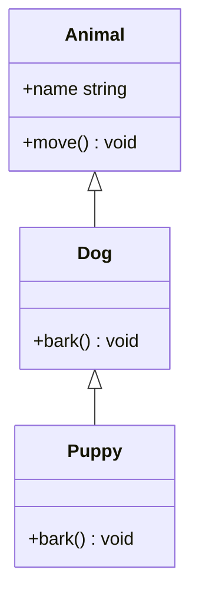
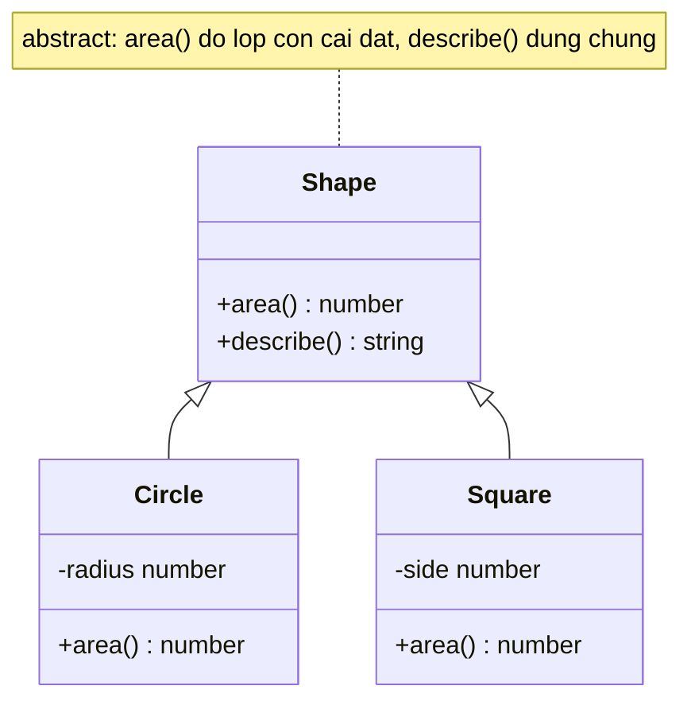

# Abstract Classes và Inheritance

**Inheritance** (kế thừa) cho phép một class con tái sử dụng và mở rộng thuộc tính, phương thức từ một class cha. **Abstract class** (lớp trừu tượng) là class chỉ dùng làm khuôn mẫu chung, không thể tạo đối tượng trực tiếp mà phải được class con kế thừa và hoàn thiện. Hai khái niệm này giúp bạn chia sẻ code chung và xây dựng hệ thống class có cấu trúc rõ ràng.

---

:::note[Ghi nhớ nhanh]

- ⭐ **Abstract class không thể `new` trực tiếp và ép lớp con implement abstract method** — compiler báo lỗi ngay lúc compile nếu lớp con thiếu, đồng thời vẫn chia sẻ được code chung.
- **`extends` để kế thừa, `super` để gọi lên class cha** — lớp con tái sử dụng và mở rộng field/method; bắt buộc gọi `super()` nếu cha có constructor.
- **Polymorphism qua dynamic dispatch** — gọi cùng một method (`s.area()`) nhưng runtime tự chọn đúng version theo class thực của object.
- ⭐ **Abstract class chứa code + tồn tại runtime, interface chỉ là shape bị xoá** — dùng abstract class khi cần chia sẻ code và bắt subclass tuân contract; interface khi chỉ cần contract (và implement được nhiều cái cùng lúc).

:::

---

## Mục lục

- [Vì sao có abstract class?](#vì-sao-có-abstract-class)
- [Inheritance (kế thừa)](#inheritance-kế-thừa)
- [Abstract Class](#abstract-class)
- [Polymorphism (đa hình)](#polymorphism-đa-hình)
- [Interface vs Abstract Class](#interface-vs-abstract-class)
- [Câu hỏi phỏng vấn](#câu-hỏi-phỏng-vấn)

---

## Vì sao có abstract class?

**Vấn đề:** Bạn muốn định nghĩa một **lớp khuôn** (base) chứa logic dùng
chung, nhưng **bắt buộc** mọi lớp con phải tự cài đặt vài method riêng,
đồng thời **không cho phép** new trực tiếp lớp khuôn đó. JS thuần không có
cơ chế ép buộc này.

```ts
// JS thuần — không ngăn được gì
class Shape {
  area() {
    throw new Error("Phải override area()"); // Chỉ lỗi lúc chạy
  }
}

const s = new Shape(); // Vẫn new được, không ai cấm
s.area();              // Nổ lúc runtime, không nổ lúc compile

class Circle extends Shape {} // Quên implement area() — không ai báo
```

**Giải pháp:** `abstract class` + `abstract method` — không thể `new` lớp
abstract; lớp con **bắt buộc** implement abstract method (compiler báo lỗi
ngay nếu thiếu); vẫn chia sẻ được code chung qua kế thừa.

```ts
abstract class Shape {
  abstract area(): number; // Lớp con bắt buộc cài đặt

  describe() {             // Code chung, dùng lại cho mọi lớp con
    return `Diện tích: ${this.area()}`;
  }
}

new Shape();               // Error: Cannot create an instance of an abstract class

class Circle extends Shape {} // Error: thiếu 'area' — báo ngay lúc compile

class Square extends Shape {
  constructor(private s: number) { super(); }
  area(): number { return this.s ** 2; } // Bắt buộc có
}
```

:::tip[Dùng thực tế]

- **Base `Shape`** với `area()` trừu tượng — mỗi hình tự tính diện tích.
- **Base `Repository`/`Service`** định khung CRUD chung, lớp con cài đặt
  chi tiết truy vấn.
- **Template Method pattern** — lớp cha định nghĩa flow, để lại các "lỗ
  hổng" abstract cho lớp con điền vào.
- **Framework/library** yêu cầu bạn override một số method bắt buộc khi
  kế thừa class base của chúng.

:::

---

## Inheritance (kế thừa)

Dùng `extends` để class con kế thừa từ class cha.

```ts
class Animal {
  constructor(public name: string) {}

  move() {
    console.log(`${this.name} đang di chuyển`);
  }
}

class Dog extends Animal {
  bark() {
    console.log(`${this.name} sủa`);
  }
}

const d = new Dog("Lulu");
d.move(); // Kế thừa từ Animal
d.bark();
```

Sơ đồ dưới minh hoạ cây kế thừa: `Puppy` kế thừa `Dog`, `Dog` kế thừa `Animal`, method được truyền xuống các lớp con.



Class con có thể gọi `super` để truy cập class cha:

```ts
class Puppy extends Dog {
  constructor(name: string) {
    super(name); // Bắt buộc gọi nếu cha có constructor
  }

  bark() {
    super.bark();           // Gọi method cha
    console.log("(yếu)");
  }
}
```

---

## Abstract Class

`abstract` — class **không thể new trực tiếp**, dùng để định nghĩa
template cho class con.

```ts
abstract class Shape {
  abstract area(): number; // Method abstract — class con phải implement

  describe() {
    return `Diện tích: ${this.area()}`;
  }
}

class Circle extends Shape {
  constructor(private radius: number) {
    super();
  }

  area(): number {
    return Math.PI * this.radius ** 2;
  }
}

new Shape();         // Error
new Circle(5);       // OK
```

Sơ đồ dưới cho thấy quan hệ abstract → concrete: lớp abstract `Shape` giữ code chung (`describe`) và để `area` cho các lớp con `Circle`, `Square` hoàn thiện.



:::info[Phân tích]

Abstract class **khác** interface ở những điểm quan trọng:

| | Abstract Class | Interface |
|--|--|--|
| Có thể chứa code | **Có** (method, constructor, field) | Không (chỉ shape) |
| Tồn tại runtime | **Có** (sinh JS class) | Không (bị xoá) |
| Inheritance | `extends` (1 cha duy nhất) | `implements` (nhiều cùng lúc) |
| Có constructor | Có | Không |

→ Dùng **abstract class** khi muốn **chia sẻ code và bắt subclass tuân
thủ contract** cùng lúc. Dùng **interface** khi chỉ cần contract.

:::

---

## Polymorphism (đa hình)

Đa hình — gọi cùng một method, nhưng kết quả khác nhau tùy class cụ thể.

```ts
abstract class Shape {
  abstract area(): number;
}

class Circle extends Shape {
  constructor(private r: number) { super(); }
  area(): number { return Math.PI * this.r ** 2; }
}

class Square extends Shape {
  constructor(private s: number) { super(); }
  area(): number { return this.s ** 2; }
}

function printArea(shapes: Shape[]) {
  for (const s of shapes) {
    console.log(s.area()); // Tự gọi đúng version
  }
}

printArea([new Circle(5), new Square(4)]);
```

TS hỗ trợ đa hình qua **dynamic dispatch** (giống Java) — runtime tự
quyết định gọi method nào dựa trên class thực của object.

---

## Interface vs Abstract Class

```ts
// Cách 1 — interface
interface Repository<T> {
  findById(id: number): T | null;
  save(entity: T): void;
}

class UserRepo implements Repository<User> {
  findById(id: number) { /* ... */ return null; }
  save(user: User) { /* ... */ }
}

// Cách 2 — abstract class
abstract class BaseRepo<T> {
  abstract findById(id: number): T | null;
  abstract save(entity: T): void;

  // Có thể có method dùng chung
  log(action: string) {
    console.log(`[Repo] ${action}`);
  }
}

class UserRepo2 extends BaseRepo<User> {
  findById(id: number) { return null; }
  save(user: User) { this.log("save"); }
}
```

:::tip[Mẹo]

**Khi nào chọn cái nào?**

- Cần **chia sẻ logic** (template method, hook lifecycle) → abstract class.
- Chỉ cần **shape contract** → interface.
- Muốn class có thể implement **nhiều interface** → interface (TS chỉ
  cho `extends` 1 class).
- Muốn **type-only**, không tồn tại runtime → interface.

Trong React/Node app hiện đại, **interface + composition** thường gọn
và linh hoạt hơn abstract class. Abstract class hợp khi xây framework,
ORM, hoặc library cần lifecycle phức tạp.

:::

---

## Câu hỏi phỏng vấn

Những câu thường gặp về chủ đề này. Tự trả lời trước, rồi đối chiếu lại với nội dung phía trên.

1. `Inheritance` giải quyết vấn đề gì? Nêu một tình huống mà kế thừa gọn hơn hẳn việc lặp code.
2. `extends` cho phép kế thừa bao nhiêu class cha? Nếu cần hành vi từ nhiều nguồn thì làm cách nào?
3. Vì sao class con bắt buộc gọi `super()` trong constructor? Chuyện gì xảy ra nếu dùng `this` trước khi gọi `super()`?
4. `super.method()` khác `this.method()` ra sao khi class con đã override method đó?
5. `abstract class` là gì và vì sao không `new` trực tiếp được? Compiler chặn ở thời điểm nào?
6. `abstract method` khác method thường ở đâu? Class con không cài đặt thì chuyện gì xảy ra?
7. `abstract class` có được chứa constructor, field, và method đã cài đặt sẵn không? Điều đó dùng để làm gì?
8. Có thể khai báo `abstract` cho property và cho `getter`/`setter` không? Cho ví dụ.
9. So sánh `abstract class` với `interface` theo bốn tiêu chí: chứa code, tồn tại runtime, số lượng kế thừa, có constructor.
10. `Polymorphism` là gì? Giải thích `dynamic dispatch` — runtime quyết định gọi method nào dựa trên cái gì?
11. Khi override method của cha, chữ ký của method con phải thoả điều kiện gì để compiler chấp nhận?
12. `override` keyword (TS 4.3+) và cờ `noImplicitOverride` giúp phòng bug nào? Cho ví dụ cụ thể.
13. Method của cha là `private` thì class con có override được không? Còn `protected` thì sao?
14. `Template method pattern` là gì và vì sao `abstract class` là công cụ tự nhiên để cài đặt nó?
15. Khi nào chọn `abstract class`, khi nào chọn `interface`? Nêu bốn tiêu chí quyết định.
16. Vì sao trong app React/Node hiện đại nhiều team ưu tiên `interface` + `composition` hơn cây kế thừa sâu?
17. Kể các vấn đề của kế thừa sâu (fragile base class, coupling chặt, khó test) và cách `composition` giảm nhẹ chúng.
18. Một class có thể vừa `extends` một abstract class vừa `implements` nhiều interface không? Compiler kiểm tra những gì trong trường hợp đó?
