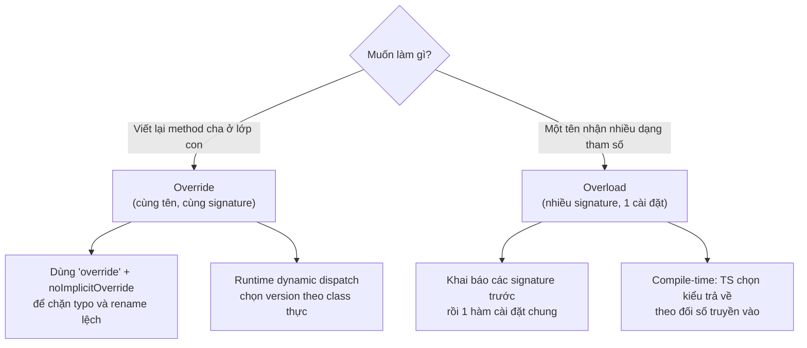
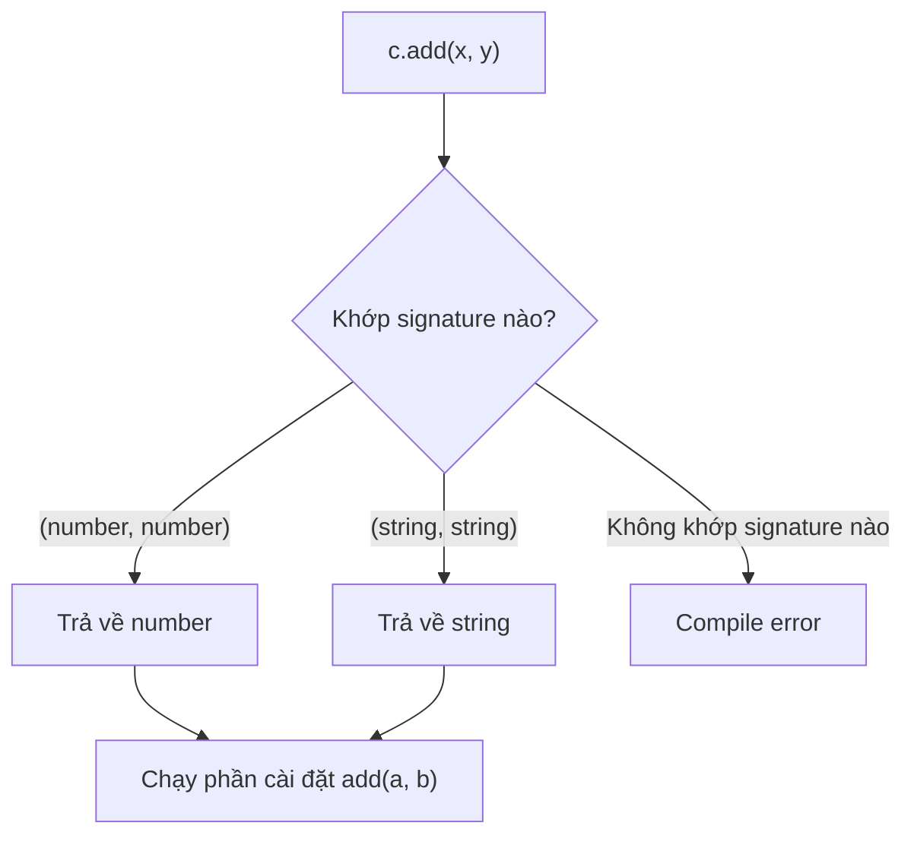

# Method Overriding và Constructor Overloading

**Method overriding** (ghi đè phương thức) là khi lớp con định nghĩa lại một phương thức đã có sẵn ở lớp cha để thay đổi hành vi của nó. **Overloading** (nạp chồng) cho phép khai báo nhiều "phiên bản" chữ ký cho cùng một hàm hoặc constructor, để cùng một tên có thể nhận các tham số khác nhau. Bài này giúp bạn mới học hiểu cách tùy biến hành vi kế thừa và viết hàm linh hoạt hơn trong TypeScript.

[](pathname:///img/typescript/overriding-overloading.webp)

---

:::note[Ghi nhớ nhanh]

- ⭐ **Override giữa lớp cha–con, overload là nhiều chữ ký cho cùng một tên** — đừng nhầm hai khái niệm này.
- ⭐ **Từ khoá `override` + `noImplicitOverride` chặn typo và rename lệch** — TS báo lỗi khi ghi đè một method mà class cha không hề có, tránh bug JS âm thầm tạo method mới.
- **Method overriding dùng `super` để gọi method cha** — vd `super.speak() + " (yếu)"` để mở rộng thay vì thay thế hoàn toàn.
- **Constructor/method overload: khai báo signature trước, một phần cài đặt chung** — compiler chọn kiểu trả về theo đối số; implementation ẩn với caller.
- **Static factory method thường gọn hơn constructor overload** — mỗi factory có tên rõ ràng (`fromXY`, `fromTuple`), dễ đọc, dễ test, không cần check `typeof`.

:::

---

## Mục lục

- [Vì sao có overriding & overloading?](#vì-sao-có-overriding--overloading)
- [Method Overriding](#method-overriding)
- [Từ khóa override](#từ-khóa-override)
- [Constructor Overloading](#constructor-overloading)
- [Method Overloading](#method-overloading)
- [Câu hỏi phỏng vấn](#câu-hỏi-phỏng-vấn)

---

## Vì sao có overriding & overloading?

**Vấn đề:**

```ts
// (1) Ghi đè method cha bằng cách gõ tay — gõ sai tên là JS lặng lẽ
// tạo method MỚI chứ không báo lỗi → bug khó tìm.
class Animal {
  speak(): string { return "..."; }
}

class Dog extends Animal {
  speack(): string { return "Woof!"; } // typo "speack"!
  // JS coi đây là method mới, Animal.speak() vẫn được gọi → sai hành vi.
}

// (2) Một hàm cần nhận NHIỀU DẠNG tham số với kiểu trả về tương ứng,
// nhưng một chữ ký đơn không diễn tả chính xác được.
function parse(input: string | number): string | number {
  return input; // gọi parse("x") cũng cho kiểu string | number → mơ hồ
}
```

**Giải pháp:**

```ts
// (1) Từ khóa override — TS báo lỗi nếu method cha KHÔNG tồn tại.
// Bật noImplicitOverride để ghi đè luôn an toàn.
class Dog extends Animal {
  override speack(): string { return "Woof!"; }
  //       ^ Error: This member cannot have an 'override' modifier
  //         because it is not declared in the base class 'Animal'.
}

// (2) Overload — khai báo nhiều chữ ký, một phần cài đặt.
// Compiler chọn đúng kiểu trả về theo đối số.
function parse(input: string): string;
function parse(input: number): number;
function parse(input: string | number): string | number {
  return input;
}

parse("x"); // type: string
parse(10);  // type: number
```

Sơ đồ dưới phân biệt hai khái niệm dễ nhầm: **override** xảy ra giữa lớp cha và lớp con, còn **overload** là nhiều chữ ký cho cùng một tên trong một phạm vi.



:::tip[Dùng thực tế]

- Ghi đè method an toàn khi kế thừa: `override` + `noImplicitOverride` chặn typo và bắt lỗi khi method cha bị rename.
- Hàm tạo nhận `(string)` hoặc `(number)` và trả về kiểu khác nhau tùy đối số.
- API linh hoạt nhưng vẫn type-safe: một tên hàm phục vụ nhiều dạng input, IntelliSense gợi ý đúng từng overload.
- Refactor lớp cha yên tâm: đổi chữ ký method cha là TS lập tức báo mọi nơi ghi đè bị lệch.

:::

---

## Method Overriding

Class con **viết lại** method của class cha với cùng tên và signature.

```ts
class Animal {
  speak(): string {
    return "Generic sound";
  }
}

class Dog extends Animal {
  speak(): string {
    return "Woof!";
  }
}

new Animal().speak(); // "Generic sound"
new Dog().speak();    // "Woof!"
```

Gọi method cha qua `super`:

```ts
class Puppy extends Dog {
  speak(): string {
    return super.speak() + " (yếu)";
  }
}
```

---

## Từ khóa override

`override` (TS 4.3+) đánh dấu rõ rằng method đang **ghi đè** method cha.

```ts
class Animal {
  speak(): string { return ""; }
}

class Dog extends Animal {
  override speak(): string {
    return "Woof!";
  }
}
```

Không bắt buộc, nhưng giúp tránh bug khi rename method ở cha.

:::warning[Cần lưu ý]

Bật flag `noImplicitOverride: true` trong `tsconfig.json` để TS **bắt
buộc** dùng `override` mỗi khi ghi đè:

```ts
// noImplicitOverride: true
class Dog extends Animal {
  speak(): string { return "Woof"; }
  //   ^ Error: This member must have an 'override' modifier
}
```

Tác dụng quan trọng — phát hiện khi:

- Rename method ở class cha mà quên ở class con.
- Vô tình "ghi đè" mà thực ra cha không có method đó (typo).

Đây là một trong các flag "siêu strict" được khuyến nghị cho codebase
nghiêm túc.

:::

---

## Constructor Overloading

Class có **nhiều cách khởi tạo** khác nhau — dùng kỹ thuật overload signature.

```ts
class Point {
  x: number;
  y: number;

  constructor(x: number, y: number);
  constructor(coord: [number, number]);
  constructor(a: number | [number, number], b?: number) {
    if (typeof a === "number") {
      this.x = a;
      this.y = b!;
    } else {
      this.x = a[0];
      this.y = a[1];
    }
  }
}

new Point(1, 2);     // OK
new Point([3, 4]);   // OK
```

:::info[Phân tích]

Constructor overload có cùng hạn chế như function overload:

- Implementation **không nhìn thấy** từ ngoài.
- Logic bên trong dễ rối khi có nhiều case → maintain khó.

**Pattern thay thế** thường gọn hơn — **static factory method**:

```ts
class Point {
  private constructor(public x: number, public y: number) {}

  static fromXY(x: number, y: number): Point {
    return new Point(x, y);
  }

  static fromTuple(t: [number, number]): Point {
    return new Point(t[0], t[1]);
  }
}

Point.fromXY(1, 2);
Point.fromTuple([3, 4]);
```

Mỗi factory **có tên rõ ràng**, dễ đọc, dễ test, không cần check `typeof`.
Đây là pattern được khuyến khích trong codebase domain-driven.

:::

---

## Method Overloading

Tương tự function overload — method có nhiều signature.

```ts
class Calculator {
  add(a: number, b: number): number;
  add(a: string, b: string): string;
  add(a: any, b: any): any {
    return a + b;
  }
}

const c = new Calculator();
c.add(1, 2);       // type: number
c.add("a", "b");   // type: string
```

Sơ đồ dưới mô tả cách compiler khớp lời gọi với đúng overload signature để suy ra kiểu trả về.



:::tip[Mẹo]

Trong code app, **generic** hoặc **union với type guard** thường rõ
hơn overload:

```ts
class Calculator {
  add<T extends number | string>(a: T, b: T): T {
    return (a as any) + (b as any);
  }
}
```

Overload chỉ thực sự cần khi **return type không thể biểu diễn bằng
generic** (vd hai signature trả về type hoàn toàn khác nhau).

:::

---

## Câu hỏi phỏng vấn

Những câu thường gặp về chủ đề này. Tự trả lời trước, rồi bấm **Xem đáp án** để đối chiếu.

**1. Phân biệt method overriding và method overloading trong TypeScript — cái nào là chuyện của runtime, cái nào chỉ tồn tại lúc biên dịch?**

<details className="qa">
<summary>Xem đáp án</summary>

| | Overriding | Overloading |
|---|---|---|
| Quan hệ | Giữa **lớp cha và lớp con** | Nhiều **chữ ký cho cùng một tên** trong một phạm vi |
| Số cài đặt | Mỗi lớp có một cài đặt riêng | Nhiều signature, **một** cài đặt chung |
| Thời điểm quyết định | **Runtime** — dynamic dispatch theo class thực của object | **Compile-time** — TS chọn kiểu trả về theo đối số |
| Có trong JS đầu ra | **Có** (method thật trên prototype) | **Không** — signature bị xóa sạch |

```ts
// Overriding
class Dog extends Animal {
  override speak(): string { return "Woof!"; }
}

// Overloading
add(a: number, b: number): number;
add(a: string, b: string): string;
add(a: any, b: any): any { return a + b; }
```

Tóm lại: overriding là chuyện **runtime** và tồn tại thật trong JS; overloading thuần túy là chuyện **kiểu**, chỉ giúp compiler suy ra đúng kiểu trả về.

</details>

**2. Vì sao JavaScript thuần không có overloading kiểu Java/C#, và TypeScript "mô phỏng" nó bằng cách nào?**

<details className="qa">
<summary>Xem đáp án</summary>

JS không có overloading vì hai lý do gốc:

- **Không có kiểu lúc runtime** để phân giải theo chữ ký — Java/C# chọn phương thức dựa trên kiểu tham số đã biết lúc compile.
- **Tên hàm là một binding duy nhất**: khai báo hai hàm cùng tên thì cái sau **đè** cái trước, không tồn tại song song.

```js
function f(a) {}
function f(a, b) {} // đè hoàn toàn bản trên
```

Thay vào đó, JS xử lý bằng cách kiểm tra `arguments.length` hoặc `typeof` ngay trong thân hàm.

TypeScript mô phỏng ở **tầng kiểu**: bạn khai báo nhiều **overload signature** (chỉ chữ ký, không thân), rồi một **implementation signature** đủ rộng để bao hết:

```ts
function parse(input: string): string;
function parse(input: number): number;
function parse(input: string | number): string | number { return input; }
```

Compiler khớp lời gọi với signature phù hợp để suy ra kiểu trả về; còn khi ra JS chỉ còn đúng một hàm cài đặt, và bạn vẫn phải tự phân nhánh bằng `typeof` bên trong.

</details>

**3. Từ khoá `override` giải quyết vấn đề gì? Nếu gõ sai tên method của lớp cha mà không có nó thì chuyện gì xảy ra?**

<details className="qa">
<summary>Xem đáp án</summary>

`override` (TS 4.3+) khẳng định rằng method này **đang ghi đè** một member có thật của lớp cha. Nếu lớp cha không có, compiler báo lỗi ngay.

```ts
class Animal {
  speak(): string { return "..."; }
}

class Dog extends Animal {
  override speack(): string { return "Woof!"; }
  //       ^ Error: This member cannot have an 'override' modifier
  //         because it is not declared in the base class 'Animal'.
}
```

Không có `override`, đoạn typo trên **compile thành công**: JS lặng lẽ coi `speack` là một method hoàn toàn mới, còn `speak` vẫn dùng bản của `Animal`. Kết quả là gọi `dog.speak()` ra `"..."` thay vì `"Woof!"` — code chạy, không lỗi, nhưng hành vi sai và rất khó truy vì không có dấu hiệu nào.

Ngoài chống typo, `override` còn giúp người đọc phân biệt ngay đâu là method mới, đâu là method ghi đè trong một lớp con dài.

</details>

**4. Cờ `noImplicitOverride` trong `tsconfig.json` bắt buộc điều gì? Nó giúp gì khi ai đó rename method ở lớp cha?**

<details className="qa">
<summary>Xem đáp án</summary>

`noImplicitOverride: true` bắt buộc **mọi** method ghi đè member của lớp cha phải viết rõ từ khóa `override`, nếu thiếu là lỗi:

```ts
// noImplicitOverride: true
class Dog extends Animal {
  speak(): string { return "Woof"; }
  //   ^ Error: This member must have an 'override' modifier
  //     because it overrides a member in the base class 'Animal'.
}
```

Nó khóa cả hai chiều. Chiều `override` bắt lỗi khi cha **không có** method đó; chiều `noImplicitOverride` bắt lỗi khi bạn đang ghi đè mà **quên khai báo**.

Khi ai đó rename method ở lớp cha (`speak` → `makeSound`), lớp con vẫn giữ `override speak()` — và vì `Animal` không còn `speak` nữa, TS báo lỗi ngay tại lớp con. Không có cờ này, lớp con lặng lẽ trở thành một method thừa không bao giờ được gọi, còn `makeSound` của cha chạy với hành vi mặc định.

Đây là một trong các flag "siêu strict" rất đáng bật với codebase có nhiều tầng kế thừa.

</details>

**5. Trong một nhóm overload, vì sao implementation signature không gọi được từ bên ngoài? Sai lầm phổ biến nào sinh ra từ hiểu nhầm này?**

<details className="qa">
<summary>Xem đáp án</summary>

Vì đó là thiết kế có chủ đích của TypeScript: implementation signature chỉ phục vụ **việc kiểm tra thân hàm**, không phải là một lựa chọn công khai. Khi có ít nhất một overload signature, chỉ các overload đó lọt vào API nhìn thấy được.

```ts
function parse(input: string): string;
function parse(input: number): number;
function parse(input: string | number): string | number { return input; }

parse("x");        // OK
parse(true);       // Error
parse(Math.random() > 0.5 ? "a" : 1);
// Error: No overload matches this call — dù implementation nhận union!
```

Sai lầm phổ biến nhất: viết implementation với kiểu rất rộng (`any`, hoặc union) rồi **tưởng rằng caller cũng truyền được kiểu đó**. Thực tế union không khớp overload nào cả, vì mỗi overload chỉ nhận đúng một nhánh. Muốn cho phép, phải khai báo thêm một overload nhận union tường minh.

Sai lầm thứ hai: đặt `any` ở implementation rồi quên rằng TS **không kiểm tra** xem thân hàm có thực sự thỏa mãn từng overload hay không — kiểu trả về sai vẫn lọt.

</details>

**6. TypeScript chọn overload theo thứ tự nào khi nhiều signature cùng khớp? Vì sao nên đặt signature hẹp trước signature rộng?**

<details className="qa">
<summary>Xem đáp án</summary>

TS duyệt các overload **theo đúng thứ tự khai báo, từ trên xuống**, và dùng **cái đầu tiên khớp** — không có khái niệm "chọn cái khớp tốt nhất" như Java/C#.

Hệ quả: nếu đặt signature rộng lên trước, nó "nuốt" hết mọi lời gọi và các signature hẹp phía dưới trở nên vô dụng:

```ts
// SAI thứ tự
function get(id: any): unknown;
function get(id: number): User;
function get(id: any): any { return null; }

get(1); // kiểu trả về: unknown — signature số 2 không bao giờ được chọn

// ĐÚNG: hẹp trước, rộng sau
function get2(id: number): User;
function get2(id: any): unknown;
function get2(id: any): any { return null; }

get2(1); // kiểu trả về: User
```

Vì vậy quy tắc là **hẹp/cụ thể trước, rộng/tổng quát sau**. Điều này cũng áp dụng cho các signature trong `.d.ts` của thư viện. Một mẹo kèm theo: khi thấy `No overload matches this call`, hãy đọc lỗi từ overload cuối cùng trở lên, vì TS thường báo chi tiết theo overload gần khớp nhất.

</details>

**7. Khi override, khi nào bắt buộc gọi `super.method()` và khi nào cố ý bỏ qua? Hệ quả của mỗi lựa chọn?**

<details className="qa">
<summary>Xem đáp án</summary>

TypeScript **không bắt buộc** gọi `super.method()` — đó là quyết định thiết kế của bạn (khác với `super()` trong constructor, vốn bắt buộc).

**Gọi `super.method()` khi muốn *mở rộng*** — giữ nguyên hành vi cha rồi thêm phần của mình:

```ts
class Puppy extends Dog {
  override speak(): string {
    return super.speak() + " (yếu)"; // "Woof! (yếu)"
  }
}
```

Bắt buộc về mặt thực tế khi cha làm việc gì đó không thể bỏ qua: dọn tài nguyên, đăng ký event, cập nhật state nội bộ, hook lifecycle của framework (`componentWillUnmount`, `ngOnDestroy`). Quên gọi là rò rỉ bộ nhớ hoặc state hỏng.

**Bỏ qua khi muốn *thay thế hoàn toàn*** — cài đặt của cha không còn đúng với lớp con (ví dụ cha có bản mặc định vô nghĩa, hoặc bạn đổi thuật toán).

Hệ quả cần cân nhắc: gọi `super` tạo **coupling** với chi tiết của cha (đổi cha là con bị ảnh hưởng); bỏ qua thì con phải tự chịu trách nhiệm toàn bộ, dễ bỏ sót phần hạ tầng mà cha vốn lo giúp.

</details>

**8. Method ở lớp con phải tương thích kiểu với lớp cha ra sao? Giải thích covariance của kiểu trả về và vì sao TS xử lý tham số của method theo kiểu bivariant.**

<details className="qa">
<summary>Xem đáp án</summary>

Nguyên tắc chung: kiểu của lớp con phải **gán được** cho kiểu của lớp cha, để mọi nơi dùng cha đều thay bằng con được.

**Kiểu trả về là covariant** — con được phép trả về kiểu **hẹp hơn** (subtype), không được rộng hơn:

```ts
class Animal {
  reproduce(): Animal { return new Animal(); }
}
class Dog extends Animal {
  override reproduce(): Dog { return new Dog(); }   // OK — Dog là Animal
  // override reproduce(): object { ... }            // Error — rộng hơn
}
```

Hợp lý vì caller mong nhận `Animal`; nhận về `Dog` vẫn thỏa mãn.

**Tham số thì TS xử lý bivariant** (chấp nhận cả hẹp hơn lẫn rộng hơn). Về lý thuyết, an toàn tuyệt đối đòi hỏi tham số phải **contravariant** (chỉ được rộng hơn). Nhưng TS chọn nới lỏng vì lý do thực dụng: rất nhiều pattern quen thuộc trong JS/DOM sẽ không compile nếu áp dụng chặt — điển hình là mảng và các handler event, nơi lớp con thường muốn thu hẹp tham số. Đây là một **lỗ hổng an toàn kiểu có chủ ý** (unsoundness) mà TS chấp nhận để đổi lấy tính khả dụng.

</details>

**9. Cờ `strictFunctionTypes` ảnh hưởng thế nào đến kiểm tra tham số khi override — vì sao method viết dạng shorthand và dạng property arrow function lại bị check khác nhau?**

<details className="qa">
<summary>Xem đáp án</summary>

`strictFunctionTypes` bật kiểm tra tham số theo kiểu **contravariant** (chặt chẽ, đúng lý thuyết) thay vì bivariant. Nhưng nó **cố ý loại trừ method viết dạng shorthand** — chỉ áp dụng cho kiểu hàm khai báo dạng property:

```ts
class Base {
  handle(e: Event): void {}                 // method shorthand
  onEvent: (e: Event) => void = () => {};   // property kiểu hàm
}

class Child extends Base {
  override handle(e: MouseEvent): void {}   // OK — method vẫn bivariant
  override onEvent = (e: MouseEvent) => {}; // Error khi strictFunctionTypes bật
}
```

Lý do của sự bất đối xứng này: nếu áp dụng chặt cho method, hàng loạt API sẵn có sẽ vỡ — `Array<T>` với `push`/`concat`, các interface DOM, và vô số pattern kế thừa quen thuộc trong hệ sinh thái. TS đánh đổi: giữ method ở chế độ dễ dãi để tương thích ngược, còn với kiểu hàm tường minh (property, type alias, callback parameter) thì kiểm tra đúng lý thuyết.

Rút ra: muốn an toàn kiểu tối đa cho callback, hãy khai báo nó dưới dạng **property kiểu hàm** thay vì method.

</details>

**10. Constructor overloading được viết thế nào trong TS? Vì sao nhiều người khuyên thay bằng static factory method?**

<details className="qa">
<summary>Xem đáp án</summary>

Viết y như function overload: các chữ ký constructor không thân, rồi một cài đặt đủ rộng:

```ts
class Point {
  x: number;
  y: number;

  constructor(x: number, y: number);
  constructor(coord: [number, number]);
  constructor(a: number | [number, number], b?: number) {
    if (typeof a === "number") { this.x = a; this.y = b!; }
    else { this.x = a[0]; this.y = a[1]; }
  }
}
```

Vì sao nên thay bằng static factory:

```ts
class Point2 {
  private constructor(public x: number, public y: number) {}
  static fromXY(x: number, y: number) { return new Point2(x, y); }
  static fromTuple(t: [number, number]) { return new Point2(t[0], t[1]); }
}
```

- **Mỗi cách tạo có tên rõ nghĩa** — đọc `Point.fromTuple([3,4])` hiểu ngay, không phải đoán overload nào đang chạy.
- Không cần chuỗi `typeof`/`Array.isArray` rối rắm, mỗi factory làm đúng một việc nên **dễ test**.
- Factory được phép **trả về `null`/cached instance/subclass**, còn constructor thì luôn phải trả về instance mới.
- Thêm cách khởi tạo mới không đụng vào code cũ.

Đây là pattern được khuyến khích trong codebase domain-driven.

</details>

**11. So sánh ba cách xử lý "một hàm nhận nhiều dạng tham số": overload signature, generic, và union + type guard. Khi nào chọn cái nào?**

<details className="qa">
<summary>Xem đáp án</summary>

| Cách | Phù hợp khi | Điểm yếu |
|---|---|---|
| **Overload signature** | Các dạng input **rời rạc** và kiểu trả về **khác hẳn nhau**, không liên hệ được bằng biến kiểu | Nhiều code, implementation không được kiểm tra chặt, thứ tự signature dễ sai |
| **Generic** | Kiểu trả về **phụ thuộc** kiểu đầu vào theo một quan hệ chung (`(a: T) => T`) | Không diễn tả được khi quan hệ giữa các case hoàn toàn không đồng dạng |
| **Union + type guard** | Cùng một kiểu trả về, chỉ khác cách xử lý đầu vào | Kiểu trả về bị "gộp" thành union, caller phải tự thu hẹp |

```ts
// Generic — gọn hơn overload khi quan hệ đồng dạng
add<T extends number | string>(a: T, b: T): T;

// Union + guard — khi trả về cùng kiểu
function len(x: string | unknown[]): number {
  return typeof x === "string" ? x.length : x.length;
}
```

Thứ tự ưu tiên thực dụng: thử **generic** trước, rồi **union + type guard**, cuối cùng mới đến **overload**. Overload chỉ thực sự cần khi kiểu trả về không thể biểu diễn bằng một biến kiểu chung — ví dụ `parse(s: string): string` và `parse(n: number): Date`.

</details>

**12. Có overload được một property kiểu arrow function không? Khác gì so với overload method thường?**

<details className="qa">
<summary>Xem đáp án</summary>

Không dùng được cú pháp overload (khai báo nhiều chữ ký rồi một cài đặt) cho property — cú pháp đó chỉ áp dụng cho khai báo `function` và cho **method** trong class/interface. Với property kiểu hàm, bạn phải mô tả nhiều **call signature** trong kiểu của nó:

```ts
// Cách 1 — interface có nhiều call signature
interface Add {
  (a: number, b: number): number;
  (a: string, b: string): string;
}

class Calculator {
  add: Add = (a: any, b: any): any => a + b;
}

// Cách 2 — intersection các kiểu hàm
type Add2 = ((a: number, b: number) => number) & ((a: string, b: string) => string);
```

Khác biệt so với overload method thường:

- Method overload **nằm trên prototype**, dùng chung cho mọi instance; property arrow function được tạo **riêng cho từng instance** (tốn bộ nhớ hơn nhưng `this` gắn cố định).
- Với property, bạn thường phải ép kiểu (`as any`) ở phần cài đặt vì TS không tự kiểm tra thân hàm với từng call signature.
- Property kiểu hàm chịu kiểm tra `strictFunctionTypes`, còn method thì không.

</details>

**13. Overload sinh ra code JavaScript gì sau khi biên dịch? Có chi phí runtime nào không?**

<details className="qa">
<summary>Xem đáp án</summary>

Các overload signature **hoàn toàn biến mất** — chúng chỉ là khai báo kiểu. JS đầu ra chỉ còn đúng phần cài đặt:

```ts
// TypeScript
function parse(input: string): string;
function parse(input: number): number;
function parse(input: string | number): string | number { return input; }
```

```js
// JavaScript sau khi biên dịch
function parse(input) { return input; }
```

Vậy bản thân overload **không tốn gì lúc runtime** — không sinh bảng phân giải, không kiểm tra kiểu, không thêm byte nào ngoài hàm cài đặt.

Nhưng có hai chi phí gián tiếp cần nhớ:

- **Chi phí bạn tự viết**: logic phân nhánh `typeof`/`Array.isArray` trong thân hàm là code thật, chạy thật. Nhiều case thì vừa tốn vừa khó đọc.
- **Chi phí compile**: nhiều nhóm overload lớn làm việc phân giải lời gọi của TS chậm hơn, và thông báo lỗi `No overload matches this call` dài, khó đọc.

Đây cũng là một lý do nữa để ưu tiên generic khi có thể.

</details>

**14. Nếu lớp con override một method nhưng khai báo ít tham số hơn lớp cha, TS có báo lỗi không? Vì sao?**

<details className="qa">
<summary>Xem đáp án</summary>

**Không báo lỗi** — đây là trường hợp hợp lệ:

```ts
class Base {
  log(msg: string, level: number): void {}
}

class Child extends Base {
  override log(msg: string): void {}  // OK — bỏ bớt tham số
  // override log(m: string, l: number, extra: boolean): void {} // Error — thừa
}
```

Lý do bắt nguồn từ ngữ nghĩa của JavaScript: hàm **bỏ qua đối số thừa** một cách an toàn. Một hàm nhận ít tham số hơn vẫn thay thế được hàm nhận nhiều tham số, vì caller cứ truyền đủ còn hàm chỉ dùng phần nó quan tâm. Quy tắc này của TS chính là thứ khiến `[1,2,3].map(x => x * 2)` compile được dù `map` truyền tới ba đối số (`value`, `index`, `array`).

Chiều ngược lại thì **lỗi**: con khai báo nhiều tham số bắt buộc hơn cha, vì caller theo kiểu cha sẽ không truyền đủ và các tham số thừa sẽ là `undefined`. Muốn thêm thì phải để chúng optional.

</details>

**15. `abstract` method liên quan thế nào tới overriding? Điều gì xảy ra nếu lớp con không cài đặt method `abstract`?**

<details className="qa">
<summary>Xem đáp án</summary>

`abstract` method là **overriding ở dạng bắt buộc**: lớp cha chỉ khai báo chữ ký, không có thân, và mọi lớp con cụ thể **phải** cài đặt. Khác với override thông thường — nơi lớp cha đã có sẵn một bản mặc định và con được quyền dùng lại.

```ts
abstract class Shape {
  abstract area(): number;   // con bắt buộc cài đặt
  describe() { return `Diện tích: ${this.area()}`; }
}

class Circle extends Shape {} // Error: Non-abstract class 'Circle' does not
                              // implement inherited abstract member 'area'
```

Nếu lớp con không cài đặt, compiler báo lỗi **ngay lúc compile**. Chỉ có một lối thoát hợp lệ: khai báo lớp con **cũng là `abstract`**, đẩy nghĩa vụ xuống tầng tiếp theo.

Hai lưu ý liên quan tới overriding: khi cài đặt một abstract method, `noImplicitOverride` vẫn yêu cầu viết `override`; và không gọi được `super.area()` vì bản của cha không có thân. Đây chính là nền tảng của **template method pattern** — cha giữ flow (`describe`), con điền chỗ trống (`area`).

</details>

**16. Với `private` và `protected`, lớp con có override được không? Quy tắc về khả năng truy cập khi override là gì?**

<details className="qa">
<summary>Xem đáp án</summary>

- **`private`: không override được.** Lớp con không nhìn thấy member đó; khai báo lại cùng tên là lỗi `Types have separate declarations of a private property`.
- **`protected`: override được** bình thường, và gọi được `super.method()`.
- **`public`: override được**, đây là trường hợp thông dụng nhất.

Quy tắc chung về khả năng truy cập: lớp con **được nới rộng, không được thu hẹp**.

```ts
class Base {
  protected run() {}
  public start() {}
}

class Child extends Base {
  override run() {}             // protected → public: OK (nới rộng)
  // protected override start() {} // public → protected: Error (thu hẹp)
}
```

Lý do: mọi nơi đang dùng `Base` phải thay bằng `Child` được; nếu con thu hẹp truy cập thì code gọi `base.start()` sẽ hỏng khi nhận về một `Child`.

Rút ra khi thiết kế base class: cái gì muốn lớp con tùy biến thì để `protected` (hoặc `abstract`); cái gì là chi tiết nội bộ mà bạn muốn tự do sửa về sau thì để `private` — đó cũng là cách tránh **fragile base class**.

</details>

