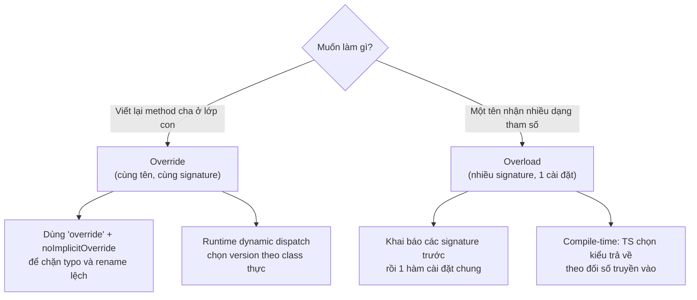
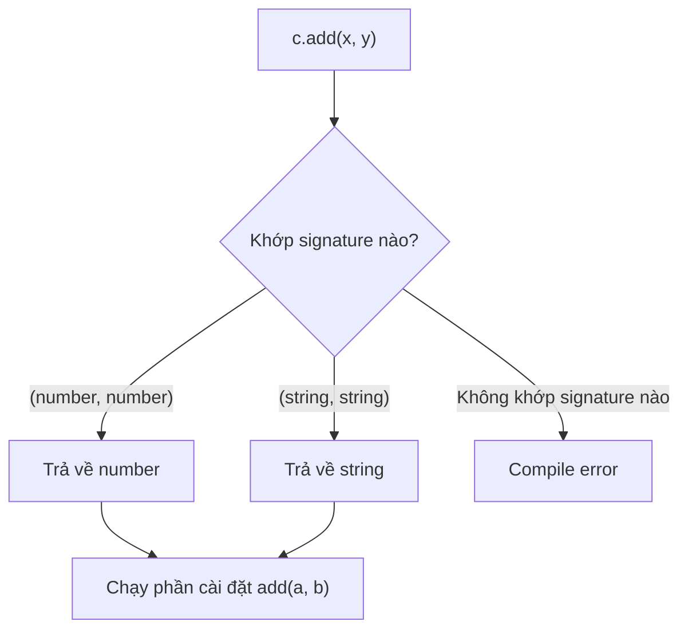

# Method Overriding và Constructor Overloading

**Method overriding** (ghi đè phương thức) là khi lớp con định nghĩa lại một phương thức đã có sẵn ở lớp cha để thay đổi hành vi của nó. **Overloading** (nạp chồng) cho phép khai báo nhiều "phiên bản" chữ ký cho cùng một hàm hoặc constructor, để cùng một tên có thể nhận các tham số khác nhau. Bài này giúp bạn mới học hiểu cách tùy biến hành vi kế thừa và viết hàm linh hoạt hơn trong TypeScript.

---

:::note[Ghi nhớ nhanh]

- ⭐ **Override giữa lớp cha–con, overload là nhiều chữ ký cho cùng một tên** — đừng nhầm hai khái niệm này.
- ⭐ **Từ khoá `override` + `noImplicitOverride` chặn typo và rename lệch** — TS báo lỗi khi ghi đè một method mà class cha không hề có, tránh bug JS âm thầm tạo method mới.
- **Method overriding dùng `super` để gọi method cha** — vd `super.speak() + " (yếu)"` để mở rộng thay vì thay thế hoàn toàn.
- **Constructor/method overload: khai báo signature trước, một phần cài đặt chung** — compiler chọn kiểu trả về theo đối số; implementation ẩn với caller.
- **Static factory method thường gọn hơn constructor overload** — mỗi factory có tên rõ ràng (`fromXY`, `fromTuple`), dễ đọc, dễ test, không cần check `typeof`.

:::

---

## Mục lục

- [Vì sao có overriding & overloading?](#vì-sao-có-overriding--overloading)
- [Method Overriding](#method-overriding)
- [Từ khóa override](#từ-khóa-override)
- [Constructor Overloading](#constructor-overloading)
- [Method Overloading](#method-overloading)
- [Câu hỏi phỏng vấn](#câu-hỏi-phỏng-vấn)

---

## Vì sao có overriding & overloading?

**Vấn đề:**

```ts
// (1) Ghi đè method cha bằng cách gõ tay — gõ sai tên là JS lặng lẽ
// tạo method MỚI chứ không báo lỗi → bug khó tìm.
class Animal {
  speak(): string { return "..."; }
}

class Dog extends Animal {
  speack(): string { return "Woof!"; } // typo "speack"!
  // JS coi đây là method mới, Animal.speak() vẫn được gọi → sai hành vi.
}

// (2) Một hàm cần nhận NHIỀU DẠNG tham số với kiểu trả về tương ứng,
// nhưng một chữ ký đơn không diễn tả chính xác được.
function parse(input: string | number): string | number {
  return input; // gọi parse("x") cũng cho kiểu string | number → mơ hồ
}
```

**Giải pháp:**

```ts
// (1) Từ khóa override — TS báo lỗi nếu method cha KHÔNG tồn tại.
// Bật noImplicitOverride để ghi đè luôn an toàn.
class Dog extends Animal {
  override speack(): string { return "Woof!"; }
  //       ^ Error: This member cannot have an 'override' modifier
  //         because it is not declared in the base class 'Animal'.
}

// (2) Overload — khai báo nhiều chữ ký, một phần cài đặt.
// Compiler chọn đúng kiểu trả về theo đối số.
function parse(input: string): string;
function parse(input: number): number;
function parse(input: string | number): string | number {
  return input;
}

parse("x"); // type: string
parse(10);  // type: number
```

Sơ đồ dưới phân biệt hai khái niệm dễ nhầm: **override** xảy ra giữa lớp cha và lớp con, còn **overload** là nhiều chữ ký cho cùng một tên trong một phạm vi.



:::tip[Dùng thực tế]

- Ghi đè method an toàn khi kế thừa: `override` + `noImplicitOverride` chặn typo và bắt lỗi khi method cha bị rename.
- Hàm tạo nhận `(string)` hoặc `(number)` và trả về kiểu khác nhau tùy đối số.
- API linh hoạt nhưng vẫn type-safe: một tên hàm phục vụ nhiều dạng input, IntelliSense gợi ý đúng từng overload.
- Refactor lớp cha yên tâm: đổi chữ ký method cha là TS lập tức báo mọi nơi ghi đè bị lệch.

:::

---

## Method Overriding

Class con **viết lại** method của class cha với cùng tên và signature.

```ts
class Animal {
  speak(): string {
    return "Generic sound";
  }
}

class Dog extends Animal {
  speak(): string {
    return "Woof!";
  }
}

new Animal().speak(); // "Generic sound"
new Dog().speak();    // "Woof!"
```

Gọi method cha qua `super`:

```ts
class Puppy extends Dog {
  speak(): string {
    return super.speak() + " (yếu)";
  }
}
```

---

## Từ khóa override

`override` (TS 4.3+) đánh dấu rõ rằng method đang **ghi đè** method cha.

```ts
class Animal {
  speak(): string { return ""; }
}

class Dog extends Animal {
  override speak(): string {
    return "Woof!";
  }
}
```

Không bắt buộc, nhưng giúp tránh bug khi rename method ở cha.

:::warning[Cần lưu ý]

Bật flag `noImplicitOverride: true` trong `tsconfig.json` để TS **bắt
buộc** dùng `override` mỗi khi ghi đè:

```ts
// noImplicitOverride: true
class Dog extends Animal {
  speak(): string { return "Woof"; }
  //   ^ Error: This member must have an 'override' modifier
}
```

Tác dụng quan trọng — phát hiện khi:

- Rename method ở class cha mà quên ở class con.
- Vô tình "ghi đè" mà thực ra cha không có method đó (typo).

Đây là một trong các flag "siêu strict" được khuyến nghị cho codebase
nghiêm túc.

:::

---

## Constructor Overloading

Class có **nhiều cách khởi tạo** khác nhau — dùng kỹ thuật overload signature.

```ts
class Point {
  x: number;
  y: number;

  constructor(x: number, y: number);
  constructor(coord: [number, number]);
  constructor(a: number | [number, number], b?: number) {
    if (typeof a === "number") {
      this.x = a;
      this.y = b!;
    } else {
      this.x = a[0];
      this.y = a[1];
    }
  }
}

new Point(1, 2);     // OK
new Point([3, 4]);   // OK
```

:::info[Phân tích]

Constructor overload có cùng hạn chế như function overload:

- Implementation **không nhìn thấy** từ ngoài.
- Logic bên trong dễ rối khi có nhiều case → maintain khó.

**Pattern thay thế** thường gọn hơn — **static factory method**:

```ts
class Point {
  private constructor(public x: number, public y: number) {}

  static fromXY(x: number, y: number): Point {
    return new Point(x, y);
  }

  static fromTuple(t: [number, number]): Point {
    return new Point(t[0], t[1]);
  }
}

Point.fromXY(1, 2);
Point.fromTuple([3, 4]);
```

Mỗi factory **có tên rõ ràng**, dễ đọc, dễ test, không cần check `typeof`.
Đây là pattern được khuyến khích trong codebase domain-driven.

:::

---

## Method Overloading

Tương tự function overload — method có nhiều signature.

```ts
class Calculator {
  add(a: number, b: number): number;
  add(a: string, b: string): string;
  add(a: any, b: any): any {
    return a + b;
  }
}

const c = new Calculator();
c.add(1, 2);       // type: number
c.add("a", "b");   // type: string
```

Sơ đồ dưới mô tả cách compiler khớp lời gọi với đúng overload signature để suy ra kiểu trả về.



:::tip[Mẹo]

Trong code app, **generic** hoặc **union với type guard** thường rõ
hơn overload:

```ts
class Calculator {
  add<T extends number | string>(a: T, b: T): T {
    return (a as any) + (b as any);
  }
}
```

Overload chỉ thực sự cần khi **return type không thể biểu diễn bằng
generic** (vd hai signature trả về type hoàn toàn khác nhau).

:::

---

## Câu hỏi phỏng vấn

Những câu thường gặp về chủ đề này. Tự trả lời trước, rồi đối chiếu lại với nội dung phía trên.

1. Phân biệt **method overriding** và **method overloading** trong TypeScript — cái nào là chuyện của runtime, cái nào chỉ tồn tại lúc biên dịch?
2. Vì sao JavaScript thuần không có overloading kiểu Java/C#, và TypeScript "mô phỏng" nó bằng cách nào?
3. Từ khoá `override` giải quyết vấn đề gì? Nếu gõ sai tên method của lớp cha mà không có nó thì chuyện gì xảy ra?
4. Cờ `noImplicitOverride` trong `tsconfig.json` bắt buộc điều gì? Nó giúp gì khi ai đó rename method ở lớp cha?
5. Trong một nhóm overload, vì sao **implementation signature** không gọi được từ bên ngoài? Sai lầm phổ biến nào sinh ra từ hiểu nhầm này?
6. TypeScript chọn overload theo thứ tự nào khi nhiều signature cùng khớp? Vì sao nên đặt signature hẹp trước signature rộng?
7. Khi override, khi nào bắt buộc gọi `super.method()` và khi nào cố ý bỏ qua? Hệ quả của mỗi lựa chọn?
8. Method ở lớp con phải tương thích kiểu với lớp cha ra sao? Giải thích covariance của kiểu trả về và vì sao TS xử lý tham số của method theo kiểu **bivariant**.
9. Cờ `strictFunctionTypes` ảnh hưởng thế nào đến kiểm tra tham số khi override — vì sao method viết dạng shorthand và dạng property arrow function lại bị check khác nhau?
10. Constructor overloading được viết thế nào trong TS? Vì sao nhiều người khuyên thay bằng **static factory method**?
11. So sánh ba cách xử lý "một hàm nhận nhiều dạng tham số": overload signature, generic, và union + type guard. Khi nào chọn cái nào?
12. Có overload được một property kiểu arrow function không? Khác gì so với overload method thường?
13. Overload sinh ra code JavaScript gì sau khi biên dịch? Có chi phí runtime nào không?
14. Nếu lớp con override một method nhưng khai báo **ít tham số hơn** lớp cha, TS có báo lỗi không? Vì sao?
15. `abstract` method liên quan thế nào tới overriding? Điều gì xảy ra nếu lớp con không cài đặt method `abstract`?
16. Với `private` và `protected`, lớp con có override được không? Quy tắc về khả năng truy cập khi override là gì?

