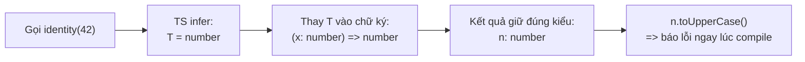

# Generics

**Generic** (kiểu tổng quát, tái dùng cho nhiều kiểu) cho phép bạn viết hàm, interface hay class hoạt động với nhiều kiểu dữ liệu khác nhau mà vẫn giữ được an toàn kiểu. Thay vì viết riêng một phiên bản cho `number`, một phiên bản cho `string`, bạn dùng một tham số kiểu (thường ký hiệu là `T`) để đại diện cho kiểu sẽ được quyết định lúc sử dụng. Bài này giúp người mới học hiểu cách tạo code linh hoạt, tái dùng nhưng vẫn được trình biên dịch kiểm tra kiểu chặt chẽ.

[](pathname:///img/typescript/generics.webp)

---

:::note[Ghi nhớ nhanh]

- ⭐ **Generic `<T>` tham số hoá KIỂU** — viết một lần dùng cho nhiều kiểu mà vẫn type-safe, thay cho `any` (mất kiểm tra) hay viết trùng mỗi kiểu một bản.
- **Dùng được cho function, interface/type và class** — `first<T>`, `ApiResponse<T>`, `Stack<T>`; TS thường tự infer `T` từ đối số.
- ⭐ **Constraint bằng `extends` giới hạn đầu vào** — `T extends { length: number }` hay `K extends keyof T`, nhưng không thu hẹp kiểu `T` nhận vào.
- **Default type parameter `<T = string>`** — cho phép bỏ qua khi dùng, hữu ích khi viết library.
- **Quy ước tên `T`, `K`, `V`, `E`, `R`** — khi inference fail, TS widen về kiểu ít hữu dụng (vd `null`) nên truyền tường minh khi cần.

:::

---

## Mục lục

- [Vì sao generics ra đời?](#vì-sao-generics-ra-đời)
- [Generic là gì?](#generic-là-gì)
- [Generic function](#generic-function)
- [Generic interface và type](#generic-interface-và-type)
- [Generic class](#generic-class)
- [Generic Constraints](#generic-constraints)
- [Default type parameter](#default-type-parameter)
- [Câu hỏi phỏng vấn](#câu-hỏi-phỏng-vấn)

---

## Vì sao generics ra đời?

Khi muốn viết một hàm hay cấu trúc dữ liệu **tái sử dụng cho nhiều kiểu**,
ta chỉ có hai cách dở nếu không có generics.

**Vấn đề:**

```ts
// Cách 1 — dùng any: mất kiểm tra kiểu, mất autocomplete,
// mất luôn quan hệ giữa input và output
function identity(x: any): any {
  return x;
}

const n = identity(42);  // n: any — TS không còn biết đây là number
n.toUpperCase();         // không báo lỗi, sẽ crash lúc chạy

// Cách 2 — viết trùng mỗi kiểu một bản
class NumberBox { constructor(public value: number) {} }
class StringBox { constructor(public value: string) {} }
// ... lặp lại mãi cho mỗi kiểu mới
```

**Giải pháp:**

```ts
// Generics <T>: tham số hoá KIỂU, giữ nguyên quan hệ input → output,
// vẫn type-safe + autocomplete
function identity<T>(x: T): T {
  return x;
}

const n = identity(42);   // n: number — TS giữ đúng kiểu
n.toUpperCase();          // Error — bắt lỗi ngay lúc biên dịch

// Một class dùng cho mọi kiểu
class Box<T> { constructor(public value: T) {} }
const box = new Box("hi"); // Box<string>
```

Generics còn hỗ trợ **ràng buộc** với `extends` và **kiểu mặc định** (default
type) để vừa linh hoạt vừa chặt chẽ.

:::tip[Dùng thực tế]

- **Hàm tiện ích**: `first<T>(arr: T[]): T | undefined` — lấy phần tử đầu cho mảng bất kỳ.
- **Cấu trúc dữ liệu**: `Stack<T>`, `Queue<T>` — một bản dùng cho mọi kiểu phần tử.
- **Kiểu API response**: `ApiResponse<T>` — bọc dữ liệu trả về theo từng loại resource.
- **Promise / hook / repository**: `Promise<User>`, `Repository<T>` — giữ đúng kiểu khi bất đồng bộ hoặc truy xuất dữ liệu.

:::

---

## Generic là gì?

Generic là **biến của type** — cho phép viết một đoạn code làm việc với
**nhiều kiểu**, mà vẫn giữ type-safe.

Vấn đề khi không có generic:

```ts
function identityNum(x: number): number { return x; }
function identityStr(x: string): string { return x; }
function identityBool(x: boolean): boolean { return x; }
// ... lặp lại mãi
```

Giải pháp — generic:

```ts
function identity<T>(x: T): T {
  return x;
}

identity<number>(42);   // T = number
identity("hello");      // T = "hello" (TS infer)
```

Luồng làm việc của generic khi bạn gọi hàm: TS suy ra `T` từ đối số, thay vào chữ ký hàm, rồi giữ đúng kiểu ở kết quả:



---

## Generic function

`<T>` đặt sau tên hàm — TS sẽ infer hoặc bạn truyền tường minh.

```ts
function first<T>(arr: T[]): T | undefined {
  return arr[0];
}

const a = first([1, 2, 3]);       // T = number → number | undefined
const b = first(["a", "b"]);      // T = string → string | undefined
```

Nhiều type parameter:

```ts
function pair<A, B>(a: A, b: B): [A, B] {
  return [a, b];
}

pair(1, "x"); // [number, string]
```

---

## Generic interface và type

```ts
interface ApiResponse<T> {
  data: T;
  error: string | null;
}

const userResp: ApiResponse<User> = {
  data: { id: 1, name: "An" },
  error: null,
};
```

```ts
type Result<T, E = Error> =
  | { ok: true; value: T }
  | { ok: false; error: E };
```

---

## Generic class

```ts
class Stack<T> {
  private items: T[] = [];

  push(item: T) { this.items.push(item); }
  pop(): T | undefined { return this.items.pop(); }
  peek(): T | undefined { return this.items[this.items.length - 1]; }
}

const s = new Stack<number>();
s.push(1);
const top = s.peek(); // type: number | undefined
```

---

## Generic Constraints

Dùng `extends` để **giới hạn** type parameter.

```ts
function longest<T extends { length: number }>(a: T, b: T): T {
  return a.length >= b.length ? a : b;
}

longest("hello", "world");        // OK — string có length
longest([1, 2, 3], [4]);          // OK — array có length
longest(10, 20);                  // Error — number không có length
```

Constraint với `keyof`:

```ts
function getProp<T, K extends keyof T>(obj: T, key: K): T[K] {
  return obj[key];
}

const user = { id: 1, name: "An" };
getProp(user, "id");      // type: number
getProp(user, "email");   // Error — không phải key
```

:::info[Phân tích]

Constraint **không làm hẹp** type bạn nhận — nó chỉ là điều kiện đầu vào.
Type parameter `T` vẫn là chính nó, không bị "thu hẹp" về constraint:

```ts
function getName<T extends { name: string }>(x: T) {
  return x.name; // OK
  // Nhưng nếu x có thêm field khác, vẫn giữ trong T
}

const u = getName({ name: "An", age: 25 });
// TS biết kết quả vẫn là từ object có name + age
```

Đây là khác biệt quan trọng so với việc khai báo trực tiếp:

```ts
function getName2(x: { name: string }) {
  // x bị "thu hẹp" — TS quên các field khác
}
```

→ Khi viết util hàm cần **giữ nguyên type đầu vào**, luôn dùng generic
+ constraint thay vì khai báo type cụ thể.

:::

---

## Default type parameter

Có thể đặt **giá trị mặc định** cho type parameter:

```ts
interface Container<T = string> {
  value: T;
}

const a: Container = { value: "hello" };        // T = string (mặc định)
const b: Container<number> = { value: 42 };     // T = number
```

Hữu dụng khi viết library — caller chỉ cần override khi muốn khác:

```ts
type Event<TPayload = unknown> = {
  type: string;
  payload: TPayload;
};
```

:::tip[Mẹo]

**Quy ước đặt tên** type parameter:

- `T` — type chung (default).
- `K` — key (dùng với `keyof`).
- `V` — value.
- `E` — element (mảng).
- `P` — property.
- `R` — return type.

Hoặc tên đầy đủ khi nhiều parameter: `<TUser, TOrder, TPayment>` — giúp
đọc dễ hơn `<T, U, V>` khi generic phức tạp.

:::

:::warning[Cần lưu ý]

**Inference fail** thường gặp với generic — khi TS không có đủ thông tin
để suy ra `T`, nó sẽ widen lên `unknown`:

```ts
function wrap<T>(value: T): { value: T } {
  return { value };
}

const a = wrap("hi");       // T = string ✓
const b = wrap(null);       // T = null (literal, ít hữu dụng)
```

Khi cần fallback rõ ràng, truyền tường minh hoặc dùng default:

```ts
wrap<string | null>(null); // T = string | null
```

:::

---

## Câu hỏi phỏng vấn

Những câu thường gặp về chủ đề này. Tự trả lời trước, rồi bấm **Xem đáp án** để đối chiếu.

**1. Generic giải quyết được vấn đề gì mà `any` không giải quyết được? Nêu cụ thể thứ bị mất khi dùng `any`.**

<details className="qa">
<summary>Xem đáp án</summary>

Generic giữ được **quan hệ giữa input và output**, còn `any` thì cắt đứt quan hệ đó và tắt luôn việc kiểm tra kiểu.

```ts
function identityAny(x: any): any { return x; }
const n = identityAny(42);   // n: any
n.toUpperCase();             // không báo lỗi → crash lúc chạy

function identity<T>(x: T): T { return x; }
const m = identity(42);      // m: number
m.toUpperCase();             // Error ngay lúc biên dịch
```

Những thứ bị mất khi dùng `any`:

- **Kiểm tra kiểu** — mọi thao tác trên giá trị `any` đều hợp lệ với compiler.
- **Autocomplete / IntelliSense** — editor không gợi ý được property nào.
- **Refactor an toàn** — đổi tên field, đổi shape không được báo lỗi ở nơi dùng.
- **Quan hệ input → output** — TS quên mất kiểu truyền vào là gì.

`any` còn "lây": giá trị `any` gán đi đâu cũng làm chỗ đó mất kiểm tra. Generic thì ngược lại — chỉ *hoãn* việc chốt kiểu tới lúc gọi, chứ không bỏ kiểm tra.

</details>

**2. Khi nào TypeScript tự suy luận (infer) được tham số kiểu `T`, và khi nào bắt buộc phải truyền tường minh?**

<details className="qa">
<summary>Xem đáp án</summary>

TS suy ra `T` khi `T` **xuất hiện ở vị trí tham số** của hàm — nó so kiểu đối số thật với chữ ký để tìm ứng viên cho `T`.

```ts
function first<T>(arr: T[]): T | undefined { return arr[0]; }
first([1, 2]);        // T = number — infer từ đối số

function parse<T>(json: string): T { return JSON.parse(json); }
parse("{}");          // T không có ứng viên → unknown
parse<User>("{}");    // phải truyền tường minh
```

Phải truyền tường minh khi:

- `T` **chỉ nằm ở kiểu trả về** (như `parse` ở trên) — không có gì để suy.
- Kết quả infer **quá hẹp hoặc vô dụng**, ví dụ `wrap(null)` cho `T = null`; muốn rộng hơn thì viết `wrap<string | null>(null)`.
- Muốn **chốt chủ đích** một kiểu khác với kiểu đối số, ví dụ ép `T` là union thay vì literal.

Lưu ý: chỉ cần truyền tường minh một type argument thì phải truyền đủ tất cả (trừ những cái có default).

</details>

**3. Ý nghĩa của constraint `T extends ...`? Vì sao constraint không thu hẹp kiểu thực tế mà `T` nhận vào bên trong hàm?**

<details className="qa">
<summary>Xem đáp án</summary>

`T extends X` là **điều kiện đầu vào**: caller chỉ được truyền kiểu tương thích với `X`. Nhờ đó bên trong hàm bạn được phép dùng các thành viên mà `X` đảm bảo có.

```ts
function longest<T extends { length: number }>(a: T, b: T): T {
  return a.length >= b.length ? a : b;
}
longest("hello", "world");  // OK
longest(10, 20);            // Error — number không có length
```

Constraint **không** thu hẹp `T` vì `T` vẫn là chính kiểu mà caller truyền vào; `X` chỉ là "sàn tối thiểu". Đây là điểm khác biệt quan trọng so với khai báo trực tiếp:

```ts
function getName<T extends { name: string }>(x: T): T { return x; }
function getName2(x: { name: string }) { return x; }

const u1 = getName({ name: "An", age: 25 });   // { name: string; age: number }
const u2 = getName2({ name: "An", age: 25 });  // { name: string } — mất age
```

Vì vậy khi viết hàm tiện ích cần **giữ nguyên kiểu đầu vào**, luôn dùng generic + constraint thay vì khai báo shape cụ thể.

</details>

**4. Giải thích `K extends keyof T` và indexed access `T[K]`. Viết chữ ký cho hàm `getProperty` truy cập an toàn một field.**

<details className="qa">
<summary>Xem đáp án</summary>

- `keyof T` cho ra **union các key** của `T`, ví dụ `keyof { id: number; name: string }` là `"id" | "name"`.
- `K extends keyof T` buộc `K` phải là một trong các key đó — sai key là lỗi biên dịch.
- `T[K]` là **indexed access type**: kiểu của property `K` trong `T`.

```ts
function getProperty<T, K extends keyof T>(obj: T, key: K): T[K] {
  return obj[key];
}

const user = { id: 1, name: "An" };
getProperty(user, "id");     // number
getProperty(user, "name");   // string
getProperty(user, "email");  // Error — không phải key của user
```

Điểm tinh tế: vì `K` được infer thành **literal** (`"id"`), `T[K]` trả về đúng kiểu của riêng field đó chứ không phải union `number | string`. Nếu khai báo `key: keyof T` thì kiểu trả về sẽ là `T[keyof T]` — union của mọi kiểu value, kém hữu dụng hơn hẳn.

</details>

**5. Khác biệt về thông tin kiểu tại nơi gọi giữa `f<T>(x: T[])` và `f(x: unknown[])` là gì?**

<details className="qa">
<summary>Xem đáp án</summary>

Cả hai đều nhận được mọi mảng, nhưng chỉ bản generic **nhớ** kiểu phần tử để dùng lại ở kết quả.

| | `f<T>(x: T[]): T` | `f(x: unknown[]): unknown` |
|---|---|---|
| Nhận mảng bất kỳ | Có | Có |
| Nhớ kiểu phần tử | Có — `T` chốt tại nơi gọi | Không — mọi thứ thành `unknown` |
| Kiểu trả về | `number`, `string`... đúng theo đối số | Luôn `unknown`, phải narrow/ép kiểu |
| Ràng buộc giữa nhiều tham số | Có thể ép hai mảng cùng kiểu | Không thể |

```ts
function firstG<T>(x: T[]): T | undefined { return x[0]; }
function firstU(x: unknown[]): unknown { return x[0]; }

const a = firstG([1, 2]);  // number | undefined
const b = firstU([1, 2]);  // unknown — muốn dùng phải narrow
```

Nguyên tắc: dùng `unknown[]` khi hàm **thật sự không quan tâm** kiểu phần tử (ví dụ chỉ đếm `length`); dùng generic khi kiểu phần tử cần được truyền tiếp sang đầu ra hoặc sang tham số khác.

</details>

**6. Default type parameter (`T = string`) hoạt động ra sao? Nó có can thiệp vào inference không?**

<details className="qa">
<summary>Xem đáp án</summary>

Default cho phép **bỏ qua** type argument khi dùng; TS sẽ lấy kiểu mặc định thay cho nó.

```ts
interface Container<T = string> { value: T; }

const a: Container = { value: "hello" };      // T = string (mặc định)
const b: Container<number> = { value: 42 };   // T = number
```

Thứ tự quyết định của TS: **truyền tường minh → suy luận được → dùng default**. Nghĩa là default *không* can thiệp vào inference: nếu có ứng viên suy luận từ đối số, ứng viên đó thắng; default chỉ nhảy vào khi type parameter hoàn toàn không có ứng viên.

```ts
function wrap<T = string>(value?: T): { value: T | undefined } {
  return { value };
}
wrap(42);   // T = number — infer thắng default
wrap();     // T = string — không có gì để infer → dùng default
```

Vài lưu ý: default phải **thỏa constraint** nếu có; các type parameter có default phải đứng sau các parameter không có default; và default rất hữu ích khi viết library để caller chỉ override khi cần.

</details>

**7. Phân biệt generic đặt trên class, trên interface/type alias, và trên method của class — phạm vi (scope) của tham số kiểu khác nhau thế nào?**

<details className="qa">
<summary>Xem đáp án</summary>

| Nơi khai báo | Chốt lúc nào | Phạm vi |
|---|---|---|
| Class `class Stack<T>` | Lúc `new Stack<number>()` | Toàn bộ instance — mọi method, mọi property dùng chung một `T` |
| Interface / type alias `ApiResponse<T>` | Lúc viết annotation `ApiResponse<User>` | Trong phần thân của khai báo đó |
| Method `push<U>(x: U)` | Lúc **gọi method** | Chỉ trong một lời gọi; mỗi lần gọi là một `U` mới |

```ts
class Bus<T> {
  emit(payload: T) {}          // dùng T của class
  map<U>(fn: (v: T) => U): U[] { return []; }  // U mới mỗi lần gọi
}

const bus = new Bus<string>(); // T chốt = string ở đây
bus.map((s) => s.length);      // U = number
bus.map((s) => s.trim());      // U = string — lời gọi khác, U khác
```

Lưu ý: tham số kiểu của class **không** tồn tại ở runtime (không dùng được trong `static`), còn tham số kiểu của method thì độc lập hoàn toàn với instance.

</details>

**8. Vì sao có lúc TS infer `T` thành literal (`"a"`) và có lúc widen thành `string`? `as const` thay đổi điều gì?**

<details className="qa">
<summary>Xem đáp án</summary>

Biểu thức literal như `"a"` có **widening literal type**: TS bắt đầu bằng `"a"` nhưng sẵn sàng nới ra `string` khi giá trị được đặt ở nơi có thể thay đổi — biến `let`, property của object literal, phần tử mảng.

```ts
declare function id<T>(x: T): T;

const a = id("x");   // "x"    — const giữ literal
let   b = id("x");   // string — let làm widen

const c = id({ mode: "dark" });            // { mode: string } — property widen
const d = id({ mode: "dark" } as const);   // { readonly mode: "dark" }
```

`as const` biến literal thành **non-widening**: TS không nới nữa, đồng thời đánh dấu mọi property `readonly` và biến mảng thành tuple `readonly`. Nhờ vậy `T` giữ nguyên literal, rất quan trọng khi bạn muốn suy ra union các giá trị hợp lệ (ví dụ danh sách route, danh sách option).

Cách khác để giữ literal mà không bắt caller viết `as const`: đặt constraint hướng literal (`T extends string`) hoặc dùng `const` type parameter (`<const T>`, TS 5.0+).

</details>

**9. Thế nào là một generic thừa (useless generic)? Dấu hiệu nào cho thấy tham số kiểu nên thay bằng kiểu cụ thể hoặc `unknown`?**

<details className="qa">
<summary>Xem đáp án</summary>

Quy tắc kinh điển: **một type parameter chỉ có ý nghĩa khi nó xuất hiện ở ít nhất hai vị trí** trong chữ ký — để *nối* hai chỗ đó lại với nhau (tham số ↔ tham số, hoặc tham số ↔ kiểu trả về). Nếu chỉ xuất hiện một lần, nó không mang thông tin gì, chỉ làm chữ ký rối.

```ts
function log<T>(x: T): void { console.log(x); }
// T chỉ xuất hiện 1 lần → thừa. Viết: (x: unknown): void

function parse<T>(s: string): T { return JSON.parse(s); }
// T chỉ ở return → thừa VÀ nguy hiểm: thực chất là ép kiểu trá hình,
// caller tự khai T mà không ai kiểm chứng. Nên trả unknown rồi validate.

function firstKey<T>(o: T, k: string): unknown { return (o as any)[k]; }
// T không nối được gì → bỏ đi
```

Dấu hiệu nhận biết nhanh: bên trong hàm bạn phải dùng `as` để ép về `T`; hoặc xóa `<T>` đi mà chữ ký vẫn đúng ý nghĩa. Khi đó thay bằng kiểu cụ thể hoặc `unknown` (an toàn hơn `any` vì buộc phải narrow trước khi dùng).

</details>

**10. Với `T extends object = Record<string, unknown>`, quan hệ giữa phần constraint và phần default là gì?**

<details className="qa">
<summary>Xem đáp án</summary>

Hai phần trả lời hai câu hỏi khác nhau:

- `extends object` — **constraint**: giới hạn những gì caller *được phép* truyền. Truyền `number` là lỗi.
- `= Record<string, unknown>` — **default**: kiểu được dùng khi caller *không truyền và TS không suy được*.

Ràng buộc giữa chúng: **default bắt buộc phải thỏa constraint**. `Record<string, unknown>` là một object type nên hợp lệ; nếu viết `T extends object = string` thì TS báo lỗi ngay tại chỗ khai báo.

```ts
interface Payload<T extends object = Record<string, unknown>> { data: T; }

const p1: Payload = { data: { a: 1 } };            // T = Record<string, unknown>
const p2: Payload<{ id: number }> = { data: { id: 1 } };
const p3: Payload<number> = { data: 1 };           // Error — vi phạm constraint
```

Hai phần độc lập: có thể chỉ có constraint (`<T extends object>`), chỉ có default (`<T = string>`), cả hai, hoặc không có gì. Khi có constraint mà không có default, type parameter không suy được sẽ rơi về **constraint** chứ không phải `unknown`.

</details>

**11. Giải thích variance trong hệ kiểu structural của TS: `Box<Dog>` có gán được cho `Box<Animal>` không? Annotation `in` / `out` (TS 4.7+) dùng để làm gì?**

<details className="qa">
<summary>Xem đáp án</summary>

TS là hệ kiểu **structural**: phương sai (variance) của `Box<T>` được suy ra từ chỗ `T` xuất hiện trong cấu trúc, chứ không do bạn khai báo.

```ts
interface Box<T> { value: T; }
declare let bd: Box<Dog>;
declare let ba: Box<Animal>;
ba = bd;  // OK — covariant (T ở vị trí property)

interface Handler<T> { handle(x: T): void; }
// T ở vị trí tham số → contravariant: Handler<Animal> gán được cho Handler<Dog>
```

Vậy `Box<Dog>` **gán được** cho `Box<Animal>`. Lưu ý đây là covariance trên property có thể ghi — về lý thuyết là unsound (giống mảng), TS chấp nhận có chủ đích để tiện dùng. Với `strictFunctionTypes`, kiểu hàm dạng `(x: T) => void` được kiểm tra contravariant, nhưng method viết theo cú pháp shorthand vẫn bivariant.

`in` / `out` (TS 4.7+) là **variance annotation**: `out T` (covariant), `in T` (contravariant), `in out T` (invariant). Chúng không đổi ngữ nghĩa mà (1) giúp compiler bỏ qua bước so cấu trúc tốn kém — tăng tốc type-check với generic đệ quy sâu, và (2) báo lỗi nếu bạn khai báo phương sai sai so với cấu trúc thật.

</details>

**12. Generic constraint đệ quy là gì? Cho một ví dụ và nói rõ rủi ro về hiệu năng biên dịch.**

<details className="qa">
<summary>Xem đáp án</summary>

Là trường hợp ràng buộc (hoặc định nghĩa) của một type parameter **tham chiếu tới chính nó**. Có hai dạng hay gặp.

F-bounded polymorphism — buộc kiểu con "biết về chính nó":

```ts
interface Comparable<T extends Comparable<T>> {
  compareTo(other: T): number;
}
class Money implements Comparable<Money> {
  compareTo(other: Money): number { return 0; }
}
```

Type đệ quy trên cấu trúc — phổ biến hơn trong thực tế:

```ts
type DeepReadonly<T> = {
  readonly [K in keyof T]: T[K] extends object ? DeepReadonly<T[K]> : T[K];
};
```

Rủi ro: mỗi tầng lồng sinh thêm một loạt instantiation. Với object sâu, union lớn hoặc kiểu tự tham chiếu không có điều kiện dừng rõ ràng, TS sẽ chậm rõ rệt rồi báo `Type instantiation is excessively deep and possibly infinite` (TS2589). Editor cũng lag theo vì language service chạy cùng bộ kiểm tra.

Cách giảm đau: đặt điều kiện dừng sớm, giới hạn độ sâu bằng tuple đếm, tránh áp type đệ quy lên union lớn, hoặc chấp nhận một type "nông" hơn nhưng rẻ.

</details>

**13. Khi cần suy luận từ đối số truyền vào, nên đặt tham số kiểu ở cấp class hay cấp method? Vì sao?**

<details className="qa">
<summary>Xem đáp án</summary>

Đặt ở **cấp method**. Type parameter của class chỉ được chốt một lần lúc `new`, nên nó không thể thay đổi theo từng lời gọi; còn type parameter của method được suy lại mỗi lần gọi, đúng với nhu cầu "infer từ đối số".

```ts
class BadBus<T> {
  emit(payload: T) {}
}
const b = new BadBus<string>();  // phải chốt kiểu ngay từ đầu
b.emit(42);                      // Error — dù ta chỉ muốn gửi số một lần

class GoodBus {
  emit<E>(payload: E) {}         // E infer theo từng lời gọi
}
const g = new GoodBus();
g.emit("hi");   // E = string
g.emit(42);     // E = number
```

Nguyên tắc chung: đặt type parameter ở **phạm vi hẹp nhất** mà nó vẫn nối được ít nhất hai vị trí. Chỉ nâng lên cấp class khi kiểu đó thực sự là **trạng thái của instance** — ví dụ `Stack<T>` giữ `items: T[]`, mọi `push`/`pop` phải cùng một `T` thì mới đúng ngữ nghĩa.

</details>

**14. `NoInfer<T>` (TS 5.4+) dùng để làm gì? Nêu một tình huống nó cứu được inference sai.**

<details className="qa">
<summary>Xem đáp án</summary>

`NoInfer<T>` đánh dấu một vị trí là **không được dùng làm nguồn suy luận**. TS vẫn kiểm tra tương thích tại vị trí đó, nhưng khi tìm ứng viên cho type parameter thì bỏ qua nó.

Tình huống kinh điển: hàm nhận danh sách lựa chọn và một giá trị mặc định phải nằm trong danh sách.

```ts
function createSelect<T extends string>(options: T[], defaultValue: T) {}
createSelect(["a", "b"], "c");
// Không lỗi! TS gom ứng viên từ cả hai tham số → T = "a" | "b" | "c"

function createSelect2<T extends string>(options: T[], defaultValue: NoInfer<T>) {}
createSelect2(["a", "b"], "c");
// Error — T chỉ suy từ options = "a" | "b", "c" không hợp lệ
```

Trước TS 5.4, workaround phổ biến là thêm một type parameter phụ hoặc bọc bằng conditional type để chặn inference; nay chỉ cần `NoInfer`. Nó đặc biệt hữu ích khi thiết kế API muốn một tham số "dẫn dắt" kiểu còn các tham số khác chỉ được **kiểm tra** theo kiểu đã dẫn dắt đó.

</details>

**15. `const` type parameter (`<const T>`, TS 5.0+) khác gì với việc bắt caller tự viết `as const`?**

<details className="qa">
<summary>Xem đáp án</summary>

Cả hai đều cho kết quả suy luận literal/readonly, khác nhau ở chỗ **ai phải nhớ viết**.

```ts
declare function routesA<T extends readonly string[]>(paths: T): T;
routesA(["/a", "/b"]);              // string[] — literal bị widen
routesA(["/a", "/b"] as const);     // readonly ["/a", "/b"] — caller phải nhớ

declare function routesB<const T extends readonly string[]>(paths: T): T;
routesB(["/a", "/b"]);              // readonly ["/a", "/b"] — tự động
```

Với `<const T>`, tác giả API gánh trách nhiệm; caller viết tự nhiên mà vẫn có kiểu chính xác — trải nghiệm tốt hơn hẳn và tránh lỗi "quên `as const`".

Vài giới hạn cần nhớ:

- `const T` chỉ tác động tới **inference tại nơi gọi**, không làm object readonly lúc runtime.
- Nếu caller truyền một **biến đã widen sẵn** (`const arr = ["/a"]; routesB(arr)`) thì không cứu được, vì kiểu đã là `string[]` từ trước.
- Constraint nên cho phép `readonly` (ví dụ `readonly string[]`), nếu không kết quả readonly sẽ không khớp constraint.

</details>

**16. Đọc hiểu: `function pipe<A, B, C>(f: (a: A) => B, g: (b: B) => C): (a: A) => C` — mô tả chuỗi inference xảy ra khi gọi `pipe`.**

<details className="qa">
<summary>Xem đáp án</summary>

Chữ ký này nối ba kiểu thành một dây chuyền: đầu vào `A`, kết quả trung gian `B`, kết quả cuối `C`.

```ts
declare function pipe<A, B, C>(f: (a: A) => B, g: (b: B) => C): (a: A) => C;

const toLen = (s: string) => s.length;
const isBig = (n: number) => n > 10;

const run = pipe(toLen, isBig);  // (a: string) => boolean
run("hello");                    // false
```

Chuỗi suy luận: TS xử lý các tham số theo thứ tự. Từ `f` nó lấy ứng viên `A = string` (kiểu tham số của `f`) và `B = number` (kiểu trả về của `f`). Sang `g`, tham số của `g` cho thêm một ứng viên cho `B`, còn kiểu trả về cho `C = boolean`. Vì `B` đã chốt từ `f`, `g` chỉ còn bị **kiểm tra** xem có nhận được `number` không. Cuối cùng thay `A`, `C` vào kiểu trả về để ra `(a: string) => boolean`.

Hệ quả thực tế: nếu truyền arrow inline không annotate tham số (`pipe((s) => s.length, isBig)`), `A` không có ứng viên nào → rơi về `unknown` và `s` thành `unknown`. Đó là lý do các thư viện thường yêu cầu hàm đầu tiên có kiểu rõ ràng, hoặc viết `pipe(value, f, g)` để `A` suy được từ chính giá trị.

</details>

**17. Vì sao trộn generic với overload thường làm API khó dùng? Có cách nào thay thế gọn hơn?**

<details className="qa">
<summary>Xem đáp án</summary>

Overload là một **danh sách chữ ký rời rạc**, còn generic là **một chữ ký tham số hoá**. Trộn lại sinh ra mấy vấn đề:

- TS chọn **overload đầu tiên khớp**, không gộp thông tin từ nhiều overload — thứ tự khai báo quyết định kết quả, dễ ra kiểu không như mong đợi.
- Thông báo lỗi trở nên tệ: khi không khớp overload nào, TS thường chỉ báo theo overload cuối, che mất nguyên nhân thật.
- Inference qua overload yếu hơn: truyền một hàm overload làm callback thì chỉ chữ ký cuối được dùng để suy luận.
- IntelliSense hiển thị nhiều chữ ký generic chồng chéo, người dùng khó biết chọn cái nào; implementation signature lại không được kiểm tra chặt nên dễ sai ngầm.

Thay thế gọn hơn:

```ts
// Thay vì 3 overload generic:
function find<T>(x: T[]): T | undefined;
function find<T>(x: T[], n: number): T[];

// Dùng một chữ ký với optional + conditional return:
function find<T, N extends number | undefined = undefined>(
  x: T[], n?: N
): N extends number ? T[] : T | undefined;
```

Hoặc đơn giản hơn: nhận **một object tham số** có discriminant, hoặc **tách thành hai hàm tên khác nhau** (`find` và `findMany`) — thường là lựa chọn dễ đọc nhất.

</details>

**18. Higher-kinded type (generic của generic) không có trong TS — người ta thường workaround bằng kỹ thuật gì?**

<details className="qa">
<summary>Xem đáp án</summary>

TS không cho viết `F<T>` với `F` là một tham số kiểu (kiểu "nhận kiểu rồi trả về kiểu"), nên không diễn đạt trực tiếp được `Functor<F>` hay `Monad<F>`.

Kỹ thuật phổ biến nhất là **defunctionalization** (lightweight higher-kinded polymorphism): thay vì truyền chính constructor kiểu, ta truyền một **nhãn chuỗi** (URI) và tra bảng ánh xạ nhãn → kiểu thật.

```ts
interface KindMap<A> {
  Array: A[];
  Promise: Promise<A>;
}
type URI = keyof KindMap<unknown>;
type Kind<F extends URI, A> = KindMap<A>[F];

type X = Kind<"Array", string>;    // string[]
type Y = Kind<"Promise", number>;  // Promise<number>
```

Đây chính là cách `fp-ts` làm, kết hợp **module augmentation** để thư viện khác đăng ký thêm kiểu vào bảng.

Các lối đi khác: dùng interface có phantom field (`readonly _A: A`) rồi tự "apply" bằng conditional type; hoặc — thực dụng nhất — chấp nhận viết trùng cho từng container cụ thể, vì chi phí bảo trì của mô phỏng HKT trong TS thường cao hơn lợi ích, nhất là khi thông báo lỗi trở nên rất khó đọc.

</details>

**19. Generic ảnh hưởng thế nào tới thời gian type-check của dự án lớn? Bạn phát hiện và xử lý một generic "đắt" ra sao?**

<details className="qa">
<summary>Xem đáp án</summary>

Mỗi lần dùng một generic, TS phải **instantiate** lại nó. Chi phí bùng nổ khi có conditional type và mapped type đệ quy, union lớn (conditional phân phối trên union `n` phần tử sinh `n` nhánh), hoặc inference phải so cấu trúc hai kiểu khổng lồ. Hệ quả: `tsc` chậm, và nặng hơn là editor lag vì language service chạy cùng bộ kiểm tra.

Cách phát hiện:

- `tsc --noEmit --extendedDiagnostics` — xem `Check time`, `Instantiation count`, số type/symbol được tạo. Instantiation count hàng triệu là dấu hiệu xấu.
- `tsc --generateTrace ./trace` rồi phân tích bằng `@typescript/analyze-trace` để biết **file và type nào** tốn thời gian nhất.
- Lỗi TS2589 (`excessively deep`) là cảnh báo đỏ rõ ràng nhất.

Cách xử lý:

- Giới hạn độ sâu đệ quy, thêm điều kiện dừng sớm.
- Tránh áp mapped/conditional type lên union rất lớn; chia nhỏ hoặc dùng interface thay vì type alias lồng nhau.
- Đặt **kiểu trả về tường minh** cho hàm/generic phức tạp để TS khỏi phải suy lại ở mọi nơi dùng.
- Cân nhắc đánh đổi: một type "kém thông minh" nhưng rẻ thường đáng giá hơn một type hoàn hảo làm cả team chờ.

</details>

