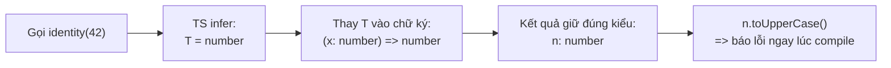

# Generics

**Generic** (kiểu tổng quát, tái dùng cho nhiều kiểu) cho phép bạn viết hàm, interface hay class hoạt động với nhiều kiểu dữ liệu khác nhau mà vẫn giữ được an toàn kiểu. Thay vì viết riêng một phiên bản cho `number`, một phiên bản cho `string`, bạn dùng một tham số kiểu (thường ký hiệu là `T`) để đại diện cho kiểu sẽ được quyết định lúc sử dụng. Bài này giúp người mới học hiểu cách tạo code linh hoạt, tái dùng nhưng vẫn được trình biên dịch kiểm tra kiểu chặt chẽ.

---

:::note[Ghi nhớ nhanh]

- ⭐ **Generic `<T>` tham số hoá KIỂU** — viết một lần dùng cho nhiều kiểu mà vẫn type-safe, thay cho `any` (mất kiểm tra) hay viết trùng mỗi kiểu một bản.
- **Dùng được cho function, interface/type và class** — `first<T>`, `ApiResponse<T>`, `Stack<T>`; TS thường tự infer `T` từ đối số.
- ⭐ **Constraint bằng `extends` giới hạn đầu vào** — `T extends { length: number }` hay `K extends keyof T`, nhưng không thu hẹp kiểu `T` nhận vào.
- **Default type parameter `<T = string>`** — cho phép bỏ qua khi dùng, hữu ích khi viết library.
- **Quy ước tên `T`, `K`, `V`, `E`, `R`** — khi inference fail, TS widen về kiểu ít hữu dụng (vd `null`) nên truyền tường minh khi cần.

:::

---

## Mục lục

- [Vì sao generics ra đời?](#vì-sao-generics-ra-đời)
- [Generic là gì?](#generic-là-gì)
- [Generic function](#generic-function)
- [Generic interface và type](#generic-interface-và-type)
- [Generic class](#generic-class)
- [Generic Constraints](#generic-constraints)
- [Default type parameter](#default-type-parameter)
- [Câu hỏi phỏng vấn](#câu-hỏi-phỏng-vấn)

---

## Vì sao generics ra đời?

Khi muốn viết một hàm hay cấu trúc dữ liệu **tái sử dụng cho nhiều kiểu**,
ta chỉ có hai cách dở nếu không có generics.

**Vấn đề:**

```ts
// Cách 1 — dùng any: mất kiểm tra kiểu, mất autocomplete,
// mất luôn quan hệ giữa input và output
function identity(x: any): any {
  return x;
}

const n = identity(42);  // n: any — TS không còn biết đây là number
n.toUpperCase();         // không báo lỗi, sẽ crash lúc chạy

// Cách 2 — viết trùng mỗi kiểu một bản
class NumberBox { constructor(public value: number) {} }
class StringBox { constructor(public value: string) {} }
// ... lặp lại mãi cho mỗi kiểu mới
```

**Giải pháp:**

```ts
// Generics <T>: tham số hoá KIỂU, giữ nguyên quan hệ input → output,
// vẫn type-safe + autocomplete
function identity<T>(x: T): T {
  return x;
}

const n = identity(42);   // n: number — TS giữ đúng kiểu
n.toUpperCase();          // Error — bắt lỗi ngay lúc biên dịch

// Một class dùng cho mọi kiểu
class Box<T> { constructor(public value: T) {} }
const box = new Box("hi"); // Box<string>
```

Generics còn hỗ trợ **ràng buộc** với `extends` và **kiểu mặc định** (default
type) để vừa linh hoạt vừa chặt chẽ.

:::tip[Dùng thực tế]

- **Hàm tiện ích**: `first<T>(arr: T[]): T | undefined` — lấy phần tử đầu cho mảng bất kỳ.
- **Cấu trúc dữ liệu**: `Stack<T>`, `Queue<T>` — một bản dùng cho mọi kiểu phần tử.
- **Kiểu API response**: `ApiResponse<T>` — bọc dữ liệu trả về theo từng loại resource.
- **Promise / hook / repository**: `Promise<User>`, `Repository<T>` — giữ đúng kiểu khi bất đồng bộ hoặc truy xuất dữ liệu.

:::

---

## Generic là gì?

Generic là **biến của type** — cho phép viết một đoạn code làm việc với
**nhiều kiểu**, mà vẫn giữ type-safe.

Vấn đề khi không có generic:

```ts
function identityNum(x: number): number { return x; }
function identityStr(x: string): string { return x; }
function identityBool(x: boolean): boolean { return x; }
// ... lặp lại mãi
```

Giải pháp — generic:

```ts
function identity<T>(x: T): T {
  return x;
}

identity<number>(42);   // T = number
identity("hello");      // T = "hello" (TS infer)
```

Luồng làm việc của generic khi bạn gọi hàm: TS suy ra `T` từ đối số, thay vào chữ ký hàm, rồi giữ đúng kiểu ở kết quả:



---

## Generic function

`<T>` đặt sau tên hàm — TS sẽ infer hoặc bạn truyền tường minh.

```ts
function first<T>(arr: T[]): T | undefined {
  return arr[0];
}

const a = first([1, 2, 3]);       // T = number → number | undefined
const b = first(["a", "b"]);      // T = string → string | undefined
```

Nhiều type parameter:

```ts
function pair<A, B>(a: A, b: B): [A, B] {
  return [a, b];
}

pair(1, "x"); // [number, string]
```

---

## Generic interface và type

```ts
interface ApiResponse<T> {
  data: T;
  error: string | null;
}

const userResp: ApiResponse<User> = {
  data: { id: 1, name: "An" },
  error: null,
};
```

```ts
type Result<T, E = Error> =
  | { ok: true; value: T }
  | { ok: false; error: E };
```

---

## Generic class

```ts
class Stack<T> {
  private items: T[] = [];

  push(item: T) { this.items.push(item); }
  pop(): T | undefined { return this.items.pop(); }
  peek(): T | undefined { return this.items[this.items.length - 1]; }
}

const s = new Stack<number>();
s.push(1);
const top = s.peek(); // type: number | undefined
```

---

## Generic Constraints

Dùng `extends` để **giới hạn** type parameter.

```ts
function longest<T extends { length: number }>(a: T, b: T): T {
  return a.length >= b.length ? a : b;
}

longest("hello", "world");        // OK — string có length
longest([1, 2, 3], [4]);          // OK — array có length
longest(10, 20);                  // Error — number không có length
```

Constraint với `keyof`:

```ts
function getProp<T, K extends keyof T>(obj: T, key: K): T[K] {
  return obj[key];
}

const user = { id: 1, name: "An" };
getProp(user, "id");      // type: number
getProp(user, "email");   // Error — không phải key
```

:::info[Phân tích]

Constraint **không làm hẹp** type bạn nhận — nó chỉ là điều kiện đầu vào.
Type parameter `T` vẫn là chính nó, không bị "thu hẹp" về constraint:

```ts
function getName<T extends { name: string }>(x: T) {
  return x.name; // OK
  // Nhưng nếu x có thêm field khác, vẫn giữ trong T
}

const u = getName({ name: "An", age: 25 });
// TS biết kết quả vẫn là từ object có name + age
```

Đây là khác biệt quan trọng so với việc khai báo trực tiếp:

```ts
function getName2(x: { name: string }) {
  // x bị "thu hẹp" — TS quên các field khác
}
```

→ Khi viết util hàm cần **giữ nguyên type đầu vào**, luôn dùng generic
+ constraint thay vì khai báo type cụ thể.

:::

---

## Default type parameter

Có thể đặt **giá trị mặc định** cho type parameter:

```ts
interface Container<T = string> {
  value: T;
}

const a: Container = { value: "hello" };        // T = string (mặc định)
const b: Container<number> = { value: 42 };     // T = number
```

Hữu dụng khi viết library — caller chỉ cần override khi muốn khác:

```ts
type Event<TPayload = unknown> = {
  type: string;
  payload: TPayload;
};
```

:::tip[Mẹo]

**Quy ước đặt tên** type parameter:

- `T` — type chung (default).
- `K` — key (dùng với `keyof`).
- `V` — value.
- `E` — element (mảng).
- `P` — property.
- `R` — return type.

Hoặc tên đầy đủ khi nhiều parameter: `<TUser, TOrder, TPayment>` — giúp
đọc dễ hơn `<T, U, V>` khi generic phức tạp.

:::

:::warning[Cần lưu ý]

**Inference fail** thường gặp với generic — khi TS không có đủ thông tin
để suy ra `T`, nó sẽ widen lên `unknown`:

```ts
function wrap<T>(value: T): { value: T } {
  return { value };
}

const a = wrap("hi");       // T = string ✓
const b = wrap(null);       // T = null (literal, ít hữu dụng)
```

Khi cần fallback rõ ràng, truyền tường minh hoặc dùng default:

```ts
wrap<string | null>(null); // T = string | null
```

:::

---

## Câu hỏi phỏng vấn

Những câu thường gặp về chủ đề này. Tự trả lời trước, rồi đối chiếu lại với nội dung phía trên.

1. Generic giải quyết được vấn đề gì mà `any` không giải quyết được? Nêu cụ thể thứ bị mất khi dùng `any`.
2. Khi nào TypeScript tự suy luận (infer) được tham số kiểu `T`, và khi nào bắt buộc phải truyền tường minh?
3. Ý nghĩa của constraint `T extends ...`? Vì sao constraint **không** thu hẹp kiểu thực tế mà `T` nhận vào bên trong hàm?
4. Giải thích `K extends keyof T` và indexed access `T[K]`. Viết chữ ký cho hàm `getProperty` truy cập an toàn một field.
5. Khác biệt về thông tin kiểu tại nơi gọi giữa `f<T>(x: T[])` và `f(x: unknown[])` là gì?
6. Default type parameter (`T = string`) hoạt động ra sao? Nó có can thiệp vào inference không?
7. Phân biệt generic đặt trên class, trên interface/type alias, và trên method của class — phạm vi (scope) của tham số kiểu khác nhau thế nào?
8. Vì sao có lúc TS infer `T` thành literal (`"a"`) và có lúc widen thành `string`? `as const` thay đổi điều gì?
9. Thế nào là một **generic thừa** (useless generic)? Dấu hiệu nào cho thấy tham số kiểu nên thay bằng kiểu cụ thể hoặc `unknown`?
10. Với `T extends object = Record<string, unknown>`, quan hệ giữa phần constraint và phần default là gì?
11. Giải thích variance trong hệ kiểu structural của TS: `Box<Dog>` có gán được cho `Box<Animal>` không? Annotation `in` / `out` (TS 4.7+) dùng để làm gì?
12. Generic constraint đệ quy là gì? Cho một ví dụ và nói rõ rủi ro về hiệu năng biên dịch.
13. Khi cần suy luận từ đối số truyền vào, nên đặt tham số kiểu ở cấp class hay cấp method? Vì sao?
14. `NoInfer<T>` (TS 5.4+) dùng để làm gì? Nêu một tình huống nó cứu được inference sai.
15. `const` type parameter (`<const T>`, TS 5.0+) khác gì với việc bắt caller tự viết `as const`?
16. Đọc hiểu: `function pipe<A, B, C>(f: (a: A) => B, g: (b: B) => C): (a: A) => C` — mô tả chuỗi inference xảy ra khi gọi `pipe`.
17. Vì sao trộn generic với overload thường làm API khó dùng? Có cách nào thay thế gọn hơn?
18. Higher-kinded type (generic của generic) không có trong TS — người ta thường workaround bằng kỹ thuật gì?
19. Generic ảnh hưởng thế nào tới thời gian type-check của dự án lớn? Bạn phát hiện và xử lý một generic "đắt" ra sao?

