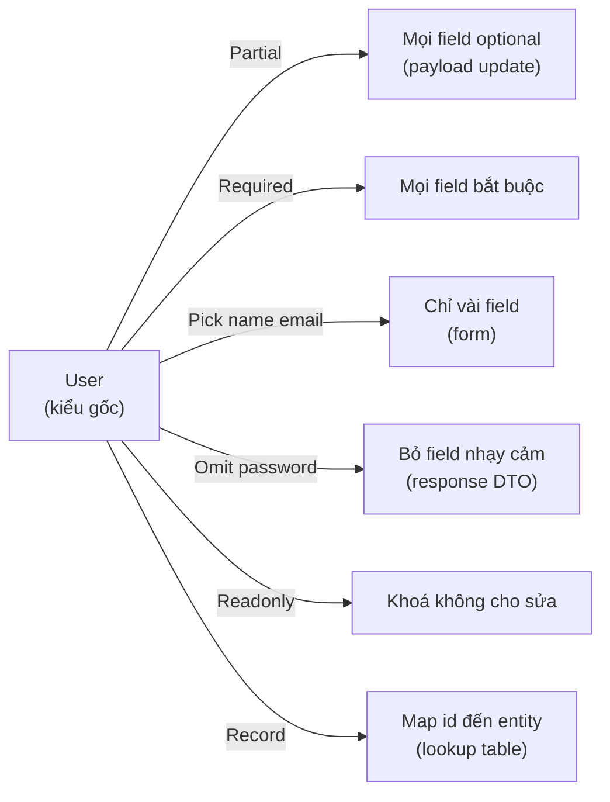

# Utility Types

**Utility type** (kiểu tiện ích dựng sẵn) là các kiểu có sẵn trong TypeScript giúp bạn biến đổi nhanh một kiểu đã có thành kiểu mới mà không phải viết lại từ đầu. Ví dụ `Partial` làm mọi thuộc tính thành tùy chọn, `Pick` chọn ra một vài thuộc tính, `Readonly` khóa không cho sửa. Bài này giúp người mới học nắm các utility type thông dụng để xử lý kiểu gọn gàng và ít lặp lại hơn.

---

:::note[Ghi nhớ nhanh]

- ⭐ **Utility type biến đổi kiểu gốc thành biến thể tự động (DRY)** — sửa kiểu gốc thì mọi biến thể cập nhật theo, không phải định nghĩa lại thủ công.
- **`Partial`/`Required` bật tắt optional, `Readonly` khóa sửa** — lưu ý `Readonly` chỉ shallow, object lồng bên trong vẫn sửa được.
- **`Pick`/`Omit` chọn/bỏ key, `Record<K, V>` tạo map key→value** — `Omit` cực hữu dụng cho DTO (bỏ field nhạy cảm như `password`).
- **`Exclude`/`Extract`/`NonNullable` lọc union; `Parameters`/`ReturnType`/`InstanceType`** — lấy kiểu từ function/class mà không khai báo lại.
- ⭐ **`Awaited<T>` (TS 4.5+) lấy kiểu bên trong Promise** — kết hợp `as const` + `typeof` để tạo type từ giá trị (single source of truth).

:::

---

## Mục lục

- [Vì sao có utility types?](#vì-sao-có-utility-types)
- [Partial và Required](#partial-và-required)
- [Readonly](#readonly)
- [Pick và Omit](#pick-và-omit)
- [Record](#record)
- [Exclude, Extract, NonNullable](#exclude-extract-nonnullable)
- [Parameters, ReturnType, InstanceType](#parameters-returntype-instancetype)
- [Awaited](#awaited)
- [Câu hỏi phỏng vấn](#câu-hỏi-phỏng-vấn)

---

## Vì sao có utility types?

Từ một kiểu gốc như `User`, ta thường cần nhiều **biến thể**: bản tất cả optional (cho update), bản chỉ vài field (cho form), bản readonly... Nếu định nghĩa lại thủ công thì trùng lặp, và khi `User` đổi field phải sửa khắp nơi — rất dễ sót.

**Vấn đề:**

```ts
interface User { id: number; name: string; email: string; }

// Định nghĩa lại thủ công cho mỗi biến thể — trùng lặp
interface UserUpdate { id?: number; name?: string; email?: string }
interface UserForm   { name: string; email: string }
interface UserRO     { readonly id: number; readonly name: string; readonly email: string }

// Thêm field "phone" vào User → phải nhớ sửa cả 3 chỗ trên, dễ sót
```

**Giải pháp:**

```ts
interface User { id: number; name: string; email: string; }

type UserUpdate = Partial<User>;          // tất cả optional
type UserForm   = Pick<User, "name" | "email">; // chỉ vài field
type UserRO     = Readonly<User>;         // khóa không cho sửa

// Thêm field "phone" vào User → cả 3 biến thể tự cập nhật theo
```

Utility types là các phép **biến đổi kiểu** dựng sẵn (`Partial<T>`, `Required<T>`, `Pick<T,K>`, `Omit<T,K>`, `Record<K,V>`, `Readonly<T>`, `ReturnType<T>`...), suy ra **tự động** từ kiểu gốc → DRY, gốc đổi thì biến thể cập nhật theo.

Sơ đồ dưới minh hoạ cách từ một kiểu gốc `User` sinh ra nhiều biến thể qua các utility type khác nhau:



:::tip[Dùng thực tế]

- **Payload update**: dùng `Partial<User>` để client chỉ gửi field cần đổi.
- **Chọn field cho form/response**: dùng `Pick<User, ...>` hoặc `Omit<User, "password">`.
- **Map id → entity**: dùng `Record<string, User>` cho cache hoặc lookup table.
- **Props bất biến**: dùng `Readonly<Props>` để khóa, tránh mutate nhầm.

:::

---

## Partial và Required

`Partial<T>` — biến mọi property thành **optional**.

```ts
interface User { id: number; name: string; email: string; }

type UserUpdate = Partial<User>;
// { id?: number; name?: string; email?: string }

function update(id: number, data: Partial<User>) { /* ... */ }
update(1, { name: "An" }); // OK, chỉ truyền field cần
```

`Required<T>` — ngược lại, bắt **mọi field bắt buộc**.

```ts
interface Config { host?: string; port?: number; }

type StrictConfig = Required<Config>;
// { host: string; port: number }
```

---

## Readonly

`Readonly<T>` — mọi property thành **không sửa được**.

```ts
type FrozenUser = Readonly<User>;

const u: FrozenUser = { id: 1, name: "An", email: "a@b.c" };
u.name = "Bình"; // Error
```

:::warning[Cần lưu ý]

`Readonly` chỉ **shallow** — không đệ quy. Property là object nested vẫn
sửa được:

```ts
type Config = Readonly<{ db: { host: string } }>;
const c: Config = { db: { host: "localhost" } };
c.db.host = "x"; // Vẫn OK! (db không readonly)
```

Cần đệ quy phải tự viết `DeepReadonly<T>` hoặc dùng thư viện
(`type-fest`).

:::

---

## Pick và Omit

`Pick<T, K>` — **lấy** một số key.

```ts
interface User { id: number; name: string; email: string; password: string; }

type UserPublic = Pick<User, "id" | "name">;
// { id: number; name: string }
```

`Omit<T, K>` — **loại bỏ** một số key.

```ts
type UserSafe = Omit<User, "password">;
// { id: number; name: string; email: string }
```

:::tip[Mẹo]

`Omit` cực hữu dụng cho **DTO** — định nghĩa một entity gốc rồi tạo
variant không có field nhạy cảm:

```ts
type UserEntity = { id: number; name: string; password: string; };
type UserResponse = Omit<UserEntity, "password">;
type UserCreateRequest = Omit<UserEntity, "id">;
```

Một nguồn sự thật, nhiều biến thể — sync tự động khi entity thay đổi.

:::

---

## Record

`Record<K, V>` — tạo object có **key** kiểu `K`, **value** kiểu `V`.

```ts
type Role = "admin" | "user" | "guest";
type Permissions = Record<Role, string[]>;

const perms: Permissions = {
  admin: ["read", "write", "delete"],
  user:  ["read", "write"],
  guest: ["read"],
};
```

Thiếu key sẽ báo lỗi — TS đảm bảo **đủ** mọi role.

---

## Exclude, Extract, NonNullable

`Exclude<T, U>` — loại bỏ các thành phần trong `T` thuộc `U`.

```ts
type T1 = Exclude<"a" | "b" | "c", "a">; // "b" | "c"
type T2 = Exclude<string | number | null, null>; // string | number
```

`Extract<T, U>` — ngược lại, **lấy** các thành phần.

```ts
type T3 = Extract<"a" | "b" | "c", "a" | "c">; // "a" | "c"
```

`NonNullable<T>` — loại `null` và `undefined`.

```ts
type T4 = NonNullable<string | null | undefined>; // string
```

---

## Parameters, ReturnType, InstanceType

Lấy type **liên quan đến function/class** mà không cần khai báo lại.

```ts
function createUser(id: number, name: string): User {
  return { id, name, email: "", password: "" };
}

type Args = Parameters<typeof createUser>;     // [number, string]
type Ret  = ReturnType<typeof createUser>;     // User
```

```ts
class Logger { log(msg: string) {} }

type LoggerInstance = InstanceType<typeof Logger>; // Logger
```

:::info[Phân tích]

`typeof someFunction` lấy **function type** của giá trị, dùng kết hợp
với utility:

```ts
const config = { url: "/api", timeout: 5000 };
type Config = typeof config; // { url: string; timeout: number }
```

Pattern này — kết hợp `as const` + `typeof` + utility — là cách viết
**type từ giá trị** (single source of truth) thay vì duy trì hai chỗ:

```ts
const STATUS = ["pending", "active", "done"] as const;
type Status = typeof STATUS[number]; // "pending" | "active" | "done"
```

:::

---

## Awaited

`Awaited<T>` — lấy type **bên trong Promise** (đệ quy với nested Promise).

```ts
type A = Awaited<Promise<string>>;          // string
type B = Awaited<Promise<Promise<number>>>; // number

async function fetchUser(): Promise<User> {
  return null as any;
}

type FetchResult = Awaited<ReturnType<typeof fetchUser>>; // User
```

:::tip[Mẹo]

`Awaited` (TS 4.5+) thay thế hoàn toàn cách viết cũ:

```ts
// Cũ — khó nhớ, error-prone
type Unwrap<T> = T extends Promise<infer U> ? U : T;

// Mới — chuẩn library
type Unwrap<T> = Awaited<T>;
```

Khi đọc kiểu `Awaited<ReturnType<typeof asyncFn>>` thấy quen rồi sẽ rất
nhanh — đây là pattern xuất hiện đầy trong codebase Next.js, tRPC...

:::

---

## Câu hỏi phỏng vấn

Những câu thường gặp về chủ đề này. Tự trả lời trước, rồi đối chiếu lại với nội dung phía trên.

1. `Partial`, `Required`, `Readonly` được cài đặt thế nào bằng mapped type? Hãy viết lại `Partial` bằng tay.
2. Vì sao `Partial` và `Readonly` chỉ **shallow**? Khi nào cần `DeepPartial` và rủi ro kèm theo là gì?
3. `Pick` và `Omit` khác nhau ra sao? `Omit` được dựng lại từ `Pick` và `Exclude` như thế nào?
4. Vì sao `Omit` **không** báo lỗi khi truyền một key không tồn tại, còn `Pick` thì có? Viết một `StrictOmit` an toàn hơn.
5. `Record<K, V>` dùng khi nào? Khác gì với index signature dạng `[key: string]: V`?
6. Phân biệt `Exclude` với `Omit`, và `Extract` với `Pick` — cặp nào làm việc trên union, cặp nào trên object?
7. `NonNullable<T>` khác gì so với việc bật `strictNullChecks`? Hai thứ này thay thế nhau được không?
8. `ReturnType`, `Parameters`, `InstanceType`, `ConstructorParameters` lấy thông tin bằng cơ chế nào bên dưới?
9. `Awaited<T>` xử lý Promise lồng nhau ra sao? Vì sao nó thay thế được cách viết cũ với `infer`?
10. Trong `ReturnType<typeof fn>`, `typeof` đóng vai trò gì? Vì sao không viết trực tiếp `ReturnType<fn>` được?
11. Khi áp `Partial` lên một union type, kết quả có phân tán (distribute) trên từng nhánh không? Còn `Omit` thì sao?
12. `Pick` / `Omit` làm mất đi những gì khi áp lên type có index signature, có method overload, hoặc có call signature?
13. Utility type nào phù hợp nhất để tạo DTO ẩn field nhạy cảm như `password`? Vì sao nên ưu tiên nó hơn khai báo một interface mới?
14. `Uppercase`, `Lowercase`, `Capitalize`, `Uncapitalize` thuộc nhóm nào và được cài đặt ở đâu? Vì sao không viết lại chúng bằng TS thuần được?
15. `ThisType`, `Omit` với generic chưa gán, và `Extract` với `never` — chuyện gì xảy ra khi kết quả rút gọn về `never`?
16. Vì sao lạm dụng chuỗi utility lồng nhau kiểu `Partial<Omit<Pick<T, K>, K2>>` là code smell? Bạn refactor thế nào cho dễ đọc?

